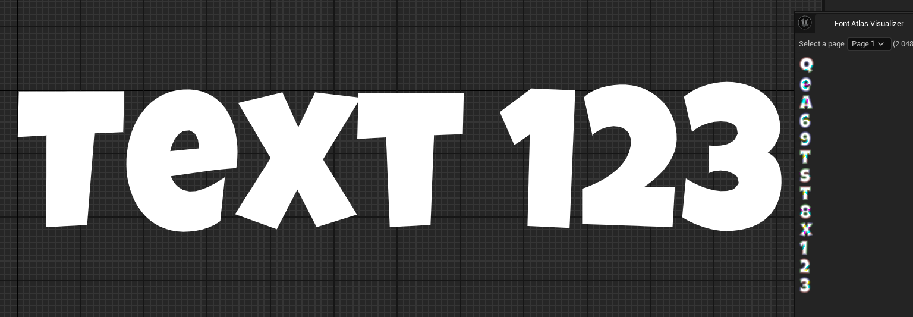
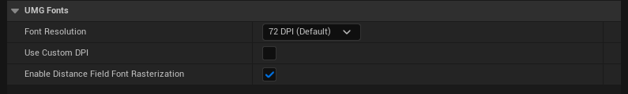
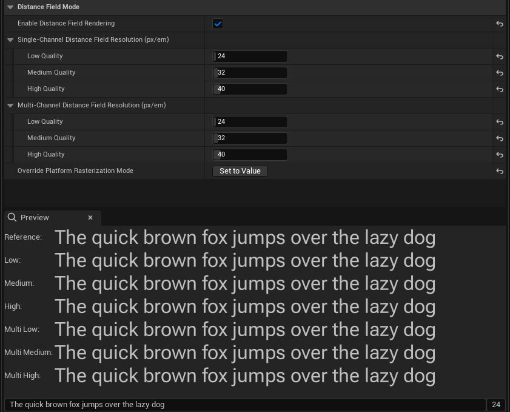
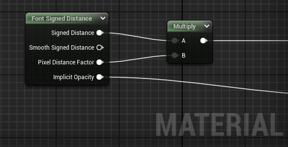
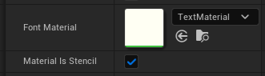

# Signed Distance Field Text Rendering

> 路径：虚幻引擎5.7文档 / 创建用户界面 / 文本格式设置、本地化和字体 / Signed Distance Field Text Rendering

> 原始页面：https://dev.epicgames.com/documentation/unreal-engine/using-signed-distance-field-text-rendering-in-unreal-engine

在 Unreal Engine（UE）5.5 及更新版本中，可以为任意 UI（用户界面）文本使用 **基于有符号距离场的文本渲染** 。这包括 **传统有符号距离场** 以及 **多通道有符号距离场（MSDF）**，它可以保留锐利转角。

有符号距离场是存储在纹理内存中的单个字体字形的近似表示，与分辨率无关；它可以被着色以输出字形的抗锯齿 alpha 遮罩。此外，它还可以向材质着色器提供有符号距离，材质可用它制作图形效果。有符号距离表示到最近边缘点的距离，符号表示原点位于内部（正值）还是外部（负值）。

左侧是基于有符号距离场的文本渲染结果，右侧是包含有符号距离场的实际纹理。

距离场模式不会替代旧的文本渲染管线，而是作为一种有利有弊的替代方案提供。

## 优点

- 与分辨率无关意味着不必为每种字形尺寸（以及倾斜、描边尺寸）准备单独的纹理表示，可能节省纹理内存并提升性能。
- 非常大的文本也可以从低分辨率距离场以良好质量渲染，从而节省纹理内存。
- 使用距离场制作文本描边效率显著更高，并且不需要额外纹理内存。
- 支持基于距离的材质效果，例如描边、辉光、生长动画等。

## 缺点

- 计算距离场比直接光栅化更耗费计算资源。
- 作为一种与分辨率无关的技术，它不支持 hinting。这可能会对小字号质量产生负面影响。
- 距离场是一种近似表示。根据其分辨率，它们可能只能以足够保真度再现部分字形特征。较细字重以及细小精致特征通常最容易出问题。请考虑所用字体面是否适合距离场渲染。
- 初始版本不支持具有非标准几何结构的字体面。

当非常大的文本或动态缩放文本需要在大量不同尺寸下使用同一字体面，或需要在材质效果中利用有符号距离时，建议启用距离场模式。

## 设置与使用

要完成设置，请执行以下步骤：

1. 打开 **Project Settings > Engine > User Interface > UMG Fonts**.
2. 启用 **Enable Distance Field Font Rasterization** 设置。

   
3. 打开想要用于距离场文本渲染的字体面资产。
4. 在 **Details** 面板中，找到 **Distance Field Mode** 分类，然后启用 **Enable Distance Field Rendering** 设置。启用该设置后，可以为单通道和多通道距离场分辨率配置质量等级。

   

## 配置

启用此渲染模式后，可以为低、中、高质量等级设置单通道和多通道距离场分辨率。这些分辨率以每个“em”的距离场像素表示（em 是一种字体面度量，近似表示字母“M”的宽度）。

可以预览所有分辨率和两种距离场类型的渲染输出，也可以预览直接从矢量几何光栅化得到的“参考”外观。请确保所有相关字形在所有质量等级下都达到可接受质量，并检查可能包含细小特征的潜在问题字形。经验上，距离场分辨率应足够高，使每个这类小特征中至少能容纳一个完整距离场像素。

距离场类型（多通道、单通道和近似）以及使用的质量等级由 [设备配置文件](../../../sharing-and-releasing-projects/tools-for-general-platform-support/setting-up-device-profiles/index.md)决定，可按设备指定。在设备配置文件中设置以下 CVar，以自定义使用的光栅化模式和质量等级。

| **CVar** | **说明** |
| --- | --- |
| `UI.SlateSDFText.RasterizationMode` | 光栅化模式或距离场类型。 |
| `UI.SlateSDFText.ResolutionLevel` | 距离场分辨率质量等级。值为 1（低）、2（中）和 3（高质量）。 |

The following are valid values for `UI.SlateSDFText.RasterizationMode`.

| **值** | **说明** |
| --- | --- |
| **Bitmap** | 直接光栅化。它会为给定设备禁用距离场渲染。 |
| **Msdf** | 多通道有符号距离场渲染。使用其中一个多通道分辨率。 |
| **Sdf** | 传统单通道有符号距离场渲染。转角可能显得圆化或残缺，并且无法使用斜接描边。 |
| **SdfApproximation** | 精度较低的 Sdf 版本。它提供相近质量，但性能开销显著更低。建议用于性能较弱的设备，例如移动电话。 |

也可以在 Unreal Editor 中该字体资产的设置里覆盖特定字体面的光栅化模式。

## 材质效果

要在材质效果中使用字体有符号距离，可以使用新的 **Font Signed Distance** 材质节点。

当前该节点没有输入，并会在当前像素采样文本的有符号距离。它提供以下输出：

| **输出** | **说明** |
| --- | --- |
| **Signed Distance** | 主要有符号距离，以“em”为单位表示。字形外部为负值，内部为正值。使用多通道有符号距离场时，该值为垂直距离，会在转角处形成锐利而非圆滑的斜接。 |
| **Smooth Signed Distance** | 欧几里得有符号距离，以“em”为单位表示。负值代表外部，正值代表内部。如果使用单通道距离场，该值与主要 Signed Distance 相同。 |
| **Pixel Distance Factor** | 用于将上述有符号距离从“em”转换为屏幕像素的乘数值。 通常可用于抗锯齿，例如在两个颜色之间平滑过渡。 `threshold distance - 0.5 px` and `threshold distance + 0.5 px`. |
| **Implicit Opacity** | 当有符号距离按无材质渲染时的方式解释时，文本的隐式不透明度。它可以作为添加额外效果前的基础。 |

> [!NOTE]
> 距离场只会在字体字形内部及周围提供有限范围的有符号距离。如果材质效果需要离字形更远的距离，可以为文本设置与效果宽度相近的描边，从而强制生成距离范围更宽的距离场。

默认情况下，只有文本内部区域会被材质填充。如果效果需要在文本周围绘制（例如辉光效果），应启用新选项 **Material Is Stencil** 。启用该选项后，整个字形四边形都会被材质填充，材质需要正确设置不透明度，以裁出字形形状。可以使用 **Implicit Opacity** （如上所述），也可以用有符号距离以自定义方式实现。

