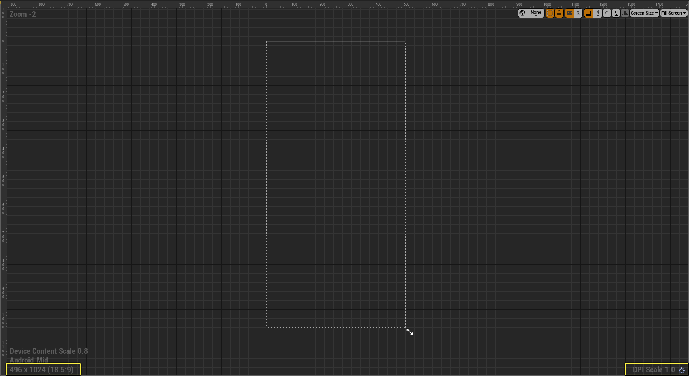
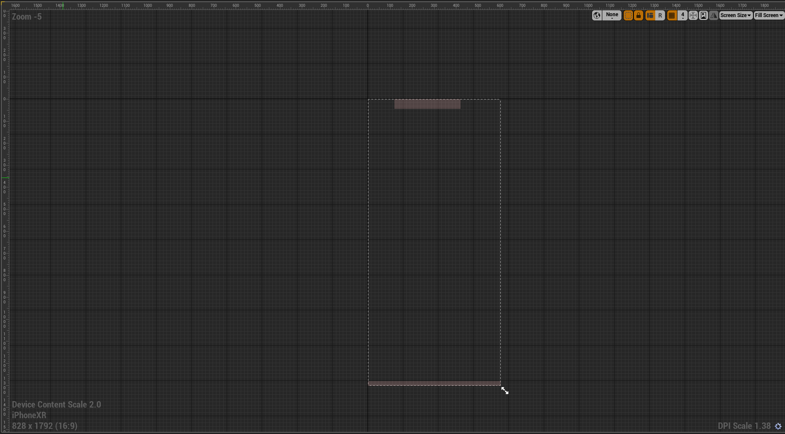

# 为不同设备缩放UI

> 路径：虚幻引擎5.7文档 / 创建用户界面 / 用户界面教程和示例 / 为不同设备缩放UI

> 原始页面：https://dev.epicgames.com/documentation/unreal-engine/scaling-ui-for-different-devices-in-unreal-engine

使用项目的UI时，也许已确定发布项目的目标设备。建议在多个设备或多个平台上进行发布。 在虚幻引擎中，通过使用 **DPI缩放** 规则的自动独立分辨率UI缩放，可创建多个设备的分辨率缩放。

通过DPI缩放功能，可定义 **DPI缩放规则** 和 **DPI曲线**，以便根据不同分辨率自动缩放用户界面的元素。 **DPI缩放规则** 决定要应用的比例，**DPI曲线** 包含不同分辨率和相应缩放值。 使用此类选项可快速简便地将手机等设备的UI屏幕转换至平板电脑或PC，并适应一系列设备分辨率。

本操作指南中将设置初始高宽比，然后将另一设备的比例添加至该缩放。

> [!NOTE]
> 欲了解DPI缩放规则和曲线的更多信息，参见[DPI 缩放](../../umg-editor-reference/dpi-scaling/index.md)。

## 缩放UI到1

为正确缩放UI，需指定首个设备的高宽比范围，并将其缩放比例设为1。

> [!NOTE]
> 本操作指南将使用 **First Person Template**。也可使用任意项目进行操作。

1. 前往 **内容浏览器>新增>用户界面**，创建名为 **DPIWidget** 的 **控件蓝图**。
2. 在 **DPIWidget** 中的 **屏幕尺寸** 下拉菜单内，选择设备高宽比。

   本例中将使用安卓手机作为首个设备。

   > [!NOTE]
   > 在UE4中，屏幕尺寸选项将根据各版本发布时批准和支持的设备自动更新。
3. 注意左下角处分辨率高宽比和右下角的 **DPI缩放**。

   

   *点击查看大图*。

   通常最好以1.0比例设置UI元素，然后使用DPI缩放规则对其进行缩放。
4. 点击右下角的 **齿轮** 图标，打开 **用户界面设置** 窗口。

   > [!TIP]
   > 也可从项目的[项目设置](../../../understanding-the-basics/project-settings/index.md)访问用户界面设置。
5. 在 **DPI缩放**下，选择要使用的 **DPI缩放规则**。本例中将使用视口的 **最短边**。
6. 在 **DPI曲线** 上，在曲线上找到反映 **缩放** 值1.0的键。
7. 根据指定的缩放规则设置 **分辨率**。本范例使用最小边，因此分辨率会从1080重置为496。

   此为基础键，所有其他键根据其的变化而改变。若分辨率值稍有偏差，如496.000061，这是因为尚未设置分辨率的范围。
8. 在图表上选中另一键，并将 **分辨率** 设为1，缩放设为 **495**。

   为确保UI元素在不同分辨率间正确设置，需此第二键来设置UI的指定分辨率范围，以正确渲染。

   > [!NOTE]
   > 可放大或缩小图表，获得该范围的细节视图或高级视图。
9. 返回DPIWidget蓝图，无论该设备的DPI缩放之前为何，现在其是1.0。

## 添加新设备比率

设置初始高宽比后，现在可添加更多不同设备的高宽比。

1. 选择 **屏幕尺寸** 下拉菜单，并选择不同高宽比，如平板电脑或不同的手机品牌。

   

   *点击查看大图*。

   本例中以iPhone为例。
2. 在 **DPI曲线** 的用户界面设置中，长按 **Shift** 键并 **点击左键**，新建两个键。
3. 在首个键中，将分辨率设为 **1079** ，缩放设为 **1.66**。
4. 在第二个键中，将分辨率设为 **1090** ，缩放设为 **1.66**。

   为决定此类键的新缩放，需找到首个设备和新设备的DPI缩放规则间的差异。在本例中，将新设备的最小边除以首个设备的最小边，即828除以496，得到的新缩放为1.66。

   > [!NOTE]
   > 添加更多设备时，将新节点的分辨率保持为 **1079** 和 **1090**，此为标准分辨率。缩放是随各新设备变化的变量。

DPI控件现已包括一部安卓手机和一部iPhone。重复以上步骤，可将更多新设备添加到控件缩放。

> [!TIP]
> 如放置控件时其偏离屏幕，可能需将控件固定在视口中的位置。参见[锚点](../../umg-editor-reference/umg-anchors-in-unreal-engine-ui/index.md)，了解固定控件的更多相关信息。
