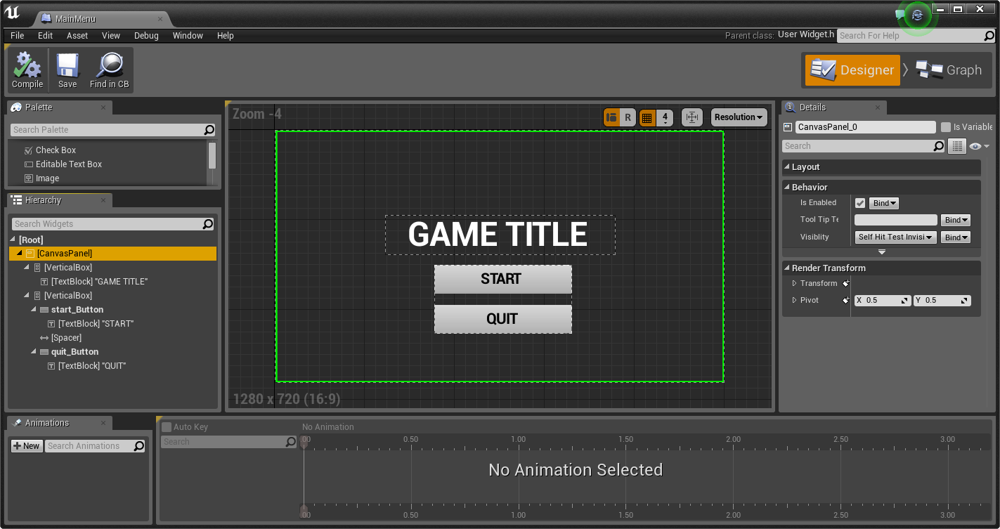

# 制作UMG控件动画

> 路径：虚幻引擎5.7文档 / 创建用户界面 / UMG编辑器参考 / 制作UMG控件动画

> 原始页面：https://dev.epicgames.com/documentation/unreal-engine/animating-umg-widgets-in-unreal-engine

**控件蓝图编辑器** 的底部有两个窗口，可用来实施和控制 UI 控件的动画。第一个是 **动画** 窗口，可以创建用来驱动控件动画的基础动画轨。第二个是 **时间轴** 窗口，用于指定动画如何随时间应用至控件，其方法是在指定的时间上放置 **关键帧** 并定义附加的控件在该关键帧如何显示（可以是尺寸、形状、位置甚至颜色选项）。

## 添加动画

为了开始在 UMG 中添加动画，您首先需要添加一个动画轨。可以在 **动画** 窗口中单击 **+动画** 按钮添加动画轨。添加动画后（下图中的黄框），会收到提示为动画轨输入一个名称。

添加动画轨后，**时间轴** 将会变为可用，并且您可以开始添加 **动画关键帧**，动画关键帧与控件随时间改变的值是相关的。同时也请注意每个控件可以有多个动画轨，例如使一个按钮在移过屏幕的同时进行闪烁。

## 添加动画关键帧

有两种方法向动画轨中添加关键帧。第一种方法是使用 **时间轴** 窗口中的 **自动关键帧** 复选框（下图中的黄框）。通过这种方式，当对支持关键帧的值进行修改时，会自动向时间轴中添加关键帧。

> [!NOTE]
> 目前选中的动画轨在 **时间轴** 的顶端突出显示（由上面的黄框表示）。

通过 **自动关键帧** 选项添加关键帧的一般流程为：为控件指定一个时间，使其在这个时间达到预定值，然后将 **时间轴滑块** 移动到这一时间上，并使用 **细节** 面板或网格（通常用于设置位置、旋转或缩放比例）来设置值。设置好最终结果后，滑动到序列的起始位置并设置控件的默认状态。在两个时间段之间滑动时间轴滑块时，应该可以看到随时间逐渐发生的变化。

第二种添加关键帧的方法是在支持关键帧的设置旁边单击 **添加关键帧** 按钮。

在上图中，每个设置旁边都有一个图标，可以单击这些图标向时间轴的当前位置添加一个该值的关键帧。在下图中，**背景颜色** 的关键帧添加到了 0.00 和 2.00，此处按钮控件的背景颜色在 2 秒内由白色变成黄色。

## 更改关键帧的值

按住 **Ctrl** 键并单击关键帧，可以更改时间轴上某一特定时间的多个关键帧的值。

上图中，我们选择了与包含按钮的垂直框的位置相关联的所有关键帧，以此通过 **细节** 面板手动设置这些关键帧。例如，我们想使对象只沿着一个轴移动，那么可以通过手动输入值来更精确地控制控件的移动。

## 调用动画

创建动画的同时也会为其创建一个变量。在 **我的蓝图** 窗口中，可以在 **图表** 选项卡上的 **动画** 下拉菜单下，看到已经创建的所有动画轨。通过按住 **Ctrl** 并将动画拖动到图表中，就可以对其发布命令，如播放或停止。

在此，我们令 **开始动画** 在控件蓝图构建好的时候开始播放。

并且在此我们使 **闪烁按钮** 动画在 **start_Button** 被单击时停止播放。

## 示例：带动画的主菜单

下面是两个示例动画，用来模仿一个简单的 **主菜单** 屏幕，其中按钮从屏幕底部飞入，而 **开始** 按钮不断闪烁。完成这些步骤后，应看到与下图中的示例类似的情况。

> [!NOTE]
> 本示例仅用于展示如何在 UMG 中设置动画，单击按钮不会有任何作用。

1. 按任意的方式设置主菜单，并在屏幕上包含一个具有 **按钮** 的 **垂直框**。

   

   *点击查看全图。*
2. 在 **动画** 窗口中单击 **新建** 按钮，并为动画命名，例如 **开始动画**。
3. 单击 **时间轴窗口** 中的 **自动关键帧** 按钮。
4. 将时间轴上的 **时间轴滑块** 移动到 **0.00**，然后单击包含按钮的 **垂直框**。
5. 按住 **Ctrl**，单击图案控件（黄色箭头）的中心并将 **垂直框** 拖出屏幕 (1)。

   这样即可在时间轴的当前位置上添加关键帧 (2)。
6. 在 **垂直框** 的 **细节** 面板中，单击 **锚** 并选择 **中下方** 选项。
7. 将 **时间轴滑块** 移动到 **1.00**，然后按住 **Ctrl**，单击并向上移动 **垂直框** 使其完全可见。
8. 在 **垂直框** 的 **细节** 面板中单击 **锚** 并选择 **居中** 选项。
9. 在 **动画** 窗口中，单击 **新建** 按钮添加另一个名为 **闪烁按钮** 的动画。

   确保未勾选 **自动关键帧**。
10. 将 **时间轴滑块** 移动到 **1.00** 并单击 **开始** 按钮将其选中。
11. 在 **细节** 面板中的 **外观** 部分下，单击 **背景颜色** 旁边的 **添加关键帧** 按钮。
12. 将 **时间轴滑块** 移动到 **2.00**，然后更改 **背景颜色** 的颜色并添加另一个关键帧。
13. 此时 **闪烁按钮** 动画的 **时间轴** 应与下图中一样。
14. 单击 **图表** 标签，将两个动画变量拖入其中，创建出下面所示的图表。

    在此，当控件蓝图构建好时，播放 **开始动画**（按钮从屏幕底部飞入）。然后使用 **Set Timer** 节点每隔 2 秒调用一次名为 **StartBlinking** 的 **自定义事件**（Set Timer 节点设置为循环）。然后 **StartBlinking** 自定义事件每隔 2 秒就播放 **闪烁按钮** 动画（该动画是指"开始"按钮随时间由白色变为绿色）。
15. 最后从 **关卡蓝图** 或您的可操纵角色蓝图创建控件蓝图。

    我们在 **我的角色** 蓝图中创建该控件（控件包含主菜单的动画和 UI 布局）并使用 **Add to Viewport** 节点将其添加到窗口。
