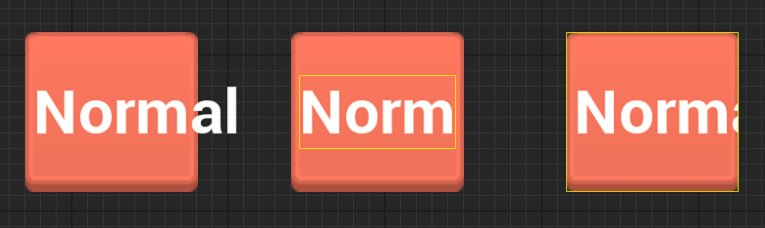
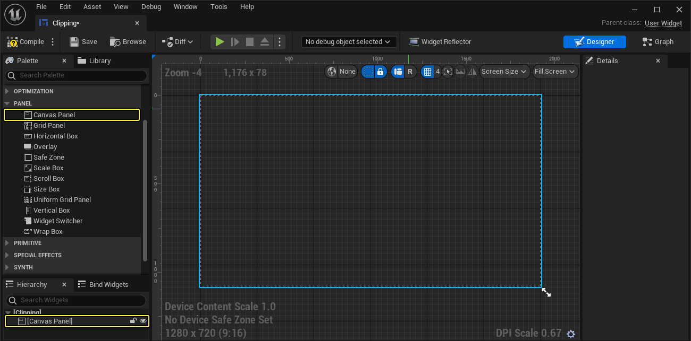
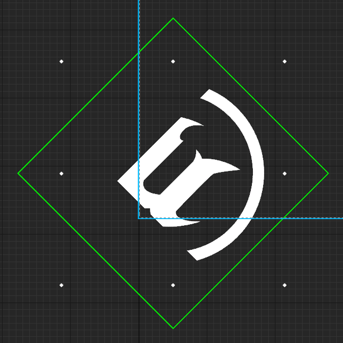
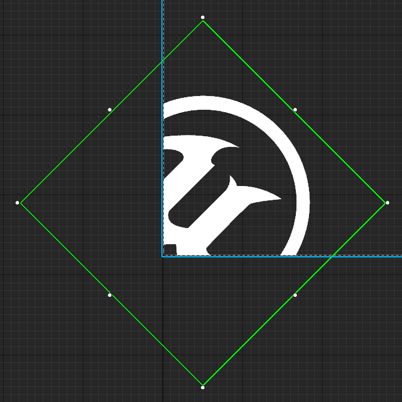
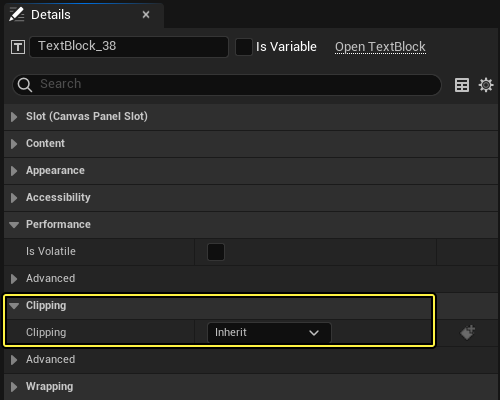

# 裁剪

> 路径：虚幻引擎5.7文档 / 创建用户界面 / UMG编辑器参考 / 裁剪

> 原始页面：https://dev.epicgames.com/documentation/unreal-engine/clipping-for-umg-widgets-in-unreal-engine

UMG中的裁剪系统使用 [Slate 裁剪系统](../../slate-user-interface-programming-framework/using-the-slate-clipping-system/index.md) 作为框架来控制为控件（或编辑器的其他部分） 显示文本、图像或内容的方式。 **裁剪** 的工作原理是使用边界框将渲染对象（图形和文本）限制在某个区域中，以使超出边界框的任何内容都不显示。裁剪系统现在为轴对齐裁剪， 这意味着它可以裁剪任何旋转，在这之前，由于变形处理方式的缘故，这是不可能的。

在本示例中，每个按钮都是显示的文本的父项。这些示例将展示是由按钮还是文本控制裁剪。

- 左图 - 按钮或文本上都未启用裁剪。
- 中图 - 文本上启用裁剪。
- 右图 - 按钮上启用裁剪。

**画布（Canvas）** 面板（又称裁剪区）的轮廓为蓝色，代表游戏屏幕，它将会裁剪（即不绘制）游戏超出该区域的任何内容。

在UMG设计器图形中，"画布（Canvas）面板"（蓝色）代表游戏屏幕的裁剪区。

在虚幻引擎4.16及更早版本中，控件的裁剪是使用布局空间处理的，它将阻止超出"画布（Canvas）"面板的内容渲染。因此，如果控件边界框的某部分 位于"画布（Canvas）"面板外面，它将不会被渲染，就算旋转了控件，控件边界框也不会使部分图像或文本被裁剪掉，即使它位于 "画布（Canvas）"面板中也不例外。

下面的示例展示了更改前后的对比：

渲染变形裁剪 | 在4.16及更低版本中。

渲染变形裁剪 | 在4.17及更高版本中。

图像控件（左侧）被放置在"画布（Canvas）"面板的边缘处，因此其部分边界框位于"画布（Canvas）"面板的外面。裁剪系统现在为轴对齐裁剪（而非使用布局空间）， 如对比（右侧）中所示，这种裁剪可以消除瑕疵和问题。

## 裁剪属性

可以在UMG **细节（Details）** 面板的 **裁剪（Clipping）** 部分下更改基于所选的控件处理裁剪的方式。

| 属性 | 说明 |
| --- | --- |
| **继承（Inherit）** | 该控件不裁剪子项，并且将遵循从父控件传入的任何裁剪/剔除。 |
| **裁剪至边界（Clip to Bounds）** | 该控件裁剪控件边界外的内容。它将边界与先前的裁剪区域相交。 |
| **裁剪至边界 - 无相交（Clip to Bounds - Without Intersecting）** | 此控件裁剪至其边界。它不与现有裁剪几何体相交，而是推送新的裁剪状态。这实际上会允许它在要裁剪的层级的边界之外渲染。 这并不会允许你忽略设置为 **裁剪至边界 - 总是（Clip to Bounds - Always）** 的裁剪区域 |
| **裁剪至边界 - 总是（Clip to Bounds - Always）** | 此控件裁剪至其边界。它会将这些边界与之前的裁剪区域相交。 此裁剪区域无法忽略，它将总是裁剪子项。这很适合UI中的硬屏障，因为你绝不会希望其中的动画或其他效果突破此区域。 |
| **按需（On Demand）** | 此控件会在其所需大小超过为该控件提供的已分配几何体时裁剪至其边界。如果发生该情况，它的作用将类似于 **裁剪至边界（Clip to Bounds）** 。 此模式主要为 **文本（Text）** 添加，它常常放置到最终会调整大小而无法支持文本长度的容器中。所以，无需标记可能包含带[YES]的文本的每个容器，从而几乎不会导致批处理，添加此模式是为了根据需要动态调整裁剪。并非每个容器都设为 **按需（On Demand）** ，因为并非每个面板返回的所需大小都与它计划渲染所用的大小匹配。 |

## 其他注意事项

- 在大部分情况下，都无需调整裁剪方法，除非你因无法控制文本的长度而需要裁剪它。例如，滚动框和可编辑文本控件就符合这种情况，它们被设置为

  裁剪至边界（Clip to Bounds）

  而非"继承（Inherit）"。
- 不同裁剪空间中的元素无法一起进行批处理，因此裁剪会带来性能成本。因此，除非面板真的需要阻止内容在其边界之外显示，否则请勿启用裁剪。
