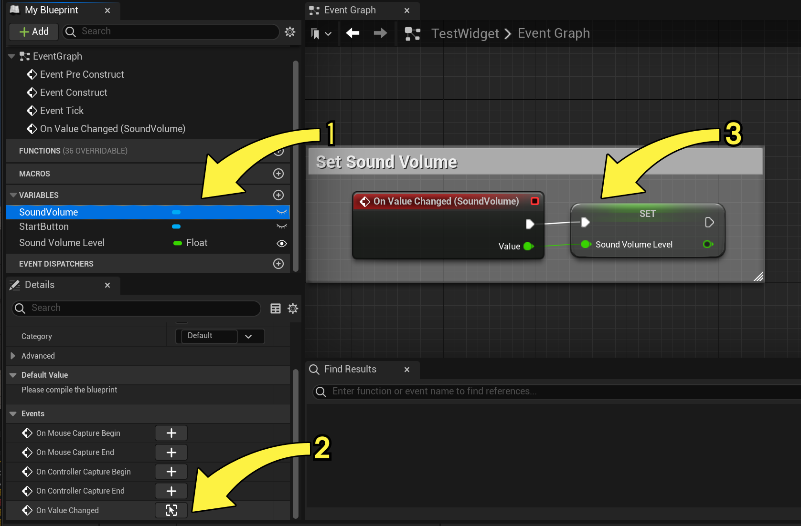

# UMG事件

> 路径：虚幻引擎5.7文档 / 创建用户界面 / UMG编辑器参考 / UMG事件

> 原始页面：https://dev.epicgames.com/documentation/unreal-engine/umg-events-in-unreal-engine

下面列出了几种可以在 **UMG** 中调用 **事件** 的方法。

## 可绑定事件

**可绑定事件** 是 UMG 用于模仿目前平板正在使用的行为的方式，平板需要一个处理程序来判断事件是否已处理。可以在 **事件** 部分下的 **细节** 面板中，将 **控件蓝图** 中的功能绑定到事件（由下图中的黄色箭头表示）。

一些控件通过处理 **交互** 来协助 **事件**（由上图中的黄框表示）。对于上面的示例，除了按钮控件的 **OnClicked** 事件，也可以通过设置 **单击方式** 或 **触控方式** 来指定单击事件的处理方式。也可以通过 **可聚焦** 选项指定按钮是否仅可以使用鼠标点击，不可用键盘选择。

### 多播事件

**多播事件** 是事件在 **蓝图** 中的标准处理方式。

要使用 **多播事件**，请单击 **我的蓝图** 选项卡中的 **控件** (1)，然后 **右键单击** **事件图表** (2)，这会在 **控件事件** 部分下面显示出可用事件，可以在其中选择想要分配的事件 (3)。

