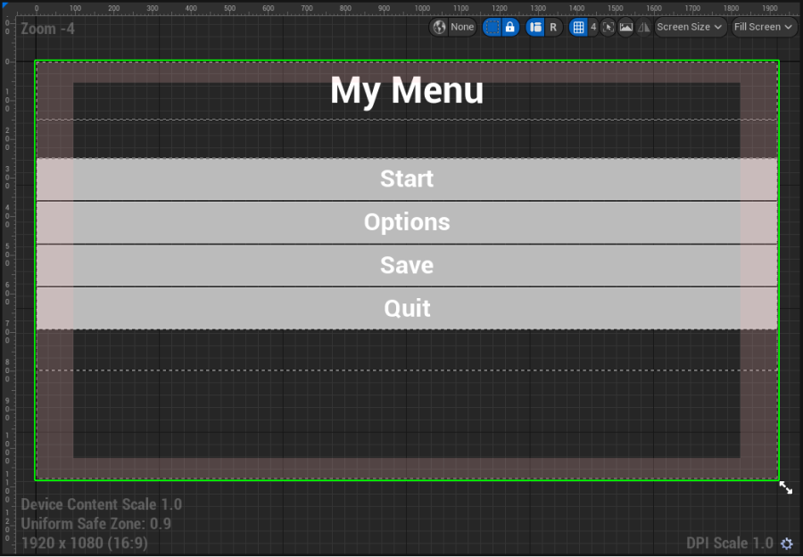
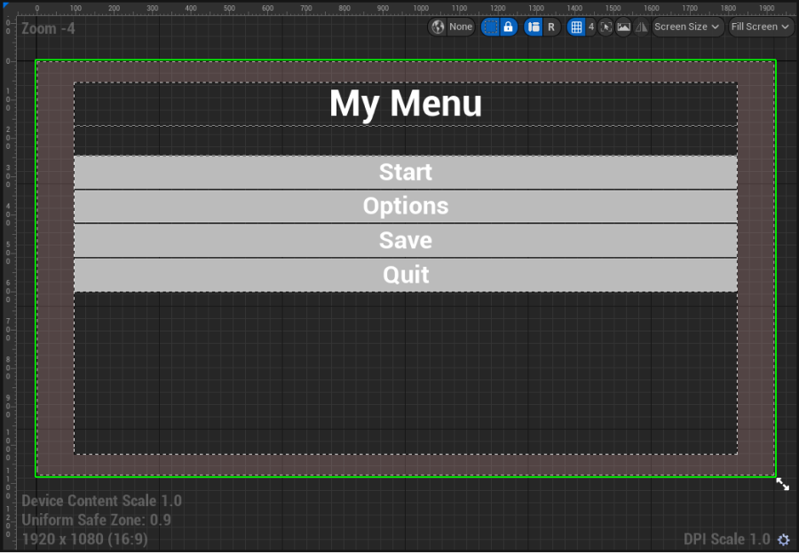
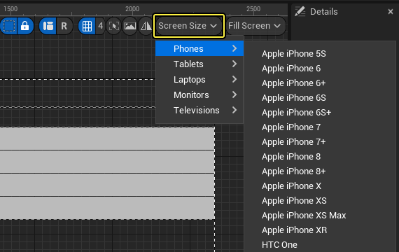

# UMG安全区

> 路径：虚幻引擎5.7文档 / 创建用户界面 / UMG编辑器参考 / UMG安全区

> 原始页面：https://dev.epicgames.com/documentation/unreal-engine/umg-safe-zones-in-unreal-engine

**安全区（Safe Zone）** 控件是开发能在许多不同设备上运行的游戏用户界面（UI）必不可少的组成部分。安全区的用途是避免在技术上能够使用但玩家看不到的地方显示UI，例如电视显示屏的边缘或iPhoneX上的黑色凹槽和主页栏下方的区域。UMG设计器让您可以测试您的UI和所应用的安全区控件在设备上的分辨率（或旋转）效果。

当您将 **安全区** 控件添加到 **设计器** 时，该控件将缩放 **层级（Hierarchy）** 面板中作为其子代的任何其他控件。这些子控件将在出现"不安全"区域时缩放和调整。

没有安全区控件

有安全区控件

在该示例中，1080p显示屏包含0.9（红色）的 **统一安全区（Uniform Safe Zone）**，用于测试和除错目的。当安全区控件有了子代控件后，子代控件就会根据安全区范围进行缩放。这样可防止被视为"不安全"的屏幕边缘处裁剪控件。正如示例中的"My Menu"标题文本所示。

## 设置和测试安全区分辨率

在UMG（或对于[在编辑器中播放（Play-in-Editor）](../../../building-virtual-worlds/level-editor/ineditor-testing-play-and-simulate/index.md)设置）中，所选屏幕大小现在与[设备配置文件](../../../sharing-and-releasing-projects/tools-for-general-platform-support/setting-up-device-profiles/index.md)有关，配置文件还会考虑[移动内容缩放系数](../../../mobile-development/development-tools-for-mobile-applications/performance-guidelines-for-mobile-devices/index.md#%E7%A7%BB%E5%8A%A8%E5%86%85%E5%AE%B9%E7%BC%A9%E6%94%BE%E7%B3%BB%E6%95%B0)，这意味着最终分辨率和DPI缩放将根据所选设备而变。

要测试设备的屏幕分辨率，请使用UMG **设计器（Designer）** 视口，选择 **屏幕大小（Screen Size）** 下拉菜单，并从所列设备中进行选择。

如果设备支持屏幕转向，例如手机或平板电脑，请使用 **纵向/横向（Portrait/Landscape）** 按钮在两种查看模式之间切换。如果所选设备不支持转向，该选项显示为灰色。

以下是两种查看模式的示例：

左：横向，右：纵向

当选择设备时，相关信息和标记为"不安全"的区域将显示在 **设计器（Designer）** 图形中。

标记为"不安全"的区域 设备详细信息：移动内容缩放系数、设备名称或统一安全区域和屏幕大小 DPI缩放

对于非统一安全区域，可以使用 **翻转（Flip）** 按钮来模拟横向模式的设备旋转。

> [!NOTE]
> 该选项仅可在部分设备上使用，且仅用于横向查看模式。

当从列表中预览电视和显示器效果时，如果设置的[除错标题安全区](../../../sharing-and-releasing-projects/tools-for-general-platform-support/setting-up-tv-safe-zone-debugging/index.md)小于1，则 **统一安全区** 将显示该大小。除错安全区由画布控件周围的红色区域表示。

> [!NOTE]
> UMG中的 **除错安全区** 模式默认为启用状态，这样就会呈现红色的"不安全"区域。

对于某些设备，现在设计器（Designer）图形中会显示一些自定义"不安全"区域。它们用于表示特定于硬件或软件且占据屏幕实际使用面积的设备区域，例如iPhoneX屏幕上表示黑色凹槽和主页栏的部分。

在该iPhoneX示例中，安全区控件是控件层级中包含菜单和按钮的部分的子代。当区域为"不安全"区域时，封装的控件将缩放以避开这些区域（参见以上示例）。

## 在PIE和单机游戏中测试UI

在编辑器中测试UI时，您可以根据常用设备屏幕尺寸来设置屏幕大小，适用于将PIE与 **新编辑器窗口（New Editor Window）** 配合使用或使用 **单机游戏（Standalone Game）** 而不将内容部署到设备的情况。使用 **编辑器首选项（Editor Preferences）**，在 **关卡（Level）>播放（Play）>游戏视口设置（Game Viewport Settings）** 下面设置设备以选择常用设备分辨率。

使用 **横向/纵向（Landscape/Portrait Orientation）** 按钮以在应使用的方向之间切换。
