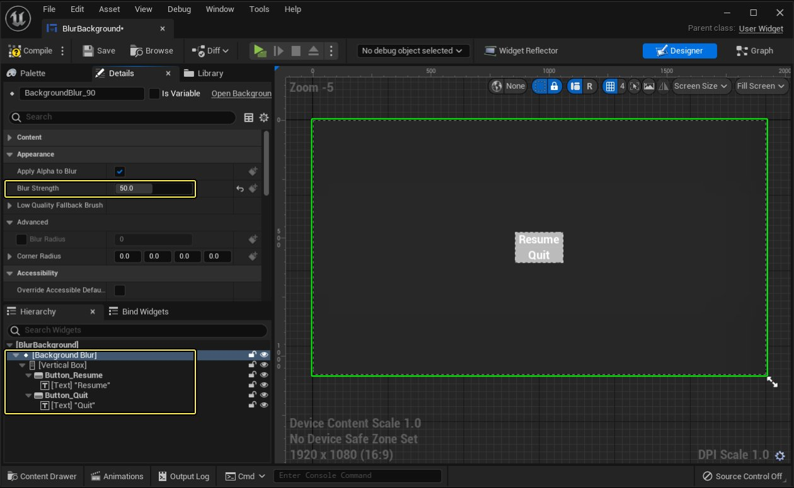

# 背景模糊控件

> 路径：虚幻引擎5.7文档 / 创建用户界面 / 控件类型参考说明 / 背景模糊控件

> 原始页面：https://dev.epicgames.com/documentation/unreal-engine/using-the-background-blur-widget-in-unreal-engine

**背景模糊（Background Blur）** 是一个可以添加到UI布局中的控件。通过该控件，你可以将可调节的边框将UI内容包围起来，然后为所有背景中的内容添加一个高斯模糊后期特效。背景模糊控件可以包含一个子控件。

本文介绍了如何在UI布局中使用和调整背景模糊，并且通过示例帮助你了解如何在 **UMG** 中使用并调整背景模糊控件。

## 细节面板

在放置的 **背景模糊（Background Blur）** 控件的 **细节（Details）** 面板中，可对从属于控件的几个特定选项进行设置：

| 选项 | 描述 |
| --- | --- |
| **将Alpha应用到模糊（Apply Alpha to Blur）** | 如果启用该项，将基于控件透明度调制模糊强度。 |
| **模糊强度（Blur Strength）** | 背景的模糊强度。数值越大，模糊越强，GPU 的运行时开销越大。 |
| **低质量退回Low-Quality Fallback Brush** | 启用 Low-Quality Override 模式时绘制的图像（而不应用模糊）。将 cvar `Slate.ForceBackgroundBlurLowQualityOverride` 设为 **1** 即可启用背景模糊的低精度模式。这通常在项目的可延展性设置中进行。 |
| **模糊半径（Blur Radius）** | 计算模糊时，此项是从任意给定像素的每个方向进行加权的像素数量。数值越高，模糊越强，但开销越高。 |
| **模糊边角（Blur Corner）** | 计算模糊时，此项是从任意给定像素的每个方向进行加权的像素数量。数值越高，模糊越强，但开销越高。 |

之前提及的每个属性也可在运行时通过蓝图脚本进行设置（或修改）。

也可定义其他外观设置（如水平或垂直对齐）和围绕控件的包围。

## 使用示例

在下例中，游戏暂停时我们使用背景模糊组件高亮菜单，将背景模糊。

针对这点，我们通过简化菜单增加了 Blur 控件，使用 **模糊强度（Blur Strength）** 值确定应用的背景模糊强度。

我们在菜单控件蓝图的图表上创建一个脚本，处理菜单对按键点击的响应。

我们在上方构建控件时打开了鼠标指针。按下 **返回（Resume）** 键时将隐藏指针、取消游戏暂停，并移除显示的菜单。 按下 **退出（Quit）** 键后将退出游戏。在玩家角色的蓝图中（如下图所示）添加一个脚本，在发生按键时创建并显示菜单。在此情形下，**P** 按下时游戏将暂停，将显示菜单。

实现的结果是能够暂停游戏并模糊背景，使玩家能和完整的菜单进行交互。

也可将模糊强度（Blur Strength）从 50 降至 10，使背景可见度略微提高。
