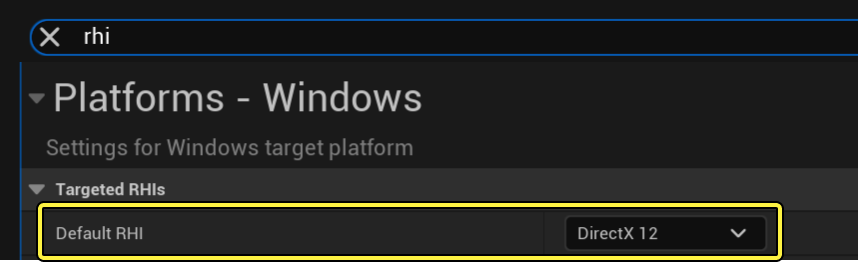
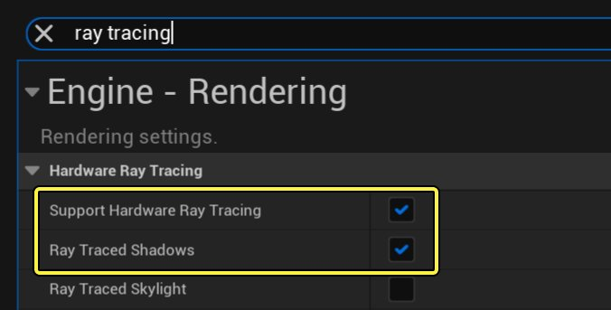
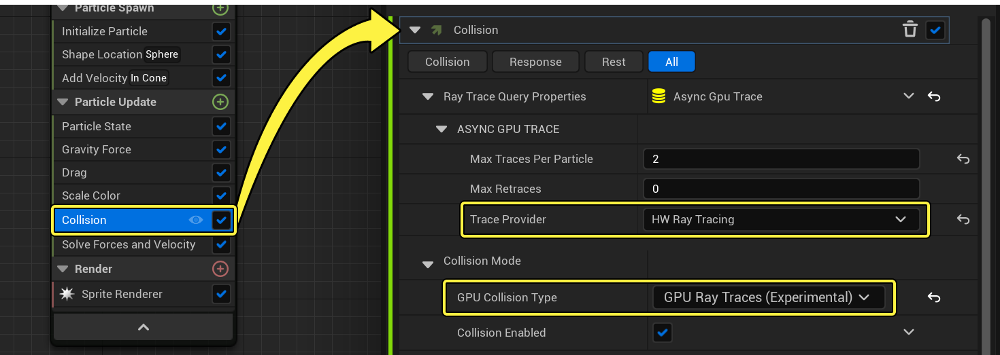
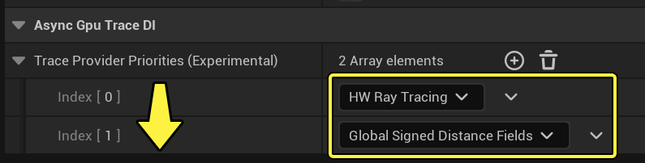

# GPU光线追踪碰撞

> 路径：虚幻引擎5.7文档 / 创建视觉效果 / Niagara中的碰撞 / GPU光线追踪碰撞

> 原始页面：https://dev.epicgames.com/documentation/unreal-engine/gpu-raytracing-collisions-in-niagara-for-unreal-engine

在虚幻引擎中，你可以使用 **碰撞（Collision）** 模块让粒子与关卡中的对象碰撞。

在之前的虚幻引擎版本中，使用GPU发射器时，此模块中有多个选项。通常，大部分人使用了 **深度缓冲（Depth Buffer）** 选项，用于模拟周围环境。这种解决方案的成本很低，但准确性也很低。形状不会得到准确描绘，并且如果粒子跑出屏幕之外，就会立即消失。

**GPU光线追踪碰撞（GPU Raytracing Collisions）** 是碰撞模块中的一个试验性选项，让你可以在GPU上使用硬件光线追踪。无论发射器及其粒子是在屏幕上还是屏幕之外，抑或是隐藏在对象背后，碰撞都会使用光线追踪来计算准确的结果。

> 动图已省略：GPU光线追踪碰撞

> [!NOTE]
> 计算是异步的，因此Niagara碰撞将落后一帧。

### 调整项目设置

要使用此功能，你的项目必须设置为DirectX 12，并且你的GPU必须启用硬件光线追踪。要开启这些选项，请按照以下说明操作：

- 打开

  编辑（Edit） > 项目设置（Project Settings）

  。
- 搜索

  rhi

  。
- 将

  默认RHI（Default RHI）

  选项调整为

  DirectX 12

  。

点击查看大图。

接下来，同样在 **项目设置（Project Settings）** 中启用光线追踪。

- 搜索

  ray tracing

  。
- 启用选项

  支持硬件光线追踪（Support Hardware Ray Tracing）

  和

  光线追踪的阴影（Ray Traced Shadows）

  。

点击查看大图。

### 设置碰撞模块

在 **碰撞（Collision）** 模块中，调整设置以使用此试验性功能。将 **GPU碰撞类型（GPU Collision Type）** 设置为 **GPU光线追踪（试验性）（GPU Ray Traces (Experimental)）** 。

> [!NOTE]
> **追踪提供者（Trace Provider）** 在默认情况下设置为 **项目设置（Project Settings）** ，将从选项数组中选取最佳选项。但是，你也可以手动将其设置为 **硬件光线追踪（HW Ray Tracing）** 。

### 设置退却方案(可选)

你可以设置退却方案，以防光线追踪不可用。为此，请打开 **编辑（Edit） > 项目设置（Project Settings）** 。

在设置的 **插件（Plugins） > Niagara** 分段中，有一个名为 **异步GPU追踪DI（Async Gpu Trace DI）** 的设置。它设置了一个数组，其中包含两个选项：**硬件光线追踪（HW Ray Tracing）** 和 **全局有向距离场（Global Signed Distance Fields）** 。如此设置你的选项之后，系统将首先尝试使用光线追踪，但如果光线追踪不可用，系统就会退却为改用距离场。这些是默认设置。

你可以将元素添加到数组，或根据需要重新排列。但是，在大部分情况下，默认设置已经足够了。
