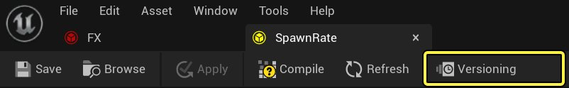
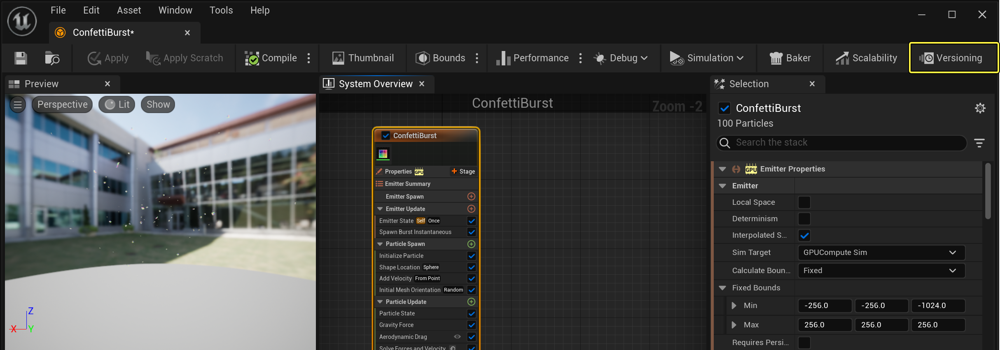
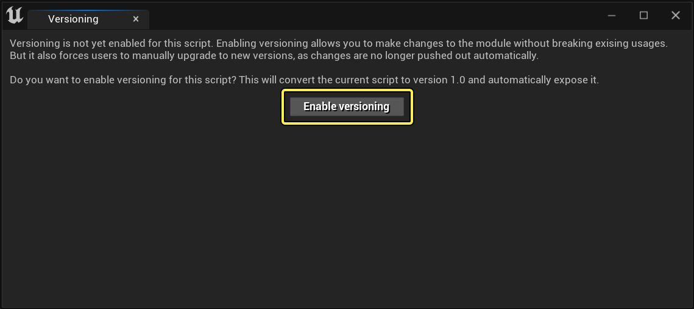
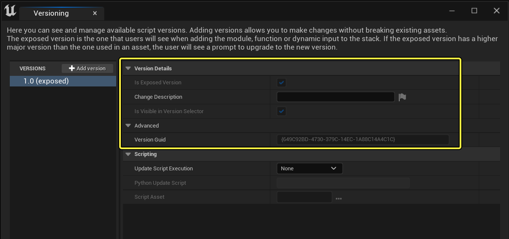
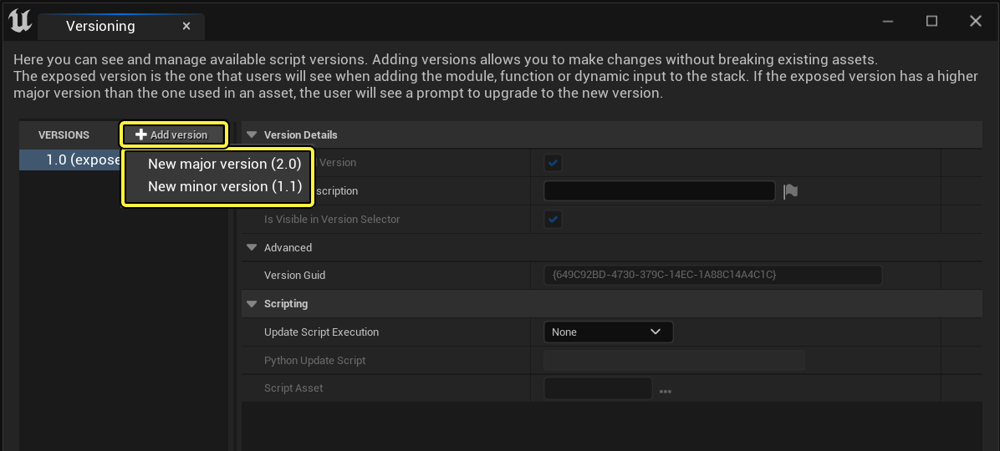
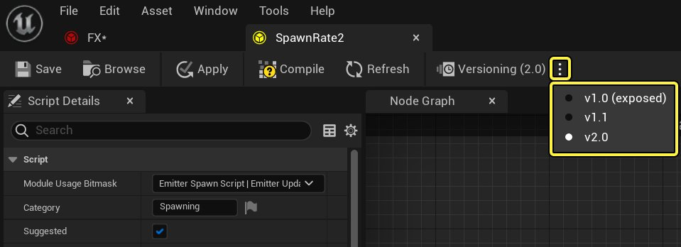
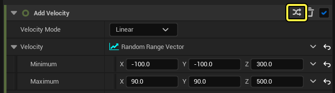
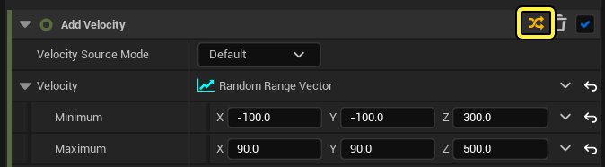

# Niagara中的模块版本管理

> 路径：虚幻引擎5.7文档 / 创建视觉效果 / 创建自定义模块 / Niagara中的模块版本管理

> 原始页面：https://dev.epicgames.com/documentation/unreal-engine/versioning-modules-and-emitters-in-niagara-effects-for-unreal-engine

## 概述

**Niagara** 允许你使用 **Niagara脚本** 自行创建自定义模块。创建自定义模块后，你可以将该模块分享给团队，或者在其他项目中使用。在为模块添加或改进功能时，你要确保不会破坏已经在使用这些模块的资产。

对于不使用版本管理的自定义模块，默认行为是，将更改直接推送到使用此模块的资产。相比之下，启用版本管理后，用户需要在有模块新版本可用时，手动升级到新版本。

因此，你现在可以直接在Niagara中创建不同版本的模块。这并不是要取代Git或Perforce等版本管理系统，它是直接内置于Niagara的内部版本管理系统。

你也可以将发射器保存为资产，然后像处理Niagara脚本那样，将Niagara版本管理应用到这些发射器。

## 模块版本管理

要启用版本管理，首先在脚本编辑器中打开模块。若要打开某个模块，可以在 **Niagara编辑器（Niagara Editor）** 的 **系统概述（System Overview）** 中双击该模块，或在 **内容浏览器（Content Browser）** 中双击Niagara脚本（Niagara Script）。

在工具栏上，点击 **版本管理（Versioning）** 按钮。



点击查看大图。

## 发射器版本管理

和模块一样，你也可以对发射器进行版本管理，以便在多个项目中复用。你必须将发射器保存为资产才能使用此功能。有两种方式完成此操作：

1. 创建新发射器：从内容浏览器（Content Browser），右键点击，然后选择

   FX > Niagara发射器（Niagara Emitter）

   ，创建新发射器资产。
2. 转换现有发射器：在Niagara系统中，右键点击发射器，并选择

   基于此创建资产（Create Asset From This）

   。

然后，从发射器资产，你可以在顶部工具栏找到 **版本管理（Versioning）** 按钮，以启用版本管理。这与处理Niagara脚本资产的方式相同。



点击查看大图。

## 如何启用版本管理

如果这是你第一次为此模块设置版本管理，则会出现弹出对话框。此对话框将说明启用版本管理后，模块的所有用户都需要在进行更改时手动升级到新版本。点击 **启用版本管理（Enable Versioning）** 以接受。



点击查看大图。

现在，你可以编辑版本的属性或创建新版本。

## 版本细节

你创建的每个版本都有一些版本细节供你设置。



点击查看大图。

| 参数 | 说明 |
| --- | --- |
| **是公开的版本（Is Exposed Version）** | 启用以便此版本也成为使用此模块之时的默认值。使用此模块的所有人都可以在版本选择器中看到此版本。 |
| **更改说明（Change Description）** | 编写一些文字，让用户清楚了解此版本中的新内容。 |
| **在版本选择中可见（Is Visible in Version Select）** | 启用以便在版本选择器中向用户提供此版本。当你迭代和测试模块的新版本，但不希望有人能访问它时，你可以不选中此项。 |

## 创建新版本

要创建新版本，请从 **Niagara脚本（Niagara Script）** 视图，点击 **版本管理（Versioning）** 按钮打开面板。点击 **添加版本（Add version）** 。



点击查看大图。

你创建版本时，首先需要说明是 **主版本** 还是 **次要版本** 。次要版本应该用于较小的更改，而不是破坏性的更改。主要版本用于更改的情况：你迁移到该版本后，就无法在不破坏已设属性的情况下迁移回旧版本。

次要版本和主版本之间没有内部差异，只是语言区别，旨在帮助用户识别升级所涉及的风险。

选择 **新的主版本（New major version）** 或 **新的次要版本（New minor version）** 以继续。然后你可以设置 **版本细节（Version Details）** 。在你设置新版本时，最好不要选中 **是公开版本（Is Exposed Version）** 。如果你不想让他人知道你在开发新版本，你也可以不选中 **在版本选择器中可见（Is Visible in Version Selector）** 。你对更改满意后，可以启用这些选项以便将它们传播出去。

创建完新版本后，你可以关闭该窗口，回到Niagara脚本编辑器。你可以随时通过工具栏上的三点菜单切换当前编辑的版本。



点击查看大图。

## 使用不同的版本

在 **Niagara编辑器（Niagara Editor）** 中，当你选择堆栈中使用版本管理的模块时，你将在 **选择（Selection）** 面板中看到版本选择器图标。如果模块启用了版本管理，但没有新版本，则版本图标显示为灰色。



点击查看大图。

一旦有新的次要版本可用，图标就会变成橙色。



点击查看大图。

如果有新的主版本可用，还会打印一条消息，通知用户新版本。

> 图片已省略：New Major Version Available

点击查看大图。

所有版本说明注释都将显示在选择（Selection）面板中，直到被取消。

> 图片已省略：Version Upgrade Notes

点击查看大图。

你可以随时点击选择面板上的版本按钮，从一个版本的模块切换到另一个。如果你把鼠标悬停在版本号码上，你会看到一段提示，上面是有对该版本的内容描述。

> 图片已省略：Change Versions in Selection Panel

点击查看大图。

当新的主版本可用时，发射器堆栈中的警告图标也会通知你。警告图标将显示在模块的右侧，以及模块所在的组。

> 图片已省略：New Major Version Warning Icon in Stack

点击查看大图。

> [!WARNING]
> 你切换到模块的新版本后，有时无法返回旧版。最好先保存你的项目，然后切换到新版本并验证一切是否正常。

要切换到新版本，请在 **系统概述（System Overview）** 中，选择你要更新的自定义模块。点击版本切换器，然后选择你要使用的版本。如果新版本是一个主要版本，你也可以点击选择面板中的 **修复问题（Fix Issue）** ，直接升级到此版本。

> 图片已省略：Upgrade Version Using Fix Issue

点击查看大图。

## Python集成

> [!WARNING]
> 此功能仍处于试验阶段，未来可能会更改。

当你从一个模块版本升级到另一个版本时，系统会尽力将旧版本的属性映射到新版本。但是，如果所需结果不明确，你可能需要编写自己的升级脚本来告知系统如何正确升级版本。这将确保用户在升级后不必重做所有工作。

要提供更新脚本，请点击Niagara脚本工具栏上的 **版本管理（Versioning）** 按钮，打开版本管理面板。你将看到此面板中名为脚本（Scripting）的分段。默认情况下， **升级脚本执行（Upgrade Script Execution）** 设置为 **无（None）** ，这意味着你不提供脚本。

> 图片已省略：Scripting Options in Versioning Window

点击查看大图。

有两种输入脚本的方法：

1. 将文本直接复制并粘贴到

   版本管理（Versioning）

   面板中。
2. 链接到外部资产。

### 直接文本条目

要直接复制粘贴，首先点击 **升级脚本执行（Upgrade Script Execution）** ，然后选择 **直接文本条目（Direct Text Entry）** 。现在你可以将你的脚本复制并粘贴到 **Python 更新脚本（Python Update Script）** 字段中。

> 图片已省略：Type Your Script in Direct Text Entry Field

点击查看大图。

### 添加外部脚本

要链接到外部脚本，首先点击 **升级脚本执行（Upgrade Script Execution）** 并选择 **脚本资产（Script Asset）** 。你现在可以点击脚本资产字段右侧的三点菜单浏览到你的脚本文件。

> 图片已省略：Upload a Script Asset

点击查看大图。

### 写入Python脚本

如果不清楚从一个版本到另一个版本预先存在的Niagara脚本应该如何映射到新版本，你可以使用python脚本。例如，旧版本采用布尔输入，而新版本使用具有两个以上值的枚举，则升级脚本可以将现有的布尔输入映射到两个枚举值。下为执行此操作的脚本示例：

获取布尔输入，将新输入设置为枚举

```
     flying = upgrade_context.get_old_input("Is Flying")     if not flying.is_local_value():         print("Is Flying input used a dynamic input that could not be transferred to the new Movement Mode input")     elif flying.as_bool():         upgrade_context.set_enum_input("Movement Mode", "Flying")     else:         upgrade_context.set_enum_input("Movement Mode", "Walking") 
```

`upgrade_context` 变量提供给脚本，包含旧输入和新输入。

对其调用 `get_old_input(string input_name)` 会返回输入对象，你可以用它获取当前堆栈值。同样，你可以使用 `set_XXX_input(string input_name, XXX value)` 提供新输入值。

脚本完成后，你进行的所有 `print()` 调用都会在堆栈中显示为警告。

如需详细文档了解python在虚幻引擎中的用途，请查看[使用Python编写编辑器脚本](https://dev.epicgames.com/documentation/404)。

## Python API列表

参见下面的Niagara版本管理对象API。点击此处获取完整的[虚幻引擎Python API文档](https://docs.unrealengine.com/PythonAPI/)。

upgrade_context API

```
    get_old_input(string input_name)
```

这将返回 `UNiagaraPythonScriptModuleInput`（参见下文）。如果输入不存在，将返回一个空白的默认对象而不是抛出错误。

要按类型设置新输入：

```
     set_float_input(string input_name, float value);     set_int_input(string input_name, int value);     set_bool_input(string input_name, bool value);     set_vec2_input(string input_name, Vector2D value);     set_vec3_input(string input_name, Vector value);     set_vec4_input(string input_name, Vector4 value);     set_color_input(string input_name, LinearColor value);     set_quat_input(string input_name, Quat value);     set_enum_input(string input_name, string value); 
```

UNiagaraPythonScriptModuleInput API

```
     bool is_set() 
```

当用户设置值时，将返回 `true` 。

```
     bool is_local_value() 
```

当输入设置为本地值而不是链接属性或动态输入时，将返回 `true` 。

如果 `bool is_local_value()` 返回 `true` ，那么你可以将输入转换为python值，如下所示：

```
     float as_float()     int as_int()     bool as_bool()     Vector2D as_vec2()     Vector as_vec3()     Vector4 as_vec4()     LinearColor as_color()     Quat as_quat()     string as_enum() 
```
