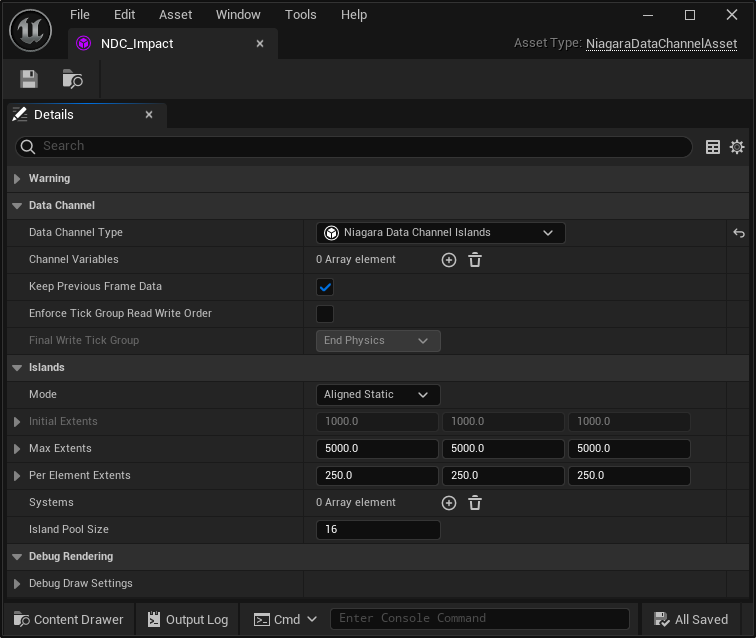
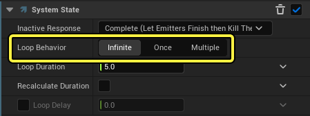
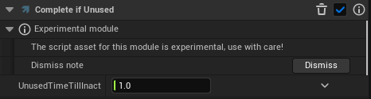
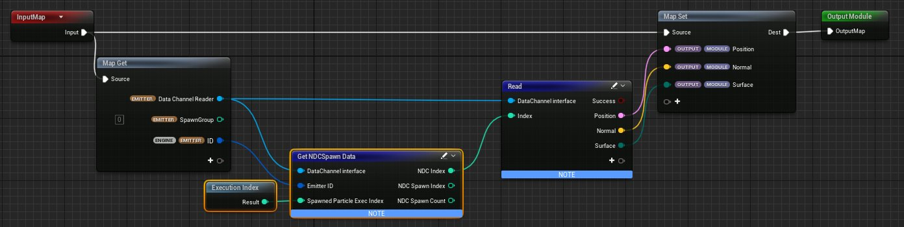
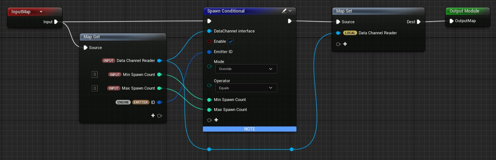
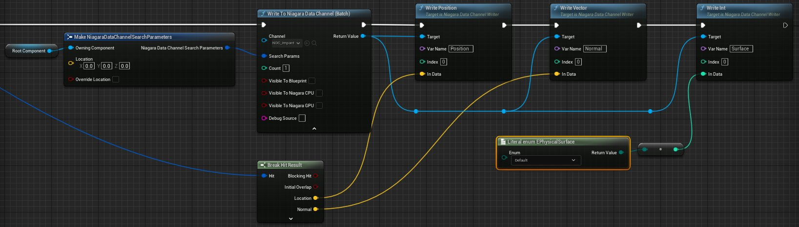

# Niagara数据通道概述

> 路径：虚幻引擎5.7文档 / 创建视觉效果 / Niagara数据通道 / Niagara数据通道概述

> 原始页面：https://dev.epicgames.com/documentation/unreal-engine/niagara-data-channels-overview

## 概述

**Niagara数据通道（NDC）** 可促进游戏代码与Niagara系统之间或不同Niagara系统之间的通信。

数据通道是具有已确定负载的数据流，游戏代码或Niagara系统可以读取或写入该数据流。Niagara系统可以读取负载并根据该信息修改其行为。该系统还可以将信息写入数据通道，并且其他Niagara系统或蓝图可以在Gameplay过程中使用该信息。一个项目可以有多种专用数据通道类型，用于多种用途。

数据通道的一个常见用例是Niagara冲击效果，其中玩家可能会在Gameplay过程中多次生成相同的Niagara系统。每个系统都单独生成并执行。如果玩家快速生成许多这类系统，开销可能会变得很高。

Niagara数据通道提供了一种替代方案，你可以将喷发的Niagara系统组合成一个大型共享模拟，从而优化这些系统。因此，你无需生成多个独立的Niagara系统，而是生成单一的系统来处理分配给数据通道的所有喷发粒子。此功能可以显著提高性能。

## 关键类和概念

使用Niagara的数据通道需要以下关键组件：

- 数据通道资产

  ，包含将写入通道的变量（负载）以及将使用该通道的Niagara系统列表。
- 配置为连续监听器系统的

  Niagara系统

  。每个岛状区会生成一个Niagara系统，用于监听数据通道事件。系统可以利用这些信息来生成粒子。
- 写入数据通道并传递指定信息（负载）的

  蓝图

  。

### Niagara数据通道资产

此资产包含常见的数据通道设置，例如数据通道类型和通道变量。如果使用岛状区类型，你可以指定岛状区的初始和最大范围以及岛状区池大小。变量可以是常见类型，例如浮点或向量4，也可以是枚举器，例如碰撞通道、物理表面或Niagara执行状态。你还可以添加代表特定Chaos破坏系统和Niagara碰撞事件的变量。

每个数据通道都包含一个Niagara系统列表，当事件被提交到数据通道时，这些系统可以在岛状区边界内被生成。

### Niagara系统

你的Niagara系统将监听数据通道中的事件，并利用该信息生成粒子。此系统必须配置无限循环行为（Infinite Loop Behavior），以便一旦系统在岛状区生成，只要从数据通道接收到事件，系统就可以保持激活。

系统还应有一个"若未使用则完成（Complete if Unused）"模块。一旦在一段时间之后没有收到任何事件，系统就会被销毁。这也将允许数据通道在不再有剩余Niagara系统时清理该岛状区。

发射器应该有两个暂存区（Scratchpad）模块，一个用于从数据通道读取数据，另一个用于基于从数据通道读取的数据生成粒子。

### 蓝图

你的蓝图将直接写入Niagara数据通道并设置相关变量。

有关如何使用Niagara数据通道的分步指南，请查看EDC中的[Niagara数据通道简介](https://dev.epicgames.com/community/learning/tutorials/OpJ8/unreal-engine-niagara-data-channels-5-4-update)。
