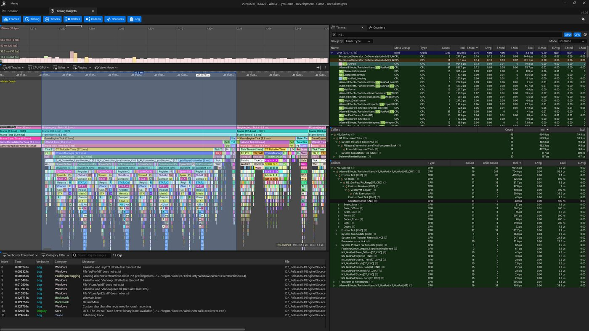
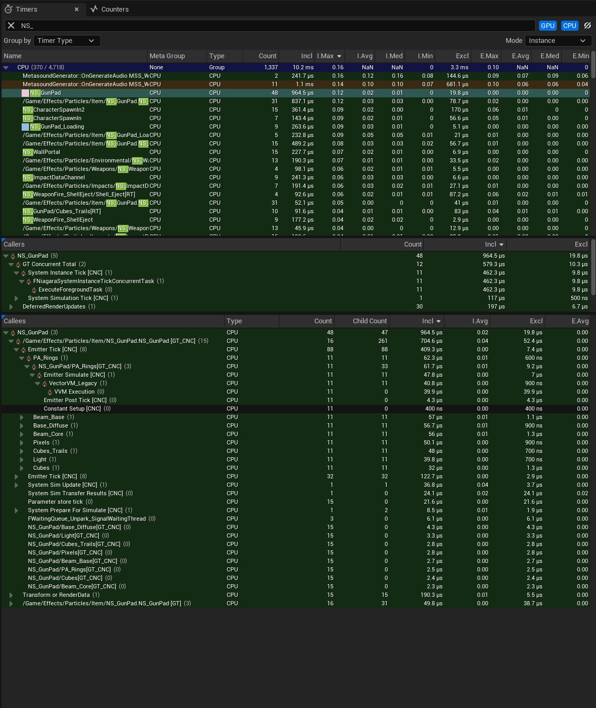
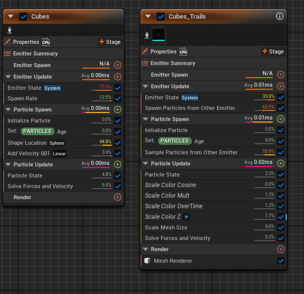
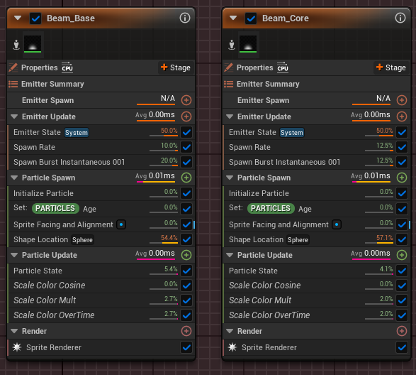
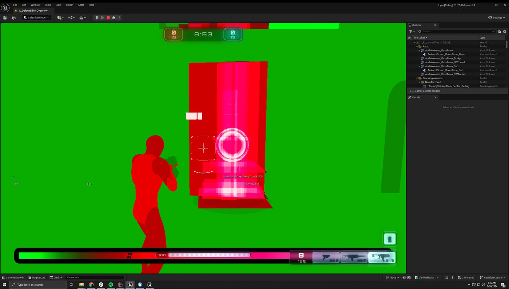
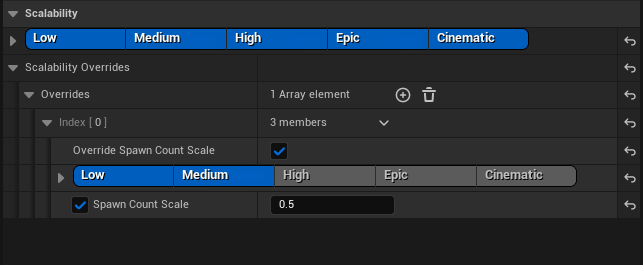
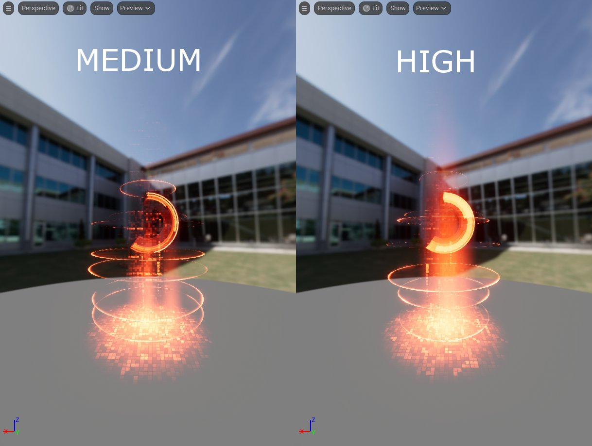
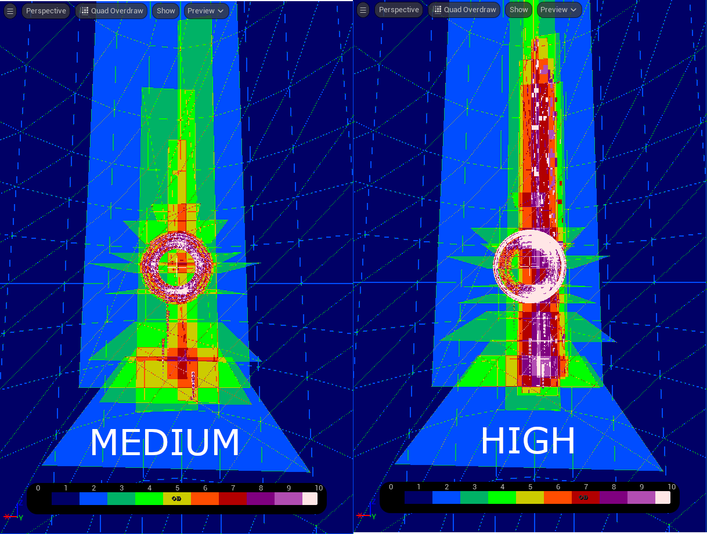

# 衡量性能

> 路径：虚幻引擎5.7文档 / 创建视觉效果 / 调试和优化Niagara / 优化Niagara / 衡量性能

> 原始页面：https://dev.epicgames.com/documentation/unreal-engine/measuring-performance-in-niagara

## 概述

衡量粒子的性能后，你将知道进行优化时应重点关注的具体区域。在做出更改之前验证假设非常重要，这可避免错误地优化无需优化的地方，而且这样可以有一个比较点，用来显示更改带来的影响程度。

本文将介绍虚幻提供的一些用于衡量Niagara粒子系统性能的工具，以及如何读取这些系统，和如何根据它们的数据做出决定。

## 衡量性能

### Unreal Insights - 关卡中的衡量系统

捕获具有代表性的Gameplay窗口，最好是游戏本身，以便提供最具参考价值的数据。适合某个项目的设置未必适合其他项目，甚至同一项目中的不同关卡之间也是如此。例如，带受控摄像机的过场动画可能会有运行3D流体模拟的预算，但这如果在正常Gameplay期间运行，开销就太高了。

这还显示了粒子系统与项目交互时的全局视角。如果短时间内生成数十个实例，则本身在预算范围内的粒子系统也可能会占用太多资源。即使它们是分散生成的，但刷新屏幕外实例也会占用不必要的资源。

Unreal Insights将分析你的项目，并向你展示单个帧以内引擎系统的时间，以及单个帧的整体时间。这样，你可以在项目的帧时内查找峰值，并深入了解哪些系统导致了减速以及减速的程度。经过适当的设置，你还可以查明是哪些特定Niagara系统在其中发挥作用。

### 设置Insights以获取详细的Niagara捕获图像

Unreal Insights的追踪默认不包含资产名称和某些函数调用。在命令行参数中添加-StatNamedEvents，Insights就可以捕获这些事件。捕获这些名称会产生开销，因此最好只将其用于查找瓶颈所处的位置，然后在没有任何命名事件的情况下进行捕获，从而获得具有代表性的时间。

本文中的衡量示例来自一款打包Lyra游戏，其中开发配置和LyraGame目标位于带机器人的淘汰游戏模式中。

获得Insights捕获图像后，可立即使用这些Niagara计时器在计时视图的主图中寻找峰值。你可以将它与帧视图相结合，了解特定于Niagara的峰值与帧时峰值之间的关系。

### 了解Niagara定计时器

Niagara分析将被分解为不同的计时器，这有助于查明Niagara在何处花费的时间最多，从而指明该重点优化哪些地方。

**游戏线程**

刷新

- Niagara Manager Tick [GT]

  - Niagara系统默认由Niagara World Manager批量刷新。该计时器可以概述在游戏线程上进行刷新所花费的时间，以及等待异步刷新任务完成所花费的时间。它还会处理伸缩性问题。模拟按刷新组分批处理，因此同一系统位于不同刷新组中的实例不会共用同一系统模拟。注意：单个系统单独刷新，不会在这里批量处理。
- System Simulation Tick [GT]

  - 一个系统位于同一刷新组中的所有实例进行刷新所花费的时间，用于为异步刷新准备信息：收集变换、处理参数存储等。
- System Instance Tick [GT]

  - 单个系统的实例刷新。
- System Instance WaitForAsyncTick [GT]

  - 游戏线程上等待一个实例的异步刷新所花费的时间。
- Niagara Manager Update Scalability Managers [GT]

  - 更新伸缩性所花费的时间。

激活

- Activate (GT)

  - 激活Niagara组件所花费的时间。
- System Activate [GT]

  - 激活系统实例所花费的时间。

工作器线程

- FNiagaraSystemSimulationTickConcurrentTask & System Simulation Tick [CNC]

  - 为系统模拟刷新所做的并行工作。系统脚本和发射器脚本被编译成单个虚拟机脚本。该任务调用向量虚拟机并执行该脚本。

  - 将数据传输到发射器实例
  - 启动系统实例任务
- System Instance Tick [CNC]

  - 为发射器脚本的粒子部分设置并运行刷新。
- Emitter Tick [CNC]

  - 对CPU模拟发射器的粒子阶段进行刷新所花费的时间。
- Emitter Simulate [CNC]

  - 对应粒子更新
- Emitter Spawn [CNC]

  - 对应粒子生成
- Emitter Event Handling [CNC]

  - 对应粒子事件处理程序

渲染线程

- Compute Dispatch (GPU Emitter Dispatch [RT])

  - 运行GPU模拟脚本，包括粒子生成和更新及模拟阶段。
  - 调度按安全排序，以重叠组
  - 确定用于渲染的最终缓冲区
  - 可执行

    - 初始化前视图
    - 初始化后视图
    - 渲染后不透明
- GPU模拟中使用的功能将确定何时执行它们，例如深度读取、距离场、采样等。

  - 在"系统编辑器显示（System Editor Show）"菜单中启用"GPU刷新信息（GPU Tick Information）"以查看模拟中启用的功能。
- 获取动态网格体元素

  - 与渲染器几何体有关的开销，取决于：

    - 渲染器数量
    - 系统可视的视图的数量
    - 渲染器类型
- CPU发射器需要将数据复制到GPU
- 渲染器可视性和网格体索引需要排序并剔除GPU任务
- 逐粒子网格体LOD需要编译更多的网格体批次

## 捕获图像示例

以下是从Lyra游戏获取的捕获图像示例的截图，其中在比赛开始时出现了一个帧峰值。大多数帧时花费在生成玩家和AI控制器上，但Niagara系统相对于其他帧也有峰值，包括枪垫系统，在该帧的所有工作线程中贡献了约0.96毫秒。

整个帧的时间为33.5毫秒，约为30fps。在游戏其余部分，我们能看到70到80fps，因此这是一个非常明显的峰值。但Niagara只花了约0.4毫秒在游戏线程上进行刷新，所以枪垫系统对游戏线程的开销贡献不大。

注意：该捕获中使用的硬件有一个Threadripper CPU，因此与主机硬件相比，工作线程的性能可能不太现实，而且在不同平台上等待任务线程可能会有更多的游戏线程开销。

如果更仔细地观察Niagara Manager Tick，可以看到这一帧有15个枪垫实例进行刷新，这属于意料之中，因为它们都是一次生成的。它们还保持着相关性和刷新，因为它们只被设为1秒未被渲染后剔除，所以一次性生成所有枪垫会有持续开销。其他物品拾取也是一样。

因此，虽然它们目前可能没有很大的开销，尤其是与这一帧的其余部分相比，但这说明了拥有比实际需要更多的相关系统所产生的开销。如果系统性能较差，则更具代表性的目标硬件会变慢，或者如果关卡中有更多这样的系统，这可能是一个更好的优化机会，尤其是考虑到初始化关卡时帧资源紧张。

为了探索模拟优化，我们将首先通过"计时器（Timers）"选项卡查看枪垫系统的时间，尤其是"被调用者（Callees）"选项卡。这将显示所选计时器的所有子计时器的贡献。在本例中，它们按包含时间排序，这是计时器（包括子计时器）中花费的总时间。

作为参考，下面是执行系统实例刷新的多个工作线程的追踪结果。每个线程依次执行四个实例刷新。

这是仅一个系统实例刷新的放大视图，因此可以看到不同的发射器刷新。每个发射器刷新贡献大约0.003毫秒到0.008毫秒。

对于整个帧而言，PA_Rings贡献约为0.06毫秒，而Beam_Base、Beam_Diffuse和Beam_Core贡献约0.056-0.057毫秒。但这仅仅是一帧的情况，所以应该查看更有代表性的时间窗口及其平均值，从而判断要重点优化的地方。

下面是一个更大时间跨度的计时器选项卡，其重点关注发射器刷新。平均值明显低于之前看到的时间，当伸缩性开始生效后，这很合理，而且在一帧中运行的系统实例更少。从这些数据来看，Cubes_Trails是开销最大的发射器，但它们都非常微不足道，每个只有0.01毫秒，甚至更少。

我们可以使用Niagara编辑器的性能模式来更加深入地了解资产并寻求优化。如果优化实例数，我们可以延迟或错开那些距离玩家角色较远的枪垫效果的生成，也可以尝试对此种效果类型采用预剔除。

注意：Niagara编辑器的性能模式不适用于新的虚拟机。

我们将从立方体尾迹发射器开始，因为它在这个Insights捕获的占用列表中位于顶端。上面的捕获显示了平均时间和模块时间的相对值。更新脚本的时间与Insights捕获中看到的时间大致相匹配，大约为0.01到0.02毫秒。但在更新脚本中，模块本身在该时间中占比并不高。

在这里我们仍然可以做一些快速的优化。从源发射器采样粒子时，立方体尾迹发射器不会继承速度，但依赖系统并不知道这一点，所以它总是建议添加"解算力和速度（Solve Forces and Velocities）"模块。如果移除该模块，同时消除其他发射器模块中产生的样本粒子问题，仍可实现相同的行为，而且还能降低开销（根据Niagara编辑器，减少约5%的开销）。

你可以合并和简化对缩放颜色的多次调用，从而进一步优化。

在发射器更新和粒子生成中，相对于其他模块，从源发射器进行生成和采样的开销较大。完全消除从另一个发射器采样的需要，不仅减少了发射器数量，还获得了另一个性能优势。但这绝不是微不足道，当前设置很可能已经是合并发射器的结果。不让每条尾迹都有一个发射器，而是整合为两个发射器，会是很好的替代方案。

将来，把每条尾迹转换为无状态发射器可能是最好的优化。

由于在没有重建效果的情况下无法对立方体尾迹发射器做更多的处理，因此可以寻找其他方面进行优化。

如果查看Beam_Base和Beam_Core，可以发现它们运行的逻辑几乎完全相同，只有一些数据变化，这说明它们可以合并为单个发射器。而且，它们还可以共享相同的渲染器，因此，合并这两个发射器时无需使用可视性标记，可以避免相关开销。

总的来说，可能还有其他发射器可以合并，但都没有合并这两个发射器轻松。将来迁移到轻量级发射器可能最适合该用例。

## 视图模式 - 衡量渲染复杂性

视觉特效通常有许多重叠的半透明Sprite和网格体，所以它们通常会导致过度绘制，因此验证Niagara系统的着色器复杂性也很重要。你可以在着色器复杂性视图模式查看复杂性的总体概况。要获得更详细的过度绘制视图，可以使用四边形过度绘制视图模式。

减少颗粒数和进一步扩散粒子可以减少过度绘制。粒子占据的屏幕空间越少，受到的关注就越少，在本例中也是如此。

上图是Expanse关卡中的一个枪垫的捕获图像。在该效果中有大量过度绘制，这种情况在关卡中很常见。你可以进行优化，减少重叠Sprite，但这也会改变视觉效果。你可以对生成数进行伸缩，减少在不同伸缩性设置下生成的粒子数量，对不同的平台进行权衡。

为了更详细地了解该粒子系统的过度绘制情况，我们可以使用Niagara编辑器中的不同视图模式，实时查看对系统进行编辑的效果。

上图是过度绘制视图与光照视图的并排对比。左边是未经编辑的系统，右边是停用了NE_RingMeshTimerInternal、Beam_Core和Beam_Based发射器的系统。这消除了7及7以上的几乎所有过度绘制。只需开启和关闭发射器，就可以很好地了解应在何处重点减少过度绘制。

Niagara内置了基于伸缩性设置的生成数伸缩支持。你可以在Niagara编辑器的伸缩性模式中访问各种伸缩性重载和设置。作为测试，我在上述停用的三个发射器上添加了伸缩性重载，将中等可伸缩性及以下的生成数减半。

处于低级设置和中级设置的发射器伸缩性重载，其生成数已经过伸缩

在伸缩性模式下，你可以在不同伸缩性之间快速切换以预览差异。下面是中级伸缩性和高级伸缩性的光照视图并排对比。亮度差异非常明显，但少许材质变化可以减少这种差异。

这是四边形过度绘制的并排对比。超过7个的光束区域几乎完全消除，虽然这个环形上仍有很多超过8个的覆盖范围，但它减少了大部分10个的覆盖范围。

这表明，对生成数进行伸缩对于减少该系统的过度绘制十分有效，可以进一步优化每个伸缩性等级，从而平衡各个目标硬件上的保真度和性能。

对于支持可变速率着色的平台，你还可以调整系统中使用材质的着色率，从而减少过度绘制的影响。你可以在"材质（Material） > 高级（Advanced） > 着色率（Shading Rate）"下的材质细节上进行控制。着色率将有效降低绘制材质的分辨率。

## Niagara调试器

Niagara调试器还包括性能分析工具，你可以将这些工具与PIE配合使用，实现更快的性能分析。如需详细信息，请参阅[Niagara调试器](../../niagara-debugger/index.md)文档。
