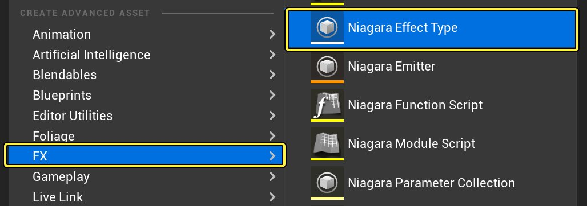
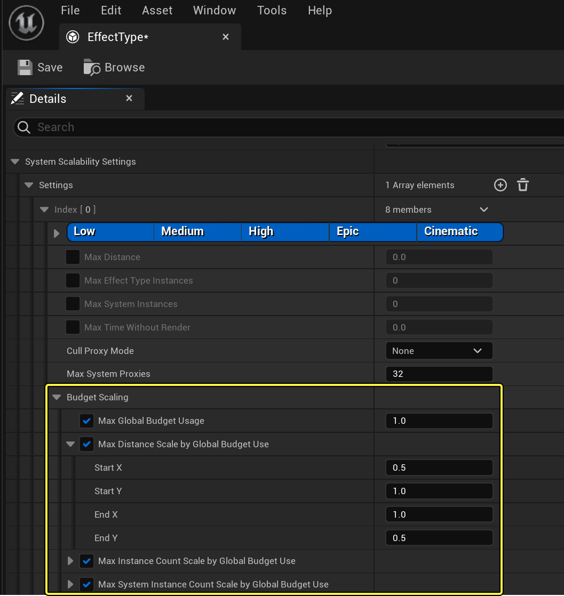
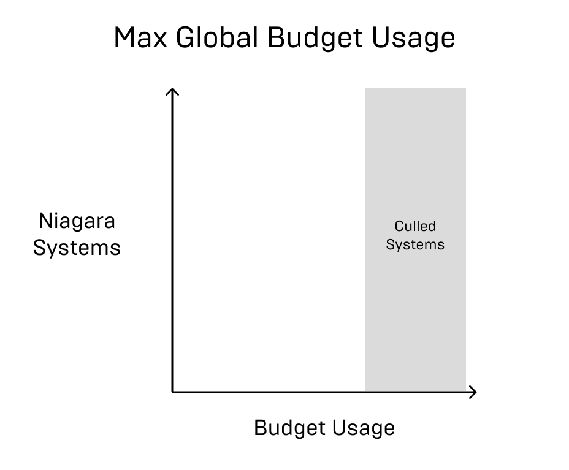
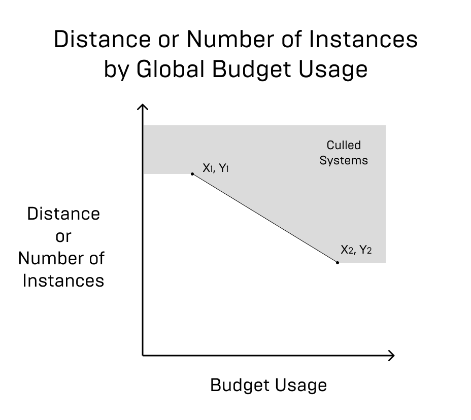

# 使用效果类型管理性能预算

> 路径：虚幻引擎5.7文档 / 创建视觉效果 / 调试和优化Niagara / 使用效果类型管理性能预算

> 原始页面：https://dev.epicgames.com/documentation/unreal-engine/performance-budgeting-using-effect-types-in-niagara-for-unreal-engine

### 何时使用性能预算

在开发游戏时，就特效处理流程而言，你可以根据场景构成灵活调整。有时你可能希望更好地管理性能，例如剔除特定范围之外的实例，或剔除超出指定预算的实例。

**效果类型（Effect Type）** 资产允许你一次性配置好各种设置，然后在大量Niagara系统中复用。

### 如何创建创建效果类型资产

要创建效果类型资产，请右键点击 **内容浏览器（Content Browser）** 并选择 **特效处理（FX） >**Niagara效果类型（Niagara Effect Type）** 。

点击查看大图。

### 效果类型预算选项

在效果类型资产中，你可以设置多种不同方法来剔除超出预算用量的系统。这些选项都在标题 **预算比例（Budget Scaling）** 下提供。

点击查看大图。

- 最大全局预算用量（Max Global Budget Usage）

  ：该选项允许你设置预算上限，超过此上限的系统将一律剔除。你通常会将其设置为0到1之间的值，这表示0-100%之间的百分比。如果你希望系统更宽松，可以将其设置为1.5。这意味着，只要系统达到预算的这个百分比，就会被剔除。如果你想让性能优先于视觉效果，这是最佳选项。

点击查看大图。

- **最大距离比例（按全局预算用量）（Max Distance Scale by Global Budget Use）** ：该选项可让你设置一个曲线来定义你剔除系统的距离如何随着预算用量的增加而缩短。例如，如果预算用量非常高，则Niagara仅会渲染附近的系统，而不会渲染很远的系统。
- **最大实例计数比例（按全局预算用量）（Max Instance Count Scale by Global Budget Use）** ：该选项可让你设置一个曲线来定义关卡中的实例数如何随着预算用量的增加而缩减。这会缩减与此效果类型匹配的所有系统的所有实例。
- **最大系统实例计数比例（按全局预算用量）（Max System Instance Count Scale by Global Budget Use）** ：该选项可让你设置一个曲线来定义关卡中的实例数如何随着预算用量的增加而缩减。但是，在该选项中，你不是剔除所有系统中的所有实例，而是剔除每个系统的若干实例数。

对于采用开始X、开始Y、结束X、结束Y值的这3个选项中的每个选项，这些值定义了线性插值的曲线。高于该曲线的内容将一律剔除。例如，请参阅下图，了解曲线的外观如何。

点击查看大图。
