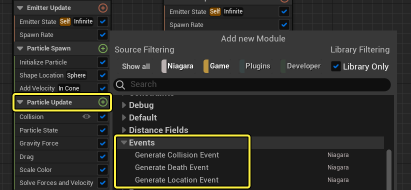
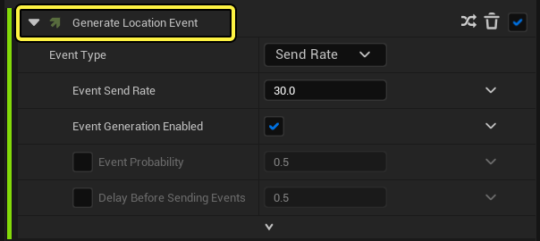
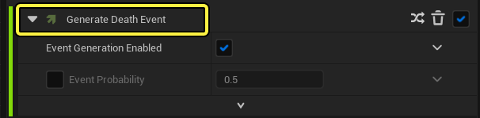
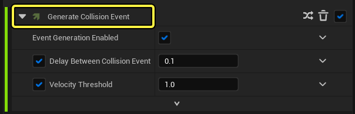
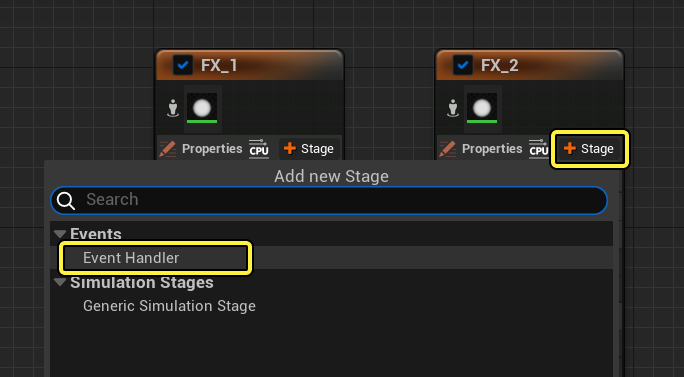
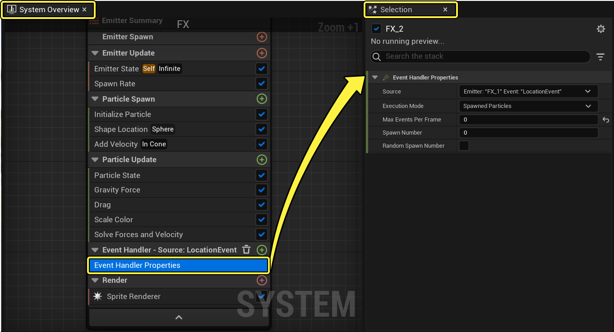
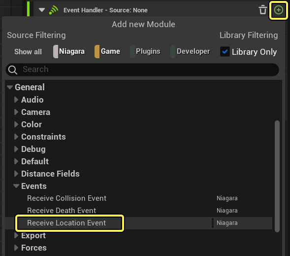
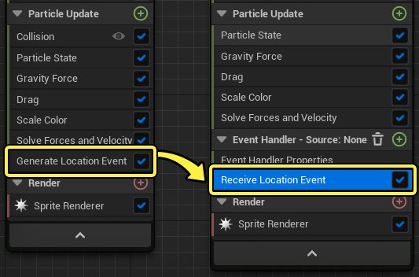

# 事件和事件处理器概述

> 路径：虚幻引擎5.7文档 / 创建视觉效果 / Niagara入门介绍 / 事件和事件处理器概述

> 原始页面：https://dev.epicgames.com/documentation/unreal-engine/events-and-event-handlers-in-niagara-effects-for-unreal-engine

在许多情况下，需要一个系统中的多个发射器相互交互，才能打造出所需的效果。通常情况下，这意味着一个发射器生成一部分数据，然后其他发射器侦听该数据，并执行一些行为来响应该数据。在Niagara中，此操作使用 **事件（Events）** 和 **事件处理器（Event Handlers）** 来完成。**事件（Events）** 是生成粒子生命周期中发生的特定事件的模块。**事件处理器（Event Handlers）** 是侦听生成事件然后启动某种行为来响应该事件的模块。

> [!NOTE]
> 当前版本中，事件无法结合GPU模拟使用。事件仅能CPU模拟使用。

## 事件

> [!NOTE]
> 要使用事件，必须在发射器的发射器属性（Emitter Properties）中启用"需要持久ID（Requires Persistent IDs）"。

由于事件会在粒子的整个生命周期内动态发生，会在"粒子更新（Particle Update）组"中添加事件。如果你点击粒子更新旁边的 **加 (+)**，你会看到一个名为 **事件（Event）** 的分段，其中可以在堆栈中添加更多事件模组。

有多种类型的事件模组：

- 位置（Location）
- 死亡（Death）
- 碰撞（Collision）

### 位置事件

将 **生成位置事件（Generate Location Event）** 模块放置到发射器的粒子更新（Particle Update）组中时，该发射器中生成的每个粒子将在其生命周期内生成位置数据。然后可以设置事件处理器（Event Handler），接收该位置数据并触发其他行为。

举例而言，若要为烟花火箭创建尾迹效果，则可将 **生成位置事件（Generate Location Event）** 模块放置到火箭发射器的粒子更新（Particle Update）组中。然后，尾迹发射器可使用位置数据生成跟随火箭的粒子。

点击查看大图。

### 消亡事件

将 **生成消亡事件（Generate Death Event）** 模块放置到发射器的粒子更新（Particle Update）组中时，该发射器中生成的每个粒子将在其生命周期结束时生成事件。使用此数据的方法有很多。可以在第一个发射器的粒子消亡时触发另一个发射器的粒子效果；也可以制造连锁反应，让每个发射器在前一个发射器的粒子消亡时生成各自的效果。可结合位置事件和消亡事件创建复杂的交互。

以烟花为例，可以在火箭粒子生命结束时生成爆炸效果。位置事件可确定火箭粒子的位置，即爆炸发生的位置。消亡事件可确定粒子的生命结束时间，即爆炸效果发生的时间。

点击查看大图。

### 碰撞事件

将 **生成碰撞事件（Generate Collision Event）** 模块放入发射器的粒子更新（Particle Update）组后，粒子与Actor（例如静态网格体或骨骼网格体）碰撞时，其将生成事件。举例而言，若要将烟花效果改为武器效果，可以设置当火箭粒子与静态或骨骼网格体碰撞时发生爆炸。

点击查看大图。

> [!NOTE]
> 需要先向发射器添加 **碰撞（Collision）** 模块，然后才能向该发射器添加 **生成碰撞事件（Generate Collision Event）**。这样发射器的粒子便可以与场景中的对象碰撞。

## 事件处理器

事件处理器由两部分组成：**事件处理器属性（Event Handler Properties）** 和 **接收事件（Receive Event）**。针对需要发射器予以响应的每个事件，添加 **事件处理器属性（Event Handler Properties）** 项和 **接收事件（Receive Event）** 模块。

如果你点击发射器属性旁边的 **加号（+）**，就能为发射器添加一个 **事件处理器**。

点击查看大图。

在 **事件处理器属性（Event Handler Properties）** 中，使用下拉列表设置事件的 **源（Source）**。该下拉列表列出了所有可用的生成事件（Generate Event）模块。然后可以选择受事件影响的粒子，每帧事件发生的次数；若事件生成粒子，则可选择生成粒子的数量。

点击查看大图。

设置事件处理器（Event Handler）的属性后，请选中一个接受事件（Receive Event）。它必须与放置在生成事件发射器的粒子更新（Particle Update）组中的生成事件模块相匹配。

点击查看大图。

举例而言，若在发射器中放置 **生成位置事件（Generate Location Event）**，则可为事件处理器（Event Handler）选择 **接收位置事件（Receive Location Event）** 模块。

Click image for full size.
