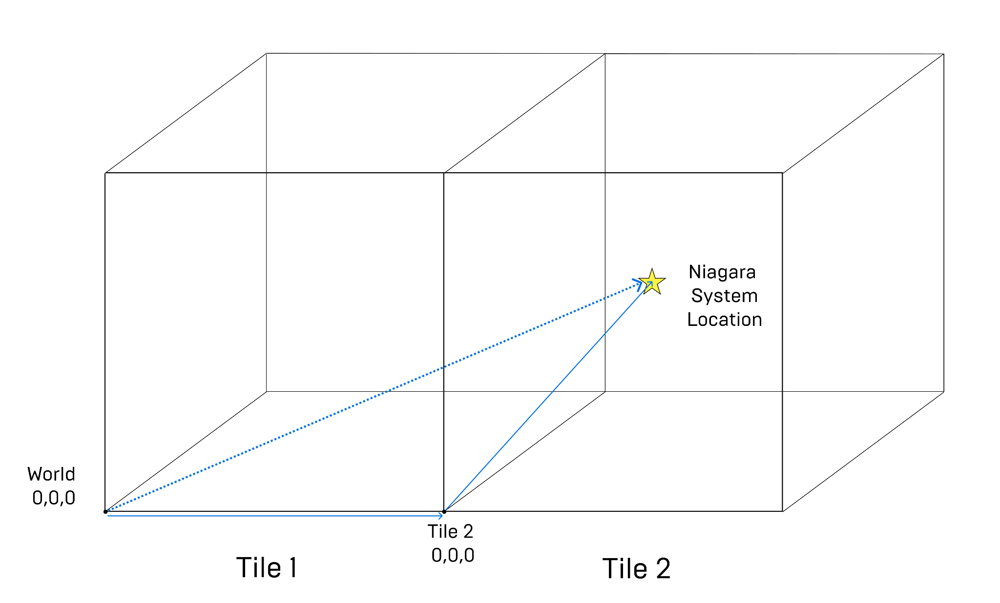
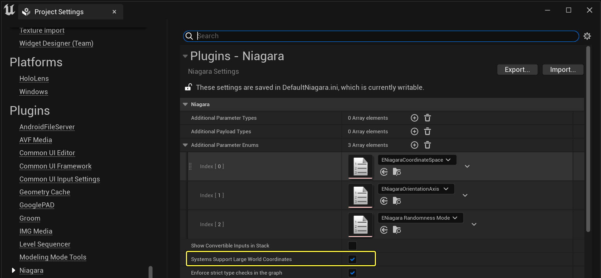
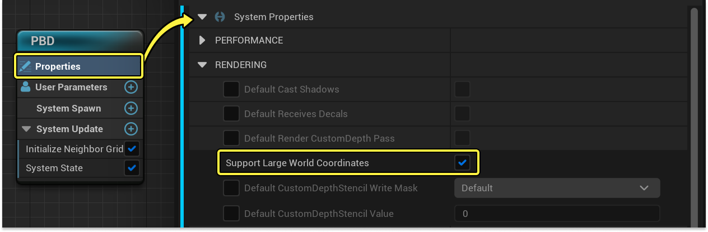
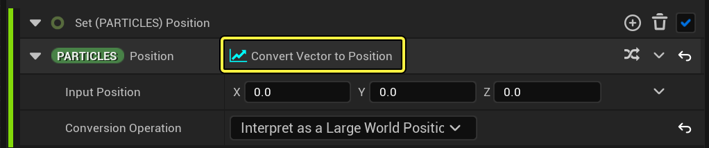
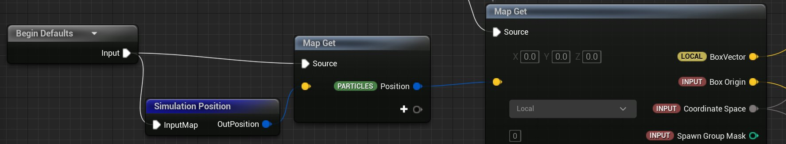
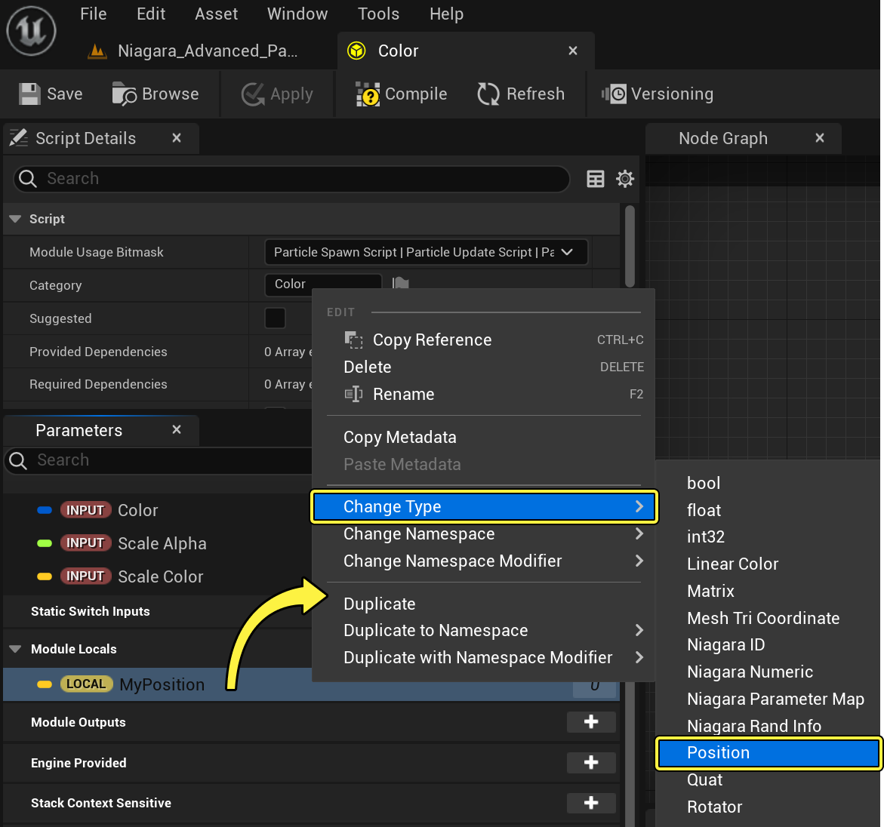
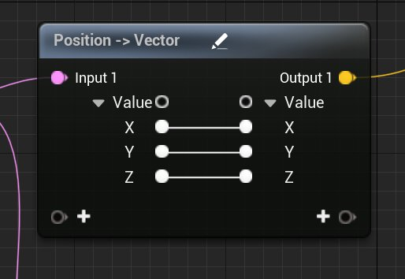
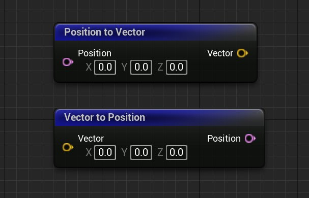

# Niagara中的大型世界坐标

> 路径：虚幻引擎5.7文档 / 创建视觉效果 / Niagara入门介绍 / Niagara中的大型世界坐标

> 原始页面：https://dev.epicgames.com/documentation/unreal-engine/large-world-coordinates-in-niagara-for-unreal-engine

**大型世界坐标** 现已在虚幻引擎中实现。要理解它在主引擎中的实现，请参阅此[大型世界坐标](../../../gameplay-systems/large-world-coordinates/index.md)页面。简而言之，数据类型FVector现在是 `double` 而不是 `float` 。

Niagara实现与主引擎的实现不同。因为需要高效执行计算，无论是在CPU还是GPU上，都存在限制，导致无法处理double。Niagara中改用了一种存储位置数据的新方法。

世界大到一定程度时，将划分为图块网格。想象一下空间中的位置，它在图块单元中有自己的相对位置，还有该图块在世界中的位置。请参见下图，了解其外观的概念呈现。



点击查看大图。

之前，Niagara位置与向量可互换使用，定义为从世界原点出发的方向和距离。现在，要让信息有意义，需要额外数据才能根据所在图块定位发射器。

在UE5中，要保存相对于原点的位置以及系统所在图块的信息，我们需要新的数据格式。这样一来，我们可以区分其他类型的向量和带有这些额外数据的位置。

## UE4和UE5中的位置数据

UE4和UE5之间的主要差异是粒子位置数据的存储方式，即 `Particles.Position` 。

|  | **UE4** | **UE5** |
| --- | --- | --- |
| **Particles.Position类型** | 向量 | 位置 |
| **本地空间发射器（Local space emitter）** | `Particles.Position` 将随Niagara系统在游戏中的原点发生变化 | `Particles.Position` 将随Niagara系统在游戏中的原点发生变化（无变化） |
| **世界空间发射器（World space emitter）** | `Particles.Position` 将随游戏的原点(0,0,0)发生变化 | 激活后，`Particles.Position` 将随系统的位置发生变化。对于小型坐标，这仍是游戏的原点。对于较大型坐标，这可能是任意数字。 |

## 如何在Niagara中启用或禁用大型世界坐标

### 项目中的大型世界坐标

默认情况下，新项目中会开启大型世界坐标。你在UE5中打开项目时，系统会自动转换项目。

如果你的项目不够大，因而不需要大型世界坐标支持，你可以在 **编辑（Edit） > 项目设置（Project Settings）** 中将其彻底关闭。在 **插件（Plugins） > Niagara** 下，找到设置 **系统支持大型世界坐标（System Support Large World Coordinates）** ，然后为你的项目禁用此项。



点击查看大图。

### 系统中的大型世界坐标

你可能需要为项目开启大型世界坐标，但为特定个别系统将其禁用。在这种情况下，你可以在Niagara编辑器中编辑Niagara系统。在 **系统属性（System Properties）** 中的 **渲染（Rendering）** 分段下，你可以禁用 **支持大型世界坐标（Support Large World Coordinates）**。



点击查看大图。

## 如何在Niagara中测试大型世界坐标

当你首次将项目文件从UE4更新到UE5时，或者在你开始测试系统时，你可能需要验证Niagara系统在大型世界坐标中的行为是否恰当。要测试Niagara系统在大型世界坐标中是否正常运行，你需要将该系统移到第一个图块之外。如下所述，你有多种方法可以做到这一点。

### 将效果移到非常远的地方

你可以将效果移到离原点非常远的地方，然后播放效果并验证行为。要进行这种测试而不更改引擎代码本身，这是唯一的办法。例如，你可以将系统移到离原点3000000个单位的地方，这会将其放在原始图块之外的某个图块中。

### 更改图块大小的常量

你还可以在常量定义中更改大型世界坐标的图块大小。在 `Engine/Source/Runtime/Core/Private/Misc/LargeWorldRenderPosition.cpp` 中，将 `UE_LWC_RENDER_TILE_SIZE` 更改为非常小的值，例如10个单位。现在，当你将效果放在关卡中时，只要它离原点超过10个单位，就会出现在新的图块中。

## 更新现有项目

### HLSL中的Particles.Position

如果你在HLSL中为项目编写了自定义脚本，就需要更新这些脚本才能处理大型世界坐标。在之前的版本中，你可能使用了HLSL来直接将 `Particles.Position` 设置为固定值。这并不适用于大型世界坐标。

你可以改为针对该资产禁用大型世界坐标支持，或将世界空间向量转换为位置。



点击查看大图。

如果你需要知道自己位于哪个图块中，此信息存储在 `Engine.Owner.LWCTile` 中。

### 自定义模块

使用 **Niagara脚本编辑器（Niagara Script Editor）** 或 **暂存区（Scratch Pad）** ，你可以创建自己的自定义模块。如果你已经在之前版本中创建了自定义模块，它们在使用大型世界坐标转换为项目时可能并不能隐式适用。

其原因在于位置数据与法线向量之间存在差异，前者包含图块信息，而后者不包含。`Particles.Position` 等核心参数会自动转换为 `position` 类型，但连接到它们的自定义向量输入则不会。

在以下示例中，**盒体原点（Box Origin）** 将 `Particles.Position` 用作默认绑定。但是，它本身不是 `position` 类型。



点击查看大图。

为了维持向后兼容性，将保留现有连接，并且位置类型会转换为法线向量类型。

#### 更改现有向量输入的类型

在Niagara脚本中，如果你有现有模块，可能需要将某些参数更新为 `position` 类型。要将现有向量输入或输出的类型更改为位置类型，请执行以下操作：

1. 在 **Niagara脚本编辑器（Niagara Script Editor）** 中打开模块脚本。
2. 在 **参数（Parameter）** 选项卡中，右键点击你想更改其类型的参数。
3. 从上下文菜单选择 **更改类型（Change Type）> 位置（Position）** 。



点击查看大图。

> [!NOTE]
> 如果将参数更改为位置类型，并且它连接到其他类型的参数，它将创建孤立的引脚连接。这样一来，你可以决定后续怎么做：是将其他参数类型也改掉，还是转换数据的类型。

你只能更改此脚本拥有的参数。如果你从外部继承参数，你会看到该参数呈锁定状态，无法更改类型。

#### 在节点图表中转换向量和位置

如果你在节点图表中将 `vector` 和 `position` 连接起来，系统会添加转换节点 **Position -> Vector** 或 **Vector -> Position** 。但是，请注意，这样做，在复制值的时候不会考虑在原点图块之外发生的大型世界变换。这可能导致丢失关键信息。



点击查看大图。

如果你想将位置类型转换为世界空间向量，可以使用函数 **Position to Vector**。反过来，要将世界空间向量转换为位置，你可以使用 **Vector to Position**。



点击查看大图。

> [!WARNING]
> 每当你从位置转换为向量或反向转换时，都有可能会丢失数据。这可能导致精度损失，或在位于原点文件之外时发生一些不可预测的行为。为了安全起见，从头到尾你都应当使用不经转换的位置。理想情况下，转换为世界空间的操作应当仅在数据接口或渲染器中发生。

### 导出粒子数据接口

你可以使用 **导出粒子（Export Particle）** 数据接口将位置数据发送到蓝图。如果你之前已经在这样使用，你需要为大型世界坐标更新蓝图。

> 图片已省略：undefined

点击查看大图。

在 **Receive Particle Data** 事件节点中有一个名为 **模拟位置偏移（Simulation Position Offset）** 的参数。它将存储你所在图块的偏移数据。你可以在脚本末尾将其添加到模拟位置，以从模拟空间转换回世界空间。

### 动态材质参数

位置数据包含有关图块偏移的额外信息，这些信息无法直接链接到不包含这些信息的向量。如果你的项目设置为通过使用动态输入绑定渲染器中的材质来将位置数据导出到该材质，则不适用于大型世界坐标。要修复这种情况，你可以将位置数据转化为世界空间向量。

> 图片已省略：Converting position data exported to a Material.

> [!WARNING]
> 对于大型坐标，你所在图块的额外偏移信息将丢失，因此会导致大型坐标溢出。

如果你仍有材质绑定可使用，可以将其链接到 `Engine.Owner.LWCTile` 以再次添加回此偏移信息。

> 图片已省略：undefined

点击查看大图。

在材质本身中，你还可以使用 **ConvertNiagaraPositionToWorldspace** 材质函数将图块偏移添加到模拟位置。

> 图片已省略：undefined

点击查看大图。

### 自定义数据接口

如果你创建了自定义数据接口，而且接口中包含用来处理世界空间位置的函数，则你需要更新这些函数。

根据需要，将现有函数替换为将 `FNiagaraPosition` 类型而不是 `FVector` ，以用于其输入和输出。你可以覆盖 `UNiagaraDataInterface::UpgradeFunctionCall` 以升级现有函数用法。

要变换模拟位置，你可以从系统实例获取辅助对象。

```
 		FNiagaraLWCConverter LWCConverter = SystemInstance->GetLWCConverter(); 
```

对于GPU数据接口函数，你可以从提供给着色器上下文的 `FNiagaraDataInterfaceArgs` 获取系统的大型世界坐标图块。如果你需要查看其示例，可以检查摄像机数据接口之类的现有用法。

### 自定义渲染器

读取位置数据的自定义渲染器也需要更新。类似于数据接口，你可以从系统实例获取转换符。唯一的区别是，你还需要知道你所渲染的是否为 **本地空间发射器** ：

```
 		FNiagaraLWCConverter LwcConverter = SystemInstance->GetLWCConverter(bIsLocalSpaceEmitter); 
```

接着，你读取的粒子位置可以使用以下代码变换为世界空间：

```
 		FVector WSPos = LwcConverter.ConvertSimulationPositionToWorld(SimPos); 
```

请检查现有Niagara渲染器，了解已经实现这种情况的例子。
