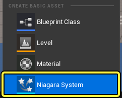
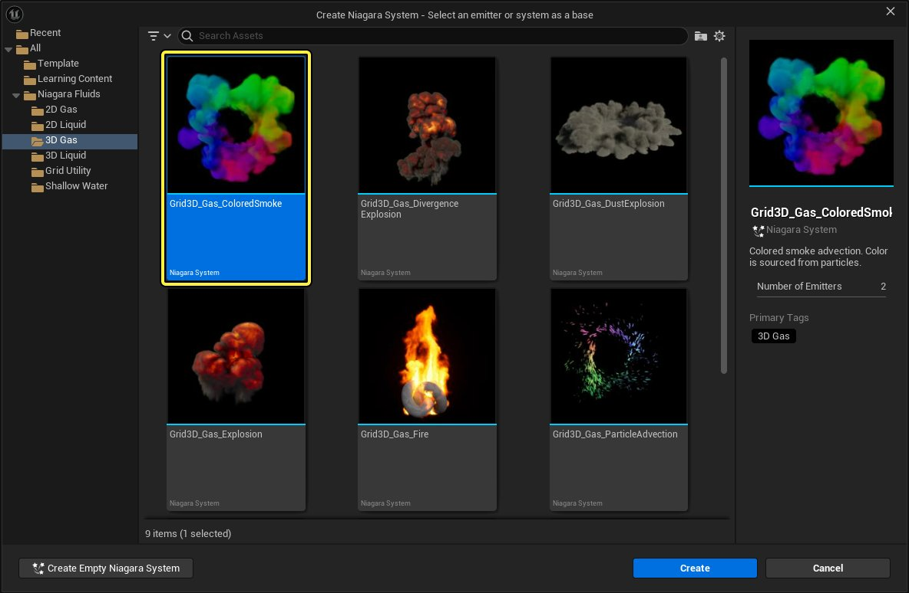
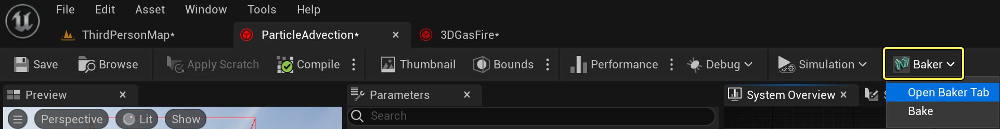
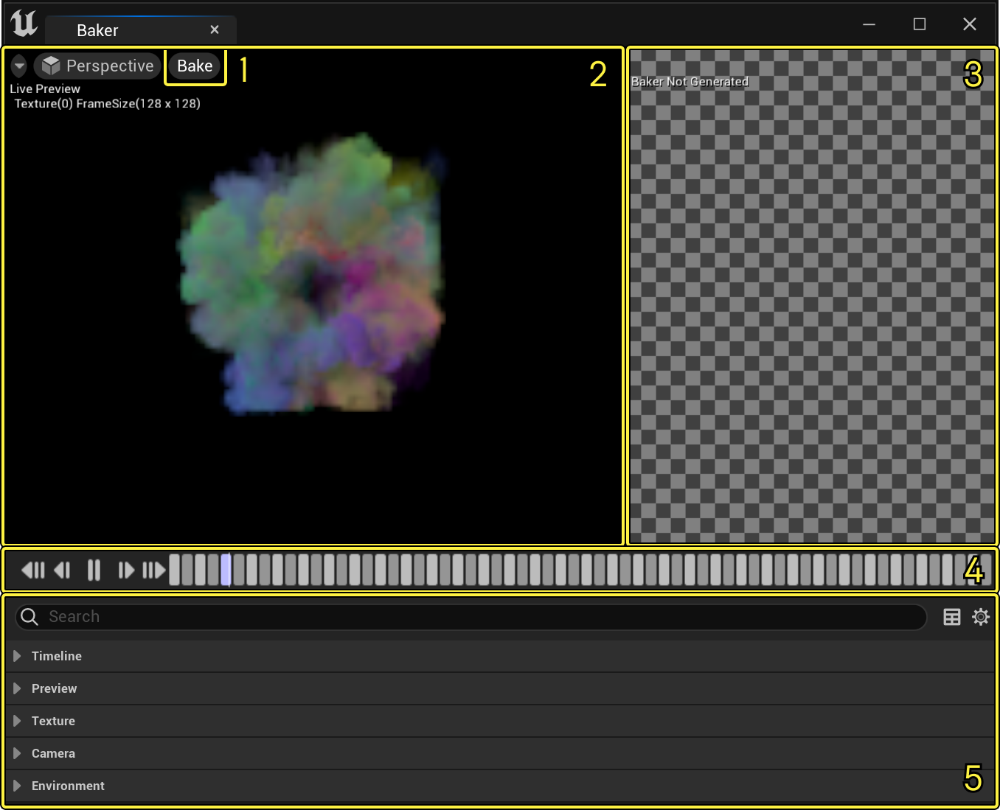
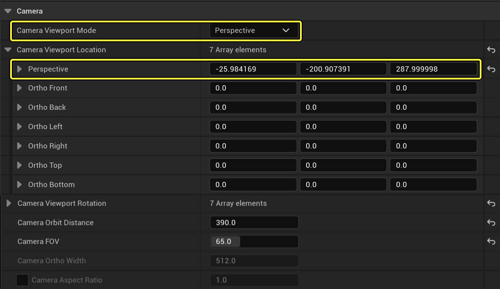
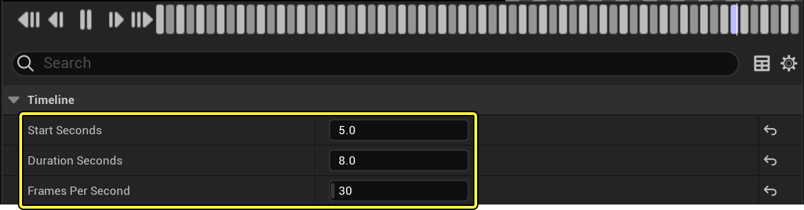
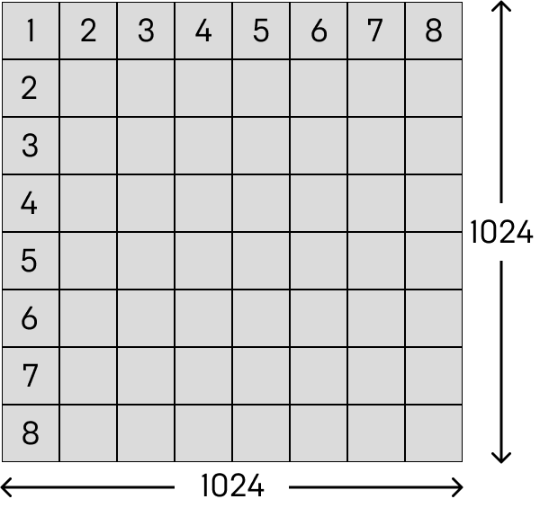
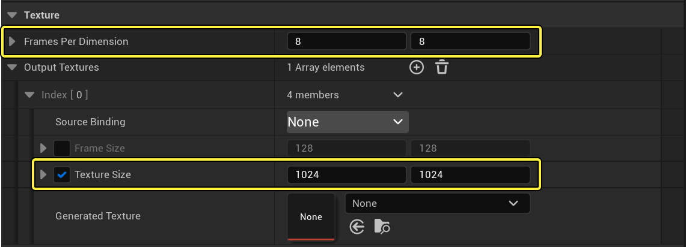

# Niagara图像序列视图烘焙器快速入门指南

> 路径：虚幻引擎5.7文档 / 创建视觉效果 / Niagara入门介绍 / Niagara图像序列视图烘焙器快速入门指南

> 原始页面：https://dev.epicgames.com/documentation/unreal-engine/niagara-flipbook-baker-quick-start-guide-in-unreal-engine

**Niagara系统（Niagara systems）** 可以创建令人震撼的视觉效果。但是，在设计粒子效果时，你必须兼顾视效与性能。有时，你可能创建了很不错的效果，但发现在目标设备上使用时占用了太多内存。

其中一种解决方案是，将Niagara模拟烘焙成 **图像序列视图（Flipbook）** 。这样会创建许多平铺图像，并加载到材质上，以此作为特效。

例如，你想创建3D流体效果，但无法在目标平台上实时运行它。因此，在创建该3D流体效果之后，你可以使用 **烘焙器（Baker）** 将其烘焙成图像序列视图，然后将其应用回2D Sprite发射器。这样一来，你就可以让游戏背景中远处的次要特效拥有更高效的性能。

## 目标

在本教程中，我们将使用Niagara烘焙器，从粒子模拟效果中导出图像序列视图。

## 目的

- 设置图像序列视图的捕获
- 执行捕获
- 将图像序列视图连接到新发射器

## 设置捕获

1. 在 **Niagara编辑器（Niagara Editor）** 中打开现有Niagara系统。本示例使用了 **网格3D气体彩色烟雾（Grid 3D Gas Colored Smoke）** 示例，但你可以使用任意Niagara系统。要使用网格3D气体彩色烟雾，请右键点击 **内容侧滑菜单（Content Drawer）** 并选择 **创建基本资产（Create Basic Asset） > Niagara系统（Niagara System）** 。

   
2. 从Niagara流体模板创建图像序列视图。这些模板在你启用了Niagara流体插件时可用。但是，图像序列视图可以从任意Niagara系统生成。在左侧菜单中选择 **Niagara流体（Niagara Fluids）> 3D气体（3D Gas）**，然后选择 **网格3D气体彩色烟雾（Grid 3D Gas Colored Smoke）** 并点击 **创建（Create）**。

   

   点击查看大图。
3. 在 **主工具栏（main toolbar）** 上，有一个名为 **烘焙器（Baker）** 的新按钮。选择 **打开烘焙器选项卡（Open Baker Tab）** 以显示 **烘焙器面板（Baker panel）** 。

   

   点击查看大图。

### 浏览用户界面

烘焙器面板用户界面有以下部分。

点击查看大图。

1. 烘焙按钮
2. Niagara预览
3. 图像序列（Flipbook）视图预览
4. 播放工具栏
5. 图像序列视图选项

### 将Niagara预览序列帧化

首先，你需要将 **Niagara预览（Niagara Preview）** 窗口中的粒子模拟序列帧化。这会将模拟烘焙到一系列扁平的2D帧，因此请确保设置了所需的角度和大小。

要调整序列帧，你可以直接在Niagara预览窗口中点击和拖动它们。

- 左键点击并拖动以环绕。
- 中键点击并拖动以平移。
- 右键点击并拖动以缩放。
- 点击 **F** ，使帧以系统原点为中心。

你还可以在 **摄像机（Camera）** 设置中输入数字值。选择所需的 **摄像机视口模式（Camera Viewport Mode）** ，然后在对应字段中编辑数字值。

点击查看大图。

### 调整时序

使用 **播放工具栏（Playback Toolbar）** 播放、暂停、前进和后退模拟，以预览将烘焙的内容。

点击查看大图。

你还可以在 **时间轴（Timeline）** 设置中调整时序，只烘焙模拟的一部分。例如，调整 **开始秒数（Start Seconds）** 以在模拟播放开始一段时间后开始图像序列视图。调整 **时长秒数（Duration Seconds）** 以更改结束时间。

设置 **每秒帧数（Frames Per Second）** 以调整组件的函数更新率。通常，你应该不需要调整该值。请将其设置为针对你所编写的内容的相同值。Niagara系统编辑器默认为30 fps。将该值设置得太低可能导致同一个图像序列视图多次渲染，例如，如果你要在1秒内使用捕获的30个帧渲染图像序列视图，并将每秒帧数设置为20，那么你只会录制20个唯一帧，而不是30个。

### 调整纹理大小

按照图像序列视图进行烘焙的方式，它将导出平铺图像，其中每个图块表示图像序列视图的一个帧。你需要设置要将多少个图块映射到纹理，以及总纹理大小。默认情况下，纹理设置为X轴有8个图块，Y轴有8个图块，总纹理大小为1024 x 1024像素。

点击查看大图。

这意味着，每个图块的大小将是128 x 128像素。你可以在 **纹理（Texture）** 设置下调整这些值。

点击查看大图。

通过调整 **每个维度的帧数（Frames Per Dimension）** 来设置图块数量。通过更改 **纹理大小（Texture Size）** 来调整总体纹理的大小。

> [!WARNING]
> 烘焙器不会缩放图块来适应最终分辨率。要获得理想结果，请确保图块数量可整除总体纹理大小。
>
> 例如，如果将每个维度的帧数设置为10 x 10，但将纹理大小保持在1024 x 1024，则系统会尝试将10个图块映射到1024。但是，这会导致每个图块的宽度为102.4像素，系统无法处理非整数像素。因此，系统会将每个图块映射到大小102，最终会在纹理右下角出现4个额外的填充像素。
>
> 这可能导致子UV贴图稍微有偏差，并导致图集在播放时抖动。要获得理想行为，请将纹理大小设置为2的幂，并将每个维度的帧数设置为可整除该纹理大小的数量。

### 设置额外纹理属性

默认情况下，当 **源绑定（Source Binding）** 设置为 **无（None）** 时，烘焙器将输出 **SceneColorHDR** 值。通常，这是所需的结果。但是，所有可用GBuffer和粒子属性都可用，并且你可以从源绑定的下拉菜单选择其中任一项。

> 图片已省略：undefined

点击查看大图。

在你生成第一个图像序列视图之前，**生成的纹理（Generated Texture）** 会设置为无（None）。执行第一个捕获之后，这将替换为你创建的新纹理。

## 执行捕获

你已经使用正确的组帧和时序将纹理设置为按你所需的方式显示，现在可以执行捕获。

1. 从Niagara预览（Niagara Preview）窗口，点击 **烘焙（Bake）** 。

   > 图片已省略：undefined

   点击查看大图。
2. 随着系统渲染图像序列视图，你现在会看到进度条。完成后，界面上将打开对话框，你可以命名纹理文件。

   > 图片已省略：undefined

   点击查看大图。
3. 现在已经渲染好，你的新纹理替换了烘焙器（Baker）窗口的纹理设置中的活动纹理。

   > 图片已省略：undefined

   点击查看大图。

   > [!WARNING]
   > 如果你使用 **生成的纹理（Generated Texture）** 下所选的此纹理生成另一个捕获，它将覆盖此纹理。
4. 如果你想生成纹理的新变体，请点击 **生成的纹理（Generated Texture）** 的下拉菜单，然后选择 **清除（Clear）** 。然后，你可以调整设置并创建新纹理。

   > 图片已省略：undefined

   点击查看大图。

你已经导出了纹理，现在可以将其添加到任意新发射器。你还可以查看图像序列视图纹理的最终外观预览。

## 在发射器中使用图像序列视图纹理

要在发射器中使用图像序列视图，你必须使用 **Sprite渲染器（Sprite Renderer）** 。

1. 要设置此项，请右键点击 **内容侧滑菜单（Content Drawer）** 并创建新 **Niagara系统（Niagara System）** 。
2. 选择 **基于所选发射器的新系统（New system from selected emitter(s)）**，然后选择 **简单Sprite爆炸（Simple Sprite Burst）** 。
3. 点击 **加号(+)** 添加发射器，然后点击 **完成（Finish）** 。

> 图片已省略：undefined

点击查看大图。

### 添加子UV动画模块

要添加你的图像序列视图，你需要在粒子更新（Particle Update）组中添加新模块，以及在Sprite渲染器上调整一些参数。

1. 首先，点击 **粒子更新（Particle Update）** 旁边的 **加号(+)** ，并选择 **子UV动画（Sub UVAnimation）** 。这会将模块添加到堆栈。

   > 图片已省略：undefined

   点击查看大图。
2. 调整模块属性中的 **开始帧** 和 **结束帧** 以匹配动画中的帧数。在本示例中，有8 x 8个帧，共计64个。由于开始帧是第0帧，请将设置保留为0和63。

   > 图片已省略：undefined

   点击查看大图。

### 调整Sprite渲染器上的设置

1. 选择 **Sprite渲染器（Sprite Renderer）** 以调整属性。在 **子UV（Sub UV）** 分段的 **子图像大小（Sub Image Size）** 字段中指定网格中的图块数量。在本示例中，将其保留为8 x 8。

   > 图片已省略：undefined

   点击查看大图。
2. 现在，你需要创建要用于链接子UV纹理的新材质，并将新材质添加到Sprite渲染器中。点击 **材质（Material）** 旁边的下拉菜单，然后选择 **创建新资产（Create New Asset） > 材质（Material）** 。

   > 图片已省略：undefined

   点击查看大图。
3. 界面上将显示一个对话框。命名你的材质，并选择保存位置。

   > 图片已省略：undefined

   点击查看大图。
4. 在 **内容浏览器（Content Browser）** 中双击该材质，在 **材质编辑器（Material Editor）** 中将该材质打开。 在 **细节（Details）** 面板中，将 **混合模式（Blend Mode）** 设置为 **半透明（Translucent）** 。

   > 图片已省略：undefined

   点击查看大图。
5. 在 **材质编辑器（Material Editor）** 中，右键点击并搜索"texture sample"以添加 **TextureSample** 节点。

   > 图片已省略：undefined

   点击查看大图。
6. 选择 **TextureSample节点** 。在 **细节（Details）** 面板中，将 **纹理（Texture）** 设置为图像序列视图烘焙器中保存的某个纹理。

   > 图片已省略：undefined

   点击查看大图。

   > [!TIP]
   > 默认情况下，颜色通道会预乘黑色。要避免Sprite出现黑色边缘，你可以使用除法节点将其从RGB通道删除。
7. 右键点击以添加 **Divide** 节点。
8. 将 **TextureSample** 节点中的 **RGB** 值连接到 **Divide** 节点上的 **A** 引脚，并将 **TextureSample** 中位列第一的 **A** 值连接到 **Divide** 节点上的 **B** 引脚。
9. 将 **Divide** 节点的输出连接到 **自发光颜色（Emissive Color）** 。
10. 最后，将 **TextureSample** 中位列第一的 **A** 值连接到材质上的 **不透明度（Opacity）** 。

    > 图片已省略：undefined

    点击查看大图。

### 最终效果

你的材质已经在Sprite渲染器中正确设置，现在打开Niagara编辑器中的Niagara系统。现在你可以看到你所渲染的图像序列视图在预览窗口中播放。
