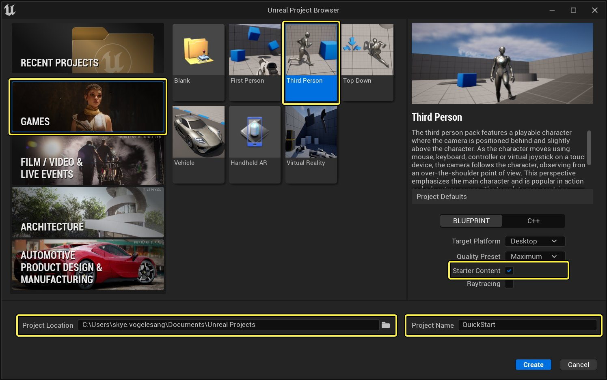
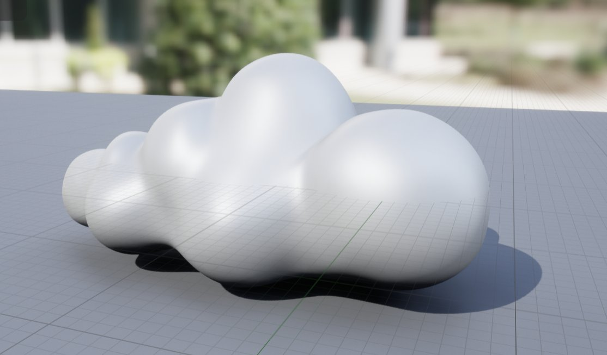
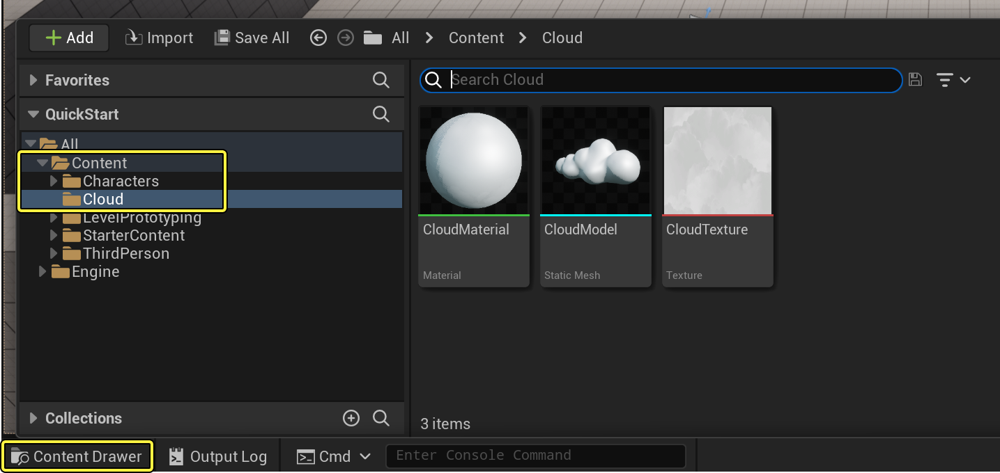
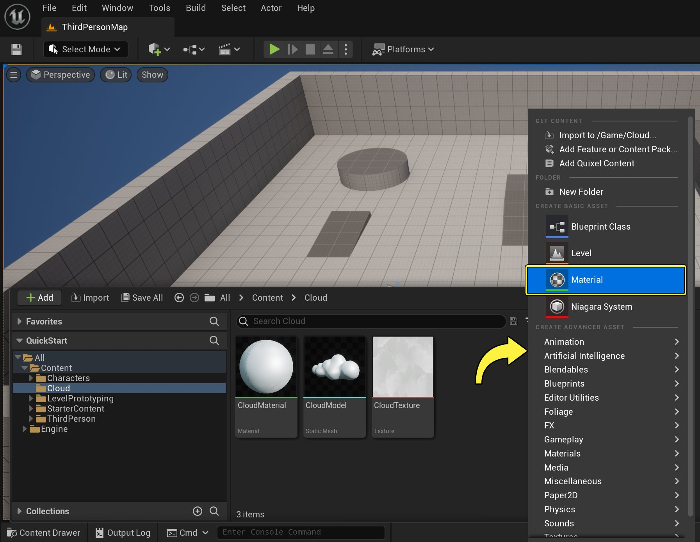
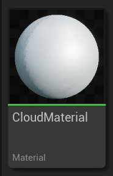
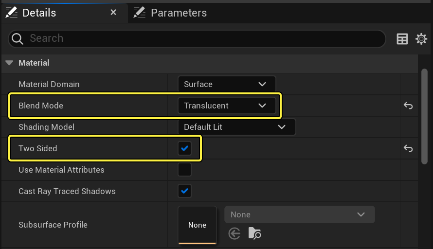
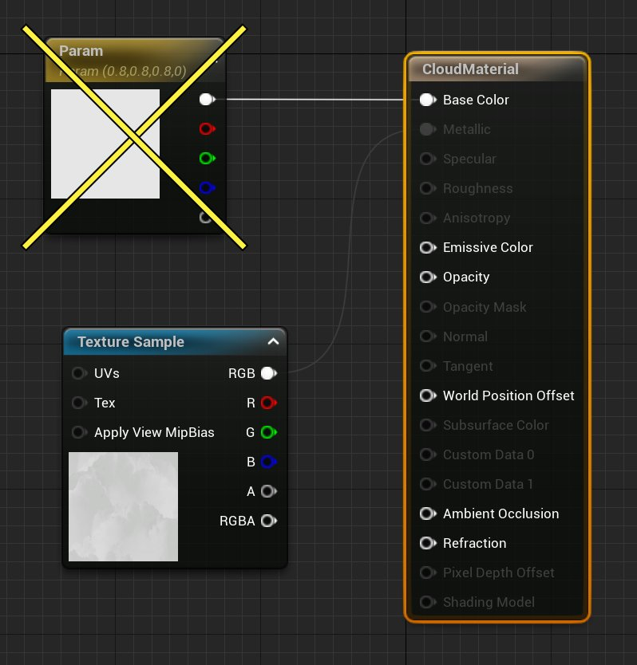
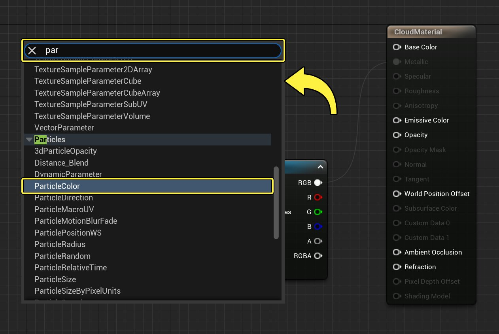

# Niagara快速入门

> 路径：虚幻引擎5.7文档 / 创建视觉效果 / Niagara入门介绍 / Niagara快速入门

> 原始页面：https://dev.epicgames.com/documentation/unreal-engine/quick-start-for-niagara-effects-in-unreal-engine

## 目标

Niagara快速入门旨在让你了解如何用Niagara在虚幻引擎中创建视觉效果（VFX）。在本文中，你将创建一个烟雾特效，用来模拟角色跑步时的扬尘效果。

## 目的

- 在项目中导入Niagara所需的网格体和材质。
- 使用Niagara系统创建一个基础效果。
- 将Niagara效果附加到角色的跑步动画上。

## 1 - 项目设置

> [!NOTE]
> 在本指南中，使用的是已启用 **初学者内容包（Starter Content）** 的 **蓝图第三人称模板（Blueprint Third Person Template）** 项目。若你尚未在虚幻引擎中创建过项目，请参见[创建项目](../../../understanding-the-basics/working-with-projects-and-templates/creating-a-new-project/index.md)了解如何创建项目。

1. 从

   Epic Games启动器

   启动

   虚幻引擎

   。
2. 点击

   游戏（Games）

   ， 然后选择

   第三人称模板（Third Person Template）

   。启用

   初始内容包（Starter Content）

   。
3. 如果需要，

   浏览（Browse）

   打开一个新的

   项目路径（Project Path）

   。
4. 为你的项目设置一个

   项目名称（Project Name）

   。
5. 点击

   创建（Create）

   来创建项目。

点击查看大图。

在创建Niagara效果前，你需要在先项目中设置一些基础材质和资产，以便在接下来的指南中使用。在完成此部分学习后，你将拥有创建Niagara效果所需的一切。

### 创建或导入网格体形状

首先，你需要为效果设置网格体形状。你要创建或者导入的形状为 **云朵（cloud）**。有几种方式在虚幻引擎中添加一个网格体物体：

- 在3D软件中创建你的模型，然后将其作为

  .fbx

  文件导出，这样能够轻易导入虚幻引擎。
- 在网站上（比如

  Sketchfab

  ） 浏览并下载一个免费的云朵模型，然后将其导入虚幻引擎。
- 直接在虚幻引擎中使用

  建模模式

  工具创建模型。

创建或者下载一个和下图类似的云朵模型。

点击查看大图。

> [!NOTE]
> 该教程中使用的云朵模型资产来自[Sketchfab](https://sketchfab.com/)。该模型名为 **CLOUD high poly**，由用户 **gaelinix** 创建，著作权归其所有。该模型使用[Creative Commons Attribution license](https://creativecommons.org/licenses/by/4.0/)证书。
>
> 你可以[在这里下载模型](https://sketchfab.com/3d-models/cloud-high-poly-7f3c3f525f8e42d3b99dcfe3abbc5e54)。

> [!TIP]
> 你也可以制作自己的云朵模型。即使你没有高端3D建模软件，比如3DS Max或者Maya，也可以使用开源的3D模型应用，比如[Blender](http://blender.org/)。

创建或者下载好模型后，在 **内容（Content）** 文件夹中创建一个路径来保存该模型，以便管理。

1. 在内容浏览器（Content Browser）中，右键点击并选择

   新建文件夹（New Folder）

   ，创建一个保存资产的文件夹，命名为

   Cloud

   。

点击查看大图。

1. 将3D模型拖入内容浏览器，直接导入进项目。

> [!TIP]
> 关于将模型导入虚幻引擎的详情，请参阅[导入内容](../../../understanding-the-basics/assets-and-content-packs/importing-assets-directly-into/index.md)。

### 创建并配置材质

当你导入云朵模型时，虚幻引擎可能会自动为该模型创建 **材质（Material）**。否则你需要创建你自己的材质。

1. 在内容抽屉中点击右键并选择

   材质（Material）

   。如果导入模型时虚幻引擎已经自动导入了材质，可以跳过这一步。

点击查看大图。

1. 将新材质命名为

   CloudMaterial

   。

点击查看大图。

1. 双击新材质，在 **材质编辑器（Material Editor）** 中打开它。
2. 选中主材质节点后，在 **细节（Details）** 面板中找到 **材质（Material）** 部分。将 **混合模式（Blend Mode）** 更改为 **半透明（Translucent）**。选中 **双面（Two Sided）** 复选框。将其他设置保留为默认。

点击查看大图。

1. 如果你使用的是导入模型时连带的材质，材质的

   底色（Base Color）

   可能已经连接。将已有的内容删除，因为你需要的是Niagara系统的

   粒子颜色（Particle Color）

   设置来驱动材质的色彩。如果你的

   底色（Base Color）

   没有连接东西，那么可以跳过这一步。

点击查看大图。

1. 右键点击图表，然后在搜索栏中输入

   particle

   。选择

   粒子颜色（Particle Color）

   ，添加Particle Color节点。

点击查看大图。

1. 将Particle Color节点的顶部输出插入到主材质节点上的

   底色（Base Color）

   输入。

> 图片已省略：undefined

点击查看大图。

1. 如果你导入了模型，它可能自动创建并连接了一个

   纹理样本（Texture Sample）

   节点。如果没有的话，可以自行创建一个。按住

   T

   并在节点图表内进行点击即可完成此操作。

> 图片已省略：undefined

点击查看大图。

1. 你需要从

   初始内容包（Starter Content）

   中添加一些噪点来使其看起来像烟雾。选中纹理样本节点后，在

   细节（Details）

   面板中找到

   材质表达式纹理基础（Material Expression Texture Base）

   部分。在

   材质（Material）

   旁边，点击下拉列表，然后在搜索栏中输入

   噪点（Noise）

   。选择

   T_Perlin_Noise_M

   纹理。

> 图片已省略：undefined

点击查看大图。

1. 右键点击图表，然后在搜索栏中输入

   dynamic

   。选择

   动态参数（Dynamic Parameter）

   以添加该节点。

> 图片已省略：undefined

点击查看大图。

1. 选中Dynamic Parameter节点后，在

   细节（Details）

   面板中找到

   材质表达式动态参数（Material Expression Dynamic Parameter）

   分段。在

   数组0

   中，将名称更改为

   Erode

   。

> 图片已省略：undefined

Click image for full size.

1. 右键点击图表，然后在搜索栏中输入

   step

   。选择

   值步（Value Step）

   以添加该节点。

> 图片已省略：undefined

Click image for full size.

1. 从纹理样本节点的

   R

   输出连出引线，并将其插入值步节点的

   梯度（Gradient）

   输入。

> 图片已省略：undefined

Click image for full size.

1. 从动态参数节点的

   Erode

   连出引线，并将其插入

   值步（Value Step）

   节点的

   遮罩偏移值（Mask Offset Value）

   输入。

> 图片已省略：undefined

Click image for full size.

1. 从值步节点的

   结果（Results）

   输出连出引线，并将其插入主材质节点的

   不透明度（Opacity）

   输入。

> 图片已省略：undefined

Click image for full size.

1. 点击

   应用（Apply）

   和

   保存（Save）

   ，然后关闭材质编辑器。

#### 阶段成果

现在你已经导入了一个云朵的网格体模型，并且设置好了材质。你现在已具备了创建Niagara效果所需的一切条件。

## 2 - 创建效果

### 创建系统

接下来将创建Niagara系统。

1. 在

   内容浏览器（Content Drawer）

   中右键点击，选择

   Niagara系统（Niagara System）

   。

> 图片已省略：undefined

Click image for full size.

1. 选择

   来自选定发射器的新系统（New system from selected emitters）

   。然后点击

   下一步（Next）

   。

> 图片已省略：undefined

Click image for full size.

1. 在模板（Template）中，选择

   简单Sprite喷发（Simple Sprite Burst）

   。点击

   加号

   图标（

   +

   ），将发射器添加到要添加到系统的发射器列表中。然后点击

   完成（Finish）

   。

> 图片已省略：undefined

Click image for full size.

1. 将系统命名为

   FX_DustCloud

   。双击在Niagara编辑器中打开它。

> 图片已省略：undefined

Click image for full size.

1. 新系统中发射器实例的默认名称为

   SimpleSpriteBurst

   。但它可以重命名。在

   系统总览（System Overview）

   中双击发射器实例的名称，其字段将变为可编辑。将发射器命名为

   FX_DustCloud

   。

> 图片已省略：undefined

Click image for full size.

> [!TIP]
> 如果你的Niagara系统仅包含一个发射器，那么也可以不重命名。但是，如果创建的Niagara系统中有多个发射器，那么命名对于管理和保持条理非常重要。

### 配置渲染组

发射器显示为一个垂直的列，并且分为不同的组。发射器内的默认分组为：

- 发射器生成（Emitter Spawn）
- 发射器更新（Emitter Update）
- 粒子生成（Particle Spawn）
- 粒子更新（Particle Update）
- 渲染（Render）

> [!TIP]
> 要进一步了解发射器组和它们如何运作，请参见[Niagara 概览](../overview-of-niagara-effects/index.md)页面。

由于你是使用3D模型来生成特效，你需要先设置渲染器组来看到预览。

1. 在

   系统总览（System Overview）

   中，选择

   渲染器（Render）

   ，在

   选择（Selection）

   面板中将其打开。

> 图片已省略：undefined

Click image for full size.

1. 由于你使用的是3D模型，你需要网格体渲染器而不是Sprite渲染器。点击

   垃圾桶

   图标，删除Sprite渲染器。

   选中（Selection）

   面板。

> 图片已省略：undefined

Click image for full size.

1. 选中渲染器组，在 **细节（Details）** 面板中点击 **加号** （**+**）图标，然后从列表中选择 **网格体渲染器（Mesh Renderer）** 来将该模组添加到渲染器组。

   > 图片已省略：undefined

   Click image for full size.
2. 对于**面向模式（Facing Mode）**，请点击下拉列表，然后选择 **速度（Velocity）**。
3. 点击 **网格体（Meshes）** 旁边的三角形来打开下拉列表，在这里可以向渲染器添加一个或者多个网格体对象。点击数组中 **序数0（Index (0)）** 旁边的下拉菜单，然后选择在 **项目设置（Project Setup）** 部分中导入的网格体。

   > 图片已省略：undefined

   Click image for full size.

   1. 点击启用

      覆盖材质（Override Materials）

      。可以指定向网格体应用的材质。默认值为

      0数组元素

      。点击

      加号

      （

      +

      ）图标添加

      数组元素

      。

   > 图片已省略：undefined

   Click image for full size.

   1. 点击

      显示材质（Explicit Mat）

      旁边的下拉列表，然后选择在

      项目设置（Project Setup）

      部分中创建的材质。

   > 图片已省略：undefined

   Click image for full size.

   1. 在

      内容浏览器（Content Browser）

      中，将Niagara系统拖入关卡。将其放置在玩家角色的脚部附近，检查效果相对于角色的大小和形状。

   > [!NOTE]
   > 制作粒子效果时，最好将系统拖入关卡。这样你就能了解每项更改的效果并在情境中编辑。

   #### 阶段成果

   完成该部分后，你就拥有了Niagara系统和发射器实例，并且已将系统拖入关卡，以便在玩家角色旁边预览。在下一部分中，你将在Niagara系统中编辑设置，创建尘云效果。

   ## 3 - 编辑模块设置

   Niagara编辑器会以堆栈形式显示每个发射器，每个发射器都拥有若干组设置。你将逐个编辑各组设置中的模块。

   > [!NOTE]
   > 该特效在不包含发射器生成（Emitter Spawn）组中的模块。因此你将跳过这些组。更多不同组及其功能的相关信息，请参考[Niagara 概览](../overview-of-niagara-effects/index.md)页面。

   ### 配置发射器更新组

   首先，在发射器更新（Emitter Update）组中编辑模块。位于该组中的模块会随着系统逐帧更新。

   1. 在

      系统总览（System Overview）

      中，点击

      发射器更新（Emitter Update）

      组，在

      选择（Selection）

      面板中将其展开。

   > 图片已省略：undefined

   Click image for full size.

   1. 展开 **发射器状态（Emitter State）** 模块。默认情况下，**生命周期模式（Life Cycle Mode）** 应设为 **自身（Self）**。
   2. 将 **发射器状态（Emitter State）** 设置更改为以下值。这样就能让尘云只产生一次然后就消散。

   > 图片已省略：undefined

   Click image for full size.

   | 参数 | 值 |
   | --- | --- |
   | **生命周期模式（Life Cycle Mode）** | 自身（Self） |
   | **无效响应（Inactive Response）** | 完成（Complete） |
   | **循环行为（Loop Behavior）** | 一次（Once） |
   | **循环时长模式（Loop Duration Mode）** | 固定（Fixed） |
   | **循环时长（Loop Duration）** | 1 |

   1. 展开

      生成瞬时喷发（Spawn Burst Instantaneous）

      模块。将

      生成数量（Spawn Count）

      设置为

      10

      。生成数量为10将生成大小合适、足够可见的尘云。

   > 图片已省略：undefined

   Click image for full size.

   ### 配置粒子生成组

   然后，在粒子生成（Particle Spawn）组中编辑模块。此为首次生成粒子时应用于粒子的行为。

   1. 在

      系统总览（System Overview）

      中，点击

      粒子生成（Particle Spawn）

      组，在

      选择（Selection）

      面板中将其展开。

   > 图片已省略：undefined

   Click image for full size.

   1. 展开

      初始化粒子（Initialize Particle）

      模块。在

      点属性（Point Attributes）

      中，找到

      生命周期模式（Lifetime Mode）

      设置。使用下拉菜单并选择

      随机（Random）

      。此操作将

      最小值（Minimum）

      和

      最大值（Maximum）

      域添加到生命周期（Lifetime）值。这会让每个粒子的显示时间产生一些随机变化。将

      最小值（Minimum）

      和

      最大值（Maximum）

      域设置如下。

   > 图片已省略：undefined

   点击查看大图。

   | 设置 | 数值 |
   | --- | --- |
   | 最小值（Minimum） | .4 |
   | 最大值（Maximum） | .6 |

   1. 找到

      颜色（Color）

      设置。在示例中，

      颜色（Color）

      看起来类似于灰尘的浅棕色。点击颜色表，使用取色器选择一个颜色。该数值会保存至

      粒子颜色（Particle Color）

      ，你已经在项目设置那一步将其连接到材质上。

   > 图片已省略：undefined

   Click image for full size.

   1. 你需要对粒子的大小做出一些变化，向网格体大小添加一个随机因素。在

      网格体属性（Mesh Attributes）

      ，找到

      网格体缩放模式（Mesh Scale Mode）

      下拉菜单。选择

      随机均匀（Random Uniform）

      。 将

      网格体统一最小值大小（Mesh Uniform Scale Min）

      和

      网格体统一最大值大小（Mesh Uniform Scale Max）

      设置为以下值。

   > 图片已省略：undefined

   Click image for full size.

   | 设置 | 值 |
   | --- | --- |
   | Mesh Uniform Scale Min | 1.0 |
   | Mesh Uniform Scale Max | 2.0 |

   1. 选中

      粒子生成（Particle Spawn）

      组，点击

      加号

      （

      +

      ）来向该组中添加新的模块。选择

      朝向（Orientation）>初始网格体朝向（Initial Mesh Orientation）

      。其中包含粒子网格体的旋转设置。你需要给形状添加一些旋转效果，避免它们过于雷同。这样会使尘云看起来更自然。

   > 图片已省略：undefined

   Click image for full size.

   1. 在

      旋转（Rotation）

      中点击启用模块中的初始旋转。点击

      旋转（Rotation）

      旁边的向下箭头，然后选择

      动态输入（Dynamic Inputs）>随机范围向量（Random Ranged Vector）

      。

   > 图片已省略：undefined

   Click image for full size.

   1. 最小值和最大值会给初始旋转生成一个随机因数。保留默认的

      最小值

      和

      最大值

      不需要改变。

   > 图片已省略：undefined

   Click image for full size.

   1. 选中

      粒子生成（Particle Spawn）

      组，点击

      加号

      （

      +

      ）来添加一个新的模块。选择

      位置（Location）> 形状位置（Shape Location）

      。形状位置模块可以让你设置一个区域，并在该区域内生成新的粒子。

   > 图片已省略：undefined

   Click image for full size.

   1. 在该示例中，将

      形状图元（Shape Primitive）

      设置为

      圆柱体（Cylinder）

      。取决于你想要的样式，在将来的其它示例中可以尝试不同的形状。现在，需要使尘云靠近地面，请将

      圆柱体高度（Cylinder Height）

      更改为

      1

      。若不希望尘云比脚大太多，请将

      圆柱体半径（Cylinder Radius）

      更改为

      10

      。

   > 图片已省略：undefined

   Click image for full size.

   | 设置 | 数值 |
   | --- | --- |
   | 形状图元 | 圆柱体 |
   | 圆柱体高度 | 1.0 |
   | 圆柱体半径 | 10.0 |

   1. 选中

      粒子生成（Particle Spawn）

      组， 点击

      加号

      (

      +

      ) 来向该组中添加新的模块。选择

      速度（Velocity） > 添加速度（Add Velocity）

      。在粒子生成组中添加速度后，会给刚刚生成的粒子一个初始速度，以指定的速度移动。

   > 图片已省略：undefined

   Click image for full size.

   1. 将

      速度模式（Velocity Mode）

      设置为

      从点（From Point）

      。这会从Niagara系统的原点放射性朝外施加速度。将

      速度（Velocity Speed）

      设为

      20

      。你不希望让粒子扩散太远，只要能够表现出尘土来自角色的奔跑即可。你可以按需调节该数值来达到你想要的样式。

   > 图片已省略：undefined

   Click image for full size.

   1. 选中

      粒子生成（Particle Spawn）

      组， 点击

      加号

      (

      +

      ) 来向该组中添加新的模块。选择

      力（Forces） > 加速力（Acceleration Force）

      。要用这个模块来给尘土云施加一个向上的冲量，这样尘埃就能从脚步位置向上散开。

   > 图片已省略：undefined

   Click image for full size.

   > [!WARNING]
   > 在你添加速度或力模块后，会显示一个错误，因为添加的模块总是位于组的堆栈的底部。这样会导致它们放在 **解算力和速度（Solve Forces and Velocity）** 模块之后。需要将所有的速度和力模块放在其之前才能正确运算。

   1. 点击

      修复问题（Fix Issue）

      来解决该错误。或者你也可以手动将模块拖动至解算力和速度之上。

   > 图片已省略：undefined

   Click image for full size.

   1. 在加速力模块中，将

      加速度

      设置为

      X：0，Y：0，Z：200

      。现在尘埃云会向外和向上扩散，但是向上的动力有点太大了。在粒子更新（Particle Update）步骤中，你将在每一帧上添加阻力，以减慢尘埃粒子的上升动量。

   > 图片已省略：undefined

   Click image for full size.

   ### 配置粒子更新组

   最后，在粒子更新（Particle Update）组中编辑设置。这些行为会应用到粒子上并且每帧更新。

   1. 在

      系统总览（System Overview）

      中，点击

      粒子生成（Particle Spawn）

      组来在

      选择（Selection）

      面板中将其展开。

   > 图片已省略：undefined

   Click image for full size.

   1. 点击

      垃圾桶

      图标，删除

      缩放色阶（Scale Color）

      模块。此效果不需要该模块。

   > 图片已省略：undefined

   Click image for full size.

   1. 选中 **粒子生成（Particle Spawn）** 组， 点击 **加号** (**+**) 来向该组中添加新的模块。选择 **材质（Materials）> 动态材质参数（Dynamic Material Parameters）**。这样就可以连接到材质中的Erode动态参数（Erode Dynamic Parameter）。

      > [!TIP]
      > 可以通过拖动来重新排列系统概述中发射器节点内的模块。但无法在选择（Selection）面板中重新排列模块。

      > 图片已省略：undefined

      Click image for full size.
   2. 在 **动态材质参数（Dynamic Material Parameters）** 模块中，你应该会看到我们在材质中设置的 **Erode** 参数。点击Erode的向下箭头，然后选择 **动态输入（Dynamic Inputs）> 来自曲线的浮点（Float from Curve）**。

   > 图片已省略：undefined

   Click image for full size.

   1. 在曲线编辑器中，点击

      下降（Drop off）

      模板来将其应用到曲线上。这会让材质慢慢消散。

   > 图片已省略：undefined

   Click image for full size.

   1. 选中 **粒子生成（Particle Spawn）** 组， 点击 **加号** (**+**) 来向该组中添加新的模块。选择 **力（Forces）>阻力（Drag）**。

      > [!WARNING]
      > 在你添加速度或力模块后，会显示一个错误，因为添加的模块总是位于组的堆栈的底部。这样会导致它们放在 **解算力和速度（Solve Forces and Velocity）** 模块之后。需要将所有的速度和力模块放在其之前才能正确运算。点击 **修复问题（Fix Issue）** 可解决此错误。

      > 图片已省略：undefined

      Click image for full size.
   2. 在阻力模块中，将 **阻力（Drag）** 设为 **8**。**阻力（Drag）** 设置会与加速力相互作用，防止尘云的向上运动看起来不够真实。

   > 图片已省略：undefined

   Click image for full size.

   #### 阶段成果

   你已创建了尘土效果，现在你应该能在关卡中的玩家出生点模型旁边的位置看到此效果。若你觉得效果不合适，你可以调整各种模块设置，直到达到满意的效果。

   ## 4 - 将Niagara效果附加到角色

   现在要将此效果添加到角色的奔跑动画中。在此示例中，你将把效果添加到第三人称模板中的通用 **Quinn** 角色上。不过，你也可以用这些步骤将Niagara效果添加到虚幻引擎中的任意角色身上。

   1. 在

      内容浏览器（Content Drawer）

      中，前往

      Content > Characters > Mannequins > Animations > Quinn

      。双击

      MF_Run_Fwd

      动画，将其在

      动画编辑器（Animtion Editor）

      中打开。

   > 图片已省略：undefined

   Click image for full size.

   1. 在

      动画时间轴（Animation timeline）

      中点击

      暂停（Pause）

      可暂停循环动画。使用滑动指针找到角色右脚接触地面的瞬间。你需要在该位置添加尘土效果。

   > 图片已省略：undefined

   点击查看大图。

   1. 找到

      通知（Notifies）

      分段。借助通知，你可以在动画上的某个位置进行标记，以便播放粒子效果。为了保持时间轴的整洁，创建一个新的轨道来放置Niagara事件。点击

      轨道（Track）

      ， 然后选择

      添加通知轨道（Add Notify Track）

      。将其命名为

      Niagara

      。

   > 图片已省略：undefined

   点击查看大图。

   1. 会看到一条位于时间轴拖动条下方的直线。右键点击播放头和Niagara动画通知轨道相交的位置。选择

      添加通知（Add Notify）> 播放Niagara粒子效果（Play Niagara Particle Effect）

      。这样就能在动画中的该点位置上放置一个标记，并且带有默认标签PlayNiagaraEffect。

   > 图片已省略：undefined

   Click image for full size.

   1. 选中

      PlayNiagaraEffect

      通知，在

      细节（Details）

      面板中找到

      动画通知（Anim Notify）

      部分。在此处选择要添加到动画中的Niagara系统。点击

      Niagara系统（Niagara System）

      旁边的下拉菜单，然后选择在Niagara中创建的

      FX_DustCloud

      系统。通知上的标签更改为

      FX_DustCloud

      。

   > 图片已省略：undefined

   Click image for full size.

   1. 对左脚重复上述步骤。你也可以直接在时间轴中复制粘贴动画通知。要更好地优化效果，你可以调整云朵的位置来匹配每只脚接触地面的位置。选中

      动画通知（Anim Notify）

      ，找到

      位置偏移（Location Offet）

      数值。按照需求调整数值。

   > 图片已省略：undefined

   Click image for full size.

   1. 点击时间轴上的 **播放** 按钮来预览效果，并且调整各项数值。
   2. 关闭动画编辑器。在 **关卡编辑器（Level Editor）** 中，点击 **游玩（Play）** 按钮来预览关卡。在关卡中来回跑动来观看你的特效实际效果。

   #### 阶段成果

   你已成功将Niagara效果添加到角色的奔跑动画中。祝贺你！

   ### 优化尘土云的外观

   你可能想要继续微调各项数值来取得理想的最终结果。现在场景已经设置好，你可以尝试的以下的一些选项：

   - 试着调整

     初始化粒子（Initialize Particle）

     模块中的颜色。
   - 向

     粒子更新（Particle Update）

     组中添加一个

     缩放网格体大小（Scale Mesh Size）

     模块。将

     缩放因数（Scale Factor）

     设置到

     来自曲线的向量（Vector from Curve）

     ，并且尝试用不同形状的曲线来随着时间改变云朵的大小。
   - 在

     网格体渲染器（Mesh Renderer）

     中微调模型的大小。
   - 在

     动画通知（Anim Notify）

     中微调云朵的位置。

   ## 5 -查看最终结果

   现在你已经完成了该快速入门中效果的制作。最终结果应该和如下类似。

   ## 6 - 自行尝试！

   在创建完基础效果并将其添加到角色身上后，你可以接着尝试一些其他的教程，为该角色执行更多操作。你还可以在Niagara中制作更多效果。

   - 你可以使用

     条带

     来创建角色奔跑时身后的尾迹。
   - 查看

     动画教程

     ，了解如何为角色创建或修改其他动画。
   - 你可以学习如何使用

     动画蓝图

     为角色添加更多效果。
