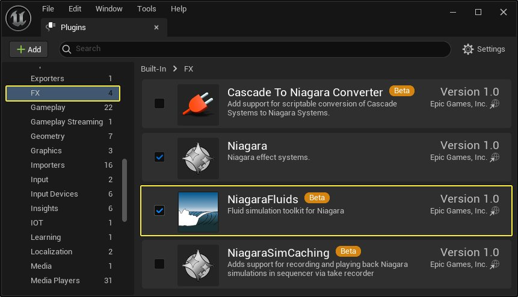
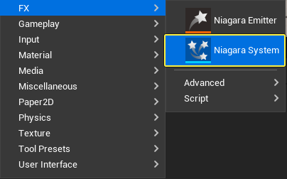
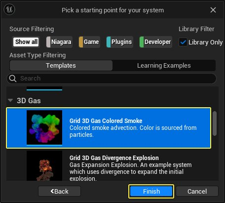
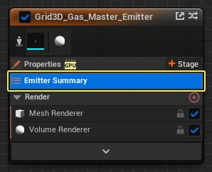
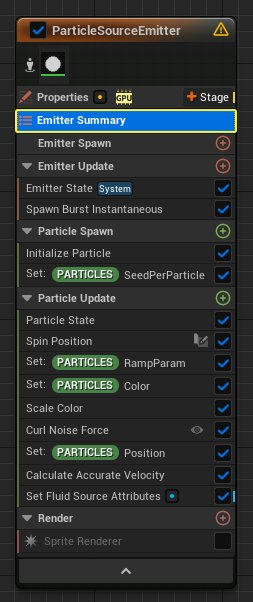
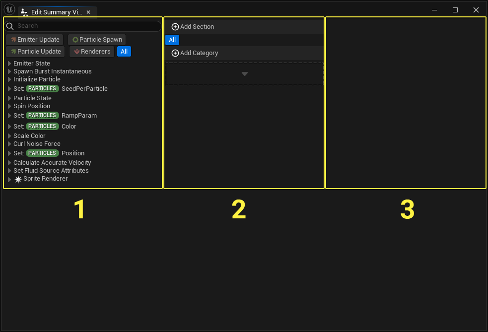
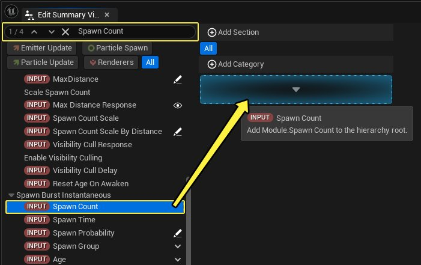
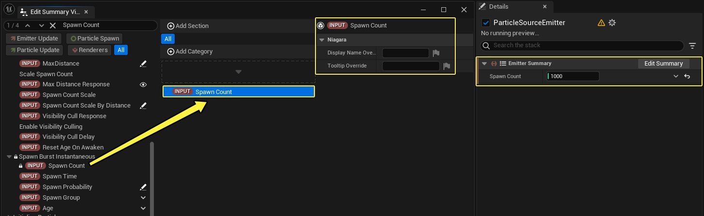

# 摘要视图快速入门指南

> 路径：虚幻引擎5.7文档 / 创建视觉效果 / Niagara入门介绍 / 摘要视图快速入门指南

> 原始页面：https://dev.epicgames.com/documentation/unreal-engine/summary-quick-start-guide

## 概述

在虚幻引擎中构建高级视觉效果时，Niagara系统会变得相当复杂。每个发射器可能会包含数十甚至数百个参数，用于控制最终输出。这对视觉效果美术师和高级用户来说很有用。但对于新手或非视觉特效处理美术师来说，这就超出能力范围了。

用户可以使用 **摘要视图（Summary View）** 创建发射器的参数子集。此视图完全可自定义，仅含用户选定的参数。这有助于突出显示会影响模拟的关键参数，或者向非技术用户公开特定参数以方便使用。

在任意Niagara系统中，每个发射器可以创建一个摘要视图。此例中，发射器默认设置了摘要视图，你将使用发射器附带的流体系统。然后你将从头创建一个。

## 创建Niagara系统

本小节中，你将新建一个Niagara系统，并看到其默认摘要视图。

1. 要打开 **插件（Plugins）** 窗口，请点击 **设置（Settings）> 插件（Plugins）** 。转到 **FX** 类别，并启用 **NiagaraFluids** 插件。必要时重启虚幻引擎编辑器。

   
2. 在 **内容浏览器（Content Browser）** 中点击右键，然后选择 **FX > Niagara系统（Niagara System）**。

   
3. 选择 **基于模板或行为示例的新系统（New system from a template or behavior example）** ，然后点击 **下一步（Next）** 。

   ！[选择基于模板或行为示例的新系统，然后点击下一步](https://dev.epicgames.com/documentation/404)
4. 选择 **网格3D气体彩色烟雾（Grid 3D Gas Colored Smoke）** ，然后点击 **完成（Finish）** 。将该Niagara系统命名为 **NS_ColoredSmoke** 。

   
5. 双击打开 **NS_ColoredSmoke** 。选择 **Grid3D_Gas_Master_Emitter** ，然后点击 **发射器摘要（Emitter Summary）** 。

   
6. 转到 **细节（Details）** 面板以查看此发射器的 **摘要视图（Summary View）** 。

   摘要视图由 **分段（Sections）** (1)和单独的 **参数（Parameters）** (2)组成。分段充当要显示的参数的过滤器。参数可以是单独的变量、整个模块，甚至是渲染器及其属性。此外，你可以创建类别（无图示），以进一步将各个参数分组到特定分段下。

   ！[摘要视图由分段(1)和参数(2)组成](https://dev.epicgames.com/documentation/404)

## 创建你的第一个摘要视图

本小节中，你将为一个发射器创建摘要视图。你还将学会如何搜索和添加参数。

1. 在 **NS_ColoredSmoke** 中，选择 **ParticleSourceEmitter** 并点击 **发射器摘要（Emitter Summary）** 。

   
2. 转到 **细节（Details）** 面板，注意 **摘要视图（Summary View）** 为空。点击 **编辑摘要（Edit Summary）** 以打开 **编辑摘要视图（Edit Summary View）** 窗口。

   ！[点击编辑摘要以打开编辑摘要视图窗口](https://dev.epicgames.com/documentation/404)
3. 编辑摘要视图（Edit Summary View）窗口包括以下区域：

   - (1)

     源列表（Source List）

     区域，可在其中搜索信息源，包括各个参数、模块、渲染器等。选择源并将其拖动到类别(2)，以将其包含在你的摘要视图中。
   - (2)

     分段（Section）

     和

     类别（Category）

     区域。可在其中将你的参数有序地放到类别和分段下。
   - (3)

     细节（Details）

     区域。此区域将显示选定元素的详细信息。

   
4. 点击搜索栏并键入"Spawn Count"。然后点击 **生成计数（Spawn Count）** 并将其拖入 **添加类别（Add Category）** 按钮下方的区域内。

   

   选择该参数，以在 **细节（Details）** 区域内查看可用信息。这种情况下，你可以输入 **显示名覆盖** 和 **提示覆盖** 。还要注意发射器的摘要视图是如何即时更新并显示生成计数（Spawn Count）参数的。

   
5. 按照上述步骤，将以下参数添加到你的摘要中：**颜色（Color）** 、 **噪点强度（Noise Strength）** 、 **噪点频率（Noise Frequency）** ，如下所示。

   > 图片已省略：将以下参数添加到你的摘要中：颜色、噪点强度、噪点频率
6. 你的摘要视图看起来应该类似于下图。

   > 图片已省略：你应在摘要视图中看到你的参数

## 整理你的摘要视图

本小节中，你将为摘要视图创建各个类别和分段。你还将对其中一个参数使用显示名覆盖（Display Name Override）。

1. 在 **编辑摘要视图（Edit Summary View）** 窗口中，点击 **添加类别（Add Category）** ，并将你的类别命名为 **Particle Spawn** 。

   > 图片已省略：点击添加类别
2. 点击 **生成计数（Spawn Count）** 参数并将其拖动到 **粒子生成（Particle Spawn）** 类别，将该参数嵌套到该分类中。

   > 图片已省略：点击生成计数参数并将其拖动到粒子生成类别
3. 添加类别 **粒子颜色（Particle Color）** ，然后在其中添加 **颜色（Color）** 参数。添加类别 **粒子噪点（Particle Noise）** ，然后添加参数 **噪点强度（Noise Strength）** 和 **噪点频率（Noise Frequency）** 。

   > 图片已省略：添加类别粒子颜色和粒子噪点。添加颜色、噪点强度、噪点频率参数
4. 点击 **添加分段（Add Section）** 并将新分段命名为 **Color** 。系统将默认选择你的新分段。注意，此新分段不包含参数或类别。

   > 图片已省略：点击添加分段并将新分段命名为Color

   > 图片已省略：注意，此新分段不包含参数或类别
5. 点击 **全部（All）** 分段。选择 **粒子颜色（Particle Color）** 类别并将其拖动到 **颜色（Color）** 分段中。

   > 图片已省略：选择粒子颜色类别并将其拖动到颜色分段中

   点击 **颜色（Color）** 分段以查看 **粒子颜色（Particle Color）** 类别，以及与该类别关联的参数。

   > 图片已省略：点击颜色分段以查看粒子颜色类别
6. 返回到 **全部（All）** 分段，并新建一个名为 **Forces** 的分段。然后选择 **粒子噪点（Particle Noise）** 分类并将其拖动到该分段中。

   > 图片已省略：新建一个名为Forces的分段并将粒子噪点分类拖动到该分段中
7. 返回到 **全部（All）** 分段，并选择 **生成计数（Spawn Count）** 参数。在 **细节（Details）** 区域，点击 **显示名覆盖（Display Name Override）** 输入框并输入 **粒子计数（Particle Count）** 。

   选择生成计数参数。在细节区域，点击显示名覆盖输入框并输入粒子计数。
8. 你的摘要视图现在应反应你的所有分段和类别。

   > 图片已省略：你的摘要视图现在应反应你的所有分段和类别

## 从发射器添加参数

除了使用编辑摘要视图（Edit Summary View）窗口，在发射器中工作的同时，你可以将参数直接添加到摘要视图。这样，在处理发射器时你可以更轻松地构建摘要视图。

要从发射器添加参数，请遵循以下步骤：

1. 退出 **编辑摘要视图（Edit Summary View）** 窗口，并在发射器中点击 **粒子更新（Particle Update）** 。

   > 图片已省略：在发射器中点击粒子更新
2. 转到 **细节（Details）** 面板，然后向下滚动到 **旋度噪点力（Curl Noise Force）** 模块。右键点击 **噪点质量/成本（Noise Quality/Cost）** 参数并选择 **添加到发射器摘要（Add to Emitter Summary）** 。

   右键点击噪点质量/成本参数并选择添加到发射器摘要。
3. 向上滚动到 **旋转位置（Spin Position）** 模块。右键点击该模块名称，并选择 **添加到发射器摘要（Add to Emitter Summary）** 。你可以将单独的参数、整个模块等添加到摘要视图。

   > 图片已省略：向上滚动到旋转位置模块。右键点击该模块名称并选择添加到发射器摘要
4. 在发射器中点击摘要视图（Summary View）以确认已添加你的参数。

   > 图片已省略：在发射器中点击摘要视图（Summary View）以确认已添加你的参数
