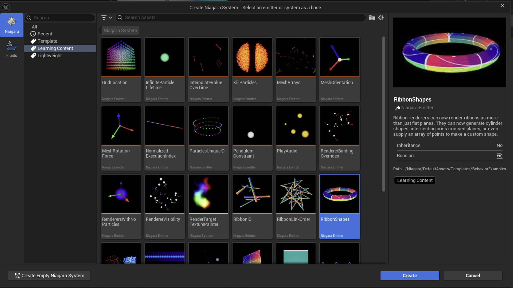
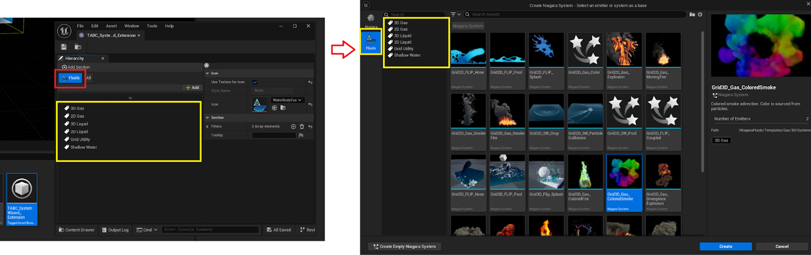
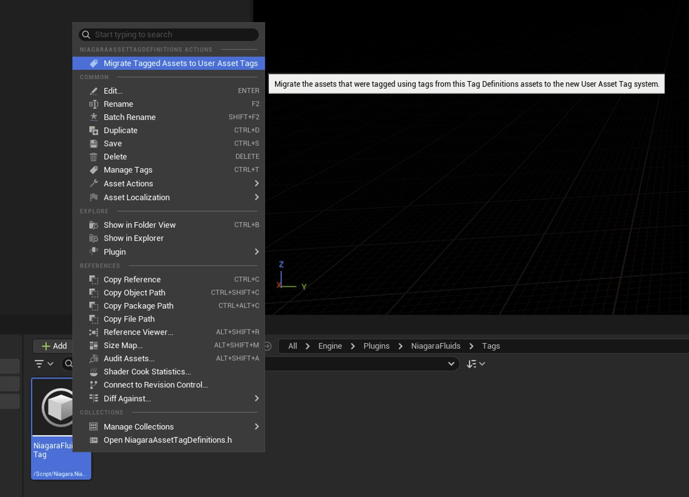

# 升级Niagara标签

> 路径：虚幻引擎5.7文档 / 创建视觉效果 / Niagara入门介绍 / 升级Niagara标签

> 原始页面：https://dev.epicgames.com/documentation/unreal-engine/upgrading-niagara-tags-in-unreal-engine

**Niagara资产浏览器**会随着虚幻引擎5.7的发布而更新，这意味着你需要升级使用Niagara资产标签的现有Niagara系统和发射器，才能使用新的**标记资产浏览器配置**资产。

对于使用Niagara资产标签的项目，我们建议重新保存现有的Niagara系统和发射器。 加载后，标签将自动传输到新的用户资产标签系统。

如果你在现已废弃的**Niagara资产标签定义**资产中定义了自己的标签，我们添加了新的上下文操作。 此操作叫着到所有包含内部定义标签的Niagara资产，并要求重新保存。

对于在C++中定义的内部标签，你可以找到包含你想更新的资产的文件夹，并使用控制台命令`fx.Niagara.MigrateInternalTagsToUserAssetTags`。
