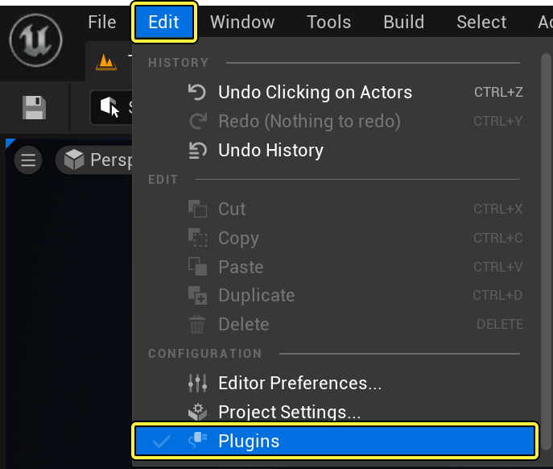
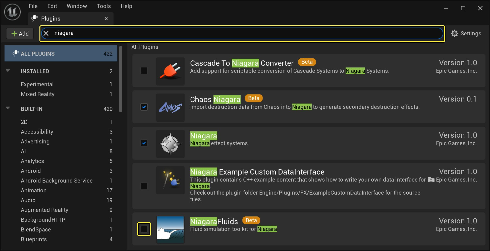
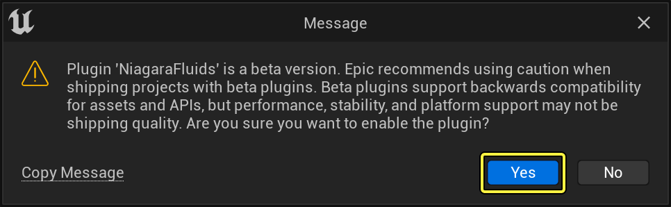
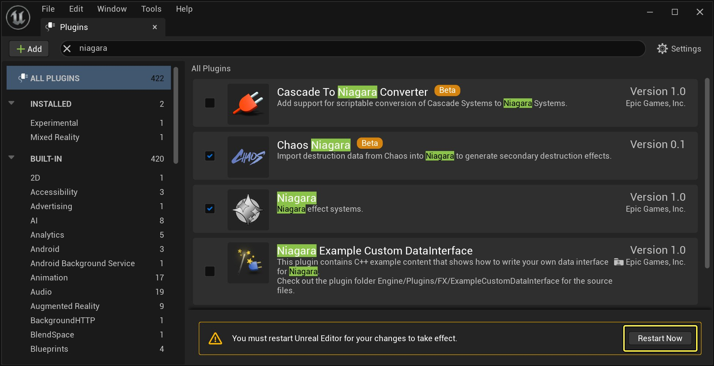
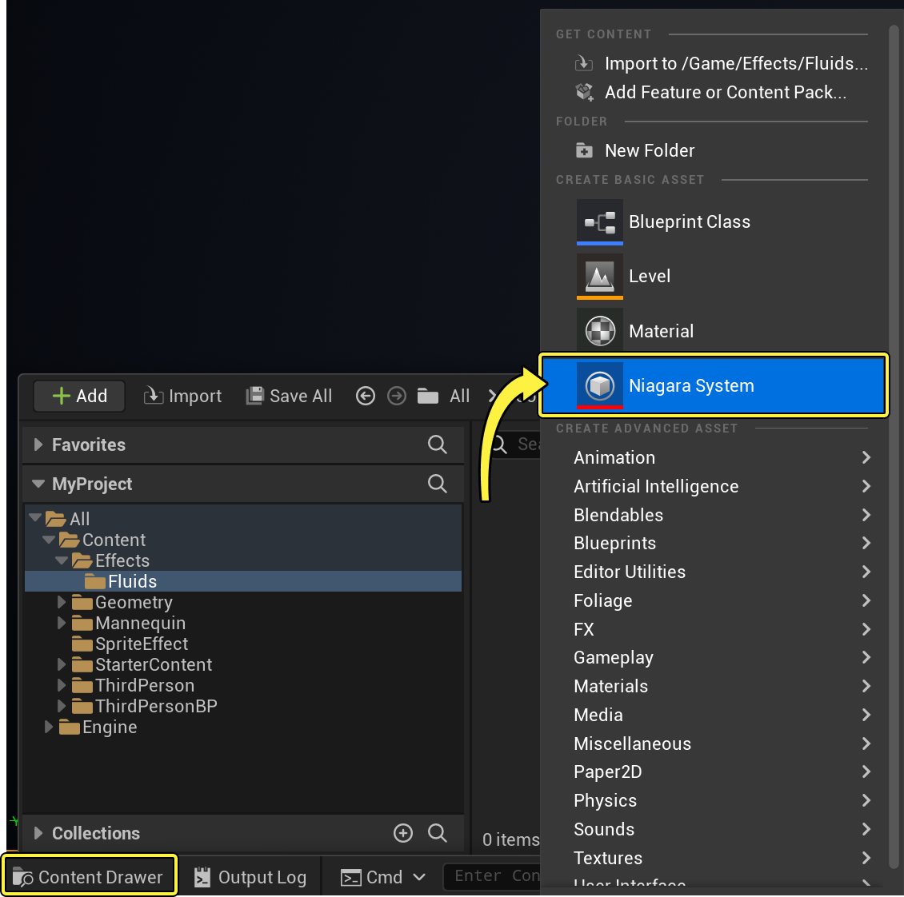
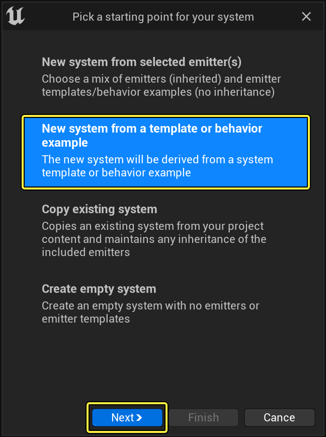
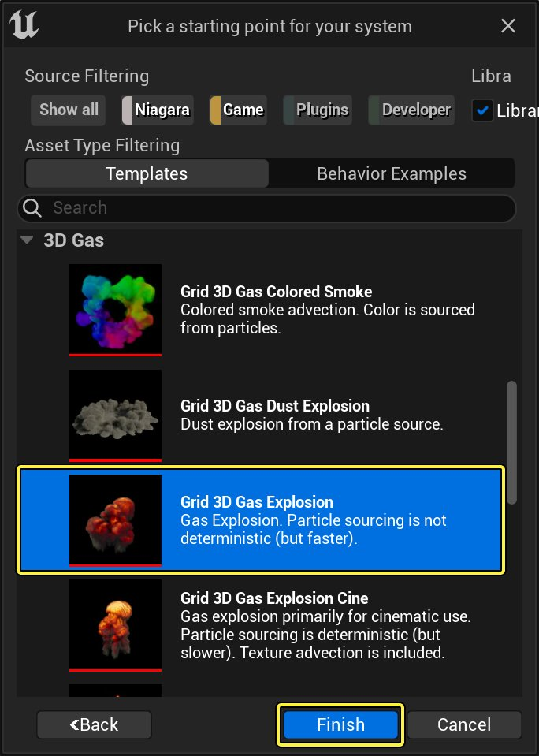
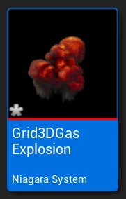

# Niagara流体快速入门指南

> 路径：虚幻引擎5.7文档 / 创建视觉效果 / 虚幻引擎中的Niagara流体 / Niagara流体快速入门指南

> 原始页面：https://dev.epicgames.com/documentation/unreal-engine/niagara-fluids-quick-start-guide-for-unreal-engine

先决条件：

- [创建新项目](../../../understanding-the-basics/working-with-projects-and-templates/creating-a-new-project/index.md)
- [启用Niagara插件](../../tutorials-for-niagara-effects/how-to-enable-the-niagara-effects-plugin/index.md)

启用 **Niagara流体（Niagara Fluids）** 插件后，你可以为项目添加模板，来模拟实时流体。

## 目标

在本教程中，你将学习如何启用Niagara流体插件并创建你的第一个项目。

## 目的

- 启用Niagara流体插件
- 基于流体模板创建新Niagara系统
- 修改参数以实现新外观

## 1 - 启用Niagara流体插件

要开始工作，请首先启用Niagara流体插件。

1. 点击 **编辑（Edit） > 插件（Plugins）**。

   

   点击查看大图。
2. 在搜索栏中搜索 **Niagara** 。点击 **Niagara流体（Niagara Fluids）** 左侧的复选框。

   

   点击查看大图。
3. 界面上将显示警告消息，因为该插件仍为测试版。点击 **是（Yes）** ，启用插件。

   

   点击查看大图。
4. 然后系统将提示你重启虚幻引擎。点击 **立即重启（Restart Now）** 。

   

   点击查看大图。

现在，当你创建新Niagara系统时，流体模板将可用。

## 2 - 创建Niagara系统

接下来，基于流体模板创建新Niagara系统。

1. 右键点击 **内容侧滑菜单（Content Drawer）** 。在 **创建基本资产（Create Basic Asset）** 分段中，选择 **Niagara系统（Niagara System）** 。

   

   点击查看大图。
2. 选择第二个选项 **基于模板或行为示例的新系统（New system from a template or behavior example）** 。由于流体模板由多个发射器组成，选择该选项将添加实现完整效果所需的所有发射器。

   

   点击查看大图。
3. 选择你有兴趣试用的模板。对于本示例，选择 **网格3D气体爆炸（Grid 3D Gas Explosion）** 。点 **完成（Finish）** 。

   

   点击查看大图。
4. 将Niagara系统重命名为 **Grid3DGasExplosion** 。

   
5. 将Niagara系统拖入关卡中。当你放下时，爆炸会在场景中触发。

   > 图片已省略：undefined

   点击查看大图。

## 3 - 添加要与之碰撞的Actor

你可以调整Actor的第一个位置是在关卡本身中。对于本示例，你将使用简单的球体。

1. 选择关卡中的Niagara系统。
2. 在 **细节（Details）** 面板中的 **覆盖参数（Override Parameters）** 下，根据需要调整公开的参数。由于该系统不会循环，开启和关闭 **显示覆层（Show Overlays）** 可强制让爆炸重启。在你调整参数时，很适合用这种方法来测试。

   > 图片已省略：undefined

   点击查看大图。

   | 参数 | 说明 |
   | --- | --- |
   | **Collide_GeometryCollection、Collide_PhysicsAsset、Collide_StaticMesh** | 使用这些数据接口可在关卡中添加Actor以影响模拟。 |
   | **DirectionalLight1、DirectionalLight2** | 将最多两个定向光源链接到你的系统。这样一来，你可以使用关卡中已有的光源来照亮模拟。 如果你将它们留空，系统会设置一些默认值。 |
   | **ResolutionMaxAxis** | 设置模拟的分辨率。设法使其保持尽可能小，以节省内存和性能。 |
   | **ShowOverlays** | 开启和关闭系统的边界。 |
   | **SourceOffset** | 将爆炸放在系统的边界框内。默认情况下，这设置为域的中心。 |
   | **WorldSpaceSize** | 更改模拟的边界框大小。 |
3. 将 **WorldSpaceSize** 设置为 **300** 、**300** 、 **600** 。
4. 要显示如何让爆炸与对象交互，请将简单的球体添加到场景，并将其放在爆炸上方。点击 **快速添加内容（Quick Add Content）** 按钮，然后选择 **形状（Shapes） > 球体（Sphere）** 。

   > 图片已省略：undefined

   点击查看大图。
5. 将球体移至爆炸上方的位置，但在其边界框内。

   > 图片已省略：undefined

   点击查看大图。
6. 要减少模拟的像素化，你需要提高分辨率。选择 **模拟（simulation）**，然后在 **细节（Details）** 面板的 **覆盖参数（Override Parameters）** 分段中，将 **ResolutionMaxAxis** 调整为 **300** 。

   > 图片已省略：undefined

   点击查看大图。
7. 接下来，你需要向球体添加标签，向关卡表明它是碰撞体对象。

   - 点击

     球体（sphere）

     将其选中。
   - 在

     细节（Details）

     面板中，搜索"tag"。
   - 在

     Actor

     分段下的

     高级（Advanced） > 标签（Tags）

     中，点击

     加号（+）

     添加新标签。
   - 输入"collider"表示标签的名称。爆炸现在将与球体碰撞。

   > 图片已省略：undefined

   点击查看大图。

## 4 - 调整爆炸的外观

接下来，微调爆炸的外观。

1. 在 **内容侧滑菜单（Content Drawer）** 中双击 **Niagara系统（Niagara system）**，在 **Niagara编辑器（Niagara Editor）** 中打开。
2. 你应该在 **预览（Preview）** 面板中看到爆炸播放。在 **系统概述（System Overview）** 中，设置了两个发射器。如果它们没有立即显示，请点击F使其适应窗口。

   > 图片已省略：undefined

   点击查看大图。
3. 左侧的发射器 **ParticleSourceEmitter** 将值注入到模拟中。右侧的发射器 **Grid3D_Gas_CONTROLS_Emitter** 称为控制发射器。这是你将用于调整外观的主发射器。点击 **发射器摘要（Emitter Summary）** 查看你可以调整的参数。

   > 图片已省略：undefined

   点击查看大图。

   > [!TIP]
   > 按住Shift键并点击一个分段标题左侧的三角形，折叠所有分段。
4. 首先，调整消散值。**消散（Dissipation）** 定义了数据随时间淡化的速度。数字越大，数据降为0的速度就越快。减小数字后，消散值会维持更长的时间。将消散值设置为以下数字，可实现更短的迸发式爆炸

   > 图片已省略：undefined

   点击查看大图。

   | 参数 | 数值 |
   | --- | --- |
   | **密度消散（Density Dissipation）** | 3.0 |
   | **温度消散（Temperature Dissipation）** | 1.5 |
   | **速度消散（Velocity Dissipation）** | 0.8 |
5. 接下来，调整浮力值。在该模拟中，来自温度的浮力导致模拟上升。来自密度的浮力导致模拟下降。你可以调整密度和/或温度值来将速度添加到模拟。如果你更改 **重力（Gravity）** 参数的方向，则浮力会适应新方向。要使爆炸更快上升，请将 **温度浮力（Temperature Buoyancy）** 值更改为 **3.5** 。

   > 图片已省略：undefined

   点击查看大图。
6. 要完成外观，请调整 **渲染（Render）** 分段中的参数。默认情况下，**渲染密度（Render Density）** 设置为 **线性（Linear）** 。这意味着，**渲染密度范围（Render Density Range）** 定义的值将从 **0.0** 不透明度开始，并在渲染时增加到 **1.0** 不透明度。你可以通过增加 **渲染密度增益（Render Density Gain）** 值来更改总体不透明度。对于本示例，将其设置为 **0.5** 。

   > 图片已省略：undefined

   点击查看大图。

   > [!NOTE]
   > 默认情况下，颜色会使用黑体色温曲线从黑色过渡到红色、橙色，然后是白色。该黑体色温曲线是物理上可行的映射，形成了逼真的外观。它基于热黑体在不同温度发射的光的波长所对应的颜色。
7. 将 **渲染温度（Render Temperature）** 更改为 **曲线（Curve）** 。该属性可供你输入你自己的自定义颜色值。

   > 图片已省略：undefined

   点击查看大图。
8. 展开 **渲染温度曲线（Render Temperature Curve）**，然后展开 **曲线（Curve）** 。随意调整颜色，实现你所需的外观。

   > 图片已省略：undefined

   点击查看大图。
9. 对外观感到满意后，**保存（Save）** ，然后关闭Niagara系统。在 **关卡编辑器（Level Editor）** 中，你现在会在场景中看到带有你所做调整的爆炸。

## 最终结果

现在最终效果如下图所示。

## 延伸阅读

要继续进一步了解你可以调整的参数，请阅读[Niagara流体参考指南](../niagara-fluids-reference/index.md)。
