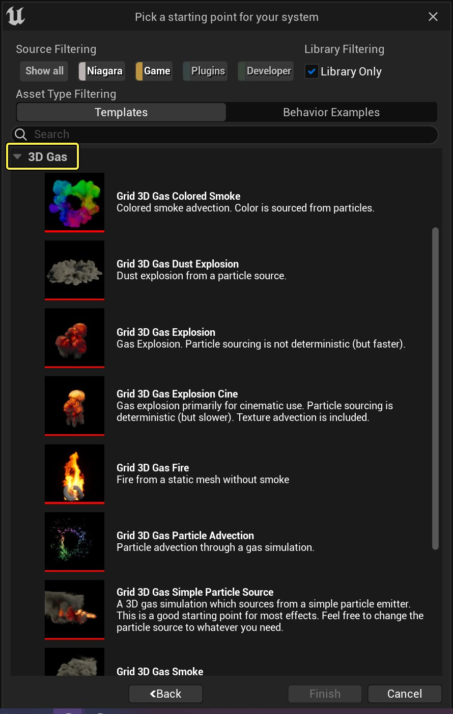
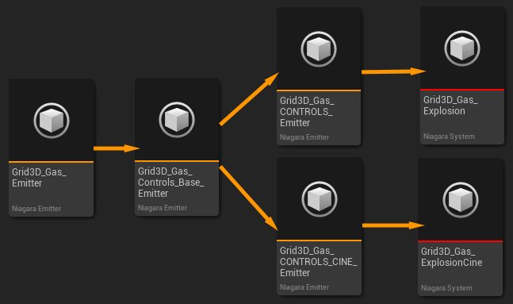
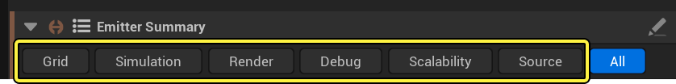
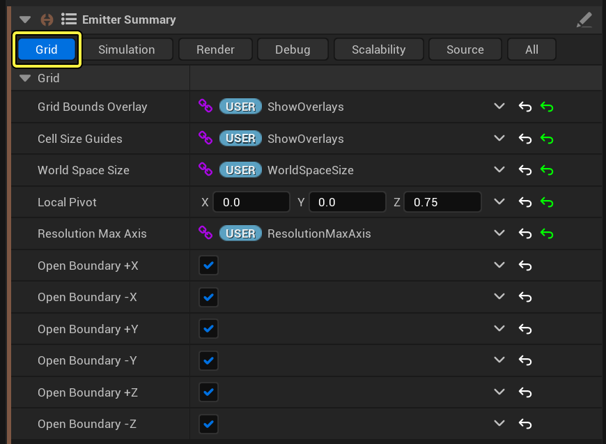
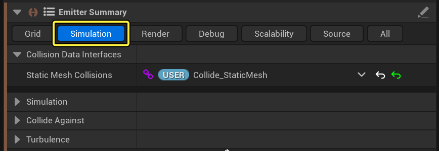
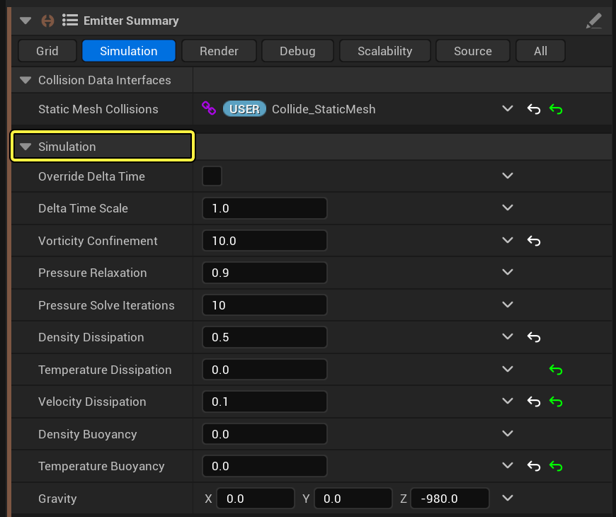
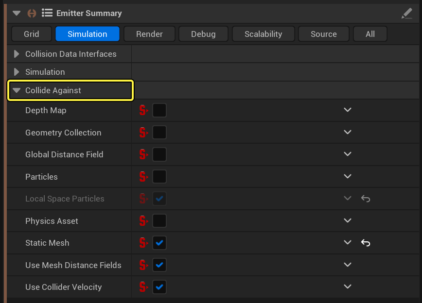
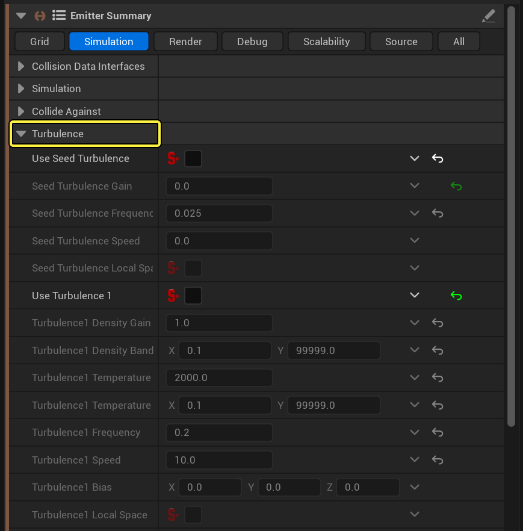

# Niagara流体参考指南

> 路径：虚幻引擎5.7文档 / 创建视觉效果 / 虚幻引擎中的Niagara流体 / Niagara流体参考指南

> 原始页面：https://dev.epicgames.com/documentation/unreal-engine/niagara-fluids-reference-in-unreal-engine

**Niagara流体（Niagara Fluids）** 是一种插件，为你提供了各种模板，用于轻松向你的项目添加实时模拟。该插件提供了几种不同类型的模板：

- 2D气体
- 2D液体
- 3D气体
- 3D液体
- 浅水

2D模拟更高效，更适合游戏和实时使用。3D模拟的外观更逼真，但不利之处是内存和GPU成本更高。因此，3D模拟最适合用于英雄特效或过场动画。如果需要，结果还可以烘焙为图像序列视图并应用于纹理，以提高实时使用的性能。

本参考指南概括介绍了作为设计原则示例的 **网格3D气体火焰（Grid 3D Gas Fire）** 模板。

## 根据模板创建Niagara流体模拟

要创建新的Niagara流体模拟，请右键点击 **内容侧滑菜单（Content Drawer）** 并选择 **Niagara系统（Niagara System）** 。在向导中，选择选项 **基于模板或行为示例的新系统（New system from a template or behavior example）** 。这样一来，流体模板就已设置了合适的继承，并且会将你需要的所有发射器添加到系统中。要详细了解如何启用插件并创建你的第一个项目，请参阅[Niagara流体快速入门](../niagara-fluids-quick-start-guide/index.md)。

你将看到各种不同的3D气体示例可供选择。

点击查看大图。

## 继承

流体发射器使用继承来渐进式添加功能。例如，请参阅下图，其中显示了3D气体发射器中的继承结构。

点击查看大图。

每个发射器的用途如下：

| **发射器** | **用途** |
| --- | --- |
| **Grid3D_Gas_Emitter** | 这是核心模拟。 |
| **Grid3D_Gas_Controls_Base_Emitter** | 该发射器添加集中手柄、调试切片功能和更好的渲染支持。这些控制在 **发射器摘要（Emitter Summary）** 中公开。 |
| **Grid3D_Gas_CONTROLS_Emitter** | 该发射器可添加粒子源支持。密度、温度和速度从第二个发射器注入模拟中。 |
| **Grid3D_Gas_CONTROLS_CINE_Emitter** | 这是备用控制发射器，将更慢的确定性形式用于粒子源算法。它包含高级纹理坐标，旨在用于过场动画。 |

## 流体发射器摘要

你为了更改模拟的外观和行为而需要调整的所有参数都将在发射器摘要中提供。为方便整理，摘要已分解为以下各个分段：

- 网格（Grid）
- 模拟（Simulation）
- 渲染（Render）
- 调试（Debug）
- 可扩展性（Scalability）
- 源（Source）

点击查看大图。

本参考指南介绍了上述每个分段中提供的参数。

### 网格

气体模拟由分割为单元格的网格表示。每个单元格包含该位置的介质的密度、温度和速度信息。网格单元越小，模拟的质量就越高，但性能成本也越高。

点击查看大图。

| **参数** | **说明** |
| --- | --- |
| **网格边界覆层（Grid Bounds Overlay）** | 当你在 **关卡编辑器（Level Editor）** 中点击模拟时，将添加 **覆盖参数（Override Parameters）** 的切换开关。你可以在其中切换该模拟周围红框的可视性。 |
| **单元格大小导线（Cell Size Guides）** | 当你在 **关卡编辑器（Level Editor）** 中点击模拟时，将添加 **覆盖参数（Override Parameters）** 的切换开关。你可以在其中切换每个主轴上导线单元格的可视性。 |
| **世界空间大小（World Space Size）** | 当你在 **关卡编辑器（Level Editor）** 中点击模拟时，将添加一组字段供用户在 **覆盖参数（Override Parameters）** 中设置。你可以在其中更改该模拟的容器框大小。 |
| **本地枢轴点（Local Pivot）** | 更改模拟原点应该位于的偏移。 |
| **分辨率最大轴（Resolution Max Axis）** | 当你在 **关卡编辑器（Level Editor）** 中点击模拟时，将添加 **覆盖参数（Override Parameters）** 的切换开关。你可以在其中根据该模拟的最长端设置分辨率。分辨率越高，外观越准确，但性能会越低。 |
| **开放边界 +/- X/Y/Z（Open Boundary +/- X/Y/Z）** | 切换这些选项以调整模拟的边缘是否应该视为粒子无法穿越的实心墙。 |

### 模拟

模拟分段将分解为三个子分段：模拟（simulation）、碰撞对象（collide against）和涡流（turbulence）。所有这些参数都会影响模拟如何根据密度、温度和浮力等属性随时间推移而发生变化。

点击查看大图。

#### 模拟

点击查看大图。

| **参数** | **说明** |
| --- | --- |
| **覆盖增量时间（Override Delta Time）** | 设置该值以使用固定增量时间覆盖引擎的增量时间。 |
| **增量时标（Delta Time Scale）** | 如果未启用 **覆盖增量时间（Override Delta Time）**，则系统将使用引擎增量时间。在 **增量时标（Delta Time Scale）** 中输入值以按该数量修改引擎增量时间。 |
| **涡量限制（Vorticity Confinement）** | 涡量定义了该模拟的旋转。输入值以按该数量放大该模拟中的涡量。 |
| **压力放松（Pressure Relaxation）** | 该值定义了压力解算器收敛。输入0到1之间的值。我们推荐使该值保持接近1。 |
| **压力解算迭代（Pressure Solve Iterations）** | 解算器中执行的迭代越多，就越准确，但也会越慢。在此处输入能提供足够准确度而不牺牲性能的值。 |
| **密度消散（Density Dissipation）** | 该值定义了密度会多快消散为零。该数字越高，消散就越快。 |
| **温度消散（Temperature Dissipation）** | 该值定义了温度会多快消散为零。该数字越高，消散就越快。 |
| **速度消散（Velocity Dissipation）** | 该值定义了速度会多快消散为零。该数字越高，消散就越快。 |
| **密度浮力（Density Buoyancy）** | 该值定义了根据该模拟的密度应用于该模拟的向下速度值。该值越高，向下速度就越大。 |
| **温度浮力（Temperature Buoyancy）** | 该值定义了应用于该模拟的向上速度值。该数字越高，向上速度就越大。 |
| **重力（Gravity）** | 设置该模拟中重力的方向和量级。 |

#### 碰撞对象

你可以让模拟对关卡中的Actor做出响应。最常见方式是让这些Actor在与模拟接触时发生碰撞。在 **碰撞对象（Collide Against）** 分段中启用或禁用参数会添加或删除这些类型的对象的数据接口。

启用碰撞对象（Collide Against）时，在关卡编辑器中选择模拟，以调整覆盖参数并选择特定Actor。这些Actor会与模拟碰撞。请在[Niagara流体快速入门](../niagara-fluids-quick-start-guide/index.md)中查看这种情况的例子。

点击查看大图。

#### 涡流

你可以在发射器中启用三个范围的涡流。种子涡流仅应用于初始化帧。涡流1和2在模拟运行时应用。

点击查看大图。

| **参数** | **说明** |
| --- | --- |
| **种子涡流增益（Seed Turbulence Gain）** | 设置涡流的强度。这仅应用于初始化帧。 |
| **种子涡流频率（Seed Turbulence Frequency）** | 设置涡流特征的大小。该数字越小，特征看起来越大。这仅应用于初始化帧。 |
| **种子涡流速度（Seed Turbulence Speed）** | 设置涡流应该移动多快。这仅应用于初始化帧。 |
| **种子涡流本地空间（Seed Turbulence Local Space）** | 启用时，涡流会跟随该模拟的本地空间。禁用时，涡流会固定在世界空间中。这仅应用于初始化帧。 |
| **涡流密度增益（Turbulence Density Gain）** | 设置涡流的强度。这可以设置为密度和/或温度。 |
| **涡流密度范围（Turbulence Density Band）** | 将涡流限制在定义的密度范围之间。 |
| **涡流温度增益（Turbulence Temperature Gain）** | 设置涡流的强度。这可以设置为密度和/或温度。 |
| **涡流温度范围（Turbulence Temperature Band）** | 将涡流限制在定义的温度范围之间。 |
| **涡流频率（Turbulence Frequency）** | 设置涡流特征的大小。该数字越小，特征看起来越大。 |
| **涡流速度（Turbulence Speed）** | 设置涡流应该移动多快。 |
| **涡流偏差（Turbulence Bias）** | 使噪点偏离零，为涡流提供方向。 |
| **涡流本地空间（Turbulence Local Space）** | 启用时，涡流会跟随该模拟的本地空间。禁用时，涡流会固定在世界空间中。 |

### 渲染

渲染属性分解为两个子分段：渲染（Render）和光源（Lights）。

#### 渲染

> 图片已省略：undefined

点击查看大图。

| **参数** | **说明** |
| --- | --- |
| **渲染步长乘数（Render Step Size Mult）** | 模拟的计算方式是，将体积分解为单元格，然后在这些单元格中对模拟取样。默认情况下，体积中的步进大小与单元格大小一致。 如果你降低该乘数的值，就会逐单元格对模拟多次取样。当纹理要调制模拟数据时，或者如果你要渲染细节丰富的火焰，这会很有用。 |
| **渲染密度（Render Density）** | 该选项控制是否渲染密度。你可以选择 **无（None）**、**线性（Linear）** 或 **曲线（Curve）**。线性映射会将网格中的数据映射到气体的不透明度。你也可以选择设置曲线，实现更好的控制。 |
| **渲染密度范围（Render Density Range）** | 设置要渲染的密度范围。第一个值应该是你希望为透明的密度值，第二个值应该是提供最高不透明度的密度值。 |
| **渲染密度曲线（Render Density Curve）** | 如果你将 **渲染密度（Render Density（）** 设置为 **曲线（Curve）**，则可以使用该参数设置曲线。展开该字段可访问曲线编辑器。 |
| **渲染密度增益（Render Density Gain）** | 该值将在所渲染的最终密度之上添加一个乘数。 |
| **渲染密度反射率（Render Density Albedo）** | 该值是一个浮点值，用于将烟雾从黑到白着色。 |
| **阴影质量（Shadow Quality）** | 烘焙的阴影的计算方式是，将体积分解为单元格，然后在体积中步进以在这些单元格中对模拟取样。调整该值，以便逐单元格对模拟取样多次。 |
| **阴影最大步数（Shadow Max Steps）** | 限制在对阴影取样时要执行的步数。 |
| **渲染温度（Render Temperature）** | 选择如何渲染 **温度（Temperature）** 组件。你可以选择无（None）、黑体（Black Body）或曲线（Curve）。 选择 **无（None）** 时，不会渲染温度值。 选择 **黑体（Black Body）** 时，系统会将具备环境逼真效果的火焰从黑色渲染为红色、橙色、黄色，然后渲染为白色。 选择 **曲线（Curve）** 时，你可以设置自己的自定义颜色值。 |
| **渲染温度范围（Render Temperature Range）** | 设置要映射到 **渲染温度（Render Temperature）** 的温度值范围。这仅当 **渲染温度（Render Temperature）** 设置为 **黑体（Black Body）** 或 **曲线（Curve）** 时应用。 |
| **渲染温度曲线（Render Temperature Curve）** | 如果渲染温度（Render Temperature）设置为黑体（Black Body），该曲线的alpha组件会定义火焰的不透明度。 如果渲染温度（Render Temperature）设置为曲线（Curve），该曲线会定义气体的颜色和不透明度。 |
| **渲染温度颜色增益（Render Temp Color Gain）** | 将额外的乘数添加到气体颜色。 |
| **渲染温度不透明度增益（Render Temp Opacity Gain）** | 将额外的乘数添加到气体的不透明度。 |

#### 光源

**光源（Lights）** 分段包含一些数据接口，用于引入你在关卡中通过 **覆盖参数（Override Parameters）** 设置的定向光源。如果没有将光源连接到这些数据接口，则将应用默认光照。要调整默认光照的属性，请点击 **显示高级（Show Advanced）** 按钮。

> 图片已省略：undefined

点击查看大图。

| **参数** | **说明** |
| --- | --- |
| **光源1/2（Light1/2）** | 该数据接口在关卡编辑器中从你连接到Niagara系统的 **覆盖参数（Override Parameters）** 的光源读取属性。 |
| **光源1/2阴影密度（Lgt1/2 Shadow Density）** | 设置密度组件应该遮蔽多少光线。 |
| **光源1/2默认密度（Lgt1/2 Default Intensity）** | 设置默认光源的密度。 |
| **光源1/2默认颜色（Lgt1/2 Default Color）** | 设置默认光源的颜色。 |
| **光源1/2默认方向（Lgt1/2 Default Direction）** | 设置默认光源的方向。该方向是世界空间中设置的矢量。 |

### 调试

使用这些选项可调试你的模拟。

> 图片已省略：undefined

点击查看大图。

| **参数** | **说明** |
| --- | --- |
| **调试源（Debug Sources）** | 启用该选项可使用源数据覆盖每个帧上的网格数据。这样做，你会看到源给模拟带来了什么。 |
| **渲染调试切片（Render Debug Slice）** | 启用该选项可在网格中渲染2D切片。密度在红色信道中渲染。温度在绿色色信道中渲染。合并光源强度在蓝色信道中渲染。 |
| **渲染调试切片轴（Render Debug Slice Axis）** | 选择要使切片指向的轴。 |
| **渲染调试切片偏移（Render Debug Slice Offset）** | 设置沿轴多远的位置渲染切片。该值应该介于0到1之间，0.5是中心点。 |
| **渲染调试切片光源（Render Debug Slice Lights）** | 启用该选项可在蓝色信道中渲染光源强度。 |

### 可扩展性

对依赖于模拟的 **质量（Quality）** 设置的参数，可使用可扩展性设置覆盖。默认情况下，当引擎以 **电影级（Cinematic）** 质量运行时，将应用可扩展性覆盖。

例如，当你需要使用 **电影渲染队列（Movie Render Queue）** 渲染过场动画序列时，你可能就需要使用可扩展性覆盖。电影渲染队列（Movie Render Queue）中有一个称为 **游戏覆盖（Game Overrides）** 的设置，它会在渲染时自动将质量级别更改为电影级（Cinematic）。这样一来，你就可以将可扩展性覆盖（Scalability Override）质量设置为电影级（Cinematic），但你可以采用质量更低但更快的设置交互式处理场景。然后，当你在电影渲染队列（Movie Render Queue）中按 **渲染（Render）** 按钮时，高质量设置会生效。

> 图片已省略：undefined

点击查看大图。

### 源

调整源参数，以便根据传入粒子更改信息。

> 图片已省略：undefined

点击查看大图。

| **参数** | **说明** |
| --- | --- |
| **粒子属性读取器（Particle Attribute Reader）** | 该数据接口从系统中的其他发射器读取。 |
| **按dt缩放发射（Scale Emission by dt）** | 启用该参数可确保源数据保持一致，即使引擎的函数更新率发生变化也是如此。 |
| **使用衰减（Use Falloff）** | 启用该参数可在粒子边缘对数据实施抗锯齿效果。这会使来源保持一致，即使分辨率发生变化也是如此。 |
| **散射密度（Scatter Density）** | 启用该参数可在传入粒子源上查找密度属性 `fluids_source_density` 。 |
| **散射温度（Scatter Temperature）** | 启用该参数可在传入粒子源上查找温度属性 `fluids_source_temperature` 。 |
| **散射速度（Scatter Velocity）** | 启用该参数可在传入粒子源上查找速度属性 `fluids_source_velocity` 。 |
| **使用半径（Use Radius）** | 启用该参数可根据粒子半径 `fluids_source_radius` 重叠模拟中的所有单元格。这会使来源保持一致，即使分辨率发生变化也是如此。 |
| **密度乘数（Density Mult）** | 输入传入粒子密度属性的乘数值。 |
| **泼溅大小密度（Splat Size Density）** | 如果使用半径（Use Radius）被禁用，输入值以设置应使用粒子密度数据来标记多少单元格。输入1表示最接近的单元，输入2表示最接近的单元和接触最接近的单元格的单元格。随着你增加该数字，写入的单元格数量将大幅增加。 |
| **温度乘数（Temperature Mult）** | 输入传入粒子温度属性的乘数值。 |
| **泼溅大小温度（Splat Size Temperature ）** | 如果 **使用半径（Use Radius）** 被禁用，输入值以设置应使用粒子温度数据来标记多少单元格。输入1表示最接近的单元，输入2表示最接近的单元和接触最接近的单元格的单元格。随着你增加该数字，写入的单元格数量将大幅增加。 |
| **本地空间粒子（Local Space Particles）** | 启用该值可将粒子设置为处于该模拟的本地。 |
| **速度乘数（Velocity Mult）** | 输入传入粒子速度属性的乘数值。 |
| **泼溅大小速度（Splat Size Velocity）** | 如果 **使用半径（Use Radius）** 被禁用，输入值以设置应使用粒子速度数据来标记多少单元格。输入1表示最接近的单元，输入2表示最接近的单元和接触最接近的单元格的单元格。随着你增加该数字，写入的单元格数量将大幅增加。 |

### 纹理

在 **网格3D气体爆炸电影（Grid 3D Gas Explosion Cine）** 模板中有一组额外的参数。在 **Grid3D_Gas_CONTROLS_CINE_Emitter** 上选择 **发射器摘要（Emitter Summary）**。然后，选择 **全部（All）** 选项卡，并找到 **纹理（Texture）** 分段。

该发射器包括一个模拟阶段，用于在模拟中平流输送纹理坐标。包含的 **MI_RayMarch_Fire_Ramps_Tex** 材质将使用这些坐标来通过噪点调制渲染。

> 图片已省略：undefined

点击查看大图。

| **参数** | **说明** |
| --- | --- |
| **纹理烟雾密度增益（Texture Smoke Density Gain）** | 输入值以通过噪点调制密度。 |
| **纹理烟雾颜色增益（Texture Smoke Color Gain）** | 输入值以通过噪点调制烟雾反射率。 |
| **纹理火焰密度增益（Texture Fire Density Gain）** | 输入值以通过噪点调制火焰影响的不透明度。 |
| **纹理火焰颜色增益（Texture Fire Color Gain）** | 输入值以通过噪点调制火焰颜色强度。 |
| **纹理比例（Texture Scale）** | 输入值以调整噪点模式的大小。 |
| **纹理重新映射为0（Texture Remap To 0）** | 该参数执行适应操作。输入将重新映射为0的值，从而为效果增加对比度和偏差。 |
| **纹理重新映射为1（Texture Remap To 1）** | 该参数执行适应操作。输入将重新映射为1的值，从而为效果增加对比度和偏差。 |
| **值数据（Value Data）** | 选择是将纹理的影响限制为 **密度（Density）** 还是 **温度（Temperature）** 。你在此处选择的选项将决定如何应用以下参数：**值范围最小值（Value Band Min）** 、 **值范围最大值（Value Band Max）** 和 **值范围锐度（Value Band Sharpness）** 。 |
| **值范围最小值（Value Band Min）** | 设置纹理将应用于的模拟数据的下限值。 |
| **值范围最大值（Value Band Max）** | 设置纹理将应用于的模拟数据的上限值。 |
| **值范围锐度（Value Band Sharpness）** | 设置纹理将在范围内如何过渡。输入锐度值0可在范围内缓慢过渡，在 **值范围最小值（Value Band Min）** 和 **值范围最大值（Value Band Max）** 的中点处达到最大影响。输入锐度值1可在数据位于该范围内的任意位置时立即实施影响。 |
| **循环时长（Loop Duration）** | 坐标来回重置和过渡，以避免拉伸。输入值以调整循环时长。循环时长越高，你看到的拉伸就越多。 |
| **调试纹理（Debug Texture）** | 启用该选项可覆盖材质并仅显示纹理值。 |
