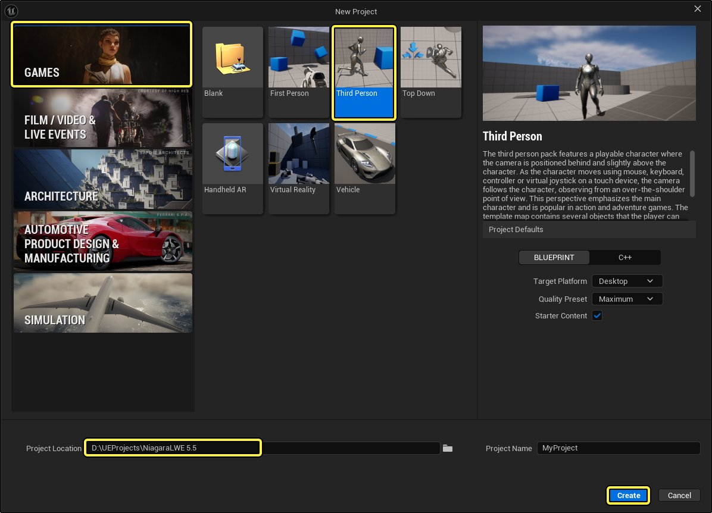
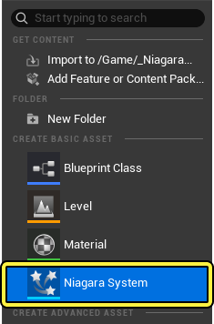
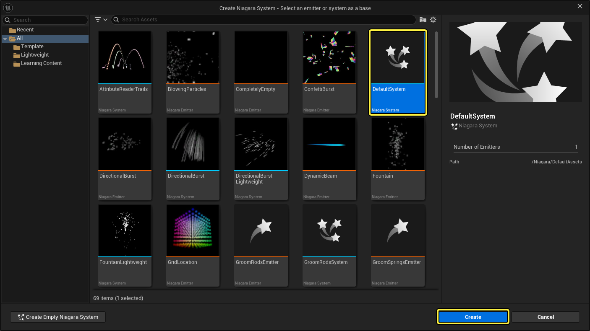
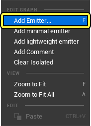
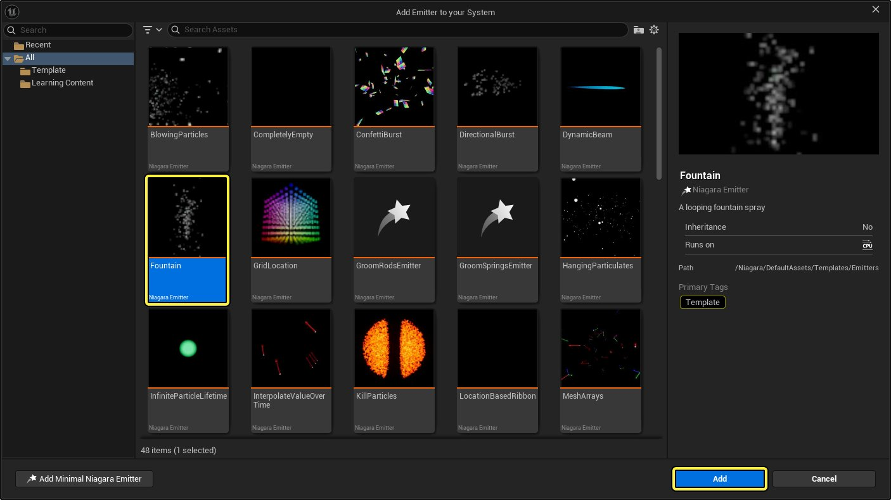
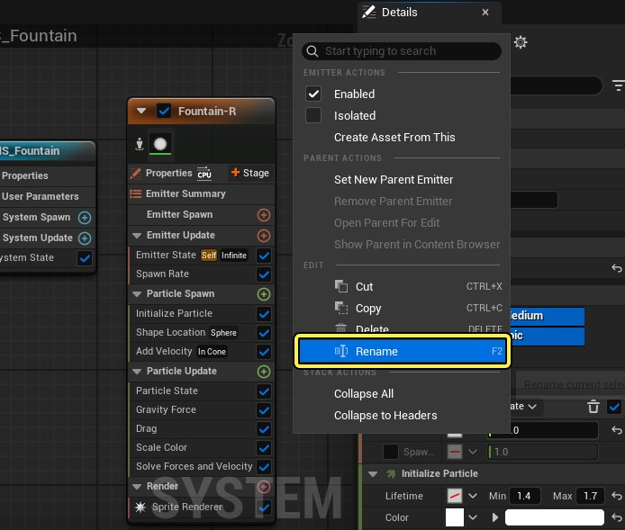
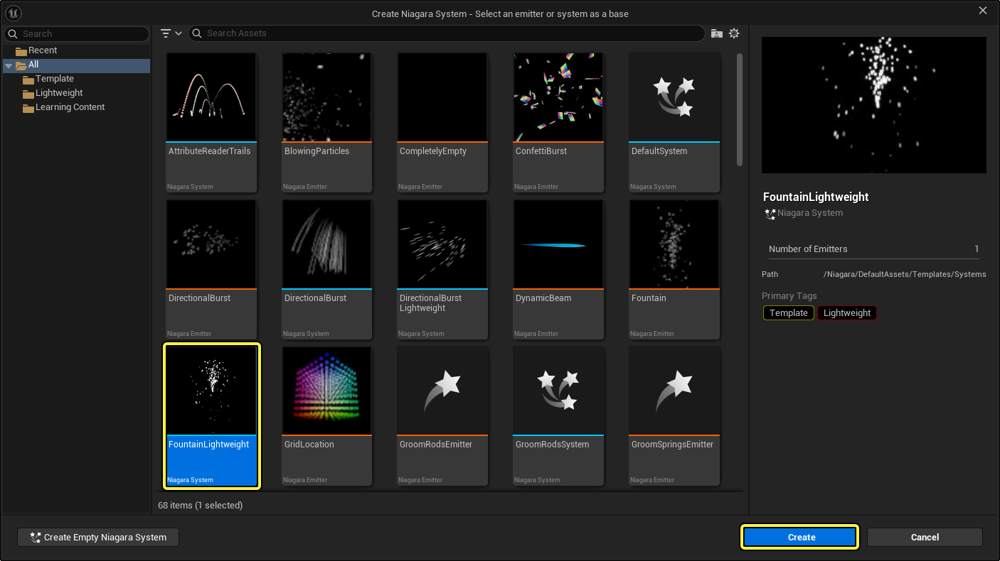
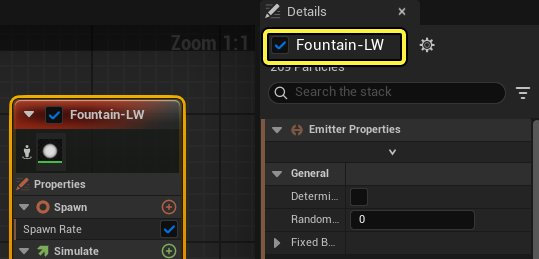

# Niagara轻量级发射器快速入门

> 路径：虚幻引擎5.7文档 / 创建视觉效果 / Niagara轻量级发射器 / Niagara轻量级发射器快速入门

> 原始页面：https://dev.epicgames.com/documentation/unreal-engine/lightweight-emitters-quick-start-for-niagara-in-unreal-engine

Niagara轻量级发射器快速入门旨在介绍 **轻量级发射器** ，这种发射器可帮助你优化Niagara系统在不同平台上的性能。本指南将使用简单的示例清楚地展示轻量级发射器的使用过程和优势。

如需详细了解轻量级发射器，请参阅[轻量级发射器概览](../niagara-lightweight-emitters-overview/index.md)。

## 目的

通过本指南，你将学会：

- 创建分别使用常规发射器和轻量级发射器的系统。
- 创建新测试关卡，并放置大量系统。
- 使用Niagara调试器测试系统性能，并将两者进行比较。

本指南使用游戏（Games）类别中的第三人称模板项目。

## 创建两个测试用Niagara系统

本节将介绍如何创建Niagara系统并为其添加常规发射器，然后再创建另一个Niagara系统，并使用轻量级发射器。

### 创建使用常规发射器的Niagara系统

按照以下步骤操作，创建使用常规发射器的Niagara系统。

1. 在虚幻引擎中打开或新建一个项目。

   
2. 打开 **内容浏览器（Content Browser）** 。在内容浏览器中右键点击，然后选择 **Niagara系统（Niagara System）** 。

   
3. 打开资产浏览器（Asset Browser），选择 **默认系统（Default System）** 并点击 **创建（Create）** 。

   
4. 将新系统命名为 **NS_Fountain** 。双击系统，在Niagara编辑器中将其打开。

### 为第一个系统添加常规喷泉发射器

按照如下步骤为NS_Fountain系统添加常规发射器。

1. 确保NS_Fountain系统已在Niagara编辑器中打开。右键点击工作空间，然后选择 **添加发射器（Add Emitter）** 。

   
2. 在资产浏览器（Asset Browser）中，选择 **喷泉（Fountain）** 发射器。然后点击 **添加（Add）** ，从而为NS_Fountain系统添加常规发射器。本示例将不改动默认值。

   
3. 在Niagara编辑器中，点击以选中喷泉发射器。在 **细节（Details）** 面板中，点击 **齿轮** 图标以打开菜单。

   
4. 选择 **重命名（Rename）** 。将发射器命名为 **Fountain-R** （以将其标明为常规发射器）。

> [!TIP]
> 也可以双击发射器的名称，然后输入新名称，从而将其重命名。

### 创建使用轻量级发射器的Niagara系统

按照以下步骤操作，创建第二个系统。

1. 在内容浏览器（Content Browser）中右键点击，然后选择 **Niagara系统（Niagara System）** 。
2. 在资产浏览器（Asset Browser）中，选择 **FountainLightweight** 系统并点击 **创建（Create）** 。

   
3. 在Niagara编辑器中，打开NS_Fountain_LW系统。此系统模板包括一个用于喷泉效果的轻量级发射器。

### 修改使用轻量级发射器的系统

在上一节中创建的系统已经拥有了轻量级喷泉发射器。本节将介绍如何修改发射器，使其与第一个系统中的喷泉发射器相匹配。这能让你更轻易地对比两种发射器的性能。

请按照以下步骤修改轻量级发射器。

1. 双击轻量级发射器的名称并修改命名。将其重命名为 **Fountain-LW** 。

   
2. 选择发射器，然后点击 **生成率（Spawn Rate）** 。将 **速率（Rate）** 设置变更为 **300** 。

   > 图片已省略：速率变更为300
3. 在发射器中，保留以下模块的 **默认** 设置：

   - 初始化粒子（Initialize Particle）
   - 形状位置（Shape Location）
   - 添加速度（Add Velocity）
   - 阻力（Drag）
   - 重力（Gravity Force）
4. 点击 **比例颜色（Scale Color）** 模块。将颜色改为红色，以便在测试时更容易区分常规系统和轻量级系统。然后点击 **确定（OK）** 。

   > 图片已省略：更改比例颜色模块

## 创建测试关卡

本节将介绍如何在项目中创建测试关卡，以便放置多个系统实例。

### 创建测试关卡

按照以下步骤操作，创建新关卡。

1. 在菜单栏中，点击 **文件（File）> 新关卡（New Level）** 。在 **新关卡（New Level）** 窗口中，选择 **基础（Basic）** 模版，点击 **创建（Create）** 。

   > 图片已省略：创建新关卡
2. 在菜单栏中，点击 **文件（File）> 将现有关卡另存为（Save Current Level As）** 。这将打开 **将关卡另存为（Save Level As）** 窗口。
3. 为新关卡选择一个文件夹。将其命名为 **NiagaraLWTest** 并点击 **保存（Save）** 。

   > 图片已省略：将关卡另存为窗口

### 在测试关卡中放置系统

为了真正展现常规发射器和轻量级发射器在性能上的差异，你必须在测试关卡中放置大量的系统实例。你可以使用任何方法来放置用于测试的系统。在下一节的演示图中，系统被放置成一个20 x 20的矩阵。

1. 将 **NS_Fountain** 系统放入测试关卡并进行复制，直到关卡中有大量实例为止。下方演示图中为一个20 x 20的NS_Fountain系统实例矩阵。

   > 图片已省略：放置常规发射器系统
2. 将 **NS_Fountain_LW** 系统放入测试关卡，按照复制NS_Fountain系统的方法进行复制。类似于NS_Fountain系统，下方演示图中也是一个20 x 20的系统实例矩阵。

   > 图片已省略：放置轻量级发射器系统

## 使用Niagara调试器测试性能

本节介绍如何使用Niagara调试器比较常规发射器和轻量级发射器的性能。

### 设置Niagara调试器

请按照以下步骤打开Niagara调试器，并按测量性能的目的进行设置。

1. 确保NS_Fountain系统在视口中。
2. 找到菜单栏，点击 **工具（Tools） > 调试（Debug） > Niagara调试器（Niagara Debugger）** 。这将打开 **Niagara调试器** ，此分段收纳在 **细节（Details）** 面板中的一个选项卡旁。

   > 图片已省略：打Niagara调试器
3. 在Niagara调试器中，单击 **HUD** 按钮上的三个点，然后勾选 **显示概览（Show Overview）** 复选框。视口将显示统计数据的覆层。

   > 图片已省略：勾选显示概览
4. 在 **调试概览（Debug Overview）** 分段，单击第一个下拉菜单，并选择 **性能（Performance）** 。视口中的统计覆层将变为追踪性能。

   > 图片已省略：将概览变为性能

### 比较常规和轻量级发射器的性能覆层

按照以下步骤比较NS_Fountain和NS_Fountain_LW系统性能覆层中的各项指标。

1. 性能覆层将显示两个系统的多项统计数据。其中一个重要的性能指标是平均游戏线程（Game Thread Average），如下图所示。

   > 图片已省略：性能覆层详情
2. 在大纲视图中选择NS_Fountain系统，查看常规发射器覆层中的指标。
3. 在大纲视图中选择NS_Fountain_LW系统，查看轻量级发射器覆层中的指标。

### 比较常规和轻量级发射器的Stat Unit列表

按照以下步骤比较常规和轻量级发射器的Stat Unit指标列表。

1. **Stat Unit** 列表位于视口的右上角。性能（Performance）覆层与该区域是叠加的，会妨碍查看。要关闭覆层，请点击 **HUD** 按钮，取消勾选 **显示概览（Show Overview）** 复选框即可。

   > 图片已省略：关闭性能覆层
2. 按下 **波浪号（~）** 按键以打开控制台。输入 `stat UNIT` 并按下回车。这时视口右上角将显示统计数据列表。

   > 图片已省略：使用stat UNIT命令
3. 该列表将显示许多指标，但其中重要指标有两个：常规发射器的 **帧（Frame）** （即帧率）和 **绘制（Draw）** （即绘制次数）。

   > 图片已省略：常规发射器的Stat Unit
4. 在大纲视图中选择NS_Fountain系统，查看常规发射器的指标。
5. 在大纲视图中选择NS_Fountain_LW系统，查看轻量级发射器的指标。

## 最终结果

使用轻量级发射器后，你应该能看到Niagara效果的平均游戏线程（Game Thread Average）得到了优化。

| **NS_Fountain** | **NS_Fountain_LW** |
| --- | --- |
| [Performance overlay for NS_Fountain system](https://d1iv7db44yhgxn.cloudfront.net/documentation/images/54cbec43-3e2b-487a-a197-dcd8dc8dbd4f/perf-overlay-reg-emitter.png) | [Performance overlay for NS_Fountain_LW system](https://d1iv7db44yhgxn.cloudfront.net/documentation/images/e2aa1625-f571-4d82-89b6-d42deac939a2/perf-overlay-lw-emitter.png) |
| 点击查看大图。 | 点击查看大图。 |

使用轻量级发射器后，应该也能看到帧（Frame）和绘制（Draw）指标上的优化。

| **NS_Fountain** | **NS_Fountain_LW** |
| --- | --- |
| 常规发射器的Stat Unit | 轻量级发射器的Stat Unit |
