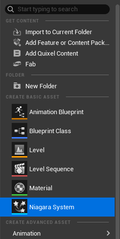
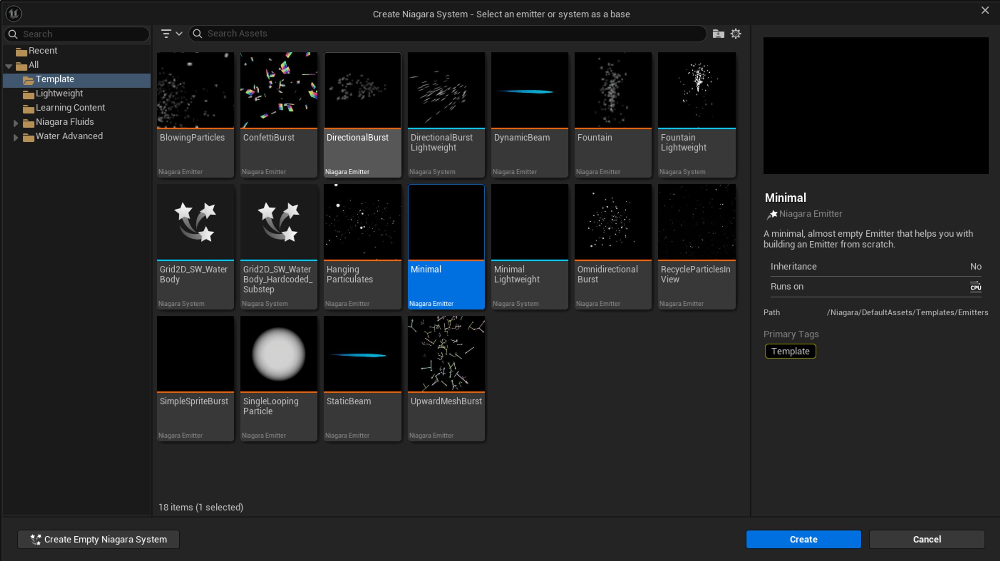
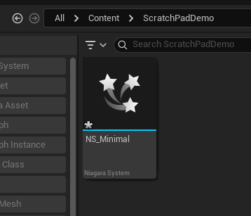
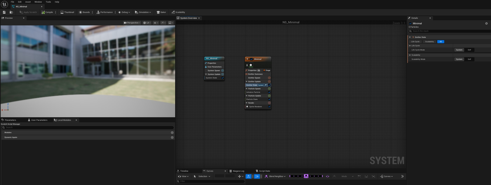
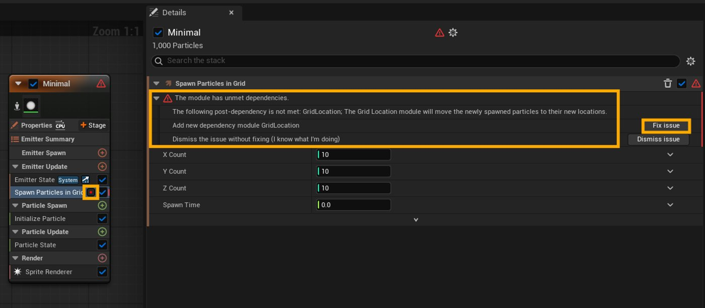
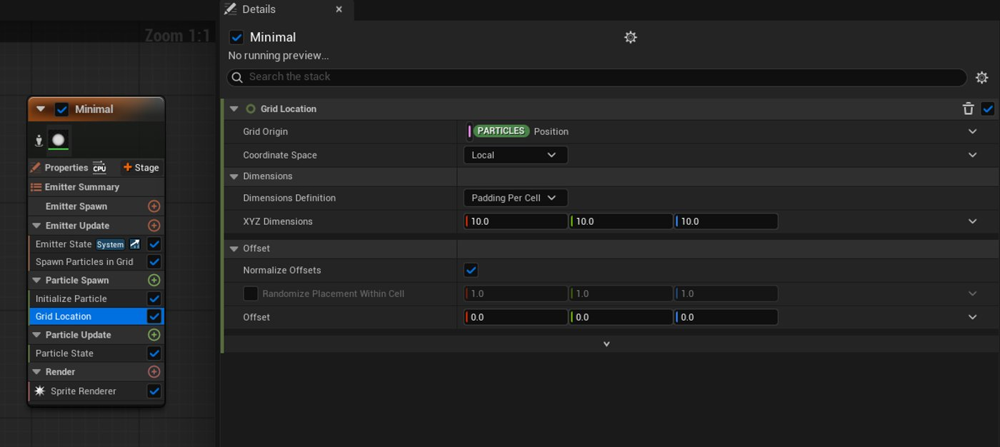
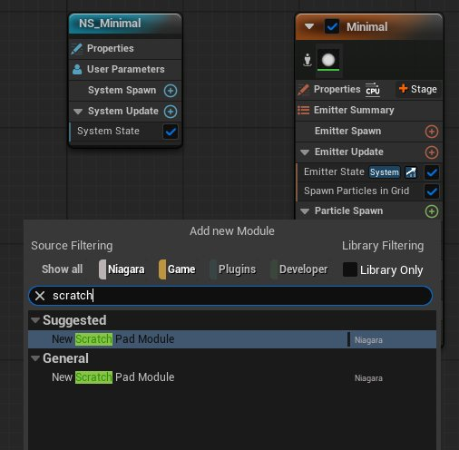
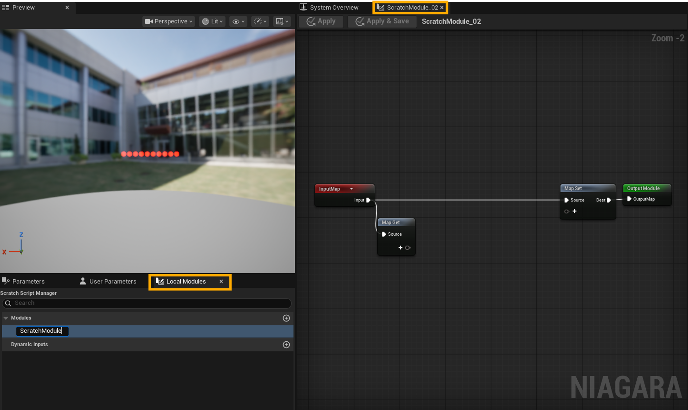

# Niagara暂存区模块

> 路径：虚幻引擎5.7文档 / 创建视觉效果 / Niagara暂存区模块

> 原始页面：https://dev.epicgames.com/documentation/unreal-engine/niagara-scratch-pad-modules-in-unreal-engine

本教程将介绍有关虚幻引擎Niagara暂存区模块的基础知识。 以单个Niagara系统为例，构建暂存区模块并探索其基本原理。 本教程的重点不在于展示最终效果，而在于了解该功能的不同用法。

## 范围

暂存区模块是通过可视化脚本图表构建的本地Niagara模块。 支持创建暂存区模块的资产有两种：Niagara**发射器**和Niagara**系统**。 这些模块仅可在创建这些模块的系统或发射器内使用，无法作为独立资产显示在内容浏览器中。

### 基于发射器的暂存区模块

若在Niagara发射器资产中创建暂存区模块，则该模块适用于该发射器的所有用途，不论将该发射器添加到什么Niagara系统中。 在下方的`NE_Example`发射器资产中，**ScratchModuleInEmitter**模块显示在模块列表中，并可在发射器中编辑其堆栈条目。

发射器资产（NE_Example）。

但是，在发射器中创建的暂存区模块不能用于任何其他系统或发射器，也不会显示在Niagara系统的模块列表中。 如下所示为`NS_Example` Niagara系统中使用的`NE_Example`发射器资产。 与其他模块一样，当发射器在Niagara系统中实例化时，暂存区模块会被锁定（可以禁用但不能删除）。

Niagara系统资产（NS_Example）中的发射器实例（NE_Example）。

### 基于系统的暂存区模块

若在Niagara系统资产中创建暂存区模块，则该模块可用于该系统中的任意发射器。 与所有暂存区模块一样，该等模块不适用于其他Niagara系统中的发射器。

Niagara系统中的暂存区模块被应用于多个发射器。

### Niagara模块脚本

暂存区模块可导出为Niagara模块脚本资产。 该导出流程详见本教程的BLANK小节。 Niagara模块脚本是完全独立的资产，显示在内容浏览器中，可供项目中的任意Niagara发射器或任意Niagara系统使用。 类似于将材质节点转换为材质函数，转换之后可供项目中的不同材质资产使用。

内容浏览器中显示的Niagara模块脚本资产。

## 入门指南

暂存区模块必须在Niagara系统资产或Niagara发射器资产中创建。 本教程将以简单的网格生成Niagara系统为例，展示暂存区模块的使用方法。

### 创建Niagara系统

> [!NOTE]
> 本节将介绍如何创建Niagara系统，适用于新用户以及希望完整学习本教程的人。 如果你已经创建过Niagara系统，可以直接使用来学习后面的教程。

请按下列步骤创建新的Niagara系统：

1. 在**内容浏览器（Content Browser）**中右键单击，选择Niagara系统（Niagara System）。

   
2. 在**模板**菜单中选择**Minimal**，点击**创建（Create）**。

   
3. 为新建的Niagara系统命名（例如**NS_Minimal**）。 双击资产或按**回车键**打开资产。

   

该系统默认包含一个系统节点（蓝色）和一个**Minimal**发射器（橙色）。

### 生成粒子

请按下列步骤使发射器生成粒子：

1. 导航至Minimal发射器。
2. 在发射器更新（Emitter Update）栏点击添加（+）按钮。
3. 搜索并选择在网格中生成粒子（Spawn Particles in Grid）选项。

在网格中生成粒子选项

> [!TIP]
> 你可以将常用模块添加到**新增模块（Add New Module）**菜单顶部。 将鼠标悬停在模块名称上并点击****星形**（⭐）**图标。 该图标将从星形轮廓变为实心星形。 关闭后重新打开菜单，该模块就会显示在**建议（Suggested）**分段。 再次点击**星形**图标，即可将其移除。

#### 修复依赖问题

新模块的名称旁边有一个红点，表示存在错误。在本例中，**在网格中生成粒子（Spawn Particles in Grid）**模块还需要**网格位置（Grid Location）**模块才能正常工作。

要解决这个问题，只需点击模块。 查看**细节（Details）**面板中的问题详情，然后点击**修复问题（Fix Issue）**。

**网格位置（Grid Location）**模块将添加在发射器的**粒子生成（Particle Spawn）**分段。 这样就能解决依赖问题，消除**在网格中生成粒子（Spawn Particles in Grid）**模块中的错误图标。

### 发射器设置

请按下列步骤配置本教程所需的发射器：

1. 在**Minimal**发射器上，点击**在网格中生成粒子（Spawn Particles in Grid）**。
2. 在**细节（Details）**面板中执行以下操作：

   1. 将X计数（X Count）设为10。
   2. 将Y计数（Y Count）设为1。
   3. 将Z计数（Z Count）设为1。
   4. 将生成时间（Spawn Time）设为0。
3. 在Minimal发射器上，点击初始化粒子（Initialize Particle）。
4. 在**细节（Details）**面板中设置以下属性：

   1. 将**生命周期模式（Lifetime Mode）**设为**直接设置（Direct Set）**。
   2. 将**生命周期（Lifetime）**设为5。
   3. 将**颜色模式（Color Mode）**设为**直接设置（Direct Set）**。
   4. 将**颜色（Color）**设为1、0、0。
   5. 将**位置模式（Position Mode）**设为**模拟位置（Simulation Position）**。
   6. 将**位置偏移（Position Offset）**设为0、0、0。
   7. 将**质量模式（Mass Mode）**设为****未设置**/（质量1）（Unset/(Mass of 1)）**。
   8. 将**Sprite大小模式（Sprite Size Mode）**设为**统一（Uniform）**。
   9. 将**均匀Sprite大小（Uniform Sprite Size）**设为10。
   10. 将**Sprite旋转模式（Sprite Rotation Mode）**设为**未设置（Unset）**。
   11. 将**Sprite UV模式（Sprite UV Mode）**设为**未设置（Unset）**。
   12. 将所有其他网格体和条带属性设为**未设置（Unset）**。

在这个例子中，**网格位置（Grid Location）**模块沿用默认值。

## 创建暂存区模块

在Minimal发射器上，点击**粒子生成（Particle Spawn）**旁边的**添加（+）**按钮。 搜索并选择**新建暂存区模块（New Scratch Pad Module）**选项。

**系统总览（System Overview）**选项卡旁会自动打开暂存区模块图表选项卡。 **预览（Preview）**窗口底部显示**本地模块（Local Modules）**选项卡，旁边是**参数（Parameters）**和**用户参数（User Parameters）**选项卡。

为新建的暂存区模块重命名，设置更具描述性的名称（例如，**ApplyOffset**）。

虽然在**模块列表**中，模块名称作为一个单词显示（**ApplyOffset**），但在搜索菜单和堆栈条目中，模块名称会根据大写字母添加空格（**Apply Offset**）。

现在，**Apply Offset**作为Minimal发射器的模块显示在**系统总览（System Overview）**图表中。 新的暂存区模块还会显示在搜索菜单中，并且被标注为暂存区（而非Niagara）。

> 图片已省略：Minimal发射器上的ApplyOffset模块。

### 寻路

你可以通过以下任一方式打开暂存区模块图表：

- 点击**系统总览（System Overview）**选项卡旁边的暂存区模块选项卡。
- 在发射器中选中暂存区模块，点击**细节（Details）**面板中的暂存区模块按钮。
- 双击发射器中的暂存区模块堆栈条目。
- 双击**本地模块（Local Modules）** > **模块（Modules）**列表中的暂存区模块。

### 数据流

与虚幻引擎中的其他图表一样，模块中的数据会从左向右传输。 数据以红色的**输入映射（Input Map）**节点为起点，流经白色的**Niagara参数映射**线，最终传输至绿色的**输出模块（Output Module）**节点。

你可以使用**映射Get（Map Get）**节点从这条**Niagara参数映射**线提取数据，使用**映射集（Map Set）**节点将数据输入其中。

> 图片已省略：暂存区模块图表中的数据从左向右传输。

## 添加位置偏移

下面，我们来给暂存区模块添加一些功能，先从位置偏移开始。

### 从粒子获取位置属性

点击**映射Get（Map Get）**节点上的**添加（+）**引脚，搜索并点击**粒子位置（PARTICLES Position）**参数。 这是每个粒子都有的数据。

这些参数被写作一个单词，命名空间与名称之间以英文句号隔开（ NAMESPACE.Name）。 如果通过代码或蓝图访问参数（特别是用户参数），应使用带英文句号的版本，而不是空格。

> 图片已省略：位置参数。

> 图片已省略：映射Get节点中的粒子位置参数。

### 添加向量输入

点击**映射Get（Map Get）**节点上的**添加（+）**引脚，搜索并点击**向量（Vector）**（输入向量（INPUT.Vector））参数。

> 图片已省略：向量参数。

> 图片已省略：映射Get节点上的向量参数。

### 数据命名空间

参数名称中彩色方块内的文本表示数据来自哪个命名空间。

**位置（Position）**来自**粒子（PARTICLES）**命名空间，表示数据存储在粒子中。 这些数据在粒子的整个生命周期中逐帧持续存在。

**向量（Vector）**使用**输入（INPUT）命名空间**，表示其数据来自模块，用户可以直接修改。

## 计算位置偏移

从**粒子位置（PARTICLES.Position）**引脚拖出连接线，搜索并点击**Add**节点。

> 图片已省略：将粒子位置连接到Add节点

默认情况下，**加法（Add）**节点的输入引脚显示为深蓝色，表示“Niagara数字”通配符类型， 可以接受位置、向量、浮点数和整数。 连接到具有特定类型的其他节点时，引脚和连接线会发生变化，以反映引脚使用的数据类型。

将**输入向量（INPUT.Vector）**引脚连接到Add节点的第二个输入引脚。 连接线会变成黄色，表示这是一个向量类型。

> 图片已省略：将输入向量连接到Add节点

### 更新数据

将偏移量（**输入向量（INPUT.Vector）**）添加到**粒子位置（PARTICLES.Position）**后，需要使用**映射集（Map Set）**节点更新粒子数据。

点击现有**映射集（Map Set）**节点上的**添加（+）**引脚，搜索并点击**粒子位置（PARTICLES.Position）**参数。

> 图片已省略：映射集节点上的粒子位置

将加法（Add）节点的输出连接到映射集（Map Set）节点的粒子位置（PARTICLES.Position）引脚。 使用新值更新（覆盖）粒子位置（PARTICLES.Position）值（在映射Get（Map Set）节点获取）。

> 图片已省略：加法节点连接映射集节点中的粒子位置引脚

## 应用图表变更

点击**应用（Apply）**或**应用并保存（Apply & Save）**按钮，将图表中的变更提交到暂存模块及其在Niagara系统中的堆栈条目。

> 图片已省略：应用和应用并保存按钮

在**系统总览（System Overview）**图表中，选择Minimal发射器上的**Apply Offset**暂存模块堆栈条目。 前面创建的**向量（Vector）**输入现在已成为一个有效的模块输入。

> 图片已省略：暂存模块中的向量输入。

要测试模块功能，可在**向量（Vector）**输入中设置一个值，在Niagara系统视口中观察系统的视觉输出有何变化。 在这个示例中，将Z值从0改为200会使红色粒子向上移动200单位（厘米）。

> 图片已省略：Z值设为0

> 图片已省略：Z值设为200

## 模块上下文

可以设置模块只在特定的发射器上下文中可见和可用。

### 设置模块使用位掩码

在**Apply Offset**模块图表中，点击图表背景任意位置。 **细节（Details）**面板中会显示模块设置。 列表中的第一项设置是**模块使用位掩码（Module Usage Bitmask）**，它定义了模块可以在哪里创建和移动到哪里。 点击下拉菜单可以查看、搜索和设置各种上下文选项。

可用的上下文包括：

- 功能
- 模块（Module）（默认启用）
- 动态输入（Dynamic Input）
- 粒子生成脚本（Particle Spawn Script）（默认启用）
- 粒子更新脚本（Particle Update Script）（默认启用）
- 粒子事件脚本（Particle Event Script）（默认启用）
- 粒子模拟阶段脚本（Particle Simulation Stage Script）（默认启用）
- 发射器生成脚本（Emitter Spawn Script）
- 发射器更新脚本（Emitter Update Script）
- 系统生成脚本（System Spawn Script）
- 系统更新脚本（System Update Script）

可以通过勾选或取消勾选下拉菜单中的项目，限制模块的使用位置和使用方式。

> 图片已省略：模块使用位掩码选项。

要尝试此操作，请禁用**粒子更新脚本（Particle Update Script）**选项，然后点击**应用（Apply）**按钮。

> 图片已省略：禁用粒子更新脚本选项。

在**系统总览（System Overview）**图表视图中，尝试将**Apply Offset**模块堆栈条目拖入**粒子更新（Particle Update）**分段。 发射器条目之间不会显示明亮的蓝色放置线，并会弹出警告提示：“无法将此模块移动到堆栈的这个分段，因为此模块对此使用情境无效。”

> 图片已省略：警告提示

此上下文限制也适用于该受限分段的搜索结果。 在此情况下，**Apply Offset**模块不会出现在**粒子更新（Particle Update）**分段的搜索中。

> 图片已省略：Apply Offset模块在粒子更新搜索中不显示

Apply Offset模块仍可以在粒子生成（Particle Spawn）分段搜索到。

> 图片已省略：Apply Offset模块显示在粒子生成搜索中

启用**粒子更新脚本（Particle Update Script）**上下文，继续本教程的学习。

### 粒子生成与粒子更新

位于发射器**粒子生成（Particle Spawn）**分段的模块仅在粒子创建（生成）时执行。

位于发射器**粒子更新（Particle Update）**分段的模块每次Tick时都会执行。

为了演示，将**Apply Offset**堆栈条目从**粒子生成（Particle Spawn）**拖到**粒子更新（Particle Update）**中。 将向量（Vector）输入Z值改为1。 在视口中，红点会向上移动，因为每次Tick时都会对粒子应用1厘米的偏移。

> 图片已省略：将Apply Offset移到粒子生成（Particle Spawn）分段并将向量（Vector）Z设为1

完成后，重新拖回**粒子生成（Particle Spawn）**分段，继续遵照本教程操作。

## 旋转偏移

用户（此处指VFX美术师）可以通过多种方法实现绕轴旋转偏移。 在本小节，我们将学习在模块内添加旋转。 在本教程的后续部分，我们还将学习如何利用动态输入来处理用户输入的数据。

### Add节点

右键点击图表背景，搜索“rotation”，点击XYZRotationToQuaternion。

> 图片已省略：XYZ Rotation to Quaterion节点。

### 创建输入

接下来，我们要创建可供用户访问和填写数值的输入项。 最简单的方法是将所需引脚（在本例中是X、Y和Z）连接到**映射Get（Map Get）**节点的**添加（+）**图标， 这样就能创建出名称相同、类型正确的对应输入参数。 为**Rotation to Quaternion**节点中的所有三个浮点值（绿色引脚，XYZ）执行此操作。

> 图片已省略：连接映射Get节点的XYZRotationToQuaterion节点。

### 计算旋转偏移

从**映射Get（Map Get）**的**输入向量（INPUT.Vector）**引脚拖出，搜索并点击**Multiply Vector With Quaternion**节点。 将**XYZRotationToQuaterion**节点的输出引脚连接到**Multiply Vector With Quaternion**节点的**四元数（Quaternion）**输入引脚。

> 图片已省略：将输入向量连接到Multiply Vector With Quaternion节点。

将**Multiply Vector With Quaternion**节点的输出引脚连接到**Add**节点的第二个引脚，用**向量（Vector）**与**四元数（Quaternion）**相乘得到的新值替换原有的**输入向量（INPUT.Vector）**值。

> 图片已省略：重新摆放节点，将Multiply Vector With Quaternion节点放在输入向量（INPUT.Vector）和Add节点之间。

### 应用旋转偏移更改

点击**应用并保存（Apply & Save）**，然后打开**系统总览（System Overview）**图表。

选择**Apply Offset**堆栈条目（位于发射器的**粒子更新（Particle Update）**分段），将Y值设为30。 红色粒子将因此向上并向右移动。

> 图片已省略：将向量（Vector）Y设为30，粒子轨迹发生变化。

## 参数选项卡

Niagara系统中的视口下方有两个选项卡，包含不同的数据和交互选项。

### 参数

参数（Parameters）选项卡列出了Niagara系统中包含的所有参数。 这包括：

- **系统属性（System Attributes）**（例如SYSTEM.Age、SYSTEM.LoopCount）
- **发射器属性（Emitter Attributes）**（例如EMITTER.Age、EMITTER.DistanceTraveled）
- **粒子属性（Particle Attributes）**（例如PARTICLES.Position、PARTICLES.SpriteSize）
- **模块输出（Module Outputs）**（例如OUTPUT.GRIDLOCATION.GridSpacing、OUTPUT.PARTICLESTATE.FirstFrame）
- **引擎提供（Engine Provided)**（例如ENGINE.DeltaTime、ENGINE.EMITTER.NumParticles、ENGINE.OWNER.Velocity）
- **阶段临时（Stage Transients）**（例如TRANSIENT.FirstFrame、TRANSIENT.ScalabilityExecutionState）

此选项卡中还有默认空白的标题：

- **用户公开（User Exposed）**（与用户参数（User Parameters）选项卡中的相同）
- **堆栈情境关联（Stack Context Sensitive）**
- **Niagara参数集（Niagara Parameter Collection）**

> 图片已省略：参数选项卡。

## 用户参数

**用户参数（User Parameters）**选项卡列出了Niagara系统中创建的所有用户参数。 默认情况下为空。 此处的用户参数与**参数（Parameters）**选项卡中**用户公开（User Exposed）**分段的参数相同。

> 图片已省略：显示USER.test参数示例的用户参数选项卡。

### 视图相关变化与重命名

查看特定模块（**如Apply Offset**）的图表时，**参数（Parameters）**列表会过滤为当前可用的输入。

> 图片已省略：映射Get节点中的参数与参数选项卡中的参数相同。

在这些选项卡中，你可以为输入重命名（比如INPUT.RotationAngleX）。 与虚幻引擎其他部分的操作类似，双击输入名称或按**F2**键即可重命名。

> 图片已省略：参数选项卡中重命名后的输入。

点击**应用并保存（Apply & Save）**，即可在模块堆栈条目中显示新的名称。

> 图片已省略：细节面板中重命名后的输入。

## 编辑层级工具

在**编辑层级（Edit Hierarchy）**窗口中，可对输入排序、添加工具提示、管理依赖关系。

要访问**编辑层级（Edit Hierarchy）**界面，需打开要编辑的暂存区模块（此处为**Apply Offset**模块）。

在**参数（Parameters）**选项卡中，点击**编辑输入层级（Edit Input Hierarchies）**。

> 图片已省略：参数选项卡中的编辑输入层级按钮。

这将打开**编辑层级（Edit Hierarchy）**窗口。

> 图片已省略：编辑层级窗口。

将相关输入从左侧列拖到中央列的高亮区域。

> 图片已省略：将输入向量（INPUT.Vector）添加到层级列表中

将输入拖到中央列即可重新排序。

### 默认设置

与细节（Details）面板类似，你可以访问项目的默认值和变量设置。

- **默认模式（Default Mode）**：选项含**绑定（Binding）**、**自定义（Custom）**、**如之前未设置则失败（Fail if Previously Not Set）**以及默认值**。**
- **默认值（Default Value）**：根据类型（如浮点数或向量）。
- **提示文本（Tooltip）（及本地化选项）**：添加对用户有价值的实现细节、单位、注意事项等说明。
- **显示单位（Display Unit）**：选项含**厘米**、**流明**、**小时**、**千兆字节**、**克**、**度**等，默认为**未指定（Unspecified）**。
- **高级显示（Advanced Display）**：默认禁用。
- **在概览堆栈中显示（Display in Overview Stack）**：默认禁用。
- **内联参数排序优先级（Inline Parameter Sort Priority）和内联参数颜色重载（Inline Parameter Color Override）**：默认禁用。
- **编辑条件（Edit Condition）和可见条件（Visible Condition）**（输入名称（Input Name）和目标值（Target Values））：默认为无和0个元素。
- **属性元数据（Property Metadata）**：默认为0个元素。
- **变量的替代别名（Alternate Aliases for Variable）**：默认为0个元素。
- **控件类型（Widget Type）**：默认
- **最小值（Min Value）**：默认为0。
- **最大值（Max Value）**：默认为1。
- **步宽（Step Width）**：默认为1。
- **仅在提交时广播值变更（Broadcast Value Change On Commit Only）**：禁用（若只想在确认提交时更新数值，输入时不更新，则设为True）。

> 图片已省略：Rotation Angle X输入的默认值和变量分段

### 提示文本

在**Rotation Angle X**输入的**提示文本（Tooltip）**字段添加文本，然后点击**应用（Apply）**或应用并保存**（Apply & Save）**。

> 图片已省略：提示文本字段

然后，前往**系统总览（System Overview）**图表，选择**Apply Offset**模块，将鼠标悬停在**细节（Details）**面板中的**Rotate Angle X**选项上。 提示文本将显示在弹窗首行，下方是该输入的**命名（Name）**和**类型（Type）**信息。

> 图片已省略：细节面板中的提示文本。

### 显示单位

在**编辑层级（Edit Hierarchy）**窗口（或**细节（Details）**面板）中，修改该值的**显示单位（Display Unit）**。 选择**Rotation Angle X**输入，将**显示单位（Display Unit）**从**未指定（Unspecified）**改为**度（Degrees）**。

> 图片已省略：将显示单位设为度

然后，将**向量（Vector）**输入的**显示单位（Display Unit）**改为**厘米（Centimeters）**。

> 图片已省略：将显示单位设为厘米

## 本地参数

在创建复杂模块时，可利用本地参数保持模块图表结构清晰、易于阅读。 按操作分隔图表是比较常见且普遍推荐的方法。

本地参数仅存在于模块内，不会在帧与帧之间持续存在。 这种通常会用于图表中的临时存储数值。

### 在不同映射Get和映射集之间拆分输入

右键点击**映射Get（Map Get）**中的**粒子位置（PARTICLES.Position）**引脚并点击**移除（Remove）**。 断开节点的连接（**Alt+鼠标点击**）。

在**Multiply Vector with Quaternion**节点附近添加一个**映射集（Map Set）**节点（在右键点击菜单中显示为**参数映射集（Parameter Map Get）**）。 将其连接到**Niagara参数映射**线中，放在**输入**节点与**映射集（Map Set）**节点之间。

> 图片已省略：映射集节点

将**Multiply Vector with Quaternion**节点的输出引脚连到**映射集（Map Set）**的**添加（+）**图标上。 这可以创建出一个与连接的引脚同名且同类型的本地参数。 此处为**本地向量（LOCAL.Vector）**。 重新命名一个更具描述性的参数名称（例如**本地Offset**）

> 图片已省略：映射集节点中的本地OOffset

在**映射集（Map Set）**节点右上角，从白色**Dest**引脚拖出一条连接线，搜索并点击**映射Get（Map Get）**选项。

> 图片已省略：连接映射集节点的映射Get节点

点击**添加（+）**，搜索并选择前一步创建的**本地Offset**。

> 图片已省略：新映射集节点中的本地Offset

现在，你就可以在图表其他有序的分段中使用该缓存Offset值。

### 断开与重组

在虚幻引擎图表中调整或添加节点时，可能需要断开特定节点的连接线。 使用**Alt+左键点击**引脚或连接线，即可断开连接。

要抓取并移动引脚连接，可以按**Ctrl+左键**点击选中连接线。 然后在有效节点上释放。 释放到空白图表区域将删除连接。

要移除、重命名、重新排序或对引脚执行其他操作，可右键单击调出菜单，然后选择所需操作。

> 图片已省略：右键点击菜单中的移除引脚选项。

## 变换空间和位置偏移

**变换空间**有三种类型：

- **模拟（Simulation）**：在发射器**属性（Properties）**分段设置的任意上下文（本地或世界）中进行计算，**本地空间（Local Space）**设为true或false。
- **世界（World）**：基于在世界值的上下文中进行计算。
- **本地（Local）**：始终在系统本身的上下文中进行计算，与其在世界中的位置无关。

### 用户自定义变换空间

在本示例中，我们将为用户提供一个选项，用于选择本模块使用的**变换空间**。

创建**变换向量（Transform Vector）**节点。 连接**映射Get（Map Get）**的Offset引脚和**变换向量（Transform Vector）**节点的**InVector**引脚。

> 图片已省略：变换向量节点

要使用户能将**源空间**设为输入，需将**变换向量（Transform Vector）**的**源空间（Source Space）**引脚连接到**映射Get（Map Get）**节点的**添加（+）**图标。 这样就能创建出一个名称且类型相同的输入参数。

> 图片已省略：源空间输入

添加一个**映射集（Map Set）**节点，将它连接到前一个映射集（Map Set）节点和最终的映射集（Map Set）节点之间。 在**映射集（Map Set）**节点上创建一个**本地Offset（LOCAL.Offset）**输入，将其连接到**变换向量（Transform Vector）**的**OutVector**引脚。

> 图片已省略：设置本地Offset

### 重新实现位置偏移

从新的**映射集（Map Set）**节点创建一个**映射Get（Map Get）**节点，点击**添加（+）**按钮，获取**本地Offset（LOCAL.Offset）**变量。

> 图片已省略：映射Get节点

然后，点击**添加（+）**按钮获取**粒子位置（PARTICLES.Position）**参数。

> 图片已省略：映射Get节点中的粒子位置

使用**加法（Add）**节点将**本地Offset（LOCAL.Offset）**与**粒子位置（PARTICLES.Position）**相加。

> 图片已省略：使用加法节点添加本地Offset

> [!TIP]
> 如果想调整节点中元素的顺序，可以右键单击某个元素并选择**上移引脚（Move pin up）**。

将**加法（Add）**节点连接到**映射集（Map Set）**节点的**粒子位置（PARTICLES.Position）**引脚，将**Dest**连接到最终的**输出模块（Output Module）**。

> 图片已省略：连接Add、映射集和输出模块。

### 应用变更

当前的暂存区模块图表

点击**应用（Apply）**或**应用并保存（Apply & Save）**，然后打开**系统总览（System Overview）**图表。 选择**Minimal**发射器，点击**Apply Offset**堆栈条目。 现在，**细节（Details）**面板中就会显示**源空间（Source Space）**输入选项。

> 图片已省略：细节面板中的源空间

## 添加注释

注释可从视觉上将相应节点归为一组，通常包含描述该部分图表的文本或相关备注。 与基于文本的代码类似，在工作中添加注释被视为最佳实践。 注释能帮助其他开发者更好地理解你的决策。

打开**暂存模块**图表。 在图表中选中节点，按**C**键创建注释。 将其重命名为描述性注释（例如：**初始化偏移向量**）。

> 图片已省略：初始化偏移向量注释

选中注释框，**细节（Details）**面板会显示可用设置：**颜色（Color）**、**字号（Font Size）**、**缩放时显示气泡（Show Bubble When Zoomed）**、**气泡颜色（Color Bubble）**、**移动模式（Move Mode）**和**细节（Details）**字段。

> 图片已省略：注释细节面板

注释可为图中各个部分提供视觉和文本信息，说明其中发生的内容。 本示例图表中的注释可包括：**初始化偏移向量**、**转换至空间**和**设置位置**。 此处的每个注释框包含初始**映射Get（Map Get）**和后续**映射集（Map Set）**节点，下一个**映射Get（Map Get）**是下一部分的起点。

> 图片已省略：带注释框的暂存区模块图表

## 模块输出

模块输出无需填充粒子数据即可向用户提供额外数据。 由于发射器堆栈条目自上而下执行，模块输出数据仅对下方堆栈条目可见。 了解输出及写入输出的其他参数，有助于更好地理解如何在粒子系统中使用这些数据。

### 显示参数写入

在Minimal发射器中选择任意模块。 在**细节（Details）**面板中选择**齿轮（⚙️）**图标，并启用**显示参数写入（Show Parameter Writes）功能**。 **参数写入（Parameter Writes）**分段默认处于折叠状态。 点击**箭头（🔽）**可展开列表，查看堆栈条目写入的所有输出参数。

下方**Apply Offset**暂存区模块堆栈条目的**参数写入（Parameter Writes）**分段仅包含**粒子位置（PARTICLES.Position）**。

> 图片已省略：显示参数写入选项

### 使用模块输出

选择**网格位置（Grid Location）**模块堆栈条目并展开**参数写入（Parameter Writes）**分段。 该模块会写入**粒子位置（PARTICLES.Position）**以及其他**输出（OUTPUT）**参数。

网格位置模块的参数写入分段

以**OUTPUT.GRIDLOCATION.GridUVW**为例，我们来演示如何修改粒子颜色。

为此，打开**在网格中生成粒子（Spawn Particles in Grid）**堆栈条目，将X、Y、Z值设为10。 粒子群将形成一个立方体，而非直线排列。

> 图片已省略：将在网格中生成粒子模块中的XYZ设为10

然后，在发射器的**粒子生成（Particle Spawn）**分段点击**添加（+）**按钮创建**颜色（Color）**模块。

> 图片已省略：带默认颜色设置的颜色模块

通过**颜色（Color）**旁的下拉菜单搜索并选择从**向量**和**浮点制作线性颜色**（Make Linear Color from Vector and Float）。

> 图片已省略：从向量和浮点制作线性颜色

通过新生成的**向量（RGB）（Vector (RGB)）**字段旁的下拉菜单，选择**OUTPUT.GRIDLOCATION.GridUVW**。

> 图片已省略：将向量（RGB）设为OUTPUT.GRIDLOCATION.GridUVW

此时，RGB值将由**OUTPUT.GRIDLOCATION.GridUVW**的信息决定。

> 图片已省略：颜色来自OUTPUT.GRIDLOCATION.GridUVW

### 创建模块输出

打开**Apply Offset**暂存区模块图表。 在**设置位置（Set Position）**注释区（最后面的映射Get和映射集节点处），将映射Get（Map Get）的本地Offset（LOCAL.Offset）引脚拖至**映射集（Map Set）**节点的**添加（+）**引脚。

> 图片已省略：在设置位置处将本地Offset连到映射集节点

> [!TIP]
> 双击连接线添加一个重路由节点，根据需要调整位置，以减少重叠，增强图表的可读性。 你还可以通过图表中的右键单击菜单手动创建重路由节点。

右键单击**映射集（Map Set）**节点中的**本地Offset（LOCAL.Offset）**引脚。 点击**变更命名空间（Change Namespace）**>**输出（OUTPUT）**。

> 图片已省略：将命名空间变更为输出

这可以将**本地（LOCAL）**命名空间变更为**输出（OUTPUT）**。 同时还会添加一个命名空间修饰符（例如**模块（MODULE）**），附加模块名称（**Apply Offset**）。 **映射集（Map Set）**节点中的结果是**输出模块Offset（OUTPUT.MODULE.Offset）**。

> 图片已省略：本地Offset变成输出模块Offset

点击**应用（Apply）**，然后打开**系统总览（System Overview）**图表。 选择**Minimal**发射器的**Apply Offset**堆栈条目，展开**细节（Details）**面板的**参数写入（Parameter Writes）**分段。 **输出APPLYOFFSET.Offset（OUTPUT.APPLYOFFSET.Offset）**参数将显示在列表中，并可供其下方的任意模块堆栈条目使用。

### 直接设置参数

例如，我们可以查询偏移。 点击**添加（+）**按钮，在**Apply Offset**堆栈条目下方创建**设置参数（Set Parameters）**堆栈条目。 该模块在搜索菜单中显示为**直接设置新参数或现有参数（Set new or existing parameter directly）**。

> 图片已省略：直接设置新参数或现有参数

在**细节（Details）**面板中，点击**添加（+）**按钮，在列表中创建**向量（Vector）**（粒子向量）项。

> 图片已省略：添加向量参数

在新条目中，点击**箭头**打开类型菜单，搜索并点击**输出APPLYOFFSET Offset（OUTPUT.APPLYOFFSET.Offset）**。

> 图片已省略：将粒子向量设为输出APPLYOFFSET Offset

## 动态模块输入

编写模块脚本时，可在多个不同位置设置功能。 系统支持多种动态输入，可为用户提供更多选择和更大的掌控力。

例如，你可以重新设置**Apply Offset**模块中的**四元数（Quaternion）**。 打开**Apply Offset**图表，找到第一个**映射Get（Map Get）**节点（该节点包含独立的X、Y、Z输入，并连接至**四元数**节点）。

> 图片已省略：初始化偏移向量分段

以这种方式处理**四元数**存在局限性。 旋转角度分别以X、Y、Z显示，默认角度单位为度数。 这些选项是用户的唯一选择。

将四元数作为输入公开，利用预先存在的动态输入实现自动处理，可赋予用户更强大的掌控力。 在这种情况下，可以直接使用四元数，而不是使用第一个**映射Get（Map Get）**节点中的旋转角度。

### 设置动态输入

右键单击并移除**映射Get（Map Get）**节点中的X、Y、Z引脚。 同时删除**XYZRotation to Quaternion**节点。

> 图片已省略：带输入向量引脚的映射Get节点、Multiply Vector with Quaternion节点、映射集节点

在映射Get（Map Get）中，点击**添加（+）**引脚，搜索并点击**输入四元数（INPUT.Quaternion）**（四元数）。 将它重命名为更具描述性的名称（如**输入旋转四元数（INPUT.RotationQuaternion）**）。 将该引脚连接到**Multiply Vector With Quaternion**节点的**四元数（Quaternion）**引脚上。

> 图片已省略：连接输入旋转四元数和映射Get

点击**应用（Apply）**，然后打开**系统总览（System Overview）**图表。 现在就可以在**Apply Offset**模块的**细节（Details）**面板中使用**旋转四元数（Rotation Quaternion）**，并且已删除单独的X、Y和Z选项。

> 图片已省略：细节面板中的旋转四元数

### 使用动态输入

在发射器的**Apply Offset**堆栈条目中，展开**旋转四元数（Rotation Quaternion）**下拉菜单，搜索并点击**创建四元数（Make Quaternion）**。

> 图片已省略：创建四元数

现在，用户可以选择动态输入预设的任意选项。 他们可以改变**角度类型（Angle Type）**，将**四元数来自（Quaternion From）**设为**XYZ旋转（XYZ Rotations）**，并指定一个不同的**坐标空间（Coordinate Space）**。 这些都是Niagara提供的内置选项。

> 图片已省略：使用的创建四元数

### 注意事项

在设计和呈现模块时，应优先考虑对你来说便于管理，对用户来说功能最佳且易于使用的方案。 在为最终用户提供灵活性的同时，避免过度开放。

在这个例子中，“旋转四元数（Rotation Quaternion）”可能会令用户感到困惑。

为避免此类问题，可为输入添加提示说明。 在**参数（Parameters）**列表中选择输入，在**细节（Details）**面板的**提示文本（Tooltip）**字段添加提示说明。 对于这个输入参数，可以添加“使用创建四元数动态输入”之类的提示说明，为用户提供明确的步骤指引。

> 图片已省略：输入旋转四元数提示文本

点击**应用（Apply）**。 打开**系统总览（System Overview）**图表，选择**Apply Offset**模块，将鼠标悬停在**细节（Details）**面板中的**旋转四元数（Rotation Quaternion）**上。 提供文本首行将显示自定义文本。

> 图片已省略：细节面板中的提示文本

## 模块注释

所有模块（包括暂存区模块）均设有**注释（Note）**字段。 在发射器中选中模块堆栈条目时，**细节（Details）**面板顶部会显示此类**模块使用注释（Module Usage Notes）**。 你可以在此说明模块的工作原理，添加使用注意事项、依赖说明等各种信息。

> 图片已省略：细节面板中的模块使用注释

### 添加模块注释

要想编辑此选项，请先点击图表背景，取消选中任何节点。 此时，细节（Details）面板将显示整个模块的信息，而非该模块的特定部分。 在**注释消息（Note Message）**字段填写模块相关信息。

对于**Apply Offset**暂存区模块，添加以下提示会很有用：“本模块对粒子位置施加偏移量。 通过创建四元数动态输入来提供四元数。”

> 图片已省略：注释消息字段

### 查看模块注释

点击应用（Apply），然后打开**系统总览（System Overview）**图表。 选中**Apply Offset**暂存区模块堆栈条目，细节（Details）面板顶部将显示**模块使用注释（Module Usage Notes）**。

> 图片已省略：细节面板中的模块使用注释

### 忽略和显示注释

点击**忽略（Dismiss）**可隐藏**细节（Details）**面板顶部的注释（及其他问题或警告）。

> 图片已省略：忽略按钮

点击模块顶部的**齿轮（⚙️）**图标并选择**不忽略所有堆栈问题（Undismiss All Stack Issues）**可重新显示注释。

> 图片已省略：不忽略所有堆栈问题

即使在某一堆栈条目中忽略注释，新增的同类模块堆栈条目仍会显示**注释（Notes）**分段。

## 参数管理

**参数（Parameters）**选项卡中罗列了所有参数和输入。

> 图片已省略：参数选项卡

列表中可能包含模块已停用的参数与输入。

### 参数使用统计

要想快速识别需要清理的参数和输入，最简单的方法是查看每个输入右侧的字段。 该字段会显示每个输入的读取和写入引用次数。 在本例中，三个**输入RotationAngle（INPUT.RotationAngle）**参数（X/Y/Z）均未使用，因为这些参数的读写次数均为0（**0|0**）。

> 图片已省略：高亮显示的输入的读写次数均为0（未使用）

### 移除未使用的参数

即使在模块图表中删除参数，**参数（Parameters）**列表中仍会显示这些参数。 没用的参数需要手动删除。

在参数（Parameters）列表中选中此类未使用的参数，按**删除**键，或右键点击参数并选择**删除（Delete）**，即可删除未使用的参数。

## 数据接口

这类特殊数据类型从通用编辑器获取信息并传递至Niagara系统，可用于控制粒子或影响模拟效果。

### 访问数据接口

要访问数据接口，请打开暂存区模块图表。 在**映射Get（Map Get）**节点上点击**添加（+）**引脚，展开**新建（Make New）**下拉菜单。 点击**数据接口（Data Interface）**显示所有选项。

> 图片已省略：数据接口选项

引擎已为大部分数据接口提供相应的模块。 有时候，你可能想直接将某一功能添加到暂存区模块中。

### 数据接口的使用

在图表中的转换至空间（Transform Into Space）与设置位置（Set Position）之间腾出一部分空间。

> 图片已省略：图表中腾出的空间

在**设置位置（Set Position）**前添加一个**映射集（Map Set）**节点，重新连接引脚。 将**转换至空间（Transform Into Space）**部分的**映射集（Map Set）**节点连接到新建的**映射集**节点上，将映射集节点上的**Dest**引脚连接到**设置位置（Set Position）**部分的**映射Get（Map Get）**节点和后面的**映射集**节点上。

> 图片已省略：新建映射集节点

创建**映射Get（Map Get）**节点，添加**输入摄像机查询（INPUT.CameraQuery）**输入。

将**输入摄像机查询（INPUT.CameraQuery）**引脚拖到图表空白处，打开**源过滤（Source Filtering）**菜单。 第一栏是专门用于所选数据接口的选项，展开后可查看该数据接口支持的所有方法。

> 图片已省略：带摄像机查询输入的映射Get节点

在这个例子中，我们将选择**获取摄像机属性CPU/GPU（Get Camera Properties CPU/GPU）**。 它可以提供**摄像机位置（Camera Position）**、**向前向量（Forward Vector）**、**向上向量（Up Vector）**、**向右向量（Right Vector）**（均基于世界空间）。 你可以利用这些数据施加朝向/远离摄像机的偏移。

> 图片已省略：获取摄像机属性CPU/GPU

在**映射Get（Map Get）**节点上添加一个**输入浮点（INPUT.Float）**参数，给它设置一个描述性的名称（例如**CameraOffsetScale**）。

> 图片已省略：将输入浮点设为输入CameraOffsetScale

使用**乘法（Multiply）**节点，将**向前向量（Forward Vector）**与新建的**输入CameraOffsetScale（INPUT.CameraOffsetScale）**浮点相乘。

> 图片已省略：摄像机属性乘以入CameraOffsetScale浮点

在**映射Get（Map Get）**节点上添加一个**本地Offset（LOCAL.Offset）**参数。 将它与**乘法（Multiply）**节点的结果相加。

> 图片已省略：将本地Offset与乘积相加

在映射集（Map Set）节点上添加一个**本地Offset（LOCAL.Offset）**参数。 将**加法（Add）**节点的结果连接到该**本地Offset（LOCAL.Offset）**引脚。

> 图片已省略：将加法结果连接到映射集的本地Offset引脚

### 使用数据接口

点击**应用（Apply）**，然后打开**系统总览（System Overview）**图表。 选中**Apply Offset**暂存区模块堆栈条目。 现在**细节（Details）**面板就会显示包含额外选项的**摄像机查询（Camera Query）**分段，包括**Camera Offset Scale**浮点输入。

> 图片已省略：细节面板中的摄像机查询

将Camera Offset Scale设为-200，观察偏移效果。

将Camera Offset Scale设为0

将Camera Offset Scale设为200

## 隐藏字段

在设计模块时，你可以隐藏不希望用户修改的字段。

在这个例子中，用户可能不需要编辑**玩家控制器索引（Player Controller Index）**或**需要当前帧数据（Require Current Frame Data）**字段。 因此，你可以隐藏这些选项。

打开**Apply Offset**暂存区模块图表。 在**细节（Details）**面板（或**编辑层级（Edit Hierarchy）**视图）中，启用**高级显示（Advanced Display）**选项。 该选项可控制当用户展开**高级（Advanced）**分段时，是否显示这一输入。

> 图片已省略：高级显示

在**系统总览（System Overview）**图表中选择**Apply Offset**堆栈条目。 现在，**细节（Details）**面板中额外的数据接口信息已隐藏在高级选项分段。 展开面板的高级选项分段即可查看这些信息。 点击**箭头**按钮可展开分段，再次点击可折叠分段。

> 图片已省略：高级面板，隐藏摄像机查询

这种设计既允许高级用户修改设置，例如在制作分屏游戏时手动设置摄像机，又可以为大多数不用修改这些设置的用户简化界面。

> 图片已省略：高级面板，显示摄像机查询

即使已将**摄像机查询（Camera Query）**设为**高级（Advanced）**选项，你也可以通过**编辑层级（Edit Hierarchy）**界面，在**细节（Details）**面板中显示**Camera Offset Scale**输入。

在暂存区模块图表中打开**参数（Parameters）**选项卡，然后打开**编辑层级（Edit Hierarchies）**面板。 将**输入CameraOffsetScale（INPUT.CameraOffsetScale）**从左侧列移到中央列，重新排序。

> 图片已省略：层级中的Camera Offset Scale

点击**应用（Apply）**。 在**系统总览（System Overview）**图表中选择**Apply Offset**模块堆栈条目。 即使折叠**高级（Advanced）**面板，**细节（Details）**面板中的主要输入列表也能显示**Camera Offset Scale**输入。

> 图片已省略：细节面板显示Camera Offset Scale但不显示摄像机查询设置

## 用户参数

用户参数可用于修改Niagara设置，不需要重复打开和编辑Niagara系统或模块图表。 将Niagara系统添加到关卡中后，用户参数会显示在资产的**细节（Details）**面板中。 用户可以直接在场景环境中调整参数，从而提升工作流效率。

用户参数会产生一定的性能开销。 每当调整用户参数，都会将参数推送至相应的执行上下文，同一上下文中的所有参数将同步更新：

- 系统和发射器生成
- 系统和发射器更新
- 粒子生成和粒子更新（每个发射器）
- 模拟阶段

出于性能考虑，通常不建议将数据接口设为用户参数。 引擎会为每个实例复制数据接口，并且因为是UObject，它们会被当做垃圾回收。 数据接口在创建实例时产生的性能开销最大。 创建完成后，其性能开销与在堆栈中其他位置产生的开销相同。

### 提升模块输入

模块输入可以提升为用户参数。 请按下列步骤提升模块输入：

1. 在系统总览（System Overview）图表中，选择Minimal发射器的Apply Offset堆栈条目。
2. 点击Camera Offset Scale输入旁的动态输入下拉菜单。
3. 搜索并点击从新用户参数读取（Read from new User parameter）。

> 图片已省略：从新用户参数读取

这会创建一个与**细节（Details）**面板字段同名且数值相同的新用户参数。 该参数的显示名称为**用户Camera Offset Scale（USER Camera Offset Scale）**。如果想在代码或蓝图中访问这个参数或其他用户参数，必须确保格式为`USER.CameraOffsetScale`或`User.CameraOffsetScale`。

> 图片已省略：细节面板中的用户Camera Offset Scale用户参数

### 编辑用户参数

**参数（Parameters）**选项卡显示用户参数，但不能在该界面编辑用户参数。 **用户参数（User Parameters）**选项卡提供编辑数值的字段。 在本教程中，将**用户Camera Offset Scale（USER Camera Offset Scale）**重置为0。

> 图片已省略：用户参数选项卡中的用户Camera Offset Scale为0。

### 使用用户参数

打开关卡，将Niagara系统（此处为**NS_Minimal**）拖入场景。 在**大纲（Outliner）**中选中Niagara系统。 在**细节（Details）**面板中，展开**用户参数（User Parameters）**分段。 列表中包含**Camera Offset Scale**用户参数。 这意味着用户可以直接在世界场景中设置这些参数，不需要打开Niagara视口。

> 图片已省略：关卡中的Niagara系统，Camera Offset Scale可直接在细节面板中编辑。

## 静态开关

静态开关用于控制脚本的流动。 如果你想跳过模块图表中特定部分的编译（特定情况除外），静态开关非常有用。

### 静态开关的实现

在这个例子中，为用户Camera Offset Scale（USER.CameraOffsetScale）参数创建一个开关。 终端用户很少用到这个功能，因此大多数情况下无需在发射器中提供相关代码。

打开**Apply Offset**暂存区模块图表，导航至包含**用户Camera Offset Scale（USER.CameraOffsetScale）**的部分。

> 图片已省略：Apply Offset图表中的用户Camera Offset Scale

右键单击并创建一个**静态开关（Static Switch）**节点。

> 图片已省略：静态开关节点

为静态开关重新命名一个描述性名称（例如**Use Camera Offset**）。

静态开关需要一个类型（通常是数字，但也可以是其他类型）。 点击**添加（+）**引脚添加一个类型，在这个例子中，搜索并选择**Niagara参数映射（Niagara Parameter Map）**类型。

> 图片已省略：静态开关节点中的Niagara参数映射类型。

将摄像机偏移（Camera Offset）中的**映射集（Map Set）**输出连接到静态开关（Static Switch）节点，将静态开关输出连接到设置位置（Set Position）部分的**映射Get（Map Get）**和**映射集**节点。

> [!TIP]
> 按**Ctrl**键+**点击**选中连接线，将它们移到不同的引脚上。

将转换至空间（Transform Into Space）部分的**映射集（Map Set）**连接到**静态开关（Static Switch）**节点的**False**引脚。

当**静态开关（Static Switch）**为False时，将跳过**摄像机偏移（Camera Offset）**部分，从**转换至空间（Transform Into Space）**部分直接跳转到开关和后面的**设置位置（Set Position）**部分。 如果为True，则将启用摄像机偏移（Camera Offset）部分的节点。

### 静态开关设置

**静态开关**的默认类型为布尔值。 可以设为其他类型，但是在这个例子中，我们将使用默认的布尔类型。 **默认值（Default Value）**可以设为true或false，本教程保持false。 在本教程中，**公开为引脚（Expose as pin）**也可以保持false。 设为true意味着在图表中的节点上公开一个可供设置的引脚，允许通过图表中的数据设置该值。

> 图片已省略：静态开关的细节面板

### 使用静态开关

打开**系统总览（System Overview）**图表，选择**Apply Offset**暂存区模块堆栈条目。 **细节（Details）**面板将显示**Use Camera Offset**选项。 禁用该选项时，列表中不会显示其他摄像机偏移选项，跳过的节点不会影响发射器。 **高级（Advanced）**选项分段中的**摄像机数据接口（Camera Data Interface）**也被移除。

> 图片已省略：细节面板中的Use Camera Offset

启用该选项时，将编译**摄像机偏移（Camera Offset）**部分的节点，**细节（Details）**面板中会显示所有相关选项（**高级（Advanced）**分段内外所有选项）。

> 图片已省略：启用Use Camera Offset

## 共享暂存模块

要与其他Niagara系统或团队其他成员共享你的暂存模块，需将暂存模块导出为Niagara模块脚本资产。

打开**Apply Offset**图表，点击**本地模块（Local Modules）**选项卡。 右键单击显示的模块名称，选择**创建资产（Create Asset）**。

> 图片已省略：从暂存模块创建资产

此时将打开**将脚本创建为（Create Script As）**窗口。 为模块命名（例如**NMS_ApplyOffset**），选择保存这个资产的路径。 然后点击**保存（Save）**。

> 图片已省略：命名和保存脚本资产

资产已创建并可从内容浏览器（Content Browser）获取。

> 图片已省略：内容浏览器中的NMS_ApplyOffset资产

引擎会自动打开新建的Niagara模块脚本资产。

> 图片已省略：Niagara模块脚本资产窗口

### 库可见性

首先，在**脚本详情（Script Details）**面板中修改Niagara模块脚本资产的**库可见性（Library Visibility）**标记。

默认未公开（Unexposed），表示启用**仅库（Library Only）**选项（默认启用）时，不在菜单和搜索结果中显示。

> 图片已省略：库可见性设为未公开

简单演示一下，打开Niagara系统，使用添加（+）按钮搜索ApplyOffset。 搜索结果中仅显示暂存区（Scratch Pad），未显示刚才创建的NMS资产（本应显示为游戏（Game））。

> 图片已省略：启用仅库时未公开NMS资产不可见

解决这一问题的方法有两种，具体取决于Niagara模块脚本资产的可发现性。

#### 未公开且禁用仅库

一种选择是将模块设为**未公开（Unexposed）**，并在工作站禁用**仅库（Library Only）**过滤器选项。 如果你不希望用户通过默认过滤器设置轻松找到这个模块，建议采用这种方案。 其他用户要想使用这个模块，必须在**新增模块（Add New Module）**窗口禁用**仅库（Library Only）**选项。

> 图片已省略：禁用仅库时未公开NMS资产可见

#### 公开且启用仅库

另一种选择是将Niagara模块脚本资产的**库可见性（Library Visibility）**设为**Exposed（公开）**。 这可以使模块更容易被发现，因为在默认的筛选条件（启用**仅库（Library Only）**）下，**新增模块（Add New Module）**菜单就会显示该模块。 如果你希望团队成员或其他终端用户能够轻松找到这个模块，建议采用这种方案。

打开Niagara模块脚本资产，将**库可见性（Library Visibility）**设为**Exposed（公开）**，点击**编译（Compile）**并**保存（Save）**。

> 图片已省略：库可见性设为公开

简单演示一下，打开任意Niagara系统，点击**添加（+）**按钮，搜索**Apply Offset**。 与之前不同的是，启用**仅库（Library Only）**时，Niagara模块脚本资产（标记为**游戏（Game）**）可以在搜索结果中显示。

> 图片已省略：启用仅库时公开NMS资产可见

### 模块使用位掩码

检查新建Niagara模块脚本资产的**模块使用位掩码（Module Usage Bitmask）**，确保可见性设置符合该模块的功能预期。

### 描述字段

Niagara模块脚本**描述（Description）**字段的文本内容作为提示文本显示，将鼠标停留在**新增模块（Add New Module）**菜单中的模块上，就可以看到相应的文本。 包含有助于用户决定是否使用该模块的各种信息。 例如，说明该模块的用途、适用的场景，以及哪些因素会影响它能不能实现用户的创作目标或技术目标。

> 图片已省略：模块提示文本中的描述

### 注释消息

如果使用暂存模块创建Niagara脚本模块，**注释**字段将自动填充暂存模块中包含的文本内容。 如果暂存模块中不含任何**注释**文本，则该字段留空。 在发射器中选中模块的堆栈条目时，注释消息将显示在**细节（Details）**面板顶部。

> 图片已省略：注释消息字段

### 关键词

关键字能让Niagara模块脚本更容易在菜单中搜索到。 关键词应用空格隔开。 例如，**Apply Offset**模块脚本的**关键词（Keywords）**字段可以设为“offset position camera”，以便在终端用户搜索“camera offset”时，显示**Apply Offset**选项。

> 图片已省略：搜索“camera offset”时显示NMS Apply Offset。

## 总结

你还可以使用暂存区模块，通过可视化脚本直接为发射器和Niagara系统添加新功能。

如需详细了解如何使用Niagara，请参阅[创建视觉效果](../index.md)和[Niagara脚本编辑器参考](../reference-for-niagara-effects/script-editor-reference-for-niagara-effects/index.md)。
