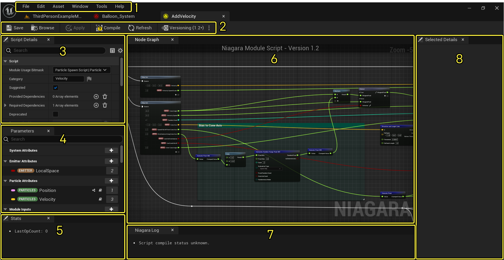
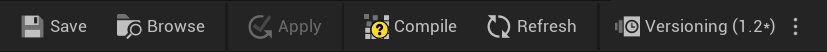
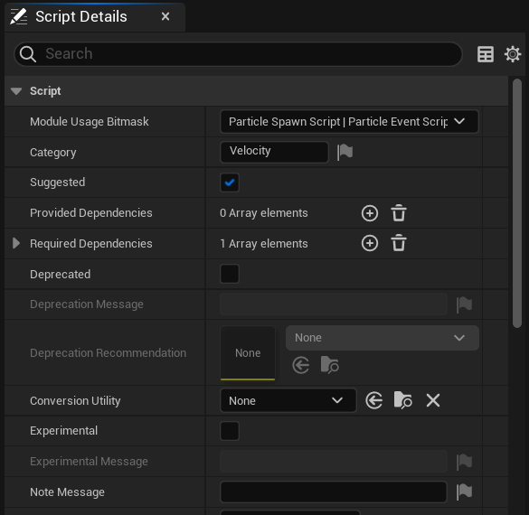
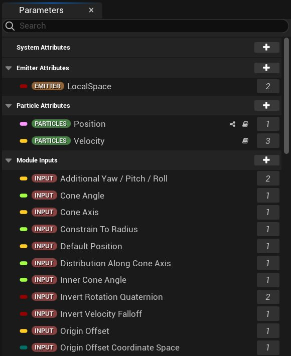
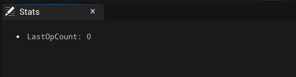
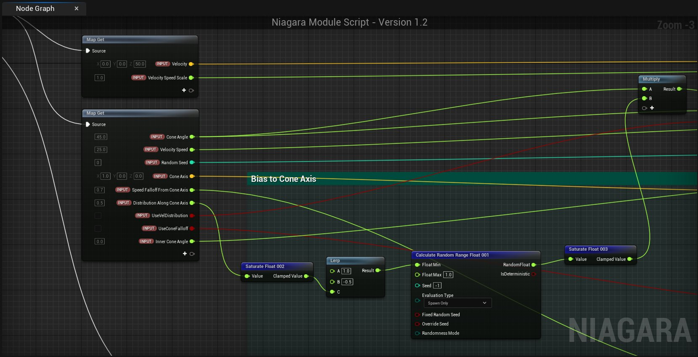
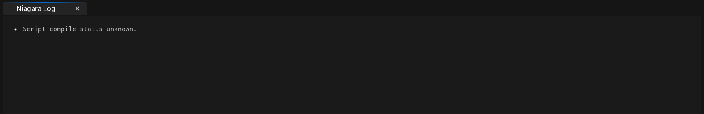

# Niagara脚本编辑器参考

> 路径：虚幻引擎5.7文档 / 创建视觉效果 / Niagara参考页面 / Niagara脚本编辑器参考

> 原始页面：https://dev.epicgames.com/documentation/unreal-engine/script-editor-reference-for-niagara-effects-in-unreal-engine

## 概述

你可以使用 **Niagara脚本编辑器** 创建新模块、动态输入或其他脚本，以便在Niagara系统和发射器中使用。双击模块标题就能打开脚本编辑器。本文档将介绍脚本编辑器的用户界面（UI），具体分为以下几部分。

点击查看大图。

1. 菜单栏
2. 工具栏
3. 脚本细节面板
4. 参数面板
5. 统计数据面板
6. 节点图表
7. Niagara消息日志面板
8. 选定细节面板

## 菜单栏

> [!NOTE]
> 下表仅描述了适用于Niagara编辑器的命令；在某些打开资产编辑器或虚幻编辑器其他部分的菜单中，可能会出现一些其他命令。

### 文件

| 命令 | 说明 |
| --- | --- |
| **保存（Save）** | 保存当前发射器。 |
| **另存为（Save As）** | 使用不同名称保存当前发射器。 |
| **打开资产（Open Asset）** | 显示用于选择其他资产的窗口。 |
| **全部保存（Save All）** | 保存该项目中的所有资产和关卡。 |
| **选择要保存的文件（Choose Files to Save）** | 显示一个对话框，内含用于保存资产和关卡的选项。 |
| **连接到源码管理（Connect To Source Control）** | 显示一个对话框，可在其中连接到源码管理，以便对内容执行源码管理功能。 |

### 编辑

| 命令 | 说明 |
| --- | --- |
| **撤销（Undo）** | 取消上一个操作。 |
| **恢复（Redo）** | 恢复未完成的操作。 |
| **撤销历史记录（Undo History）** | 显示列出所有撤销操作的对话框。 |

### 资产

| 命令 | 说明 |
| --- | --- |
| **在内容浏览器中查找（Find in Content Browser）** | 切换到最近使用的内容浏览器，并选择该内容浏览器中的当前资产。 |
| **引用查看器（Reference Viewer）** | 显示一个对话框，其中显示所有当前资产的引用。 |
| **大小贴图（Size Map）** | 显示一个交互式贴图，其中显示资产的大致大小及其引用的所有内容。 |
| **审计资产（Audit Assets）** | 打开资产审计用户界面，并显示所选资产的信息。 |
| **着色器烘焙统计数据（Shader Cook Statistics）** | 显示着色器烘焙过程的统计数据。 |

### 窗口

| 命令 | 说明 |
| --- | --- |
| **工具栏（Toolbar）** | 显示或隐藏工具栏。 |
| **节点图表（Node Graph）** | 显示或隐藏节点图表。 |
| **脚本细节（Script Details）** | 显示或隐藏脚本细节面板。 |
| **选定细节（Selected Details）** | 显示或隐藏选定面板。 |
| **系统细节（System Details）** | 显示或隐藏系统细节面板。 |
| **参数（Parameters）** | 显示或隐藏参数面板。 |
| **统计数据（Stats）** | 显示或隐藏统计数据面板。 |
| **Niagara消息日志（Niagara Message Log）** | 显示或隐藏Niagara消息日志面板。 |

## 工具栏

| 工具名称 | 说明 |
| --- | --- |
| **保存（Save）** Save Icon | 保存当前脚本。 |
| **浏览（Browse）** Browse Icon | 切换至最近使用的内容浏览器，并选择当前资产。 |
| **应用（Apply）** Apply Icon | 将未保存的更改应用于当前资产。 |
| **编译（Compile）** Compile Icon | 这将编译脚本的所有更改。 |
| **刷新（Refresh）** Refresh Icon | 刷新面板以正确描述依赖性。 |

## 脚本细节面板

点击查看大图。

| 设置 | 说明 |
| --- | --- |
| **模块使用位掩码（Module Usage Bitmask）** | 使用此下拉列表选择适合引用此模块的脚本类型。可选择多项。 |
| **类别（Category）** | 使用此属性来指定用户在打开添加菜单时，模块或脚本会以何种类别展示。文本框旁边有一个向下的小箭头；点击它即可显示此文本框的高级文本设置。 |
| **提供的依赖性（Provided Dependencies）** | 可用来创建此模块提供给其他模块的依赖性ID数组。点击 **加号** （**+**）图标，将元素添加到数组中。 |
| **必要依赖性（Required Dependencies）** | 此数组包含此模块需要从堆栈中其他模块获得的依赖性。每个数组元素包含四个成员： **ID**：这是所需依赖模块的唯一ID。 **类型（Type）**：用于指示依赖性在此模块之前还是之后。 **脚本约束（Script Constraints）**：指定与提供依赖性模块的源脚本有关的约束。 **描述（Description）**：输入所需依赖性的描述。点击向下的小箭头即可显示此文本框的高级文本设置。 |
| **已废弃（Deprecated）** | 若不再使用该模块，则勾选此复选框。启用此设置将激活下方两个设置。若未勾选此复选框，则接下方的两个设置都不可用。 |
| **废弃消息（Deprecation Message）** | 输入废弃此模块时要显示的消息。文本框旁边有一个向下的小箭头；点击即可显示此文本框的高级文本设置。 |
| **废弃建议（Deprecation Recommendation）** | 建议替代废弃模块的模块。点击下拉列表选择建议模块。 |
| **转换工具（Conversion Utility）** | 你可在此处编写或选择自定义逻辑，将现有脚本指定的内容转换为此脚本。 |
| **实验性（Experimental）** | 勾选此复选框，将该模块标记为实验性（因此受支持程度较低）。若勾选此框，则下个设置生效；若未勾选，则下个设置不可用。 |
| **实验性消息（Experimental Message）** | 若此模块是实验性模块，则可使用此设置来确定选择模块时要显示的消息。文本框旁边有一个向下的小箭头；点击即可显示此文本框的高级文本设置。 |
| **公开到库（Expose to Library）** | 勾选此复选框可将此模块公开到库。 |
| **描述（Description）** | 在此选项中输入文本来描述模块。文本框旁边有一个向下的小箭头；点击即可显示此文本框的高级文本设置。 |
| **关键字（Keywords）** | 在此文本框中，你可以输入以空格分隔的关键字列表，这些关键字可用于在编辑器菜单中寻找模块。 |
| **高亮显示（Highlights）** | 可在此处选择在系统概述中显示模块时，哪些用颜色编码的图标会出现在模块中。此列表以数组形式构造。点击 **加号** （**+**）图标就能向数组添加元素。 |
| **脚本元数据（Script Metadata）** | 可用来创建映射，映射是将一组键与一组值配对的关联式无序容器。 |
| **输入参数（Input Parameters）** | 列出脚本中包含的输入参数。点击 **加号** （**+**）图标可添加参数。 |
| **输出参数（Input Parameters）** | 列示脚本中包含的输出参数。点击 **加号** （**+**）图标，可添加参数。 |

## 参数面板

该面板会列出当前编辑模块的所有用到的参数。构建脚本时，可以将参数从此面板拖入节点图表（Node Graph）。下表列出了各个类别以及类别描述。可以点击 **加号** （**+**）图标打开参数菜单以便为该类别添加参数。还可在构建脚本时将参数从此面板拖放到图表中。

| 参数类别 | 说明 |
| --- | --- |
| **系统属性（System Attributes）** | 写入系统阶段的固定属性，可在任何地方读取。 |
| **发射器属性（Emitter Attributes）** | 写入发射器阶段的固定属性，可在发射器和粒子阶段中读取。 |
| **粒子属性（Particle Attributes）** | 写入粒子阶段的固定属性，可在粒子阶段中读取。 |
| **模块输入（Module Inputs）** | 将模块输入公开到系统和发射器编辑器的值。 |
| **静态切换（Static Switch）** | 只能在编辑时设置的值。 |
| **模块本地值（Modules Locals）** | 可在单个模块内写入和读取的临时值。临时值不会在帧之间或阶段之间持续存在。 |
| **引擎提供（Engine Provided）** | 这是引擎提供的只读值。值的来源可以是模拟本身，也可以是模拟的拥有者。 |
|  |  |

## 统计数据面板

## 节点图表

上图展示了正在编辑中的HLSL脚本的视觉效果；可以看到它与UE4其他基于节点的图表十分相似。你可以右键点击图表中的任意位置来打开节点菜单并进行选择。也可以从某个现有节点的输入或输出引脚连出引线，打开相同的菜单。

## Niagara消息日志面板

编译脚本时出现的所有警告或错误都会在此处显示。

## 选定细节面板

> 图片已省略：Selected Details Panel

当你在图表中选定某个节点后，此面板会显示相关的细节信息。

> [!NOTE]
> 并非所有节点在选中后都会在此面板中显示信息。
