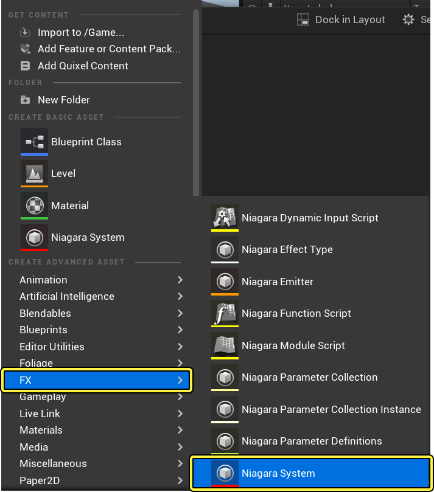
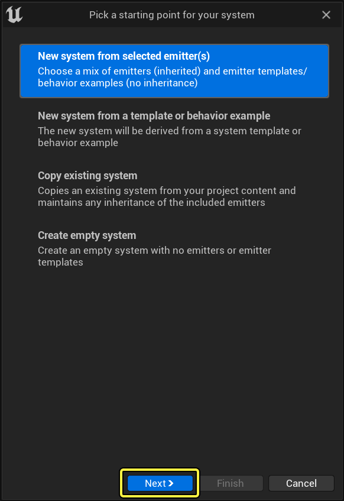
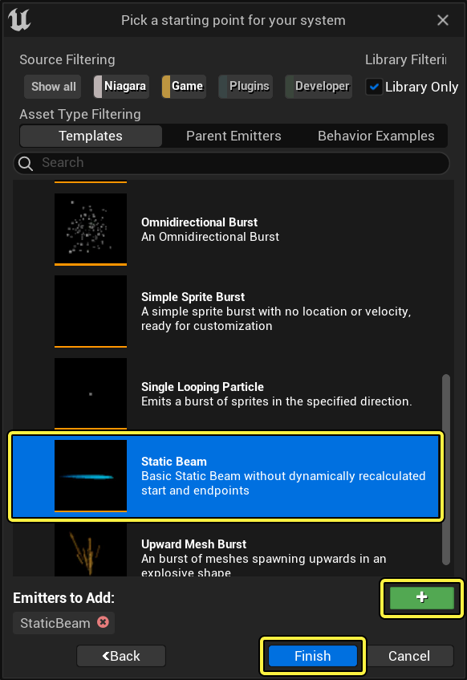
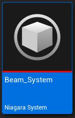
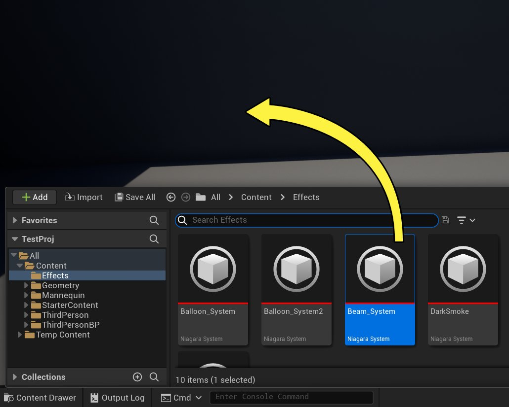
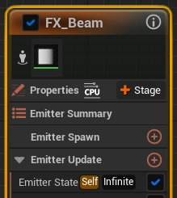
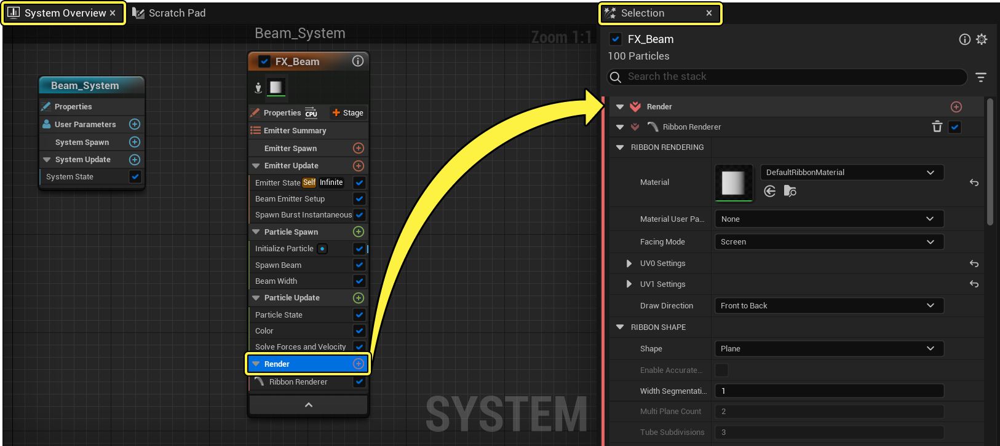
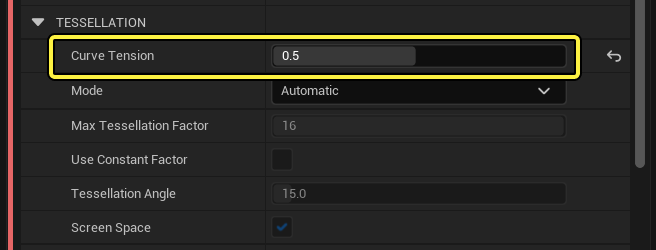

# 光束效果

> 路径：虚幻引擎5.7文档 / 创建视觉效果 / Niagara教程 / 光束效果

> 原始页面：https://dev.epicgames.com/documentation/unreal-engine/how-to-create-a-beam-effect-in-niagara-for-unreal-engine

> [!NOTE]
> 操作前提：本指南会用到Niagara插件资源中的默认条带材质（DefaultRibbonMaterial）。但是，假如你已经完成了[创建网格体气球效果](../how-to-use-a-solid-mesh-to-create-a-balloon-eff-3e45d715/index.md)教程，你可以使用其中的M_Balloon材质。

在Niagara中，你需要结合使用条带渲染器以及特定模块（该模块用于指示条带为光束）。在本指南中，你将学习如何创建能够模拟光照的光束。

## 创建系统和发射器

在Niagara中，发射器和系统相互独立。目前推荐的工作流程是从现有发射器或发射器模板创建系统。

1. 首先，在内容浏览器（Content Browser）中右键点击，创建Niagara系统（Niagara System），并选择 **FX > Niagara系统（Niagara System）**。之后将显示Niagara发射器（Niagara Emitter）向导。

   

   点击查看大图。
2. 选择 **从选定发射器新建系统（New system from selected emitters）**。然后点击 **下一步（Next）**。

   

   点击查看大图。
3. 在 **模板（Templates）** 中，选择 **静态光束（Static Beam）**。点击加号按钮添加模板 (**+**)，然后点击 **完成（Finish）**。

   

   点击查看大图。
4. 将新系统命名为 **BeamSystem**。双击它，在Niagara编辑器中打开它。

   
5. 将 **BeamSystem** 拖入关卡。

   

   点击查看大图。

   > [!NOTE]
   > 创建完粒子效果后，建议你将它拖入关卡中。这样你可以观察完整变化，并在环境中编辑效果。你对粒子系统做的任何改变，都会自动扩展给关卡中的其他系统实例。
6. 新系统中发射器实例的默认名称是 **静态光束（StaticBeam）**，但可以被重命名。在"系统概览"中点击发射器实例的名称，该字段将变为可编辑状态。将发射器命名为 **FX_Beam**。

   

   点击查看大图。

## 更改渲染器设置

**渲染组** 位于堆栈的最后，但是你需更改一些内容，以便效果按照预期的方式显示。

1. 在 **系统概述（System Overview）** 中，点击 **渲染器（Render）**，在 **选择（Selection）** 面板中将其打开。

   

   点击查看大图。

   > [!NOTE]
   > 此系统中的发射器模板已经包含条带渲染器。在本指南的后面部分，你将添加特定模块，以便将指示条带作为光束使用。
2. 该渲染器使用的材质是 **默认条带材质（DefaultRibbonMaterial）**。如果你想使用其他材质，你可以点击下拉菜单，搜索并选择其他材质。
3. 如果你滚动到 **条带渲染（Ribbon Rendering）** 分段中的设置，你会找到一个名为 **曲面细分（Tessellation）** 的分段。在该分段中，将 **曲线张力（Curve Tension）** 设置为 **0.5**。这将影响光照效果的尖锐程度。你可以提高或降低该值，改变效果。

   

   点击查看大图。

## 编辑发射器更新组设置

首先，你在 **发射器更新（Emitter Update）** 组中编辑模块。这些是应用于发射器并更新每帧的行为。

1. 在 **系统概述（System Overview）** 中，点击 **发射器更新（Emitter Update）** 组，在 **选择（Selection）** 面板中将其打开。

   > 图片已省略：Select Emitter Update

   点击查看大图。
2. **静态光束** 发射器模板默认将 **生命周期模式（Life Cycle Mode）** 设置为 **自身（Self）**。这意味着直接设置发射器的生命周期和循环行为，而不是由系统处理。对于此效果，你可以向值添加浮点，为 **循环时长（Loop Duration）** 添加一些随机性。点击 **循环时长（Loop Duration）** 下拉箭头，然后选择 **动态输入（Dynamic Inputs）> 随机范围浮点（Random Ranged Float）**。此操作将在循环时长（Loop Duration）中添加 **最小值（Minimum）** 和 **最大值（Maximum）** 字段。

   > 图片已省略：Set Loop Duration to Random Range Float

   点击查看大图。
3. 将循环时长（Loop Duration）的最小值（Minimum）和最大值（Maximum）设置如下。

   > 图片已省略：Set Loop Duration Minimum and Maximum

   点击查看大图。

   | 设置 | 数值 |
   | --- | --- |
   | **最小值（Minimum）** | 0.1 |
   | **最大值（Maximum）** | 0.2 |
4. 指示此效果使用光束的第一个模块是 **光束发射器设置（Beam Emitter Setup）** 模块。由于你从静态光束模板开始，因此已经包含此模块。对于 **光束开始（Beam Start）** 和 **光束结束（Beam End）**，保留默认值。选中复选框，启用 **绝对开始（Absolute Start）** 和 **绝对结束（Absolute End）**。

   > [!NOTE]
   > 光束的起始位置由场景中Niagara系统的位置决定。结束位置由"光束结束位置（Beam End）"中设置的静态坐标定义，可以通过直接修改数值来更改。在这篇教程的末尾，你将学习如何将光束的结束点连接至Actor。

   > 图片已省略：Enable Absolute Start and Absolute End

   点击查看大图。
5. 要向效果中添加弧或者曲线，勾选复选框来启用 **使用光束切线（Use Beam Tangents）**。这样会显示 **光束开始切线（Beam Start Tangent）** 和 **光束结束切线（Beam End Tangent）** 设置。点击 **光束开始切线（Beam Start Tangent）** 的 **恢复默认设置（Reset to Default）** （黄色小箭头）图标来将数值更改为 **矢量使用浮点乘法（Multiply Vector by Float）**。

   > 图片已省略：Reset Beam Start Vector

   点击查看大图。
6. 将光束开始切线（Beam Start Tangent） **矢量（Vector）** 和 **浮点（Float）** 设为以下数值。

   > 图片已省略：Set Beam Start Tangent

   点击查看大图。

   | 设置 | 数值 |
   | --- | --- |
   | **矢量（Vector）** | **X**：0，**Y**：0，**Z**：1 |
   | **浮点（Float）** | 0.5 |
   |  |  |
7. 将光束结束切线（Beam End Tangent）矢量（Vector）和浮点（Float）设置为以下数值。

   > 图片已省略：Set Beam End Tangent

   点击查看大图。

   | 设置 | 数值 |
   | --- | --- |
   | **矢量（Vector）** | **X**：0，**Y**：0，**Z**：1 |
   | **浮点（Float）** | 1 |
   |  |  |
8. 在 **即时生成迸发（Spawn Burst Instantaneous）** 模块中，将 **生成计数（Spawn Count）** 值设置为 **35**。

   > 图片已省略：Set Spawn Count

   点击查看大图。

## 编辑粒子生成组设置

然后，你将在 **粒子生成（Particle Spawn）** 组中编辑模块。此为首次生成粒子时应用于粒子的行为。

1. 在 **系统概述（System Overview）** 中，点击 **粒子生成（Particle Spawn）** 组，在 **选择（Selection）** 面板中将其打开。

   > 图片已省略：Select Particle Spawn Group

   点击查看大图。
2. 在 **初始化粒子（Initialize Particle）** 模块中，找到 **生命周期（Lifetime）** 参数。生命周期参数确定粒子消失之前的显示时长。将 **生命周期（Lifetime）** 设置为 **0.2**。此短生命周期将导致光束闪烁，从而使光照显得更真实。

   > 图片已省略：Set Lifetime Value

   点击查看大图。
3. **生成光束（Spawn Beam）** 模块是第二个光束特定模块。你无需为此模块设置任何内容，只需保持当前状态。
4. 第三个光束特定模块为 **光束宽度（Beam Width）** 模块。光束宽度（Beam Width）设置为 **曲线中浮点（Float from Curve）**。点击第二个曲线键可显示时间（Time）和值（Value）字段。将 **时间（Time）** 设置为 **0.5**，将 **值（Value）** 设置为 **1**。要使形状看起来合适，请右键点击每个曲线键，并确保将其设置为 **自动（Auto）**。

   > 图片已省略：Set Beam Width

   点击查看大图。
5. 在曲线图下方，你可以看到一些其他设置。将 **缩放曲线（Scale Curve）** 设置为 **5**。

## 编辑粒子更新组设置

现在，你将在 **粒子更新（Particle Update）** 组中编辑模块。此类行为将应用于发射器的粒子并更新每个帧。

1. 在 **系统概述（System Overview）** 中，点击 **粒子更新（Particle Update）** 组，在 **选择（Selection）** 面板中将其打开。

   > 图片已省略：Select Particle Update Group

   点击查看大图。
2. 对于 **颜色（Color）** 模块，将 **RGB** 值设置如下。

   > 图片已省略：Set Color

   点击查看大图。
3. 要断开曲线并使光束像闪电一样裂开跳跃，请点击 **粒子更新（Particle Update）** 的 **加号** （**+**）图标并选择 **位置（Location）> 抖动位置（Jitter Position）**，添加 **抖动位置（Jitter Position）** 模块。

   > 图片已省略：Add Jitter Position Module

   点击查看大图。
4. 为了使 **抖动位置（Jitter Position）** 模块正常运行，你需要更新光束（Update Beam）模块。点击 **粒子更新（Particle Update）** 的 **加号** （**+**）图标并选择 **光束（Beam）> 更新光束（Update Beam）**，添加 **更新光束（Update Beam）** 模块。在 **系统概述（System Overview）**中，将 **更新光束（Update Beam）** 模块拖到堆栈中 **抖动位置（Jitter Position）** 模块上方的位置。

   > 图片已省略：Add Update Beam Module

   点击查看大图。
5. 现在回到 **抖动位置（Jitter Position）** 模块。**抖动量（Jitter Amount）** 的默认设置为 **10**，**抖动延迟（Jitter Delay）** 的默认设置为 **0.25**。但是，如果将 **抖动延迟（Jitter Delay）** 减小到 **0.1**，你将开始看到光束弯曲并呈角度锯齿状运动。如果值为 **0.1**，你仍然可以看到锯齿状光束下的原始弧形，这并非理想效果。要修复此问题，你必须将抖动延迟（Jitter Delay）设置为负数。将 **抖动延迟（Jitter Delay）** 设置为 **-0.01**。将 **抖动量（Jitter Amount）** 设置为 **15**。

   > 图片已省略：Set Jitter Amount and Delay

   点击查看大图。

## 调整光束结束位置

你可以在 **光束发射器设置（Beam Emitter Setup）**模块中的 **发射器更新（Emitter Update）** 组里设置光束的开始和结束位置。默认情况下，光束的结束位置设为一个静止的世界位置数值，可以手动进行调整。

然而，很多时候我们需要将结束位置链接至场景中的一个Actor，这样我们就可以通过移动Actor来编辑光束的结束位置。可以使用蓝图来达到这样的目的，另一个更简单的办法是用暂存区（Scratch Pad）设置一个动态输入。

1. 点击 **光束发射器设置（Beam Emitter Setup）** 模块来在 **选择（Selection）** 面板中选择它。

   > 图片已省略：Select Beam Emitter Setup Module

   点击查看大图。
2. 点击 **光束结束位置（Beam End）** 旁边的下拉箭头，找到 **暂存（Scratch）** 然后选择 **新动态暂存输入（New Dynamic Scratch Input）**。

   > 图片已省略：Set Beam End to Dynamic Scratch Input

   点击查看大图。
3. 这样会打开一个初始的暂存区，包括一个输入和一个可以用来抓取数据的映射抓取（Map Get），还有一个输出。右键点击默认输入，选择 **移除引脚（Remove Pin）** ，我们不需要这个输入。
4. 点击加号按钮 (**+**) 来添加新的引脚。找到 **Actor** 然后选择 **新Actor组件界面（New Actor Component Interface）**。 这样会在选择你的Niagara物体时在 **关卡编辑器（Level Editor）** 的细节面板（Details Panel）** 中添加一个区，用于选择你想要链接的物体。

   > 图片已省略：Add Pin for New Actor Component Interface

   点击查看大图。
5. 从**新Actor组件界面（New Actor Component Interface）** 拖出引脚。选择 **获取变换（Get Transform）**，这样会显示其链接物体的变换信息。

   > 图片已省略：Add Get Transform

   点击查看大图。
6. 将位置数值连接至输出。

   > 图片已省略：Connect Position to Output

   点击查看大图。
7. 系统自动添加一个 **位置（Position） -> Vector3f** 节点。这样会将矢量变换为适用于大世界的坐标。你可以在画板上确保它们不重叠。

   > 图片已省略：Position to Vector 3f node

   点击查看大图。
8. 现在暂存已经完成了，要将变动传递回Niagara系统，需要点击 **应用（Apply）**.

   > 图片已省略：Apply the Scratch Module

   点击查看大图。
9. 在Niagara编辑器中，再次选择 **光束发射器设置（Beam Emitter Setup）** 模块，会出现一个 **新Actor组件界面（New Actor Component Interface）** 并已经链接至 **光束结束位置（Beam End）** 。点击下拉箭头，选择 **制作（Make）** > **从新用户参数读取（Read from new User parameter）** 。 这样会创建一个新的可以在Niagara系统之外设置的用户参数。

   > 图片已省略：Set Actor Component Interface to Make New User Parameter

   点击查看大图。
10. 默认情况下，系统在创建用户参数时会用物体名称和参数名称命名，最终命名会比较长。前往参数（Parameters）面板可以重命名。

    > 图片已省略：Parameters Panel

    点击查看大图。
11. Double-click to rename **New Actor Component Interface_Beam End** to something shorter, such as **Beam_End**.

    > 图片已省略：Rename User Parameter

    Click image for full size.
12. 保存你的Niagara系统，关闭编辑器便能返回至 **关卡编辑器（Level Editor）** 。你可以看到之前拖进关卡的光束系统。现在你可以拖动Niagara系统的起始点来移动光束的起始点，但是结束点是固定的。接下来我们要将其对接到场景中的一个物体上。
13. 首先，创建一个用于链接结束点的球体。在 **创建（Create）** 菜单，选择 **形状（Shapes） > 球体（Sphere）** 。

    > 图片已省略：Create Sphere

    点击查看大图。
14. 在 **大纲（Outliner）** 中，选择你的球体并双击将其重命名为 **Sphere_BeamEnd** 。

    > 图片已省略：Rename Sphere

    点击查看大图。
15. 在 **大纲（Outliner）** 中，选择你的Niagara系统 **BeamSystem** 。在 **细节（Details）** 面板中，向下滚动至 **覆盖参数（Override Parameters）** 部分。在这里可以看到之前创建暂存模块时设置的用户参数 **Beam_End** 。打开 **源Actor（Source Actor）** 下拉菜单，然后选择 **Sphere_BeamEnd**。或者你也可以使用滴管工具在你的关卡中选择任何物体。现在你再去移动那个物体时，光束结束位置会跟随它移动。

    > 图片已省略：Link Sphere to Beam End

    点击查看大图。

## 最终结果

恭喜！你已经创建了模拟光照的光束效果。在下面的视频中，你可以看到光照光束效果的示例。你可以将光束用于各种视觉效果：激光、武器射线、特斯拉线圈等。

> 动图已省略：Beam Effect Final Result
