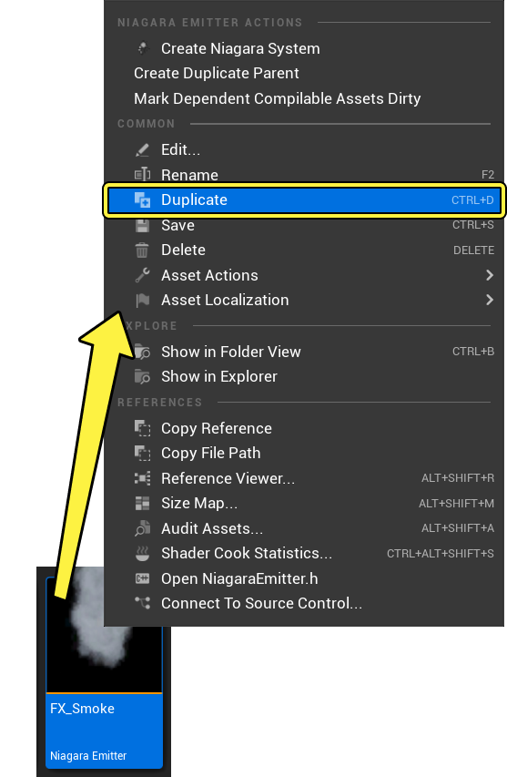
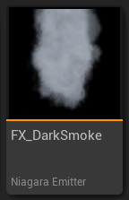
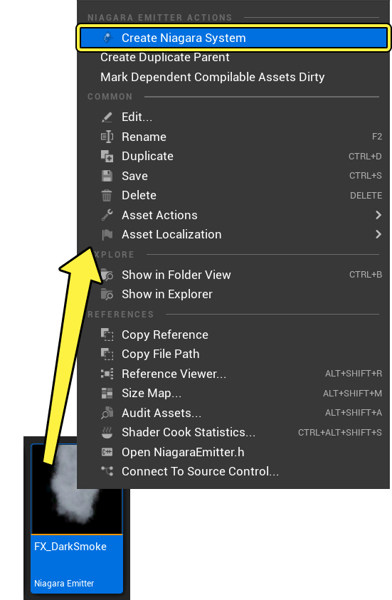
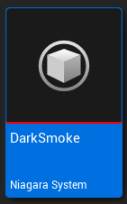
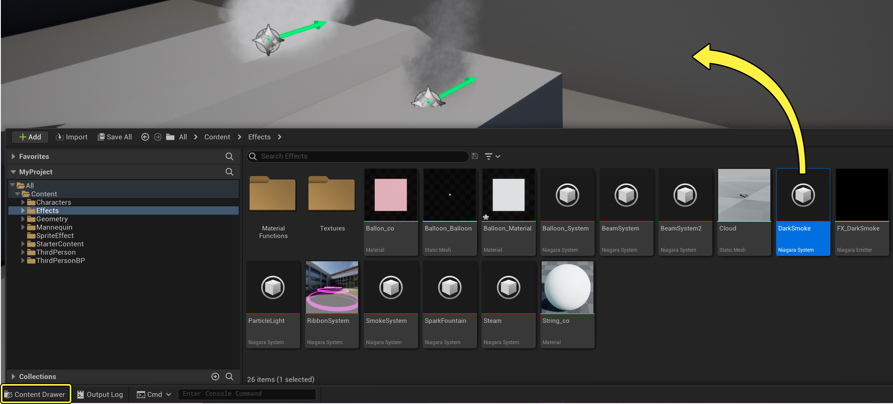
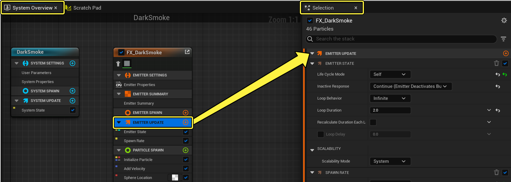
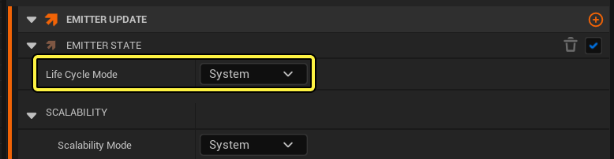
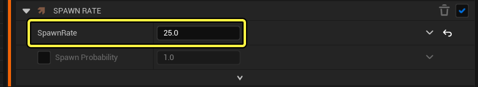

# 黑烟

> 路径：虚幻引擎5.7文档 / 创建视觉效果 / Niagara教程 / 黑烟

> 原始页面：https://dev.epicgames.com/documentation/unreal-engine/how-to-create-a-dark-smoke-effect-in-niagara-for-unreal-engine

完成[在Niagara中创建Sprite烟雾效果](../how-to-create-a-smoke-effect-using-sprite-parti-b357db79/index.md)教程后，你制作了基础的Sprite效果。在本教程中，学习如何复制发射器、从预先存在的发射器创建Niagara系统，并进行进一步调整，更改烟雾的外观。

> [!NOTE]
> **准备步骤：**
>
> 本指南使用 **M_smoke_subUV** 材质，该材质可以在初学者内容包中找到。如果你还没有这样做，请确保你的项目包含初学者内容包。本指南还使用教程[在Niagara中创建Sprite烟雾效果](../how-to-create-a-smoke-effect-using-sprite-parti-b357db79/index.md)中创建的 **FX_Smoke** 发射器。

## 创建系统和发射器

你可以在内容侧滑菜单（Content Drawer）中，点击鼠标右键，从头开始创建Niagara系统，就像在之前的教程中所做的那样。但是，如果你已经有保存发射器用作起始点，也可以复制它并就此开始。

1. 在项目的内容（Content）文件夹中为本教程创建新文件夹。
2. 复制你在[在Niagara中创建Sprite粒子效果](../how-to-create-a-smoke-effect-using-sprite-parti-b357db79/index.md)中创建的 **FX_Smoke** 发射器。

   

   点击查看大图。
3. 将此复制的发射器拖到你在步骤1中创建的文件夹中。在弹出的上下文菜单中，选择 **移动（Move）** 。
4. 将复制的发射器重命名为 **FX_DarkSmoke** 。这样将它与[在Niagara中创建Sprite烟雾效果](../how-to-create-a-smoke-effect-using-sprite-parti-b357db79/index.md)教程中创建的烟雾效果区分开来。

   
5. 右键点击你的新烟雾发射器，然后选择 **创建Niagara系统（Create Niagara System）** 。

   

   > [!NOTE]
   > 有多种方法可以创建新的Niagara系统。因为你是从已创建的发射器着手，所以此处使用的方法可以快速创建包含该发射器的系统。
6. 将系统命名为 **DarkSmoke** 。这样可以将它与[在Niagara中创建Sprite烟雾效果](../how-to-create-a-smoke-effect-using-sprite-parti-b357db79/index.md)教程中创建的烟雾效果区分开来。

   
7. 将DarkSmoke系统从 **内容侧滑菜单（Content Drawer）** 拖到你的关卡中，这样你就可以预览项目世界上下文中的更改。

   

   点击查看大图。

   > [!NOTE]
   > 制作粒子效果时，将系统拖入关卡始终是好方法。这使你能够查看上下文中的每项更改和编辑。你对系统所做的任何更改都会自动传播到关卡中的系统实例。
8. 双击 **FX_DarkSmoke** 发射器，在Niagara编辑器中（Niagara Editor）打开它。编辑发射器中的设置后，你还需要保存DarkSmoke系统。

## 编辑发射器更新设置

首先，你将编辑 **发射器更新（Emitter Update）** 组中的模块。这些行为适用于发射器本身，并对每帧进行更新。

1. 在 **系统概览（System Overview）** 中，点击 **发射器更新（Emitter Update）** 组，在 **选择（Selection）** 面板中打开它。

   

   点击查看大图。
2. 展开 **发射器状态（Emitter State）** 模块。此模块控制此发射器的时间和可扩展性。因为你使用了简单的Sprite爆炸（Simple Sprite Burst）模板，所以 **生命周期模式（Life Cycle Mode）** 设置为 **自身（Self）** 。

   通常，这用于完全自定义此专有发射器的发射器生命周期逻辑，但此效果不需要它。点击下拉菜单，并将 **生命周期模式（Life Cycle Mode）** 设置为 **系统（System）** 。这使你的系统能够计算生命周期设置，通常可以优化性能。默认情况下，系统以5秒的间隔无限循环。

   

   点击查看大图。
3. 打开 **生成速率（Spawn Rate）** 模块。将 **生成速率（Spawn Rate）** 设置为 **25** 。

   

   点击查看大图。

## 编辑粒子生成设置

接下来，你需要编辑粒子生成（Particle Spawn）组中的模块。这些是在粒子首次生成时应用于粒子的行为。

1. 在 **系统概览（System Overview）** 中，点击 **粒子生成（Particle Spawn）** 组，在 **选择（Selection）** 面板中打开它。

   > 图片已省略：Open Particle Spawn Group

   点击查看大图。
2. 打开 **初始化粒子（Initialize Particle）** 模块。在 **点属性（Point Attributes）** 下，展开 **生命周期（Lifetime）** 。生命周期（Lifetime）参数决定粒子在消失之前显示多长时间。将 **生命周期模式（Lifetime Mode）** 、 **最小值（Minimum）** 和 **最大值（Maximum）** 更改为以下值。

   > 图片已省略：Set Particle Lifetime

   点击查看大图。

   | 参数 | 数值 |
   | --- | --- |
   | **生命周期模式（Lifetime Mode）** | 随机 |
   | **最小值（Minimum）** | 3.0 |
   | **最大值（Maximum）** | 5.0 |
3. 展开 **颜色（Color）** 菜单。你可以将烟雾设置为单一颜色，或将 **颜色模式（Color Mode）** 更改为 **随机范围（Random Range）**，从而让每个粒子颜色带有一些变化。将RGB值更改如下：

   > 图片已省略：Set Initial Color

   点击查看大图。

   | 颜色 | 最小值 | 最大值 |
   | --- | --- | --- |
   | **红（Red）** | 0.5 | 0.205 |
   | **绿（Green）** | 0.5 | 0.205 |
   | **蓝（Blue）** | 0.5 | 0.205 |
4. 在 **Sprite属性（Sprite Attributes）** 下，展开 **Sprite大小（Sprite Size）**。确保 **Sprite大小模式（Sprite Size Mode）** 设置为 **随机均匀（Random Uniform）**，它会提供最小值和最大值。将在这些值之间以随机大小创建新粒子。将 **最小值（Minimum）** 和 **最大值（Maximum）** 更改为以下值:

   > 图片已省略：Set Sprite Size

   点击查看大图。

   | 参数 | 数值 |
   | --- | --- |
   | **最小值（Minimum）** | 50 |
   | **最大值（Maximum）** | 90 |
5. 打开 **添加速度（Add Velocity）** 模块。在此前的教程中，我们将速度（Velocity）设置为随机范围向量（Random Range Vector）。这将添加最小值和最大值。创建的每个新粒子都有随机值，处于为其初始速度设置的这两个范围之间。将 **速度（Velocity）** 最小值和最大值更改为以下值：

   > 图片已省略：Set Velocity

   点击查看大图。

   | 值 | 最小值 | 最大值 |
   | --- | --- | --- |
   | **X** | 12 | 32 |
   | **Y** | 0 | 0 |
   | **Z** | 5 | 7 |
6. 打开 **球体位置（Sphere Location）** 模块。新粒子在首次创建时会在球体内生成。将 **球体半径（Sphere Radius）** 值更改为 **30** 。

   > 图片已省略：Set Sphere Radius

   点击查看大图。

## 编辑粒子更新设置

首先，你将编辑 **粒子更新（Particle Update）** 组中的模块。这些行为适用于发射器的粒子，并对每帧进行更新。

1. 在 **系统概览（System Overview）** 中，点击 **粒子更新（Particle Update）** 组，在 **选择（Selection）** 面板中打开它。

   > 图片已省略：Open Particle Update Group

   点击查看大图。
2. 打开 **加速力（Acceleration Force）** 模块。将加速度（Acceleration） **Z** 值设置为 **20**。

   > 图片已省略：Set Acceleration

   点击查看大图。
3. 打开 **比例颜色（Scale Color）** 模块。确保 **缩放模式（Scale Mode）** **分别设置为RGB和Alpha** 。你只要调整alpha值，以便颜色随着粒子的老化而逐渐淡入然后脉冲输出。 **比例Alpha（Scale Alpha）** 应该设置为 **从曲线浮动（Float from Curve）** 。点击曲线编辑器中的 **脉冲（Pulse）** 模板，快速将此形状应用到曲线。

   > 图片已省略：Set Curve to Pulse

   点击查看大图。

## 最终效果

按照这些步骤操作后，关卡中的烟雾系统将产生类似于下图中的烟雾效果。

> 动图已省略：黑烟最终效果
