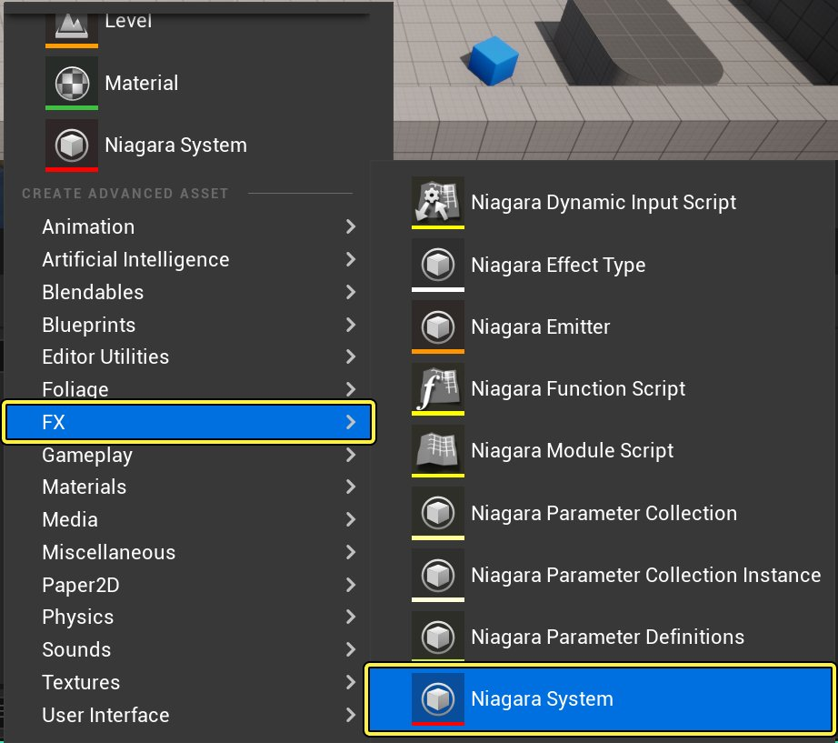
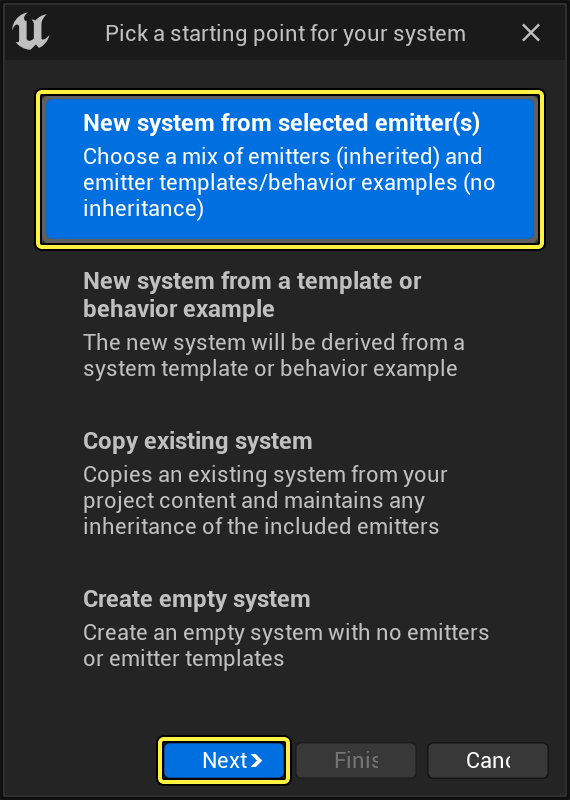
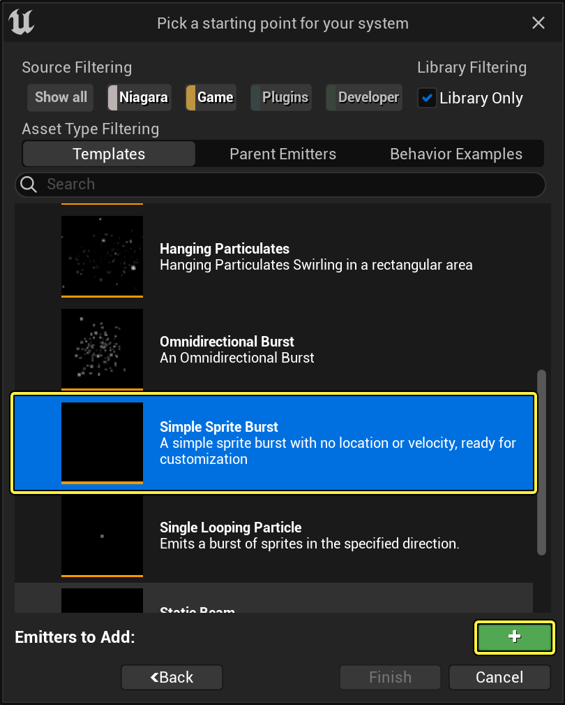
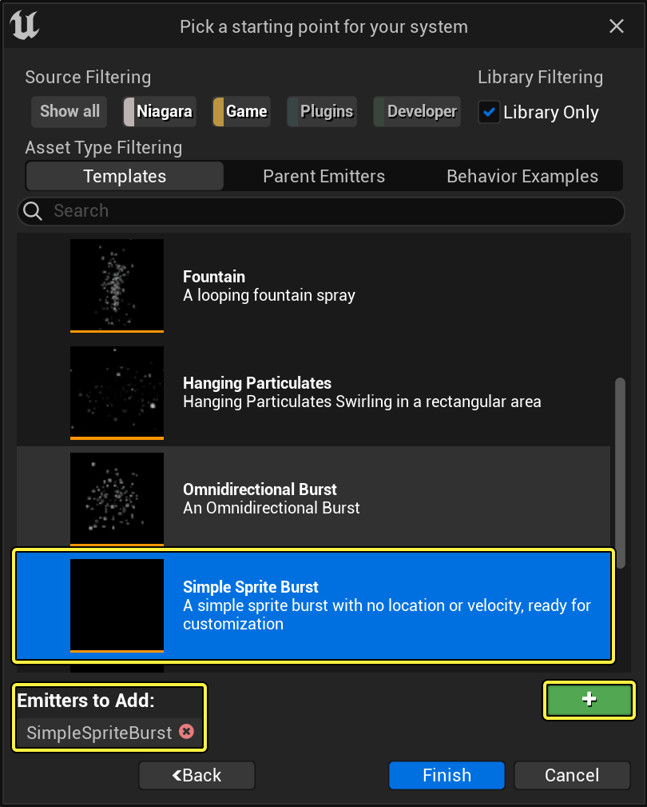
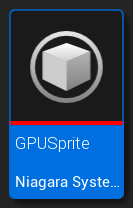
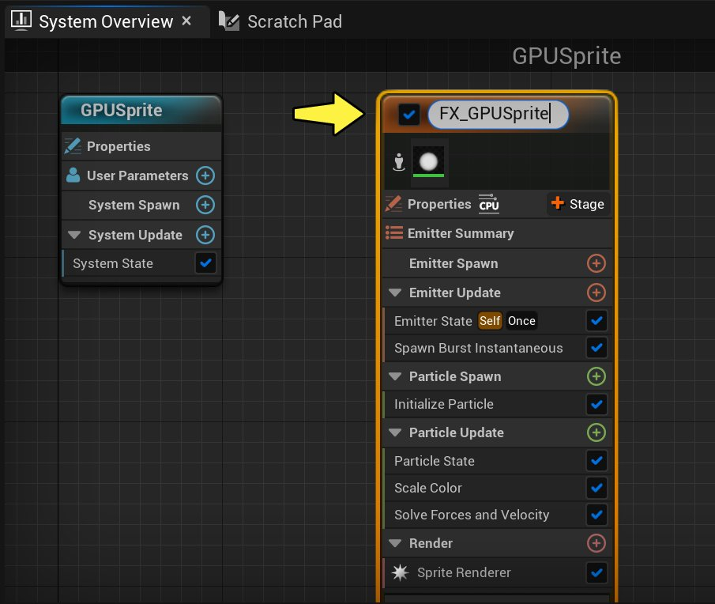
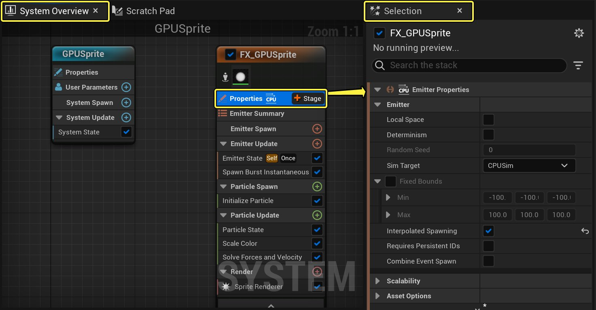
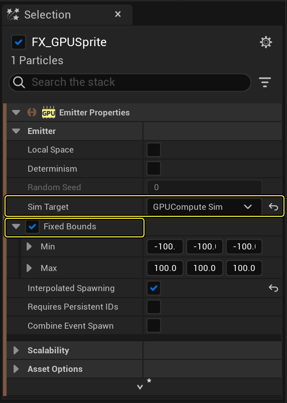

# GPU Sprite效果

> 路径：虚幻引擎5.7文档 / 创建视觉效果 / Niagara教程 / GPU Sprite效果

> 原始页面：https://dev.epicgames.com/documentation/unreal-engine/how-to-create-a-gpu-sprite-effect-in-niagara-for-unreal-engine

为了实现某些效果，你可能需要生成数万个粒子。但是，使用标准CPU生成这么多粒子可能会造成性能问题。在本指南中，我们将展示如何创建使用GPU而不是CPU来运行模拟的Sprite粒子效果。

## 创建系统和发射器

Niagara发射器和系统是独立的。目前推荐的工作流程是基于现有发射器或发射器模板创建系统。

1. 首先，右键点击内容浏览器（Content Browser），从显示的菜单选择 **FX > Niagara系统（Niagara System）** ，从而创建 Niagara系统。界面上将显示Niagara系统向导。

   

   点击查看大图。
2. 选择 **基于所选发射器的新系统（New system from selected emitters）** 。然后点击 **下一步（Next）** 。

   

   点击查看大图。
3. 在 **模板（Templates）** 下，选择 **简单Sprite迸发（Simple Sprite Burst）** 。

   

   点击查看大图。
4. 点击 **加号图标** ( **+** )，将发射器添加到要添加到系统的发射器列表中。然后点击 **完成（Finish）** 。

   

   点击查看大图。
5. 将新系统命名为 **GPUSprite** 。双击以在Niagara编辑器中打开。

   

   点击查看大图。
6. 新系统中的发射器实例采用默认名称 **SimpleSpriteBurst** ，但你可以重命名。在 **系统概述（System Overview）** 中点击发射器实例的名称，相应字段将变为可编辑。将发射器命名为 **FX_GPUSprite** 。

   

   点击查看大图。
7. 将 **GPUSprite** 系统拖入你的关卡中。

> [!NOTE]
> 制作粒子效果时，最好将系统拖入关卡。这样可查看每项更改并在上下文中编辑。 你对系统所做的所有更改会自动传播到关卡中系统的实例。

## 发射器设置 - 发射器属性

首先，你需要在 **发射器属性（Emitter Properties）** 中更改一些设置。你会在这里从CPU模拟切换为GPU模拟。

1. 在 **系统概述（System Overview）** 中，点击 **发射器设置（Emitter Settings）** ，在 **选择（Selection）** 面板中打开。

   

   点击查看大图。
2. 扩展 **发射器属性（Emitter Properties）** 。找到 **模拟目标（Sim Target）** 字段。你将在此字段指示虚幻引擎使用GPU进行模拟。点击下拉菜单并选择 **GPUComputeSim** 。

   

   点击查看大图。
3. 你可能触发关于固定边界未设置的警告。点击 **固定边界（Fixed Bounds）** 的复选框。这将解决该错误。将 **最小值（Minimum）** 和 **最大值（Maximum）** 保留为默认值。

   > [!NOTE]
   > 由于粒子模拟是在GPU上完成的，系统无法获知效果的范围有多大。正因为如此，需要设置固定边界。你可以按此步骤所示进行设置，也可以在 **系统属性（System Properties）** 项目中为整个系统设置固定边界。

## 发射器更新组设置

接下来，你将在 **发射器更新（Emitter Update）** 组中编辑模块。这些行为应用于发射器并会更新每个帧。

1. 在 **系统概述（System Overview）** 中，点击 **发射器更新（Emitter Update）** ，在 **选择（Selection）** 面板中打开。

   > 图片已省略：Open Emitter Update

   点击查看大图。
2. 展开 **发射器状态（Emitter State）** 模块。此模块控制此发射器的时间和可扩展性。因为你使用了简单的Sprite迸发（Simple Sprite Burst）模板，所以 **生命周期模式（Life Cycle Mode）** 设为 **自身（Self）** 。通常，这用于完全自定义此专有发射器的发射器生命周期逻辑，但此效果不需要它。点击下拉菜单，并将 **生命周期模式（Life Cycle Mode）** 设为 **系统（System）** 。这样你的系统可以计算生命周期设置，这通常会优化性能。默认情况下，系统以5秒的间隔无限循环。

   > 图片已省略：Change Life Cycle Mode

   点击查看大图。
3. **生成即时迸发（Spawn Burst Instantaneous）** 模块会在发射器生成时创建大量迸发的粒子。该模块包含在简单Sprite迸发模板中。将 **生成计数（Spawn Count）** 设为 **2500** 。由于 **生成时间（Spawn Time）** 设为 **0** ，迸发会在启动后立即发生。

   > 图片已省略：Set Burst Spawn Count

   点击查看大图。
4. 为实现此效果，你在发射器生成时需要的不仅仅是粒子迸发。**生成速率（Spawn Rate）** 模块会在发射器处于活动状态时创建连续粒子流。点击发射器更新的 **加号** 图标( **+** )并选择 **生成（Spawning）> 生成速率（Spawn Rate）** ，从而添加 **生成速率（Spawn Rate）** 模块。

   > 图片已省略：Add Spawn Rate Module

   点击查看大图。
5. 将 **生成速率（Spawn Rate）** 设为 **500** 。这将以500/秒的速率生成粒子，在初始迸发之后会提供连续的粒子流。

   > 图片已省略：Set Continuous Spawn Rate

   点击查看大图。

## 粒子生成组设置

接下来，你需要编辑 **粒子生成（Particle Spawn）** 组中的模块。这些是在粒子首次生成时应用于粒子的行为。

1. 在 **系统概述（System Overview）** 中，点击 **粒子生成（Particle Spawn）** ，在 **选择（Selection）** 面板中打开。

   > 图片已省略：Open Particle Spawn

   点击查看大图。
2. 展开 **初始化粒子（Initialize Particle）** 模块。该模块会将多个相关参数收集到一个模块中，最大限度减少堆栈凌乱。在 **点属性（Point Attributes）** 下，找到 **生命周期（Lifetime）** 参数。
3. 生命周期（Lifetime）参数将决定粒子会在显示多久后消失。为实现此效果，你需要一个常量值，这样粒子将在效果的整个时长内显示。将 **生命周期（Lifetime）** 设为 **5** 。

   > 图片已省略：Set Lifetime Parameter

   点击查看大图。
4. 你将在本指南的其他部分将Sprite大小随机化，但这里我们会设置Sprite的基础大小。在 **Sprite属性（Sprite Attributes）** 下，找到 **Sprite大小（Sprite Size）** 参数并确保它已启用。将 **Sprite大小（Sprite Size）** 设为以下值。

   > 图片已省略：Set Base Sprite Size

   点击查看大图。

   | 大小向量 | 值 |
   | --- | --- |
   | **X** | 5 |
   | **Y** | 5 |
5. 球体位置将控制Sprite生成的位置的形状。点击发射器生成的 **加号** 图标( **+** )并选择 **位置（Location）> 球体位置（Sphere Location）** ，从而添加 **球体位置（Sphere Location）** 模块。

   > 图片已省略：Add Sphere Location Module

   点击查看大图。
6. 你可以添加 **球体位置（Sphere Location）** 模块，从而采用球体形状生成Sprite，而且你可以指定半径来设置球体形状的大小。从下拉菜单 **形状图元（Shape Primitive）> 球体（Sphere）** 选择 **球体（Sphere）** 。

   > 图片已省略：Select Sphere from the Shape Primitive menu

   点击查看大图。

## 粒子更新组设置

首先，你需要编辑 **粒子更新（Particle Update）** 组中的模块。这些行为适用于发射器的粒子，并更新每个帧。

1. 在 **系统概述（System Overview）** 中，点击 **粒子更新（Particle Update）** 组以在 **选择（Selection）** 面板中打开。

   > 图片已省略：Open Particle Update

   点击查看大图。
2. 在粒子生成组的"初始化粒子（Initialize Particle）"模块中，你选择了Sprite的基础大小。你可以添加"缩放Sprite大小（Scale Sprite Size）"模块，随机化Sprite的大小。这会将比例因子应用于基础大小。单击 **加号** 图标( **+** )并选择 **大小（Size）> 缩放Sprite大小（Scale Sprite Size）** ，从而添加 **缩放Sprite大小（Scale Sprite Size）** 模块。

   > 图片已省略：Add Scale Sprite Size Module

   点击查看大图。
3. 从下拉菜单 **缩放Sprite（Scale Sprite）> 非均匀（Non-Uniform）** 选择 **非均匀（Non-Uniform）** 。

   > 图片已省略：Select Non-Uniform from the Scale Sprite menu

   点击查看大图。
4. "缩放Sprite大小"的默认值是 **X：1** 和 **Y：1** 。若更改这些默认值，将使所有粒子均匀地变大或变小。但是，在视觉效果上，随机大小变化比静态大小更有趣。点击 **比例因子（Scale Factor）** 字段旁边的向下箭头，并选择 **动态输入（Dynamic Inputs）> 来自浮点的Vector2D（Vector2D from Float）** 。

   > 图片已省略：Add Vector2D from Float

   点击查看大图。
5. 请注意， **比例因子（Scale Factor）** 的值已更改为一个静态值。添加浮点值的方式有很多种，具体取决于你希望粒子呈现什么样的外观。若你希望粒子流动且大小逐渐变化，则曲线比较理想。点击 **值（Value）** 旁边的向下箭头，并选择 **动态输入（Dynamic Inputs）> 来自曲线的浮点（Float from Curve）** 。

   > 图片已省略：Add Float from Curve

   点击查看大图。
6. 打开 **缩放Sprite大小（Scale Sprite Size）** 模块。点击 **增减（Ramp Up Down）** 曲线模板，将该形状应用于曲线。

   > 图片已省略：Curve Templates

   点击查看大图。
7. 直接点击匹配该曲线的模板。

   > 图片已省略：Curve Settings

   点击查看大图。
8. 目前，你的当前设置只会创建不太有趣的粒子球。你可以添加一些额外的元素，增加粒子的变化和运动。点击粒子更新的 **加号** 图标( **+** )，并选择 **力（Forces）> 旋度噪点力（Curl Noise Force）** 。

   > 图片已省略：Add Curl Noise Force Module

   点击查看大图。
9. 你可以使用旋度噪点力做很多事情。**噪点强度（Noise Strength）** 将控制总体噪点场的范围（即，有多少噪点干扰粒子的原始球体）。**噪点频率（Noise Frequency）** 将控制旋度噪点应用于粒子的频率：该数字越小，粒子的球体位置的扭曲程度越大。目前使用下面的设置，但稍后你可以对这些进行试验，获得不同的外观。

   > 图片已省略：Curl Noise Settings

   点击查看大图。

   | 参数 | 值 |
   | --- | --- |
   | **噪点强度（Noise Strength）** | 72 |
   | **噪点频率（Noise Frequency）** | .02 |
   |  |  |
10. 现在你将看到粒子首先起旋涡，然后直接连续向外移动，直至消失。为实现此效果，粒子应该向外移动，然后朝其原点移回，形成一堆旋涡。**点吸引力（Point Attraction Force）** 模块会使粒子朝单个点移动（默认情况下，该点是发射器的位置）。点击粒子更新的 **加号** 图标( **+** )，并选择 **力（Forces）> 点吸引力（Point Attraction Force）** 。

    > 图片已省略：Add Point Attraction Force Module

    点击查看大图。
11. **吸引强度（Attraction Strength）** 是将粒子拉向吸引器点的力度。**吸引半径（Attraction Radius）** 将划定点吸引力应用于粒子的场的大小。**衰减指数（Falloff Exponent）** 将控制球体扩散的程度，该数字越小，粒子球体向外扩散的程度越大。**杀死半径（Kill Radius）** 将设置粒子在其生命周期结束时消失的区域的大小。将 **吸引强度（Attraction Strength）** 、 **吸引半径（Attraction Radius）** 、 **衰减指数（Falloff Exponent）** 和 **杀死半径（Kill Radius）** 设为以下值。

    > [!NOTE]
    > 点击模块底部的三角形，显示 **杀死半径（Kill Radius）** 参数。如果相应复选框尚未选中，请选中以将其启用。

    > 图片已省略：Point Attraction Force Settings

    点击查看大图。

    | 参数 | 值 |
    | --- | --- |
    | **吸引强度（Attraction Strength）** | 5.5 |
    | **吸引半径（Attraction Radius）** | 300.0 |
    | **衰减指数（Falloff Exponent）** | 0.6 |
    | **杀死半径（Kill Radius）** | 4.0 |
    |  |  |
12. 现在来更改颜色。点击粒子更新的加号图标(+)并选择 **颜色（Color）> 颜色（Color）** ，从而添加 **颜色（Color）** 模块。

    > 图片已省略：Add Color Module

    点击查看大图。
13. 点击 **颜色（Color）** 旁边的向下箭头，并选择 **通用（General）> 动态输入（Dynamic Inputs）> 来自曲线的颜色（Color from Curve）** 。

    > 图片已省略：Add Color from Curve

    点击查看大图。
14. 你可以点击彩色条上方的空白处，将颜色结点添加到曲线，并且你可以双击结点打开取色器来更改颜色。

    > 图片已省略：Color Picker

    点击查看大图。
15. 要设置不透明度结点，请点击条下面的空白处。

    > 图片已省略：Set an Opacity

    点击查看大图。
16. 要设置时间，请点击条下面的空白处。

    > 图片已省略：Set the time

    点击查看大图。
17. 如下所示，设置颜色和不透明度。

    > 图片已省略：Set Color and Opacity Stops

    点击查看大图。

    | 颜色或不透明度结点 | 时间 | 值 |
    | --- | --- | --- |
    | 颜色 |  |  |
    | **结点1** | 0.0 | R: 1、G: 0、B: 1 |
    | **结点2** | .35 | R: .08、G: 0、B: 1 |
    | **结点3** | ..60 | R: .2、G: 1、B: .8 |
    | **结点4** | .8 | R: 1、G: .96、B: .3 |
    | 不透明度 |  |  |
    | **结点1** | 0 | 1 |
    | **结点2** | .7 | 1 |
    | **结点3** | 1 | 0 |
    |  |  |  |

## 最终结果

祝贺你！你已经创建了使用GPU而不是CPU的精彩Sprite效果。
