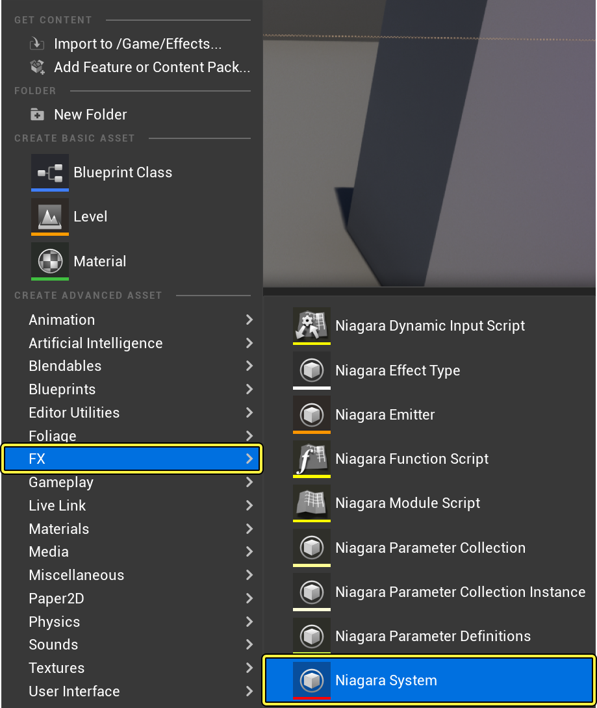
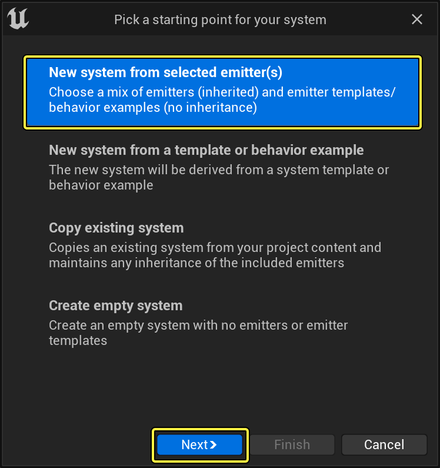
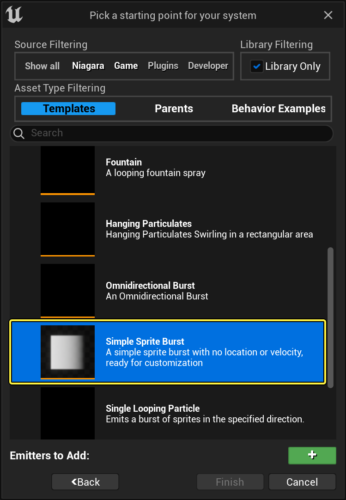
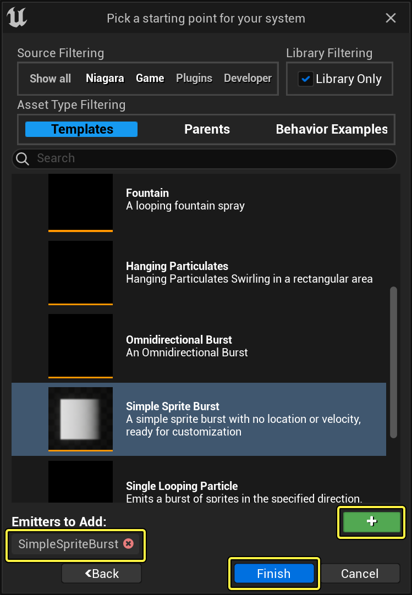
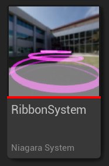
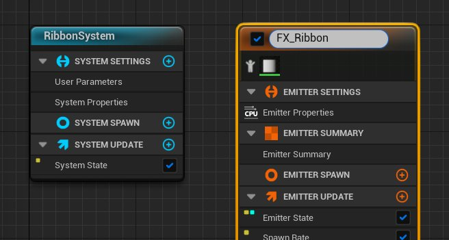
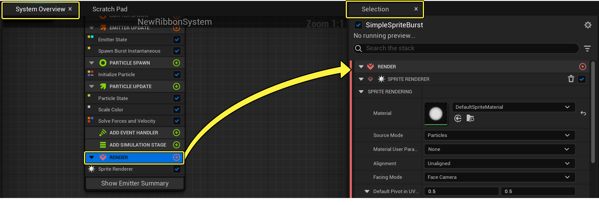
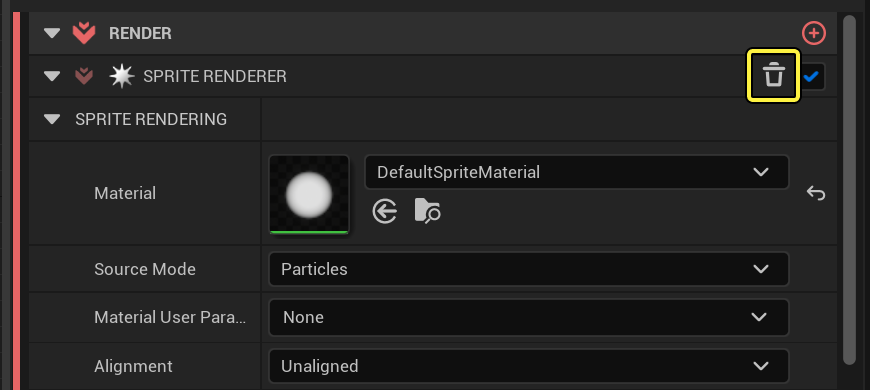

# 条带效果

> 路径：虚幻引擎5.7文档 / 创建视觉效果 / Niagara教程 / 条带效果

> 原始页面：https://dev.epicgames.com/documentation/unreal-engine/how-to-create-a-ribbon-effect-in-niagara-for-unreal-engine

> [!NOTE]
> 操作前提：本教程将用到Niagara插件中的"默认条带材质"（DefaultRibbonMaterial）。但是，如果你已完成[创建网格体粒子效果](../how-to-use-a-solid-mesh-to-create-a-balloon-eff-3e45d715/index.md)教程，则可以使用该教程中使用的M_Balloon材质。

模拟自然现象是很有挑战性的，特别是当使用基于sprite或网格体的粒子来模拟烟雾或蒸汽轨迹时。**条带发射器（Ribbon Emitters）** 是模拟这些对象的优秀解决方案。在接下来的教程中，你将了解如何设置Niagara发射器以将连续条带状粒子效果发射到世界场景中。最后的效果如下所示。

> 动图已省略：条带效果最终效果

## 创建系统和发射器

与在Cascade中不同，Niagara发射器和系统是独立的。当前推荐工作流将从现有发射器或发射器模板创建系统。

1. 首先，在内容浏览器中点击右键并选择 **FX > Niagara系统（FX > Niagara System）** ，以创建Niagara系统。将显示Niagara发射器（Niagara Emitter）向导。

   

   点击查看大图。
2. 选择 **从所选发射器新建系统（New system from selected emitters）** 。然后点击 **下一步（Next）** 。

   

   点击查看大图。
3. 在 **模板（Templates）** 下选择 **简单Sprite迸发（Simple Sprite Burst）** 。

   > [!NOTE]
   > 使用模板将在新系统中放置发射器实例，且此发射器实例将没有任何继承。

   

   点击查看大图。
4. 点击 **加号** 图标（**+**），以将所选发射器添加要添加到系统的发射器列表中。然后点击 **完成（Finish）** 。

   

   点击查看大图。
5. 将新系统命名为 **RibbonSystem** 。

   
6. 将 **RibbonSystem** 拖入关卡。双击在Niagara编辑器中双击打开该系统。

   > [!NOTE]
   > 当你创建一个粒子效果时，最好把粒子系统拖入关卡中。这允许你及时查看改动效果。你在粒子系统中做的任何调整，都会即时显示在关卡中。
7. 新系统中发射器实例的默认名称为 **SimpleSpriteBurst** ，但你可以对其重命名。在 **系统概览（System Overview）** 中点击发射器实例名称，该字段将转变为可编辑状态。将发射器命名为 **FX_Ribbon** 。

   

   点击查看大图。

## 更改渲染器

虽然 **渲染** 组是堆栈中的最后一项，但你需要更改部分内容，以便效果按预期方式显示。原始模板使用了Sprite渲染器，但此效果需要条带渲染器。

1. 在 **系统概览（System Overview）** 中，点击 **渲染（Render）** ，以便在 **选择（Selection）** 面板中将其打开。

   

   点击查看大图。
2. 若要创建条带效果，你需要 **条带渲染器（Ribbon Renderer）** 模块。但该模板具有 **Sprite渲染器** 模块。点击 **垃圾桶（Trashcan）** 图标，以删除Sprite渲染器。

   

   点击查看大图。
3. 点击 **渲染器（Render）** 的 **加号** 图标(**+**)，并选择 **条带渲染器（Ribbon Renderer）** 。

   > 图片已省略：Add Ribbon Renderer

   点击查看大图。
4. 在默认情况下，此所需材质不显示。点击 **材质（Material）** 下拉列表，并点击 **查看选项（View Options）** 以打开选项列表。勾选 **显示引擎内容（Show Engine Content）** 和 **显示插件内容（Show Plugin Content）** 的复选框。现在，你将能够看到此材质。

   > 图片已省略：Set View Options

   点击查看大图。
5. 点击 **材质（Material）** 下拉列表，并选择 ***DefaultRibbonMaterial** 。

   > [!NOTE]
   > 如果你完成了[创建网格体粒子效果](../how-to-use-a-solid-mesh-to-create-a-balloon-eff-3e45d715/index.md)课程，则可以选择 **M_Balloon** 材质。你可以借此获得不透明条带，而不是由"DefaultRibbonMaterial"创建的半透明条带。

   > 图片已省略：Select Material

   点击查看大图。

## 编辑发射器更新组设置

首先，你将在 **发射器更新（Emitter Update）** 组中编辑模块。这些是将应用于发射器并更新每一帧的行为。

> [!NOTE]
> 即使是添加Ribbon渲染器并在发射器更新组中编辑设置后，你也不会看到条带出现。这属于正常情况！当你转到本文的"粒子生成"部分后，你将开始看到实际条带。

1. 在 **系统概览（System Overview）** 中，点击 **发射器更新（Emitter Update）** 组，以便在 **选择（Selection）** 面板中将其打开。

   > 图片已省略：Open Emitter Update Group

   点击查看大图。
2. 展开 **发射器状态（Emitter State）** 模块。此模块控制此发射器的时间和可延展性。由于你使用了 **简单Sprite迸发（Simple Sprite Burst）** 模板，因此 **生命周期模式（Life Cycle Mode）** 设置为 **自身（Self）**。通常，该模式用于为此特定发射器完全定制发射器生命周期逻辑，但此效果并不需要它。点击下拉列表，并将 **生命周期模式（Life Cycle Mode）** 设置为 **系统（System）**。此操作将使系统能够计算生命周期设置，而这通常可以优化性能。在默认情况下，系统以5秒的间隔无限循环。

   > 图片已省略：Set Life Cycle Mode

   点击查看大图。
3. 当发射器处于活动状态时，**生成速率（Spawn Rate）** 模块创建连续粒子流。点击 **发射器更新（Emitter Update）** 的 **加号** 图标 （**+**），选择 **生成 > 生成速率（Spawning > Spawn Rate）** 。

   > 图片已省略：Add the Spawn Rate Module

   点击查看大图。
4. 将 **生成速率（Spawn Rate）** 设置成 **100** 。

   > 图片已省略：Set Spawn Rate

   点击查看大图。

## 编辑粒子生成组设置

下一步，你将在 **粒子生成（Particle Spawn）** 组中编辑模块。这些是粒子首次生成时将应用于粒子的行为。

1. 在 **系统概览（System Overview）** 中，点击 **粒子生成（Particle Spawn）** 组，以便在 **选择（Selection）** 面板中将其打开。

   > 图片已省略：Open Particle Spawn Group

   点击查看大图。
2. 在 **点属性（Point Attributes）** 下，找到 **生命周期（Lifetime）** 参数。此参数确定了粒子在消失之前将显示多久。将 **生命周期（Lifetime）** 设置为 **5** 。

   > 图片已省略：Set Ribbon Lifetime

   点击查看大图。
3. 关于 **颜色** 参数，选择你喜欢的颜色。你可以直接输入RGB值，也可以用色盘的取色器来设置。

   > 图片已省略：Set Color

   点击查看大图。
4. 将 **质量（Mass）** 参数设置为 **10** 。这会影响条带向外扩散的方式及其下降的速度。

   > 图片已省略：Set Mass

   点击查看大图。
5. 在 **条带属性（Ribbon Attributes）** 下，将 **条带宽度（Ribbon Width）** 设置为 **10** 。

   > 图片已省略：Set Ribbon Width

   点击查看大图。
6. 若要使条带以螺旋方式旋转，你可以添加 **形状位置（Shape Location）** 模块。位置模块会影响粒子生成时所在位置的形状。点击 **粒子生成（Particle Spawn）** 的 **加号** 图标(**+**)，然后选择 **位置 > 形状位置（Location > Shape Location）** 。

   > 图片已省略：Add Shape Location Module

   点击查看大图。
7. 在 **形状（Shape）** 下，点击 **形状图元（Shape Primitive）** 的下拉菜单并选择 **圆环/圆盘（Ring / Disk）** 。

   > 图片已省略：Select Shape Primitive

   点击查看大图。
8. 将 **圆环半径（Ring Radius）** 设置为 **50** 。圆环半径将决定主圆环形状有多大。

   > 图片已省略：Set Ring Radius

   点击查看大图。
9. 在 **分布（Distribution）** 下，点击 **圆环分布模式（Ring Distribution Mode）** 的下拉菜单，并选择 **直接（Direct）** 。

   > 图片已省略：Set Distribution Mode

   点击查看大图。
10. 现在，你将向条带添加一些速度。点击 **粒子生成（Particle Spawn）** 的 **加号** 图标(**+**)并选择 **速度（Velocity）> 添加速度（Add Velocity）** 。

    > 图片已省略：Add the Add Velocity Module

    点击查看大图。
11. 点击 **速度模式（Velocity Mode）** 的下拉菜单并选择 **从点（From Point）** 。

    > 图片已省略：Select Velocity From Point Mode

    点击查看大图。
12. 将 **速度（Velocity Speed）** 设置为 **50** 。现在，你将看到条带开始呈螺旋形旋转！出现这种情况是因为位置在围绕大半径旋转，速度将条带从原来的圆环位置向外推。

    > 图片已省略：Set Velocity Speed

    点击查看大图。

## 编辑粒子更新组设置

现在，你将在 **粒子更新（Particle Update）** 组中编辑模块。这些行为将应用于发射器的粒子并且每一帧都更新。

1. 在 **系统概览（System Overview）** 中，点击 **粒子更新（Particle Update）** 组，以在 **选择（Selection）** 面板中将其打开。

   > 图片已省略：Open Particle Update Group

   点击查看大图。
2. 此效果只有一种颜色，因此无需 **缩放色阶（Scale Color）** 模块。点击 **垃圾桶（Trashcan）** 图标，以将其删除。

   > 图片已省略：Remove Scale Color Module

   点击查看大图。
3. 添加 **加速力（Acceleration Force）** 模块。正是它在模拟重力而使螺旋条带掉落。点击 **粒子更新（Particle Update）** 的 **加号** 图标(**+**)，然后选择 **力（Forces）> 加速力（Acceleration Force）** 。

   > 图片已省略：Add the Acceleration Force Module

   点击查看大图。
4. 将 **加速（Acceleration）** 的 **Z** 值设为 **-200** 。正Z值会使条带螺旋上升；负Z值会使条带以抛物线形状下降。

   > 图片已省略：Set Acceleration

   点击查看大图。

## 最终结果

祝贺你！你已经在Niagara中创建了条带效果。

> 动图已省略：条带效果最终效果
