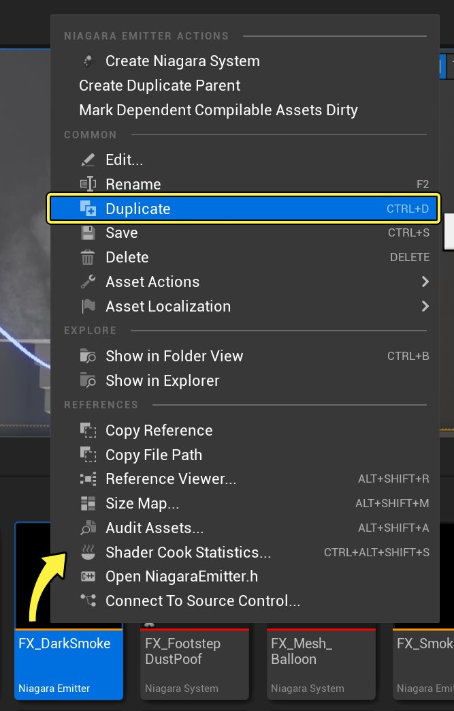
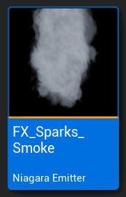
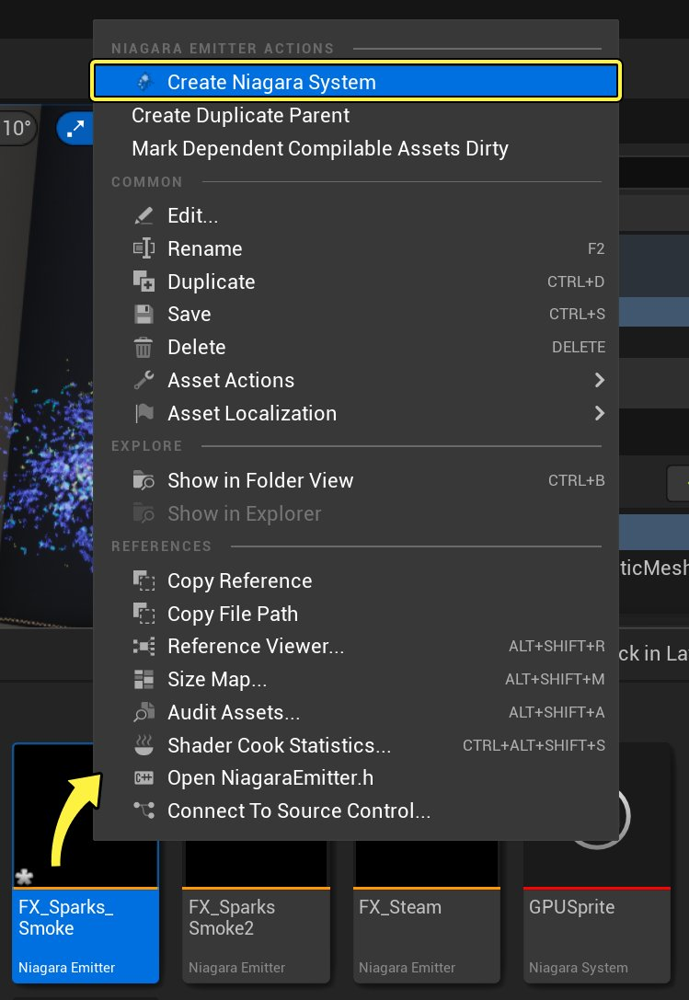
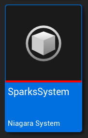
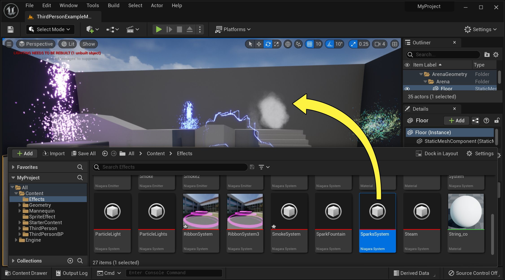
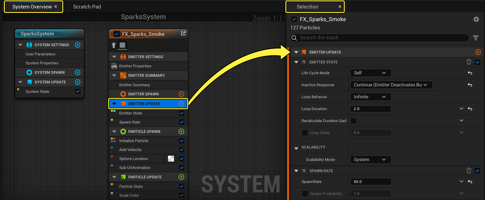
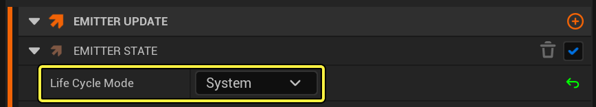
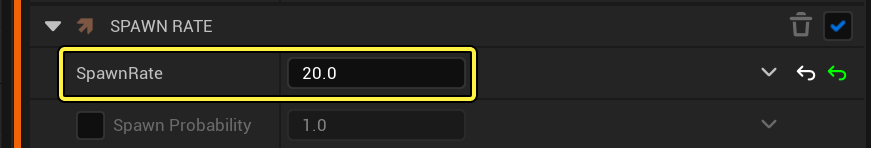

# 火花效果

> 路径：虚幻引擎5.7文档 / 创建视觉效果 / Niagara教程 / 火花效果

> 原始页面：https://dev.epicgames.com/documentation/unreal-engine/how-to-create-a-sparks-effect-in-niagara-for-unreal-engine

> [!NOTE]
> **先决条件步骤：**
>
> 本教程将使用 **M_smoke_subUV**、**M_Spark** 和 **M_Radial_Gradient**材质，它们包含在初学者内容包中。如你尚未将初学者内容添加到项目，请务必进行添加。本教程同时使用[在Niagara中创建Sprite粒子效果](../how-to-create-a-smoke-effect-using-sprite-parti-b357db79/index.md)教程中创建的FX_Smoke发射器。

若要重新创建初学者内容包中包含的火花效果，你需要制作三个Niagara发射器：一个用于火花喷泉，一个用于中心火花，一个用于火花喷泉中冒出的一小股烟雾。因为你可以使用现有发射器的副本创建烟雾发射器，所以你将从该烟雾发射器开始操作。

最终效果如下图所示。

> 动图已省略：火花效果最终结果

因为你可以使用现有发射器的副本创建烟雾发射器，所以你将从该烟雾发射器开始操作。

## 创建烟雾发射器和火花系统

Niagara发射器和系统是独立的。当前推荐工作流将从现有发射器或发射器模板创建系统。

1. 在项目的内容文件夹中，为本教程创建新文件夹。
2. 复制[在Niagara中创建Sprite粒子效果](../how-to-create-a-smoke-effect-using-sprite-parti-b357db79/index.md)教程中创建的 **FX_Smoke** 发射器。

   

   点击查看大图。
3. 将此复制发射器拖放到你在步骤1中创建的文件夹中。在弹出的上下文菜单中，选择 **移动（Move）**。
4. 将复制的发射器重命名为 **FX_Sparks_Smoke**。

   
5. 现在，创建火花效果系统。右键点击新烟雾发射器，然后选择 **创建Niagara系统（Create Niagara System）**。

   

   点击查看大图。

   > [!NOTE]
   > 有多种方法可以创建新Niagara系统。由于你是从已创建发射器着手，所以此处使用的方法会快速创建包含该发射器的系统。但是，正如你在创建Sprite粒子效果教程中所见，发射器和系统向导提供了许多创建和设置Niagara系统的其他选项。
6. 将系统命名为 **SparksSystem**。

   
7. 若尚未打开关卡，请在关卡编辑器中打开。将 **SparksSystem** 从 **内容抽屉（Content Drawer）** 中拖到关卡中。

   > [!NOTE]
   > 制作粒子效果时，最好将系统拖到关卡中。这样便可查看每一项更改并在上下文中进行编辑。你对系统所做的任何更改都将自动传播到关卡中的系统实例。

   

   点击查看大图。

### 烟雾发射器 - 编辑发射器更新设置

1. 在系统概览（System Overview）中，点击 **粒子更新（Particle Update）** 组以在 **选择（Selection）** 面板中打开。

   

   点击查看大图。
2. 打开 **发射器状态（Emitter State）** 模块。此模块控制此发射器的时间和可延展性。点击下拉列表，并将 **生命周期模式（Life Cycle Mode）** 设置为 **系统（System）**。此操作将使系统能够计算生命周期设置，而这通常可以优化性能。在默认情况下，系统以5秒的间隔无限循环。

   

   点击查看大图。
3. 打开 **生成率（Spawn Rate）** 模块。将 **生成率（Spawn Rate）** 改为 **20**。

   

   点击查看大图。

### 烟雾发射器 - 编辑粒子生成设置

下一步，你将编辑粒子生成组中的模块。这些是粒子首次生成时将应用于粒子的行为。

1. 在 **系统概览（System Overview）** 中，点击 **粒子生成（Particle Spawn）** 组以在 **选择（Selection）** 面板中打开。

   > 图片已省略：Select Particle Spawn Group

   点击查看大图。
2. 打开 **初始化粒子（Initialize Particle）** 模块。在 **点属性（Point Attributes）** 下，展开 **生命周期（Lifetime）**。将 **最小值（Minimum）** 和 **最大值（Maximum）** 改为下列值。

   > 图片已省略：Set Particle Lifetime

   点击查看大图。

   | 参数 | 值 |
   | --- | --- |
   | **生命周期模式（Lifetime Mode）** | 随机 |
   | **最小值（Minimum）** | 2.0 |
   | **最大值（Maximum）** | 3.0 |
3. 找到 **颜色（Color）** 参数。将RGB值改为下列值：

   > 图片已省略：Set Particle Color

   点击查看大图。

   | 参数 | 值 |
   | --- | --- |
   | **红色（Red）** | 0.3 |
   | **绿色（Green）** | 0.3 |
   | **蓝色（Blue）** | 0.3 |
4. 在 **Sprite属性（Sprite Attributes）** 下，展开 **Sprite大小（Sprite Size）**。将"Sprite大小模式（Sprite Size Mode）"设置为 **非统一（Non-Uniform）**。将 **最小值（Minimum）** 和 **最大值（Maximum）** 改为下列值。

   > 图片已省略：Set Sprite Size

   点击查看大图。

   | 参数 | 值 |
   | --- | --- |
   | **Sprite大小模式（Sprite Size Mode）** | 随机 一致 |
   | **最小值（Minimum）** | 20.0 |
   | **最大值（Maximum）** | 40.0 |
5. 打开 **添加速度（Add Velocity）** 模块。将速度（Velocity）的 **最小值（Minimum）** 和 **最大值（Maximum）** 改为下列值。

   > 图片已省略：Set Velocity Minimum and Maximum

   点击查看大图。

   | 参数 | 值 |
   | --- | --- |
   | **最小值（Minimum）** | X：0，Y：0，Z：25 |
   | **最大值（Maximum）** | X：1，Y：1，Z：35 |
   |  |  |
6. 打开 **形状位置（Shape Location）** 模块。将 **球体半径（Sphere Radius）** 值改为 **5**。

   > 图片已省略：Set Sphere Radius

   点击查看大图。

### 烟雾发射器 - 编辑粒子更新设置

现在，你将在粒子更新组中更新模块。这些行为将应用于发射器的粒子并更新每一帧。

1. 在 **系统概览（System Overview）** 中，点击 **粒子更新（Particle Update）** 组以在 **选择（Selection）**面板中打开。

   > 图片已省略：Select Particle Update Group

   点击查看大图。
2. 打开 **缩放颜色（Scale Color）** 模块。点击取消选中 **缩放RGB（Scale RGB）** 旁的框。在 **缩放透明度（Scale Alpha）** 曲线上方，点击 **Smooth Ramp Down（平顺下调）** 模板来将形状应用到曲线上。

   > 图片已省略：Set Scale Color

   点击查看大图。
3. 打开 **加速力（Acceleration Force）** 模块。将 **加速（Acceleration ）** 值设为 **X：0，Y：0，Z：20**。

   > 图片已省略：Set Acceleration

   点击查看大图。

到目前为止，你已经配置好了系统中的第一个发射器。它应该和下图相似。

> 动图已省略：配置好的火花效果第一个发射器

## 为系统添加火花迸发发射器

接着，你需要在效果中心创建火花迸发效果。

1. 右键点击SparkFountain系统的 **系统概览（System Overview）**。点击 **添加发射器（Add Emitter）**，现有发射器的列表随即显示。从发射器列表中，选择 **简单Sprite迸发（Simple Sprite Burst）** 模板。

   > 图片已省略：Add Emitter from System Overview

   点击查看大图。
2. 模板发射器的默认名称为 **SimpleSpriteBurst**，但你可以对其重命名。点击发射器名称，该字段将转变为可编辑状态。将新系统命名为 **FX_SparkBurst**。

   > 图片已省略：Rename Emitter

   点击查看大图。

### 火花迸发发射器 - 编辑渲染器设置

虽然 **渲染（Render）** 组是堆栈中的最后一项，但你需要更改材质，以便效果按照预期方式显示。

1. 在 **系统概览（System Overview）** 中，点击 **渲染器（Renderer）** 组以在 **选择（Selection）** 面板中打开。

   > 图片已省略：Select Render Group

   点击查看大图。
2. 在 **Sprite渲染（Sprite Rendering）** 下，点击 **材质（Material）** 下拉框并在初学者内容包中选择 **M_Spark** 材质。

   > 图片已省略：Select Render Group

   点击查看大图。

### 火花迸发发射器 - 编辑发射器更新设置

首先，你将在 **发射器更新（Emitter Update）** 组中编辑模块。这些是将应用于发射器并更新每一帧的行为。

1. 在 **系统概览（System Overview）** 中，点击 **发射器更新（Emitter Update）** 组以在 **选择（Selection）** 面板中打开。

   > 图片已省略：Select Emitter Update Group

   点击查看大图。
2. 点击 **垃圾桶（Trashcan）** 图标移除 **瞬间Sprite迸发（Sprite Burst Instantaneous）** 模块。

   > 图片已省略：Remove Sprite Burst Instantaneous

   点击查看大图。
3. 打开 **发射器状态（Emitter State）** 模块。此模块控制此发射器的时间和可延展性。由于你使用了简单Sprite迸发模板，因此 **生命周期模式（Life Cycle Mode）** 设置为自身。通常，该模式用于为此特定发射器完全定制发射器生命周期逻辑，但此效果并不需要它。点击下拉列表，并将 **生命周期模式（Life Cycle Mode）** 设置为 **系统（System）**。此操作将使系统能够计算生命周期设置，而这通常可以优化性能。在默认情况下，系统以5秒的间隔无限循环。

   > 图片已省略：Set Life Cycle Mode

   点击查看大图。
4. 点击粒子更新（Emitter Update）的 **加号** (**+**)，然后选择 **生成（Spawning）> 生成率（Spawn Rate）**。

   > 图片已省略：Add Spawn Rate Module

   点击查看大图。
5. 打开 **生成率（Spawn Rate）** 模块。将 **生成率（Spawn Rate）** 设为 **50**.

   > 图片已省略：Set Spawn Rate

   点击查看大图。

### 火花迸发发射器 - 编辑粒子生成设置

下一步，你将在 **粒子生成（Particle Spawn）** 组中编辑模块。这些是粒子首次生成时将应用的效果。

1. 在 **系统概览（System Overview）** 中，点击 **粒子生成（Particle Spawn）** 组以在 **选择（Selection）** 面板中打开。

   > 图片已省略：Select Particle Spawn Group

   点击查看大图。
2. 在 **点属性（Point Attributes）** 下，将粒子 **生命周期（Lifetime）** 设为 **.2**。

   > 图片已省略：Set Particle Lifetime

   点击查看大图。
3. 将 **质量模式（Mass Mode）** 设置为 **随机（Random）**，将质量的 **最小值（Minimum）** 和 **最大值（Maximum）** 设为下列值：

   > 图片已省略：Set Mass Min and Max

   点击查看大图。

   | 参数 | 值 |
   | --- | --- |
   | **质量模式（Mass Mode）** | 随机（Random） |
   | **最小值（Minimum）** | 0.6 |
   | **最大值（Maximum）** | 1.0 |
4. 在 **Sprite属性（Sprite Attributes）** 下，展开 **Sprite大小（Sprite Size）**。将 **Sprite大小模式（Sprite Size Mode）** 设置成 **随机非同一（Random Non-Uniform）**。将"Sprite大小（Sprite Size）"的 **最小值（Minimum）** 和 **最大值（Maximum）** 设为下列值：

   > 图片已省略：Set Sprite Size

   点击查看大图。

   | Sprite 大小 | 最小值 | 最大值 |
   | --- | --- | --- |
   | **X** | 10.0 | 30.0 |
   | **Y** | 10.0 | 25.0 |
5. 点击 **Sprite旋转（Sprite Rotation）** 旁的复选框，启用该选项。将 **Sprite旋转模式（Sprite Rotation Mode）** 设置成 **直角（度）（Direct Angle (Degrees)）**。点击值字段旁边的下拉框，并选择 **动态输入（Dynamic Inputs）> 随机范围浮点（Random Ranged Float）**。

   > 图片已省略：Set Rotation to Random Range Float

   点击查看大图。
6. 将 **最小值**（Minimum）和 **最大值**（Maximum）设为下列值：

   > 图片已省略：Set Sprite Size Min and Max

   点击查看大图。

   | 参数 | 值 |
   | --- | --- |
   | **最小值（Minimum）** | -10 |
   | **最大值（Maximum）** | 30 |
7. 点击粒子生成（Particle Spawn）的 **加号** (**+**)，然后选择 **生成（Spawning）> 添加速度（Add Velocity）**。

   > 图片已省略：Add the Add Velocity Module

   点击查看大图。
8. 打开 **添加速度（Add Velocity）** 模块。点击值旁边的下拉框，并选择 **动态输入（Dynamic Inputs）> 随机范围向量（Random Ranged Vector）**。

   > 图片已省略：Set Velocity to Random Ranged Vector

   点击查看大图。
9. 将速度的 **最小值（Minimum）** 和 **最大值（Maximum）** 设为下列值：

   > 图片已省略：Set Velocity Min and Max

   点击查看大图。

   | 速度 | 最小值 | 最大值 |
   | --- | --- | --- |
   | **X** | 0.0 | 5.0 |
   | **Y** | 0.0 | 5.0 |
   | **Z** | 0.0 | 5.0 |
10. 点击粒子生成（Particle Spawn）的 **加号** (**+**)，然后选择 **位置（Location）> 形状位置（Shape Location）**。

    > 图片已省略：Add Shape Location Module

    点击查看大图。
11. 打开 **形状位置（Shape Location）** 模块。将 **球体半径（Sphere Radius）** 设为 **5**。

    > 图片已省略：Set Sphere Radius

    点击查看大图。

### 火花迸发发射器 - 编辑粒子更新设置

现在，你将在 **粒子更新（Particle Update）** 组中编辑模块。这些行为将应用于发射器的粒子并更新每一帧。

1. 在系统概览（System Overview）中，点击 **粒子更新（Particle Update）** 组以在 **选择（Selection）** 面板中打开。

   > 图片已省略：Select Particle Update Group

   点击查看大图。
2. 打开 **缩放色阶（Scale Color）** 模块。对于 **缩放RGB（Scale RGB）**，将 **RGB** 值设置如下。在 **缩放Alpha（Scale Alpha）** 下，选择 **平顺下调（Smooth Ramp Down）** 模板。

   > 图片已省略：Set Scale Color RGB and Alpha

   点击查看大图。

   | 颜色 | 数值 |
   | --- | --- |
   | **R** | 2.0 |
   | **G** | 6.0 |
   | **B** | 25.0 |
3. 点击粒子更新（Particle Update）的 **加号** (**+**)，然后选择 **大小（Size）> Sprite尺寸缩放（Sprite Size Scale）**。还可在搜索栏中键入"scale"，如下所示。

   > 图片已省略：Add Scale Sprite Size Module

   点击查看大图。
4. 打开 **Sprite大小缩放（Sprite Size Scale）** 模块。点击 **缩放因子（Scale Factor）** 值字段旁边的下拉框，并选择 **动态输入（Dynamic Inputs）> 随机范围向量2D（Random Ranged Vector 2D）**。还可在搜索栏中键入 `random`，如下所示。

   > 图片已省略：Set Sprite Size to Random Range Vector 2D

   点击查看大图。
5. 将缩放因子的 **最小值（Minimum）** 和 **最大值（Maximum）** 设为下列值：

   > 图片已省略：Set Scale Factor Min and Max

   点击查看大图。

   | 缩放 | 最小值 | 最大值 |
   | --- | --- | --- |
   | **X** | 1.0 | 3.5 |
   | **Y** | 2.5 | 5.0 |

到目前为止，你已经配置好了系统中的第二个发射器。它应该和下图相似。

> 动图已省略：Sparks Effect Second Emitter Configured

## 添加弧度火花发射器到系统

1. 右键点击SparkFountain系统的 **系统概览（System Overview）**。点击 **添加发射器（Add Emitter）**，现有发射器的列表随即显示。从发射器列表中，选择 **简单Sprite迸发（Simple Sprite Burst）** 模板。

   > 图片已省略：Add Emitter from System Overview

   点击查看大图。
2. 模板发射器的默认名称为 **SimpleSpriteBurst**，但你可以对其重命名。点击发射器名称，该字段将转变为可编辑状态。将新系统命名为 **FX_Sparks_Radial**。

   > 图片已省略：Rename Emitter

   点击查看大图。

### 弧度火花发射器 - 编辑渲染器设置

虽然 **渲染（Render）** 组是堆栈中的最后一项，但你需要更改材质，以便效果按照预期方式显示。

1. 在 **系统概览（System Overview）** 中，点击 **渲染器（Renderer）** 组以在 **选择（Selection）** 面板中打开。

   > 图片已省略：Select Render Group

   点击查看大图。
2. 点击 **材质（Material）** 下拉框并从初学者内容包中选择 ***M_Radial_Gradient** 材质。在搜索栏中输入 `radial` 来找到它，如下图所示。

   > 图片已省略：Select Render Material

   点击查看大图。
3. 点击 **对齐（Alignment）** 下拉列表，然后选择 **速度对齐（Velocity Aligned）**。

   > 图片已省略：Set Alignment

   点击查看大图。

### 弧度火花发射器 - 编辑发射器更新设置

首先，你将在 **发射器更新（Emitter Update）** 组中编辑模块。这些是将应用于发射器并更新每一帧的行为。

1. 在 **系统概览（System Overview）** 中，点击 **粒子更新（Particle Update）** 组以在 **选择（Selection）** 面板中打开。

   > 图片已省略：Select Emitter Update Group

   点击查看大图。
2. 点击 **垃圾桶** 图标，以移除 **Sprite即时迸发（Sprite Burst Instantaneous）** 模块。

   > 图片已省略：Remove Sprite Burst Instantaneous

   点击查看大图。
3. 打开 **发射器状态（Emitter State）** 模块。此模块控制此发射器的时间和可延展性。由于你使用了 **简单Sprite迸发（Simple Sprite Burst）** 模板，因此 **生命周期模式（Life Cycle Mode）** 设置为 **自身（Self）**。通常，该模式用于为此特定发射器完全定制发射器生命周期逻辑，但此效果并不需要它。点击下拉列表，并将 **生命周期模式（Life Cycle Mode）** 设置为 **系统（System）**。此操作将使系统能够计算生命周期设置，而这通常可以优化性能。在默认情况下，系统以5秒的间隔无限循环。

   > 图片已省略：Set Life Cycle Mode

   点击查看大图。
4. 点击 **粒子更新（Particle Update）** 的 **加号（Plus sign）** 图标（**+**），然后选择 **生成 > 生成率（Spawning > Spawn Rate）**。

   > 图片已省略：Add Spawn Rate Module

   点击查看大图。
5. 打开 **生成速率（Spawn Rate）** 模块。将 **生成速率（Spawn Rate）** 设置为 **500**。

   > 图片已省略：Set Spawn Rate

   点击查看大图。

### 弧度火花发射器 - 编辑粒子生成设置

下一步，你将在 **粒子生成（Particle Spawn）** 组中编辑模块。这些是粒子首次生成时将应用于粒子的行为。

1. 在系统概览（System Overview）中，点击 **粒子生成（Particle Spawn）** 组以在 **选择（Selection）** 面板中打开。

   > 图片已省略：Select Particle Spawn Group

   点击查看大图。
2. 打开 **初始化粒子（Initialize Particle）** 模块。在 **点属性（Point Attributes）** 下，展开 **生命周期（Lifetime）**。将生命周期（Lifetime）的模式设置为 **随机（Random）**，将 **最小值**（ Minimum）和 **最大值**（Maximum）设为下列值：

   > 图片已省略：Set Lifetime Min and Max

   点击查看大图。

   | 参数 | 值 |
   | --- | --- |
   | **生命周期模式（Lifetime Mode）** | Random |
   | **最小值（Minimum）** | 0.2 |
   | **最大值（Maximum）** | 0.7 |
3. 展开 **颜色（Color）**。将 **颜色模式（Color Mode）** 设置为 **直接设置（Direct Set）**，将RGB值设为下列值：

   > 图片已省略：Set Color

   点击查看大图。

   | 参数 | 值 |
   | --- | --- |
   | **红色（Red）** | 2.0 |
   | **绿色（Green）** | 8.0 |
   | **蓝色（Blue）** | 20.0 |
   | **Alpha** | 1.0 |
4. 展开 **质量（Mass）**。将 **质量模式（Mass Mode）** 设置为 **随机（Random）**，将 **最小值**（Minimum）和 **最大值**（Maximum）设为下列值：

   > 图片已省略：Set Mass Min and Max

   点击查看大图。

   | 参数 | 值 |
   | --- | --- |
   | **质量模式（Mass Mode）** | 随机 |
   | **最小值（Minimum）** | 0.3 |
   | **最大值（Maximum）** | 0.6 |
5. 在 **Sprite属性（Sprite Attributes）** 下，将 **Sprite大小模式（Sprite Size Mode）** 设置为 **非统一（Non-Uniform）**。设置以下值：**X：0.25，Y：0.5**。

   > 图片已省略：Set Sprite Size

   点击查看大图。
6. 将 **Sprite旋转模式（Sprite Rotation Mode）** 和 **Sprite UV模式（Sprite UV Mode）** 保留为 **未设置（Unset）**。
7. 点击 **粒子生成（Particle Spawn）** 的 **加号（Plus sign）** 图标（**+**），然后选择 **质量 > 按质量计算尺寸和旋转惯性（Mass > Calculate Size and Rotational Inertia by Mass）**。你也可以在搜索栏中输入 `calc`，如下所示。

   > 图片已省略：Add Calculate Size and Rotational Inertia by Mass

   点击查看大图。
8. 打开 **按质量计算尺寸和旋转惯性（Calculate Size and Rotational Inertia by Mass）** 模块。在 **密度（Density）** 下，将 **按材质类型划分的密度（Density by Material Type）** 设置为 **水（Water）**。

   > 图片已省略：Set Density

   点击查看大图。
9. 在 **比例（Proportions）** 下，将 **高度（Height）** 更改为 **0.5**，**深度（Depth）** 更改为 **0.0**。

   > 图片已省略：Set Proportions

   点击查看大图。
10. 点击 **粒子生成（Particle Spawn）** 的 **加号（Plus sign）** 图标（**+**），然后选择 **速度 > 添加速度（Velocity > Add Velocity）**。你也可以在搜索栏中输入 `velocity`。

    > 图片已省略：Add the Add Velocity Module

    点击查看大图。
11. 打开 **添加速度（Add Velocity）** 模块。点击下拉菜单，选择 **动态输入（Dynamic Inputs）** 然后选择 **随机范围向量（Random Range Vector）**。

    > 图片已省略：Set Velocity to Random Range Vector

    点击查看大图。

    1. 将速度的

       最大值（Minimum）

       和

       最小值（Maximum）

       设为以下值。

    > 图片已省略：Set Velocity Min and Max

    点击查看大图。

    | 速度 | 最小值 | 最大值 |
    | --- | --- | --- |
    | **X** | -100.0 | 90.0 |
    | **Y** | -100.0 | 90.0 |
    | **Z** | 300.0 | 500.0 |
12. 点击 **粒子生成（Particle Spawn）** 的 **加号（Plus sign）** 图标（**+**），然后选择 **位置（Location）> 形状位置（Shape Location）**。你也可以在搜索栏中输入 `sphere` 。

    > 图片已省略：Add Shape Location

    点击查看大图。
13. 打开 **形状位置（Shape Location）** 模块。将 **球体半径（Sphere Radius）** 设置为 **2.0**。

    > 图片已省略：Set Sphere Radius

    点击查看大图。

### 弧度火花发射器 - 编辑粒子更新设置

现在，你将在 **粒子更新（Particle Update）** 组中编辑模块。这些行为将应用于发射器的粒子并更新每一帧。

1. 在 **系统概览（System Overview）** 中，点击 **粒子更新（Particle Update）** 组，以在 **选择（Selection）** 面板中将其打开。

   > 图片已省略：Select Particle Update Group

   点击查看大图。
2. 点击 **粒子更新（Particle Update）** 的 **加号** 图标（**+**），然后选择 **速度（Velocity） > 缩放速度（Scale Velocity）**。

   > 图片已省略：Add Scale Velocity

   点击查看大图。
3. 将 **缩放速度（Scale Velocity）** 调整为 **X: 3.0, Y: 4.0, Z: 1.0**.

   > 图片已省略：Set Scale Velocity

   点击查看大图。
4. 点击 **粒子更新（Particle Update）** 的 **加号** 图标（**+**），然后选择 **力（Forces） > 重力（Gravity Force）**。

   > 图片已省略：Add Gravity Force Module

   点击查看大图。
5. 打开 **重力（Gravity Force）** 模块。将 **Z** 值更改为 **-4500**。

   > 图片已省略：Set Gravity Values

   点击查看大图。

   1. 点击

      粒子更新（Particle Update）

      的

      加号

      图标（

      +

      ），然后选择

      力（Forces）> 阻力（Drag）

      。

   > 图片已省略：Add Drag Module

   点击查看大图。
6. 打开 **阻力（Drag）** 模块，将 **阻力（Drag）** 值设置为 **1.7**。

   > 图片已省略：Set Drag

   点击查看大图。
7. 点击 **粒子更新（Particle Update）** 的 **加号** (**+**) 并选择 **碰撞（Collision）> 碰撞（Collision）**。该模组可以保证所有火花能够撞击到地板之类的物体并且弹起。

   > 图片已省略：Add Collision Module

   点击查看大图。
8. 打开 **碰撞（Collision）** 模块。在 **反射（Bounce）** 中，将 **恢复力（Restitution）** 值设置为 **0.4**。

   > 图片已省略：Set Collision Restitution

   点击查看大图。
9. 在 **摩擦力（Friction）** 中，将 **摩擦力（Friction）** 值设置为 **0.2**。

   > 图片已省略：Set Collision Friction

   点击查看大图。
10. 点击 **垃圾桶（Trashcan）** 图标，以移除 **缩放色阶（Scale Color）** 模块。

    > 图片已省略：Remove Scale Color Module

    点击查看大图。
11. 点击 **加号** （**+**），然后选择 **大小 （Size）> 按速度缩放Sprite大小（Scale Sprite Size by Speed）**。

    > 图片已省略：Add Scale Sprite Size by Speed

    点击查看大图。
12. 打开 **按速度Sprite大小缩放（Sprite Size Scale by Speed）** 模块。将 **比例因子（Scale Factor）** 的最小值（Minimum）和最大值（Maximum）设置如下：

    > 图片已省略：Set Scale Factor Min and Max

    点击查看大图。

    | 按速度Sprite大小缩放 | 最小值 | 最大值 |
    | --- | --- | --- |
    | **X** | 0 | 0.5 |
    | **Y** | 3 | 6 |
13. 将 **速度阈值（Velocity Threshold）** 值设为 **2000**。

    > 图片已省略：Set Velocity Threshold

    点击查看大图。

## 最终结果

祝贺你！在完成上述步骤后，火花效果就制作完成了。你可以回到自己的关卡中查看最终结果，并且根据需求进行微调。

> 动图已省略：火花效果最终结果
