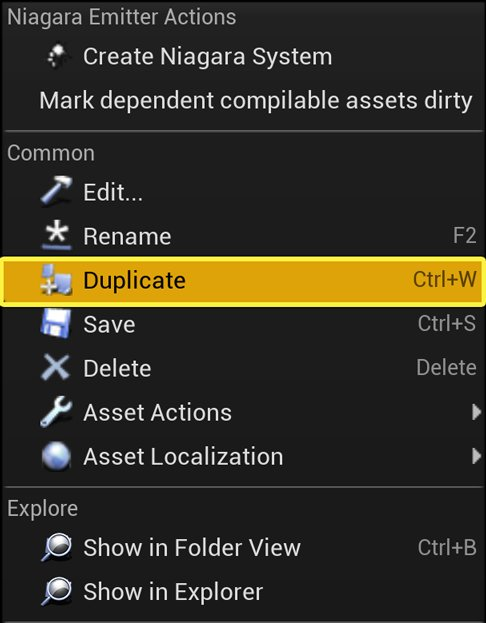
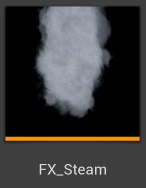
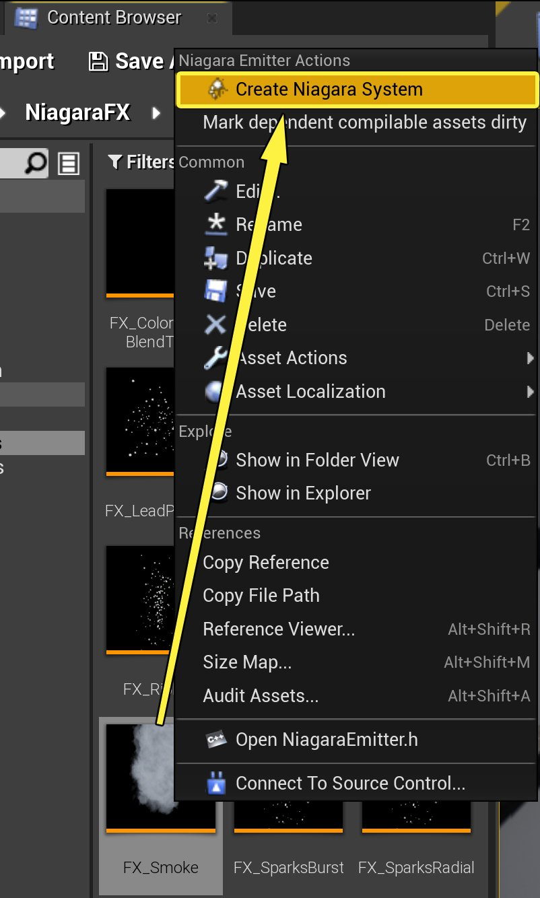
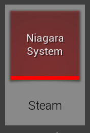
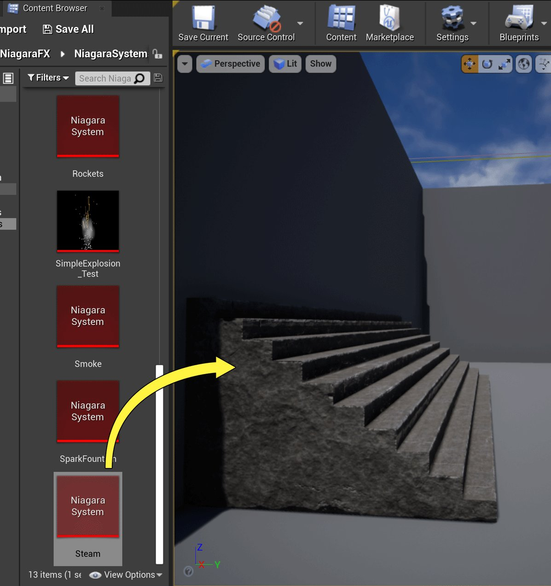
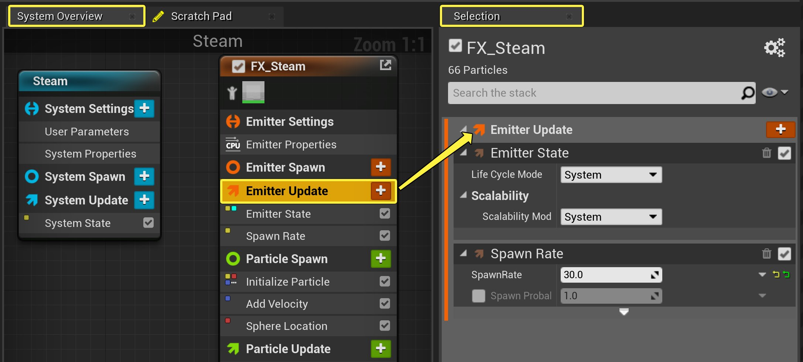
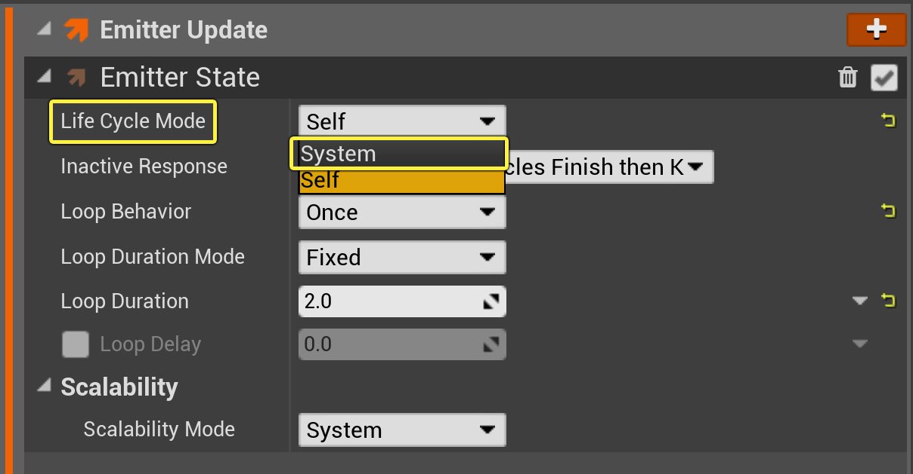
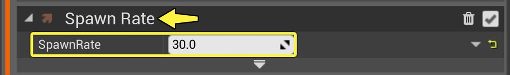

# 蒸汽效果

> 路径：虚幻引擎5.7文档 / 创建视觉效果 / Niagara教程 / 蒸汽效果

> 原始页面：https://dev.epicgames.com/documentation/unreal-engine/how-to-create-a-steam-effect-in-niagara-for-unreal-engine

> [!NOTE]
> **准备工作：**
>
> 本教程将使用M_smoke_subUV材质，它包含在初学者内容包中。如尚未将初学者内容添加到项目，请你务必先添加它。本教程同时使用[在Niagara中创建Sprite粒子效果](../how-to-create-a-smoke-effect-using-sprite-parti-b357db79/index.md)教程中创建的FX_Smoke发射器。

## 创建蒸汽发射器

与在Cascade中不同，Niagara发射器和系统是独立的。当前推荐工作流将从现有发射器或发射器模板创建系统。但是，由于你要复制现有发射器，因此过程会稍有不同。

1. 在项目的

   内容（Content）

   文件夹中，为本教程创建文件夹。
2. 通过[在Niagara中创建Sprite粒子效果](../how-to-create-a-beam-effect-in-niagara/index.md)进行操作时，找到保存的FX_Smoke发射器。右键点击发射器，然后选择 **复制发射器（Duplicate Emitter）**。

   

   点击查看大图。
3. 将此复制发射器拖放到你在步骤1中创建的文件夹中。在弹出的上下文菜单中，选择

   移动（Move）

   。
4. 重命名已复制的发射器 **FX_Steam**。

   
5. 现在，创建蒸汽效果系统。右键点击新蒸汽发射器，然后选择 **创建Niagara系统（Create Niagara System）**。

   

   点击查看大图。

   > [!NOTE]
   > 有多种方法可以创建新Niagara系统。由于你是从已创建发射器着手，所以此处使用的方法会快速创建包含该发射器的系统。但是，正如你在创建Sprite粒子效果教程中所见，发射器和系统向导提供了许多创建和设置Niagara系统的其他选项。
6. 将系统命名为 **蒸汽（Steam）**。

   
7. 若尚未打开关卡，请在关卡编辑器中打开。将蒸汽系统拖到关卡中。

   

   点击查看大图。

   > [!NOTE]
   > 制作粒子效果时，最好将系统拖到关卡中。这样便可查看每一项更改并在上下文中进行编辑。你对系统所做的任何更改都将自动传播到关卡中的系统实例。

## 编辑发射器更新设置

首先，你将在 **发射器更新（Emitter Update）** 组中编辑模块。这些是将应用于发射器本身并更新每一帧的行为。

1. 在 **系统概览（System Overview）** 中，点击 **发射器更新（Emitter Update）** 组以在 **选择（Selection）** 面板中打开。

   

   点击查看大图。
2. 展开 **发射器状态（Emitter State）** 模块。此模块控制此发射器的时间和可延展性。由于你使用了简单Sprite迸发模板，因此 **生命周期模式（Life Cycle Mode）** 设置为 **自身（Self）**。通常，该模式用于为此特定发射器完全定制发射器生命周期逻辑，但此效果并不需要它。单击下拉列表，并将 **生命周期模式（Life Cycle Mode）** 设置为 **系统（System）**。此操作将使系统能够计算生命周期设置，而这通常可以优化性能。在默认情况下，系统以5秒的间隔无限循环。

   

   点击查看大图。
3. 打开 **生成速率（Spawn Rate）** 模块。将 **生成速率（Spawn Rate）** 改为 **30**。

   

   点击查看大图。

## 编辑粒子生成设置

下一步，你将在 **粒子生成（Particle Spawn）** 组中编辑模块。这些是粒子首次生成时将应用于粒子的行为。

1. 在系统概览（System Overview）中，点击 **粒子生成（Particle Spawn）** 组以在 **选择（Selection）** 面板中打开。

   > 图片已省略：Open Particle Spawn

   点击查看大图。
2. 打开 **初始化粒子（Initialize Particle）** 模块。在 **点属性（Point Attributes）** 下，展开 **生命周期（Lifetime）**。将最小值和最大值改为下列值：

   > 图片已省略：Set Particle Lifetime

   点击查看大图。

   | 参数 | 值 |
   | --- | --- |
   | **最小值（Minimum）** | 3.0 |
   | **最大值（Maximum）** | 7.0 |
   |  |  |
3. 展开 **颜色（Color）**。将RGB值改为下列值：

   > 图片已省略：Set Color

   点击查看大图。

   | 参数 | 值 |
   | --- | --- |
   | **红色（Red）** | 1.0 |
   | **绿色（Green）** | 1.0 |
   | **蓝色（Blue）** | 1.0 |
   |  |  |
4. 在 **Sprite属性（Sprite Attributes）** 下，展开 **Sprite大小（Sprite Size）**。将 **最小值(Minimum)** 和 **最大值(Maximum)** 改为下列值：

   > 图片已省略：Set Sprite Size

   点击查看大图。

   | 参数 | 值 |
   | --- | --- |
   | **最小值（Minimum）** | 100 |
   | **最大值（Maximum）** | 200 |
   |  |  |
5. 打开 **添加速度（Add Velocity）** 模块。将 **最小值(Minimum)** 和 **最大值(Maximum)** 改为下列值：

   > 图片已省略：Set Velocity Minimum and Maximum

   点击查看大图。

   | 参数 | 值 |
   | --- | --- |
   | **最小值（Minimum）** | X：16，Y：-5.0，Z：35 |
   | **最大值（Maximum）** | X：32，Y：5.0，Z：50 |
   |  |  |
6. 打开 **球体位置（Sphere Location）** 模块。将 **球体半径（Sphere Radius）** 值改为 **20**。

   > 图片已省略：Set Sphere Radius

   点击查看大图。

## 编辑粒子更新设置

现在，你将在 **粒子更新（Particle Update）** 组中编辑模块。此类行为将应用于粒子并更新每个帧。

1. 在系统概览（System Overview）中，点击 **粒子更新（Particle Update）** 组以在 **选择(Selection)** 面板中打开。

   > 图片已省略：Open Particle Update

   点击查看大图。
2. 打开 **加速力（Acceleration Force）** 模块。将 **最小值** 和 **最大值** 设为下列值：

   > 图片已省略：Set Acceleration Minimum and Maximum

   点击查看大图。

   | 参数 | 值 |
   | --- | --- |
   | **最小值（Minimum）** | X：25，Y：-10.0，Z：15 |
   | **最大值（Maximum）** | X：55，Y：10.0，Z:25 |
   |  |  |
3. 打开 **缩放颜色（Scale Color）** 模块。通过右键点击 **缩放透明度（Scale Alpha）** 曲线并选择 **将键添加到曲线（Add Key to Curve）** 来向该曲线添加另外三个键。因此总共有五个键。

   > 图片已省略：Add Keys to Curve

   点击查看大图。
4. 从左开始，将五个键分别设为下列值：

   > 图片已省略：Set Scale Alpha Keys

   点击查看大图。

   | 键编号 | 时间 | 值 |
   | --- | --- | --- |
   | **1** | 0.0 | 0.0 |
   | **2** | .16 | .84 |
   | **3** | .32 | .68 |
   | **4** | .76 | .11 |
   | **5** | 1.0 | 0.0 |
   |  |  |  |
5. 点击 **粒子更新（Particle Update）** 组中的 **加号** (**+**)，然后选择 **力（Forces）> 阻力（Drag）** 以添加 **阻力（Drag）** 模块。将 **阻力（Drag）** 设为 **8**。

   > 图片已省略：Add Drag Module

   点击查看大图。
6. 由于Niagara将新模块添加到组堆栈底部，因此你会收到一条显示"模块有未满足的依赖关系（The module has unmet dependencies）"的错误消息。这是因为 **阻力（Drag）** 模块放置在 **解算力和速度（Solve Forces and Velocity）** 模块之后。单击 **修复问题（Fix Issue）** 按钮，以移动模块并解决错误。

   > 图片已省略：Position Error Click Fix Issue

   点击查看大图。
7. 将 **阻力（Drag）** 设置为 **.8**。

   > 图片已省略：Set Drag

   点击查看大图。

## 最终结果

完成上述步骤后，Steam系统将在关卡中产生类似下图的蒸汽效果。
