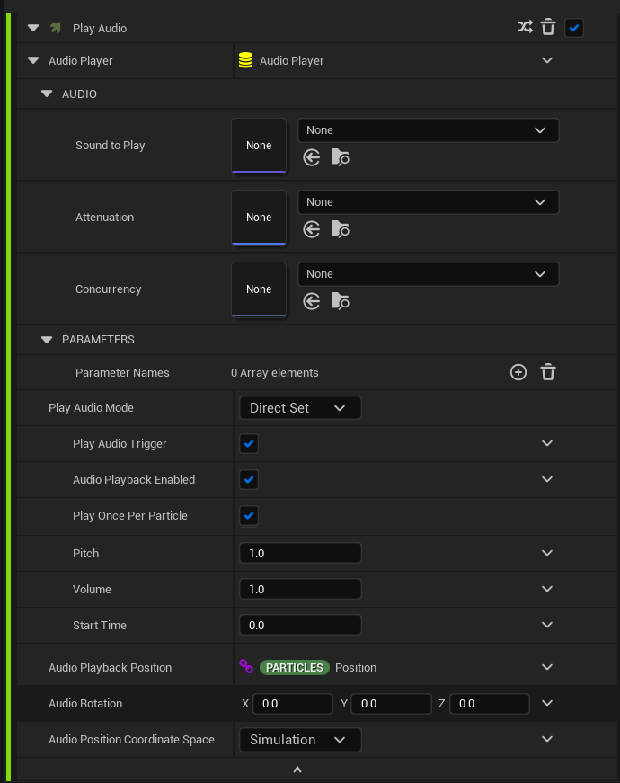
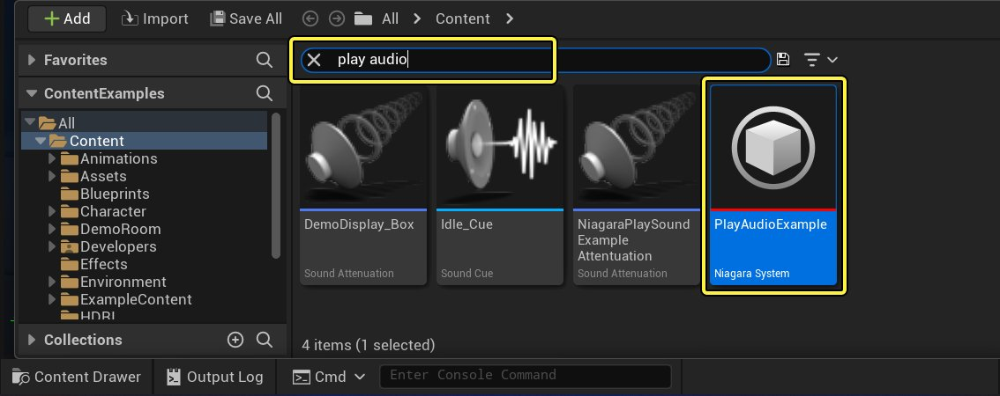
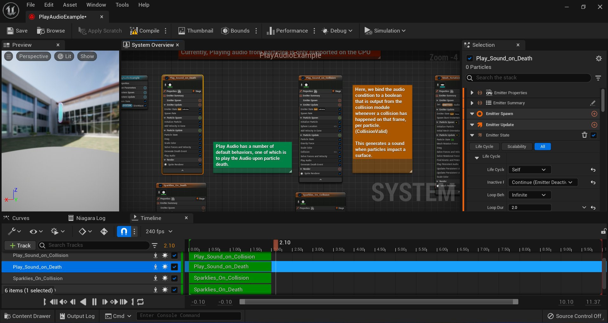
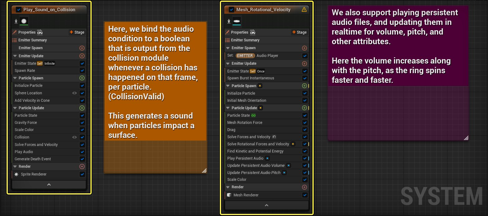
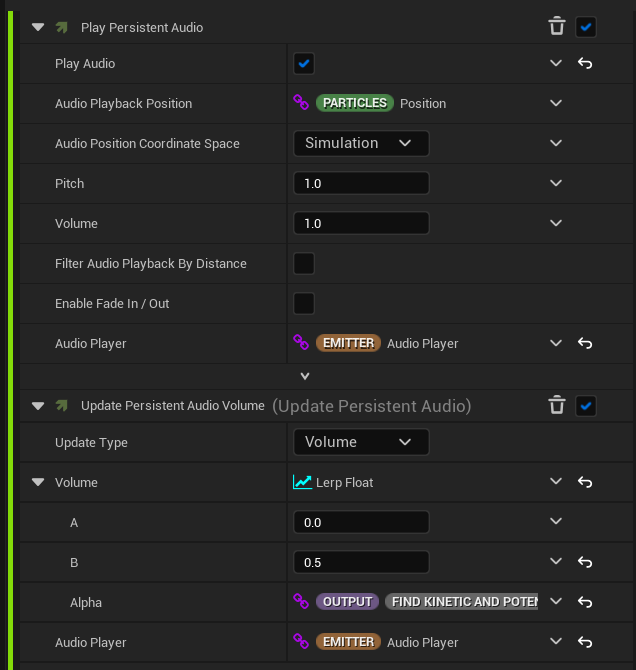
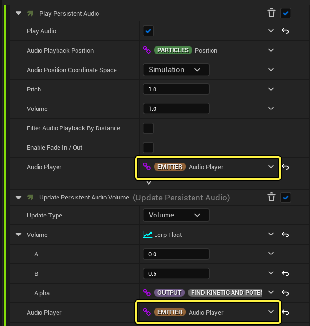
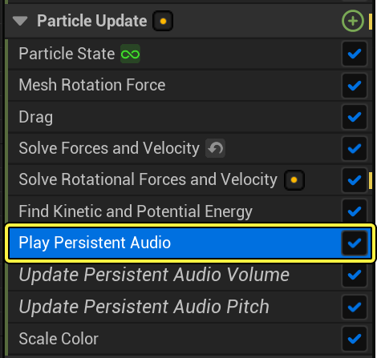
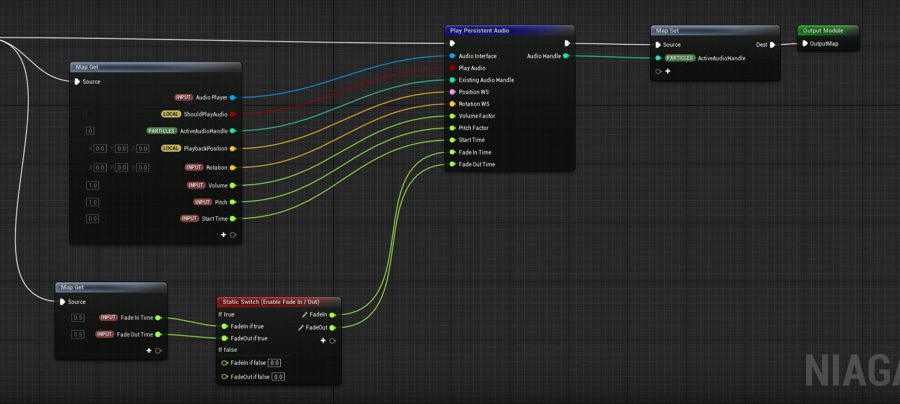

# 音效

> 路径：虚幻引擎5.7文档 / 创建视觉效果 / Niagara教程 / 音效

> 原始页面：https://dev.epicgames.com/documentation/unreal-engine/how-to-create-audio-effects-in-niagara-for-unreal-engine

音效是你想在Niagara模拟中播放的一些声音。例如，当粒子模拟与某物碰撞时，就会播放声音。在Niagara系统中有多种方法可以实现这一点。

每种方法都有自己的优缺点。以下是每种方法的简要概述。

> [!NOTE]
> 你可以在[内容示例项目](https://www.fab.com/listings/4d251261-d98c-48e2-baee-8f4e47c67091)中找到这些方法的示例： **Epic Games启动程序：虚幻引擎 > 学习 > 引擎功能示例 > 内容示例（Epic Games Launcher: Unreal Engine > Learn > Engine Feature Samples > Content Examples）**。

## 使用播放音频模块

对于一次性音效（one-shot sound effect）， **播放音频（Play Audio）** 模块是从Niagara播放音效的最简单方法。它适用于事件驱动型效果，例如对颗粒碰撞做出的反应。就内存使用而言，这也是最经济实惠的解决方案。

1. 将 **播放音频（Play Audio）** 模块添加到你的发射器。你可以将其添加到粒子更新（Particle Update）组，以便将此模块进行粒子年龄求值。

   

   点击查看大图。
2. 在 **要播放的声音（Sound to Play）** 中，从下拉列表选择声音。如果你打开了内容示例项目，则已经向该项目添加了一些声音。
3. 设置 **播放音频（Play Audio）** 条件。

   这将使用音高、音量等配置值来触发一次性的效果。音效一旦触发就无法更改或停止，并且即使颗粒模拟停止，音效也会继续播放。

   | 播放音频模块 |  |
   | --- | --- |
   | **优点（Pros）** | **缺点（Cons）** |
   | * 性能最高的解决方案（无论从内存还是CPU使用率来看） | * 声音开始播放之后，声音属性固定不变，例如音量或音高 |
   | * 最容易设置 | * 声音无法随着颗粒的移动来持续更新其位置 |

### 音频模块示例

1. 下载[内容示例项目](https://www.fab.com/listings/4d251261-d98c-48e2-baee-8f4e47c67091)，然后打开它。
2. 在内容侧滑菜单（Content Drawer）中，搜索 **播放音频（Play Audio）**。

   

   点击查看大图。
3. 双击 **播放音频示例（PlayAudio Example）**，打开 **Niagara系统（Niagara System）** 示例。

   

   点击查看大图。
4. 此项目中有不同类型的音频示例。你会发现一个名为 **Play_Sound_On_Collision** 的发射器，它使用 **播放音频（Play Audio）模块**。 名为 **Mesh_Rotational_Velocity** 的发射器采用一种不同的方法，即 **播放永久性音频（Play Persistent Audio）模块**。

   

   点击查看大图。

## 使用播放永久性音频模块

此模块类似于播放音频模块，但保留了对每个已生成音效的引用，因此可以随着时间更新。

点击查看大图。

此模块还支持一些高级功能，例如消退或设置Sound Cue参数。但是，模块的设置比第一种方法复杂一些，因为若要此模块正常工作，需要使用两个模块：**播放永久性音频（Play Persistent Audio）** 和 **更新永久性音频（Update Persistent Audio）**。

> [!NOTE]
> 这两个模块中使用相同的音频播放器引用。

你可以创建音频播放器数据接口，将其作为发射器属性并将其绑定到模块。 在上面的截图中， **Emitter.AudioPlayer** 引用同时存在于这两个模块中。

点击查看大图。

**发射器（EMITTER）** 左侧的锁链符号表示它们正在引用现有的属性。

默认情况下，每个模块都创建自己的对象，且无法与其他模块共享。 如果你希望模块使用相同的对象，则必须在发射器或系统生成脚本中创建该对象，然后在模块中引用它。

要查看播放永久性音频模块的工作方式，请在内容示例文件中，从 **内容侧滑菜单（Content Drawer）** 搜索 **播放音频（Play Audio）** ，然后双击 **播放音频示例（PlayAudio Example）** 将其打开。找到名为 **Mesh_Rotational_Velocity** 的发射器。你会在此发射器上找到名为 **播放永久性音频（Play Persistent Audio）** 的模块。

点击查看大图。

双击 **播放永久性音频（Play Persistent Audio）** ，可以打开 **节点图表（Node Graph）** 。

点击查看大图。

当需要声音属性在模拟期间变化时，此方法很有用，例如当声音需要随着颗粒的位置而变化时。

| **播放永久性音频模块（Play Persistent Audio Module）** |  |
| --- | --- |
| **优点（Pros）** | **缺点（Cons）** |
| * 在运行时更改音量、音高、位置和旋转 | * 设置更复杂 |
| * 设置Sound Cue参数并在模拟停止时结束声音 | * 性能低于播放音频模块 |
| * 根据摄像机距离过滤声音 |  |

## 使用音频组件渲染器

> [!WARNING]
> 音频组件渲染器目前还只是试验性功能。如果你希望体验任何试验性功能，可以在虚幻引擎中使用此模块。

**音频组件渲染器（Audio Component Renderer）** 可以用于生成音频组件。要添加音频组件渲染器，请点击 **渲染（Render）** 组中的 **+号(+)**。

添加好组件渲染器后，在 **所选项（Selection）** 面板中点击 **组件类型（Component Type）** 下拉菜单，然后选择 **音频组件（AudioComponent）**.

> 图片已省略：音频组件渲染器

点击查看大图。

这是一种非常灵活的方法，因为它可以全面控制音频组件，但在颗粒模拟中，你可能需要从播放音频模块重新实施所有功能（例如消退或基于距离的筛选）。此外，它不支持在不创建自定义音频组件子类的情况下设置Sound Cue。

除了模块未提供足够功能按钮的特殊情况以外，不建议使用此组件渲染器。

| **音频组件渲染器（Audio Component Renderer）** |  |
| --- | --- |
| **优点（Pros）** | **缺点（Cons）** |
| * 非常灵活 | * 缺少很多功能 |
| * 提供更全面的音频控制能力 | * 性能较低 |
|  | * 无法设置Sound Cue参数 |

## 将颗粒数据导出到蓝图

如果其他方法都不够灵活，无法满足你的需求，则可以将颗粒数据导出到蓝图或C++，并在其中实施你的音频逻辑。

为实现此目的，请使用 **导出颗粒数据（Export Particle Data）** 接口。要在内容示例项目中查看示例，请在内容侧滑菜单（Content Drawer）中搜索 **导出颗粒（export particle）** 。

> 图片已省略：搜索导出粒子

点击查看大图。

双击 **ExportParticleDataExample** 蓝图，获得关于如何从颗粒模拟中导出数据的详细说明。

> 图片已省略：导出粒子数据示例蓝图

点击查看大图。

导出数据接口的一个优势在于，它还可以用于GPU发射器（有一些额外的延迟）。在蓝图中获得所需数据之后，你不但可以使用这些数据播放音频，还可以驱动任意数量的组件，例如后期处理或用户界面（UI）控件。

虽然这是最灵活的音频播放方式，但其设置最耗时也最复杂。可导出数据量方面也会有一些限制，需要由你自己在音频组件和颗粒数据之间进行任何映射。

| **将颗粒数据导出到蓝图（Export Particle Data to BP）** |  |
| --- | --- |
| **优点（Pros）** | **缺点（Cons）** |
| *最灵活的方法 | * 最慢的性能 |
| * 适用于GPU | * 需要在蓝图逻辑中重新实施所有模块功能 |
|  | * 设置复杂 |
