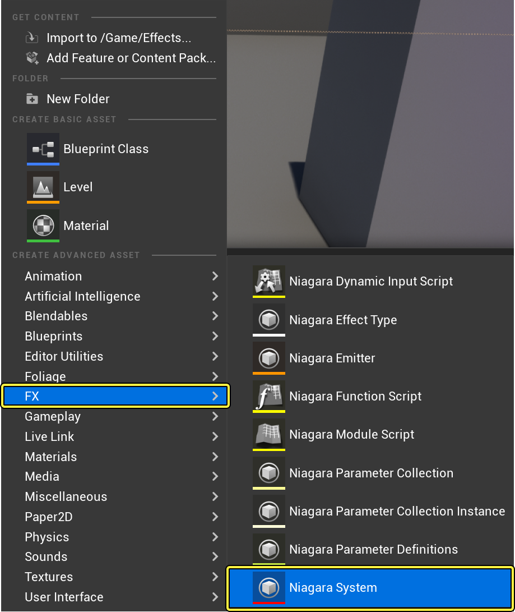
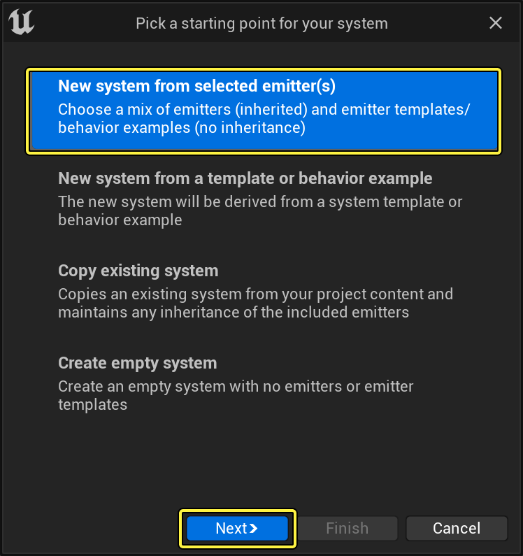
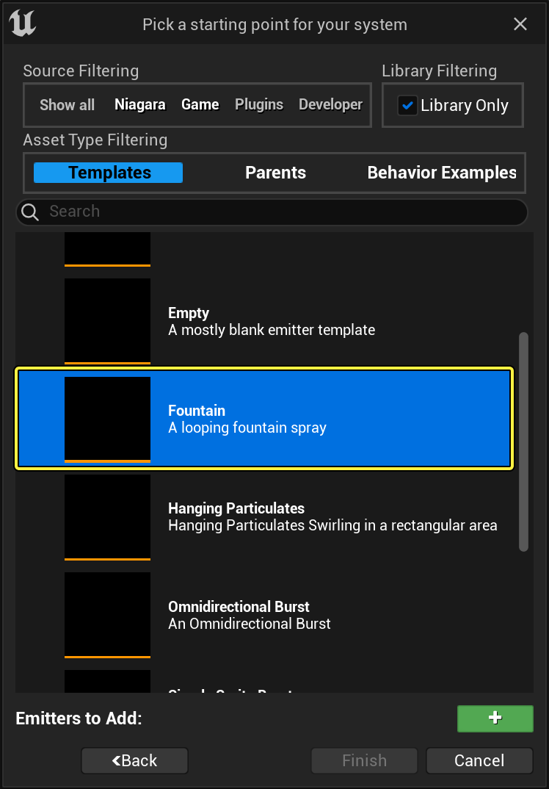
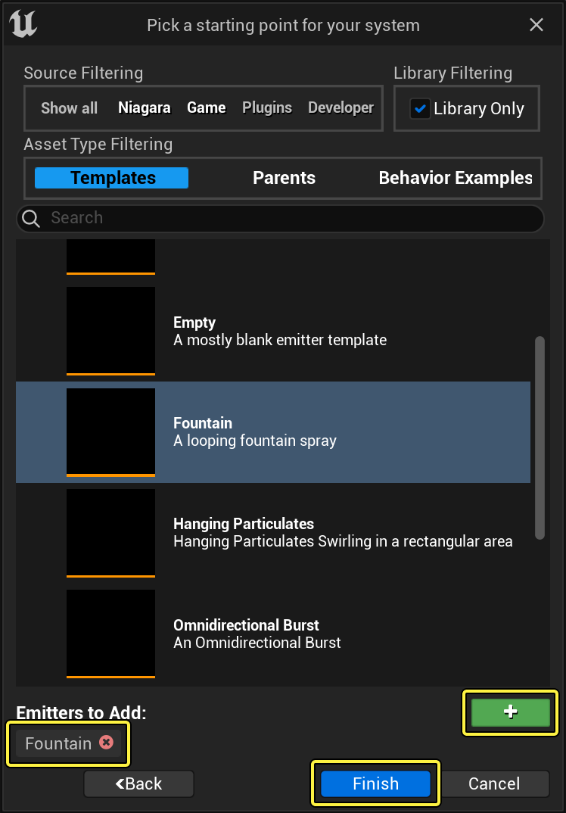
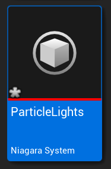
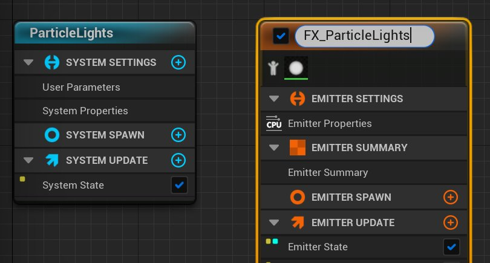
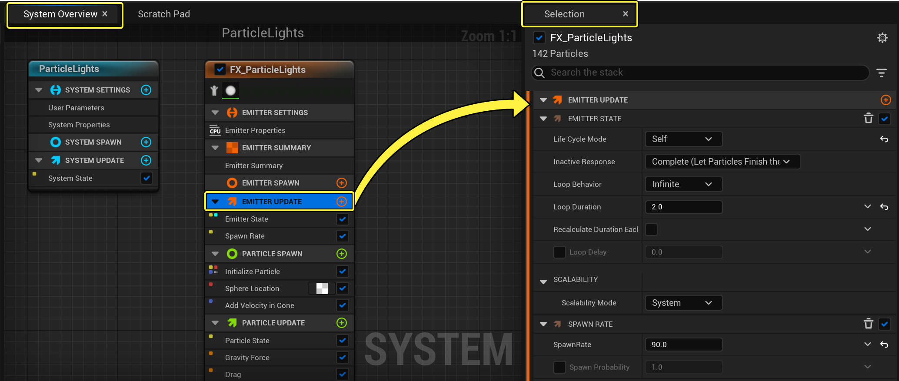
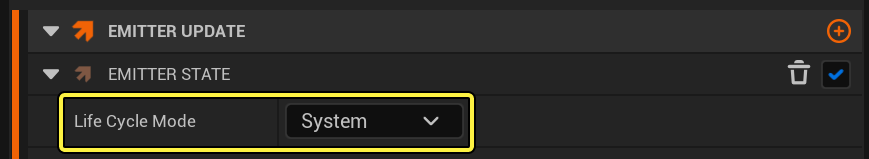

# 粒子光源

> 路径：虚幻引擎5.7文档 / 创建视觉效果 / Niagara教程 / 粒子光源

> 原始页面：https://dev.epicgames.com/documentation/unreal-engine/how-to-create-particle-effects-that-emit-light-in-niagara-for-unreal-engine

如果能让粒子照亮它们周边的场景，你就能为项目的视觉效果增添一层额外的真实感。在本指南中，我们将了解如何设置Niagara发射器以便同时生成粒子和光源。

> 动图已省略：Particle Lights Effect Final Result

> [!NOTE]
> **操作前提（Prerequisite Step）**：本教程使用 **M_Radial_Gradient* 材质，该材质可在**初学者内容包（Starter Content）** 中找到。你应该新建一个项目（其中包括初学者内容包），或使用已经创建的、包含初学者内容包的项目。

## 创建系统和发射器

Niagara发射器和系统是独立的。当前推荐工作流将从现有发射器或发射器模板创建系统。

1. 首先，在内容浏览器中点击右键以创建Niagara系统，然后从显示菜单中选择 **FX > Niagara系统（FX > Niagara System）**。将显示Niagara发射器（Niagara Emitter）向导。

   

   点击查看大图。
2. 选择 **从所选发射器新建系统（New system from selected emitters）**，然后单击 **下一步（Next）**。

   

   点击查看大图。
3. 在 **模板（Templates）** 中，选择 **喷泉（Fountain）**。

   

   点击查看大图。
4. 单击 **加号** 图标（**+**），将发射器添加到发射器列表中，以便之后添加到系统中。单击 **完成（Finish）**。

   

   点击查看大图。
5. 将新系统命名为 **ParticleLight**。双击以在Niagara编辑器中将其打开。

   
6. 新系统中发射器实例的默认名称为 **喷泉（Fountain）**。但你可以对其重命名。在 **系统概览（System Overview）** 中单击发射器实例名称，该字段将转变为可编辑状态。将发射器命名为 **FX_ParticleLight**。

   

   点击查看大图。
7. 将 **ParticleLight** 拖到关卡中。

> [!NOTE]
> 制作粒子效果时，最好将系统拖到关卡中。这样便可查看每一项更改并在上下文中进行编辑。你对系统所做的任何更改都将自动传播到关卡中的系统实例。

## 编辑发射器更新组设置

首先，你将在发射器更新组中编辑模块。这些是将应用于发射器并更新每一帧的行为。

1. 在 **系统概览（System Overview）** 中，单击 **发射器更新（Emitter Update）** 组，以便在 **选择（Selection）** 面板中将其打开。

   

   点击查看大图。
2. 展开 **发射器状态（Emitter State）** 模块。由于你使用了喷泉模板，因此生命周期模式设置为"自身"。单击下拉菜单，并将生命周期模式设置为"系统"。此操作将使系统能够计算生命周期设置，而这通常可以优化性能。

   

   点击查看大图。
3. 当发射器处于激活状态时，**生成速率（Spawn Rate）** 模块创建连续粒子流。此模块已经存在于喷泉模板中。将 **生成速率（Spawn Rate）** 设置为 **500**。

   > 图片已省略：Set Spawn Rate

   点击查看大图。

## 编辑粒子生成组设置

下一步，你将编辑粒子生成组中的模块。这些模块会对粒子首次生成时的行为产生影响。

1. 在 **系统概览（System Overview）** 中，单击 **粒子生成（Particle Spawn）** 组，在 **选择（Selection）** 面板中将其打开。

   > 图片已省略：Open Particle Spawn Group

   点击查看大图。
2. 展开 **初始化粒子（Initialize Particle）** 模块。此模块将多个相关参数采集到一个模块中，从而最大程度地减少堆栈中的混乱。在 **点属性（Point Attributes）** 下，找到 **生命周期模式（Lifetime Mode）** 参数并设置成 **随机（Random）**。这个参数将决定粒子在消失前会持续显示多长时间。在本效果中，你将使用一个名为 **随机范围浮点（Random Ranged Float）** 的动态输入，以便随机设置粒子的持续显示时间。在喷泉模板中，生命周期参数已经应用了随机范围浮点。请按照下文设置 **最小（Minimum）** 和 **最大（Maximum）** 值。

   > 图片已省略：Set Lifetime Parameter

   点击查看大图。

   | 设置 | 数值 |
   | --- | --- |
   | **生命周期模式（Lifetime Mode）** | 随机 |
   | **最小值（Minimum）** | 1.75 |
   | **最大值（Maximum）** | 2.5 |
3. 同时，在 **点属性（Point Attributes）** 下，找到 **颜色（Color）** 参数。此参数可设置粒子在其生成时的初始颜色。将 **RGB** 字段设置为以下值。

> [!NOTE]
> 虚幻引擎取色器将把RGB颜色值规范化为0与1之间的整数。但是，若将颜色值设置为大于1，则颜色将变为自发光色。将系统放置在关卡中时，粒子将呈现该颜色。

> 图片已省略：Set Color Parameter

点击查看大图。

| 设置 | 数值 |
| --- | --- |
| **红色（Red）** | 0.1 |
| **绿色（Green）** | 0 .3 |
| **蓝色（Blue）** | 50 |

1. 在 **Sprite属性（Sprite Attributes）** 下，找到 **Sprite大小（Sprite Size）** 参数并勾选此复选框，以启用它。若要对喷泉粒子大小添加些许随机性，请调整Sprite大小模式。点击下拉菜单并选择"随机化均匀"（Random Uniform）。它可以在值中添加 **最小** 和 **最大** 字段。将 **Sprite大小（Sprite Size）** 的 **最小值（Minimum）** 和 **最大值（Maximum）** 设置如下。

   > 图片已省略：Set Sprite Size Min and Max

   点击查看大图。

   | 设置 | 数值 |
   | --- | --- |
   | **Sprite尺寸模式（Sprite Size Mode）** | 随机标准（Random Uniform） |
   | **最小值（Minimum）** | 2.5 |
   | **最大值（Maximum）** | 8.0 |
2. **球体位置（Sphere location）** 控制Sprite生成所在位置的形状和原点。你可以通过指定半径来设置球体形状的大小。喷泉模板中包含 **球体位置（Sphere Location）** 模块。将 **球体半径（Sphere Radius）** 设置为 **15**。

   > 图片已省略：Set Sphere Radius

   点击查看大图。
3. 喷泉模板还包含 **在椎体中添加速度（Add Velocity in Cone）** 模块。当粒子生成时，此模块会增加粒子的运动。椎体点位于粒子生成点，且你可以设置 **X**、**Y** 和 **Z** 值，以确定椎体的扩展方向。**速度强度（Velocity Strength）** 已应用名为 **随机范围浮点（Random Ranged Float）** 的动态输入。将 **最小值（Minimum）** 和 **最大值（Maximum）** 值设置如下。将其他设置保留为默认值。

   > 图片已省略：Add Velocity in Cone

   点击查看大图。

   | 设置 | 数值 |
   | --- | --- |
   | **最小值（Minimum）** | 300 |
   | **最大值（Maximum）** | 600 |

## 编辑粒子更新组设置

现在，你需要在粒子更新组中更新模块。这些行为将应用于发射器的粒子并且在每一帧更新。

1. 在 **系统概览（System Overview）** 中，单击 **粒子更新（Particle Update）** 组，以便在 **选择（Selection）** 面板中将其打开。

   > 图片已省略：Open Particle Update Group

   点击查看大图。
2. **重力（Gravity Force）** 模块模拟重力如何影响对象。*阻力（Drag）** 模块将阻力应用于粒子，这样将减慢粒子的速度。重力和阻力的默认设置适用于此效果，因此你可以通过该方式保留默认设置。
3. 若不设置碰撞，效果中的粒子将掉落到地板或关卡中的其他固体对象上。若要添加 **碰撞（Collision）** 模块，请单击 **粒子更新（Particle Update）** 的 **加号（Plus sign）**（**+**）图标，然后选择 **碰撞 > 碰撞（Collision > Collision）**。

   > 图片已省略：Add Collision Module

   点击查看大图。
4. **碰撞（Collision）** 模块插入到堆栈的底部，位于 **解算力和速度（Solve Forces and Velocity）** 模块之后。这会导致错误。单击 **修复问题（Fix Issue）** 以移动碰撞模块并解决错误。

   > 图片已省略：Fix Collision Module Error

   点击查看大图。
5. 将 **碰撞（Collision）** 模块的默认设置保留在原位。

## 添加光源渲染器

现在，你将把光源渲染器添加到喷泉效果中。

1. 在 **系统概览（System Overview）** 中，单击 **渲染器（Render）** 组，以在 **选择（Selection）** 面板中将其打开。

   > 图片已省略：Open Render Group

   点击查看大图。
2. 单击 **渲染器（Render）** 的 **加号（Plus sign）**（**+**）图标，然后选择 **光源渲染器（Light Renderer）**。

   > 图片已省略：Add Light Renderer

   点击查看大图。
3. 将 **半径比例（Radius Scale）** 设置为 **5.0**。这样可以确定光源与粒子生成点之间的传播距离。

   > 图片已省略：Light Renderer Settings

   点击查看大图。
4. 你可以通过 **颜色添加（Color Add）** 值来更改效果所发射光的颜色。这些值分别用 **X**、**Y** 和 **Z** 标记；要说明的是，它们分别对应RGB值，其中 **X=红色（X=Red）**，**Y=绿色（Y=Green）**，**Z=蓝色（Z=Blue）**。要将光源颜色与颗粒颜色匹配，请将值设置如下。

   | 设置 | 数值 |
   | --- | --- |
   | **红色（Red）** | 0 |
   | **绿色（Green）** | 0 |
   | **蓝色（Blue）** | 15 |

## 最终结果

祝贺你！你成功创建了一个包含粒子光源、能在场景中发光的效果。

> 动图已省略：Particle Lights Effect Final Result
