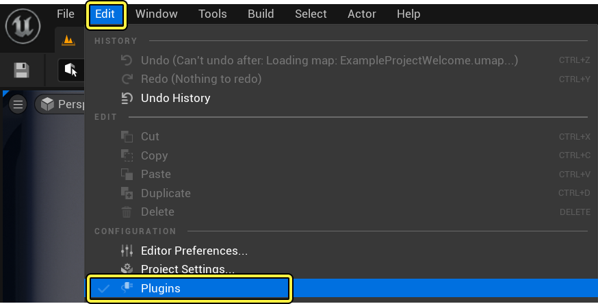
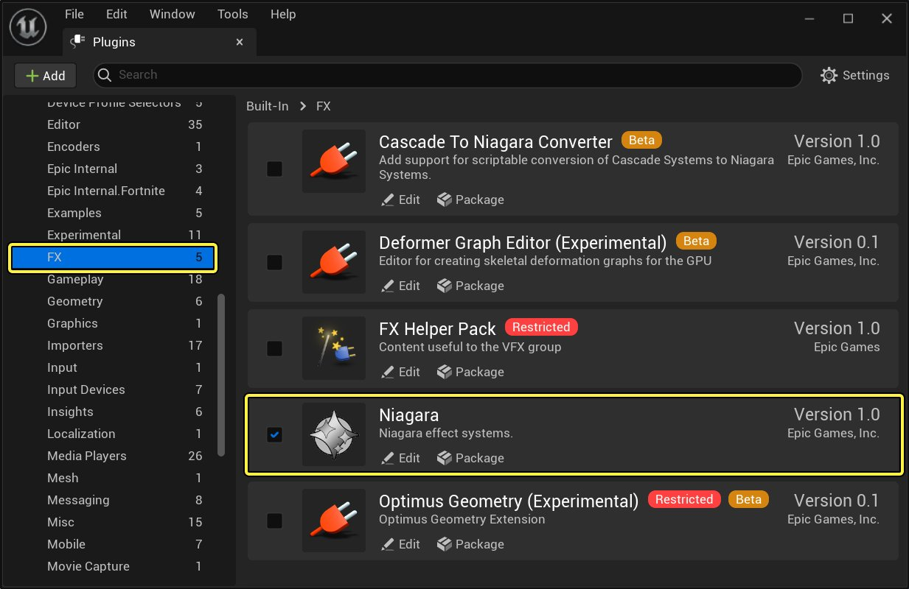
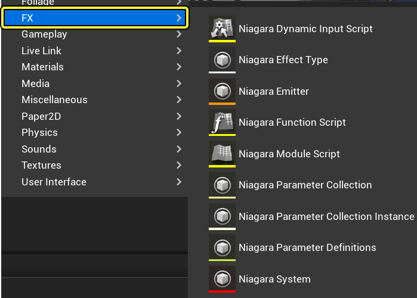

# 启用Niagara插件

> 路径：虚幻引擎5.7文档 / 创建视觉效果 / Niagara教程 / 启用Niagara插件

> 原始页面：https://dev.epicgames.com/documentation/unreal-engine/how-to-enable-the-niagara-effects-plugin-in-unreal-engine

在虚幻引擎5中，Niagara插件已经默认安装并启用。不过，如果你未看到Niagara相关选项，请检查插件是否已启用。

## 如何启用Niagara插件

1. 首先，我们需要转至 **编辑（Edit）** >**插件（Plugins）** 来打开插件（Plugins）。

   

   点击查看大图。
2. 在插件（Plugins）菜单中，找到 **FX** 部分。你会看到Niagara。如果复选框已勾选，表示Niagara已启用。否则勾选它以启用Niagara。

   

   点击查看大图。
3. 启用Niagara后，引擎会提示你需要重启。点击 **立即重启（Restart Now）** 按钮来重启虚幻引擎。重启后Niagara插件将启用。

   

   点击查看大图。

## 最终结果

UE4编辑器重启后，右键单击 **内容浏览器（Content Browser）** 后，你会看到一个新的 **FX** 部分，其中包含Niagara的相关选项。

点击查看大图。
