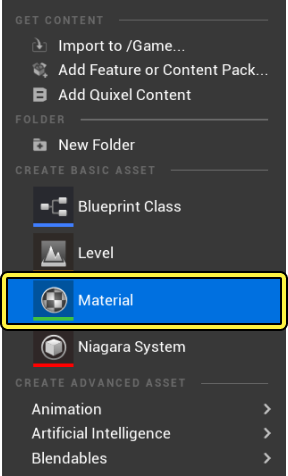
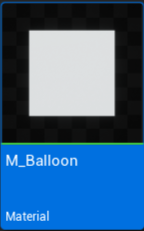
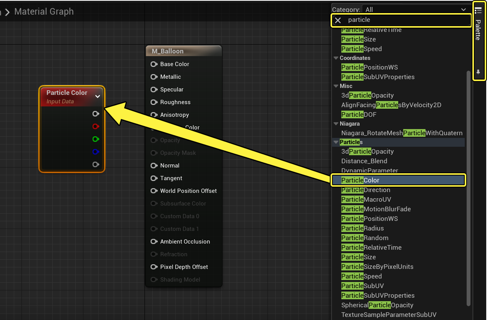
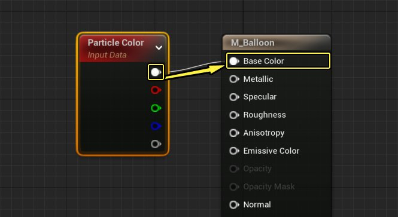
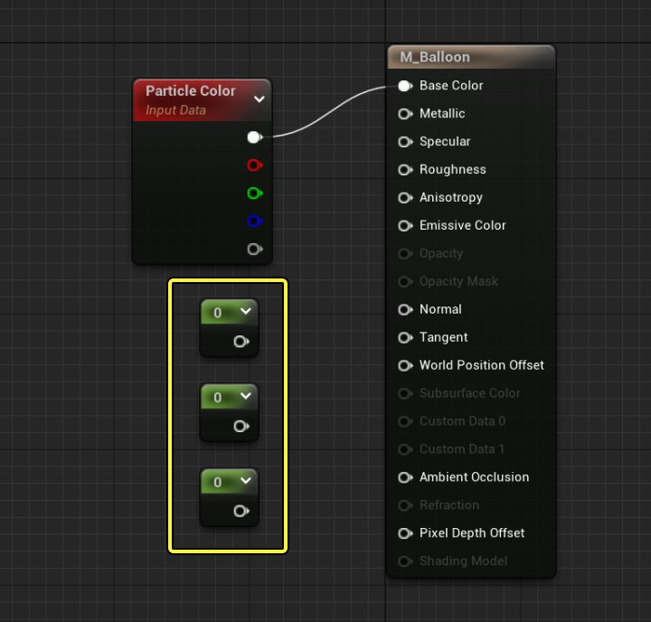
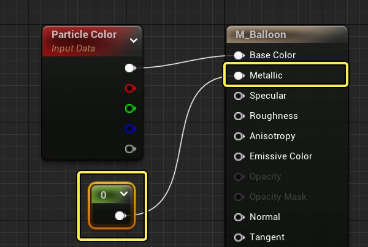
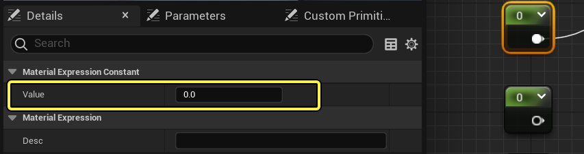
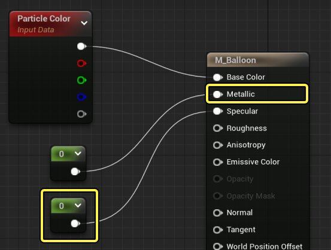

# 网格体气球

> 路径：虚幻引擎5.7文档 / 创建视觉效果 / Niagara教程 / 网格体气球

> 原始页面：https://dev.epicgames.com/documentation/unreal-engine/how-to-use-a-solid-mesh-to-create-a-balloon-effect-in-niagara-for-unreal-engine

用静态网格体制作特效，而不是用[面向摄像机的Sprite](../how-to-create-a-smoke-effect-using-sprite-parti-b357db79/index.md)制作特效，可以增加特效的真实感。在以下教程中，我们将展示如何让Niagara发射器来使用静态网格体而非Sprite制作特效。

> [!NOTE]
> **先决条件步骤：** 本教程将使用一个导入的气球网格体。你可以上网搜索，自行寻找免费的网格体。或者，你也可以使用 **初学者内容包** 中的 **Shape_Sphere** 静态网格体来作为练习。开始前，请确保你已将自己的气球网格体添加到项目中，或已将初学者内容包添加到项目中。

## 创建材质

本指南中的效果是仿佛一团气球被释放的情景。要增强该效果，你需要制作一个简单的材质，使网格体类似橡胶气球。

1. 右键点击内容浏览器（Content Browser），并在"创建基本资产（Create Basic Asset）"下选择 **材质（Material）** 。

   

   点击查看大图。
2. 将新材质命名为 **Balloon_Material**。双击它，在材质编辑器中将其打开。

   

   点击查看大图。
3. 在 **控制板（Palette）** 面板中的搜索栏中输入 `Particle`。选择 **粒子颜色（Particle Color）** 并将其拖动到图表中，添加粒子颜色（Particle Color）节点。

   

   点击查看大图。
4. 拖动 **RGB输出（RGB output）** 并将引线连接到 **材质（Material）** 节点上的 **基本颜色（Base Color）** 输入。

   

   点击查看大图。
5. 按住 **1** 键的同时，点击图表，创建一个 **常量（Constant）** 节点。复制并粘贴该节点两次，这样总共有 **三个常量节点** 。

   

   点击查看大图。
6. 将一个 **常量（Constant）** 节点上的输出连接到 **材质（Material）** 节点上的 **金属感（Metallic）** 输入。

   

   点击查看大图。
7. 你可以在 **细节（Details）** 面板的 **材质表达式常量（Material Expression Constant）** 下设置所选常量的 **数值（Value）**。该材质没有金属感，因此将 **金属感（Metallic）** 常量的数值保留为 **0**。

   

   点击查看大图。
8. 将第二个 **常量（Constant）** 节点上的输出连接到 **材质（Material）** 节点上的 **高光度（Specular）** 输入。

   

   点击查看大图。
9. 选中 **高光度（Specular）** 常量节点后，将 **细节（Details）** 面板中的高光度 **数值（Value）** 设置为 **0.7** 。这会使材质的表面略有反光。

   > 图片已省略：Set Specular Value

   点击查看大图。
10. 将第三个常量节点上的输出连接到 **材质（Material）** 节点上的 **粗糙度（Roughness）** 输入。

    > 图片已省略：Connect Roughness Node

    点击查看大图。
11. 选中 **粗糙度（Roughness）** 常量节点后，将 **细节（Details）** 面板中的粗糙度 **数值（Value）** 设置为 **0.2** 。这会产生大体上光滑的表面。

    > 图片已省略：Set Roughness Value

    点击查看大图。

材质的最终效果应该类似下图。

> 图片已省略：材质最终效果

## 创建系统和发射器

Niagara发射器和系统是独立的。目前推荐的工作流程是基于现有发射器或发射器模板创建系统。

1. 首先，右键点击内容侧滑菜单（Content Drawer）并选择 **FX > Niagara系统（Niagara System）** 来创建一个Niagara系统。界面上将显示Niagara发射器向导。

   > 图片已省略：Create Niagara System

   点击查看大图。
2. 选择 **基于所选发射器的新系统（New system from selected emitters）**。然后点击 **下一步（Next）** 。

   > 图片已省略：Create Niagara System from Selected Emitters

   点击查看大图。
3. 在 **模板（Templates）** 下，选择 **喷泉（Fountain）** 。

   > 图片已省略：Select Fountain Template

   点击查看大图。
4. 点击 **加号**(**+**)图标，将该发射器添加到待添加到系统的发射器列表中。然后点击 **完成（Finish）** 。

   > 图片已省略：Add Emitter and Finish

   点击查看大图。
5. 将新系统命名为 **Balloon_System** 。双击以在Niagara编辑器中打开。

   > 图片已省略：undefined

   点击查看大图。
6. 新系统中的发射器实例的默认名称为 **Fountain** ，但你可以将其重命名。在 **系统概述（System Overview）** 中点击发射器实例的名称，相应字段将变为可编辑。将发射器命名为 **Balloons** 。

   > 图片已省略：Rename Emitter

   点击查看大图。
7. 将你的 **MeshSystem** 拖动到关卡中。

   > 图片已省略：Drag System Into Level

   点击查看大图。

   > [!NOTE]
   > 制作粒子效果时，将系统拖动到关卡中始终是比较好的做法。这样可查看每项更改并在上下文中编辑。你对系统所做的所有更改会自动传播到关卡中系统的实例。

## 更改渲染器

渲染组是堆栈中的最后一项，但你需要更改一些事项，这样效果才会像预期那样显示。在本例中，模板包含Sprite渲染器，而该效果需要网格体渲染器。

1. 在 **系统概述（System Overview）** 中，点击 **渲染（Render）** 以在 **选择（Selection）** 面板中打开。

   > 图片已省略：Select Render Group

   点击查看大图。
2. 要制作网格体粒子效果，你需要 **网格体渲染器（Mesh Renderer）** 模块，但模板包含的是 **Sprite渲染器（Sprite Renderer）** 模块。点击 **垃圾桶** 图标以删除Sprite渲染器。

   > 图片已省略：Remove Sprite Renderer

   点击查看大图。
3. 点击渲染的 **加号** (**+**) 图标并选择 **网格体渲染器（Mesh Renderer）** 。

   > 图片已省略：Add Mesh Renderer

   点击查看大图。
4. 点击 **粒子网格体（Particle Mesh）** 的下拉列表并选择你的网格体。如果你导入了自己的气球模型，请选择该模型。如果要测试，你可以从示例材质中选择 **Shape_Sphere** 。

   > 图片已省略：Select Mesh Shape

   点击查看大图。
5. 你的网格体可能太小或太大，无法在关卡中很好地显示。如果需要，请在此处调整大小。你的网格体可能应用了默认材质。你可以启用"覆盖材质（Override Materials）"，从而改为使用自己创建的自定义材质。点击以启用 **覆盖材质（Override Materials）** ，然后点击 **加号**(**+**)图标以向数组添加元素。

   > 图片已省略：Enable Override Materials

   点击查看大图。
6. 点击 **显式材质（Explicit Mat）** 的下拉菜单，并选择你之前创建的材质 **Balloon_Material** 。

   > 图片已省略：Select Balloon Material

   点击查看大图。

## 编辑发射器更新组设置

首先，你需要编辑 **发射器更新（Emitter Update）** 组中的模块。这些行为应用于发射器并会更新每个帧。

1. 在 **系统概述（System Overview）** 中，点击 **发射器更新（Emitter Update）** 组以在 **选择（Selection）** 面板中打开。

   > 图片已省略：Select Emitter Update

   点击查看大图。
2. 展开 **发射器状态（Emitter State）** 模块。由于你使用了"喷泉（Fountain）"模板，"生命周期模式（Life Cycle Mode）"设置为 **自我（Self）** 。点击下拉菜单，并将 **生命周期模式（Life Cycle Mode）** 设置为 **系统（System）** 。这样一来，你的系统可以计算生命周期设置，这通常会优化性能。

   > 图片已省略：Set Life Cycle Mode

   点击查看大图。
3. **生成速率（Spawn Rate）** 模块会在发射器处于活动状态时创建连续粒子流。该模块已经存在于"喷泉（Fountain）"模板中。将 **生成速率（Spawn Rate）** 设置为 **100** 。

   > 图片已省略：Set Spawn Rate

   点击查看大图。

## 编辑粒子生成组设置

接下来，你需要编辑 **粒子生成（Particle Spawn）** 组中的模块。这些是在粒子首次生成时应用于粒子的行为。

1. 在 **系统概述（System Overview）** 中，点击 **粒子生成（Particle Spawn）** 组以在 **选择（Selection）** 面板中打开。

   > 图片已省略：Select Particle Spawn

   点击查看大图。
2. 展开 **初始化粒子（Initialize Particle）** 模块。该模块会将多个相关参数收集到一个模块中，最大限度减少堆栈凌乱。在 **点属性（Point Attributes）** 下，找到 **生命周期（Lifetime）** 参数。该参数将决定粒子会在显示多久后消失。对于 **生命周期模式（Lifetime Mode）** ，选择 **随机（Random）** 。将 **最小值（Minimum）** 和 **最大值（Maximum）** 值设置为以下值。

   > 图片已省略：Set Lifetime Properties

   点击查看大图。

   | 设置 | 值 |
   | --- | --- |
   | **最小值（Minimum）** | 2.0 |
   | **最大值（Maximum）** | 4.0 |
3. 找到 **颜色（Color）** 参数。你可以选择将所有气球设置为一种纯色，或使用其他某种模式来引入一些多样性。在本示例中，你可以将 **颜色模式（Color Mode）** 设置为 **随机范围（Random Range）**。这样创建出来的气球将拥有随机的颜色，但颜色会介于两种设定颜色之间的范围内。你可以更改 **RGB** 值，直到出现你喜欢的外观。你在此处设置的颜色将应用于你之前创建的材质。在本示例中，颜色设置为红色和蓝色。

   > 图片已省略：Set Color Properties

   点击查看大图。

   | 设置 | 颜色最小值 | 颜色最大值 |
   | --- | --- | --- |
   | **红色** | 1.0 | 0.0 |
   | **绿色** | 0.0 | 0.0 |
   | **蓝色** | 0.0 | 1.0 |
4. 在 **Sprite属性（Sprite Attributes）** 下，将 **Sprite大小模式（Sprite Size Mode）** 、**Sprite旋转模式（Sprite Rotation Mode）** 和 **Sprite UV模式（Sprite UV Mode）** 设置为 **未设置（Unset）** 。由于你使用的是网格体，因此该效果不需要这些属性。

   > 图片已省略：Disable Sprite Attributes

   点击查看大图。
5. 首次设置网格体时，你可能已经调整了大小。但你可能希望大小有一些变化，让其中一些气球更大。在 **网格体属性（Mesh Attributes）** 下，将 **网格体比例模式（Mesh Scale Mode）** 设置为 **随机均匀（Random Uniform）**。将 **网格体均匀比例最小值（Mesh Uniform Scale Min）** 设置为 **0.7** ，并将 **网格体均匀比例最大值（Mesh Uniform Scale Max）** 设置为 **1.0** 。如果你使用了球体而不是气球网格体，你可能希望将 **网格体比例模式（Mesh Scale Mode）** 设置为 **随机非均匀（Random Non-Uniform）** 以使你的球体形状有一点不规则。

   > 图片已省略：Set Mesh Scale

   点击查看大图。
6. 你所制造的效果不需要 **在椎体中添加速度（Add Velocity in Cone）** 模块。你不希望气球呈椎体形状分散开。点击垃圾桶可从堆栈中删除该模块。

   > 图片已省略：Remove the Add Velocity In Cone Module

   点击查看大图。
7. **添加速度（Add Velocity）** 模块会使粒子在生成后立即运动起来。点击 **加号**(**+**)图标并选择 **添加速度（Add Velocity）** ，将"添加速度（Add Velocity）"模块添加到"粒子生成（Particle Spawn）"分段。

   > 图片已省略：Add the Add Velocity Module

   点击查看大图。
8. 由于该效果是仿佛气球被释放的情景，粒子速度需要有一点随机性。点击 **速度（Velocity）** 数值字段旁边的向下箭头，并选择 **随机范围向量（Random Range Vector）** 。这会添加最小和最大速度字段，这样就可以向每个气球分配此范围中的某个速度值，带来随机性。

   > 图片已省略：Add Velocity Random Ranged Vector

   点击查看大图。
9. 将速度 **最小值（Minimum）** 和 **最大值（Maximum）** 值设置为以下值。这会使效果在X和Y轴上有较小的运动速度，而在Z轴上有更大的运动速度。

   > 图片已省略：Set Velocity Minimum and Maximum

   点击查看大图。

   | 设置 | 值 |
   | --- | --- |
   | **最小值（Minimum）** | **X**: 15，**Y**: 25，**Z**: 50 |
   | **最大值（Maximum）** | **X**: 30，**Y**: 30，**Z**: 100 |
10. **球体位置（Sphere Location）** 模块将控制Sprite的生成位置的形状。你可以采用球体形状生成Sprite，并且可以指示半径来设置球体形状的大小。将 **球体半径（Sphere Radius）** 设置为 **200** 。这会将粒子更加分散开，就像气球释放时那样。

    > 图片已省略：Set Sphere Radius

    点击查看大图。

## 编辑粒子更新组设置

现在，你需要编辑"粒子更新（Particle Update）"组中的模块。这些行为适用于发射器的粒子，并更新每个帧。

1. 在 **系统概述（System Overview）** 中，点击 **粒子更新（Particle Update）** 组以在 **选择（Selection）** 面板中打开。

   > 图片已省略：Select Particle Update

   点击查看大图。
2. 通常，你会使用 **重力（Gravity Force）** 模块来模拟重力对物体的影响。你还可以更笼统地运用重力模块为粒子加速。将重力 **X、Y和Z** 值设置为以下值。

   > 图片已省略：Set Gravity Force

   点击查看大图。

   | 设置 | 值 |
   | --- | --- |
   | **X** | 10 |
   | **Y** | 10 |
   | **Z** | 40 |
3. **阻力（Drag）** 模块会将阻力应用于粒子，从而减慢其速度。将 **阻力（Drag）** 设置为 **1.0** 。

   > 图片已省略：Set Drag

   点击查看大图。
4. **比例颜色（Scale Color）** 模块是"喷泉（Fountain）"模板的一部分，但该效果不需要该模块。点击 **垃圾桶** 图标以删除"比例颜色（Scale Color）"模块。

   > 图片已省略：Remove Scale Color

   点击查看大图。

## 最终结果

祝贺你！你已经在Niagara中制造了网格体粒子效果。你学会了如何创建材质、将粒子颜色应用于该材质，以及将静态网格体用作粒子特效。请继续探索模块中的其他选项，进一步优化效果。

> 动图已省略：气球特效的最终效果
