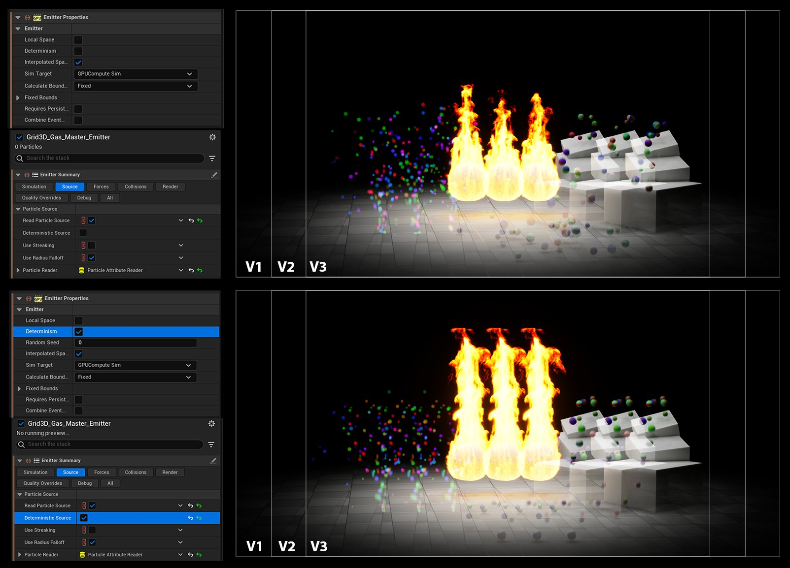

# 缓存和复用系统

> 路径：虚幻引擎5.7文档 / 创建视觉效果 / Niagara教程 / 将Niagara用于线性内容 / 缓存和复用系统

> 原始页面：https://dev.epicgames.com/documentation/unreal-engine/caching-and-reusing-your-system

## 确定性

你会发现，系统在倒推时会出现不稳定的情况。这是因为系统需要从生命周期轨道起始处重置，一直运行直至当前帧。而每次重置时，随机值都是不同的。

每个Niagara发射器都可以被切换为确定性的发射器。这可以使每次系统重置时随机种子都相同。

确定性比能够倒推和前推更为重要，因为你能通过它以可预测的方式反复重新渲染镜头。如果没有更改系统的参数或输入，则系统每次运行都应生成相同的结果。在制片环境中，这对于通过需要多次迭代以求通过的镜头审核工作至关重要。

## 缓存Niagara模拟

从虚幻引擎5.2起，我们能够将Niagara模拟从Sequencer **缓存** 到 **Niagara模拟缓存** 资产。要启用此功能，请确保已加载 **Niagara模拟缓存插件** 。你可在[此处](https://dev.epicgames.com/community/learning/tutorials/7B3y/unreal-engine-caching-niagara-fluids-with-sequencer)找到有关缓存Niagara模拟的教程。

### Niagara模拟缓存资产

Niagara模拟可以被缓存到Niagara模拟缓存。

从Sequencer缓存时，模拟缓存数据会被默认嵌入到关卡序列资产中。这对于小模拟而言很便捷，但在处理大量复杂模拟时，可能会导致关卡序列资产太臃肿。

你可以选择为每个模拟创建自己的Niagara模拟缓存。然后，可以将模拟数据从关卡序列中分离开来。模拟缓存资产会在Sequencer内的缓存轨道属性中被引用。

1.在内容浏览器中，单击右键并找到特效/高级/Niagara模拟缓存（FX/Advanced/Niagara Simulation Cache）。 2.根据你的需要将新资产重命名为合适的名称。 3.在Sequencer中，右键单击缓存轨道并转至轨道属性菜单。 4.更改"模拟缓存"（Sim Cache）参数以指向新资产。

### 缓存轨道和时间样本

在影片渲染队列（MRQ）中使用时间样本时，对场景进行求值的时间会通过快门打开时间得到细分。如果选择了9个时间样本，那么最终图像将是9个独立渲染的合成。这9个渲染器创建的时间点都稍有不同。要做到这一点，场景Actor需要在更小的时间步长上进行求值，而不仅仅是在全部帧上。

缓存包括为缓存的每一帧存储模拟状态。只存储全部帧。如果我们使用时间样本渲染了缓存，我们就必须反复渲染相同的数据，因为我们只有全部帧的数据。

为了解决这一问题，缓存系统将存储额外的数据，以允许将点数据内插或外插到全部帧以外的位置。这样，时间样本可以在适当的位置为样本时间渲染模拟。

内插是指在当前帧数据与周围帧数据之间插入位置和四元数的过程。这是最可靠的方法，但只有当粒子存在于周围帧之上时才可行。

外插使用当前帧的速度来计算在更早或更晚的时间点所处的位置。

这两个选项都被选中时，优先考虑内插。如果内插不可行，才使用外插。

内插/外插功能仅适用于基于点的模拟。对于其他基于网格的模拟，渲染器只能获取整个帧的数据。

## 多次使用同一个系统

为了创建复杂性，我们经常使用非常相似的特效资产来填充镜头。我们提供了一些机制来支持单个资产内的变体，你不必在内容浏览器中为每个所需变体复制资产。

### 随机种子偏移

资产的每个实例都会有一个针对其组件的随机种子偏移参数。此参数可用于在保持确定性的同时创建同一系统的变体。

## 用户参数

Niagara支持用户参数。这些参数被提升到关卡中的Niagara System实例。因此可以定义同一底层Niagara系统的变体。

Sequencer支持将用户参数作为轨道。用户参数相关轨道可以被添加到Sequencer中的Niagara组件轨道中，并根据需要随时间变化为变体设置关键帧。
