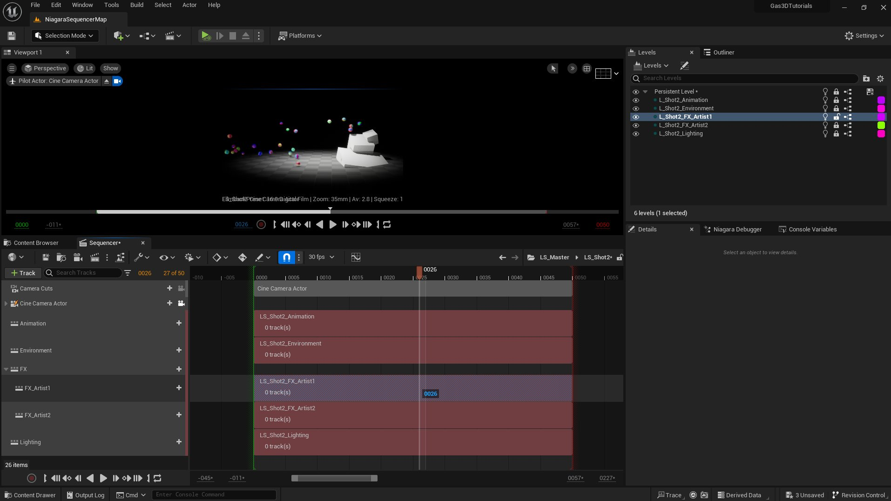

# 制片注意事项

> 路径：虚幻引擎5.7文档 / 创建视觉效果 / Niagara教程 / 将Niagara用于线性内容 / 制片注意事项

> 原始页面：https://dev.epicgames.com/documentation/unreal-engine/production-considerations

## 制片注意事项

大部分情况下你都不会孤立地开展工作。其他美术师需要签出你正在使用的文件。这可能会导致工作中断，因为你需要等待所需的文件释放给你。

你可以采取几种方法来让团队同时开展工作：

- 为每个镜头添加基于各分项的关卡序列。
- 为每个基于持久/序列的关卡添加基于各分项的子关卡。

根据你的团队规模，你可能想要进一步细分，即按美术师和/或镜头添加关卡序列和子关卡。

你还可以采用另一种方法，即使用 **可生成** Actor，而不是 **可持有** Actor。

可生成Actor由Sequencer创建。它并不存在于关卡中，直到你打开生成它的关卡序列。因而，你无需访问持久关卡来添加或修改Actor。

你可通过以下任意一种方式创建可生成Actor：

- 将可持有Actor转换为可生成Actor。
- 将内容浏览器中的资产直接拖至Sequencer中。
