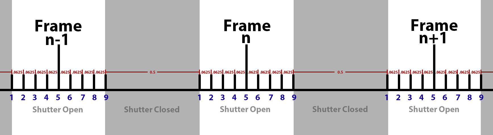

# 设置动态模糊

> 路径：虚幻引擎5.7文档 / 创建视觉效果 / Niagara教程 / 将Niagara用于线性内容 / 设置动态模糊

> 原始页面：https://dev.epicgames.com/documentation/unreal-engine/setting-up-motion-blur

## 动态模糊

虚幻引擎使用 **Velocity GBuffer** 向渲染图像应用 **动态模糊**。对于实时应用程序，该方法非常快捷，但对于线性内容，伪影往往不可接受。

Velocity GBuffer会为每个像素存储一个向量。该方法无法模糊次级动态，比如阴影、反射。当快速移动的对象跨越路径时，该方法也会产生伪影。

## 影片渲染队列：时间样本数

在制作线性内容时，我们通常能够承受较长的渲染时间，因此可以通过每帧渲染多个图像来提升质量。在整个快门打开时间，均匀分布每个渲染。然后，将这些渲染结合起来，形成最终高质量的帧。

> [!NOTE]
> 如果已启用 **在运行时锁定为显示率（Lock to Display Rate at Runtime）** 选项来获得准确预览，则必须关闭该选项，这样 **时间样本（Temporal Samples）** 才会生效。该设置将重载时间样本的效果。

Sequencer将根据你定义的时间样本数进行刷新。因此，传递给模拟的时间步长也将随着时间样本数发生变化。

还有一个问题是，Sequencer将仅在摄像机快门打开时的那一部分帧中添加时间样本，这通常为半帧。因此，在快门打开期间，将向模拟传递一系列非常小的时间步长，随后在快门关闭期间，传递一个较大的时间步长。某些模拟类型存在这种不规则步长问题，可能导致伪影。

上图显示了传递给模拟的 **时间步长** （红色）。快门打开期间的时间步长比快门关闭期间的时间步长小8倍。

网格模拟特别容易受到每帧时间步长变化的影响。如果网格模拟每帧刷新9次，那么看起来与同一模拟刷新1次完全不同。快门打开与关闭之间的时间步长变化只会使这些差异更加明显。

如果你正在处理基于网格的模拟，需要设置系统的 **固定刷新增量时间（Fixed Tick Delta Time）** 以匹配 **Sequencers帧率（Sequencers frame rate）** （例如：如果Sequencer被设为30fps，则将 **固定刷新增量时间（Fixed Tick Delta Time）** 设为(1.0/30)或0.33333）。
