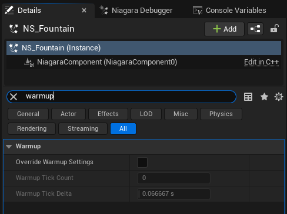
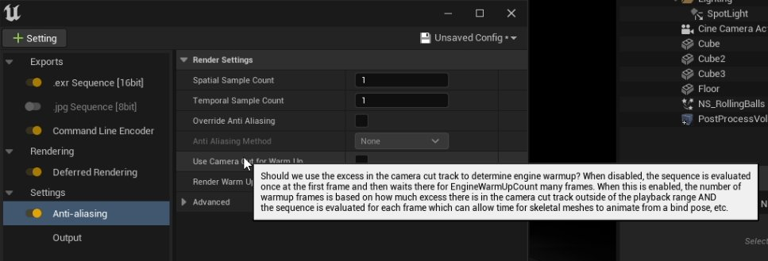

# 设置预滚

> 路径：虚幻引擎5.7文档 / 创建视觉效果 / Niagara教程 / 将Niagara用于线性内容 / 设置预滚

> 原始页面：https://dev.epicgames.com/documentation/unreal-engine/setting-up-pre-roll

## 预滚

使用 **预滚预热** 确保模拟在序列开始之前模拟准备就绪。

很多时候，特效元素要在镜头第一帧就可见。它也许是上一个镜头中爆炸的延续，也许是导弹尾迹，也许是从岩石上倾泻而下的瀑布。

我们可以使用几种方法处理Niagara系统预滚。每种方法各有优缺点。

## Niagara系统预热

每个系统都可以定义一个 **预热时间** 。它将告知Niagara在进行渲染之前刷新一段时间。因此，在Sequencer开始播放之前，系统就已执行预滚。

你可以在 **Niagara系统** 中或关卡中的 **Niagara系统实例** 上定义预热。在组件上搜索"warmup（预热）"：

## 系统生命周期轨道

有一个方法与预热时间类似，即在镜头开始之前使用 **系统生命周期轨迹** 偏移系统。这种方法可能更直观，因为可以从Sequencer中清楚地看到系统的开始和结束时间。

## Niagara预滚与引擎预滚

预热时间和系统生命周期轨道的预滚方法都受以下情况的影响：只有Niagara系统在执行预滚。如果世界中有任何东西在影响系统，比如碰撞或父变换等，预滚将不会将其考虑在内。

在以下视频中，你会发现在镜头开始之前，"滚动球"不会与立方体发生碰撞。

## MRQ：使用镜头切换进行预热

影片渲染队列（MRQ）在准备渲染镜头的同时还支持预热。这些设置在 **抗锯齿** 分段内。你需要激活的设置称为 **使用镜头切换进行预热（Use Camera Cut for Warm Up）** 。这种模式的好处是，它会刷新包括骨骼网格体在内的引擎，为Niagara提供更准确的互动环境。

## 影片渲染队列：渲染预热帧

MRQ认为有两种预热：仅引擎预热和渲染预热。仅刷新引擎是开销较低的选项，它不会把时间浪费在渲染不需要的帧上。但有几种情况需要渲染预热帧，以便Niagara系统能够正常工作。

最为显著的例子是使用 **深度图碰撞（Depth Map collisions）** 时。因为必须先渲染深度图，才会存在深度图。如果不激活"渲染预热帧（Render Warm Up Frames）"选项，则将无法正常运行GPU深度图碰撞。

其他用例包括针对场景颜色等查询 **Gbuffer** 时。

在抗锯齿设置分段中，激活"渲染预热帧（Render Warm Up Frames）"选项。

MRQ预热是一个功能强大的工具，但无法在编辑器中预览。但在许多情况下，这可能是最可靠的方法。
