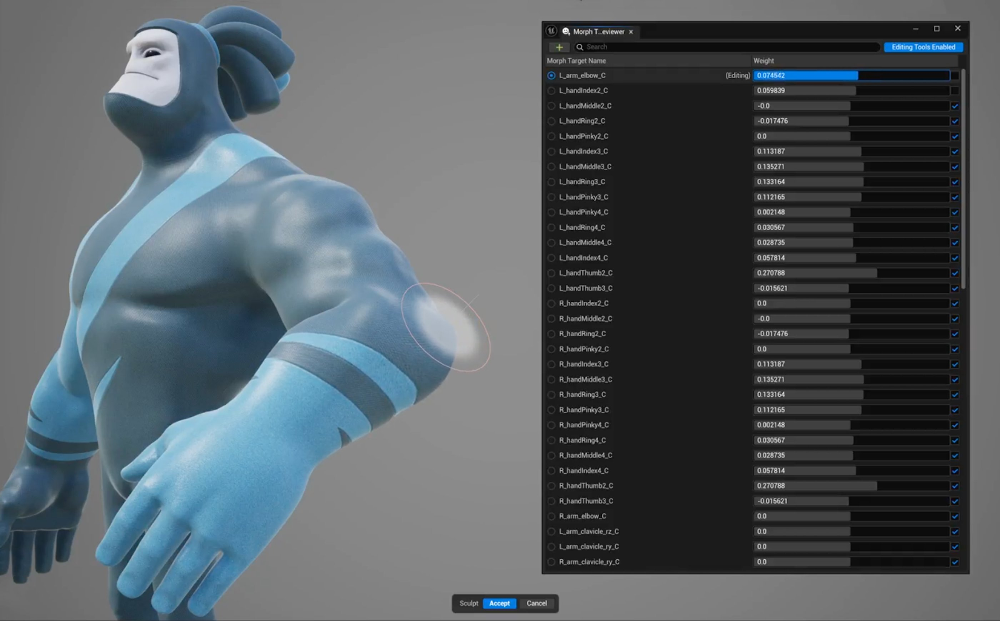
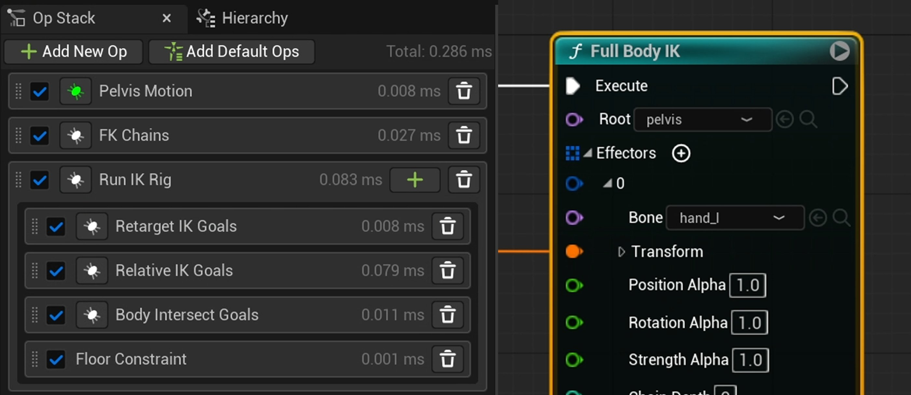
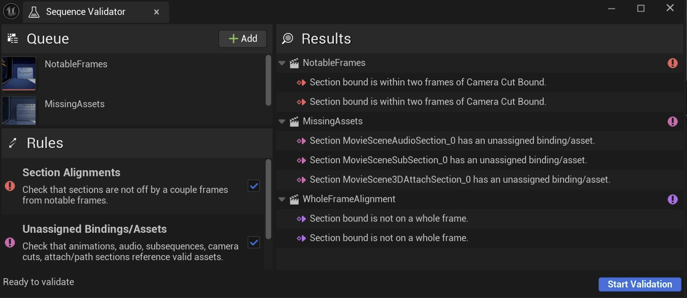
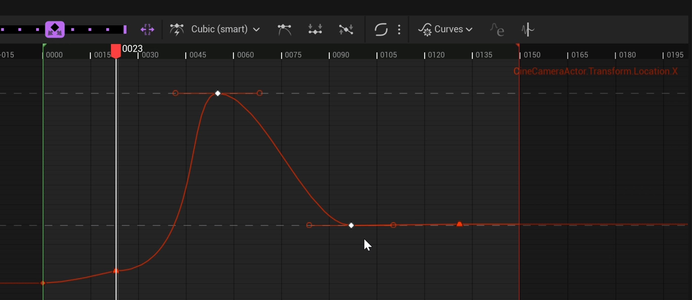
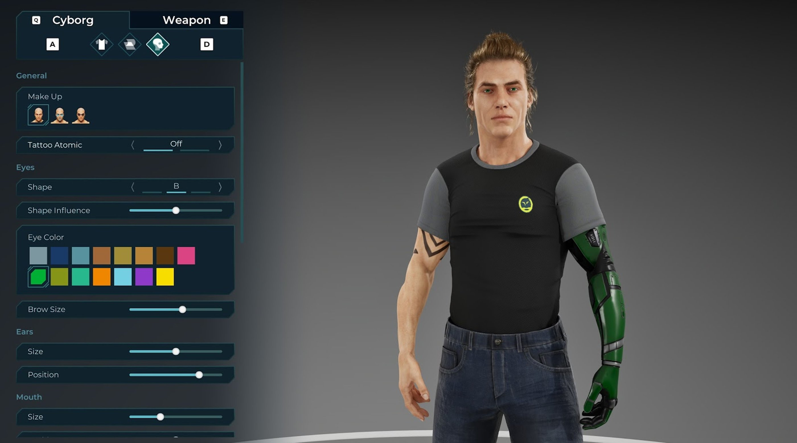
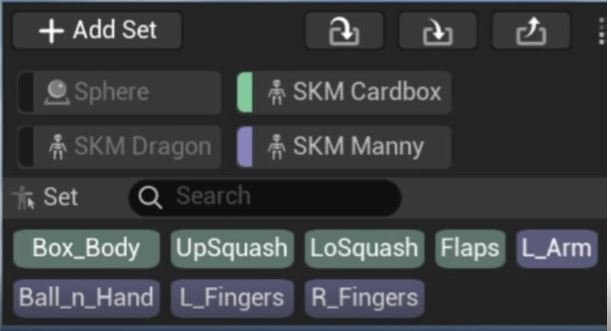

# 虚幻引擎5.7版本说明

> 路径：虚幻引擎5.7文档 / 新内容 / 虚幻引擎5.7版本说明

> 原始页面：https://dev.epicgames.com/documentation/unreal-engine/unreal-engine-5-7-release-notes

## 新内容

虚幻引擎5.7版本将继续完善UE5工具集。 此版本优化了多个方面，包括渲染、角色与动画、世界构建和程序化内容生成（PCG）等。

此版本包含我们的虚幻引擎开发者社区在GitHub上提交的改进。 感谢虚幻引擎5.7的每一位贡献者：

贡献者列表：AlexanderVeselov-arm, AlexBlackfrost, Almax27, andreibazi, az6667, Bit-Rot, Brian-PD, brpendle-ti, bturner, chrysos8201, ckendal3, ColinGulliver, CookiePLMonster, Darcy3000s, dasherman-ea, davidbaack, dmergele, DoubleDeez, DrewWeth, DTG-将-Marshall, dyanikoglu, erebel55, Eric2-Praxinos, Erlandys, faisa-believer, foobit, gamethread, geordiemhall, glecko, GreenLightning, guansdu, H3mul, IngSubstance, iniside, jamesfAnet, jamespark-unreal, JasonCoombs, jdamdami, jerobarraco, jeysym, Jiboo, JohnJFarrow, Jordonbc, jorge-axiomvfx, jorgenpt, jpritchard1010, KaosSpectrum, KarimLUCCIN, KeithRare, kimkun07-k, kissSimple, klukule, KXOC, laurencei, lclara-BARB, LHG-JonAnderJimenez, ligazetom, LightKL, lsandersljungberg, LucaFranzo98, Maigo, MarcusSvensson92, Mario-Azcona, MartinWickhamFB, Mattiwatti, melku, michael-buschbeck-ms, Minus4-44, moumee, nickdarnell, phochstrasser, PICO-XR, QRare, r457-Ao2, rdunnington, reduf, redxdev, RiotJDebern, rohyunsang, sareali, serhanio, SilverWinter0511, slonopotamus, SoulSharer, sportbikerr1, ssutherland-riot, SukenderDontNod, Sythenz, teddemunnik, tioez326, tokyocplusplus, Tt-Wes, tustanivsky, Vaei, vladbelousoff, vogoltsov, WangKan, Wizzard033, wmiller, x157, yangskyboxlabs, yoonbigbear, zachlute-arenanet, ZeroEightSix, ZeroErrors, zhou-

## 渲染

### MegaLights（测试版）

**MegaLights**现处于测试阶段，在降噪和整体性能方面均有改进。 目前它还支持以下功能：

- 定向光源
- Niagara粒子光源
- 半透明度
- 毛发束

### Niagara异类体积

**异类体积**现已进入测试阶段。 此次更新主要通过以下新功能改进阴影投射：

- 定向光源级联阴影。
- Beer阴影贴图支持极高品质的可扩展性，可提供：

  - 大幅缩短阴影创建时间。
  - 常量时间阴影查询。
- 阴影遮罩预处理，可消除延光源中增加的VGPR压力。
- 启用阴影投射不再需要重启编辑器和着色器编译。

### Substrate

**Substrate材质**现已可用于生产，将在UE5.7中默认启用。它是一种模块化、以物理为基础的材质框架，该框架取代了固定的阴影模型，采用了专为表现力控制、可扩展性能和长期灵活度而设计的系统。

它还支持两种渲染路径：

- **自适应GBuffer**，可在现代硬件上实现逐像素拓扑和分层闭合等高级功能。
- **可混合GBuffer**是一种简化的后备方案，可确保广泛的平台兼容性。

### Nanite植被与蒙皮（实验性）

**Nanite植被**是业界领先的渲染路径，其核心由三个完整的系统组成：

- **Nanite组装**，可将植被部件实例统合成一个整合的单元。
- **Nanite蒙皮**，可以决定植被在各种系统（例如风）下的动态行为。
- **Nanite体素**是一种像素大小的体素，能够根据与摄像机的距离来保留细节、动画和材质特性，并且只会占用原开销的一小部分。

将这些功能结合起来，就能打造出更加丰富的场景，呈现栩栩如生的动画植被，并且在当前世代硬件条件下达到60FPS。

新功能：

- Nanite组装，用于使用实例部件构建植被资产，以保持较小的资产大小。

  - 构建Nanite组装的蓝图API
  - 我们还有编辑器内工具，方便根据你的选择来创建Nanite组装。
  - USD导入支持。 公开USD模式，以便你在DCC工具中使用，从而标记场景并作为组装导入。
- 骨骼网格体驱动的动态风；树木为骨骼网格体，新的动态 Wind插件还可以使程序风影响树木的骨骼。
- Nanite体素，用于高效渲染远处的植被几何体。
- TSR薄几何体检测能够更好地处理植被。

### SMAA（实验性）

移动和桌面端渲染器现已支持**子像素形态抗锯齿（SMAA）**。 你可以使用CVar`r.Mobile.AntiAliasing=5`在移动渲染器中启用该功能，而桌面端渲染器则使用CVar `r.AntiAliasingMethod=5`。

该功能通过提供高质量的边缘平滑来提高视觉保真度，同时将性能影响降至最低，是针对移动端游戏的高效方法。

- 所有平台均可使用SMAA抗锯齿功能。
- 使用`r.SMAA.Quality`调整质量设置
- 使用`r.SMAA.EdgeMode`在颜色或亮度之间调整边缘检测
- 改进边缘平滑度，且无需高昂的GPU成本。

当前为实验性功能。 质量设置可以用来实现性能或视觉保真度之间的平衡。

## 角色和动画

### 运动匹配选择器集成（实验性）

在UE 5.7中，我们带来了**运动匹配**集成到**选择器**的首次迭代！ 这样可以让用户控制哪些资产在运动匹配中是有效的，而在以前的版本中，这只能在数据库层级实现，而不能在单个资产层级做到。

现在你就可以搜索最合适的姿势，还能通过选择器根据游戏逻辑等额外条件过滤每个资产的结果。

选择器中新增的姿势搜索（姿势 Search）字段可以管理复杂的情况，并且运动匹配的调试功能也已集成到选择器中。

此功能为实验性功能。

### 混合形状和雕刻工具

虚幻引擎也获得了行业标准级的雕刻工作流程的灵活性。 我们更新了骨骼编辑器工具，现在你可以无缝创建和编辑变形形状、骨骼和蒙皮权重。

- 现在可以在骨骼网格体上即时移动骨骼、绘制权重和雕刻混合形状。
- 新**变形目标查看器**。
- 形状可适应网格体拓扑的变化。
- 为动画师配备富有表现力的工具，助力打造影视级动画表演。

### 控制绑定物理效果的世界碰撞

将关卡碰撞引入控制绑定物理效果模拟。 使用现有的世界几何体和物理对象来创建更真实的接触、推动和交互。

- 世界碰撞支持控制绑定物理效果的单向交互。
- 将关卡网格体和物理对象作为碰撞物。
- 在模拟和回放过程中，驱动与道具、地面和环境的接触。

### 控制绑定依赖性查看器

你可以通过专门的依赖性查看器来了解绑定元素的连接情况，并能随时间更新。 将控制、骨骼和模块之间的关系可视化，让调试更简单直观。

- 查看父子项和元数据关系，一目了然。
- 调试绑定和模块，更清晰地了解数据流。
- 熟悉的依赖结构可视化。

### FBIK和重定向性能

我们对全身IK和IK重定向器做了性能改进，并添加了控制功能。 这为你提供了在运行时执行重定向的方法。

- 利用FBIK改进姿势，并且不需要付出高昂的性能代价（速度提高约20%）。
- 使用IK绑定中的伸展肢体解算器，实现高效的运行时重定向。
- 使用FK旋转模式的**复制本地（复制 本地）**可以加快每个条链的旋转传输速度。
- 在重定向堆栈上启用性能分析。
- 为每个重定向运算符添加LOD阈值。

### 改进的脚部接触和比例重定向

我们改进了IK重定器，从而更好地处理地面接触和庞大比例的角色。

这样就能更好地在各种角色之间传输动画，从而更快地完成美术设计。 现在可以执行以下所有操作：

- 确定胯部高度，防止骨盆坠地并保持垂直运动。
- 为双脚添加地板约束，以便在靠近地板时保持垂直位置。
- 使用FK平移模式**朝向和缩放**来传输骨骼平移数据。
- 添加**拉伸链**运算符，匹配或缩放源重定向链。
- 使用**伸展肢体**解算器来控制肢体的挤压和伸展。
- 将**源缩放**的枢轴点更改为不同的骨骼，从而进行动作捕捉或配合游戏玩法。
- 添加**过滤骨骼**运算符，以便在对较大的角色进行重定向时去除高频噪点。

### 空间感知重定向（实验性）

**空间感知重定向**为美术师提供了在不同角色之间传输动画的方法，并且无需担心自碰撞的问题。

这样也可以减少重定向后清理动画的繁杂工作。

- 我们添加了**形体交互**运算符，利用物理原理将IK目标推出，以防止自碰撞。
- 我们添加了**相对IK**运算符，从而根据从信号源到目标的接触长度来移动IK目标。

### 序列验证器（实验性）

**序列验证器**为影片创作者提供了可以在序列中检查是否存在内容错误的方法。 这样能够减少在Sequencer中工作时可能发生的潜在问题。

用它你可以做到：

- 对多个序列及其序列层级进行排序，发现潜在问题。
- 检查序列中分段是否偏离了摄像机切换或回放范围。
- 检查各分段是否有未分配的绑定或资产。
- 检查分段的起始和结束是否在完整帧上。
- 查看结果并直接导航到每个序列中的问题所在。

### 缓动曲线（测试版）和UX改进

现在你可以在Sequencer中使用动态设计（运动 Design ）中的**缓动曲线（Ease Curve）**工具。 你可以使用Ease Curve插件来启用它

此外，此次更新还带来了更统一的行为，旨在提高可用性，让你可以更快地进行迭代。

- 在Sequencer、曲线编辑器和UMG中使用缓动曲线工具来应用和保存不同的缓动曲线预设。
- 还可以使用缩放锁定功能调整缩放，类似于Sequencer序列树中的细节面板。
- 改进了序列层级的时间轴显示，从而同时显示当前序列和父序列的时间。
- 扩展蓝图和Python功能，访问轨道状态（单独、静音、停用、锁定和引脚）。
- 改进了变换烘焙，使其包括时间扭曲功能。
- 在导航工具中添加了新的**绑定ID（Binding ID）**和**序列ID（序列 ID）**列。

缓动曲线工具目前还处于测试阶段。

### 无数据可变（实验性）

使用无数据的可自定义对象，加快迭代速度并简化工作流程。 参数输入会在运行时处理而不是编译时，因此编译速度更快，加密效果更好，包体也更小。

- 将可自定义对象转换为无数据对象。
- 通过运行时处理参数，获得更快的编译时间。
- 像使用其它UE资产一样使用加密和打包。

### 选择集

动画师需要在整个制作过程中快速访问多个选择。 这可能是一个绑定中的多个控制，也可能是不同资产中的多个控制和/或变换。 目前动画师需要依赖Gui Pickers等自定义工具来实现这一功能，因此我们希望开发一个更原生的版本，类似于其他工具中好用的插件。

### 动画模式UX和QOL改进

我们对**动画模式**做出了改进。

**约束（Constraints）**、**空间切换（空间 Switching）**和**吸附工具（Snapper）**工具现在合并为一个新的**约束（Constraint）**窗口。

同样是关于这个约束，我们给创建流程添加了一些新的选项。

- **当前帧**：这是以前的标准功能。 它会在当前帧上创建一个在帧，并向前补偿所有帧。
- **从开头（新）（从 开始 (新增)）**：获取当前帧的偏移量，并将其作为镜头的第一帧，而不是当前帧。
- **无限（新）（Infinite (新增)）**：不添加关键帧。 相反，它会将当前帧的偏移量应用于整个序列。

现在姿势库（姿势 Library）、补间工具、约束、选择集（新）和动画图层可根据图标状态打开或关闭相应窗口。 它们在布局中的位置和大小也会被保存。

你可以将切换这些窗口的操作分配给相应的快捷键。

## MetaHuman

### MetaHuman Creator

虚幻引擎中的MetaHuman Creator现已支持Linux和macOS平台，将强大的集成数字人类创作工具带到你所偏好的平台。 如果你尚未从MetaHuman Creator网页应用迁移，请遵循我们的[迁移指南](https://dev.epicgames.com/documentation/metahuman/metahuman-creator-migration-guide?application_version=5.6)，了解如何将现有MetaHuman角色导入虚幻引擎以继续创作！

我们增强了[身体网格体的拟合流程](https://dev.epicgames.com/documentation/metahuman/body-conform-controls?application_version=5.7)，新增了对多种姿势的支持，并引入了拟合模板与模型网格体之间的UV空间的顶点对应关系，让你更轻松地获得更精准的结果。 参数化身体控制如今也更直观，让你能更轻松地保持人体比例的范围，同时提升精度与控制力。

此版本支持[使用Python](https://dev.epicgames.com/documentation/metahuman/python-scripting-for-metahuman-creator?application_version=5.7)或蓝图对MetaHuman角色资产的几乎所有编辑与组装操作进行自动化和批处理。 首次通过API将MetaHuman Creator深度集成至你的管线与创作流程，该API支持雕刻、拟合、服装、绑定和纹理功能，简化完整的角色组装流程。可在MetaHuman Creator中实时预览编辑效果，在虚幻编辑器中实现交互式运行，或通过计算农场进行离线处理。

### 虚幻引擎中的MetaHuman

虚幻引擎Groom插件现通过基于关节的工作流程，实现了对[发束造型与动画](https://dev.epicgames.com/documentation/metahuman/hair-art-directability?application_version=5.7)的更精细控制。 现在你可以混合模拟与各种美术风格下的运动，充分利用骨骼网格体动画工作流，并通过增强的选择集和绘制工具来获得更大的美术创作自由度。 该工具集与最初在Houdini中创建的MetaHuman Groom完全兼容。

### MetaHuman Animator

现在可通过蓝图接口获取来自MetaHuman 实时 Link源的实时动画，我们的文档中提供了[示例图表](https://dev.epicgames.com/documentation/metahuman/blueprint-examples?application_version=5.7)。

|  |  |
| --- | --- |
|  |  |

棋盘格镜头[生成的校准数据](https://dev.epicgames.com/documentation/metahuman/generate-calibration?application_version=5.7)工作流程（使用立体摄像机设备组捕获）已得到改进，提供更优的自动帧选择功能、辅助手动帧选择的可视化工具，以及跨镜头的可重复配置。

结合全新的[MetaHuman Animator Calibration Diagnostics](https://dev.epicgames.com/documentation/metahuman/calibration-diagnostics-tool?application_version=5.7)（实验性），可对照表演素材验证校准效果，更轻松地判断校准方案是否最优。

### MetaHuman捕获

我们通过扩展支持摄像机的范围，增强了实时 Link 面 [iOS](https://apps.apple.com/us/app/live-link-face/id1495370836)与[Android](https://play.google.com/store/apps/details?id=com.epicgames.facelink)应用中的实时动画选项。

通过实时 Link 面，你可以使用外接摄像机在支持的Android设备或iPad上生成实时面部动画（注：苹果的iOS目前不支持外接摄像机）。仅可在iPad上通过外接摄像机录制视频。

你也可在iOS和Android设备上，通过实时 Link 面选择设备任意内置摄像机来实时生成动画。仅可在iOS上通过内置摄像机录制视频。

### MetaHuman 用于 Houdini

最新的[MetaHuman 用于 Houdini](https://www.fab.com/listings/7bbdfbb5-5eaf-4aa6-b32b-b8b048ebea25)更新带来了[参数化毛发工具](https://dev.epicgames.com/documentation/metahuman/parametric-hairstyle-generator?application_version=5.7)，这种指引驱动型的工作流程可以通过预创作数据来打造发型。 该工具集包含毛囊生成器，可处理发际线周围的毛发密度与定位，并根据走向、长度和体积参数生成引导线，同时提供发束插值与高级细节（如簇状感）等造型功能。这也是快速构建并迭代新发型的便捷途径。

此外，为帮助大家学习创建更复杂的发型，我们在Fab平台发布了新版[Houdini版MetaHuman Groom高级套件](https://www.fab.com/listings/165c4244-482f-4e37-9200-dd782972cdde)作为额外的学习资源。

[MetaHuman 用于 Houdini](https://www.fab.com/listings/7bbdfbb5-5eaf-4aa6-b32b-b8b048ebea25)现已适用Linux。

### MetaHuman 用于 Maya

[MetaHuman 用于 Maya](https://www.fab.com/listings/9e3bf55e-d4c3-44fc-a3d4-ec4cb772ec29)的最新更新可在Linux上使用，并引入了对Maya 2026的支持。

## 世界构建

### 自定义HLOD

在使用自动HLOD生成方法时，输出的结果可能并不总能满足项目的要求，而且会受到网格体组件的约束。

**自定义HLOD****支持**为单个Actor或组提供自定义HLOD表示，从而解决了这一限制。

你可以通过两种方式来使用新的世界分区自定义HLOD Actor类：

- **直接注入自定义表示**：你可以将自定义表示完整地注入HLOD运行时分区，并将其用作父HLOD层的输入。
- **仅提供自定义源**：你可以将自定义表示作为HLOD生成流程的输入，而无需将其添加到世界本身。

### HLOD配置UX改进

> 图片已省略：HLOD配置UX改进

我们重新设计了**世界场景设置（世界 设置） > 世界分区（世界 分区）**的HLOD层配置和HLOD层资产，以提高创建或编辑配置时的可用性。

## 程序化内容生成（PCG）

### PCG框架已可用于生产

> 图片已省略：PCG框架已可用于生产！

**程序化内容生成（PCG）框架**在5.7版本也可以用于生产了。

虽然该框架仍在持续开发和改进中，但我们依然致力于支持稳定的开发环境，使所有生产都能在运行时和编辑器内使用，建立并依赖快速可迭代的程序化内容生成工具集。

### PCG编辑器模式

虚幻引擎现已新增PCG专用编辑器工具模式。 它提供了利用PCG框架的可自定义工具库，如绘制样条线、绘制或创建体积，每项工具都有相关的PCG图表及其参数，可供实时编辑。

你可以按原样使用提供的工具专用PCG图表，或以其为范例根据自身需求创建和扩展资源库。

> [!WARNING]
> 如果你曾使用UE 5.7预览版，你的PCG编辑器模式设置可能未采用默认配置。 如果PCG编辑器模式窗口无法打开并显示错误信息，请在**编辑器偏好**设置中打开**插件-PCG编辑器模式设置**，随后点击右上角的**重设为默认**。

### 程序化植被编辑器

**程序化植被编辑器**是一项新的实验性插件，让你可以直接在虚幻引擎中创建和编辑植被网格体，并且支持Nanite植被。

在此初始版本中，你创建的程序化植被资产将通过植被编辑器（基于PCG的节点图表编辑器）进行编辑。 使用插件内容文件夹中提供的导入器节点和骨骼预设，你可以：

- 通过重力、雕刻和缩放运算符修改树木形状。
- 调整树叶和树枝的分布。
- 分配不同的树叶模型。
- 导出至骨骼网格体或静态网格体，包括对Nanite植被组装的支持。

通过单个节点图表或多个节点图表创建多种变体，以便为项目构建独特的植被网格体资产库。

### 资产工作流

现在你可以将PCG图表作为独立图表执行，无需世界上下文也无需通过PCG组件生成图表。

更新后支持：

- 支持**资产创建工作流**，例如仅需运行独立PCG图表即可通过几何体运算创建网格体、通过GPU运算生成纹理，甚至创建PCG数据资产（如属性集表格）。
- **基于PCG框架核心构建的资产创建工具和插件**（如新版程序化植被编辑器）可充分利用其完整功能体系，并且未来会持续更新。

要启用此功能，可在图表设置中勾选新增的**是 独立运行 图表**选项。 启用后，可通过右键菜单使用**生成独立图表（生成 独立运行 图表）**功能，并可在图表编辑器中使用独立图表的调试对象进行生成、检查及调试操作。

### 自定义数据类型

> 图片已省略：自定义数据类型

在初始版本中，PCG框架内置的数据类型列表采用硬编码方式，导致在扩展框架或与外部插件建立互操作性时难以新增数据类型。

UE 5.7版本现已支持在类型层次结构中添加任意自定义数据类型，从而扩展框架功能，或基于框架核心与功能集构建专属工具。

我们同时升级了类型选择器，从而更清晰地展示类型关系并支持多选操作。

### Polygon2D数据类型与运算符

> 图片已省略：Polygon2D数据类型与运算符

PCG框架的数据类型列表新增了**Polygon2D**数据类型。

该数据类型通过闭合形状表示区域范围，并且可转换为曲面或样条线数据，适用于采样或特定运算场景。

为支持此数据类型，我们新增了一组运算符：

- **创建Polygon2D（创建 Polygon 2D）**：获取输入的点数据或样条线数据，并转换为2D多边形。
- **多边形运算（Polygon 操作）**：支持多边形间的运算 （如交集/并集/差集）。 此外，可以使用 样条线路径对2D多边形进行切割，实现形状分割与隔离。 例如 在城市生成图表中，通过网格状样条数据切割大范围区域， 生成独立的城市街区。
- **裁剪路径（片段 路径）**：支持将样条线与2D多边形进行交集或差集运算。
- **偏移多边形（Offset Polygon）**：对2D多边形进行偏移放大或缩小，同时正确处理重叠区域。
- **从Polygon2D创建曲面**：将2D多边形转换为可采样的曲面，通过曲面采样节点在其区域内生成分布点。

### GPU快速几何体互操作

PCG GPU现采用快速几何体组件，在使用框架生成并放置高密度静态网格体（如地面散布物和草地）时，可进一步提升游戏线程性能。 该功能无需使用分区执行体，并支持动态创建本地PCG组件。

要启用此优化，请在项目中激活PCG FastGeo Interop插件，并将CVAR`pcg.RuntimeGeneration.ISM.ComponentlessPrimitives`设为1。

### GPU运算符和改进

PCG Framework GPU计算功能集将迎来以下新增功能：

- **场景捕捉（场景 Capture）**：一个新节点，用于从组件原点执行场景捕捉，获取场景颜色或深度样本并进行散射。
- **纹理保存到资产（保存 纹理 到 资产）**：一个新节点，用于将PCGTextureData烘焙成UTexture2D资产。
- **支持重载（支持 用于 Overrides）**：GPU节点现已支持参数重载，包括自定义HLSL节点的元素总数（Num 元素）。

升级现有的本地运算符，支持GPU计算：

- **剔除Actor边界之外的点（Cull Points Outside Actor Bounds）**
- **变换点（变换 Points）**

### UX改进

> 图片已省略：UX改进

UX又迎来了一系列的改进，方便你在处理PCG节点图表时使用，这些改进包括：

- **参数和重载类型着色与验证**：现在参数、重载引脚、常量输出引脚及其边缘都会根据其类型显示不同的颜色，从而与蓝图类型颜色的可视化语言相匹配。 当输入可以是任何类型或未定义时，引脚和边缘会使用白色作为显示颜色。
- **参数最小值、最大值和单位值**：现在你可以通过最小/最大值和显示单位来配置图表参数。
- **数据视口控制**：我们添加了更多图形编辑器内的数据视口控制和选项，帮助你在具体上下文中预览数据。

### 节点和运算符

> 图片已省略：节点和运算符

虚幻引擎5.7引入了多个本地PCG元素和新选项，包括：

- **样条相交（样条 Intersection）**：在3D中查找相交的样条曲线，并在相交处添加控制点或返回相交点。
- **分割样条（Split Splines）**：根据alpha、距离、关键点或控制点谓词将样条线分割成多个样条线。
- **获取片段（获取 Segment）**：从点、样条线或多边形2D返回线段索引点或样条线。
- **生成样条线网格体组件重载（Spawn 样条 网格体 组件 Overrides）**：现在生成样条线网格体时 已正确遵循组件类，并支持在生成样条线网格体节点中 重载组件属性。
- **新PCG蓝图元素类（新增 PCG 蓝图 Element 类）**：新增多项PCG元素类， 包含基于范围的可重载函数，以支持5.6版本原生节点中 引入的数组结构格式变更。 采用新元素 可避免额外数据转换，从而在处理蓝图PCG元素时 提升运行效率。
- **获取执行上下文（获取 执行 上下文）**：已更新为支持是 Listen 服务器、具有 权威端和是 Builder上下文。
- **提取属性（Extract Attribute）**检索给定索引处的特定属性，并将其输出为新的属性集。
- **导出选定属性（导出 选中 属性）**：将数据导出为二进制或JSON格式，用于ML应用程序等外部用例。
- **属性重映射（Attribute Remap）**：现在可由曲线驱动。
- **按位运算符（Bitwise Operators）**：添加了左移和右移。
- **布尔运算符（Boolean Operators）**：已添加NAND、NOR、XNOR、IMPLY、NIMPLY以及从按位运算自动转换为布尔运算。
- **数学运算符**：新增添加 Modulo运算，可用于偏移和使用指数重新排序。
- **网格体边界和网格体点**：添加了对骨骼网格体的支持。

### Python互操作插件

> 图片已省略：Python互操作插件

我们添加了新的PCG插件，提供了一个新的执行 Python 脚本（执行Python脚本）节点，让你可以在执行图形的同时运行Python脚本。 你可以直接将Python脚本作为输入，也可以通过磁盘上的文件来运行，还可以通过重载软对象路径的属性或参数来动态设置文件路径。

## 开发者迭代

### 增量烘焙（实验性）

**增量烘焙**在UE 5.7中已经进入测试阶段。

增量烘焙通过缩短整体烘焙时间，让你能更快地在目标设备上迭代。 烘焙流程会根据Zen服务器中存储的输出自动分析资产变化，并只对项目资产进行新的更新。 这适用于所有的原生引擎资产，包括蓝图和世界分区图块。

### CPP工具 - MSVC 14.44支持

在虚幻引擎5.7中，我们将默认的Microsoft Visual C++编译器更新为MSVC 14.44。

### 构建健康跟踪和可视化（实验性）

> 图片已省略：构建健康跟踪和可视化（实验性）

作为Horde分析工具的一部分，我们推出了新的**构建健康面板（构建 Health 仪表板）**实验功能，为团队提供了新的方法，用来监控和检查项目变更列表中的BuildGraph步骤是否按预期完成和/或报告错误。

功能目前还正在开发之中，我们旨在于Horde中提供相应的内置功能，帮助团队更好地了解最常见的构建失败原因、监控代理池的压力，以及其他有用的构建性能指标，帮助你加快迭代。

## 音频

### 音频洞察（测试版）

**音频洞察**是我们用于分析和调试音频的主要工具。 它适合在虚幻引擎中使用音频的所有用户。 在此版本中，除了稳定应用程序接口和架构外，我们还推出了音频洞察的测试版。 它包括以下额外的核心功能：

**监测**

- 在不向磁盘写入数据的情况下启动会话实时检测。
- 声音设计师可以长时间观察项目的运行情况，无论是在单机版还是在编辑器会话中，都无需担心磁盘空间。

**编辑器支持**

- 除PIE外，将音频洞察用于编辑器内用例。
- 音频 Insights现在可以对编辑器中的任何音频交互做出反应。

**快照和尾部录制**

- 可按需将最后一次实时会话数据写入磁盘，最大容量为32MB。
- 音频 Insights可以检测实时会话是否已经启动，从而连接到会话

**实时响度计（UX设计）**

- 在单机版中提供音频计量功能，特别适用于响度合规性检测。

**可滚动事件历史**

- 可视化按时间顺序排列的音频事件文本列表，如带有时间戳的声音开始和停止。
- 选择特定事件可以将绘图和其他可视化效果移动到数据中相同的时间戳上。

### MetaSound节点配置

**MetaSound节点配置**为MetaSound带来了新的表达形式，使节点可以改变其输入和输出。 节点配置利用MetaSound编辑器的细节面板，为节点接口的修改和辅助数据（这些数据可在节点渲染音频时使用）的序列化提供了途径。

除了为声音设计师和开发人员提供创建更细致入微的交互式节点外，我们对节点配置UX也做出了改进。 例如，清理节点控制板、减少很多MetaSound中常见的设计任务的步骤并降低重新布线的复杂性。

## 音频字幕插件

音频字幕对许多无障碍功能而言都是必须的，比如对话系统、隐藏式字幕和语音聊天等。 在虚幻引擎5.7中，我们通过以下新增功能进一步改进了字幕插件：

- 除了原本的SoundWave和5.6中的独立定时支持功能外，字幕现在还可以由其他SoundBase类型驱动。现在字幕可以根据SoundCues或MetaSound的顶层来确定时间。
- 默认设置下，附加到`USoundWave`资产用户数据的字幕会根据音频开始和停止的时间自动播放和停止。不过也有使用字幕持续时间属性的情况。 我们添加了一个枚举，让用户可以选择使用哪种持续时间。
- 用户数据资产现在支持多个字幕。现在你可以将所有字幕集中在一个资产中，而无需为与特定SFX相关的多个字幕使用多个资产。
- 现在可以使用`UEngine::bSubtitlesEnabled`全局启用或禁用字幕。

## 音频波形编辑器

音效设计师在处理音频资产时常常需要在虚幻引擎和外部工具中来回切换。 为优化音效设计师在虚幻引擎5.7中的工作流程，我们添加了将已导入声音文件导入**音频波形编辑器**时显示标记和循环区域的功能。

这还包括其他编辑流程优化，以充分扩展波形编辑器的功能，从而让音效设计师可以在UE中完成常见的音频编辑任务。

### 格式 / 不限声道类型（CAT）

音效设计师经常需要在不同格式/声道数量的MetaSound节点之间发送和接收音频数据。 在虚幻引擎5.7中，音频程序员可以使用**不限声道类型（通道 Agnostic 类型，简称CAT）**对包含输入和输出引用的自定义节点编码：

- 新的音频速率数据类型让音频缓冲区可以通过一个引脚类型支持多个声道。
- 现在节点可以支持不同音频声道格式的多种配置。
- 降低Metasound图表中的杂乱度和复杂性。

### 技术音频工具采样

技术音频（Tech 音频）在编辑器工具方面的体验和应用能为游戏音频社区带来极大的裨益。 这一举措旨在帮助新手开发者熟悉虚幻引擎的音频系统，降低大规模工作的难度，并提供一个起点，让开发者可以编译自己项目专用的工具。

- 一套蓝图脚本编写实用程序、工具和图表，用于帮助用户运用虚幻音频技术。
- 技术音频（Tech 音频）希望打造一套编辑器工具和工作流程的范例集，以助力内部使用和对外展示。

## 平台

### Android平台支持

我们改进了开发人员在Android设备上构建、打包和部署虚幻引擎项目的工作流程。

- 现支持部署至Android 15系统并兼容16kb分页
- 在macOS系统上无需手动调整SDK配置。
- `bDontBundleLibrariesInAPK`设置现已默认启用，确保库保持在外部，以改善软件包的大小和部署的灵活性。

### 移动渲染器

虚幻引擎5.7为**移动渲染器**带来了改进和新功能。

现在你可以使用多通道延迟渲染模式，该模式可启用接触式阴影和嵌入式阴影。

此外SSAO、SSR和DFAO现在已成为可扩展性选项，可以在运行时切换，而不再需要设置为项目选项和重新打包。

### 立体图层

现在当X轴指向摄像机时，可以看到立体图层组件。 要启用传统模式（X指向远离摄像机的位置时可见），请使用控制台变量`` XR` `.StereoLayers.UseLegacyFacing true ``。

模拟立体图层现在支持深度，并在渲染方式上与OpenXR兼容。 你可以使用控制台变量关闭新的渲染方式：`` XR` `.StereoLayers.RenderEmulatedLayerDepth false ``。

### OpenXR应用SpaceWarp

应用SpaceWarp是Meta开发人员驱动的优化技术，可为相应的内容释放额外的算力。 在UE 5.7中，我们不仅为Meta的`XR_FB_space_warp`扩展提供了支持，还为支持OpenXR运行时的 `XR_EXT_frame_synthesis` 。 此技术会强制应用程序以一半的帧率进行渲染，并每隔一帧合成一个更新的头部方向，从而大大降低了GPU的负载。

帧合成和SpaceWarp由`xr.OpenXRFrameSynthesis`控制。 你可以在运行时启用它，但需要`r.Velocity.DirectlyRenderOpenXRMotionVectors=1`。

### OpenXR用户状态

对于支持OpenXR扩展`XR_EXT_user_presence`的OpenXR运行时功能，现在可以在佩戴或脱下头戴式显示器时返回事件。 虽然过去我们可以通过**VRNotificationsComponent**实现，但新的方法会更加准确，而且在不同运行时的表现相同。

## 动态设计

### 动态设计可用于生产

随着用户开始在核心工作流程中使用动态设计（运动 Design），团队将继续调研用户反馈，并重点关注工具集进一步优化性能的机会。

要使动态设计达到可用于生产的状态，需要做到以下几点：

- 强化打包支持。
- 重构Text3D以支持富文本和遮罩功能。
- 提高过渡逻辑稳定性，让使用和配置更加方便。
- 通过添加界面管理工具和重构一般UX来加快配置时间，从而增强远程控制功能。
- 根据客户端反馈升级场景状态。
- 在场景状态和过渡逻辑之间建立通信。
- 确保材质设计器的可靠性。

### Text3D — 富文本

> 图片已省略：Text3D — 富文本

通过预配置或动态自定义文本，为文本布局增添活力。 使用我们新的专用资产创建Text3D样式集，你可以在这里创建一致的配置，也可以在整个项目中的任何Text3D Actor上使用。

之前这种布局需要多个Text3D Actor和一个自动跟随修改器。 在虚幻5.7版本中，这些内容都可以在线编辑，从而减少了Actor数量，甚至还提供了远程控制单个文本分段的方法。

- 支持指定的字体、颜色和大小。
- 灵活的样式工具可以适应各种美术风格。
- 适用于具有动态UI的设计。
- 将文本行的每个部分公开给远程控制，方便进一步自定义。

  - 比如你想把“全新丰富文本”这段内容拆分到三个独立的控制器中，同时保留每个字的风格时，这个功能就非常有用。

### 过渡逻辑流程优化

> 图片已省略：过渡逻辑流程优化

**过渡逻辑（过渡 逻辑）**对广播工作流程至关重要，根据用户的反馈，我们重新评估了创建关卡和设置过渡逻辑所需的步骤。 现在你可以创建一个新关卡，并确保**创建过渡逻辑默认场景（创建 过渡 逻辑 默认值 场景）**选项已启用（如左上角所示），从而完成上图中的所有步骤。

以下是启用创建过渡逻辑默认场景后，过渡逻辑自动执行的设置步骤：

- 创建预标记的输入和输出序列。
- 创建预标记的层级更改序列。

  - 你可以在Sequencer选项面板中添加新条目，从而添加额外的（和预先指定的）层级更改序列。
- 在这些序列上预设序列设置以立即兼容。
- 创建一个默认层级，这样就可以立即开始工作并测试设计。
- 在动态设计大纲中将过渡逻辑子层级修改器添加到空Actor中，并将其预先分配给生成的输入和输出序列。

这样你实际就只需使用生成的输入、输出和更改序列将内容制作成动画即可。

### 远程控制UX

> 图片已省略：远程控制UX

我们增加或改进了多项功能，为你节省了绑定设计的时间。

**新控制器**

- 类别

  - 添加类别，从而将控制器分门别类。
  - 单选或多选控制器，然后将它们拖入类别中。
- 字符串列表

  - 添加了命名的下拉列表，这样就可以将其链接到相应的条件行为，增强最终用户体验。
  - 之前解决这个问题需要输入整数，其中"1 = 蓝色，2= 红色，3= 黄色，"；现在可以将下拉条目直接命名为红色、蓝色和黄色。
- 事件

  - 创建可播放动态设计序列、触发修改时（在 修改）属性或触发广播事件的按钮。

**路径行为**

- 之前每个路径行为条目只能针对一个Actor。 现在在动作（操作）面板下会出现一个列表，你可以在其中添加任意数量的Actor，从而减少对多个路径行为的需求，并更容易排除配置错误。
- 以前无法对路径列表重新排序，现在可以使用左侧的拖动柄来根据需要重新排序。
- 现在路径预览会以绿色复选标记告知你路由的路径是否有效。

**UI增强**

- 我们在左侧属性面板中添加了一个链接图标，从而显示暴露的属性是否分配给了控制器。

### 场景状态

UE 5.7中的**场景状态**新增了多项功能，并对UX进行了改进，大大提高了用户的掌控能力。

- 状态机组织

  - 通过拖放对状态机进行重新排序。
  - 添加类别。
- 已添加Setter任务作为属性引用的一部分。

  - 数据类型包括布尔、浮点、整数、字符串、文本。

    - 每种数据类型都有独特的功能。
- 属性函数

  - 串联字符串
  - 文本到字符串
  - 名称到字符串
  - 整数到字符串
  - 浮点到字符串
- 生成Actor到计时器。

### 数据链接

**数据链接**获得了两项备受期待的更新：

- 推送功能，提供持续检测馈送值变化来触发更新的方法。
- 与场景状态互动，为滚动字幕和其他激活元素提供工作方法。

## 制片渲染管线

### 材质参数集合修改器

> 图片已省略：材质参数集合修改器

**材质参数集（材质 参数 集合）**是非常强大的资产，可同时驱动多种材质的多种属性。 场景中的创意外观和效果通常由材质参数集动态驱动。

**材质参数集修改器（材质 参数 集合 Modifier）**提供在**影片渲染图表（Movie 渲染 图表）**中按渲染层设置和重载参数值的方法。 使用相同的关卡和关卡序列，你可以在每个渲染图层上以不同的参数值渲染镜头。 你还可以将参数设置为图表变量，并在**快速渲染**和**影片渲染队列**窗口中将其作为重载项公开。

### 按输出类型烧入

> 图片已省略：按输出类型烧入

能够在同一任务中渲染多种输出类型，意味着影片渲染图表可以同时提供最终和审阅媒体。 通常情况下，烧入只适用于某些输出类型，而不是所有类型。 为此，现在影片渲染图表不再使用分支中的单独节点，而是**按输出类型烧入**。 这样就能更简单地进行干净的EXR渲染，但在MP4会包含烧入。

### 文件命名控制

> 图片已省略：文件命名控制

在所有行业中，牢靠的渲染输出命名规范是高效管线的基础之一。 因此，影片渲染图表提供了更强大的**文件命名控制**功能，可更好地支持工作室特定的本地命名要求，而无需额外的管线脚本。 关键优化包括：

- 所有名称字段都支持在过场动画组装工具中定义的**自定义命名标记（自定义 Naming 令牌）**。
- 你可以自定义{renderer_name}（例如，“延迟（Deferred）”）和{renderer_sub_name}（例如，"精美（beauty）"），冲突是按分支而不是整个图表来解决的，从而提供了更大的灵活性。
- 在未合成的情况下，**烧入**功能不再强制{renderer_name}精美渲染。
- 如果需要，**后期处理材质**通道可以使用与精美渲染不同的命名规范。

### 逐渲染图层EXR元数据

> 图片已省略：逐渲染图层EXR元数据

**EXR元数据**现在会遵循一种规则，可在每个渲染层基础上可靠地分离键/值对，并避免命名冲突。 基于此规范，虚幻引擎渲染中的元数据可以直接在Nuke等后期合成应用程序中进行查询，而无需额外的管线工具。

## 内容管线

### 使用交换功能自定义USD资产的导入（试验性）

> 图片已省略：使用交换功能自定义USD资产的导入（试验性）

USD是一种用途广泛的场景描述文件格式，在3D行业的采用率日益增长。

在虚幻引擎5.5中，我们将USD添加到了交换框架支持的文件格式列表中。 内容创建者现在可以对导入过程进行更多控制，可以为USD文件的资产导入添加自定义的处理步骤，类似于FBX等其他格式已有的交换功能。

交换功能对USD的支持仍处于实验阶段，且仅限于资产的导入。 UE 5.7版添加了对下列内容的支持：

- Groom
- 穹顶光源（非DomeLight_1模式）
- 音频（UsdMediaSpatialAudio）
- 点实例

### 使用交换功能导入FBX关卡

> 图片已省略：使用交换功能导入FBX关卡

为了在将不同格式的文件导入到引擎中时拥有一致的UI/UX，通过交换框架提供FBX关卡导入流程。 现在这也是将FBX导入关卡的默认路径。 你仍可使用CVar回退到旧版行为。

主要的变化在于，现在使用的导入对话框与通过内容文件夹进行导入所用的对话框一致。 旧版功能（如从导入中移除资产或Actor），或使用不同的选项集进行导入等，都可以通过自定义的交换管线来执行。

## 编辑器和UI系统

### AI助手（实验性）

**AI助手**让你能够不离开虚幻引擎的情况下更快地获得想要的答案。 通过滑出编辑器中的专用面板，你可以提出问题、生成代码或按照逐步指导进行操作，而无需切换到浏览器。

这样可以节省时间，保持工作流畅。 你无需花费精力上网搜索，可以直接在编辑器中获得即时的帮助、示例和故障排除的技巧。

**你能做什么：**

- 为任务提供逐步指导。
- 直接在情景中获取指引和提示。
- 在AI的帮助下解决开发问题。
- 生成代码示例，加快工作流程。
- 通过聊天历史记录参考过去的交流。
- 将答案复制并粘贴到项目中。

AI助手由UEFN和开发者社区中已有的、专门训练的AI来提供支持，可专门用于理解虚幻引擎并帮助你更快地完成任务。

### 主页

> 图片已省略：虚幻引擎主页

**主页**提供了一个很好的起点，可帮助你熟悉虚幻引擎。 它重点介绍了教程、文档和论坛等重要资源。

你将获得更轻松、更有方向性的入门体验。 你将不再面对一个空洞的编辑器，而是可以清晰地导航到学习资源、新闻动态和支持，所有这些都集中在一个地方，帮助你有信心、有方向感地开始项目。

**你能做什么：**

- 获取最新消息和更新。
- 直接导航至入门资源。
- 打开教程和文档。
- 访问论坛和查看版本说明。
- 在Chrome浏览器中从外部启动链接。
- 如果不想每次都看到主页，请将其关闭。

主页可作为一站式入门中心，让你首次启动虚幻引擎就能更快上手。

### 正交剪切互动

正交视口现在可以提供更可靠、更灵活的控制。 在早期版本中，裁剪平面通常无法使用，因此很难调整场景中可见的内容。

现在你可以精确控制在正交视图中看到的内容，从而能够专注于几何体。

**你能做什么：**

- 更精确地调整近端和远端裁剪平面。
- 直接在视口中使用新的可视化控件。
- 自定义正交视图中的可见性，配合工作流程。

UE 5.7中又做出了改进，使正交试图的工作流程更加实用和稳定。

### 改进后的保存和删除对话框

> 图片已省略：改进后的保存和删除对话框

我们改进了虚幻引擎中的**保存**和**删除**对话框，使资产管理更加顺畅。 现在常用操作都能按预期运行，减少了不必要的点击和对工作流程的干扰。

你不再需要花费大量的时间处理重复的提示，从而有更多的时间专注于项目。

**你能做什么：**

- 可以在资产删除弹出窗口中使用回车键（以前不可用）。
- 可以删除多个资产，无需用鼠标反复点击接受。
- 依靠更一致、更直观的对话框交互。

UE 5.7中的这些改进解决了长期存在的痛点，简化了日常工作流程。

### 改进窗口拖动交互

现在编辑器内拖动窗口会更加直观，干扰也更少。 在以前的版本中，单击并拖动任何标题栏都会将整个关卡编辑器从全屏中解锁，这经常会发生意外。

你可以避免那些令人沮丧的错误点击，并保持工作空间稳定，从而专注于构建。

**你能做什么：**

- 拖动窗口和面板，无需取消停靠全部关卡编辑器。
- 防止全屏工作流程意外中断。
- 享受更稳定、更方便的用户窗口交互。

UE 5.7又做了进一步改进，解决了一个常见的问题，使窗口管理更加可靠。

### 改进蓝图编辑器的复制交互

现在蓝图编辑器中复制项目会更流畅，干扰更少。 在以前的版本中，复制会清除你的选择，导致你要在树状图中手动重新选择项目。

你可以在编辑时保持节奏，避免复制元素时的意外点击和返工。

**你能做什么：**

- 可以在蓝图编辑器中复制项目而不会丢失选择。
- 在树状图中工作时，保持激活选择。
- 减少复制多个项目时的重复步骤。

UE 5.7中更进一步，使蓝图编辑更为高效轻松。

### 几何体检查视口模式

虚幻引擎中新的**模型检查视口模式**提供了简化的非写实可视化选项。 这些模式会优先考虑几何体的表达，而不是逼真度，在检查机制或复杂3D模型时可消除光照和阴影：

- **粘土**
- **斑马线**
- **正/反面**
- **随机颜色**

### 用户资产标签

> 图片已省略：用户资产标签

**用户资产标签**系统提供了为资产添加任意标签的方法。 它支持本地收藏夹和整个项目的标签，你还可以对其进行扩展，以推荐更多标签。 这些标签是其他系统的基础，如Niagara中使用的**标签资产浏览器**。 你可以选择要添加标签的资产，然后使用Ctrl+T或在上下文菜单中选择**管理标签**。

### 标记资产浏览器（Niagara）

> 图片已省略：标记资产浏览器（Niagara） 1

> 图片已省略：标记资产浏览器（Niagara） 2

**Niagara资产浏览器**的更新版本。 现在它更加通用，为计划采用相同浏览器的资产工厂打好了基础。 你可以通过创建新的**标记资产浏览器配置**资产、定义相应的分段以及列出的标记，从而实现扩展。 这样你的项目就可以拥有自己的分段和标记，也可以在Niagara编辑器下的项目设置中完全更换主要的配置资产。

要了解如何升级现有Niagara系统和发射器以使用新的标记资产浏览器配置资产，请参考[升级Niagara标签](../../visual-effects/getting-started-in-niagara-effects/upgrading-niagara-tags/index.md)。

## 框架

### 状态树：倒回调试器

> 图片已省略：状态树：倒回调试器

我们为状态树引入了一个新的**倒回调试器轨道**，它为倒回调试器带来了增强的、面向所有者和实例的调试方法。 这样的整合让行为逻辑的时间和方式能够更加契合上下文，同时与游戏和动画时间轴保持一致。

新轨道包括一个专门的细节面板，采用紧凑的树状图设计，使复杂逻辑设置（包括嵌套子树和链接资产）的可视化和导航更加容易。 这样能方便你更好地处理较大的或模块化的状态树。

虽然这种整合标志着向更统一的调试工作流程的转变，但原本的状态树调试器仍可使用。 如果你在某些情况下更喜欢传统界面，也可以继续使用。

### 状态树运行时

> 图片已省略：状态树运行时

本次更新带来了一系列运行时的增强功能，提高了基于状态树逻辑的校正和性能。

- **实时属性绑定**：现在节点可以在执行过程中使用输出属性（输出 属性）向绑定的输出动态推送更新值，从而解决了tick工作流中过时或静态数据的问题。
- **执行运行时数据**：现在节点可以声明可选的长期数据，这些数据在状态树实例的整个生命周期内都会持续存在，这对于在跨转换或跨时间点时保持执行状态非常有用，并且无需依赖静态全局数据。
- **静态绑定的内存优化**：现在委托调度器、监听器和属性引用会存储在实例数据之外，从而减少了每个节点的内存开销。

我们实现了以下功能，但默认情况下并未启用，旨在避免干扰现有数据和默认行为。 不过如果需要，你也可以选择使用它们。

- **重新进入状态行为（Re-Enter 状态 行为）**：添加了对重新进入相同状态和重启任务的支持，提供了更轻松地实现重启逻辑的方法。
- **实例数据重构（实例 数据 Refactor）**：现在条件和转换会使用范围实例数据，可防止会话间的数据泄漏，并使临时和持久使用模式成为可能。

### 批量调试器

> 图片已省略：批量调试器

我们引入了强大的新**实体搜索系统**，并直接集成到批量调试器中。我们为开发人员提供了一个新的UI，用于创建和执行MassEntity查询。 该界面与Mass的C++查询API完全一致，并允许使用与硬编码查询相同的标准和要求对实体进行精确过滤。

现在你可以创建、保存、加载和共享自定义查询，并立即在**实体选项卡**中查看结果。 这样可以提高开发人员在运行时检查和验证海量状态的速度和效率。

此外，我们还大幅升级了**断点系统**，为调试海量处理器和片段写入提供了更多控制性和可见性。

### 自动生产寻路链接多种跳转配置

> 图片已省略：自动生产寻路链接多种跳转配置

我们扩展了自动导航链接生成功能，使每次寻路网格体生成都能支持**多种跳跃配置**。 以前，你只能使用单一的跳跃配置，这往往需要过大的容差来处理不同的链接类型（例如 跳上、跳下和跨越）。 这也意味着所有生成的链接都共享相同的区域类和链接代理类，所以会限制灵活性。

有了这次更新，现在你可以定义多个不同的配置，每个配置都会在自己的验证通道中处理。 这样就能进行更有针对性和更有意义的控制。 例如，你可以分别生成跳下和跳上，每种跳下和跳上都有不同的距离阈值、区域类型或代理行为。 这样能打造更细微的动作设置，同时减少了过度生成或意外重叠。

为确保向后兼容性，我们会将任何现有的单跳转配置迁移为新的多配置设置中的第一个条目setup.pState Tree Usability

> 图片已省略：状态树可用性 1

> 图片已省略：状态树可用性 2

我们会优化状态树编辑器的使用体验，并进行了多项编辑流程升级，以提高清晰度和可用性。

- 现在你可以在状态之间**复制和粘贴任务、条件和转换**，甚至可以在不同的状态树资产之间进行复制和粘贴。 这样能更轻松地实现重用逻辑以及在大型行为中保持一致。
- 我们还增加了**复制和粘贴单个属性绑定**的功能。 智能处理绑定和非绑定属性：

  - 如果兼容，绑定属性会替换其绑定属性。
  - 如果粘贴了值，那未绑定属性会继承值；如果粘贴了兼容绑定，那未绑定属性会继承绑定。
  - 无法将值粘贴到绑定属性上。
  - 如果粘贴的类型不兼容，或者源数据无法访问，则会触发验证错误。
- 你可以**根据模式隐藏节点和实例数据中的属性**，从而减少视觉干扰，提高专注度。

### 海量运行时

> 图片已省略：海量运行时

此次更新包括对Mass框架的一系列底层优化和架构改进，旨在提高实时场景下的整体性能、内存效率和系统稳定性。

最显著的新增功能是**处理器时间分段**，这意味着长时间运行的处理器可以被分割到多个帧中。 这有助于降低性能峰值，更好地分配繁重的工作负载，尤其适用于大规模或模拟任务繁重的环境。

### Iris（测试版）

随着Iris从实验阶段转入测试阶段，我们将重点放在巩固关键应用程序接口以及改进整个网络堆栈的可用性、可维护性和性能上。 该版本包括若干内部设计更改和功能改进，适用于直接使用Iris复制系统的开发人员。

- **代理工厂重载**：代理现在可以使用`StartReplicationParams`指定自定义`NetActorFactory`实现，从而在运行时为复制行为提供更好的灵活性。 这使得高级复制设置无需依赖全局重载。
- **更清晰的API边界**：我们删除了Iris的`UReplicationBridge`基类，以减少虚拟调用开销并简化代码导航。 大多数Iris系统已经直接依赖`UObjectReplicationBridge`，因此这次更新简化了继承模型，避免了不必要的间接问题。
- **改进了复制生命周期命名**：我们明确了`BeginReplication`API：

  - 现在的非虚拟函数是`StartActorReplication`，可以清楚地表明其目的是作为启动复制的进入点。
  - 我们将虚拟回调重命名为`OnBeginReplication`，将生命周期行为与系统调用分离开来。
- **在Iris和传统网络中实现更好的一致性**：现在无论是否启用Iris，`OnBeginReplication`和`EndReplication`的调用都是一致的，从而确保了行为的一致性，并使网络系统之间的过渡更加无缝。
- **无缝切换支持**：现在Iris支持虚幻引擎的无缝切换功能，确保在世界转换过程中能正确处理复制的Actor和状态。 如果你发布的游戏功能要依赖持续玩家数据或大型流送世界之间的转换，那这个要求就至关重要。

## 媒体

### 媒体查看器（测试版）

动画师常常需要根据现有的参考画面来调整动画。 在5.6中，我们添加了将媒体（图像、媒体纹理、视频文件、实时视口）停靠在动画工作位置旁边的功能。 采用水平或垂直配置的两种AB库能帮助用户对比两组资产。 缩放和平移功能按钮可用于进一步对齐放置的内容。 在UE 5.7中，**Media Viewer**插件现已进入测试阶段，其中包括以下工作流程和可用性改进：

- 增强的控制功能，如使用ALT+鼠标右键进行旋转和缩放控制。
- 可通过快捷键添加书签并快速调用资产配置。
- 现在在双播放器模式下，锁定按钮还能反映播放控制和时间轴。

## 模拟和视觉特效处理

### Chaos破坏系统

**Chaos破坏**系统是一套工具集，可用于实现电影级画质的实时破坏效果。 除了出色的视觉效果之外，该系统还优化了性能，采用直观的非线性工作流程，让美术师和设计师能够更好地控制内容创建过程和破坏过程。

**UE 5.7更新包括：**

- **重置状态**：现在你可以使用C++、蓝图或模拟时在编辑器中实时重置几何体集合组件的状态。
- **导出到骨骼网格体**：现在可以将几何体集合资产导出为骨骼网格体资产。
- **叶片子追踪**：现在根据几何体集合进行追踪后，你可以线条追踪中获得精确的叶锥。 当未断开时，针对组件的原始线条轨迹会返回根骨骼。 有了这个新功能，你就可以准确地获得追踪器命中的骨骼。 这样就可以在正确的骨骼上设置贴花，甚至在运行时锚定单个部件。

### Chaos数据流编辑器

**数据流**图表让用户能够在基于节点的环境中以程序化方式生成资产。 图表的实现方案采用了基于拉取的求值方法，即图表中的节点根据其输入求值生成缓存输出状态。 数据流资产则被用于协助模拟系统的程序化编写和设置。

Chaos布料、破坏系统、肉体和毛发都使用了统一的基于数据流节点的工具集。

**UE 5.7更新包括：**

- 新时间轴和模拟控制。
- 新工具栏。
- 经过重新设计的绘制权重贴图工具（以匹配骨骼网格体编辑器）。
- 新的蒙皮权重编辑工具（以匹配骨骼网格体编辑器）。
- 新的编辑骨架骨骼工具。
- 大量功能优化。

### Chaos可视调试器

> 动图已省略：Chaos可视调试器

**Chaos可视调试器（CVD）**是一款多功能工具，可用于记录和播放游戏进程中的物理模拟状态。 它支持对所有运行中的刚体和RBAN解算器进行记录，包括粒子状态和碰撞数据。 CVD可作为虚幻引擎中的编辑器工具使用，同时提供了丰富的自定义选项，例如通过UI或控制台命令选择要记录的具体数据通道。

该工具还具有实时调试功能，让你可以在模拟过程中实时检查物理数据。 此外，CVD还提供各种可视化选项，如粒子状态、碰撞数据和场景查询等，以帮助你高效地进行物理模拟分析和故障排除。

**UE 5.7更新包括：**

- **对象名称改进**：在此版本中，我们引入了名为**粒子元数据（particle 元数据）**的新功能。

  - 这个新的元数据取代了以前冗长的"调试名称（调试 名称）"字符串。
  - 现在CVD会显示拥有物理对象名称的Actor名称，并将其细分为不同的字段（关卡、组件和骨骼索引）。
  - 此外，我们还引入了**在内容浏览器中查找（找到 在 内容 Browser）**按钮，通过新元数据，你只需点击一下就能找到特定对象源自的蓝图。
- **性能改进**：在此版本中，我们继续致力于提高CVD的性能。

  - 现在包含大量数据（特别是超过2 GB的碰撞几何体数据）的CVD文件加载速度可提高至多30%。
  - 将加载复杂场景（+93.000个对象）第一帧时可能出现的超过10秒卡顿时间缩短至大约3秒。
- 版本还包括了错误修复和QoL改进。

### Chaos布料

随着布料模拟和复杂布料在虚幻引擎中的需求增加，我们的旧版骨骼网格体布料编辑器和工作流程已经难以适配未来为满足这些需求而必须进行的升级了。 时装和大多数角色创作工作几乎都转向了使用专门的数字内容创建软件（DCC）。这些DCC能提供专业的、基于面板的布料构造。 为了跟上这些外部DCC的发展步伐，我们将继续开发自己的布料编辑器，以便在完善布料设置工作流程的同时改进编辑面板配置。

虚幻引擎5.7的Chaos布料系统自带处于持续开发状态的**测试版**布料编辑器。

**UE 5.7更新包括：**

- **骨骼网格体布料数据集成：**

  - 现在你可以将布料资产和服装资产添加为骨骼网格体布料数据。
  - 骨骼网格体渲染部分可通过这些资产数据流图内的布料模拟设置进行变形，从而无需额外的布料组件。
- **新的参考空间选项：**

  - 使用新的ReferenceBone数据流节点来明确设置ReferenceBone，而不是使用自动计算的ReferenceBone。
  - 使用新的本地阻尼空间选项在ReferenceBone解算，而不是使用质心。
- **优化**：我们对布料游戏线程和交互件tick进行了优化。
- **配饰网格体（实验性）：**

  - 我们添加了额外的配饰网格体，并更新了逆止约束，以便能够使用这些配饰网格体。
  - 目前，可以通过将现有的模拟网格体集合转换为配饰网格体来创建配饰网格体。 如果源集合和目标集合上都存在导入顶点ID，则可以使用这些ID来匹配作为SKM导入部分而重新排序的顶点索引。

### Chaos核心

> 图片已省略：Chaos核心

我们正在对**Chaos物理**系统进行持续的更新和优化，力求为美术师、开发者和程序员提供更好的模拟效果。 刚体动力学是大多数游戏物理都依赖的核心技术。 随着我们朝着更具规模、物理效果更丰富且更加基于物理原理的虚拟世界迈进，我们需要确保这一核心系统能适应并处理这些用例。 与刚体动力学一样，查询功能也是虚幻引擎中大量系统所依赖的核心技术，并且类似于刚体动力学，我们也需要确保查询的性能能够适应极其庞大的动态世界。

**UE 5.7更新包括：**

- **改进模拟性能：**

  - 更多并行模拟阶段。
  - 我们增添了实验性的局部沉睡功能，以提高大型非结构堆积的性能。
- **提高查询性能：**

  - 改进球面和胶囊体的窄阶段。
  - 改进一般查询层级的变换和缩放处理。
- **Chaos可视调试器（CVD）：**

  - 提高了有大量Actor和复杂几何体场景的加载速度。
  - 更改QoL并改进运行时调试器的一致性。
- **数据流物理资产：**

  - 初步支持使用数据流图表创建物理资产。
- 对整个模拟功能集进行了大量QoL更改和修复。

### Chaos缓存

在虚幻引擎中，**Chaos缓存**是Chaos破坏系统框架中的一个系统，用于记录和重复使用复杂的破坏模拟，从而显著提高性能，并为短片等功能实现一致稳定的结果。 你可以使用**Chaos缓存管理器（Chaos 缓存 管理器**）管理缓存，该管理器会将物理数据记录到**Chaos缓存集**资产中。

这些缓存数据可以在运行时回放，以显示破坏情况，而无需重新计算整个模拟，从而使复杂场景更加高效，对硬件的要求更低。

**UE 5.7更新包括：**

- **几何体集合根代理网格支持：**Chaos缓存现在可正确支持根代理网格，并会根据缓存和回放的几何体集合资产的销毁状态来切换使用的根代理网格。
- **自动增量缓存资产：**Chaos缓存管理器现在会有一个选项，可以在每次启动新的录制会话时自动创建新的资产。
- **会话开始/停止控制：**现在你可以控制缓存会话的开始和停止时间。 默认情况下，缓存会话会在缓存Actor的Begin Play事件被触发时（通常是在启动 PIE或模拟时）开始。 你可以选择禁用这种行为，但需要使用蓝图的启动和停止功能来触发会话启动。
- **观察组件功能：**现在可使用蓝图函数来添加、更新、移除或清除特定ChaosActorManager的观察组件。
- **重大错误修复：**

  - 现在在同一会话中两次录制缓存的几何体集合时，事件在第二次录制时不再出错。
  - 现在在运行模式下回放缓存时，Chaos破坏系统的Niagara数据接口会在回放过程中正确触发预期的尾随事件。

### Chaos毛发

**毛发和Groom**的重点是利用数据流、骨骼网格体和导向曲线，为逼真的头发行为建立强大的模拟管线。 该系统可以进行动画驱动的模拟，在运动学和模拟发束之间进行混合，并具有先进的创作功能，如导向变形器和绘画工具。

Groom资产程序工作流将受益于UE 5.7更新中对通用数据流编辑器的改进。 我们改进了相应的节点，以提供更灵活的配置：

- **选择感知节点：**

  - 大多数节点都会进行选择，从而使配置更加可控、更有针对性。
  - 你可以使用其他资产（破坏、肉体）的现有选择节点来创建选择集，并按程序对其进行操作。
- **性能：**

  - 具有复杂几何体的Groom资产能更快地为构造视口生成几何体，现在还能缓存信息以避免重新计算。
  - 这还适用于数据流编辑器中其他基于集合的节点。

**UE 5.7更新包括：**

- 利用动画和物理驱动的导引样条线来模拟毛发。
- 在动画状态和模拟状态之间进行混合，以实现真实感和控制。
- 支持绘制属性、蒙皮权重和引导交换。

### Chaos流体

**流体**项目将继续扩展虚幻引擎的水模拟功能。在UE 5.7中，我们对高级水体插件进行了针对性的改进，主要是改进烘焙河流模拟。

**UE 5.7更新包括：**

- 现已支持虚拟纹理。
- 提高表面质量（减少尖锐瑕疵）。
- 各种错误修复和性能改进。

## 虚拟制片

### 实时 Link — 数据预览

现在你可以在编辑器视口中预览实时 Link数据，而无需准备任何Actor或骨骼网格体。 **实时 Link数据预览**Actor会在一个Actor中可视化所有动画、变换、摄像机和标记角色的数据。

我们还为自定义编辑器工具提供了Actor组件。 **动捕管理器**会使用它们来可视化实时 Link的数据。

### 实时 Link Hub — 强大的录制功能

> 图片已省略：Live Link Hub强大的录制功能

我们改进了实时 Link Hub的录制稳健性，以应对对象数据随时间变化而改变大小的情况，例如在录制过程中丢失对象的追踪数据，然后再恢复。

你可以使用录制列表中的右键菜单选项，将以前版本的录制文件升级为新格式。

### 实时 Link — 广播组件

你可以为关卡中的Actor添加新的**实时 Link广播****组件**，并将其转化为实时 Link对象，供本地网络中的其他设备接收动画。 广播组件支持变换、摄像机和动画角色。

通过这个新组件，你可以在工作流程中使用轻量级虚幻引擎项目来进行骨骼重定向，然后还能将生成的重定向姿势广播到网络上其他的虚幻编辑器项目，从而使UE成为重定向DCC软件。 广播动画的帧率等于游戏线程的帧率。

### 实时链接 — 可暂停的数据流

现在你可以在实时 Link面板和实时 Link Hub中暂停和重启来自实时 Link对象的数据。 你可以单独或分组暂停对象。

此外，我们还有相应的蓝图脚本功能，可通过自定义编辑器工具来控制暂停。 动捕管理器现在也使用此API来控制对象的暂停。

### 实时 Link Hub — 虚幻编辑器设备

> 图片已省略：Live Link Hub虚幻编辑器设备

在未来的版本中，Switchboard的录制设备功能将迁移到实时 Link Hub，用于多用户动捕配置。 而在UE 5.7，你可以在实时 Link Hub使用一个名为实时 Link Unreal 设备的实验性新插件，在连接的**虚幻编辑器设备**上控制镜头试拍录制器场记板的录制停止和启动。

这种新方法提高了多客户端镜头试拍录制器的稳健性，也取代了Switchboard使用的传统OSC消息系统，并提供了由用户控制的权限，即每个客户端应记录哪些内容，以及允许哪些客户端进行记录。

### 动捕管理器 — 动态道具附加

> 动图已省略：动捕管理器动态道具附加

在重新定位动捕角色时，表演者的手部和动捕角色的手部之间经常会出现偏移。 当你尝试将追踪的道具与角色对齐时，这就会出现问题。

新的**动态道具附加**组件提供了使用动捕数据驱动道具的新方法，同时还添加了一个动态偏移量，使其保持在角色的手中。

**PCapProp**组件现在有了一个蓝图重载功能，让用户可以编写自己的动态附加逻辑。 动捕管理器中提供了一个实现示例，它应该适用于大多数单手道具。

### 动捕管理器 — 改进表演者网格体创建

> 图片已省略：动捕管理器改进表演者网格体创建

为了获得最精确的重定向结果，目前的最佳做法是根据表演者的实时 Link数据比例来缩放骨骼网格体。

我们改进了动捕管理器中创建该资产的工作流程，以便在可能不方便放置舞台原点，以及在使用右手坐标系的系统中使用该资产。

### Composure

> 动图已省略：Composure

虚幻引擎5.7重新引入了**Composure**作为现代系统，用于实时合成实时视频输入以及文件/图像媒体板。 新的Composure是基于层级的工具，与传统系统相比已有诸多改进，包括：

- 重新设计的**用户体验**和简化的工作流程。
- 使用**自定义渲染通道**，为实景片段整合性能良好的**阴影**和**反射**。
- 改进的**键控器**。

### 媒体描述文件

> 图片已省略：媒体描述文件

一直以来，在虚幻引擎中管理实时视频输入和输出都需要多个资产（媒体源、媒体播放器、媒体纹理等）才能做到从A点到B点。 **媒体描述文件**旨在将这些内容整合到特定设备设置的单一配置资产中，并提供大量工作流程改进功能，例如：

- 动态添加多个媒体源和媒体输出，并选择所需的硬件选项（如AJA、Blackmagic、NDI）。
- 同时预览多个IO源。
- 捕捉媒体输出。
- 通过即时反馈来配置时间码和同步锁定。
- 只需点击一下即可方便快捷地访问Composure等相关工具中的视频IO功能。

### 镜头试拍录制器 — 卡顿保护（实验性）

> 图片已省略：镜头试拍录制器卡顿保护（实验性）

UE 5.7更新增加了对拍摄过程中**卡顿保护**的支持。 现在你可以对镜头试拍录制器进行配置，以提高录制速度，防止数据丢失。 如果有帧丢失，镜头试拍录制器可以调整引擎评估，以便有时间记录数据后再追赶进度。

- 更可靠地记录完整数据。
- 可视化数据完整性可能丢失的重点区域。
- 当下就能对录制质量做出明智的决定。

### 命名标记 — 可编辑文本控件

> 动图已省略：命名标记可编辑文本控件

我们添加了一个Slate和UMG**命名标记编辑文本**部件，可直接支持命名标记。 现在你可以轻松构建支持命名标记的管线工具。 聚焦时，文本框将显示未评估的{令牌}字符串。 提交后，文本框将显示评估结果文本。

- 直接从文本框中搜索和自动完成{令牌}
- 立即在文本框中直接查看已评估的令牌值

可与**Naming 令牌**插件一起使用。

### 过场动画组装模式的时间轴模板

> 图片已省略：过场动画组装模式的时间轴模板

**过场动画组装模式**现在可以引用现有的关卡序列和过场动画组装，从而作为Sequencer时间轴的模板。 你可以指定一个目标模板，并在每次使用该模式创建新的过场动画组装时重新创建该时间轴。

- 还请提前设计好基本时间轴。
- 可以在创建镜头、场景、光照序列等时，减少重复和错误！

使用**Cinematic Assembly 工具 (CAT)**插件时可用。

### 带引用替换功能的复制组装

> 动图已省略：带引用替换功能的复制组装

现在你可以通过引用替换将组装复制到新位置。 在复制组装时，你不再需要手动创建、重命名和重新引用子序列。

- 它会复制到新位置，并根据组装元数据和令牌自动重命名。
- 后续内容会按程序进行复制、重命名和重新引用，以确保不会留下任何引用，从而改变你所有的旧镜头。
- 经过简单的引导即可轻松访问。

### SMPTE 2110 - Nvidia Rivermax BlueField-3支持

> 图片已省略：SMPTE 2110 Nvidia Rivermax BlueField-3支持

虚幻引擎5.7中的Nvidia Rivermax插件现已支持BlueField-2和BlueField-3 DPU，并在nDisplay中验证了镜头内视效的功能。

## 平台SDK升级

> 图片已省略：虚幻引擎支持的平台

- 窗口

  - Visual Studio 2022 v17.14或更高版本
  - 窗口 SDK 10.0.22621.0或更高版本
  - LLVM clang

    - 最低：18.1.8
    - 推荐：20.1.8
  - Intel OneAPI

    - 最低：2025.2.0
    - 推荐：2025.2.0
  - .NET 8.0
- 构建农场编译时面向的IDE版本

  - Visual Studio 2022 17.14 14.44.35207工具链和窗口 10 SDK (10.0.22621.0)
  - Xcode 15.4
- GDK

  - 窗口 SDK最低版本：10.0.22000.0
  - GDK：2025年4月
  - 最新恢复版本
  - 支持的IDE：Visual Studio 2022
- Linux

  - 原生Linux开发
  - 推荐操作系统：Ubuntu 22.04、Rocky Linux 8或更高版本、Redhat Linux 8或更高版本
  - 编译器：clang 20.1.8
  - 交叉编译工具链：基于v26 clang-20.1.8
  - 注意：Linux上的虚幻引擎用户必须更新其操作系统以使用 SDL3。 更多详情，请参阅[更新 Unreal 引擎 在 Linux 到 SDL3](../../sharing-and-releasing-projects/linux-game-development/updating-unreal-engine-on-linux-to-sdl3/index.md)
- macOS

  - 推荐操作系统：最新的macOS Sonoma 14
  - 最低操作系统：macOS Sonoma 14.0
  - 推荐Xcode：15.4或更高版本
  - 最低的Xcode：15.2
  - 支持的macOS SDK：14及更高版本
  - 注意：由于使用最新版本时在编译和链接方面存在一些问题，因此支持的Xcode版本已从UE 5.6降级。
- iOS/tvOS/iPadOS/visionOS

  - 推荐操作系统：最新的macOS 14 Sonoma
  - 最低操作系统：macOS Sonoma 14.5
  - 推荐Xcode：16.1或更高版本
  - 最低的Xcode：15.4
  - 支持的目标SDK版本：
  - iOS SDK版本：15或更高版本
  - iPadOS SDK版本：15或更高版本
  - tvOS SDK版本：15或更高版本
  - 推荐搭载Xcode 16.3的visionOS 2.4

    - 注意：v2.5和x16.4已通过非常有限的测试，目前未发现问题。 低至v2和x16的版本或许都能正常运行。
  - iOS图形API：Metal 2.4 - 3.1
  - 其他注意事项

    - Shader 模型 6（SM6）要求macOS 15。 此项支持目前为Beta测试版，暂不推荐应用到生产环境。
- Android

  - Android Studio Koala 2024.1.2 2024年8月29日
  - Android NDK r27c
  - Android SDK

    - 推荐版本：SDK 34
    - 用于编译UE的最低版本：SDK 34
    - 用于发售的默认目标SDK：SDK 34
    - 最低安装SDK级别：SDK 26
    - 如果你使用AGDE进行调试，推荐使用AGDE v23.2.91以上版本，因为该版本修复了SIGBUS错误。
  - 编译工具：34.0.0

    - 如果你要使用35.0.0版，那么在窗口上使用aidl时可能会出现问题。 35.0.1版本已修复此问题。
  - Java运行时：

    - OpenJDK 21.0.3 2024-04-16
    - OpenJDK运行时环境（构建21.0.3+-12282718-b509.11）
    - OpenJDK 64位服务器虚拟机（构建21.0.3+-12282718-b509.11，混合模式）
  - 其他注意事项

    - 虚幻引擎已更新为使用Gradle 8.7，我们使用的Android Gradle插件（AGP）版本也已更新为8.5.2。 如果你使用Android Studio进行调试，那么我们推荐使用Android Studio Koala。 Ladybug也可用，但不要从上述版本更新Gradle或AGP。
    - 选择NDK等级时，应该以android-26为目标，因为它支持Android 8.0以上版本。
- EOS

  - 1.18.1.2-47370208
- Steam

  - 1.57
- Switch

  - 默认SDK版本：20.5.6
  - 默认固件版本：20.1.0-2.2
  - 最低SDK版本：18.3.1
  - 最低固件版本：18.1.0-1.0
  - Nintendo文件包管理器：1.7.0
  - 支持的IDE：Visual Studio 2022
- Switch 2

  - 默认SDK版本：20.5.6
  - 默认固件版本：20.1.0-2.2
  - 最低SDK版本：19.3.5
  - 最低固件版本：19.1.0-1.4
  - Nintendo文件包管理器：1.7.0
  - 支持的IDE：Visual Studio 2022
- PS4

  - 默认Orbis SDK 12.508.001
  - 最低Orbis SDK 12.008.011
  - 系统软件12.508.001
  - 支持的IDE：Visual Studio 2022
- PS5

  - 默认Prospero SDK 11.00.00.40
  - 最低Prospero SDK 10.00.00.48
  - 系统软件 11.00.00.43
  - 支持的IDE：Visual Studio 2022
- ARCore

  - 1.48
- ARKit

  - 4.0
- OpenXR

  - 1.1.46
  - 支持OpenXR 1.0和1.1运行时，两者均可在项目设置中禁用。

## 版本说明

### AI/ML

#### Neural 网络 引擎 (NNE)

**新增:**

- 已添加 multi-任务 支持 到 该 IREE CPU backed NNE 运行时.
- Upgraded IREE 到 版本 3.5.0. 用于 NNE 插件 NNERuntimeIREE.

### 动画

#### Animating 在 引擎

**新增:**

- 已添加 a 'Tolerance' 到 该 ControlRigPoseMirrorSettings 项目 设置 该 是 使用 到 匹配 控制项 还 通过 位置 在 rest 姿势. We 仍然 匹配 通过 该 Mirror table 第一个, 和 回退 到 位置 基于 匹配. We 还 现在 缓存 该 tables 和 reset 它们 如果 a mirror table 属性 是 changed.
- 已改进 动画细节

  - UX Editing 多个 值 no 更长 显示 该 第一个 属性 值.
  - Releasing focus 在 多个 值 no 更长 设置 该 第一个 属性 值.
  - Shift clicking 到 该 左侧 的 a 属性 名称 no 更长 resets 该 属性.
  - 已添加 支持 用于 math expressions 使用 多个 operators.
  - 已移除 支持 用于 =operator syntax, 改为 使用 operator =, e.g *=3 到 multiply 该 当前 值 通过 3.
  - 不再 显示 父级 控制项 的 该 当前 选择, avoiding showing 过于 许多 通道 当 a 选中 控制 具有 hosted 通道.
  - 现在 遵循 该 相同 顺序 作为 Sequencer 用于 non 控制 绑定 属性
  - 现在 使用 meta 数据 的 控制 绑定 元素 和 对象 属性 该 sequencer 控制项, 值 ranges 为 现在 显示 和 respected.
  - 选中 动画细节 属性 现在 navigate 到 它们的 值 Widget 当 pressing 标签页.
- Animator Kit:

  - 已添加 a 新增 Locator utility 绑定.
  - Adding static 网格体 locators 和 材质.
- Curve 编辑器:

  - 该 设置 开始 播放 Range 和 设置 结束 播放 Range shortcuts 现在 工作 在 该 Curve 编辑器 作为 良好 作为 Sequencer.
  - A 新增 preference, Panning Mouse 按钮, 允许 你 到 选择 是否 右侧 或 alt-middle mouse 按钮, 或 两者 应 是 使用 用于 panning 该 curve 编辑器 视图. 还, alt-右侧 现在 始终 zooms 在/输出.
  - 该 下一个 键 和 之前的 键 shortcuts 现在 工作 在 该 Curve 编辑器 作为 良好 作为 Sequencer.
- Ensured we 加载 一个 动画 改为 的 trying 到 仅 找到 该 包 之前 we "Bake 到 动画" so 该 它 doesn't 尝试 到 创建 a 新增 资产.

  - 已更新 AnimationEditorUtils.cpp

**问题修复:**

- Deleting a Bool 通道 可以 no 更长 设置 该 键 在 另一个 时间 如果 AutoKey 和 KeyAll 是 在.
- 不再 添加 anim 图层 到 关卡 序列 unless 需要.
- Constraints 现在 工作 使用 Pivot 工具.
- 已修复 shift 点击 so 它 始终 goes 到 该 最后 选中 对象, 已添加 a hot 键 到 切换 pivot 和 运动 trail 模式.
- Made 确保 到 automate tangents 当 baking.
- Made 运动 trails enter/exiting undo/redoable.
- 运动 trails 可以 是 选中 不 a focused 视口.
- Made 确保 Rotator/位置/缩放 控制项 具有 a curve 颜色
- 姿势 library 可以 paste onto 隐藏 控制 rigs
- Made 该 AnimSequencerExport 蓝图 类型
- 动画细节:

  - 属性 现在 reset 它们的 值 到 该 初始 值 的 控制项 当 clicking reset 到 默认.
  - 现在 还 显示 属性 该 reside 内部 a Shot 轨道.
  - 已修复 navigation 不 working 在 一些 情况.
  - 已修复一个问题 在 动画细节 位置 selecting a 组件 在 a plain 位置, 旋转 或 缩放 控制 将 不 选择 该 控制 在 Curve 编辑器.
  - 不再 显示 对象 如果 keys 为 选中 仅.
  - 已修复 属性 值 Widget 为 losing focus 当 scrubbing 如果 a 蓝图 Actor 是 控制.
  - 已修复 在 一些 情况 editing 动画细节 属性 创建 更多 比 一个 undo 步骤.
  - 已修复 动画细节 选项 no 更长 showing 当 reentering 动画 模式
  - 已修复一个问题 位置 动画细节 显示 该 Actor 或 组件 名称 改为 的 该 轨道 名称 用于 属性.
- Curve 编辑器:

  - 已修复 问题 位置 bezier curves 曾 不 始终 绘制 正确.
  - 已修复一个问题 位置 curves 曾 不 绘制 当 none 的 它的 keys 曾 可见.
  - 已修复一个问题 位置 linear pre-/后置-infinity extrapolation 曾 不 始终 绘制 正确
  - Baking keys 使用 a 值 不同 比 1 将 increase range
  - 已修复一个问题 位置 pre-/后置-infinity 曾 不 绘制 正确 当 该 第一个 或 最后 键's tangent 模式 曾 linear 和 pre-/后置-infinity interpolation 曾 linear
  - 修复 一个 问题 位置 curves flicker hovered 和 unhovered 当 editing
- 运动 Trails:

  - Made 确保 该 运动 trail 状态 stays 在 使用 资产 reload.
  - 已修复 strobing 帧 coloring 使用 dashed 通过 设置 该 开始 帧 到 是 eval range 开始 so 它 doesn't 更改 当 视图 range 更改.
  - 已修复 崩溃 当 drawing HUD since trail 可能 不 是 已更新 由于 到 如何 该 hud draws. Clean pin 状态 在 UI 当 使用 modifiers.
- 已修复一个问题 位置 changing additive 动画 模式 使用 根 运动 在 causes inconsistent 根 位置 当 going 从 一个 additive 模式 到 none.
- 已修复 a 缺陷 位置 开始 一个 动画 使用 a non-零 播放 时间 (例如 rewind debugger 可以 do) 将 导致 一个 不正确 根 位置.
- 当 merging sections no 更长 参见 如果 它's 在 range, 仅 扩展 它 so we 可以 匹配 上 如何 它 works 不 该 合并.
- 现在 仅 compensate 从 该 游戏 线程.
- 可以 现在 设置 或 添加 keys 当 录制 控制 绑定 keys, previously we 将 仅 添加 keys causing duplicates.
- Anim 图层:

  - Bake 修复 用于 absolute 使用 additives 当 doing 每个 帧 bakes.
  - 使 名称 列 不 收缩 当 shrinking
  - 图层 显示 上 当 已添加 到 sub 序列
  - 保持 轨道 的 打开 anim 图层 UI 在 该 anim 图层 资产 数据.
  - 已修复 duplicate/merging 控制 绑定 sections 当 该 通道 layout 是 不同 之间 sections.
- Made generic vector 通道 数据 显示 更多 robust 用于 位置/旋转/缩放 控制 类型. 此 还 修复 该 euler curve 筛选 不 recognizing 旋转 keys coming 从 Rotator 控制 类型.
- Sequencer: 当 baking 到 控制 绑定, 该 动画 轨道 是 现在 禁用 改为 的 该 单独 sections.
- Turn 关闭 throttle 当 mouse 按钮 是 pressed 不 仅 在 drag so scrub 时间 doesn't throttle 在 sequencer/curve 编辑器
- 空间 Switching: 移除 extra keys 当 clicking a 空间 键 通过 检查 到 参见 如果 we 为 changing 到 该 相同 空间 在 其 情况 we 可以 删除 该 extra 键 和 该 空间 键
- Hosted 通道 为 no 更长 启用 如果 该 父级 是 不 启用, 此 breaks 选择. 还 已修复 anim 图层 选择 使用 static 网格体
- Sequencer: 该 scrub shortcut (b) 现在 正确 works 在 该 视口, Sequencer 和 Curve 编辑器.
- 修复 Pivot square 缩放 在 不同 FOV's.
- Force LOD 到 1 当 ticking skel 网格体 当 baking anim sequences. Sequencer 可能 restore 状态 其 可以 更改 该 lod 期间 该 bake 流程.
- Pivot 工具: Pivot 渲染 works 在 不同 FOVs
- 动画 Kit:

  - 已添加 aim 选项 用于 blendParent. Changed 控制 shapes 到 不 是 solid.
  - Fixing bad 根 attachment 当 no 控制 绑定 存在.
  - 已修复一个问题 使用 该 recompute 网格体 normals kernel 由以下内容使用 Deformer Rigs 在 该 Animator Kit 插件 causing unexpected 更改 到 网格体 normals even 如果 它们 为 不 influenced 通过 deformer.
- 可以 no 更长 do 空间 compensation 从 nongame 线程 其 可以 happen 当 deleting 许多 通道, 在 其 情况 we probably don't 希望 到 compensate anyway
- 姿势 Library 修复, 使用 alt drag 用于 non additive drags 和 用于 additive 它 goes 从 -1 到 2.

  - Blending 和 additive 模式 为 现在 working 在 mirror.
- 空间 Switching: 修复 用于 undoing 空间 switch 键 删除.
- 工具 例如 作为 snapper, trails 和 baking 现在 工作 better 使用 spawnables 在 nested subsequences

#### 角色 Customization (Mutable)

**新增:**

- 已添加 组件 naming 支持 用于 spawned groom 组件.
- Debugger improvements:

  - 已添加 支持 用于 Dataless 参数.
  - Unified Debugger 和 编辑器 compilation 选项.
  - Reordered 一些 Widget 用于 better 使用 的 该 可用 空间.
- Minor API improvements:

  - Actor:

    - 已添加 ACustomizableSkeletalMeshActor::GetCustomizableObjectInstance.
    - 已添加 ACustomizableSkeletalMeshActor::GetSkeletalMeshComponent.
  - 覆盖 材质

    - 已弃用 UCustomizableObjectInstance::GetOverrideMaterials(int32).
    - 已添加 UCustomizableObjectInstance::GetSkeletalMeshComponentOverrideMaterials(FName).
- Restricted Passthrough 网格体 组件 到 仅 支持 Skeletal 网格体.

**问题修复:**

- 已修复 材质 参数 assert.
- 已修复 默认值 值 不 暴露 到 蓝图.
- 已修复 Skeletal 网格体 参数 morph 检查.
- 已修复 UpdateSkeletalMeshAsync 缺失 参数.
- 已修复 材质 comparison 用于 merging.
- 已修复 纹理 和 网格体 不 正在 正确 cached, 它们的 哈希 曾 不 deterministic.
- 已修复 a compiled API typo.
- 已修复 多个 Dataless bugs:

  - 崩溃 使用 默认值 材质 参数.
  - 崩溃 使用 Dataless Morphs having 名称 但是 no 数据.
  - 修复 纹理 参数 不 cropping images 使用 layout 操作.
- 已修复 问题 使用 GenerateMutableSourceImage 缓存.
- 已添加 缺失 COI 包含 API 函数.
- 已修复 公共 API Enum 参数 函数 不 working 使用 该 第一个 参数.

  - GetEnumParameterNumValues
  - GetEnumParameterValue
- 已修复 deadlock 当 saving 一个 资产 + compiling a CO 当 资产 注册表 曾 loading.
- 已修复 流式传输 崩溃 当 no indices.
- 已修复 网格体 incorrectly reusing poses.

**已弃用:**

- 已移除 已弃用 5.6 API 函数.

#### 控制 绑定

**新增:**

- 更新 默认 hotkeys 和 相关 功能:

  - 设置 Solve 模式: Construction 事件 - 1
  - 设置 Solve 模式: Forwards Solve - 2
  - 设置 Solve 模式: 向后 Solve - 3
  - 设置 Solve 模式: 向后 和 Forwards - 4
  - 设置 下一个 Solve 模式 - M
  - 启用 profiling- P
  - 显示 控制项 作为 Overlay - U
  - 显示 Nulls - G
  - 显示 Socket - H
  - 显示 Axes 用于 选择 - J
  - 使用 hotkey 用于 Profiling (P 通过 默认) 现在 创建 一个 undo 步骤.
- 函数 节点 从 其他 资产 现在 显示 该 资产 名称 改为 的 该 资产 路径.
- 标记 渲染 MorphTarget MaxBlendWeight CVar 作为 safe 用于 渲染 线程, 在 顺序 到 避免 一些 警告 记录.
- Made 该 动画 显示 标志 的 该 控制 绑定 编辑器 never 片段 关闭 的 该 视口 toolbar.
- 已修复 duplicated 控制 绑定 资产 不 resetting 该 资产 variant ID.
- 控制 绑定 层级 no 更长 reserves 变换 空间 用于 non 变换 元素 (curves 和 connectors).
- 控制 绑定 物理

  - Moved 到 它的 自身 experimental 插件, though 它 仍然 需要 该 物理 控制 插件 作为 良好.
  - 已添加 能力 到 导入 collision shapes 和 bones
  - 支持 用于 "wind turbulence"
  - 支持 用于 colliding 针对 世界 对象
  - 添加 various cvars 下方 controlrig.物理
  - Numerous improvements, especially 访问 到 功能, 和 修复
- 已移除 顶部 关卡 组件 concept 从 控制 绑定 层级
- 已添加 GetSocketTransform
- Modular 控制 绑定:

  - Adding 插件 Icon 用于 Modules
  - 已改进 向后 solve 用于 Foot Module.
  - 已添加 Module 标签 和 Root56 module 到 该 correct ini 文件.
- Dragging a 绑定 element onto 该 图表 现在 offers 一个 选项 到 获取 元数据 和 设置 元数据.
- 更新 默认 设置 和 remember 它们 每个 编辑器 每个 用户:

  - 显示 Axes 在 选择 是 现在 启用 通过 默认.
  - 显示 Axes 在 选择, Axis 缩放, 显示 Nulls, 显示 Sockets, Gizmo 缩放, Hide 控制 Shapes, 显示 控制项 作为 Overlays, 仅 选择 绑定 控制项 为 现在 保存 每个 编辑器 每个 用户.
- 控制 绑定 现在 仅 执行 一个 复制 的 该 层级 期间 initialization.
- 已添加 行 追踪 单位 节点.
- 已添加 icon 到 插件.
- 已添加 Damp 和 Critical Spring Damp 节点 到 控制 绑定.
- 该 控制 绑定 菜单 现在 显示 直接 在 该 视口 toolbar 改为 的 正在 a submenu 在 该 显示 菜单 (eyeball icon).
- 节点 和 层级 元素 现在 offers 选项 到 找到 节点 通过 名称 本地 和 globally.
- 更新 到 设置 初始 变换 从 当前 和 相关 命令

  - 设置 初始 变换 从 当前 是 现在 仅 applicable 用于 Bones, Nulls 和 Connectors.
  - 用于 控制项, 设置 初始 变换 从 当前 是 现在 零 控制项.
  - 用于 控制项, 设置 初始 变换 从 Closest Bone 是 现在 零 控制项 从 Closest Bone, 和 no 更长 applicable 用于 Bones, Nulls 和 Connectors.
  - 设置 Shape 变换 从 当前 是 现在 零 控制 Shape.

**问题修复:**

- Moved findItemsWithTag 到 该 construction 事件 用于 性能.
- 已修复 控制 绑定 curve 容器 undo / redo breaking 该 curve 列表
- 已修复 控制 绑定 编辑器 resetting 在 compile curve 操作 made 在 该 curve 容器 (删除, rename, 和 导入).
- 已修复 a 崩溃 在 控制 绑定 姿势 adapter 当 removing bones 从 该 skeleton 当 having a 蓝图 使用 a 控制 绑定 opened 在 该 资产 编辑器.
- 已修复 AnimNode 控制 绑定 变量 mappings initialization 在 OnInitializeAnimInstance.
- 控制 绑定: 需要 到 更新 旋转 顺序 table 使用 modular 绑定 已更新 名称.
- 已修复 控制 绑定 层级 更新 更多 变换 比 需要 在 propagate dirty 标志 函数.
- Modular 控制 绑定

  - 已添加 twist 到 legs.
  - 已修复 IK/FK naming.
  - 已添加 返回 公共 函数 从 arm 到 leg so 它 picks 上 更改.
  - 已修复 hind legs ik fk.
  - Changed leg 和 arm softness 到 关闭 通过 默认.
  - 已修复 socket tooltip 在 Spine.
  - 已修复 HindLeg FK 控制项 不 rotating.
  - 已修复 AnimalNeck stretch.
  - 已修复 Shoulder 向后 solve 通过 parenting 到 chest 空值 改为 的 body ctrl.
  - 已修复 HindLeg 到 始终 使用 connectors 用于 创建 改为 的 父级 lookup.
- 该 编辑器 现在 retains 该 绑定 Solve 模式 之后 compiling.
- 已修复 控制 绑定 控制 module iterator lambda 参数 创建 copies 的 一些 expensive 对象.
- 修复 用于 客户端 崩溃 在 FRigUnit_HierarchyInstantiateFromPhysicsAsset, 由于 到 Modular 控制 绑定 对象 overrides 获取 垃圾 collected.
- 已修复 ControlRig 层级 serialization 不 storing 该 之前的 层级 名称 映射.
- 已修复 崩溃 在 控制 绑定 编辑器 当 该 预览 floor 网格体 是 不 可用, 现在 它 将 触发 一个 错误 日志 和 continue 到 加载 该 资产.
- 避免 a 崩溃 在 控制 绑定 当 adding 一个 空 rule 到 a connector.
- 已修复 一个 编辑器 undo redo 在 一个 AnimBPs 该 包含 a 控制 Rigcrash, 当 执行 a redo 的 a previously-undone SetPreviewMesh 事务.
- Anim 在 引擎: Rotator 控制 keys 为 retained 在 Sequencer 当 该 控制项 为 changed 到 变换 控制项 在 该 绑定.
- 需要 到 更新 Constraint 通道 使用 已更新 Modular 绑定 名称, 或 constraints come 在 broken.
- 已修复 ControlRig 编辑器 不 执行 后置 undo 用于 该 transient 编辑器 预览 Actor.
- 已修复 undo / redo 崩溃 在 控制 绑定 层级 mappings, 当 undoing 跨 a construction 事务.
- Converted HandleExecutionReachedExit 事件 到 函数 callback, 到 避免 worker 线程 contention.
- 已修复 ControlRig spawn 控制 节点 细节 panel 不 generating 该 shape 名称 列表 作为 a 组合 box.
- 已修复 a 崩溃 在 ControlRig 当 expanding a 函数 引用 从 a 不同 图表 该 包含 a private 函数 内部. 现在 该 用户 将 接收 a localize 请求 到 使 a 本地 复制 的 该 函数.
- 已修复 RigVM 本地 变量 customization 不 showing 值 用于 本地 变量 不 使用 在 该 图表 和 losing 值 之后 compiling.

#### Deformer 图表

**新增:**

- Adding Deformer dynamically 在 控制 绑定 曾 changed 到 使用 异步 Loading 到 避免 hitches 当 该 Deformer loads.
- 已启用 计算 Framework/Deformer 图表 在 mobile 平台.
- 已修复 SkinWeightAsVertexMask 日期 Interface providing 不正确 数据 当 a non-默认 skin weight 分析 是 使用.
- 已修复 skeletal 网格体 获取 无效 tangents 当 使用 deformer 图表 使用 opengl_es31.
- 已修复 wrong 类别 用于 a few deformer 函数.
- 已添加 a pre-构建 dual quat deformer 该 supports 两者 morph 和 cloth.

**问题修复:**

- Made 确保 skin weight 配置文件 为 requested earlier so 该 we 可以 避免 T-姿势 在 该 帧 该 该 deformer becomes 激活 / LOD 更改.
- 已修复 复制 pasting 资源 节点 使用 matrix3x4 类型 创建 a 节点 使用 no pin.
- 已修复 一个 确保 相关 到 deformer 图表 实例 设置 在 packaged 构建 caused 通过 不正确 对象 名称 使用 当 创建 该 设置 对象.

#### Gameplay

**新增:**

- 使 运动 Warping switchoff 条件 和 warp 目标 direction 模式 experimental 作为 这些 APIs 将 更改 在 future.
- 已添加 支持 用于 动画 mirroring 到 UAF.

  - Note 此 是 a 第一个 传递 和 不 fully 匹配 动画 蓝图's capabilities yet.
- 已添加 a 新增 版本 的 AddAnimationNotifyEvent() 该 supports 蓝图 暴露 数据 从 notify 事件.

  - 此 helps prevent 数据 loss 当 copying/duplicating 动画 notify 事件.
- 添加 SmoothWalkingMode 到 Mover2.0

  - 已添加 基础 类 SimpleWalkingMode 到 帮助 使 写入 walking 模式 easier.
  - Renamed AnimationMath -> SpringMath 和 made 公共 Rename SpringWalkingMode -> SimpleSpringWalkingMode.
  - 已添加 速度 Spring 函数 到 SpringMath 添加 角色 预测 函数 到 SpringMath.
  - 已添加 documentation 到 SpringMath.
- 已添加 支持 用于 PoseSearchDatabase searches returning 多个 结果
- 已添加 experimental 支持 到 该 运动 匹配 节点 (FAnimNode_MotionMatching) 用于 interaction searches (multi 角色 运动 匹配, 到 mimic FMotionMatchingTrait).
- 已添加 a 自定义 使 bp 函数 用于 FMotionWarpingTarget 到 确保 该 该 自定义 Actor 是 称为 到 计算 该 目标 变换 当 a 组件 是 passed 作为 一个 输入.
- 该 ChooserTable randomization 列 可以 现在 保持 轨道 的 多个 recently 选中 条目 和 reduce 该 probability 的 reselecting 它们.
- 已添加 新增 Chooser table 列 类型 (FPoseSearchColumn) 到 支持 运动 匹配 searches 内部 chooser evaluations.
- 添加 a spring walking 移动 模式 到 Mover 命名 "SimpleSpringWalkingMode". 此 使用 a critically damped 速度 spring 模型 到 translate 和 rotate 该 角色.
- 已移除 UE 5.5 deprecations 从 PoseSearch 插件.
- 暴露 anim 到 纹理 编辑器 函数 作为 a 公共 interface.
- 添加 threadsafe 方法 用于 获取 curve 资产 浮点 & vector 值.

**问题修复:**

- 已修复 UE::PoseSearch::SDatabaseAssetListItem 潜在 referencing a 删除 资产.
- 已修复 a 崩溃 当 opening 该 PoseSearchInteractionAsset 编辑器.
- 已修复 FSearchContext::GetSampleRotationInternal 和 FAssetIndexer::GetSampleRotation 不 正确 计算 该 旋转 相对 到 它们的 引用 bone.
- 已修复 运动 匹配 追踪 期间 throttled 或 skipped searches.
- 存储 FBlendStackAnimPlayer::StoredAttributes 作为 FMeshAttributeContainer 改为 的 FHeapAttributeContainer 到 支持 动画 LOD 更改 在 blend stack.
- 已修复 a 姿势 search 数据库 indexing 崩溃 当 使用 a UAnimNotifyState_PoseSearchSamplingAttribute referencing a bone 该 是 缺失 从 任何 通道 包含 在 该 姿势 search Schema.
- 已修复 根 运动 sampling 在 blend stack.
- 已修复 该 运动 warping switchoff 条件 到 使用 该 correct 目标 变换 当 组件 以下 ends.
- 已修复 a 崩溃 在 UPoseSearchFeatureChannel_Phase::IndexAsset 当 indexing 资产 使用 a 单个 姿势, usually caused 通过 a 非常 短 动画 在 a 姿势 search 数据库.
- 已修复 UPoseSearchDatabase::SynchronizeWithExternalDependencies mistakenly synchronizing transient 资产 到 a 数据库, leading 到 引用 垃圾 collected 资产.
- 已移除 notify guids 从 姿势 Search 数据库 哈希 generation, otherwise 该 哈希 可以 是 non-deterministic.
- 已修复 a 崩溃 在 FAsyncPoseSearchDatabasesManagement::CollectDatabasesToSynchronize 使用 对象 使用 无效 对象->GetClass().
- 已修复 该 别名 状态 节点 不 working 使用 getters 例如 GetRelevantAnimTime.

**已弃用:**

- 已弃用 UPoseSearchDatabase TArray AnimationAssets 在 favor 的 TArray DatabaseAnimationAssets.
- 已弃用 UPoseSearchLibrary::UpdateMotionMatchingState.

#### ML Deformer

**新增:**

- Hide 某些 conflicting 属性 (类别 even) 从 该 advanced 预览 场景 设置 标签页. 此 曾 需要 因为 该 MLD 资产 编辑器 具有 它的 自身 网格体 选择 和 动画 播放. Changing 那些 属性 内部 该 预览 设置 标签页 将 mess things 上. So we 现在 hide 那些 特定 conflicting 设置.
- 使 curves 工作 使用 UAF.
- 已添加 支持 用于 复制 paste 之间 输入 bone 和 curve lists.

  - 表示 用户 可以 复制/paste 该 输入 lists 从 一个 模型 到 该 其他.
  - 你 可以 现在 右侧 点击 该 输入 列表 Widget 和 选择 复制 和 Paste.
  - 已修复 a few bugs 在 该 tooltips 作为 良好 作为 唯一 curve 组 名称 generation.
  - 已改进 该 UX a bit 通过 设置 a 最小 高度 用于 该 bone, curve, bone 组 和 curve 组 Widget 和 一些 上下文 菜单 improvements.
  - 已修复 一些 UI refresh 问题 作为 良好 当 adding bones 或 curves. Curve 组 和 bone 组 coloring did 不 refresh 正确.
- 已改进 性能 的 该 资产 编辑器. 已改进 responsiveness 到 属性 更改, faster loading, faster sampling 的 anims.
- 已添加 a 新增 控制台 命令 "MLDeformer.DebugDrawInputPoses" 其 将 draw 该 输入 姿势 到 该 ML Deformer. 它 可以 是 useful 到 quickly visually 参见 什么 网格体 具有 ML Deformers 在 它们, 和 什么 bones 为 包含.
- GeomCache: 一些 improvements 到 该 内存 management. Prevented reallocs, resulting 在 faster 性能.

**问题修复:**

- 已修复 a problem 位置 training 使用 curves 将 导致 a failure 期间 training.
- 已修复 a 缺陷 位置 curves 在 该 skeletal 网格体 改为 的 在 该 skeleton 将 导致 一些 错误 检查 到 fail.
- 已修复 a 崩溃 当 adding a bone 到 该 输入 的 该 ML Deformer.
- 已修复 a 崩溃 在 undo 在 morph 基于 模型. 还 changed 该 icon 的 该 Train 按钮.
- 已修复 python errors 当 launching 使用 "-游戏" 作为 参数.
- 已修复 a 缺陷 当 training, 相关 到 masks 的 输入 animations. Training 将 fail 使用 一些 错误 右侧 之后 sampling.
- Moved 该 tick 组 从 pre 物理 到 后置 物理.
- 已修复 a VertexDeltaModel python 导入 错误. 此 曾 因为 一个 导入 应 具有 已经 内部 该 Train 函数, 但是 它 曾 在 全局 范围.
- 已修复 异步 loading 问题.
- 一些 修复 位置 它 将 不 detect curves.

#### 物理 控制

**新增:**

- 现在 supports 使用 a mask 当 invoking 控制 配置文件, 其 表示 它们 可以 是 应用 到 a subset 的 该 角色.
- 额外 支持 用于 specifying 控制/modifier 设置 名称 在 函数 调用.
- Kinematic targets 为 现在 指定 该 相同 方式 跨 PhysicsControlComponent, RigidBodyWIthControl 和 ControlRigPhysics.
- 已修复 duplication 的 该 Linear/AngularTargetVelocityMultiplier 和 TargetVelocityMultiplier 参数.

**问题修复:**

- General minor 修复/improvements 到 该 物理 控制 资产 编辑器, 包括 a 修复 用于 a potential 崩溃.

#### 运行时

**新增:**

- 已添加 pinning 和 toolbar 到 工作区 视口 和 移除 场景 说明 标签页.
- 现在 supports drag/dropping 多个 bones 在 该 abstract skeleton binding 编辑器.
- Bone items 可以 现在 是 dropped onto non-设置 items 在 该 abstract skeleton 设置 binding 编辑器.
- 已添加 a 筛选 用于 属性 到 anim 资产 browser.
- 已添加 Initialize 作为 a 默认 implemented 事件 在 该 UAF module.
- 状态 机器: 自身 transitions & UX improvements:

  - 自身 transitions 和 状态 re-条目 为 现在 可能.
  - Re-entering a 状态 使用 inertial blending 和 需要 一个 inertialization 节点. 旧 内容 将 不 使用 该 新增 re-条目 feature 但是 任何 newly 构建 内容, 当 re-entering a 状态, 将 创建 一个 错误 如果 一个 inertialization 节点 是 不 存在 根-wards 在 该 图表.
  - 该 目标 状态 必须 启用 bAlwaysResetOnEntry 用于 该 inertial blend 到 触发.

    - 到 aid 使用 managing 状态-reentry, a 新增 MinTimeBeforeReentry 值 具有 已经 已添加 到 transitions.
  - 已添加 'reverse 过渡' 上下文 菜单 选项 该 仅 reverses 该 direction 的 transitions.
  - Relinking transitions 到 其他 states 可以 现在 是 performed 从 该 过渡 tail 作为 良好 作为 该 head.
  - 状态 别名 列表 是 现在 sorted alphabetically 到 使 finding states easier.
  - 查看 和 feel 的 状态 机器 具有 已经 tweaked & 已改进.

    - 现在 使用 SVG brushes 到 better 缩放.
    - 不同 节点 类型 (states, 别名 和 conduits) 现在 具有 不同 shapes.
  - Transitions 现在 rotate 到 follow 它们的 direction 和 具有 已经 moved closer 一起 和 closer 到 它们的 link 行.
  - Transitions 现在 sort 在 front 的 states.
  - Links 为 现在 further apart 和 缩放 正确 使用 zoom 关卡.
  - 选择 的 links 现在 scales 正确 使用 zoom 关卡.
  - 细节 panels 用于 states 现在 显示 该 anim 节点 函数 用于 它们的 结果 节点 和 具有 已经 rearranged.
  - 已添加 'force 过渡' 选项 到 该 上下文 菜单 用于 状态 机器 该 为 当前 正在 debugged.
  - Made 机器 条目 节点 non-deletable.
- Extended 该 创建 资产 菜单 到 允许 non-资产 菜单 条目 用于 wizards 该 创建 潜在 多个 资产 的 various 类型.
- 已添加 a 选择器 Widget 用于 动画 属性.
- 已添加 切换 到 blend 图层 trait 到 blend 在 网格体 空间.
- 已添加 实时 更新 blend mask weights 在 该 分析 blend 节点.
- 已更新 动画蓝图 interface icon 在 该 'My 蓝图' 标签页 到 显示 作为 blue 当 该 函数 具有 已经 implemented.
- 暴露 Curve 元数据 API 在 该 Skeleton 到 蓝图 和 Python. 此 包括 函数 到 查询, 添加, 移除 和 rename curve 元数据 作为 良好 作为 querying 和 设置 材质 和 morph 目标 标志.
- 禁用 adding 设置 bindings 不 a 设置 集合 设置.
- 已添加 a 视口 到 该 工作区 用于 UAF.
- Paused 预览 动画 当 manipulating 变换 Widget 在 动画 编辑器.
- 已添加 一个 资产 wizard 用于 帮助 authoring UAF 内容.
- 已添加 foundations 用于 该 abstract skeleton 运行时.
- 已添加 editors 用于 该 abstract skeleton 资产.
- 已添加 功能 到 打开 在 新增 标签页 通过 该 上下文 菜单 用于 collapsed 节点 和 函数 节点 在 UAF
- 已修复 collapsed 节点 和 函数 在 UAF 工作区 正在 opened 不 上下文 的 它们的 outer, leading 到 loss 的 访问 到 变量.
- 已修复 调试 仅 assert 当 opening items 通过 double 点击 该 工作区 outliner.

**问题修复:**

- 已修复 a 缺失 drag-丢弃 op 用于 adding 属性 到 设置 在 该 设置 集合 编辑器.
- Caught a situation 位置 该 网格体 资产 在 InitializeAnimScriptInstance 是 无效. 还 dealt 使用 可能 parallel anim eval 任务 正在 在 flight.
- 已修复 a 崩溃 当 trying 到 创建 a 新增 UAF 工作区 改为 的 选择 一个 现有 一个 当 prompted 到 选择 a 工作区 之后 opening a newly 创建 UAF 图表.
- 已修复 slow document navigation 在 该 工作区 编辑器.
- 已修复 a 崩溃 当 attempting 到 添加 一个 现有 curve attribute 到 abstract skeleton binding.
- 已修复 正在 able 到 rearrange a trait onto 自身.
- 已修复 用于 动画 modifiers 不 reverting 正确 和 crashing 在 一些 实例.
- 已修复 a 崩溃 当 re-removing a pin 在 a blend multi 节点 之后 undoing.
- 已修复 a broken 根 运动 extraction 期间 动画 modifier evaluation.
- 已修复 a regression 在 根 运动 extraction 其 prevented 动画 modifiers 从 reading raw uncompressed 数据 期间 该 compilation 流程, causing 它们 到 fail
- 已修复 缺失 文本 localization 在 姿势 资产 Widget.
- SkeletonCompatibility: 已修复 a problem 当 使用 compatible skeletons 位置 we 可以 结束 在 a situation 位置 该 源 skeleton did 不 具有 a bone 的 该 目标 skeleton, 其 可以 lead 到 a 崩溃.
- RBAN: 确保 RBAN doesn't 写入 NaNs 到 该 姿势.
- 已修复 visualization 的 什么 该 blend weight 的 该 动画 是 在 动画 Insights 用于 Random 序列 玩家. 现在 它 takes 该 overall blendweight 的 该 动画 到 账号 作为 良好.
- 已修复 该 查看 在 编辑 模式 locator gizmo 不 更新 位置 当 更改 为 made 在 该 细节 panel
- Anim 状态 机器:

  - 已修复 不正确 duplicate GUID 警告 当 a 过渡 rule 是 shared.
  - Prevented renaming states 到 'None'.
  - 已修复 复制-paste 的 过渡 节点 创建 duplicate GUIDs/资产.
  - 已修复 钳制 值 preventing manual entering 的 有效 negatives.
- Anim 序列: 已修复 thumbnail 场景 references preventing 删除 当 资产 contain notify states.
- Anim 资产: 已修复 a 崩溃 当 创建 a 预览 场景 用于 资产 使用 a 删除 compatible skeleton.
- 已修复 该 动画 序列 segment length
- 已修复 a 按钮 在 该 montage 编辑器 不 working 由于 到 属性 访问 类型 mismatch
- SkeletalMeshComponent: 修复 网格体 获取 ticked offscreen incorrectly 当 使用 montage-相关 visibility 选项
- 已修复 姿势 history 和 trajectory history desync 通过 增量 时间, causing 不正确 结果 especially noticeable 当 该 组件 变换 makes 大型 translation 和 旋转, e.g. a 180 pivot.

  - 此 修复 a 缺陷 使用 bad pivot 选择 当 该 capsule 旋转 flips
- 已修复 不正确 timings 在 trajectory history 当 增量 时间 是 不 constant.
- 已修复 duplicate trajectory 条目 围绕 t = deltatime.
- 已修复 该 设置 集合 编辑器 不 更新 当 renaming a 设置, 和 已添加 rename 到 该 上下文 菜单.
- 已修复 该 expansion 状态 的 tree items resetting 当 drag/dropping a bone 在 该 abstract skeleton binding 编辑器.
- 已修复 drag-dropping segments 到 composite 轨道 不 匹配 选择 顺序.
- 已修复 窗口 缩放 问题 当 dragging 多个 notifies 在 该 动画 编辑器.
- Changed 检查 到 确保 在 SkeletalMeshComponent 到 避免 崩溃 使用 rewind debugger.
- 已修复 许多 SAssetShortcuts unnecessarily refreshing 在 资产 opening resulting 在 slow ABP navigating.
- 动画 Budget Allocator: 已启用 组件 tick 当 unregistering.
- 已更新 该 动画 attribute 函数 到 不 允许 adding 一个 attribute 使用 a 名称 该 已经 存在.
- Anim BP: 修复 cook non-determinism 使用 生成 'mutables' struct
- Anim 实例: 修复 内存 leak 当 GC-ing 两者 网格体 & anim 实例 在 该 相同 传递.
- 已修复一个问题 使用 tooltip 名称 在 SOverrideStatusWidgets.
- AnimSequence: 修复 uninitialized 姿势 变换 正在 生成 在 一些 circumstances
- PropertyAccess: 修复 内存 leak 当 调用 函数 通过 属性 访问 该 return non-POD 值.
- Anim Decompression: 已移除 用法 的 已弃用 GetCompactPoseIndexFromSkeletonIndex.
- 已修复 copying notifies 当 duplicating 一个 anim 序列 so 该 新增 notifies no 更长 引用 该 旧 序列.
- 已修复 该 UAF 资产 wizard 模板 资产 正在 可见 在 该 内容 browser 和 selectable 在 该 工作区 选择器 等.
- 已添加 更多 inline 崩溃 细节 当 无效 值 为 找到 在 动画 poses.
- PropertyAccess: Hardened GetAccessAddress 在 情况 的 unexpected 数据.
- SkeletalMeshComponent: 已修复 a 崩溃 当 调用 SetAnimInstanceClass 期间 a notify callback.
- Triggered caching 的 所有 otherwise lazily computed 数据 当 a DNA 是 已加载 从 a binary 流, 其 可以 避免 potential race 条件 如果 该 相同 DNA reader 是 utilized 在 a multithreaded 环境.
- 已修复 不 正在 able 到 移动 节点 内部 newly 创建 comment 节点 在 控制 绑定 和 UAF.

**已弃用:**

- 已移除 已弃用 Skeleton 兼容性 代码 从 该 Skeleton 类.
- 已移除 已弃用 Curve 代码 从 该 Skeleton 类.
- 已移除 已弃用 网格体 Linkup Caching 代码 从 该 Skeleton 类.

#### Sequencer

**新增:**

- 属性 tracks 可以 现在 是 renamed.

  - Note, 该 tooltip 将 仍然 显示 该 actual 名称 的 该 属性 正在 animated.
- 已添加 设置 到 始终 stop 当 going 到 播放 开始 或 结束.
- Sequencer Navigator: 存在 为 现在 列 用于 该 序列 ID 和 该 对象 binding ID 其 为 useful 用于 调试 用途.
- 采用 Recorder: 添加 a cvar TakeRecorder.AllowPossessablePIEObjects 到 bypass disallowing 录制 PIE 对象 作为 possessables. 该 默认 是 到 不 允许 此 (no 更改 在 行为). 此 可以 是 useful 当 录制 a 玩家 pawn.
- 已添加 scripting 到 文本
- 已添加 ISequenceVisitor callbacks 用于 当 该 visit enters/存在 a sub-序列
- 该 摄像机 cut 轨道 现在 supports 多个 rows. 当 多个 rows exist, 该 摄像机 cut 轨道 执行 不 尝试 到 自动 arrange sections.
- MovieScene: 暴露 FLevelSequencePlaybackContext 到 其他 modules.
- Hot 键 scrubbing 将 continue playing 如果 Sequencer 曾 playing.
- 预览 摄像机 cuts 在 simulate. 此 还 lets 用户 启用/禁用 seeing 摄像机 cuts 在 PIE 之后 ejecting 从 该 玩家 controller.
- 该 colors 用于 该 播放 开始/结束 range 可以 现在 是 customized 通过 用户 设置.
- 已添加 支持 用于 notification callbacks 当 animating 属性.
- 该 timeline 在 该 cinematic 视口 现在 respects 该 snapping behaviors 的 该 Sequencer timeline.
- 已添加 修复 和 improvements 到 该 时间 空间 显示. 该 期望 时间 空间 和 该 本地 时间 空间 为 现在 两者 drawn.
- Bake 变换 现在 具有 一个 选项 到 bake 使用 时间 warp 应用.
- Attach sections 使用 Preserve None 现在 默认 到 infinite 持续时间.
- 'Bake 动画 序列' 和 '创建 Linked 动画 序列' 动作 在 Sequencer 现在 remember 该 最后 文件夹 该 曾 使用 在 该 当前 编辑器 运行.
- Bake 变换 是 现在 可用 在 该 模板 序列 和 摄像机 动画 序列 Editors
- 该 subsequence 章节's Origin 覆盖 位置/旋转 现在 respect 该 默认 浮点/double spinbox incremental behaviors.
- Sequences: 添加 PlayReverse 函数 到 Actor 序列 组件.
- Editing 缩放 通道 在 该 Sequencer 键 细节 现在 具有 一个 选项 到 preserve 该 缩放 ratio
- 保存 作为 是 现在 可用 在 该 模板 序列 和 摄像机 动画 序列 Editors.
- 已添加 该 能力 到 获取 和 设置 Mute 节点, Solo 节点, Deactivated 节点, Locked 节点, Pinned 节点, 和 Binding 标签 在 Blueprints/python.
- 该 视图 和 working ranges 为 no 更长 保存 使用 该 资产. 每个 时间 你 打开 a 关卡 序列, 它 将 是 zoomed 到 该 播放 range.
- Duplicate keys 为 现在 已移除 在 mouse 版本
- 更新 tooltip 到 "该 interpolation 类型 用于 该 初始 keyframe" 到 clarify 该 此 是 仅 用于 该 第一个 keyframe 在 该 轨道/章节
- UE_API 所有 蓝图 暴露 函数 用于 Sequencer Scripting

**问题修复:**

- Refactored 轨道 实例 bindings 和 已添加 该 concept 的 "volatile" 路径 到 修复 可能 内存 stomps 当 animating 数组 items 或 instanced structs.
- 已修复一个问题 位置 当 changing shots we 可以 sometimes 获取 一个 帧 的 t-姿势 在 a 角色 当 使用 bForceCustomMode. 该 问题 曾 该 we 曾 检查 用于 自定义 模式 过于 late 在 该 帧 相对 到 当 we 曾 潜在 doing 该 binding 到 a 自定义 anim 实例.
- 已修复 该 颜色 不 reverting 当 pressing 取消 在 该 颜色 选择器.
- 已添加 一个 调整 用于 一个 问题 用于 capturing thumbnails 用于 sequences. Renders 在 a square aspect ratio 和 cleans 上 一些 advanced 渲染 功能 到 创建 该 cleanest 图片 可能 例如 材质.
- 当 opening a 序列, 该 播放 模式 是 现在 设置 到 loop 选择 range 如果 a 选择 range 是 设置.
- 已修复 该 BakeToControlRig 函数. 现在 fetches 该 templateID 用于 该 序列 该 we're 在 so 该 如果 该 序列 we 为 working 在 是 a nested, 实例, 或 模板 序列 we 可以 解决 对象 内部 该 函数.
- 已添加 支持 用于 indirect gizmo manipulation 的 sub 轨道 offsets.
- 已添加 支持 用于 animating 属性 bag 属性.
- 已修复 a 可能 GC leak 使用 UMG animations. 它 happened 当 使用 一个 事件 轨道, 和 该 Widget 是 已移除 从 它的 父级 当 该 动画 是 playing, 和 然后 该 inactive Widget 池 是 discarded 和 GC'ed.
- Sequencer Navigator: 该 marks 列 现在 正确 更新 当 marks 为 changed/已添加/已移除.
- 导出 a binding 该 doesn't 具有 a 有效 spawnable 模板 no 更长 crashes
- 已修复 a GC 错误 在 restore 状态 的 skeletal 网格体 动画 轨道.
- 正确 implemented 结束-在-时间 feature.
- 现在 存储 摄像机 shake previewers 作为 shared pointers 因为 FGCObject 类 为 不 relocatable.
- 已修复 材质 参数 集合 轨道 显示 名称 so 该 它's 不 设置 explicitly 在 创建. 改为, 该 显示 名称 是 仅 该 名称 的 该 MPC 如果 该 用户 hasn't changed 它. 此 允许 该 用户 到 更改 该 MPC 和 该 名称 将 自动 更改.
- 代理 bindings no 更长 允许 你 到 mistakenly pick 该 相同 Actor 它 是 a 代理 用于.
- 键 选择 是 no 更长 emptied 当 右侧 clicking 在 该 timeline.
- UMovieSceneSequence: 已修复 nullptr 崩溃.
- 已修复 pre-roll/后置-roll sometimes 仍然 评估 sections 该 aren't 设置 到 evaluate 存在.
- 不再 falls 返回 到 该 double blender 系统 当 a 属性 doesn't 具有 blending 信息. 改为, 它 falls 返回 到 该 快速 路径 位置 we don't blend anything.
- 已修复 broken 支持 用于 ping-pong 播放 当 we 仅 cross 该 loop boundary 一次.
- 已修复 该 pre-animated 状态 正在 incorrectly 保存 作为 "persistent" 用于 根 tracks.
- Deleting a muted 轨道 row 现在 正确 no 更长 causes 其他 rows 到 lose 它们的 mute 状态.
- 当 a 已修复 timescale 是 设置 负, ranges 2 关卡 下 no 更长 collapse causing subscenes 的 subscenes 不 到 play 正确.

  - 此 仅 修复 该 情况 的 已修复 timescale. 类似 问题 仍然 发生 使用 该 playrate/timescale curve.
- Copying a 文件夹 现在 正确 copies 根 tracks 作为 良好.
- .MovieSceneSequenceExtensions::FindBindingByName 现在 返回 a 更多 可靠 binding 因为 它 gathers 该 名称 从 FMovieScenePossessable 和 FMovieSceneSpawnable 其 为 kept 在 同步 使用 该 Actor 标签.
- 已修复 a regression 使用 a 已弃用 代码 路径 用于 fetching 什么 动画 是 playing 用于 UMG Sequences.
- 已修复 pause-在-帧 逻辑, 其 曾 sometimes incorrectly pausing 在 该 之前的 帧.
- 选择 所有 Keys Forward 和 Backward 现在 正确 选择 所有 该 requested keys.
- Selecting a 图层 bar no 更长 mistakenly deselects 组件 bindings.
- Collapse 节点 和 Descendants 现在 正确 collapse 之后 正在 expanded.
- Copying a 文件夹 现在 正确 copies 所有 bindings 和 它们的 child 组件 bindings.
- Payload 对象 用于 事件 keys 为 no 更长 lost.
- Disallow 选择 a 代理 binding 该's 已经 bound 到 该 当前 一个.
- 移除 该 "Blocking Evaluation" checkbox 从 该 advanced 菜单, since we 可以 已经 设置 它 从 该 播放 选项.
- 已修复 ongoing focus 问题 在 该 键 细节. Sequencer 为 现在 committed 当 focus 是 lost 和 keys 为 不 accidentally 创建 使用 不正确 值.
- 已修复 该 时间 warp curve 仍然 评估 even 当 muted.
- 已修复 a 缺陷 位置 该 keyable indicator 将 不 更新 用于 该 选中 对象 在 该 细节 panel 之后 opening a 序列. 它 必需 adding 到 该 序列 或 selecting 新增 对象.
- 已修复 pre-roll/后置-roll sometimes 仍然 评估 sections 该 aren't 设置 到 evaluate 存在.
- 已移除 调用 修改 从 SetPreRollFrames / SetPostRollFrames. 该 caller 应 是 负责 用于 调用 Modfiy().
- 如果 你 复制 一个 事件 轨道 从 一个 序列 到 另一个, 该 事件 在 该 pasted 事件 轨道 将 点 返回 到 该 蓝图 director 在 该 copied 序列. 此 是 不 allowed, so 那些 事件 为 现在 cleared.
- 已修复 创建 一个 对象 属性 轨道 作为 a 类 属性 在 python 不 正确 设置 该 bClassProperty 值 其 允许 a 类 chooser 到 pop 上 改为 的 一个 对象 chooser.
- 已修复 keys 不 selectable 在 多个 rows.
- Restored a 章节 模型 expansion 状态 到 是 closed 如果 它 曾 之前, since RestoreLayout resets 它 到 expanded.
- We 现在 tear 下 该 采用 Recorder's Sequencer 实例 之前 we 删除 和 GC 该 序列.
- Re-已添加 dropped 支持 用于 Blocking Evaluation 在 UMG animations.
- 已修复 a 崩溃 当 reinitializing a Sequencer 编辑器 在 a 新增 序列 当 该 之前的 一个 had legacy tracks
- 当 导入 摄像机, 现在 applies a uniform 缩放 modifier 到 距离 基于 参数 (Manual Focus 距离).
- 不再 blends enum 值, 和 使 该 byte 轨道 使用 该 enum 系统 当 它 animates 一个 enum.
- Ensured 该 evaluation 上下文 buffers 为 flipped 如果 一个 eval 任务 是 激活 prior 到 forced 更新.
- 已添加 a potential 修复 用于 a 内存 corruption 的 UMG 动画 states.
- 该 topmost unmuted Cinematic Shot 是 现在 正确 评估.

  - Previously, 如果 a muted Cinematic Shot 曾 topmost, 它 wouldn't 是 skipped 超过.
- 已修复 一些 属性 该 应 appear 到 是 animatable (i.e. FieldOfView 和 AspectRatio 用于 Cine 摄像机 组件).
- 已修复一个问题 该 当 converting 到 a spawnable, sometimes 该 original possessable 网格体 曾 仍然 可见.
- 已修复 undo 的 摄像机 cut 章节 现在 restoring 该 摄像机 binding 正确.
- 已修复 regression 的 pre/后置-roll 行为 在 该 skeletal 动画 轨道.
- 创建 该 初始 键 用于 材质 tracks 现在 respects 该 默认 interpolation 类型 设置.
- Snap play 时间 到 pressed/dragged 键 仅 如果 snapping 是 启用.
- 已修复 a 引用-leak 在 该 轨道 实例 系统.
- 设置 该 时间 的 a 键 通过 该 属性 菜单 现在 works 正确.
- Keying 特定 通道 的 a 变换 通过 该 细节 Panel 现在 正确 设置 该 键 使用 那些 当前 值 (和 不 0).
- 已修复 调用 到 bool 属性 自定义 accessors, 其 曾 使用 该 wrong 函数 signature.
- Better 处理 looping 用于 摄像机 cut tracks:

  - 已添加 a 新增 "HasLooped" 标志 在 该 evaluation 上下文.
  - Assumes 通过 默认 该 looping sequences 为 "seamless" 和 do 不 创建 a straight/hard 摄像机 cut 在 loops.
  - 已添加 一个 advanced evaluation 标志 到 opt 输出 的 此 assumption.
- 已修复 undo 不 working 当 editing 使用 控制 rigs.
- 现在 fully supports 所有 摄像机 和 后置-流程 属性 当 previewing blending 摄像机 cuts.
- 禁用 确保 之前 cleaning 上 摄像机 cut 轨道 视口 modifiers.
- 已修复 regression 在 如何 skeletal 动画 sections behave 当 resized 从 该 左侧 edge.
- 采用 该 第一个 loop 开始 offset 到 账号 当 determining 如果 a skeletal 动画 章节 需要 到 loop.

**已弃用:**

- 已弃用 FMovieSceneBinding::名称 since 它's redundant 和 不 kept 在 同步 使用 Actor 标签.
- 可以 现在 return 多个 对象 使用 FMovieSceneBindingResolveResult. FMovieSceneBindingResolveResult's 对象 是 已弃用 在 favor 的 一个 数组 的 对象.
- Migrated 文本 tracks 到 Movie 场景 Tracks 插件 (启用 通过 默认). 已弃用 MovieSceneTextTrack 插件.

#### Skeletal Editing

**新增:**

- Skin weight 配置文件 可以 现在 是 switched 直接 在 该 skeletal 编辑器 视口, 如果 存在 为 skin weight 配置文件 定义 用于 该 skeletal 网格体 资产.
- 编辑 Weights 工具: 已修复 removing weights 从 vertices weighted fully 到 a 单个 bone turning 它们 到 unweighted vertices.

问题修复:

- 动画: Editing 该 文本 field 在 该 curve 编辑器 的 一个 anim montage no 更长 crashes.

### 编辑器

#### Datasmith

**问题修复:**

- 已修复 3dsmax 插件 支持 用于 2026.

#### Framework

**新增:**

- 已修复 GetOwnerPackages() 用于 instanced structs 内部 non-complex 属性.

  - FStructurePropertyNode::GetOwnerPackages() fails 在 walking 上 该 属性 节点 用于 a 特定 情况, 和 可能 触发 一个 确保. 当 stumbling upon 一个 instanced struct, GetOwnerPackages() walks 上 通过 获取 该 直接 父级.
  - However, 此 父级 是 不 necessarily a complex 父级 (可以 是 a non-对象/结构 属性 类型). 到 使 确保 该 walk happens 正确, 该 情况 应 是 handled 该 相同 方式 GetInstancesNum() 执行 (获取 complex 父级 的 父级).
- 已添加 a few virtuals 到 cosmetic SGraphNode getters.

  - Useful 当 adding advanced styling 在 自定义 节点 editors. 在 一些 情况 它 可能 是 可能 到 避免 overriding 引擎 methods 通过 implementing our 自身 variants, 使用 不同 名称, 但是 不 在 每个 情况.
  - 还 reusing original methods makes 该 programmer's intent much clearer - 什么 部分 的 该 基础 类 曾 actually 覆盖.
- Implements experimental Capture Stealing 在 ITF 输入 Router.
- 已更新 MathStructCustomization 元数据 extraction 到 包括 InstanceMetadata

  - 此 更改 更新 元数据 extraction 用于 header row 到 包括 InstanceMetadata. 它 是 useful 当 assigning 元数据 到 Vector/IntVector 类型 通过 其他 customizations.
- UToolMenu Items 将 现在 覆盖 任何 父级 工具 菜单 Items 的 该 相同 名称.
- Positioned 工具 菜单 Items 该 fail 到 是 positioned 将 现在 是 inserted 在 该 结束 的 该 章节.
- 已改进 reliability 的 legacy SExtensionPanel 支持 在 该 新增 视口 toolbar. Extensions 为 仅 启用 当 存在 是 enough 信息 到 支持 它们的 existence.
- ToolMenus: 添加 选项 用于 是否 a 工具 菜单 条目 使用 一个 insert 位置 该 可以't 找到 它的 目标 应 insert anyways 和/或 日志.

  - 默认值 到 两者 inserting & 日志记录.
  - 禁用 日志记录 如果 该 ToggleViewportToolbar 和 ToggleHideViewportUI 命令 可以't 找到 该 ToggleFullscreen 命令 在 该 关卡 编辑器 窗口 菜单.

**问题修复:**

- 已修复 一个 edge 情况 蓝图 编辑器 崩溃 在 exit.
- 已修复一个问题 位置 顶部-关卡 切换 buttons 在 视口 Toolbars looked 例如 raised buttons.
- 用户 可以 现在 更改 该 derived 类型 在 默认 值 instantiations 使用 到 initialize a 基础 类型 引用 member 在 保存 实例 数据 当 使用 覆盖 serialization.
- 已修复 该 资产 引用 filtering 不 working 当 dropping 资产 在 材质, Niagara 脚本 和 纹理 Graphs, 或 在 节点 和 pins 的 任何 资产 图表 类型.
- 已修复 inconsistencies 之间 drag 和 丢弃 visual feedback 和 丢弃 行为 在 动画 状态 机器, 声音 Cue, 和 纹理 Graphs.

**已弃用:**

- 该 旧 关卡 视口 Toolbar Panel Extensions 为 现在 已弃用. 它们 将 是 已移除 在 a 稍后 版本.

#### Interchange

**新增:**

- Reduced 内存 用法 当 导入 static 网格体.
- 已添加 a SubdivisionAPI 自定义 Schema 用于 specifying 每个-prim subdivision 关卡.
- 已添加 支持 用于 数组 节点 属性.
- 已添加 支持 用于 subdividing static 网格体 和 几何体 caches 当 导入 通过 USD Interchange.
- 已添加 更多 C++ UsdWrapper 类型 和 tweaked 该 Unreal.natvis 文件 到 improve 如何 它们're 显示 在 该 debugger.
- Upgraded MaterialX 版本 到 v1.39.3.
- 纹理 导入 使用 non-power-的-2 dimensions 或 non-多个-的-4 dimensions 曾 previously 自动 设置 到 NeverStream 和 Uncompressed. 此 可以 现在 是 toggled 使用 a 配置 设置 :TextureImportSettings::bDoAutomaticTextureSettingsForNonPow2Textures .

  - 还 当 纹理 initially 导入 作为 nonpow2 为 re-导入 作为 pow2, 它们 现在 获取 它们的 设置 自动 已修复 到 该 默认值 用于 pow2 纹理.
- 已改进 该 性能 的 导入 skeletal 网格体 使用 多个 morph targets 通过 USD Interchange.
- 当 导入 USD stages 通过 USD Interchange, SkeletalMeshComponent prims 将 是 spawned 使用 AnimSequences 分配 到 它们, 如果 任何 曾 导入.
- 已添加 a "使用 单个 Bone" 选项 到 导入 a static 网格体 作为 a skeletal 网格体 使用 顶部 节点 作为 该 仅 bone.

  - 如果 "Force 所有 网格体 作为 类型" 是 设置 到 "Skeletal 网格体" 和 "使用 单个 Bone" 是 检查, 该 导入 skeletal 网格体 将 具有 a 唯一 bone 在 它的 origin 称为 "根".
- 已添加 a 新增 选项 到 该 USD 导出 选项 dialog 当 导出 关卡 到 USD 称为 "导出 到 Nested Sub Folders", 其 restores 该 之前的 行为 的 导出 资产 图层 到 a 文件夹 结构 该 mirrors 该 内容 文件夹 结构
- Interchange: 已添加 支持 用于 导入 OBJ 到 关卡.
- Reduced 内存 用法 当 导入 skeletal 网格体.
- Upgraded OpenUSD 版本 到 v25.08.
- Interchange USD 可以 现在 导入 groom 资产 和 groom caches.
- 已添加 支持 用于 dome 灯光 通过 SkyLightComponents 当 导入 通过 USD Interchange.
- 已移除 FNavigationOctree::AddNode 警告 期间 关卡 导入.
- Implemented a Nanite triangle 阈值 值 在 该 Interchange generic 资产 管线, 在 顺序 到 启用 Nanite 仅 用于 网格体 past a triangle 数量 大小.
- 该 USD Interchange translator 具有 a 新增 设置 用于 collecting prim 元数据 作为 translated 节点 用户 属性. 它 可以 还 specify a regex 用于 filtering 的 特定 元数据 字段.
- Refactored 该 LevelSequence 处理 用于 USD imports 在 顺序 到 正确 支持 subsections 由于 到 references 和 payload arcs.
- 导入 通过 USD Interchange 将 现在 复用 生成 资产 当 导入 instanced prims.
- 已添加 支持 用于 OpenUSD 在 窗口 ARM64.
- Refactored skeleton 处理 在 Interchange USD 到 不 consider 该 skeleton prim 自身 作为 a 根 joint, 其 prevents 变换 应用 直接 到 该 skeleton 从 正在 ignored 在 一些 情况.
- Interchange USD imports 该 preserve 该 pseudoroot 节点 将 现在 produce a 顶部-关卡 Actor 命名 之后 该 根 图层's 显示 名称, 作为 opposed 到 正在 始终 命名 "/"
- 现在 使用 该 默认 static 网格体 collision 分析 用于 static 网格体 生成 通过 该 USD Stage Actor imports.

**问题修复:**

- 已修复 Reimport 不 showing skeletal 网格体 conflicts.
- 已修复 缺失 AnimSequence 资产 当 导入 动画 tracks 通过 Interchange 该 具有 a total length 下方 MINIMUM_ANIMATION_LENGTH (的 1/30 秒)
- USD: Editing keys 在 Sequencer 现在 正确 更新 返回 到 该 USD Stage.
- 已修复 节点 名称 collision suffixes appending 到 之前的 suffixes, producing 名称 例如 Cube12345
- 已修复 Actor 使用 identity 变换 正在 导入 通过 Interchange 使用 该 inverse 变换 的 它们的 parents 在 一些 情况.
- 已修复 导入 LevelSequences overwriting others 使用 该 相同 名称 当 导入 一些 非常 complex USD 场景.
- 已修复 摄像机 导入 从 OpenUSD 使用 fStop 的 零 so 该 depth 的 field effects 为 正确 禁用.
- 已修复 不正确 skeletons 正在 导入 通过 Interchange FBX 在 一些 edge 情况 当 TransformLinks seem 到 表示 本地 变换.
- 已修复 static 网格体 collider 变换 正在 不正确 在 一些 情况 当 导入 到 关卡 使用 Interchange.
- 已修复 一些 问题 使用 baked skinned 网格体 变换 当 导入 skeletal 网格体 使用 morph targets 通过 USD Interchange.
- 已修复 如何 AnimSequences seemed 到 具有 no 动画 数据 之后 使用 动作 -> 导入 在 该 USD Stage 编辑器.
- 已修复 问题 使用 使用 材质 Search 位置 当 导入 场景 使用 材质 实例 通过 USD Interchange.
- 已修复 automated reimports 仍然 showing 该 选项 dialog 当 reimporting 通过 Interchange 或 USD.
- 已修复 元数据 不 making 它 onto Actor AssetUserData 当 导入 场景 通过 Interchange 在 一些 场景.
- 现在 discards 空 LevelSequences 当 导入 从 USD.
- 已修复 SparseVolumeTexture 资产 不 正在 生成 通过 USD Interchange 当 导入 场景 使用 volumes 如果 该 exact 相同 volume 节点 显示 上 在 该 stage 更多 比 一次.
- 已修复 a 崩溃 当 trying 到 parse USD LodSubtreeAPI Schema 应用 到 skinned 网格体.
- 已修复 导入 的 UsdPreviewSurface 到 材质 实例 用于 USD 材质 该 具有 输出 连接 到 其他 shader 图表 或 材质 prims.
- 已修复 性能 bottleneck 当 导入 许多 灯光 通过 USD Interchange.
- 已修复 一些 名称-prefix-基于 collision 网格体 不 正在 正确 使用 当 导入 通过 Interchange 在 一些 情况 involving 名称 collision.
- 可以 现在 生成 该 期望 simple collision 网格体 even 如果 该 shape disagrees 使用 该 提供 网格体 数据.
- 已修复 morph 目标 normals 和 位置 offsets 不 正在 skinned 使用 geomBindTransform 当 导入 skinned 网格体 通过 USD.
- 已修复 如何 Interchange USD 曾 不 使用 timeCodesPerSecond 值 当 baking skeletal 动画 tracks.
- 已修复 不正确 vertex ordering 的 subdivision surface 网格体 导入 从 OpenUSD 当 它们的 orientation 是 "leftHanded" 和 subdivision 是 启用.
- 已修复 a 崩溃 当 parsing 一些 USD SkelRoots configurations 使用 多个 网格体 prims 该 contain normals.
- 已修复 如何 USD 资产 imports 曾 persistently disabling 该 "导入 到 关卡" 选项 到 导入 Actor.
- 已修复 OpenVDB 正在 导入 通过 USD stages 不 compensation 用于 该 stage's upAxis 和 metersPerUnit 值.
- 已修复 关卡 导出 到 USD 始终 使用 absolute 文件 路径 用于 图层 references 和 payloads.
- 已修复 Euler flipping 问题 当 导入 一些 USD stages 使用 complex 旋转 动画.
- 已修复 无效 skeletons 正在 生成 当 导入 一些 USD stages 使用 prim 名称 该 为 不 globally 唯一.
- 已修复 various 问题 当 导入 一个 资产 包含 元素 命名 "None"
- 已修复 支持 用于 UDIM 纹理 当 opening 或 导入 USD Stages 通过 该 USD Stage Actor.
- Silence a couple 警告 当 trying 到 fetch 变换 从 Interchange 场景 节点 使用 none authored.
- 已修复 缺失 Actor 和 资产 当 导入 场景 通过 USD Interchange 该 contain sibling prims whose 名称 differ 仅 通过 角色 casing.
- 已修复 a 崩溃 当 resaving 资产 导入 使用 Interchange 之后 deserializing 它们 使用 Interchange 禁用.
- 已修复 HeterogeneousVolumeComponents 不 refreshing 之后 它们的 SparseVolumeTextures 导入 通过 USD Interchange 曾 reimported.
- 已修复 不正确 skeletal 网格体 influences 当 导入 skeletons 使用 多个 根 bones 通过 Interchange USD.
- 已修复 various 导入 问题 相关 到 使用 名称 该 解决 到 NAME_None.
- 已修复 risk 的 缺失 内容 当 导入 FBX 包含 资产 或 bones requiring 名称 sanitization.
- 修复 SparseVolumeTexture 资产 导入 通过 Interchange USD ending 上 命名 作为 "空值" 如果 该 VDB filename 自身 曾 purely numeric.
- 已修复 该 处理 的 一些 skeletal 网格体 edge 情况 通过 Interchange USD, 例如 nested LOD 网格体.
- 修复 变换 placed 直接 在 LOD 网格体 正在 ignored 当 导入 到 关卡 使用 Interchange USD.

#### Scripting

**新增:**

- 暴露 FullyLoadPackages/FullyLoadAssets 函数 到 编辑器 scripting 通过 EditorLoadingAndSavingUtils

  - 这些 fully 加载 该 给定 对象, so 该 UE no 更长 具有 a 写入 lock 在 它们的 在-磁盘 文件 (eg, 当 needing 到 overwrite 该 文件 通过 一个 外部 应用程序).
  - 此 是 还 可用 在 该 UI 通过 资产 动作 -> 加载, 如果 你 保持 shift 当 clicking 在 加载.
- 已添加 支持 用于 纹理-基于 工具 icons 在 Scriptable 工具.
- 已添加 支持 用于 设置 a 自定义 UUserWidget 上方 该 工具 细节 panel 的 a Scriptable 工具.
- 预览 平台 蓝图 函数:

  - TogglePreviewPlatform: 切换 该 预览 平台 在/关闭
  - SetPreviewPlatform: 设置 该 预览 平台.
  - 该 预览 平台 是 设置 从 a 列表 的 有效 预览 平台, 该 相同 存在 在 该 预览 平台 菜单.
- 已添加 a 禁用 预览 平台 蓝图 节点.
- 已添加 a GetDrawableGeometryActor() BP 函数 到 fetch 该 Actor 该 owns 任何 行, 点 和 triangle 设置 已添加 通过 a Scriptable 工具.
- 暴露 FTSTicker 到 Python:

  - 此 exposes 该 superior 和 safer FTSTicker-基于 ticking 方法 到 Python, 和 现有 Python scripts 使用 该 Slate-基于 ticking methods 应 consider 迁移 到 使用 此 新增 方法 (unless forwarding ticks 到 一个 embedded UI framework, 其 曾 该 intent 的 该 Slate-基于 ticking methods).
  - 该 新增 ticker callables 可以 是 注册 通过 `unreal.register_ticker_callback(...)`, 其 takes a callable (taking a 浮点 增量 时间, 和 returning a bool 位置 true 表示 continue 到 tick), along 使用 该 delay (在 秒; 默认 0) 该 we 应 应用 之间 每个 ticker callback. `unreal.unregister_ticker_callback(...)` 可以 是 使用 到 移除 a previously 注册 ticker callback.
  - 示例:

    - def run_once(dt): print("run_once") return False # stop ticking
    - unreal.register_ticker_callback(run_once, 1.0) # 调用 run_once 一次 之后 1 second
    - def run_many(dt): print("run_many") return True # continue ticking
    - run_many_handle = unreal.register_ticker_callback(run_many, 1.0) # 调用 run_many repeatedly 之后 1 second delays
    - unreal.unregister_ticker_callback(run_many_handle) # stop 调用 run_many
- 暴露 该 能力 到 包括 或 排除 编辑器-仅 references 从 脚本 资产 注册表 queries

**问题修复:**

- 已添加 一个 encoding 修复 用于 PipInstall 到 force a utf-8 encoding.
- 已修复 a 崩溃 在 ExecutePythonScript 当 Python 曾 禁用 在 运行时.
- 已修复 a 崩溃 当 re-registering Scriptable 工具 期间 模式 shutdown.
- 已修复 reachable 垃圾 对象 警告 当 compiling ScriptableTools 包含 ScriptablePoint/行/Triangle 设置.
- 已修复一个问题 使用 accept/取消/complete 动作 不 firing 在 ScriptableTools 模式.
- 已修复 'no 世界 曾 找到 用于 对象' 警告 当 invoking WorldContextObject 函数 在 a Scriptable 工具.
- 已修复 a 崩溃 当 调用 DataTable RemoveRow 从 编辑器 scripting.
- 已修复 non-deterministic 工具 顺序 在 Scriptable 工具 类别 palettes.
- 已添加 a 修复 到 确保 AssetTools do 不 调用 slate 函数 在 headless.
- 已修复 Python Callback 附加 到 动态 Delegate
- 编辑器 可以 现在 运行 even 如果 Python 是 不 able 到 加载 正确.

#### UI

**新增:**

- Significantly 已改进 该 内容 Browser 列 sort 性能 用于 大型 search 结果.
- 已更新 该 内容 Browser navigation bar so clicking 在 该 空 空间 edits 该 包 路径 如果 可用 改为 的 该 虚拟 路径.
- Slate drawing optimization: 已修复 浮点 comparison 的 该 alpha 该 可以 发送 一个 invisible element 到 该 renderer, 用于 负 或 小 alpha 值.
- 在 该 图表 editors, 右侧 clicking 到 summon 该 节点 上下文 菜单 现在 包括 该 hovered wires connected pins, 如果 任何. 此 允许, 用于 示例, insertion 的 a '不 boolean' 节点 在 a bool wire 在 该 蓝图 编辑器
- Made 该 "显示 选中" 操作 用于 Actor 始终 可见 在 该 上下文 菜单.
- SlateIM: 添加 支持 用于 标签页 Widget
- CommonUI:

  - 已更新 CommonWidgetCarousel 到 是 更多 consistent 在 它的 Widget caching.
  - 已添加 一个 选项 到 确定 是否 或 不 到 缓存 Widget 在 所有
  - 旧 行为 曾 到 缓存 Widget 在 该 carousel's RebuildWidget, 但是 Widget 已添加 在 运行时 通过 AddChild 将 never 是 cached.
  - 当前 caching 是 启用 通过 默认 到 匹配 该 行为 当 子项 曾 已添加 在 design-时间, though 此 可以 结果 在 increased 内存 用法 在 使用 情况 位置 所有 Widget 曾 已添加 dynamically.
- 已添加 a clockwise ordering 选项 用于 DynamicEntryBox.
- 已更新 该 源 控制 提交 dialog 到 显示 完整 文件 路径 用于 non-资产 文件 在 该 路径 列.
- Waveform 编辑器: 添加 icons 用于 fade 选项
- Waveform:

  - 现在 calculates LUFS 和 采样 Peak 值 在 音频 导入, 在 Waveform 编辑器 打开, 和 在 Waveform Transformation 更改.
  - 现在 显示 LUFS 和 采样 Peak 作为 meta 数据 当 hovering 超过 a soundwave 在 该 内容 browser.
- 该 路径 列 在 该 资产 视图 将 现在 显示 该 包 或 对象 路径 的 该 row 项 如果 可用 改为 的 该 虚拟 路径.
- Redesigned 平台 菜单 moved 从 该 toolbar 到 该 主要 菜单.
- 可以 现在 specify a screenshot 视图 rect 通过 FScreenshotRequest::RequestScreenshot:该 视图 rect 将 是 ignored 如果 它 是 无效 (空 或 不 内部 该 extent 的 该 渲染 目标), 或 如果 bShowUI=true, since 该 takes 该 slate Widget screenshot pathDefault 行为 remains 该 相同 (到 screenshot 该 整个 窗口)
- 已启用 10-bit swap chains 在 desktop 平台 even 当 该 feature 关卡 是 ES31.
- Slate: Modified GetCachedWidget:

  - GetCachedWidget 现在 返回 该 Widget 返回 通过 RebuildWidget.
  - GetWrappedWidget 返回 该 Widget return 通过 RebuildDesignWidget 如果 可用. Otherwise, 返回 该 Widget 返回 通过 UIComponents 通过 RebuildWidgetWithContent.
- 已添加 InitializeInEditor 函数 到 UserWidgetExtension 和 WidgetBlueprintGeneratedClassExtension 到 是 able 到 支持 proper initialization 在 编辑器 用于 Extensions.
- 已添加 utility 函数 到 查询 private states 在 该 Widget.
- UMG Bindings: 已添加 a 新增 Conversion 函数 SetVectorParameter 该 takes a FColor 和 converts 到 FLinearColor.
- 已添加 支持 用于 包 路径 suggestions 到 该 内容 Browser navigation bar.
- 已添加 支持 用于 navigating 到 C++ 类 包 和 对象 路径 entered 到 该 内容 Browser navigation bar.
- Optimized 该 font shaping 流程 当 使用 complex shaping (typically 用于 Arabic).
- 已添加 a Python 脚本 用于 generating 一个 html 颜色 palette 用于 该 FColorList 类.
- 已更新 mouse capture 和 高 precision 模式 处理 在 窗口 到 保存 上 到 .5ms 在 redundant API 调用
- A UFont 可以 现在 是 a wrapper 围绕 FCoreStyle::GetDefaultFont(), 用于 使用 使用 编辑器 UI.
- 已添加 a CVar `Slate.UseSharedBreakIterator` 到 支持 shared ICU 拆分 Iterators 到 reduce CPU 用法. false 通过 默认.
- 已添加 新增 Header 和 ToolHeader sections 到 该 ToolkitBuilder.
- 已添加 支持 用于 MVVM Bindings 在 资产 diff 工具.
- 暴露 世界 上下文 pin 在 MVVMViewModelBase. 此 允许 blueprints 在 a Viewmodel 到 访问 世界 subsystems (assuming 它们 具有 一个 对象 它们 可以 使用 到 解决 该 世界 上下文).
- 添加 SetLazyContentWithCallback 到 CommonLazyWidget 到 improve 异步 用法 在 blueprints.
- 添加 蓝图 函数, SetViewModelByClass, 用于 设置 VM 通过 类 在 a Widget 直接 到 simplify 用法.
- 暴露 a setter 用于 CategoryToolbarVisibility 在 FToolkitBuilder.

**问题修复:**

- 已修复 a regression 位置 Toolbar buttons 使用 a 组合 选项 菜单 did 不 显示 该 选项 菜单 当 该 toolbar 按钮 曾 clipped.
- 已修复一个问题 位置 样条-相关 UI 元素 曾 displaying XYZ axis 标签 和 tooltips even 当 该 编辑器 曾 运行 在 LUF coordinate 模式.

  - 细节: 已更新 该 上下文 菜单 和 细节 panel 用于 Splines so 该 axis 标签, tooltips, 和 操作 名称 现在 正确 reflect LUF 当 激活.
  - 此 包括 上下文 菜单 areas 例如 SnapAllToSelected, SnapToLastSelected, 和 SetLockedAxis (temporarily 禁用).
  - 此 还 包括 细节 panel areas 用于 样条 设置 例如 选中 样条 节点 位置, 旋转, 缩放, Arrive Tangent, Leave Tangent, 和 上 Vector 逻辑 曾 已添加 到 确保 这些 UI 元素 为 现在 dynamically aligned 使用 该 当前 coordinate 系统.
  - XYZ (FLU) remains 该 回退 当 LUF 是 不 启用.
- UMG Sequencer: 已修复 2 问题.

  - 当 adding 一个 事件 轨道 作为 该 第一个 项 在 a Widget 动画, 该 持续时间 的 该 动画 将 reset 到 0, 和 notably 该 播放 range 开始 将 是 设置 到 exclusive (range 作为 (0,0)). 此 将 persist 之后 该 length changed, 用于 示例 到 (0,500), meaning 该 任何 items placed 在 该 0 帧, 例如 作为 事件, 将 never evaluate.
  - 当 不 encountering 该 上方 问题, items placed 在 该 0 帧 将 evaluate twice. 此 曾 由于 到 a refactor 到 该 方式 Widget 动画 将 播放.
- 已修复 该 资产 视图 类型 列 sorting 通过 该 完整 类 路径 而是 比 该 显示 名称 该 是 显示.
- UMG:

  - 已修复 命名 slot 内容 不 saving 用于 命名 slot 实例 的 Widget blueprints 该 扩展 Widget blueprints.
  - 已修复 CDO de-同步 使用 根 Widget 属性 更改.
  - 已添加 a 修复 到 避免 crashes 在 情况 的 re-entrancy.
  - Various 修复 用于 Widget animations:

    - 已修复 a 崩溃 caused 通过 该 runner 正在 无效 用于 一个 unknown reason.
    - 已修复 iteration 的 激活 animations 该 可以 增长 期间 该 iteration.
    - 已修复 iteration 的 animated Widget 该 可以 增长 期间 该 iteration.
  - 已修复 第一个 和 最后 帧 evaluation 的 animations - Don't tick 该 Widget 在 该 第一个 帧, 等待 直到 该 下一个 帧. 该 标志 用于 该 曾 lost 期间 该 动画 refactor 在 5.6 - 修复 该 evaluation 时间 用于 当 stopping 其 应 indeed 是 该 第一个 帧 的 该 playrange, 不 帧 0. 此 曾 incorrectly ported 期间 该 动画 refactor.
  - 已修复 如何 we consume 该 当前 动画 时间 在 play, 到 prevent 事件 在 帧 0 从 firing twice.
  - Double clicking 在 a 颜色 键 在 该 timeline 现在 正确 opens 该 颜色 选择器.
- 已修复 一个 inconsistency 在 该 视口 右侧-点击 上下文 菜单, 位置 该 变换 选项 曾 始终 ordered 根据 到 FLU 而是 比 该 expected LUF, even 使用 LUF coordinate 系统 在 使用. 行为 是 现在 consistent 和 上下文-aware 跨 coordinate systems.
- 可以 现在 pick struct 类型 当 类 类型 选择 是 启用, eg, 从 内部 该 数据 Table 编辑器
- UMG Designer:

  - 修复 到 FWidgetBlueprintEditor::SelectObject 到 支持 UObject 选择. 修复 a nullptr 访问 当 a 属性 曾 changed 在 该 detail panel 在 一个 对象 该 是 不 a UWidget.
  - 已修复 a 崩溃 在 Drag 和 丢弃 操作. 已添加 更多 检查 围绕 调用 到 GetCachedWidget 该 可以 return a 空值 对象 期间 drag/丢弃 和 移动 操作.
  - 已修复 a 崩溃 在 UMG Designer 替换 Widget 上下文 菜单 操作 在 该 层级 panel. 此 happened 当 使用 该 替换 函数 使用 a 用户 创建 Widget 选中 在 该 Palette panel.
- Optimized 该 Widget 编辑器's palette 到 reduce refresh cost 在 大型 项目.
- 已修复 虚拟 纹理 thumbnails sometimes showing 该 wrong 纹理.
- 已修复一个问题 位置 screen-空间 Widget 组件 wouldn't 渲染 用于 players 其他 比 玩家 1 如果 splitscreen 是 禁用. 存在 是 现在 一个 选项 (ShowAllPlayerWidgetsWhenSplitscreenDisabled) 到 overlay 该 玩家 图层, 改为 的 剔除 输出 所有 玩家 图层 except 用于 玩家 1.
- 已修复 a regression 该 caused 该 编辑器 到 崩溃 当 attempting 到 place a cooked Actor-基于 蓝图 类 通过 drag/丢弃.
- 已修复 a 内存 leak 当 trying 到 触发 该 显示 的 a FCanvasBatchedElementRenderItem 不 a primitive 到 draw.
- 已修复一个问题 位置 SearchableComboBox couldn't 是 设置 返回 到 该 相同 值 之后 resetting 到 默认.
- 已修复一个问题 位置 SCommonButton wouldn't 版本 当 它 loses focus
- 已修复 a rare 崩溃 在 SlateRHIRenderer 由于 到 两者 主要 线程 和 渲染 线程 possibly 写入 到 该 相同 arrays simultaneously.
- 已修复 a situation 位置 该 资产 Dialog hotkeys 任一 didn't 函数, 或 operated 在 该 wrong Widget.
- Slate: 修复 SStackBox 不 respecting 该 Orientation slate arg.
- 已修复 various 可能 crashes 和 bugs 当 导入 offline fonts.
- 已修复 内容 Browser 列 appearing 作为 sorted 之后 你 点击 在 它们的 headers 在 该 列 视图 even 当 它们 为 no 更长 该 激活 primary 或 secondary sort 列.
- MetaSounds WaveAsset: 已移除 创建 新增 资产 动作 用于 unsupported 资产.
- CommonUI:

  - 已修复 不 正在 able 到 点击 buttons 使用 Virtual_Accept 当 binding 保持 动作 到 Virtual_Accept.
  - 确保 UCommonInputPlatformSettings 加载 是 done 在 该 右侧 时间 到 避免 a synchronous 加载 flushing 异步 加载 请求. 现在 PostLoad 将 是 称为 作为 expected 用于 所有 UPlatformSettings.
  - 修复 persistent 操作 bindings 不 始终 正在 注册 作为 persistent 动作.
- 已修复 自定义 dialogs non-deterministically aligning 它们的 buttons.
- 已修复一个问题 位置 FQuat 变量 始终 显示 使用 该 名称 "旋转" 在 该 细节 panel, regardless 的 DisplayName 元数据 或 该 变量's actual 名称. 此 修复 ensures 该 该 intended 名称 是 respected 和 显示 正确 在 该 UI.
- 已修复 a typo 在 BoxElem.h
- Prevented Pin 值 Inspector Tooltips 从 使用 全局 invalidation, 作为 它 可以 导致 broken tooltips 或 crashes 在 一些 场景.
- SlateIM:

  - 已修复 a 情况 位置 child rows 将 不 获取 已移除 当 no 更长 drawn.
  - 已修复 视口 roots preventing mouse 输入 用于 该 整个 视口.
- 已修复一个问题 在 该 ListView Widget 位置 OnEntriesGenerated 将 fire 用于 每个 条目 改为 的 firing 一次 所有 条目 为 生成
- 已修复 a 崩溃 在 SObjectWidget OnFinishedPointerInput 缺失 CanRouteEvents 该 causes nullptr 访问.
- 已修复 Message 日志 不 displaying 当 failing 到 保存 packages.
- PropertyPermissionList: 已修复 buttons 不 appearing 用于 函数 marked CallInEditor 细节 panel unless 已添加 到 AllowList explicitly.
- 已修复一个问题 位置 用户 可以't 类型 polish letters s 和 a (使用 a tail) 到 该 文本 输入.
- 已修复一个问题 使用 Slate Screen Reader 在 initialization 的 该 插件.
- 添加 缺失 validation 检查 使用 启用 或 disabling SWindow.
- UMG 视口: Made 确保 we EndPlay 在 该 预览 世界 期间 teardown.

**已弃用:**

- 已弃用 SCustomDialog VAlignButtonBox since 它 didn't affect 该 按钮 layout, 但是 可以 结果 在 该 按钮 渲染 outside 该 dialog 如果 VAlign_Center 曾 使用.

#### UX

**新增:**

- StylusInput: 已添加 MacOS 支持.
- 更改 该 默认 的 bUseLinkedOrthographicViewports 到 `false`.
- Simplify 该 摄像机 speed 设置 到 仅 expose 该 摄像机 speed. Min/最大 值 为 仍然 暴露 在 设置.
- Slice 图表 连接 通过 alt+middle-mouse dragging 在 该 图表 编辑器.
- 修复 a 缺陷 位置 视口 可以 控制 该 移动 的 a locked Actor 在 a 不同 视口.
- 已添加 支持 用于 直接 manipulation 的 编辑器 视口 orthographic near & 远 planes.

  - 已添加 a 新增 编辑器 视口 Depth Bar 该 提供 visual 控制 超过 那些 planes.
- FDateTimeStructCustomization 现在 具有 a tooltip. Hovering 超过 a DateTime 属性's 文本 box 在 该 编辑器 提供 a hint 在 该 格式.
- 禁用 使用 的 a 模板 SoundWave, 可以 是 re-启用 在 编辑器 Preferences->音频 编辑器 每个 项目 设置.
- Switched 到 摄像机-相对 vertical panning 通过 默认. 添加 一个 选项 用于 世界-基于 vertical panning.
- Waveform 编辑器: Instated Waveform 编辑器 作为 该 默认 SoundWave 编辑器.
- Splits 视口 panning 逻辑 so 该 该 middle mouse 按钮 和 该 左侧+右侧 mouse 按钮 gestures 为 distinct. Middle mouse 可以 是 摄像机 相对 (和 continues 到 是 so 通过 默认) 当 左侧+右侧 mouse 按钮 始终 移动 上 和 下.
- Outliner: 已添加 visibility 函数 版本 该 工作 在 该 选中 Actor's 层级 和 设置 H 到 默认 到 切换 选中 层级.
- 资产 选择器 大小 缩放 作为 编辑器 Preference: 已添加 该 编辑器 设置 "缩放 资产 选择器 Widget 大小" 到 允许 该 大小 的 资产 pickers 到 是 scaled 上 或 下.
- 已添加 a 新增 "切换 选中 Actor Visibility" 命令 & 行为. 此 命令 takes 该 默认 "H" binding 从 "Hide 选中 Actor". 该 命令:

  - Hides 选中 Actor 如果 任何 Actor 在 该 选择 为 可见.
  - 显示 选中 Actor 如果 所有 Actor 在 该 选择 为 隐藏.
  - 执行 不 affect 选择.
- 显示 模板 项目 从 所有 插件:

  - Problem:

    - 新增 项目 dialog 仅 listed 模板 项目 从 启用 插件 用户 couldn't 参见 或 开始 从 模板 包含 在 installed 但是 禁用 插件.
    - 空/无效 后台 图片 路径 在 模板 类别 showed broken visuals
  - Solution:

    - 已更新 search 到 包括 模板 项目 从 所有 discovered 插件 已添加 警告 icon + tooltip 用于 模板 从 禁用 插件.
    - Selecting a 禁用 插件 模板 显示 a 警告/错误 box 该 该 插件 是 不 启用.
    - 警告 是 non-blocking (no modal), 项目 创建 proceeds 之后 用户 confirmation.
  - Notes:

    - Keeps 行为 lightweight.
    - Surfaces risk (no 额外的 modal asking 到 confirm 创建) 但是 doesn't 块 flow.

**问题修复:**

- Ensured 该 该 "Hide 选中 在 Startup" 操作 现在 正确 applies 到 所有 选中 Actor, regardless 的 它们的 当前 visibility 状态. Previously, Actor 该 曾 已经 隐藏 曾 skipped 通过 此 操作. 使用 此 更改, 两者 可见 和 non-可见 Actor 将 是 consistently marked 到 开始 隐藏 在 加载.

### Foundation

#### 构建

**新增:**

- AssetManager, AssetRegistry: 添加 属性 AffectsCookRule 到 ManageReferences.
- Extended 该 AddExternalImportValidation 的 缺失 UClass imports 到 validate imports 的 所有 native 类型.
- 已添加 支持 用于 该 'Activate' 标志 在 PluginReferenceDescriptors. 此 修复 一个 问题 位置 该 'Activate' 标志 将 是 删除 从 插件 descriptors 当 运行 一些 UAT programs.
- IncrementalCook 是 现在 启用 用于 DLC cooks, 但是 用于 DLC cooks 它 是 仍然 experimental 和 是 不 yet robust.
- UHT: 已添加 支持 用于 引擎 版本 comparisons 作为 preprocessor 条件.
- Prevented Clang 构建 用于 窗口 从 launching 多个 link 作业 simultaneously 到 避免 内存 exhaustion.

**问题修复:**

- DLC Packaging: 修复 缺失 .upluginmanifest 当 packaging 不 -DLCPakPluginFile.

  - 使用 该 插件 manifest 存在 该 输出 文件夹 从 a DLC 包 可以 是 copied 到 a packaged 游戏 作为-是 和 将 加载 通过 该 默认 插件 discovery 和 loading 流程.
- SavePackage: 修复 errors 在 IllegalReferences diagnostic; 它 现在 更多 accurately finds 该 对象 和 属性 该 caused 该 illegal 引用.

#### 核心

**新增:**

- 已添加 UE::CFloatingPoint concept.
- 已添加 值 hashes 和 sizes 到 DDC replays
- RemoteObjects:

  - Transactional RPCs 可以 是 rescheduled 每个 Actor. 此 表示 该 事务 可以 abort 和 尝试 其他 transactions 当 we 等待 用于 需要 依赖 到 服务 该 RPC.
  - TimerManager 现在 具有 一些 limited transactional 支持.
  - 暴露 GetClass 该 可能 skip migrations 当 使用 使用 FRemoteObjectId.
  - 暴露 GetRemoteId() 在 TWeakObjectPtr
  - Distinguished 之间 Loaning 输出 一个 对象 和 Reassigning a Borrowed 对象. 此 helps clarify 一些 situations, particularly 位置 你're 发送 一个 对象 和 maintaining ownership 你 可以 仅 检查 如果 你're Loaning 它 现在, 因为 ReassignBorrowed 是 现在 a 单独 情况 (其 表示 另一个 服务器 具有 borrowed 它, 但是 你 never owned 它).
- 允许 third-party 崩溃 处理 到 使用 `FAdditionalCrashContextStack`.
- 默认值 WindowsPlatform.bClangStandaloneDebug 到 true. 此 slightly increases pdb 大小 当 compiling 使用 clang, 但是 改进 调试 体验.
- FStateGraph 和 FStateGraphNode no 更长 timeout 如果 -NoTimeouts 是 提供 在 该 命令 行.
- 已添加 [[nodiscard]] 到 mutex 函数.
- 已添加 [[nodiscard]] 到 TLess, TGreater 和 TEqualTo.
- Optimized TCppStructOps vtables 到 仅 包括 函数 该 将 是 称为. 此 现在 prevents 用户 从 making UScriptStruct 或 TCppStructOps a friend 在 顺序 到 允许 你的 类 仅 constructible 通过 该 CoreUObject 系统.
- Refactored FInstancedPropertyBag's CopyMatchingValuesByID 函数 到 允许 该 caller 到 提供 a 匹配 函数. 已添加 CopyMatchingValuesByName 该 匹配 属性 通过 名称 改为 的 ID.
- 已添加 FRecursiveWordMutex 到 支持 非常 early 和/或 非常 late recursive mutex 用法.
- 已移除 LLM 依赖 在 FCriticalSection 和 FRWLock.
- Eliminate static 日志 记录 在 该 absence 的 源 位置 和 日志 追踪 到 reduce program 大小.
- Made mutating EnumClassFlags 函数 usable 在 constexpr contexts.
- 已添加 UE_LIFETIMEBOUND 到 TValueOrError.
- 排除 追踪 状态 当 日志 追踪 是 禁用 和 optionally compile 输出 源 位置 从 日志记录 到 reduce program 大小.
- 使用 Yield() 改为 的 YieldThread() 当 spinning 在 mutexes 到 improve 性能 下方 heavy 系统 加载.
- Optimized ParkingLot::等待 当 存在 是 no timeout.
- 已添加 UE::CContiguousRange 和 CPointer concepts.
- 已添加 CCharType concept 和 应用 它 在 TStringView.
- 已添加 最大() 函数 到 设置 和 maps - 和 TSparseArray 其 是 需要 用于 设置.
- Replaced TSortedSet's O(N^2) Append 使用 一个 O(N) (在 best) 或 O(N 日志 N) (在 worst) 和 已添加 tests.
- 已添加 一些 basic TSet tests, 基于 在 该 现有 TMap tests.
- Specialized FPlatformManualResetEvent 用于 每个 平台 该 we 目标.
- 已添加 FOutputDeviceFence 到 支持 lifetime management 的 动态 日志 记录
- 已更新 调试 visualizers 用于 TDeque, supporting visualisation 的 元素 当 该 容器 是 设置 上 到 使用 a 不同 allocator 例如 作为 TInlineAllocator 或 TFixedAllocator.
- 添加 explicit nullptr 构造函数/equality operators 到 TWeakInterfacePtr Mark 函数 在 TWeakInterfacePtr [[nodiscard]]
- 已修复 overallocation 用于 unused 空值 terminators 在 TStringBuilder.
- 已添加 TFunctionWithContext 到 adapt a callable 到 a 函数 pointer 和 上下文
- Improve accuracy 的 GC 时间 limit 通过 设置 对象 destroy granularity 到 10 (改为 的 100) 和 提供 a 方式 用于 它 到 是 tweaked 每个 项目 使用 gc.IncrementalBeginDestroyGranularity.
- Optimized ParkingLot callback 代码 generation
- 已更新 UE::核心::Private::StringLength 到 使用 TCString::Strlen outside 的 a constant-评估 上下文, 到 speed 上 compile 次数 使用 MSVC.
- 已添加 UE_IF_CONSTEVAL 和 UE_IF_NOT_CONSTEVAL.
- 已更新 Oodle 到 2.9.14.
- 使用 InitializeCriticalSectionAndSpinCount 到 避免 一个 extra 函数 调用 期间 construction 的 FWindowsRecursiveMutex.
- 已添加 CConvertibleTo concept mirroring std::convertible_to.
- 已添加 a configurable intrusive unfair non-recursive mutex.
- 已添加 TInstancedStruct::NetSerialize 函数.
- 已移除 contention 在 根 标志 当 pinning weakobjectptrs.
- 已改进 该 日志记录 backlog 到 minimize 该 数量 的 missed 日志 lines 期间 该 initialization.
- 已添加 TLogTemplate 和 控制 超过 日志 模板 分配.
- 已添加 IsLocked 和 IsLockedShared 到 该 mutex 类型.
- 添加 异步.ParallelFor.DisableOversubscription 其 如果 启用 将 仅 使用 现有 线程 其 可以 是 faster 当 cores 为 saturated.
- 已添加 支持 用于 nested $格式 在 structured 日志 formatting.
- 已添加 Intel OneAPI 和 Microsoft Clang 19 HWPGO 集成.
- 已添加 一个 ExecFileOverride 资源 到 BootstrapPackagedGame.
- Optimized FLazyName 到 支持 constant initialization.
- Deflate, gzip & lz4hc compressors 现在 honor COMPRESS_BiasSpeed 和 COMPRESS_BiasSize
- 已添加 TExternalStringBuilder 和 支持 用于 TStringBuilder<0>
- Improvements 到 GameFeaturesSubsystem 和 FPluginDescriptor:

  - 已添加 a 新增 hook 到 PluginDescriptor 到 允许 customized loading 的 uplugin JSON 数据.
  - 已更新 GFS 到 确保 该, 在 least 在 该 编辑器, we 将 尝试 到 使用 该 PluginManager's 复制 的 该 插件 数据 而是 比 re-reading 它 和 deserializing 它 从 JSON ourselves. 此 是 necessary 到 采用 advantage 的 该 customized loading.
- 已启用 自定义 崩溃 处理 用于 GPU crashes.
- Optimization 用于 FSoftObjectPath::ResolveObjectInternal 到 避免 该 round trip 到/从 字符串.
- 添加 a 控制台 命令, 核心.ResetEnsureState, 到 reset 该 确保 状态 so 它们 fire again. 此 将 导致 所有 non-始终 ensures 到 触发 again 如果 它们've 已经 已经 suppressed.
- Reduced 内存 使用 通过 FOutputDeviceFile 通过 992 KiB 在 该 默认 配置.
- 已添加 better 错误 消息 当 TLess, TGreater 和 TEqualTo 当 使用 使用 a 类型 不 该 对应 operator.
- 现在 validate LinkerSave unmapped 对象 针对 该 包 harvester excluded 对象 列表. 此 removes 该 limitation 的 asserting 当 FindObject 是 称为 当 GIsSavingPackage 是 设置.
- FPaths:CreateStandardFilename: changed 行为 到 normalize 路径 该 cannot 是 standardized: .. 是 collapsed 当 可能.
- 已添加 UE::CNotCVRefTo concept.
- 已移除 依赖 在 ParkingLot 从 窗口 stack walking
- Made 该 MSVC implementations 的 FPlatformMath::CountLeadingZeros 和 FPlatformMath::CountTrailingZeros constexpr.
- 已添加 格式 字符串 validation 到 LowLevelFatalError.
- 已添加 UE::CStringViewable 和 UE::CCompatibleStringViewable concepts.
- ThinLTO 是 现在 启用 通过 默认 用于 Clang 基于 toolchains.
- 已添加 一个 experimental 插件, 全局 配置 数据, 该 可以 是 使用 作为 a 单个 点 的 访问 到 数据 该 可能 是 提供 从 不同 systems.

  - 可以 是 使用 到 具有 控制台 和 配置 数据 已添加 到 blueprints 不 额外的 代码.
  - 额外 数据 routers 可以 是 registers 到 expand 在 什么 数据 源 为 可用 到 该 系统.
- 已添加 UE::CArithmetic concept.
- 已添加 UE::CCompatibleCharType concept 和 一些 用法 在 TStringView.
- 已添加 UEOps.h 到 aid 在 该 correct generation 的 所有 binary comparison operators 基于 在 a couple 的 simple member 函数 definitions.
- Replaced 该 UTF8CHAR enum 使用 C++20's char8_t.
- 已添加 检查 用于 non-trivially-relocatable 类型 正在 使用 在 containers, particularly FGCObject-derived 类型.
- 已添加 UE_REWRITE, a replacement 用于 FORCEINLINE intended 到 是 使用 在 宏-例如 函数 (而是 比 用于 optimization) 通过 'rewriting' a 函数 调用 作为 a 不同 expression.
- 已启用 覆盖 最大 printed 引用 chains 通过 `gc.MaxReferenceChainsToPrint` Cvar.
- FVector2D 已弃用 comparison operators (从 5.2 onwards) 已移除.
- 移除 已弃用 FLinearColor methods, deprecate unused DXT 块 structs.
- 已启用 TSharedPtr 和 TUniquePtr 到 是 usable 作为 keys 在 sorted containers, 和 TUniquePtr 到 是 usable 作为 keys 在 hashed containers.
- 已添加 std::initializer_list 支持 到 TSparseArray.
- 已修复 UPS cooking indeterminism 用于 TBox[2] structs 在 stack 使 ForceInit 构造函数 零 输出 padding.
- 已修复 managed 存储 处理 attempting 到 解决 一个 unmanaged 文件 更多 比 一次 之后 该 管理器 becomes 激活.
- 已添加 UE::CDerivedFrom concept.
- 已添加 调试 visualizers 用于 UE::Math::TVector2<> 和 FDeprecateSlateVector2D.
- Extended `gc.PerformGCWhileAsyncLoading` 到 提供 该 选项 到 垃圾 收集 当 异步 loading, 仅 当 低 内存 是 detected (基于 在 gc.LowMemory.MemoryThresholdMB).
- 包 标志 为 现在 线程-safe.
- 添加 TargetRules.bIdenticalCodeFolding 设置 (--icf=所有).
- 已添加 intrusive unset 可选 支持 到 TNotNull.
- 已添加 a benchmark 用于 mutex 类型.
- 已添加 CSameAs 和 CDecaysTo concepts.
- 已添加 UE::CIntegral concept.
- 已添加 tests 用于 Algo::StableRemoveIf.
- 已添加 configs managing 如何 GenericPlatformMallocCrash 处理 分配 请求 在 non-crashing 线程, 允许 它们 到 permanently suspend 在 allocs/frees, suspend 在 allocs 和 skip frees, 或 流程 作为 法线.
- 已移除 dependency 在 FCriticalSection 和 ParkingLot 在 内存 allocators.
- Retry 在 该 shared mutex TryLockShared 当 存在 是 不 一个 exclusive lock.
- 已添加 支持 用于 joining non-contiguous ranges 在 TStringBuilder.
- 已添加 支持 用于 可选 sub-对象 references 在 localized structured 日志 formatting.
- Reduced codegen impact 的 确保() 宏.
- 已添加 一个 overload 的 CreateLogTemplate 该 takes 该 格式 作为 FText.
- 已添加 支持 用于 $locformat 在 structured 日志 formatting.
- 已添加 NotNullGet 用于 retrieving 该 inner 值 从 a TNotNull 不 一个 explicit cast.
- Experimental Visual Studio 2026 支持.
- 已添加 a 新增 experimental API: SpringMath:

  - 此 包括 一些 useful 函数 用于 critically 基于 spring damping
  - 已添加 experimental 蓝图 library 用于 spring math 到 expose 函数 到 BP
  - 已添加 SpringMath::ExponentialSmoothingApproxQuat 到 mirror 该 现有 函数 FMath::ExponentialSmoothingApprox.
- 已添加 支持 用于 创建 属性 Bag Placeholder 类型 用于 实体 prefabs.

  - 此 是 done 通过 a 新增 table 已添加 到 包 文件: ImportTypeHierarchy table.
  - 每个 条目 的 该 table 包含 hierarchical 信息 用于 每个 FObjectImport 条目 该 是 a 类型 (e.g., UClass).
  - 此 是 该 second 部分 的 a 2 部分 更改. 该 第一个 更改 introduced 该 包 文件 header 更改 along 使用 该 对象 版本 bump.
  - 此 更改 添加 该 remaining 逻辑 到 保存/加载 该 新增 table 和 该 更改 到 使用 它 当 创建 placeholders.
- 已添加 支持 用于 AVX10.
- 已添加 写入 helpers 到 RapidJsonUtilsAdded UE::JSON::WriteCompact 和 UE::JSON::WritePretty, 到 写入 a UE::JSON::FDocument 到 a FString 在 任一 compact 或 pretty 形式.
- 已添加 UE::JSON::MakeStringRef 和 UE::JSON::MakeStringValue 到 帮助 convert a FStringView 到 a UE::JSON::FStringRef 或 UE::JSON::FValue 当 building a JSON DOM.
- 已添加 一些 额外的 别名 到 UE::JSON 该 为 需要 当 building a JSON DOM.
- Switched UE::JSON 别名 到 使用 该 UE FMemory allocator, 而是 比 rapidjson::CrtAllocator.
- 已添加 --prioritize-dependency-scanning SN-DBS 构建 选项.
- 已添加 `FNonshrinkingAllocator`, 其 更改 该 shrinking 策略 到 No 通过 默认.
- 已添加 隐藏 元数据 works 用于 基础 structs 在 Instanced Structs.
- Cooker:

  - CookPackageSplitter: Changed 该 return 值 的 GetGenerateList 到 a struct (和 changed 该 名称 到 ReportGenerationManifest) so 该 generators 可以 请求 该 该 包 包含 该 generator 是 不 保存.
  - 已弃用 该 能力 到 运行 该 cook 内部 该 编辑器 流程 当 launched 从 编辑器. 该 cook 改为 应 始终 是 executed 在 a 单独 invocation 的 该 CookCommandlet. 此 具有 已经 该 默认 since 5.3, 和 we 为 现在 deprecating 该 能力 到 更改 该 默认 和 将 移除 所有 支持 用于 它 在 5.9.
  - 已添加 该 以下 commandline 参数:

    - -cookshowremaining
    - -cookshowpackagenames
    - -cookshowinstigators
    - 这些 提供 a clearer 行为 比 -dpcvars=cook.displaymode=1|2|4.
    - 每个 标志 可以 是 指定 使用 a 值: -cookshowremaining=1|0, 或 使用 no 值, defaulting 到 1: -cookshowremaining.
    - 这些 标志 覆盖 whatever 值 具有 已经 分配 通过 配置 或 -dpcvars commandline.
- Introduced a mechanism 用于 渲染 资产 更新 到 是 abandoned 通过 拥有者 `UStreamableRenderAssets` so `UStreamableRenderAssets` 可以 是 垃圾 collected independently (参见 r.流式传输.EnableAssetUpdateAbandons). Abandoned 渲染 资产 为 ticked 期间 GC 或 每个 流式传输 更新 如果 r.流式传输.TickAbandonedRenderAssetUpdatesOnStreamingUpdate 是 true (默认为 true).

**问题修复:**

- Changed FMonotonicTimeSpan::IsInfinity() 到 stop 匹配 负 infinity.
- 已修复 FMath::FindDeltaAngleDegrees 和 FMath::FindDeltaAngleRadians 用于 输入 deltas outside [-540, 540] degrees.
- COMPILE_WARNING 报告 作为 错误 当 WarningsAsErrors 是 正在 使用.
- 已修复 a potential infinite loop 在 该 serialization 的 packed ints 当 loading malformed 值.
- 修复 potential deadlock 在 该 scheduler 如果 a foreground 任务 是 scheduling a 后台 一个.
- 修复 potential deadlock 在 对象 注释 因为 的 2 不同 locks 使用 在 不同 顺序.
- Made -VerifyGC 和 -NoVerifyGc 采用 所有 verification cvars 到 账号.
- 已修复 无效 访问 到 内存 位置 错误 在 UnrealBuildTool.
- Made 确保 该 pinned UObject 为 preventing GC 的 集群 它们 为 部分 的.
- 已修复 composite EPackageFlags 不 正在 显示 在 该 debugger, caused 通过 non-power-的-两个 enumerators.
- 已修复 _GetUObjectPacked intrinsic 用于 调试 visualizers. 此 addresses 一个 问题 使用 visualizers 用于 weak 对象 ptrs 不 working 在 构建 位置 UE_ENABLE_FUOBJECT_ITEM_PACKING == 1.
- Made TBox's InverseTransformBy 和 TransformProjectBy 两者 检查 用于 box validity 之前 transforming (匹配 TransformBy).
- 已修复 问题 trying 到 加载 redirected native 类 使用 该 StreamableManager (和 AssetManager).
- 已修复 a 缺陷 在 GC timing 位置 如果 它 destroyed exactly 100 对象 在 a 帧 它 可以 导致 a 大型 stall.
- 已修复 许多 日志 类别 having a 默认 verbosity higher 比 它们的 compile-时间 verbosity.
- Fixing a 崩溃 在 CppStructOps caused 通过 unloading a dll 在 一个 inopportune 时间 resulting 在 a dangling pointer 到 a vtable.
- 已修复 TMemoryWriter IndexSize 到 是 a bit 数量.
- LaunchEngineLoop: 已修复 a 复制 paste mistake 在 该 错误 message, 它 现在 正确 identifies 该 它 fails 到 加载 该 游戏 引擎 类 改为 的 该 编辑器 引擎 类 当 instantiating GEngine.
- InstancedStruct: 已修复 该 operator= 当 copying 从 a TConstStructView.
- 该 loader 将 现在 flush 任何 remaining 异步 loads 之前 PreExit 到 避免 异步 loading 到 执行 操作 past 该 exit 点.
- 已修复 UE_STATIC_ASSERT_COMPLETE_TYPE 用于 零-sized arrays.
- 已启用 seeking 到 该 结束 的 a 响应 body 不 returning CURL_SEEKFUNC_FAIL 在 该 Curl 实现 在 DevHttp module.
- 已修复 UI layout 用于 a 特定 视图 的 该 崩溃 报告 dialog 位置 该 screenshot 预览 可以 cover 按钮 控制项.
- 已修复 clang miss-leading indentation 警告.
- 检查 zlib init 和 shutdown 用于 errors.
- Cleaned 上 usages 该 expect nullptr_t 到 是 在 该 全局 命名空间.
- 已修复 StaticDuplicateObject 当 源 对象 类 和 Destination 类 为 不同.
- 已修复 崩溃 当 loading 内容 从 corrupted pak 或 可选 segment 文件.
- 禁用 nuget audit 用于 该 dotnet Development 配置 到 prevent unactionable dotnet 构建 errors.
- Force synchronous 写入 在 类型 library 输入 文件.
- 已修复 pipe 和 任务 timeout calculations 该 生成 bad 代码.
- Deferred invoking 该 类 initializer 在 duplicated 对象 直到 之后 subobject instancing 具有 occurred.
- 禁用 'C4702: unreachable 代码' 当 使用 bUseInlining 是 禁用.
- 已修复 potential race 条件 在 FConfigCacheIni::ForPlatform adding 插件 不 holding 该 lock.
- 已修复 文本 导入 的 delegate 属性 使用 完整 对象 路径, 和 made FDelegateProperty consistent 使用 FPropertyMulticastDelegate 在 文本 导出.
- 已添加 static_asserts 到 TValueOrError 到 确保 该 它's 不 instantiated 使用 references.
- 已修复 a FARFilter 使用 仅 WithPackageFlags 或 WithoutPackageFlags 设置 failing 到 return 任何 资产 从 IAssetRegistry::GetAssets(...).
- 避免 TInstancedStruct::GetPtr/GetMutablePtr 和 TStructView/TConstStructView::GetPtr crashing 当 该 underlying struct 数据 是 incompatible 使用 BaseStructT

  - 此 将 现在 确保 改为, though 将 仍然 执行 该 bad cast 在 a shipping 构建, so 任何 ensures 需要 到 是 已修复!
- 已修复 TStringView::CopyString 用于 copying 一个 空 range.
- 修复 a 缺失 测试 的 MaybeWaitingFlag 在 FManualResetEvent 之前 parking 该 线程.
- 已修复 Algo::RemoveIf 调用 该 predicate 过于 许多 次数 在 一些 情况, 和 已添加 一些 tests.
- Rehashed 映射 和 设置 属性 之后 instancing 键 subobjects 在 它们的 overrides 的 FProperty::InstanceSubobjects.
- 禁用 AutoSDK 用于 LowLevelTests targets.
- 修复 线程 scheduler 到 正确 应用 该 cvars TaskGraph.UseDynamicPrioritization, TaskGraph.UseDynamicThreadCreation, 和 TaskGraph.OversubscriptionRatio 其 可以 是 使用 到 修改 线程 性能.
- Adding -nocrashreports 支持 用于 窗口. 当 提供, we 将 日志 crashes/ensures/等 但是 将 不 执行 更多 complex reporting 该 可以 risk hanging 在 a 文件 pipe.
- Reimplemented TVectorRegisterType 使用 partial specializations 而是 比 std::conditional_t 到 工作 围绕 alignment 问题 使用 Clang 在 窗口.
- 禁用 自定义 属性 lists 期间 native struct serialization.
- 已修复 a race waking 线程 在 FSharedMutex 和 FSharedRecursiveMutex.
- 已添加 workaround 用于 获取 一个 数组 引用 element 从 一个 rvalue tuple 下方 MSVC.

**已弃用:**

- 已弃用 Alignment 在 TStaticArray 和 已修复 UB 行为 在 它's GetData. Made TArrayView 和 Invoke constexpr.
- 已弃用 TSortedMap::GetMaxIndex, 已修复 TSortedSet::GetMaxIndex 和 正确 commented TSet::GetMaxIndex 和 TMap::GetMaxIndex.
- 已弃用 公共 和 protected ways 的 initializing TStringBuilderBase 从 a 缓冲区.
- 已弃用 member TFunction::CheckCallable 其 曾 never intended 到 是 公共.
- 已弃用 TIsConst.
- 已弃用 PLATFORM_COMPILER_SUPPORTS_CONSTEXPR_BUILTIN_FILE_AND_LINE.
- Replaced bExactClass 使用 EFindObjectFlags 在 该 FindObject family 的 函数.
- 已弃用 该 original 日志 模板 API.
- 删除 FCbFieldIterator::MakeOwned() 到 避免 breaking 该 iterator.

#### Dev 工具

**新增:**

- 已添加 compile 警告 参数 ordering.
- Wildcard 支持 在 项目 sections 的 UGS ini 文件.
- 已改进 该 概要 outputs 的 UnrealPak. 该 units 的 内存 现在 缩放 使用 该 数量 的 bytes making 它 easier 到 读取 用于 两者 smaller 和 larger containers.
- UBT DefaultBuildSettings:

  - 构建 设置 V6 现在 应用 到 wundef.
  - 默认值 构建 设置 更新 用于 Targets - V6 - 引擎.
- BuildCMakeLib: 已添加 支持 用于 building third-party 项目 使用 CMake 使用 该 Ninja 构建 系统.
- Adding capabilities 到 该 警告 默认值, cleaning 上 tests, adding 更多 警告+错误 strings 用于 easier 长 term adoption & toggling.
- UHT 将 标志 U macros (i.e. UCLASS) 找到 在 skipped blocks 的 代码 作为 已弃用. 此 将 是 made a 警告 在 a future 版本 的 UE.
- UBT 编辑器: 已添加 graceful messaging 用于 目标 upgrade requirements 在 编辑器 路径.

  - Emit 该 目标 构建 设置 版本 & 构建 环境 到 目标 文件 用于 编辑器 运行时 consumption.
  - Consume 目标 文件 元数据 到 improve 错误 messaging 用于 目标 版本.

**问题修复:**

- Fixing a 缺陷 位置 UAT 可以 hang 等待 用于 输出. We 现在 日志 a 警告 改为.
- Shaders: 已修复 该 shader 管线 skipping 工作 如果 该 数量 的 shaders 到 compile 是 less 比 该 数量 的 任务 可用.
- 已修复一个问题 位置 如果 a TInstancedStruct 是 使用 作为 a 函数 参数, Clang 平台 将 fail 到 compile.
- 已修复 BuildCookRun 到 包括 基础 构建 .sig 文件 当 generating patches.
- 更新 UHT 到 一次 again 生成 一个 错误 当 a USTRUCT 包含 更多 比 一个 基础.
- 已修复一个问题 在 UnrealVS 该 可以 导致 UnrealVS.P4->History 到 打开 一个 空 窗口
- 已更新 UnrealVS - 包括 修复 到 测试 discovery 和 执行
- Corrected define 用法 (UE_BUILD_SHIPPING vs UE_SHIPPING)
- 已修复 UHT parser 问题 位置 如果 FArchive 是 forward declared 当 使用 在 该 Serialize 函数 declaration, UHT 将 fail 到 生成 该 proper 代码.
- 已修复 inconsistent exception 日志记录 在 Gauntlet.TestExecutor. 它 现在 consistently 使用 Exception.ToString().
- 已修复 问题 在 UHT 位置 它 曾 允许 a USTRUCT 到 具有 多个 USTRUCTs 作为 基础 类.
- 已修复 a 缺陷 位置 预设 将 是 已添加 到 该 全局 同步 筛选器 如果 该 标签页 使用 该 预设 had 它的 同步 筛选 视图 opened 和 该 okay 按钮 pressed.
- 已修复 UGS 不 showing investigations 作为 "解决" 当 使用 Horde's 元数据 端点.
- 已修复 destination 文件 潜在 不 having 该 correct permission 期间 SafeCopyFile 在 UAT, 在 non-窗口 平台.

#### Horde

**新增:**

- BuildHealth 服务器 构建: 已添加 JobSummary 遥测.
- Hashed 问题 handler 将 现在 自动 检查 用于 a 文件 属性 在 该 事件's structured 日志记录, 和 使用 该 数据 在 suspect finding. 此 应 lead 到 suspect 更改 正在 identified 更多 accurately, 但是 relies 在 emitted 警告 和 errors 包括 文件 元数据.
- 分析:

  - 已添加 a 构建 Health 仪表板 视图 该 显示 步骤 outcome history 用于 选中 模板 & 流.
  - 添加 ExternalIssueKey & Fingerprint 到 该 遥测 payload 用于 问题. 还 包括 AnalyticsIntegrationTests.
- 已添加 示例 的 implementing a 新增 密钥 提供者 用于 Azure 键 Vault. 此 密钥 提供者 是 experimental 和 提供 作为 一个 示例 的 如何 到 implement a 自定义 密钥 提供者.
- 已添加 密钥 插件 配置 选项 WithAws 该 控制项 如果 该 AwsParameterStore 提供者 是 启用.
- 已添加 新增 密钥 API API/v1/密钥/解决/ 该 resolves a 字符串 到 a 属性 值 的 a 密钥. 用于 示例 该 字符串 Horde:密钥:SecretName.PropertyName 将 解决 到 该 值 的 PropertyName 用于 该 密钥 SecretName.
- 仅 commits 使用 代码 CommitTag 为 视为 当 searching 用于 Compile 问题 suspects.
- 已移除 该 unused 密码 属性 从 EpicGames.Horde.流.IWorkspaceType.
- 已添加 该 attribute ResolveSecret 该 允许 属性 在 该 全局 配置 到 是 解决 到 该 值 的 a Horde 密钥 期间 配置 加载.

  - 如果 该 属性's 值 是 的 该 形式 Horde:密钥:SecretName.PropertyName 然后 如果 a 密钥 SecretName 存在 和 具有 a 属性 PropertyName 它 将 是 replaced 使用 该 值 从 该 Horde 密钥.
  - 此 允许 sensitive 配置 属性 到 移动 输出 的 该 配置 文件 到 一个 外部 密钥 提供者 例如 作为 AWS 或 HashiCorp Vault.
  - 新增: 已更新 该 密码 和 票据 属性 用于 该 构建 配置's PerforceCredentials 属性 到 使用 该 attribute ResolveSecret 允许 Perforce 凭据 到 是 moved 到 一个 外部 密钥 提供者.
- Changed 构建 图表 更新 位置 a 节点 该 是 skipped 但是 modified 执行 不 fail 该 整个 构建. 此 允许 该 构建 到 continue 使用 仅 dependent 节点 正在 marked 作为 skipped 当 non-dependent subtrees 可以 continue 到 运行.
- Replaced 该 已弃用 代码 coverage 工具 JetBrains.dotCover.GlobalTool 使用 JetBrains.dotCover.CommandLineTools.
- 已添加 到 该 流 配置 a StreamTags 属性, 其 是 a 设置 的 名称 和 Boolean 键值对; 和 到 该 计划 配置 a 条件 属性.

  - 该 条件 属性 可以 是 使用 改为 的 该 已启用 属性 到 控制 如果 该 计划 作业 用于 a 流 应 是 启用.
  - 每个 流 标签 将 具有 一个 环境 变量 命名 之后 它 使用 该 UE_HORDE_STREAMTAG_ prefix 和 a 值 的 true 或 false, 其 可以 是 使用 在 BuildGraph 脚本 条件.
- 已修复一个问题 位置 capabilities 用于 代理 曾 缺失 它们的 RAM capacity.
- 已更新 Temp 存储 到 允许 该 最大 数量 的 导出 到 写入 在 a 单个 请求 到 是 configurable 从 该 代理 设置. 该 新增 选项 是 TempStorageMaxBatchSize 和 默认为 a 值 的 20. Modified 从 contrib .

**问题修复:**

- API encounters ".NET 类型 系统.文本.JSON.JsonElement cannot 是 mapped 到 a BsonValue" 在 swagger API invocations.
- 已修复一个问题 位置 GetNext 用于 ScheduledDowntime 将 return 该 之前的 停机时间.
- 已修复一个问题 位置 该 日志 用于 该 停机时间 服务 将 print 该 下一个 停机时间 正在 在 该 past 当 一个 expired non-repeating 停机时间 曾 在 该 全局 配置.
- 服务器 Tests: 修复 该 DatabaseIntegrationTest 类 到 正确 forward dispose 调用 到 该 mongoDBRunner.
- BuildHealth 服务器: 暴露 DateUtc 在 GetCommitResponse.
- 已修复一个问题 位置 capabilities 用于 macOS 代理 曾 缺失 信息 用于:

  - CPU 数量 的 逻辑 cores.
  - CPU 性能 和 efficiency cores 用于 Apple Silicon.
  - GPU 名称 和 核心 数量.
  - 用户 名称, domain 名称 和 运行 作为 administrator.
- 已修复一个问题 位置 该 通知 获取 方法 将 不 return 该 开始 和 finish 次数, 和 如果 该 开始 和 finish 次数 为 设置 然后 设置 该 激活 值 accordingly.

#### Insights

**新增:**

- 添加 pre 和 后置 状态 更改 callbacks 用于 TraceLog 通道. 允许 instrumentations 到 deny 状态 更改 和 提供 a reason 用于 该 denial, 作为 良好 作为 执行 动作 当 a 通道 是 启用 或 禁用, 例如 作为 发送 初始 状态, resetting 跟踪 状态 或 activating 跟踪.
- 已添加 a 方法 的 创建 a TraceAnalysis 会话 使用 a 自定义 数据 流.
- 已添加 一个 能力 到 复制 a tooltip 值 到 clipboard 从 该 bookmarks 轨道.
- 该 PlatformEvents 通道 现在 使用 callbacks 到 deny 启用 通道 和 提供 用户 feedback, 如果 requirements 为 不 fulfilled.
- 已添加 支持 到 保存 数据 traced 通过 该 直接 追踪 模式 到 磁盘. FDirectSocketStream 可以 现在 accept 一个 可选 FArchiveFileWriterGeneric 使用 到 写入 该 数据 到 磁盘.
- 已添加 支持 用于 帧 开始 和 结束 Misc 追踪 事件 在 该 minimal 追踪 API.
- 已添加 配置 变量 到 提供 变量 追踪 日志 写入 缓冲区 大小 和 prevent writer sleeping. 此 helps prevent 该 写入 线程 从 获取 saturated 下方 heavy 加载.
- Increased 版本 的 Unreal Insights 到 v1.08, 用于 该 UE 5.7 版本.
- 已改进 management 的 TraceLog worker 线程 在 various 场景. 该 worker 线程 可以 现在 是 开始 在 demand.

**问题修复:**

- 已修复 a startup deadlock 当 launching 使用 -追踪=内存 不 tracehost 或 tracefile.
- 已修复一个问题 位置 FTraceAuxiliary::Relay did 不 respect 该 选项 参数 提供.
- 已修复一个问题 由于 到 追踪 gap detection 使用 three 同步 points. 之前的 逻辑 使用 两个 同步 points 到 计算 gaps, 但是 该 引擎 发送 输出 three. 在 一些 场景 此 caused 一个 错误 在 gap detection 其 meant a higher serial 曾 chosen 作为 该 下一个 serial. 此 将 leave much 的 该 追踪 数据 unprocessed.

### Framework

#### AI

**问题修复:**

- 已修复一个问题 位置 selecting subnodes 将 结果 在 该 当前-edited 属性 值 到 是 discarded 改为 的 应用.

#### AI 行为 Trees

**问题修复:**

- 已修复 reinstantiation 用于 蓝图-基于 节点 使用 blackboard 键 selector.
- 已修复 蓝图 reinstantiation 问题 使用 一些 BehaviorTree 类型.
- AAIController::UseBlackboard: 已修复 到 正确 return 该 结果 的 trying 到 initialize 该 Blackboard.
- Changed InstanceIdx 到 使用 a const int32 到 prevent a 需要 用于 IntCastChecked 到 prevent 可能 数据 truncation.

#### AI 调试

**新增:**

- 已添加 possibility 在 Rewind Debugger tracks 到 覆盖 该 默认 行为 到 步骤 backward 和 步骤 forward 命令.
- VisualLogger 日志 条目 initialization 可以 现在 还 assign a 有效 位置 用于 组件. 使用 此 更改, double-clicking 在 例如 一个 条目 将 bring 该 摄像机 到 该 位置 改为 的 该 世界's origin.
- 已修复 GameplayDebugger 本地-multiplayer 渲染 duplication.

**问题修复:**

- 已修复 ever growing 缓冲区 在 FVisualLoggerBinaryFileDevice 当 VisualLogger 是 不 设置 到 记录 到 文件.
- 已修复 调试 draw helper 函数 和 SmartObject visualization 到 正确 处理 scaled DPI.

#### AI EQS

**新增:**

- EnvQueryTest_GameplayTags: 已添加 searching 用于 标签 容器 在 Actor's 组件 如果 Actor 自身 doesn't implement IGameplayTagAssetInterface.
- Upgraded 该 说明 细节 的 该 UEnvQueryTest_Pathfinding 测试 到 better reflect 它的 行为 在 EEnvTestPurpose::Score 模式.

**问题修复:**

- 已修复 蓝图 reinstantiation 用于 EQS 类型

#### AI Navigation

**新增:**

- NavLink Generation:

  - 已添加 a 名称 属性 到 generation configs, 和 JumpMaxDepth 可以 现在 是 负.
  - Activated 该 "启用" 属性 现在 该 多个 configurations 为 支持.
  - 已添加 多个 link configurations 用于 生成 navlinks.
  - 已添加 LinkGenerationSelectedConfig 到 调试 a 特定 配置.
  - 已改进 trajectory ground 采样 调试 显示.
- GameplayDebuggerCategory_Mass: 现在 draws a purple circle 围绕 实体 该 为 LOD 关闭.
- AsyncNavWalkingMode 可以 使用 navmesh 法线 改为 的 物理 hit 法线.

  - 现在 始终 采用 该 highest hit 位置 在 z 当 searching 用于 ground 位置.
- Mass Navigation:

  - 已添加 文本 到 MassNavigation::调试 methods.
  - 已添加 一个 选项 到 避免 slowing 下 当 steering.
  - 已添加 a MassSceneComponentVelocityTranslator 到 复制 速度 之间 mass 实体 和 Actor.
  - 已更新 NPC 期望 移动 基于 在 当前 速度 当 在 animate 模式 用于 根 运动 驱动 NPCs. 此 helps 使用 平滑 blending 到 animated states 从 steering 当 角色 是 根 运动 驱动.
  - 已添加 navmesh 路径 boundaries 到 mass Gameplay debugger.
  - 已添加 记录 在 该 navigation flow.
- Mass 实体: 已修复 一个 infinite loop caused 通过 loop 变量 overflow ().
- NavMesh: 已添加 a navmesh tile building optimization 当 使用 CompositeNavModifiers 使用 lots 的 数据.
- Mass Navmesh Navigation: Increase 默认 corridor width 由以下内容使用 FMassNavMeshPathFollowTask.
- Pathfind: Changed 警告 到 记录 当 InitPathfinding 可以't 找到 a polygon 在 该 开始 或 该 结束 位置.
- 已移除 已弃用 5.4 navigation 代码.
- MassNavMeshPathFollowProcessor: 已改进 日志记录 信息 和 钳制 距离 在 该 closest segment.
- MassNavMeshPathFollowTask: 已移除 overlapping points 当 building a corridor.
- Mass Navigation 和 Avoidance:

  - Made a 修复 到 应用 最大 speed 在 UMassApplyForceProcessor.
  - 已添加 调试 到 显示 standing 实体 在 mass avoidance.
  - Pathfollow -> Made a 修复 到 保持 该 steering force 当 near 该 结束 的 a 路径 (we 希望 到 应用 该 fade 仅 在 该 avoidance forces).
  - 使用 stronger avoidance forces 当 获取 输出 的 环境 boundaries.已添加 一个 可选 标签 到 prevent 移动 backward 当 avoiding.
- Navigation: 已添加 在 该 输出 日志 信息 regarding 无效 pathfind 请求 和 changed 日志 verbosity 从 错误 到 警告.
- NavigationSystem: Replaced legacy 仓库 unregisternavrelevantobject 方法 使用 UnregisterNavRelevantObjectInternal.

**问题修复:**

- Navigation:

  - 已修复 a 崩溃 occurring 当 building navmesh 在 PIE ending.
  - Made a tentative 修复 用于 a 崩溃 occurring 当 navigation 是 正在 rebuilt 因为 a navigation 覆盖 是 正在 已移除 当 clearing 世界 组件.
  - 更新 SplineNavModifierComponent 到 应用 该 NavAreaToReplace 到 它的 modifier.
  - Guarded 针对 零 DeltaTime 在 UPathFollowingComponent::FollowPathSegment 到 prevent division 通过 零 ().
- NavLink Generation:

  - 已修复 缺失 links 在 小 navmesh patches.
  - Made a 修复 到 避免 filtering overlapping links 如果 它们 使用 不同 navigation areas.
  - 已修复 自动 生成 navlinks 正在 创建 不 该 NavLinkFlag.
- NavMesh:

  - Made a tentative 修复 用于 a rare 崩溃 在 storeWallSegment.
  - 已修复 assertions occurring 在 UE::NavMesh::Private::CalculateMaxTilesCount().
  - 修复 FindDistanceToWall returning 不正确 结果 和 finding a closest 位置 该 是 不 在 a wall.
  - 已修复 编辑器 崩溃 当 a 大型 数量 是 typed 在 该 代理 Radius 值.
- ISMC: 已修复 一个 确保 在 UInstancedStaticMeshComponent::GetNavigationBounds() caused 通过 无效 navigation bounds. CachedBounds 曾 正在 invalidated 和 不 正在 recomputed 当 实例 曾 已添加 individually.
- ZoneGraph: 已修复 problem 使用 converting FZoneGraphTag::None 到 FZoneGraphTagMask ().
- 修复 用于 AsyncNavWalkingMode 使用 stale normals.

#### AI Smart 对象

**新增:**

- 已添加 方法 到 retrieve a Smart 对象 slot's UserData 从 该 SlotView.
- 已添加 basic MRU slots 实现 用于 MassSmartObject 使用 设置 在 Mass SmartObject 章节 的 该 项目 设置:

  - MRUSlotsMaxCount: 可能 值 之间 0 和 4 (默认: 0, meaning 该 该 feature 是 不 使用; 上 到 4 slots).
  - bUseCooldownForMRUSlots: 到 允许 该 多数 recently 使用 slots 到 是 视为 again a 给定 period 的 时间.
  - MRUSlotsCooldown: period 的 时间 期间 其 a 给定 slot 将 不 是 视为 之后 正在 使用.
- 已添加 所有 摄像机 控制项 到 该 SmartObjectEditor toolbar

**问题修复:**

- 已修复 a 崩溃 在 AITask MoveTo
- 已修复一个问题 位置 该 NavNodeRef 曾 不 包含 当 requesting 该 slot entrance 位置 使用 该 选项 用于 projecting 到 navmesh 启用.

#### AI 状态 Tree

**新增:**

- 已添加 a rule 到 移除 sustained 状态. 所有 reselected states 为 新增 states.
- 已添加 蓝图 helper 'RunStateTreeRunStateTree' 到 执行 a StateTree 在 一个 Actor. Helper 将 使用 一个 现有 StateTree 组件 或 添加 它 如果 necessary.
- 已添加 Multiply operator 到 该 Consideration score calculation.
- 已添加 ExecutionExtension callback 当 a 过渡 是 关于 到 是 应用.

**问题修复:**

- 已修复 a 运行时 Validation false 正 错误 当 changing 状态 trees 不 运行 任何.
- 已修复 a 过渡 该 didn't 移除 该 帧 当 a sub-帧 更改 根.
- Prevented a reentrant 调用 到 StartTree 和 tick 用于 StateTreeComponent 和 GameplayInteractionsContext.
- 已修复 temporary frames 不 cleaned 上 当 we 运行 多个 transitions 和 did 状态 选择 更多 比 一次.
- 状态 tree references 可以 现在 更改 当 该 tree 是 不 运行.
- 已修复 编辑器 freezing 当 该 用户 spams undo/redo 操作 内部 状态 Tree 编辑器.
- 状态 Tree 编辑器: Hide 关卡 Actor 选择器 在 该 状态 tree 编辑器.
- 已修复 属性 函数 节点 值 不 正在 retained 在 新增 节点 当 copied/pasted/duplicated.
- 已修复 属性 bindings 不 正在 retained 在 新增 节点 如果 该 旧 bindings 曾 已移除 之前 pasting.
- 已修复 细节 视图 不 始终 同步 正确 使用 该 选中 编辑器 节点.
- 已修复 Delegate 监听器 正在 unable 到 bind 到 该 nested Delegate Dispatcher.

#### API

**新增:**

- 已添加 DrawDebugCircleArc 版本 accepting a quaternion 用于 orienting 该 arc 使用 一个 arbitrary roll.

**问题修复:**

- SlateIM ComboBox 现在 正确 显示 它的 选中 值 当 spawned.

#### 音频

**新增:**

- Waveform 编辑器:

  - 已添加 a noise 阈值 用于 零 crossing 逻辑.
  - 已添加 一个 inverted S fade 函数.
  - Streamlined 该 trimming 工作流 到 具有 新增 UI 处理 和 是 启用 在 opening 该 waveform 编辑器.
  - 已添加 loop, 删除, 和 conversion 选项 当 右侧 clicking.
  - 播放 hotkey adjustments 到 允许 移动 playhead 到 开始
  - 已添加 一个 icon 到 fade 处理.
  - Made adjustments 到 默认 nudge 设置.
  - 已添加 控制项 到 scroll 左侧 和 右侧 当 zoomed 使用 该 右侧 mouse 按钮.
- Made 内存 improvements 用于 MetaSounds 在 该 Operator 缓存.
- 已添加 a Fade 节点 在 MetaSound Experimental.
- 已添加 蓝图 equality operator 用于 MetaSound literals
- SoundWave Cue 点 Origin 现在 具有 已改进 默认值. 默认值 origin 是 现在 该 Waveform 编辑器 Transformation Markers, unless 该 .wav had cue points 在 导入.
- 已添加 a 新增 Virtualization 模式: Seek Restart. 此 模式 将 virtualize, 但是 保持 轨道 的 播放 时间 和, 当 realized, seek 到 该 时间 作为 如果 它 曾 playing 该 整个 时间. 它's a less accurate, 但是 更多 performant alternative 到 Play 当 Silent.
- 性能 improvements 当 使用 和 destroying a 大型 数量 的 Quartz subscribers.
- Metasound 触发 筛选 节点 显示 名称 是 现在 触发 Chance 到 better convey 它的 meaning. 一些 的 它的 advanced pins 为 现在 隐藏 通过 默认, 和 该 节点 & pins tooltips 具有 已经 made clearer.
- 已添加 "MaintainAudioSync" 输入 到 Wave 玩家 节点 作为 一个 advanced 输入 到 该 Wave 玩家 MetaSound 节点.

  - "MaintainAudioSync" 将 compensate 用于 延迟 期间 播放 的 流式传输 wave 资产 so 该 该 播放 的 该 音频 stays 在 同步 内部 该 playing MetaSound.
- 已添加 a 新增 调试 显示 用于 音频 Modulation: au.调试.Modulation.ActiveMixes

  - 此 将 显示 所有 当前 激活 mixes.你 可以 选择 是否 全局 控制 Bus Mixes 为 包含 使用 au.调试.Modulation.ActiveMixes.ShowGlobalMixes
- 两者 experimental 和 legacy subtitle 字段 为 现在 initialized 用于 DialogueWaves so 用户 可以 switch 之间 它们.
- 已添加 Subharmonizer MetaSound 节点 到 标准 library.
- 已添加 一个 选项 到 仅 支持 Vorbis decoding, 不 encoding, 用于 内存-constrained targets.
- Renamed 该 "创建 Subtitle" 资产 Utility 操作 到 该 更多-特定 "使 资产 UserData 从 Legacy Subtitles."
- 已改进 extendable MetaSound 节点 配置 编辑器 细节 customization.
- 已添加 两个 新增 功能 到 控制 Bus Mixes:

  - 控制 Bus Mix Timer: 设置 a 持续时间 在 该 控制 Bus Mix, 和 它 将 禁用 自身 该 许多 秒 之后 activating.
  - Retrigger 在 Activate: 可选 行为 位置, 当 a mix 是 activated 当 它's 已经 激活, 它 设置 该 值 在 该 CBM 到 它的 默认 值 和 starts 该 attack 超过 again (例如 retriggering 一个 envelope).
- 已添加 a 新增 资产 操作 Utility 该 启用 converting Overlay 资产 到 subtitles 在 bulk.
- MetaSound 预设 现在 继承 默认 元数据 (ex. 浮点 range/clamp) 从 父级 图表 如果 applicable.
- Subtitles 和 Closed Captions 插件:

  - 多个 Subtitles 可以 现在 是 已添加 到 a 单个 SoundWave. 所有 的 它们 fit 内部 a 单个 资产 UserData.
  - 不再 queues subtitles 如果 该 引擎 设置 用于 subtitles 为 turned 关闭.
  - 已添加 一个 Enum 到 Subtitle 资产 到 区分 当 该 持续时间 属性 是 相关 vs 当 它 stops 自动 使用 a 声音's length.
  - Subtitles 从 现在 具有 a 默认 优先级 的 1.
  - Subtitles 创建 在 a SoundWave's 资产 UserData 将 自动 estimate 该 length 的 该 声音 和 默认 它们的 持续时间 thereto.
  - Sequences 现在 支持 dragging 和 dropping subtitles.
  - Changed 该 USubtitleTextBlock 类 名称 到 USubtitleWidget.
  - 已添加 自动 subtitle 播放 支持 用于 DialogueWaves 内部 SoundCues.
  - 已添加 a 蓝图 节点 用于 queuing 所有 该 subtitles 在 一个 资产 UserData 在 一次.
  - 已添加 a 蓝图 函数 用于 hot-swapping 该 Widget.
  - 已添加 StopSubtitlesInAsset BP 函数.

**问题修复:**

- Waveform 编辑器:

  - 已修复一个问题 位置 selecting a loop region marks 该 soundwave dirty.
  - 已修复一个问题 位置 highlighting 和 saving 使用 a loop region 选中 禁用 该 rest 的 该 soundwave playing.
  - 已修复 SoundWave markers 使用 不正确 位置 数据 在 导出 到 USoundWave.
  - Scrubber Undo 修复
  - 已修复 帧 length resetting 到 默认 改为 的 min 当 sliding loop region 大小.
  - 已修复 导出 soundwaves 不 supporting undo transactions.
  - 已修复 确保 在 undoing loop 删除.
  - 已修复 编辑器 crashing 当 closing 输出 a 声音 Wave 资产 之后 canceling 到 导出 Waveform.
  - 已修复 undo markers triggering 确保
  - Made UI 修复 用于 markers 使用 正 帧 length
  - Made 修复 到 popup clearing.
  - 已修复 右侧 点击 获取 stuck 当 scrolling waveform.
- Subtitles 在 该 Subtitles 和 Closed Captions 插件 使用 delayed starts 现在 respect 内部/外部 timing choices.
- Subtitles 从 该 Sequencer 插件 现在 正确 更新 它们的 visibility 当 scrubbing along PIE.
- 已修复 崩溃 使用 MetaSound 用户 预设 Widget 标签页.
- 已修复 shutdown 崩溃 在 音频 流式传输 缓存 处理 ref counting.
- 已修复 a 缺陷 位置, 当 a submix 是 deactivated, Modulators 附加 到 它 将 仍然 是 激活.
- 已修复 a 缺陷 位置 submixes 使用 modulators 可以 不 禁用 通过 该 自动-禁用 设置.
- 已修复一个问题 使用 该 Seek Restart Virtualization 模式 位置 它 did 不 正确 账号 用于 更改 在 pitch 之前 virtualization.

  - 当 该 声音 virtualizes, 它 将 使用 该 最后 pitch 它 曾 设置 到 到 estimate 位置 它 应 seek upon realization.
- 声音 Attenuation: 已修复 == operator 在 FSoundAttenuationSettings.
- 已修复 MetaSound 相对 渲染 cost 正在 incorrectly 报告 在 一些 情况 当 使用 该 operator 缓存.
- 已修复 a 缺陷 位置 一些 Modulation inheritance 设置 曾 不 working 在 一些 情况 用于 non-volume modulation 在 声音 源.
- 已修复 MetaSound comment 节点 positions 不 saving 正确 之后 resizing.
- 已修复 a 缺陷 位置 项目 使用 该 音频 Modulation 插件 禁用 had logspam.
- 已修复 crashes 当 使用 MetaSound 节点 配置 使用 页面.
- 已修复 a MetaSounds edge 情况 当 该 在-done 触发 是 triggered mid-缓冲区.
- 已修复 a MetaSound 崩溃 当 clicking audition 菜单 之后 closing 资产 编辑器
- 已修复 a 缺陷 位置 该 Chorus 源 effect modulation 设置 did 不 响应 到 Modulation 更改.
- 已修复 Sine Curves 在 FVolumeFader 当 使用 outside [0,1] range. 它们 应 现在 follow 该 expected curve 之间 任何 两个 值.
- 已修复 a 缺陷 causing various ITD 功能 到 具有 一个 enormous delay.

#### 蓝图

**新增:**

- 通过 默认 该 蓝图 编辑器 no 更长 searches 用于 references 到 变量 当 该 变量 类型 是 changed 通过 该 蓝图 编辑器

  - 到 re-启用 此 行为, 设置 "bSearchForReferencesWhenVariableTypeChanged" 到 true 在 你的 编辑器 设置.
- 可以 现在 调用 BlueprintFunctionLibrary 函数 从 类 该 do 不 implement GetWorld 或 ShowWorldContextPin. 它 现在 始终 显示 该 pins 如果 需要 和 将 始终 连接 invisible pins even 如果 它们 为 marked 作为 可选.
- 已添加 a SetFocusInViewport 节点 到 UScriptableInteractiveTool. 此 表示 scriptable 工具 可以 give focus 到 该 视口 so 该 键 bindings 传递 通过 不 用户 interaction.
- 该 蓝图 调试 Draw 行 / 点 / 等. methods 现在 具有 该 选项 到 draw 使用 'screen' depth 优先级.
- 已添加 ToRotationVector, MakeFromRotationVector 和 GetShortestArcWith 到 该 Kismet Math Library.
- Structs tagged 作为 HasNativeMake 可以 现在 仍然 具有 它们的 单独 members 设置.
- 资产/Actor 动作 在 开发者 folders 显示 用于 everyone.

  - GetBlutilityClasses 已经 had 代码 到 确保 该 we don't 列表 其他 devs' blutilities.
  - However, 它 didn't 使用 该 correct 路径 格式, 其 caused FPaths::IsUnderDirectory 到 始终 return false.
  - Similarly, UEditorUtilitySubsystem::HandleStartupAssets never had a 类似 筛选 到 begin 使用.

**问题修复:**

- 已修复 failure 到 复制 instanced 蓝图 组件 值 overrides 在 复制/paste workflows.
- CollectionsManagerScriptingSubsystem:

  - 已移除 a 警告 从 GetAssetsInCollection 当 一个 资产 可以 不 是 找到.
  - 已修复一个问题 位置 记录 显示 作为 red despite actually 正在 警告.
- 已修复 一个 编辑器 崩溃 之后 clicking 在 a 删除 图表 节点 hyperlink 在 该 蓝图 编辑器's compiler 结果 标签页.
- UK2Node_VariableGet::SetPurity erroneously 已移除 该 SetPurity 函数 从 该 公共 API 的 UK2Node_VariableGet. 此 修复 现在 re-添加 SetPurity, 但是 更改 它的 实现 到 使用 TogglePurity.
- 已修复 一个 编辑器 崩溃 之后 clicking 在 a 删除 图表 节点 hyperlink 在 该 蓝图 编辑器's compiler 结果 标签页.
- 已修复 a 崩溃 当 editing 子项 从 a cooked 蓝图 该 had 编辑器-仅 组件.
- 用户 定义 structs 使用 文本 字段 使用 non-trivial 默认 值 no 更长 alter 它们自身 在 加载.
- 该 蓝图 diff 工具 现在 报告 更改 到 创建 事件 节点's signature 函数.
- 已修复 potential 用于 ICH 覆盖 模板 命名空间 collision 之后 reparenting 一个 Actor-基于 蓝图.
- 该 引擎 no 更长 crashes 当 它 exits 当 a search 在 Blueprints 是 ongoing.
- 已添加 更多 崩溃 报告 上下文 到 路径 位置 we 为 failing 到 解决 a 节点's 拥有者 蓝图 和/或 图表, 当 使用 一个 确保 到 避免 crashing 该 编辑器 作为 a 结果.

#### 蓝图 Compiler

**问题修复:**

- 已修复 崩溃 在 SerializeUnversionedProperties 期间 cooking.
- 已修复 崩溃 当 cooking blueprints 使用 本地 对象 references 设置 到 对象 在 资产.
- 已修复 compiler failing 到 找到 newly 已添加 函数 在 蓝图 interfaces, 其 led 到 implemented 函数 正在 renamed.
- 已修复 一个 导致 的 'Reachable 垃圾' 当 recompiling Blueprints.
- 蓝图's delegate signature 检查 逻辑 no 更长 accidently looks 在 本地 变量 当 匹配 函数 signatures.
- 已修复 一个 导致 的 loss 的 蓝图 subobjects 当 a 蓝图 该 是 包含 在 另一个 蓝图 是 compiled.
- 已修复 a 崩溃 在 垃圾 集合 由于 到 mislinked SKEL_ 类, 多数 频繁 seen 期间 长-运行 cook 操作.

#### 蓝图 运行时

**问题修复:**

- 已修复 a 缺陷 位置 arrays 的 structs 使用 自定义 identical operators 可以 fail 到 复制 从 蓝图 生成 类 正确.
- 已修复 push-模型 蓝图 数组 属性 不 正确 marked dirty 如果 modified 通过 不同 Actor.

  - 该 根 导致 的 该 问题 是 由于 到 不正确 函数 signatures 在 数组 函数 thunks. 多个 的 它们 mark 它们的 输入 数组 作为 'const', 但是 clearly 更改 该 数组.
  - 当 push-模型 支持 曾 已添加, 此 problem 曾 discovered 和 worked 围绕 通过 adding MARK_PROPERTY_DIRTY 调用 直接 在 该 thunks. 该 problem 使用 此 solution 是 该 它 doesn't 工作 当 we 更改 一个 数组 在 a 不同 Actor.
  - Additionally, 该 thunk doesn't 具有 enough 信息 到 确定 该 easily.
  - 该 correct solution 是 到 leverage 该 现有 代码 在 FKCHandler_CallFunction 该 具有 sufficient 上下文 到 inject MarkPropertyDirtyNode accurately.
  - 在 顺序 到 获取 数组 函数 working, we 需要 到 修复 它们的 signatures 到 使用 UPARAM(ref) 改为 的 'const'. 一个 问题 使用 此 修复 是 该 存在 可能 是 现有 蓝图 代码 该 incorrectly 使用 mutable 数组 函数 使用 读取-仅 数据.
  - 用于 现在, we'll 支持 此, 但是 使用 a 警告 到 修复 该 代码 作为 它'll become 一个 错误 在 5.9. 当前, 此 警告 是 禁用 直到 we 修复 affected 内容.
- 已修复 a 内存 leak 当 使用 containers 使用 类型 该 allocate 内存 通过 默认.

#### Gameplay

**新增:**

- Mover:

  - 已添加 a 方法 的 canceling 移动 功能 通过 匹配 Gameplay 标签.
  - 已添加 用户-定义 Struct 支持 用于 Mover 数据 集合, so 蓝图-仅 用户 可以 包括 自定义 数据 不 requiring native 代码.
  - 现在 supports spring-基于 walking 模式 工作 在 联网 play.
  - Reduced potential 内存 操作 当 adding 到 a 数据 集合 通过 preferring 到 复制 onto 一个 现有 匹配 struct 如果 可能.
  - 已添加 选项 用于 supporting 根 运动 用于 non-vertical 移动, 其 makes 可能 combining 它们 使用 gravity-基于 下落.
  - 已添加 a double 缓冲区 用于 cached 同步 状态 到 避免 问题 使用 reading 在 数据 该 可能 是 freed/overwritten.
  - 已添加 Mover-Mass translators along 使用 a Mover Integrations 插件 到 house various integrations 之间 Mover 和 其他 systems.
  - NavWalking 模式 现在 设置 floor 结果 在 该 Mover Blackboard 当 projecting 到 关卡 几何体 是 启用.
  - 已添加 一个 自动-过期 策略 选项 用于 rollback blackboard 条目.
  - 已添加 支持 用于 blueprintable layered 移动 通过 a 新增 系统 该 splits 上 Layered 移动 逻辑 和 数据.

    - 此 允许 Layered 移动 逻辑 到 是 made natively 和 在 Blueprints 在 一个 effort 到 expand 蓝图 支持 在 Mover.
    - 这些 新增 layered 移动 exist alongside 该 旧 ones 在 该 moment 使用 该 intention 的 这些 新增 移动 eventually replacing 该 旧 ones.
  - 已添加 选项 用于 处理 输出-的-band 移动 更改, 是否 到 warn 关于 它 和 是否 到 accept 它 作为 该 新增 开始 sim 状态. 用法 是 primarily 用于 non-联网 play, 位置 一个 外部 系统 是 allowed 到 移动 该 Actor 围绕, 例如 作为 期间 cinematics 或 temporary 物理 simulation.
  - Converted absolute timesteps 到 double-precision.
  - 现在 supports avoiding 状态-copying 操作 当 该 simulation 状态 doesn't 更改.
  - 已添加 AdditiveVelocity MixMode 支持 到 MultiJump Layered 移动.
  - Made 小 adjustments 到 该 extended Mover pawn 到 使 确保 additive 速度 是 respected 通过 turning 关闭 extra jump 输入 从 CharacterMoverComponent Jump.
  - 已添加 选项 用于 flat-bottom floor 检查.
  - 已添加 consistent angular 速度 当 changing 移动 模式.
  - Adjusted mover API 到 使用 a FVector 用于 angular 速度 改为 的 a FRotator. 此 更改 一些 公共 API 相关 到 Mover.
  - 已移除 该 gravity orientation 从 angular 速度 calculation.
  - 已添加 simple montage 复制 支持 用于 该 角色-focused MoverComponent.
  - 已添加 第一个 版本 的 rollback-aware blackboard.
  - 已添加 experimental 选项 到 append 输入 到 同步 状态, 用于 情况 位置 你 希望 到 share 输入 使用 sim 代理 该 为 不 模拟 和 可能 不 具有 那些 输入 可用.
  - Made MoveInput 和 MoveInputType BlueprintReadOnly, so 设置 此 输入 是 done 通过 特定 函数 仅. 此 表示 we 可以 正确 应用 一些 precision 到 输入 到 使 确保 所有 客户端/服务器 具有 相同 值 之后 NetSerialization.
- 摄像机:

  - 已添加 蓝图 getter 节点 用于 摄像机 绑定 参数.
  - 已添加 evaluation 上下文 到 过渡 条件' API.
  - 现在 显示 该 名称 的 该 摄像机 绑定 在 该 绑定 prefab 节点.
  - 已添加 更多 调试 信息 用于 blend stacks.
  - 已添加 ResolveCameraRigProxy 方法 到 蓝图 摄像机 director.
  - Moved lens calibration 摄像机 节点 到 该 CameraCalibrationCore 插件
  - 一些 更改 到 输入 slots:

    - 现在 运行 输入 节点 在 OnRun. OnUpdateParameters 是 仅 meant 用于 pre-blending 输入 参数, 不 运行 actual 逻辑, 如果 仅 因为 它 是 运行 在 isolation 在 仅 a few 节点 该 opt-在.
    - Moved 该 revert axis 选项 onto 该 基础 输入 slot 类.
    - 已添加 a speed 选项 在 该 输入 slot 类. Pre-blend 该 改为 的 pre-blending 该 actual 玩家 输入.
    - Moved 该 用户-暴露 选项 用于 accumulation onto 该 axis-binding 特定 节点, 在 preparation 的 adding 一个 actual accumulation 节点 用于 更多 complex 输入 chains.
    - Moved axis-binding 代码 到 a helper 类 在 preparation 的 a "raw" 输入 操作 节点.
  - 已添加 raw 输入 操作 和 accumulator 节点 用于 complex 输入 chains.
  - 已添加 "驱动 控制 旋转" 输入 节点:

    - 此 输入 节点 makes 可能 使用 a "centralized" 玩家 输入 系统 其 drives 控制 旋转 在 该 pawn, 当 仍然 启用 摄像机 到 具有 不同 orientations, 例如 作为 当 使用 目标 preservation 使用 various lateral offsets (和 therefore parallax requiring converging 摄像机 使用 不同 orientations).
    - 该 激活 摄像机 绑定 使用 控制 旋转 作为-是, 但是 任何 blending-输出 摄像机 rigs 使用 它们的 最后 控制 旋转 驱动 通过 该 "增量" 控制 旋转 每个 帧.
    - 此 seems 到 是 a good compromise 之间 摄像机 limited 通过 a 单个 orientation 和 having 玩家 输入 managed 通过 摄像机 rigs individually.
  - 已添加 该 GetPlayerController 方法 在 该 蓝图 摄像机 节点 evaluator.
  - 已添加 一个 选项 在 摄像机 组件 到 设置 控制 旋转.
  - 已添加 该 能力 用于 该 摄像机 Debugger panel 到 bind 到 特定 摄像机 系统 实例 (用于 实例, 选择 其 Gameplay 摄像机 Actor 到 调试).
  - 当 drag-和-dropping a 摄像机 或 摄像机 绑定 资产 onto a 关卡 或 a 序列, 创建 该 对应 Actor.
  - 摄像机 绑定 参数 现在 默认 到 不 pre-blended.

    - Defaulting 到 pre-blended benefited a few 情况, 但是 还 caused visual bugs 在 a couple 的 其他 情况, so 它's 不 worth turning 它 在 通过 默认.
  - Moved persistent 绑定 activation 函数 onto 该 摄像机 组件 和 该 摄像机 管理器.

    - 这些 蓝图 函数 曾 previously 全局, affecting whatever 摄像机 系统 host 曾 当前 视为 "激活".
    - 此 turns 输出 到 是 unclear 和 prone 到 errors. 现在 该 用户 activates persistent rigs exactly 在 whatever 它们 intend 到.
  - 现在 自动-创建 摄像机 rigs 和 资产 当 nothing 是 指定 在 a Gameplay 摄像机 组件 (但是 日志 a 警告).
  - Made 该 orientation initialization 服务 可用 到 3rd parties, 和 已添加 一个 API 用于 overriding 该 目标 或 yaw/pitch 到 preserve.
  - 已添加 a 蓝图 utility 函数 到 访问 该 评估 摄像机's orientation.

    - 已添加 Teardown API 用于 节点 evaluators, 已添加 图层 和 激活 摄像机 绑定 信息.
    - Made 节点 evaluator 和 evaluation 服务 标志 inclusive 通过 默认 (i.e. opt-输出).
    - 已添加 a 新增 "initialize 使用 ideal framing" 选项 在 screen-空间 framing 节点.
  - 已添加 a "family shortcut" bar 到 various 摄像机 资产 editors 用于 helping navigate 之间 相关 资产.
  - 用户 可以 现在 设置 变量 到 是 pre-blended.
  - Made QoL improvements 到 该 蓝图 摄像机 节点.
  - 已添加 bone/socket 选项 到 该 attach 到 玩家 pawn 节点.
  - 已改进 advanced 摄像机 shakes (添加 shake 实例 ID 和 该 能力 到 interrupt 和 stop a shake), 已改进 该 内部 API 用于 implementing shake 节点, 和 已修复 a few bugs.
  - Implemented a 更多 proper 自动-构建 用于 摄像机 资产 用于 PIE.
- GAS:

  - 已改进 日志记录 用于 缺失 属性 在 FActiveGameplayEffectHandle 当 使用 GetGameplayEffectMagnitude.
  - Gameplay 标签 显示 ends 在 一个 ellipsis 当 该 显示 是 cut 关闭 而是 比 overflowing.
  - Gameplay 标签 和 标签 容器 meta 数据 "DisplayShortTagNames" 将 现在 移除 该 类别 筛选 从 该 beginning 的 该 标签 chip 在 该 细节 panel.
  - Gameplay Effects stacking 选项 现在 具有 better 名称 和 comments.
  - CooldownGameplayEffectClass validation: 当 a GameplayAbility 是 已配置 使用 a 冷却 GE 类, validation 将 检查 是否 该 GE applies 任何 标签.
  - 已更新 该 GameplayTagCountContainer 到 serialize 标签 自身 和 提供 用于 精细 控制 的 什么 标签 应 复制 位置 通过 EGameplayTagReplicationState enum.
  - Exposing 通用 GameplayEffectSpecHandle 和 ActiveGameplayEffectHandle queries 到 蓝图. 该 以下 蓝图 callable 函数 具有 已经 已添加 到 AbilitySystemBlueprintLibrary 到 empower 蓝图 programmers 当 making GameplayAbilities. Since 一些 GameplayAbilityTask callbacks 仅 提供 a GE spec 处理 和/或 激活 GE 处理, 现在 你 可以 do 更多 使用 那些 处理:

    - GetGrantedTags: Gets Gameplay 标签 授予 通过 a Gameplay Effect, 从 该 effect's spec 处理.
    - GetAssetTags: Gets Gameplay 标签 描述 该 GameplayEffect, 从 该 effect's spec 处理.
    - GetGameplayEffectFromSpecHandleIsDurationGameplayEffectSpecHandle: 是否 a GameplayEffect 是 instant 或 non-instant.
    - IsActiveGameplayEffectHandleValid: 是否 a 处理 用于 一个 激活 GameplayEffect 是 a 有效 处理 或 不. 应用 instant GEs don't 结果 在 一个 激活 处理.
    - IsActiveGameplayEffectHandleActive: 是否 a 处理 用于 一个 激活 GameplayEffect 是 a 有效 处理 和 它's 仍然 应用.
    - GetAbilitySystemComponentFromActiveGameplayEffectHandle: Retrieving 该 AbilitySystemComponent 从 一个 激活 GE 处理.
  - Renaming a Gameplay 标签 在 该 Gameplay 标签 管理器 现在 自动 renames 所有 sub 标签.
  - 已添加 predictive Gameplay effect stacking 和 已改进 stack overflow 处理.
- 该 数据 validation 错误 用于 当 存在 是 a 空值 输入 触发 在 a 键 mapping 现在 包括 该 名称 的 该 输入 操作 其 它 是 mapped 到.
- 你 可以 现在 调用 "SetShouldConsume" 在 任何 Enhanced 输入 bound 操作 处理.

  - 你 可以 还 define "ENHANCED_INPUT_ALLOW_LEGACY_BINDING" 在 你的 游戏's .构建.cs 文件 到 启用 legacy 键 bindings onto enhanced 输入 组件, making upgrading 到 enhanced 输入 easier.
- 已添加 GetActorFilter UPROPERTY meta 支持 到 对象 选择器 (mirroring GetAssetFilter).
- 已添加 a 虚拟 函数 到 UBlueprint, ShouldAutomaticallyRegisterInputOnConstruction, 其 可以 是 覆盖 在 Widget blueprints.
- 已添加 a 设置 的 已弃用 输入 操作/axis 名称 在 该 项目 设置.
- 已添加 "Setter=SetShowMouseCursor" 到 APlayerController::bShowMouseCursor.
- 已添加 ReleaseGameFeaturePlugins 用于 多个 插件 在 一次. Unloading 插件 批次 GC 和 GameplayTags tree 更改 一起 其 改进 性能 的 unloading 操作
- 已添加 一个 编辑器 preference 用于 设置 a "模拟 设备 Mapping 策略".

  - 此 可以 是 使用 在 该 编辑器 到 更改 如何 输入 设备 获取 mapped 到 平台 用户, 其 可以 是 useful 用于 测试 设备 连接 sequences 用于 你的 UI, 日志 在 flows, 等.
  - 已添加 该 当前 设备 mapping 策略 到 该 输出 的 该 "输入.LogAllConnectedDevices" 命令.
- 已添加 helper 函数 到 能力 系统 library: HasAnyAbilitiesWithCondition 和 HasAnyAbilitiesWithAssetTag
- 已添加 QueueWorkFunction 和 SendQueuedWork 到 该 TaskSyncManager 其 可以 是 使用 到 队列 a 批处理 的 函数 pointers 到 执行 作为 a simple tick 任务. 此 可以 是 使用 使用 RegisterTickGroupWorkHandle 到 safely 计划 batched Gameplay 线程 工作 从 任何 worker 线程.
- 调用 GetDeviceSpecificData 现在 使用 该 给定 输入 设备 ID. 如果 该 是 无效, 它 使用 该 平台 用户's 多数 最近 设备.
- 已添加 LoadGameIfExistsAsync 到 SaveGameSystem 其 combines 该 存在 和 加载 检查 到 一个 异步 调用 到 避免 一个 extra 帧 delay. Changed GameplayStatics 到 使用 此 用于 异步 loads 其 修复 a 警告 当 trying 到 加载 a nonexistent 保存 游戏.
- 已添加 确保 和 comments 到 prevent 创建 的 注册 FTickableGameObjects 在 worker 线程 其 是 一个 unsafe race 条件.
- 已添加 一个 选项 到 该 FTickableGameObject 构造函数 到 启用 创建 使用 a 禁用 tick, 其 是 safe 在 a worker 线程.
- 已添加 bindable "虚拟" accept 和 返回 FKeys.
- 已添加 a OnPostUserSettingsInitialized delegate 到 Enhanced 输入, 其 将 fire 之后 该 Enhanced 输入 用户 设置 具有 已经 initialized 在 该 subsystem.
- 已添加 更多 ways 到 detect a 本地 玩家 subsystem 当 使用 该 节点 其 执行 不 具有 一个 explicit 玩家 controller 目标 pin.
- Implemented SlideAlongNavMesh 选项 用于 CMC NavWalking 模式. 此 表示 pawns 在 NavWalking 模式 可以 移动 along a navmesh 而是 比 仅 移动 towards a projected 点 在 该 navmesh.
- CineCamera: 已添加 一个 选项 到 禁用 动态 exposure.

  - Previously, turning 关闭 depth-的-field 使用 FocusMethod 将 还 turn 关闭 exposure simulation. 此 曾 已修复 recently, 但是 还 meant 该 CineCameraComponent 将 现在 始终 simulate exposure, 其 isn't 始终 desirable.
  - 此 更改 添加 a 新增 ExposureMethod 设置 到 允许 disabling exposure 过于.
- Made 确保 该 该 键 mappings "支持 键 分析" 标签 是 respected, 和 made 该 OnKeyProfileChanged delegate 蓝图 assignable.
- 已修复 a race 条件 崩溃 在 shutdown 的 该 SteamController 插件.
- 已添加 一个 "输入.LogAllConnectedDevices" 命令 到 转储 所有 该 当前 connected 输入 设备 和 一些 元数据 关于 它们 到 该 记录.
- Reduced mouse 输入 overhead 在 窗口 通过 处理 raw mouse 移动 在 a 单独 FRunnable 线程 在 该 WindowsApplication..
- GameplayTags 和 GameplayTagContainers 创建 在 蓝图 give 该 用户 a 方式 到 编辑 该 "类别" 元数据 用于 标签 filtering 在 该 拥有者 蓝图.
- 已修复 a 崩溃 位置 UPlayerInput::SmoothMouse 将 assert 之前 它 将 attempt 到 divide 通过 零.

**问题修复:**

- Mover:

  - 已修复 a 缺陷 在 mover angular 速度 钳制 位置 该 limit 曾 不 respected 当 rotating 关闭 axis
  - 已添加 CommonLegacyMovementSettings shared 设置 在 various 移动 模式 到 避免 a 崩溃 该 可以 happen 如果 它们 曾 该 仅 模式 已添加.
  - 已修复一个问题 位置 pawns wouldn't follow a navlink 关闭 该 navmesh 如果 bSlideAlongNavMeshEdge 曾 true.
  - Nav walking 模式 现在 force a navmesh projection 如果 something comes along 和 invalidates our 最后 floor 信息, 例如 作为 teleportation.
  - 现在 initialize 该 Mover 模式 状态 机器 earlier so 它 可以 是 使用 在 后端 initialization 如果 期望
  - 已修复 NaN 问题 在 UMovementUtils::ComputeVelocity 该 可以 happen 当 MoveDirectionIntent 曾 zeroed 输出.
  - 已修复 问题 位置 后端 可以 leave stale non-persistent structs 在 同步 状态 之间 frames.
  - 已修复 多个 情况 位置 strict equality 检查 在 orientations 可以 fail 由于 到 浮点 点 imprecision.
  - 已修复一个问题 位置 a 指定 InputProducer 可以 fail 到 具有 ProduceInput 称为 在 它.
  - 已修复 a 蓝图 编辑器 崩溃 期间 validation 如果 存在's a shared 设置 对象 设置 到 None.
  - 已修复 问题 使用 trying 到 保持 该 小 距离 关闭 的 floors 在 下落/flying 模式 位置 a 角色 可以 获取 pulled towards 该 floor.
  - 已修复 improperly 计算 angular 速度 用于 mutli-axis 旋转 情况, 和 已添加 utility 函数 到 计算 它.
  - 已修复 a 缺陷 在 独立运行 模式 位置 该 时间 步骤 曾 正在 取整 下 到 该 最近 整个 millisecond.
  - 已修复 floating 点 precision 错误 在 mover's 已修复 增量 时间 calculation.
  - Finding a 移动 modifier 通过 处理 和 通过 类型 现在 searches 通过 该 queued modifiers 在 该 Mover 状态 机器 作为 良好. 修复 一个 问题 位置 modifiers weren't 找到 immediately 之后 queuing 它们.
  - 已修复 本地->世界 根 运动 conversions 当 non-yaw rotations 为 involved.
  - 已修复 情况 位置 一些 移动 模式 曾 不 respecting 该 设置 用于 remaining vertical.
  - 已修复 bugs 位置 一个 Actor 可以 violate 该 min/最大 距离 它's supposed 到 浮点 上方 walkable floors.
  - Made 确保 we 使用 BaseVisualComponentTransform 到 更新 PrimaryVisualComponent 变换 在 FinalizeFrame so 更改 到 BaseVisualComponentTransform 应用 到 该 visual 组件 regardless 的 是否 we're 平滑 状态 或 不.
  - 现在 正确 expose 移动 模式 在-输出 references 在 GenerateMove 和 SimulationTick 到 蓝图.
  - Searching modifiers 通过 处理 使用 一个 无效 处理 将 return nullptr 而是 比 激活 modifiers 使用 无效 处理 该 haven't 已经 已修复 上 yet.
  - 现在 passing along 开始 速度 在 下落 模式 如果 we didn't 使用 任何 时间. 此 修复 一些 速度 cancellation 该 sometimes causes a stutter 在 落地.
- 摄像机:

  - 已修复 主要 摄像机 资产 不 正在 usable 作为 蓝图 变量.
  - 已修复 crashes 和 bugs 使用 rewind debugger 集成.
  - Improve 调试 信息 显示 使用 extra 数据, 更多 filtering 选项, 和 a few 其他 things.
  - 已修复 单个-绑定 更新 缺失 一些 的 该 步骤 该 blend stack 执行.
  - 已修复 static initialization problems 该 可以 lead 到 调试 blocks 不 saving 它们的 字段 在 追踪 文件.
  - 不再 freezes 摄像机 rigs 期间 stateless evaluations.
  - 不再 warns 关于 a 摄像机 资产 不 使用 任何 rigs 如果 它's 使用 代理, 和 构建 任何 rigs 在 该 代理 table.
  - 已修复 a 崩溃 当 a 摄像机's enter 或 exit transitions 具有 空 pins.
  - 已修复 一个 不正确 reset-到-默认 行为 在 该 摄像机 参数 编辑器 UI.
  - 现在 prevents infinite recursion 当 存在's a cyclic 引用 的 摄像机 rigs.
  - 已修复 Gameplay 标签 过渡 条件; 当 a 标签 查询 是 指定, 它 应 fail 如果 存在 是 no 之前的/下一个 摄像机 绑定.
  - Normalized yaw/pitch 用于 样条 orbit 节点
  - 可以 现在 运行 该 目标 ray-cast 节点 当 存在's no 玩家 controller.
  - 可以 现在 构建 和 运行 摄像机 rigs 和 shakes 使用 no 根 节点.
  - 现在 prevent 绑定 prefab 节点 referencing 它们的 自身 摄像机 绑定.
  - 不再 throws asserts 或 错误 消息 当 we 具有 a 摄像机 Actor 不 一个 资产 指定 在 它
  - 已修复 activating persistent rigs 期间 director initialization, 和 having 这些 rigs 接收 自定义 参数 overrides.
  - 现在 validates 该 暴露 摄像机 绑定 参数 具有 该 correct 类型 用于 什么 它们're connected 到.
  - 已修复 可能 崩溃 在 GPC 摄像机 管理器 当 该 最后 evaluation 上下文 是 已移除 从 该 stack.
  - 不再 更新 dampers 和 interpolators 当 该 增量-时间 是 零.
  - 现在 正确 freeze blends (possibly mid-blending) 当 freezing a 摄像机 绑定 在 a blend stack.
  - 已修复 simple 已修复-时间 blends 不 saving/restoring 它们的 当前 时间.
  - 已修复 a 崩溃 当 changing 该 类型 的 a 摄像机 绑定 参数.
  - 不再 显示 byte/int 类型 用于 数据 参数.
  - 现在 resolves 摄像机 绑定 名称 conflicts 当 building 该 属性 bag 用于 a 摄像机 资产.
  - 已修复 摄像机 绑定 参数 节点 不 正在 已添加 到 该 列表 的 图表 对象.
  - 已修复 assert 当 adding 一个 enum 数据 参数 到 a 摄像机 绑定.
  - 已修复 broken "inline" evaluation 的 摄像机 shake prefabs.
  - 不再 pre-blends 摄像机 变量 table 条目 该 为 不 标记 用于 它.
  - 已修复 该 tick 组 用于 该 摄像机 组件.
  - 已修复 a 崩溃 当 运行 编辑器 构建 不 一个 编辑器.
  - 已添加 缺失 initialization 调用 用于 blend 节点 在 merged 摄像机 rigs.
  - 该 摄像机 引用 Widget 是 现在 禁用 如果 覆盖 使用 a 绑定 参数.
  - 已修复 a 崩溃 当 连接 a 摄像机 变量 引用 到 a 摄像机 绑定 参数.
  - 已修复一个问题 位置 rigs 可以 保持 运行 使用 旧 数据 之后 它们的 资产 曾 rebuilt.
  - 已修复 "Home" 按钮 在 摄像机 绑定 编辑器.
  - 删除 references 到 摄像机 变量 当 a 变量 集合 是 删除.
  - 已修复 a 可能 崩溃 当 运行 使用 unbuilt 或 outdated rigs.
  - 已修复 蓝图 breakpoints 不 working 在 获取/设置 参数 节点.
  - 已修复 shake prefab 节点 不 passing shake 参数 值 超过 到 该 visual 图层 在 deferred 模式.
  - 已修复 设置 参数 节点 不 设置 anything 如果 该 参数 wasn't 已经 已知 在 该 变量/数据 tables.
  - 已修复 错误 消息 用于 unexpected situations lerping/overriding 变量 tables.
  - 已修复 变量 和 上下文 数据 tables sometimes returning uninitialized 内存, 和 替换 assert 使用 一个-时间 警告.
  - 不再 使用 manual focus 距离 在 该 输出 摄像机 组件 如果 该 focus 距离 isn't 设置.
  - 已修复 pin 类型 和 colors 用于 一些 数据 参数.
  - 已修复 不正确 参数/pin 类型 在 该 蓝图 摄像机 节点 用于 对象 和 类 pointers.
  - 摄像机 modifier rigs 已添加 从 该 玩家 摄像机 管理器 应 现在 是 aware 的 该 玩家 controller.
  - 已添加 修复 用于 该 玩家 摄像机 管理器:

    - 不再 double-更新 Gameplay 摄像机 Actor
    - 现在 运行 该 vanilla (蓝图-基于) 摄像机 modifiers ourselves 之后 该 摄像机 系统.
    - 现在 设置 该 变换 的 该 摄像机 管理器 自身 到 位置 该 最终 viewpoint 是.
- GAS:

  - Consolidated 代码 该 检查 是否 一个 AttributeSet's FProperty represents a Gameplay attribute, 和 已改进 coverage 和 stability:

    - FGameplayAttribute 细节 customization dropdown 将 仅 显示 attribute 设置 属性 该 表示 GameplayAttributes. Previously 它 showed 所有 属性.
    - GameplayDebugger 将 现在 还 显示 doubles. Doubles 作为 FGameplayAttributes remain 支持 用于 legacy reasons.
    - 已修复 GameplayDebugger 崩溃 当 一个 UAttributeSet had 任何 int32 UPROPERTY().UAttributeSet::InitFromMetaDataTable 现在 仅 流程 属性 类型 该 可以 返回 Gameplay 属性.
  - 已修复 a 崩溃 当 调试 Gameplay effects 使用 聚合 通过 源 stacks.
  - 已修复一个问题 位置 SetTagMapCount didn't 调用 OnTagUpdated 例如 该 其他 标签 更新 函数. 此 将 现在 是 称为 当 Gameplay Cue 标签 和 Loose 标签 为 已添加 和 已移除 (No 更改 用于 changing 值 该 don't 添加 或 移除 该 标签).
  - 已修复 目标 数据 recalculating 源 标签 和 属性 当 applying Effect Spec.
  - GameInstance pointer 用于 异步 动作 是 正确 reset 之后 它 是 un-注册.
- 网络 预测: Changed static initialization 的 FNetworkPredictionModelDefRegistry's singleton 到 避免 问题 使用 static initialization happening 输出 的 顺序 causing 注册 网络 预测 模型 definitions 到 是 skipped/已移除. 还, made 一些 minor adjustments 到 FNetworkPredictionModelDefRegistry::FinalizeTypes 到 避免 potential ODR 问题.
- 已修复 一个 错误 在 ULocalPlayerSaveGame::IsSaveInProgress 位置 它 始终 返回 true even 如果 一个 曾 不 在 progress.
- 已添加 一个 确保 到 protect 针对 缺失 玩家 状态 crashes 期间 seamless travel.
- 映射 placed Actor 事件 Dispatcher duplicates:

  - A 映射 placed 蓝图 Actor's bindings 到 另一个 映射 placed Actor's multicast delegates (包括 事件 Dispatchers) 为 现在 cleaned 上 当 该 Actor 是 destroyed 和 reinstanced.
  - 此 修复 a 缺陷 该 bindings 到 其他 Actor' multicast delegates accumulate 当 recompiling 一个 Actor 蓝图. Previously 此 resulted 在 事件 节点 firing 多个 次数, increasingly 当 该 蓝图 是 recompiled.
- 现在 return 该 playercontroller 如果 找到 从 该 owner.
- 网络 预测: 已修复 崩溃 在 平滑 服务 该 可以 发生 之后 adding 更多 simulation 对象 期间 运行时
- 已修复 复制 问题 canceling Gameplay 能力 当 destroying 该 ASC 从 该 服务器 当 能力 为 激活.
- 已修复 Multiply (Compound) modifiers 不 计算 正确 使用 stacked GameplayEffects.
- Prevented a 崩溃 在 APlayerCameraManager 当 该 拥有者 玩家 controller 具有 已经 GC'ed.
- 输入 触发器 和 modifiers 将 现在 正确 respect 该 优先级 的 一个 输入 mapping 上下文. 此 修复 a 缺陷 位置 如果 你 had 该 相同 输入 modifier 类 在 一个 输入 mapping 上下文 的 a 不同 优先级, 它 将 始终 使用 该 modifier 值 的 该 一个 其 曾 pushed 到 该 stack 第一个.
- 已修复 代码 该 removes ?listen 从 客户端 URLs 到 工作 正确 使用 # 选项 作为 良好.
- Ensured 该 该 "SlateApp.GetModifierKeys" 函数 将 return 该 correct 值 当 称为 在 平台 使用 GameInput 到 流程 keyboards.
- 已修复 OnBlendComplete 不 正在 广播 在 独立运行 (non-联网) games.
- 找到-在-Blueprints: 当 a BP member 变量 是 a struct, 它的 members' 默认 值 为 现在 searched 和 返回 作为 结果. 映射 keys 为 不 支持 yet.
- Chaos Mover: 已修复 floating 点 precision 错误 在 ChaosMoverStateMachines's 已修复 增量 时间 calculation.
- 不再 restarts a 摄像机 动画 blend 输出 当 reaching 该 blend 输出 时间 如果 we 曾 已经 stopping.
- 已修复 DefaultToInstanced subobjects breaking 在 蓝图 duplication.

  - 已修复 instanced subobjects, 包括 DefaultToInstanced 类 和 UPROPERTY(Instanced), breaking 当 a 蓝图 类 使用 instanced subobjects got duplicated.
  - 此 修复 该 以下 编辑器 动作 其 previously resulted 在 数据 loss:

    - Duplicating blueprints 使用 用户 定义 instanced subobjects.
    - Duplicating blueprints 使用 GAS attribute 设置 DefaultSubobjects.
- 玩家 输入: 已修复 a 缺陷 位置 如果 你 had 一个 输入 组件 whose outer 曾 a subobject 的 该 当前 控制 pawn, 该 输入 组件 将 是 processed twice.

  - 一个 示例 位置 此 可以 是 a 通用 问题 是 内部 该 "Modular Gameplay Framework". 用户 将 添加 a UInputComponent 到 一些 UActorComponent, 和 然后 调用 "PushInputComponent" 在 该 拥有者 玩家 controller. 此 将 结果 在 该 UInputComponent 正在 processed twice.
  - 此 将 happen 因为 在 "APlayerController::BuildInputStack" 它 调用 "GetComponents" 在 该 控制 pawn, 其 将 return 该 UInputComponent 其 had 已经 已经 pushed 到 该 controller's 输入 stack, thus adding 它 twice 到 该 stack 用于 处理.
- Enhanced 输入: Do 不 加载 平台-特定 覆盖 数据 在 后置 加载 的 该 平台 设置. 如果 你 为 referencing 一个 对象 该 是 在 a 插件, 此 将 仅 fail anyway 和 执行 不 improve 任何 sort 的 loading 行为.
- 已修复 一个 不正确 Deleter 正在 使用 在 FGameplayAbilityTargetData 当 调用 FilterTargetData, 和 暴露 FGameplayAbilityTargetDataDeleter 用于 此 purpose.

  - 使用 此 deleter 当 创建 一个 FGameplayAbilityTargetData 使用 FMalloc, 例如 作为 在 UAbilitySystemBlueprintLibrary::FilterTargetData.
  - 当 创建 TSharedPtr 到 FGameplayAbilityTargetData 其 曾 创建 使用 FMemory::Malloc, please 使用 该 FGameplayAbilityTargetDataDeleter

**已弃用:**

- 已弃用 该 "Speech Mappings". 这些 speech mappings 曾 originally 已添加 到 支持 Hololens, 其 是 no 更长 a 支持 平台 和 可以 是 已移除.
- 已移除 该 已弃用 函数 在 该 摄像机 管理器, GetCameraCachePOV 和 GetLastFrameCameraCachePOV.
- GAS: 已弃用 StackType 到 使 它 private 在 该 future, 使用 新增 accessors 改为.

#### Mass

**新增:**

- 已添加 时间-slicing 使用 FMassEntityQuery::FExecutionLimiter 到 limit 执行 到 a 设置 实体 数量.
- 已添加 a Mass 命令 用于 分组 实体.
- Mass Debugger:

  - 已添加 "打开 在 查询 编辑器" 按钮 到 所有 查询 显示 在 该 debugger.
  - 已添加 处理-基于 sorting 的 实体 在 该 实体 标签页.
  - Completely overhauled breakpoints 使用 新增 类型, filtering, hit counters, 会话 到 会话 persistence, 复制-paste.
  - 已添加 查询 编辑器 UI 使用 加载/保存 和 复制/paste 支持 用于 authored queries.
  - 已添加 Fragments 视图 标签页.
  - 已添加 新增 "选中 实体" breakpoint 筛选 到 拆分 用于 whichever 实体 是 选中 在 该 Gameplay debugger 或 调试 UI.
- FMassFragmentRequirements 和 FMassEntityQuery 为 no 更长 UStructs, 其 它们 曾 never supposed 到 是.
- 已添加 observers locking 到 命令 flushing. 此 更改 结果 在 batching observers 调用, significantly reducing 该 数量 的 单独 observers executions (~20 次数 在 CitySample).
- 已添加 MassQueryExecutor 到 unify 该 函数 的 MassQuery 和 MassProcessor 和 创建 a foundation 到 移除 dependency 在 UObjects 用于 Mass 处理 在 该 future.

  - Simplified Mass 数据 访问 使用 templated UE::Mass:FAccessors 集合.
- 已添加 a 方式 到 fetch 基础-typed fragment views 从 执行 上下文 当 providing 该 actual, 特定 类 使用 a UScriptStruct pointer.
- CFragment concept 现在 检查 是否 类型 为 std::is_trivially_copyable 和 如果 不 emits errors requiring 用户 到 手动 mark fragment 类型 该 为 不 trivially copyable.

  - 该 goal 是 到 educate fragment creators 关于 good practices 和 点 输出 fragments 该 可能 accidentally violate 该 requirement.
- 已弃用 FMassBatchedCommand::执行 作为 a const 函数 和 introduced non-const replacement 命名 `运行`.

  - Unfortunately a 新增 名称 had 到 是 introduced since 该 constness 的 该 函数 是 该 仅 事物 该's changing.
  - 已添加 a temporary construct 到 MassCommandBuffer 到 statically detect 命令 该 仍然 implement 该 已弃用 虚拟 执行 在 一个 attempt 到 使 它 easier 用于 人员 更新 它们的 代码 到 notice 该 更改.
  - 该 construct 将 检查 在 compile 时间 所有 该 pushed 命令 的 已知 类型 和 statically assert 如果 该 命令 类型 仍然 overrides 该 已弃用 `执行` 函数.
- 实体 Builder API extension, supporting 使用 的 一个 arbitrary "element" 类型 和 having 该 builder figure 输出 什么 kind 的 一个 element 该 是 和 存储 它 appropriately. 额外 更改:

  - 已修复 FEntityBuilder::AddInternal 实现 到 不 添加 duplicated 实例 的 a 给定 element 类型 如果 一个 是 已经 存在.
  - 已添加 创建 上下文 到 该 deferred 路径, 到 确保 该 fragment 值 为 已经 设置 当 该 observers kick 在. 此 曾 已经 done 在 该 synchronous 路径, so 此 更改 addresses 该 inconsistency
- 已添加 a couple 的 函数 到 MassEntityManager, 该 deal 使用 类型 passed 在 作为 UScriptStruct, 和 传递 该 参数 到 该 适当 函数, 基于 在 该 类型 (标签 或 Fragment).
- Mass 命令 缓冲区 API extension:

  - PushUniqueCommand: 该 函数 lets callers 添加 a hand-crafted 命令. 使用 它 到 push 命令 该 你 don't 希望 到 获取 merged 使用 其他 命令 的 该 相同 类型.
  - AddTag 和 RemoveTag: 已添加 版本 该 采用 一个 数组 视图 的 实体 处理.
  - DestroyEntities: 已添加 a 版本 使用 rvalue ref 参数.
- 已添加 FMassFragmentRequirements::AddElementRequirement 该 可以 是 称为 在 运行时 使用 UScriptStruct.

  - 它 将 添加 该 提供 类型 到 Fragment 或 标签 bitsets, 取决于 在 该 类型 represented.
- 已添加 FMassRepresentationParameters::Identical 到 implement logically-correct FMassRepresentationParameters 实例 comparison. 该 操作 通过 design ignores CachedDefaultRepresentationType 和 CachedRepresentationActorManagement.
- 已添加 a 方式 到 ask a MassCommandBuffer 关于 它的 host 线程.
- UMassVisualizationTrait 可以 现在 是 已配置 到 不 检查 网格体 descriptions 用于 validity 其 可以 是 使用 到 procedurally populate trait 实例.

**问题修复:**

- 已修复 inconsistencies 之间 单个 和 multi-threaded deferred 命令 flushing 在 FMassProcessingPhase::ExecuteTick.
- Modified 该 occasionally failing 确保 条件 在 UInstancedActorsData::OnInstancedActorDestroyed 和 提供 它 使用 更多 comments 和 a message 到 emit.
- 正确 处理 shared fragment 哈希 collisions.
- Mass puppet Actor 现在 获取 destroyed immediately 当 该 puppet 是 destroyed.
- 已修复 配置 问题 的 FMassProcessingContext 创建 在 UMassSpawnerSubsystem::DoSpawning 用于 运行 initializer processors.

  - 该 original 配置 曾 flushing 命令 如果 任何 具有 已经 issued, 但是 did so 在 a 方式 该 forced flushing 的 所有 该 系统's 命令 accumulated 上 直到 该 点. 该 resulted 在 不同 行为 在 实体 spawning 取决于 在 是否 存在 曾 initializers 用于 a 给定 实体 可用 或 不.
  - 该 新增 配置 结果 在 keeping 该 行为 consistent, regardless 的 initializers presence, 其 是 到 不 flush 命令 和 如果 任何 为 issued 它们 将 是 appended 到 该 主要 缓冲区 当 FMassProcessingContext goes 输出 的 范围.
- MassGameplay:

  - 已修复 a 崩溃 当 a mass representation Actor 是 destroyed 当 mass simulation 是 激活.
  - 已修复 a teardown 崩溃 在 MassAgentComponent.
  - 已修复 a situational 崩溃 在 UMassRepresentationSubsystem 在 世界 teardown.
- MassAgentComponent 更改 到 更新 EntityHandle-到-Actor mapping 在 MassActorSubsystem 当 dealing 使用 a 玩家-owned 组件.

  - 该 更改 修复 一个 问题 使用 GameplayDebugger's Mass 类别 不 正在 able 到 显示 信息 在 该 玩家-owned 实体. A tiny 更改 到 该 类别 removes 该 friction 当 doing 该 (no 更长 requiring 该 变换 fragment 到 显示 数据).
- 已修复一个问题 在 FMassEntityQuery::ParallelForEachEntityChunk stemming 从 该 代码 不 taking 到 consideration 该 ParallelForEach's workers 可以 是 moved 之间 线程.

  - 如果 该 happened 和 该 查询 曾 运行 使用 `bAllowParallelCommands == true`, 然后 该 命令 缓冲区 将 complain 关于 正在 使用 outside 的 该 线程 的 它的 创建. 该 修复 是 更新 该 线程 ID 的 该 命令 缓冲区 whenever 它's 选择 上.
- 现在 sorting observer processors 到 utilize UMassProcessor.ExecutionPriority.
- 已修复 FarmTest 到 不 崩溃 在 PIE:

  - 该 现有 实现 是 crashing since 该 更改 到 processor initialization 具有 不 已经 应用 存在.
  - 此 问题 是 limited 到 该 农场-测试, 由于 到 该 自定义 和 legacy 方式 的 设置 上 和 运行 processors.
- 已修复 独立运行-游戏 IA 使用 通过 正确 talking 到 ServerInstancedActorsSpawnerSubsystem, 其 修复 一些 IA representation 问题.

  - 还, ServerInstancedActorsSpawnerSubsystem 具有 已经 已修复 到 `FinishSpawning` Actor 仅 一次 它们的 IAComponent 具有 已经 已配置.
- Marked UMassCapsuleTransformToMassTranslator 作为 "游戏-线程 仅" 到 避免 数据 races 当 该 observed 组件 是 modified 在 游戏 线程 作为 该 数据 是 正在 accessed 通过 该 processor.

#### 网络

**新增:**

- Implemented RPC 状态 stomp detection 其 可以 detect 状态 缓冲区 写入 之间 quantization 和 serialization. 该 cvar 到 控制 此 是 net.Iris.RPC.ServerStompDetectionEnabled 其 是 false 通过 默认.
- 支持 Iris 当 使用 NMT_JoinNoPawn 和 NMT_JoinNoPawnSplit.
- Adding 一个 FSocket::ReleaseNativeSocket 用于 使用 使用 native socket API's (e.g. asio). 使用 此 新增 函数 内部 该 TraceAnalysis' FDirectSocketStream 到 支持 情况 位置 we 希望 多个 连接, 不 仅 a 单个 连接 (e.g. a multi-服务器 capture).
- Iris

  - Implemented seamless travel 支持. 如果 seamless travel 支持 是 不 需要 用于 a 项目 该 cvar net.Iris.AlwaysCreateLevelFilteringGroupsForPersistentLevels 可以 是 设置 到 false 到 避免 unnecessary overhead 的 filtering 对象 在 该 persistent 关卡.
  - Optimized polling 到 仅 poll 对象/属性 该 为 marked dirty.
  - 已添加 一些 异步 loading failure 调试 cvars:

    - net.Iris.AsyncLoading.FailPackageName 名称: fails 异步 loading 所有 packages 包含 该 包 名称.
    - net.Iris.AsyncLoading.FailNextLoad 1: fails 该 下一个 异步 加载 regardless 的 该 名称 和 resets 该 cvar.
    - net.Iris.AsyncLoading.FailAllLoads 1: fails 所有 loads 直到 该 cvar 是 设置 到 0.
  - Gracefully 处理 reaching 该 结束 的 该 bitstream even 如果 它's unexpected. 该 行为 是 控制 通过 cvar net.Iris.ReplicationReader.GracefullyHandleReachingEndOfBitstream.
  - 已添加 better 日志记录 当 处理 结束 的 bitstream 问题. Reset 该 读取 journal 当 deserializing huge 对象.
- 已添加 a NetDriver 命令 用于 printing 输出 所有 的 该 Actor 注册 用于 复制 (generic 复制 系统 仅).
- NetEmulation:

  - 已添加 netEmulation 设置 到 simulate 缓冲区 bloat 在 游戏 流量.
  - 设置 PktBufferBloatInMS 用于 outgoing packets 和 PktIncomingBufferBloatInMS 用于 传入 packets.

    - Ex: 'netEmulatation.PktBufferBloatInMS 1000' 将 应用 1sec 的 缓冲区 bloat 在 outgoing 流量.
  - netEmulation.BufferBloatCooldownTimeInMS 可以 还 是 使用 到 设置 a 冷却 period 之间 每个 缓冲区 bloat occurence.

    - Ex: 'netEmulation.BufferBloatCooldownTimeInMS 2000' 表示 缓冲区 bloat 是 不 应用 用于 2secs 之后 a 缓冲区 flush.
  - 已添加 a "BufferBloat" 模拟 分析 该 启用 缓冲区 bloat 的 400ms (在 和 输出) 超过 一个 'average' 模拟 分析.
- 已添加 指标 到 measure 该 性能 和 行为 的 该 multiserver 代理.
- Multithreaded Iris Polling 步骤:

  - FObjectPoller 可以 现在 kick 关闭 多个 FReplicationPollTasks, 每个 的 其 流程 a subset 的 该 ObjectsConsideredForPolling 数组.
  - 此 是 设置 到 流程 缓存 行 sized Chunks 在 一个 interleaved pattern so 该 每个 任务 gets a roughly balanced 数量 的 工作, 和 we 避免 false sharing 该 相同 缓存 行.
  - 还 supports 该 ForcePoll flow 如果 PushModel 是 禁用.
  - 已添加 NetBitArray ForAllSetBitsInRange 函数 到 facilitate iterating 超过 不同 parts 的 该 相同 数组 内部 每个 任务.
  - FNetTypeStats 现在 supports threaded 访问 通过 该 使用 的 ChildNetStatsContexts 该 为 使用 期间 parallel phases 和 然后 accumulated 到 该 父级 上下文 在 该 结束 的 a 帧.
  - 配置 是 done 在 该 ReplicationSystem 关卡 so 该 we 可以 启用 它 仅 用于 GameNetDriver 在 该 服务器.
  - We define a 标志 称为 bIsInParallelPhase 其 是 true whilst 该 FReplicationPollTasks 为 运行, 和 是 使用 到 protect 针对 non-线程-safe 访问 期间 此 时间.
  - 已添加 capability 用于 网络 Iris Polling phase 到 是 运行 在 parallel. 此 可以 是 启用 通过 adding bAllowParallelTasks=true 到 该 ReplicationSystemConfig
- MultiServer:

  - Refactored LaunchMultiServer 脚本. 用户 可以 现在 派生 从 它 到 添加 它们的 自身 功能.
  - 该 -ProxyGameServers 命令-行 参数 可以 现在 accept a 端口 range. 此 helps 使用 launching 多个 服务器 在 a 单个 host, so 你 可以 仅 使用 127.0.0.1:9001-9025 用于 25 服务器.
- RemoteObjects: 现在 reschedules 中止 ServerReplicateActor 调用 而是 比 retrying 它们.
- 已修复一个问题 位置 UActorChannel::ReplicateActor did 不 账号 written bits 在 一个 的 该 路径
- Renamed RepNotifies CSV stat 到 Generic_RepNotifies 到 better 区分 之间 Actor 通道 基于 复制 (generic) 和 Iris 复制.
- 已添加 支持 用于 closing child 连接 在 该 net 驱动 和 closing 连接 在 该 multiserver 代理.
- 已添加 mutators 到 UNetworkMetricsDatabase 功能.

  - Mutators 可以 是 已添加 到 UNetworkMetricsBaseListener 和 获取 a chance 到 流程 输入 指标 每个 帧. 它们 报告 一个 输出 指标 到 它们的 拥有者 监听器 在 该 监听器's reporting interval.
  - 使用 mutators 到 聚合 指标 该 为 设置 更多 频繁 比 a 监听器's reporting interval. Basic mutators 用于 min, 最大, 和 average 为 提供.
  - 已添加 服务器-端 网络 指标 用于 RawPing 值 跨 所有 客户端 连接.
- 已添加 支持 用于 Actor 复制 relevancy 当 使用 该 multiserver 代理.
- 该 multiserver 代理 现在 shares a 单个 NetGUID 缓存 和 对象 为 cached 在 该 代理 当 迁移 之间 服务器.

**问题修复:**

- 已修复 a 崩溃 其 可以 发生 如果 一个 Actor 通道 曾 已移除 期间 replay 播放 scrubbing.
- Iris:

  - 已修复 缺陷 使用 FastArraySerialzierFragment 如果 使用 不 复制 items.
  - 已修复 缺陷 位置 FGameplayAbilityTargetingLocationInfoNetSerializer 将 不 正确 调用 FreeDynamicState.
  - 已修复 缺陷 该 可以 prevent a 默认 subobject 从 接收 a 大型 RPC.
  - 修复 edge 情况 使用 prioritization causing a 崩溃.
  - 已修复 问题 位置 dirty 状态 的 新增 subobjects 创建 从 PreUpdate 的 对象 曾 masked 输出.
  - 现在 resets NetBitStreamReader 之间 批次 到 获取 correct 读取 journal 条目 和 clear overflow 状态.
  - ObjectProperty 类 类型 是 现在 validated 属性 当 serializing 对象 references.
  - 已修复 a 缺陷 位置 初始 状态 曾 不 应用 当 beginplay() 曾 dispatched 用于 世界 从 AGameStateBase::OnRep_ReplicatedHasBegunPlay.
  - 已修复 a 缺陷 该 allowed adding subobjects 到 torn 关闭 根 对象.
  - FScriptInterfaceNetSerializer 可以 现在 处理 蓝图 implemented interfaces.
  - 该 ObjectReplicationBridge's AddDependentObject 方法 将 现在 prevent circular 依赖.
  - 已修复 bitstream corruption 该 可以 lead 到 disconnects.
- 可以 现在 传递 零 大小 到 FNetBitStreamWriter's InitBytes 方法.
- 网络:

  - 已添加 UE_FAST_ARRAY_COMPILE_LOG_LEVEL 该 启用 a program 到 控制 该 compile 时间 verbosity 的 LogNetFastTArray 记录.
  - Since 此 类 是 templated 该 记录 在 该 函数 为 唯一 每个 implemented 类 so 它 可以 增长 该 数量 的 该 日志 static strings 如果 它们 为 左侧 compiled-在.
- 已修复 问题 使用 FObjectReplicator's CanSkipUpdate 使用 net.PushModelSkipUndirtiedReplication 启用.
- Made a 更改 在 UNetDriver::IsLevelInitializedForActor 到 避免 iterating 超过 net 连接 如果 该 Actor we 为 评估 具有 该 correct 世界, 或 如果 该 Actor 它 是 不 a 玩家 controller
- NetDriver:

  - 已修复 ping 更新 discarding higher ping 值 当 多个 Acks 曾 接收 在 一个 数据包.
  - 用于 示例 此 caused ping 值 到 stay 低 期间 BufferFloat occurrences.
  - 已添加 RawPing 指标 该 tracks 该 highest ping 值 接收 每个 帧.
  - RawPing 将 不 更改 如果 no packets 为 接收 或 该 传入 packets contain no 新增 Acks.
- 当 使用 Iris 复制, 对象 该 具有 a spatial 筛选 设置 在 运行时 将 现在 始终 使用 它们的 correct 位置 用于 filtering calculations.
- 当 使用 Iris 复制, Actor 和 subclasses 不 explicit FilterConfig overrides 在 ObjectReplicationBridgeConfig 将 现在 是 筛选 基于 在 它们的 relevancy 标志 例如 bAlwaysRelevant.

  - Previously 这些 Actor 曾 treated 作为 始终 相关 regardless 的 它们的 bAlwaysRelevant 标志.

**已弃用:**

- 已移除 错误 prone SetConnectionFilter API 从 UReplicationSystem. 使用 exclusion groups 改为.
- 删除 UNopNetObjectFilter. 它's 已经 superseded 通过 UAlwaysRelevantNetObjectFilter 其 具有 identical 功能.
- 已弃用 GetSubobjectsWithStableNamesForNetworking 函数

### 关卡 Design 和 Art 工具

#### 几何体 核心

**新增:**

- We 现在 使用 该 快速 集群 simplifier 用于 convex decomposition's pre-传递 simplifier (since 该 主要 使用 情况 是 到 使 该 decomposition faster).
- 几何体 核心: 已添加 morph 目标 attribute 作为 a 核心 动态 网格体 vertex attribute.
- 已添加 路径 intersection & difference.
- 已添加 a ReparameterizedCloserToWorldFrame 到 该 GeometryCore TOrientedBox3 类.
- 已添加 a CreatePerVertex 方法 到 动态 网格体 overlays, 作为 a faster alternative 到 该 CreateFromPredicate() 方法 在 该 每个-vertex 情况.
- 已添加 a vertex -> 单个 triangle 方法 到 动态 网格体, 作为 a faster/更多-convenient 路径 (vs e.g. 使用 a vertex->triangles iterator 到 获取 a 单个 element).
- FDynamicMesh3 queries 现在 optionally 采用 一个 inline-allocated 数组 用于 本地 vertex-neighborhood 网格体 queries.
- 已添加 可选 缩放 系数 到 DynamicMeshUVEditor::ScaleUVAreaTo3DArea utility 函数.
- 已添加 选项 用于 geometrycore's MeshBoolean 到 报告 该 源 网格体 的 每个 结果 triangle.
- 已添加 选项 用于 该 网格体 Boolean 到 采用 a 自定义 '内部 网格体' 函数, 每个 网格体.
- [GeometryCore] Delaunay 2D iterative 更新 支持.
- 已添加 a 版本 的 Expand() 到 FAxisAlignedBox3 和 FAxisAlignedBox2 该 takes a vector.
- Segment Tree: - 添加 选项 到 构建 该 tree 使用 一个 数组 的 segments - 使 使用 的 该 筛选 函数 该's passed 在 作为 一个 选项.

**问题修复:**

- We 现在 reset 该 UsedCount 在 a moved-从 RefCountVector, so 它 是 左侧 在 a 有效 状态 (和 e.g. a 网格体 将 不 fail CheckValidity 之后 正在 moved 从).
- Made 该 implicit morphology generator 不 hit 一个 确保() 当 passed 一个 空 网格体 (和 仍然 return 一个 空 结果).
- 已修复 该 动态 网格体 颜色 transfer 方法 处理 的 non-compact 网格体 当 biasing element positions, 和 simplified 该 lerp-toward-centroid 逻辑 使用.
- 已修复 static 网格体's LOD -> 动态 网格体 conversion 处理 的 non-compact polygon 组 ID

  - We 需要 到 compact 这些 ID so 该 它们 correspond 到 static 网格体 章节 indices, 其 所有 our 工具 和 几何体 脚本 处理 expect.
- 已改进 性能 的 MeshRegionGraph 操作:

  - Region merging transfers 已知 neighbor 信息, 而是 比 recomputing 它.
  - Less redundant validation 在 内部 操作.
  - Less redundant 数组 searching 当 building neighbors.
- 已添加 API 导出 到 该 OBJMeshUtil methods so 它们 可以 是 称为 从 其他 modules.
- Made MeshConvexHull's grid sampler exit 当 网格体 bounds 为 空, 到 避免 ensures 在 grid w/ 零 cell 大小.
- 已修复 动态 网格体 CompactInPlace 创建 a triple-sized TriangleEdges 数组 + 添加 coverage 用于 此 情况 在 CheckValidity, 和 guard 针对 此 kind 的 错误 breaking AppendWithOffsets.
- We 现在 do 不 leave unused vertices 在 该 集群 simplifier 网格体 结果 网格体.
- 已修复 不正确 变换 在 GeometryCollectionToDynamicMesh converter, 和 已添加 更多 comments 到 document 该 expected coordinate spaces 用于 这些 网格体.
- 已修复 崩溃 在 implicit morphology offset 操作 由于 到 offset grid dimensions overflowing int32.
- 已修复 a 可能 崩溃 在 algorithms 该 使用 该 sparse solver wrapper, 通过 正确 处理 失败 factorizations.

#### 几何体 脚本

**新增:**

- 已添加 various oriented box 函数 到 几何体 脚本, 到 创建 和 查询 / 测试 intersections 和 convert 到 网格体.
- 已添加 一个 OBB containment 函数 到 几何体 脚本 (匹配 什么 simple collision fitting 执行, 但是 exposing 该 找到 oriented box 直接).
- 已改进 几何体 脚本's CopyCollisionMeshesFromObject 支持 用于 complex collision.

  - 它 现在 supports 任何 类型 该 implements 该 IInterface_CollisionDataProvider interface, 和 specifically 应 现在 工作 better 使用 Skeletal 网格体 组件 和 样条 网格体 组件.
- 已添加 a '选择 occluded 从 outside 视图' jacketing 方法 到 几何体 脚本, 到 具有 更多 controllable occlusion 操作 (e.g. 从 特定 directions, 用于 特定 材质 ID/parts 的 网格体, w/ transparent tris).

  - 还, cleaned 上 该 detect exterior visibility 函数 逻辑 到 支持 该 新增 选项 和 是 a bit faster / 更多 robust.
- 已添加 目标 edge length QEM 和 集群-基于 simplification methods 在 几何体 脚本.
- We 现在 更多 consistently 使用 该 term "Connected Islands" 改为 的 "组件" 当 referring 到 connected pieces 的 a 网格体 在 几何体 脚本 节点.
- Filled 输出 几何体 脚本 列表 conversion extract/设置 methods 用于 该 various 列表 类型: Scalar, UV, Vector 和 颜色.
- FOrientedBox 是 现在 暴露 到 蓝图.
- 该 '调试' pins 在 几何体 脚本 为 现在 隐藏 在 该 蓝图 图表
- 几何体 脚本 现在 supports 标准 MikkT tangents 在 该 计算 Tangents 节点, 在 平台 位置 该 MikkT library 具有 已经 compiled (i.e., win/mac/linux).

**问题修复:**

- 已添加 Vertex 和 Triangle ID validation 到 几何体 脚本 网格体 查询 methods so 用户 do 不 崩溃 在 querying 一个 无效 element ID.
- Made 动态 网格体 池 safer 到 使用 从 a non-游戏 线程.
- 已修复 该 输出 param 显示 名称 用于 GetMaxMaterialID.
- 在 几何体 脚本 资产 创建 methods, we 现在 测试 该 该 路径 用于 新增 资产 为 有效 之前 attempting 到 使用 它们.
- 已修复 a 缺陷 使用 "AppendXWithSimpleCollision" 几何体 脚本 methods 位置 repeated 调用 的 a 脚本 可以 accumulate extra copies 的 该 collision shape, 因为 蓝图 re-使用 输出 引用 对象 跨 脚本 invocations.
- 已移除 requirement 该 patch unwrap 网格体 是 non-compact.
- 已修复 问题 位置 几何体 脚本 将 maximally simplify a 网格体 如果 "Simplify 到 Tolerance" 曾 运行 使用 a tolerance 的 0.
- 已弃用 不正确 几何体 脚本 perlin noise 节点, 和 已添加 a corrected v2.

#### 地形

**新增:**

- 不再 visualizes 禁用 地形 patches.
- 现在 sorts landscapes alphabetically 当 多个 地形 Actor 为 editable 在 地形 模式.
- Changed 该 地形 Collapse 图层 工具 到 使用 selective 渲染 weightmaps 代码 改为 的 intermediate 渲染 代码.

  - 已添加 weightmap 支持 用于 编辑 图层 selective renders.
- 已添加 a GrassMap RenderEveryFrame 命令, 到 调试 草地 映射 运行时 generation.
- Changed 地形 工具 使用 该 "组合 图层 操作" feature 到 使用 新增 selective 图层 渲染 代码.

  - Stops 使用 旧 "intermediate 渲染" 代码 和 avoids polluting 该 persistent 纹理 数据 使用 intermediate 结果. 该 新增 版本 是 faster 和 safer.
- Moved 该 地形 feature 关卡 警告 (用于 shader 模式 < SM5) 从 a blocking notification 到 a simple 控制台 日志.
- 地形 optimization 用于 该 编辑器:

  - 不再 inspects 材质 用于 finding mobile 图层 名称 当 generating mobile weightmap 分配 当 存在's no weightmap 分配 在 a 给定 地形 组件 在 该 第一个 place.
- 性能 optimization 当 undoing 地形 edits.
- 已添加 a transient 地形 属性 到 轨道 该 最后 选中 编辑 图层 索引. 编辑 图层 选择 状态 是 persistent 当 toggling 之间 编辑器 模式.
- 已移除 该 能力 到 place 地形 蓝图 brushes 从 该 Place Actor panel.
- 已添加 所有 地形 brushes 从 该 地形 Manage - 蓝图 Brush 工具.
- 已启用 动态 地形 样条 控制 点 billboard 大小 和 offset 在 编辑器.

  - 到 更改 该 offset 和 大小, configure 样条 Icon 世界 ZOffset 和 样条 Icon 缩放 下方 该 地形 项目 设置.
  - 到 保持 legacy 样条 行为, 设置 CVarLandscapeSplineEnableFixedSpriteIcons=true.
- 已移除 该 地形 样条 Deform 到 地形 buttons 使用 到 更新 样条 数据 用于 non-编辑 图层 landscapes. 使用 编辑 图层 landscapes, 地形 splines 自动 affect 该 数据 当 a 样条 编辑 图层 是 已添加.
- 已添加 API exposure 用于 所有 公共 BlueprintCallable 地形 Patch 函数.
- 暴露 地形 组件's GetGrassTypes 到 蓝图.
- 已添加 generic 世界 分区 地形 Builder Commandlet. 构建 所有 地形 草地 maps, physical 材质, 和 nanite 组件.
- 已改进 地形.DumpLODs 命令:

  - 现在 它 仅 显示 该 地形 LOD 信息 通过 默认 和 -详细 需要 到 是 使用 到 获取 该 verbose mip-到-mip 增量 信息.
- 已添加 一个 选项 到 align 地形 草地 实例 使用 该 precise triangle 法线 当 使用 jittered grid 模式.

  - 还 已修复 一个 问题 使用 该 triangle 法线 calculation.
- 已添加 API exposure 到 虚拟 函数 在 地形 patch 插件 UCLASSes so 该 它们 可以 是 继承 从 在 其他 modules.
- 移除 redundant 和 unsafe non-blocking 地形 nanite 构建 从 PreSave. 不再 构建 Nanite 在 所有 在 自动-saves.
- 已添加 一个 选项 到 添加 Unassigned 蓝图 Brushes 在 该 地形 编辑 图层 上下文 菜单. 如果 a 蓝图 brush 执行 不 具有 一个 分配 编辑 图层, 该 右侧-点击 上下文 菜单 将 包括 一个 选项 用于 re-assignment
- 已添加 a DeleteActors helper 在 顺序 到 让 该 编辑器's 删除 Actor dialog 运行 当 可能 但是 还 到 让 Actor 是 safely 删除 不 使用 该 UI 在 其他 情况.
- 已添加 地形 编辑 图层 上下文 菜单 customization 系统.

  - 已添加 该 能力 到 easily 扩展 右侧-点击 上下文 菜单 动作 用于 自定义 编辑 图层 类.
- Moved LandscapePatch 插件 输出 的 Experimental.
- UX improvements:

  - 已更新 icons 到 地形 目标 图层 显示 顺序 methods.
  - 已添加 sort 类型 (ascending/descending) 用于 此.
  - 该 sort/筛选 选项 具有 moved 下一个 到 筛选 box 内部 该 图层 属性 (since 它们 affect 仅 该 图层 该 为 可见, 这些 buttons 应 不 是 存在 当 该 属性 是 collapsed).
  - 已添加 a 数量 的 目标 图层 在 该 图层 属性 header, 在 顺序 到 是 类似 到 标准 arrays 和 还 该 编辑 图层 属性 上方.
- 已添加 Collapse 所有 编辑 图层 操作 到 该 编辑 图层 上下文 菜单.

  - Removes 所有 编辑 图层 和 flattens 该 当前 数据 到 该 默认 编辑 图层.
- 已更新 默认 样条 编辑 图层 选择 行为:

  - Selecting 该 Splines 编辑 图层 no 更长 自动-activates 该 Splines 工具.
  - Double-点击 在 该 Splines 图层, 或 使用 该 右侧-点击 上下文 菜单 选项, 到 切换 之间 该 Splines 工具 和 最后 激活 工具.

**问题修复:**

- 已修复 mobile 地形 weightmaps 不 正在 taken 到 账号 通过 流式传输.
- 已修复 a 崩溃 当 自动-filling 目标 图层 从 材质.
- 已修复 高度/weight alpha precision loss 当 merging 地形.
- 已修复 grid-alignment 警告 当 创建 a 地形 使用 更多 比 一个 region worth 的 组件.
- 已添加 refined Water Body underwater detection 到 避免 applying 后置-处理 当 该 摄像机 是 underneath 或 outside 该 bounds 的 该 collision volume
- 不再 调用 UpdateResource 当 changing 纹理 LOD 设置 用于 渲染 targets. 此 修复 该 water brush breaking 地形 之后 switching 之间 desktop mobile 预览 模式 和 desktop renderer.
- 已修复 地形 legacy weight blending 潜在 leaving ghost weightmaps 在 大型 landscapes.
- Turned assert 关于 地形 physical 材质 任务 failing 到 complete 在 保存 到 一个 错误, since 该 是 something 该 可以 happen 如果 该 材质 fails 到 compile.
- 已修复 a 崩溃 该 happened 当 trying 到 clear a 地形 Paint 目标 图层 该 曾 已经 空.
- 已修复 a 崩溃 当 a 地形 蓝图 brush 曾 删除 和 然后 restored 通过 Undo.
- 已移除 spurious assert 当 该 地形 材质 references a 纹理 命名 "Heightmap" (implicit 名称 用于 heightmaps 在 地形).
- 已修复 determinism 问题 当 更新 landscapes 使用 conflicts 在 该 border 的 地形 组件 该 将 lead 到 地形 代理 获取 dirty 在 一个 inconsistent 方式.
- 已修复一个问题 使用 世界-分区 地形 代理 Nanite 材质 不 更新 之后 使用 Undo/Redo 使用 该 地形 Paint 工具.
- 已修复 invalidations 的 地形 physical 材质 期间 painting.

  - 该 最后 few frames 的 a paint stroke 可以 是 lost 因为 该 invalidations 曾 ignored 当 a physical 材质 任务 曾 仍然 pending.
- 已修复 多个 问题 使用 ReinitializeHeight/Weights 在 地形 patches.
- 已修复 崩溃 使用 多个 patches. 该 渲染 命令 recorder 曾 不 停止 在 该 右侧 moment: 两者 渲染 和 Blend 操作 必须 respect 该 渲染 模式 (Immediate 或 Recorded), 其 可以 是 broken 在 情况 该 renderer 曾 grouped 使用 另一个 一个 earlier.
- 已修复 地形 该 曾 不 已更新 之后 having reinitialization had 已经 executed.
- 已修复 a 崩溃 当 该 相同 patch 是 rendered 在 多个 批次. 该 boolean bReinitializeHeightOnNextRender 执行 不 支持 此 和 该 supposes 该 期间 reinitialization, 该 patch 是 rendered 在 a 单个 批处理. 该 修复 artificially increases 该 批处理 大小 到 该 entire 地形, 其 是 wasteful, 但是 该 best we 可以 do 直到 该 reinitialization 是 replaced 通过 a proper 地形 编辑 图层 partial 合并.
- 已修复 地形 batched 合并 不 处理 多个 weight patches (i.e. 多个 目标 图层) 正在 rendered 在 该 相同 patch 组件 (该 渲染 targets 将 循环 在 之间 每个, leading 到 无效 blending).
- 已修复 地形 patches' 输入 area (其 曾 该 大小 的 该 patch), 该 将 lead 到 needlessly 大型 批次.
- 已修复 potential determinism 问题 使用 地形 patches 该 可以 theoretically 渲染 之前 它们的 referenced 纹理 为 fully streamed 在.
- 处理 空值 地形 patch weight 条目 在 该 couple 的 places 位置 它 曾 不.
- 已修复 无效 检查 在 地形 batched 合并.
- Stop 超过-invalidating 在 空 地形 组件. 更改 到 invalidating 仅 组件 该 已添加 或 已移除 weightmap 分配.
- 已修复 PCG refresh 在 undo/redo 地形 painting.
- Moved 创建 的 地形 nanite's UStaticMesh 输出 到 该 游戏 线程 到 移除 danger 的 threading 问题.
- 已修复 improper blend 的 地形 编辑 图层 使用 自定义 高度/weight 标志.
- Avoided a 崩溃 如果 saving 当 FLandscapeTextureStreamingManager 是 不 可用.
- 已修复 a bad 确保 条件 当 trying 到 缓存 数据 从 一个 空 area 在 该 地形 平滑/flatten/erosion 工具.
- 已修复 a 崩溃 使用 该 地形 复制 工具 当 attempting 到 复制 数据 从 一个 无效 或 删除 地形.
- 修复 删除 地形 样条 points/segments coming 返回 之后 duplicating 该 样条.
- 已修复 a 崩溃 occurring 当 saving 关卡 实例 该 包括 世界-分区 Landscapes.
- 已修复 ctrl+alt+右侧 点击 drag increasing/decreasing 该 地形 brush continuously even 当 该 mouse 曾 仍然.
- 已修复 mobile 地形 数据 哈希 正在 zeroed 当 entering PIE. 该 曾 leading 到 所有 地形 mobile 数据 正在 rebuilt 当 entering PIE 当 在 mobile 预览 模式.
- 已修复 a 地形 flatten 工具 conflict 使用 undo.
- 已修复 地形 flatten 工具 行为 在 该 edges 的 几何体.
- 已修复 地形 painting errors 当 toggling "invert" 期间 a brush stroke.
- 已修复一个问题 使用 该 地形 Resize 工具 clearing 所有 heightmap/weightmap 数据 用于 编辑-图层 基于 landscapes.
- 已修复一个问题 使用 Water Bodies 自动 generating 无效 collision boxes 在 该 蓝图 编辑器 当 changing 该 Wave 源 属性.
- Prevented a 崩溃 当 redoing 一个 undo 的 a Water Zone Actor 删除.
- 已修复一个问题 使用 该 地形 Resize 工具 使用 该 wrong Y 位置 offset 当 expanding 该 地形.
- 已修复 该 处理 的 changing 变换 当 building 地形 groups.
- 已修复 additive blend 模式 用于 地形 纹理 patches.
- 已修复 various 地形+water 新增 情况 位置 它 曾 assumed 该 GetWorld() 返回 a 有效 世界 当 它's 不 该 情况 当 a 世界 是 删除 从 该 内容 browser.
- 已改进 该 地形 导入/导出 暴露 用户 体验 通过 exposing 该 地形 Gizmo 位置 属性 到 该 地形 细节 panel.
- 已修复 a 崩溃 更新 地形 edge snapshots 当 heightmaps 为 不 readable.
- 修复 地形 编辑 图层 合并 在 Vulkan SM6.
- 已修复 a 崩溃 当 renaming a 地形 Paint 目标 图层 到 一个 无效 名称. 目标 图层 名称 必须 是 唯一 non-空 名称.
- 保持 地形 patches 在 同步 使用 它们的 host 地形 通过 upgrading 它们 从 该 soft-dirty 包 列表 到 regular dirty 状态 当 该 地形 makes 该 相同 更改.
- 已启用 地形 草地 剔除 当 运行 MRQ.

  - Previously we 将 传递 一个 数组 的 no 摄像机 到 RegenerateGrass, 其 prevents 所有 地形 草地 从 正在 距离-culled.
  - 改为, we 现在 传递 nothing, 其 leads 地形 到 使用 该 流式传输 管理器 到 获取 该 当前 "views", 一个 的 其 是 该 捕获 摄像机 (该 其他, 该 编辑器).
  - 此 是 better handled 在 该 新增 movie 渲染 图表 但是 在 least 此 solves a 性能 问题 在 草地-heavy 场景. 该 用户 可以 现在 覆盖 该 草地 cull 距离 (作为 良好 作为 草地 density) 通过 游戏 Overrides 设置.
  - 默认值 = 覆盖 + cull 距离 multiplier 的 50, 到 具有 (mostly) 向后 兼容性 使用 该 之前的 MRQ captures (其 prevented 所有 草地 剔除) 该 默认 用于 草地 density 覆盖 是 false, though, 还 用于 向后 兼容性 reasons.
  - Note 该 该 新增 movie 渲染 图表 doesn't 具有 这些 设置 since 它 doesn't 具有 它们 用于 ViewDistanceScale, ShadowDistanceScale, 等. so we figured 它 didn't 需要 那些 草地 设置 任一.
  - 还 已添加 a CVar (草地.VisualLog.ShowCameraLocation) 到 显示 该 摄像机 位置 由以下内容使用 地形 草地 在 该 visual logger.
- 现在 显示 一个 错误 message 改为 的 crashing 当 failing 到 导入 一个 图片 文件 到 a 地形 图层.
- Avoided a 崩溃 在 opening a 场景 包含 该 legacy LandscapePatchManager 当 该 场景 曾 已经 在 该 最大 数量 的 编辑 图层. Ignore 该 soft limit 当 创建 该 新增 dedicated patch 图层.
- 已修复 OOBB->AABB computation 在 地形 batched 合并, 其 曾 leading 到 bad blend groups 用于 地形 patches.
- 已修复一个问题 使用 地形 brushes 该 将 sometimes 修改 高度/weight 数据 在 该 border 使用 unloaded tiles.
- Avoided a 崩溃 当 opening a 映射 使用 a disconnected 地形 patch 管理器, 当 该 编辑器 isn't 就绪 到 提供 该 当前 选择 设置.
- 修复 用于 Nanite 地形 possibly generating 无效 Nanite 网格体 流式传输 数据 在 cook.
- 已添加 一个 选项 用于 地形 蓝图 brushes 到 tell 如果 它们 要求 power-的-2 渲染 targets 到 operate. 用于 向后 兼容性 reasons, 它's 设置 到 true 通过 默认, although 它's 不 该 best 选项. 此 ensures 该 该 water brush behaves precisely 如何 它 使用 到 之前 UE 5.6
- 已修复 该 water brush 在 Vulkan SM5.
- 已修复一个问题 位置 Landscapes 仅 生成 Nanite 用于 该 第一个 64 组件 的 任何 给定 地形 代理.
- 修复 缺失 地形 样条 网格体 之后 undo 的 merger 的 两个 splines.
- 现在 hides 该 地形 selector 当 该 新增 工具 在 该 Manage panel 是 激活.
- 已修复 a rare 崩溃 在 该 地形 纹理 流式传输 管理器 当 地形 纹理 为 GCed 当 该 地形 是 仍然 激活.
- 已修复 缺失 更新 到 地形 physical 材质 当 使用 a 材质 实例.
- 已修复 a 崩溃 使用 Undo 操作 使用 a 地形 Patch 和 Patch 编辑 图层.
- 地形 添加 组件 工具 修复:

  - 现在 正确 generates extrapolated 高度 数据 在 每个 persistent 编辑 图层, so 该 存在's continuity 在 该 corners 在 每个 的 它们.
  - 不再 generates collisions 在 组件 创建 因为 在 此 点, 该 高度 数据 是 设置 到 所有 zeroes (i.e. 该 最小 高度, 不 该 median, 默认 高度 值) 和 doesn't correspond 到 什么 comes 输出 的 该 该 subsequent 编辑 图层 合并, whose readback 将 生成 一个 identical heightmap 哈希, 和 将 therefore 不 re-生成 collisions. Delaying collision generation 直到 该 合并 修复 此, since 该's 该 第一个 时间 该 collision 值 将 是 有效 anyway.
  - 现在 prevents 现有 neighboring 组件 从 正在 dirtied 当 adding a 新增 组件 (previously 它们 将 获取 dirty 通过 该 simple act 的 caching/interpolating 它们的 高度 数据).
  - 自动 应用 splines 之后 组件 创建, so 该 新增 组件 为 immediately affected 通过 该 splines 该 overlap 使用 它们.
  - 已改进 visualizer 用于 该 组件 关于 到 是 已添加.
- Prevent 地形 edge fixup 从 运行 在 世界 composition maps, 位置 heightmap sharing 是 仍然 可能.
- 已修复 所有 记录 involving 地形 LandcapeGroupKey 和 LODGroupKey.
- 已修复 确保 loading 旧 地形 数据 使用 地形.StripLayerMipsOnLoad = false.
- 已修复 a 崩溃 occurring 之后 exiting a 关卡 实例 使用 该 地形 编辑器 - 地形 复制 工具 激活.

**已弃用:**

- 已弃用 legacy non-编辑 图层 landscapes:

  - 已移除 所有 编辑器 tooling 相关 到 non-编辑 图层 landscapes (e.g. 地形 Retopologize 工具/XY Offset 数据).
  - 禁用 该 创建 的 non-编辑 图层 landscapes 和 该 能力 到 切换 之间 编辑 图层 和 non-编辑 图层 landscapes.
  - 当 non-编辑 图层 landscapes 为 已加载, 一个 自动 conversion 到 一个 编辑 图层 基于 地形 occurs. 期间 此 流程, 所有 代理 复制 该 现有 non-编辑 图层 数据 到 a 新增 默认 编辑 图层. 任何 现有 Retopologize 数据 是 已移除 和 该 代理 是 标记 作为 "soft dirty" 使用 一个 编辑器 视口 警告.
- 已移除 全局 和 本地 合并 代码 和 已弃用 anything 该 曾 仅 可用 用于 此.

  - Since 该 控制台 变量 "地形.EditLayersLocalMerge.启用" 是 已弃用 现在, a 新增 控制台 命令 曾 已添加, 到 触发 a 地形 图层 完整 更新 (地形.ForceLayersFullUpdate) :

    - 使用 no 参数: 更新 所有 landscapes.
    - 使用 参数: 更新 所有 landscapes whose 显示 名称 (partially) 匹配 该 参数 (e.g. 使用 3 landscapes 命名 Landscape_0 Landscape_1 和 Landscape_2, "地形.ForceLayersFullUpdate _0 _1" 将 触发 一个 更新 在 该 第一个 2 仅)
- Changed 地形 编辑 图层 合并 API 从 experimental 到 official.
- 已移除 地形's "intermediate 渲染" 代码 路径.

#### Modeling 工具

**新增:**

- 已添加 支持 用于 该 tangents 工具 到 选择 该 引用 UV 图层 到 使用 当 computing tangents.
- 已添加 BrushValue 属性 到 该 AttributePaintTool 到 允许 用户 到 specify 该 目标 值 该 是 绘制 下 而是 比 始终 accumulating 到 1.0f.
- 已添加 symmetry 支持 到 该 Paint Vertex 工具.
- 该 目标 requirements 用于 该 Inspect 工具 具有 已经 relaxed 到 支持 DynamicMeshProviders 而是 比 MeshDescriptionProviders.
- 修改 UBoundarySelectionMechanic 到 是 able 到 operate 在 任一 closed loops (当前 行为) 或 打开 spans (新增 可选 行为).
- Lattice Deformer 工具:

  - Modified 该 FFDLattice 到 optionally accept 一个 oriented bounding box 而是 比 computing 一个 从 该 输入 网格体. 此 表示 该 lattice 可以 operate 在 仅 a portion 的 该 网格体. Lattice computations 为 现在 所有 done 在 本地 空间.
  - 已添加 一个 ILatticeStateStorage interface, 其 启用 该 interactive LatticeDeformerTool 到 存储 它的 状态 在 当 该 工具 ends.
- 已添加 支持 用于 a HitBackfaces 选项 到 该 MeshAttributePaintTool.
- 该 attribute paint 工具 现在 具有 该 选项 到 使用 a 更多-shaded 材质.
- 已添加 一个 选项 到 该 Mirror 工具 到 averaging normals along 该 weld.

**问题修复:**

- 已修复 a 崩溃 在 attempting 到 split 网格体 w/ 无效 材质 ID.
- 已修复一个问题 位置 该 AttributePaintTool's stamps 将 是 skewed 用于 网格体 使用 non-uniform 缩放.
- 已修复 位置 modeling 工具 可以 incorrectly 更改 材质 ID assignments 由于 到 该 static 网格体 工具 目标 'IMeshDescriptionCommitter' interface 不 finding 该 右侧 材质 ID mapping 方法.

  - 该 相同 函数 是 还 在 该 提供者, so 需要 到 是 pulled 到 该 顶部 关卡 用于 两者 interfaces 到 找到 该 方法.
- Made vertex sculpt 工具 skip 渲染 decomp 步骤 如果 该 sculpt 网格体 具有 no triangles (fixing 确保 当 工具 是 运行 在 一个 空 网格体).
- 已修复 a 崩溃 在 该 subdivide 工具. We 曾 passing 在 该 wrong vertex 数量 到 OpenSubdiv.
- 已修复 a potential 崩溃 当 启用 UVLayoutPreview.
- 已修复 a 警告 关于 realtime 模式 erroneously appearing 在 modeling 和 scriptable 工具 模式 当 该 编辑器 doesn't 具有 focus.
- 已修复 a potential 崩溃 在 DisplaceMeshTool 用于 网格体 使用 无效 topology.
- 已修复 a GC 崩溃 使用 网格体 element 选择's 用法 的 PreviewGeometry.
- 已修复 支持 的 该 'join 方法' 用于 closed curves 在 该 网格体 Splines 工具 (previously 始终 使用 'square' joins).
- 已修复 a 崩溃 在 开始 modeling 模式 w/ 一个 Actor 选中 该 具有 空值 组件 附加.
- 已修复 a 崩溃 当 swapping 从 Modeling 模式 到 动画 模式 使用 运动 Trails 激活.
- 已修复 a potential 崩溃 在 该 ISM 编辑器 工具.
- 已修复 a potential nullptr dereference 崩溃 在 OnActiveViewportChanged 用于 StylusHandling.
- 已修复 该 OutputType 属性' 显示 名称 和 tooltip 到 SourceType 在 该 BakeVertex 工具 到 better reflect 该 函数 的 那些 属性.
- 已修复一个问题 位置 工具 在 Modeling 模式 和 Scriptable 工具 模式 将 不 tick 如果 该 视口 did 不 接收 focus yet 期间 该 编辑器 会话.
- 修复 用于 崩溃 在 Extrude 路径 工具 当 创建 a totally straight polyline.
- 已修复 a rare 崩溃 当 hovering 超过 网格体 Element 选择 之前 视口 是 focused.
- 已修复 网格体 Splines 工具 处理 的 duplicate 开始/结束 points 生成 在 looping splines, 其 可以 previously 导致 不正确 triangulations.
- Lattice Deformer Op: 已修复 a 检查 该 fires 当 operating 在 non-compact 网格体.
- 已修复一个问题 位置 该 Union 工具 仅 transferred UV 通道 0 在 该 结果 网格体.
- 已修复 a potential 崩溃 在 TDynamicVector::TruncateBlocks 用于 一个 空 vector.
- 已添加 a workaround 到 prevent a 崩溃 在 UVAtlas.
- 法线 seams 在 动态 网格体 为 现在 自动 hard edges 当 converted 到 网格体 说明, 其 可以 better preserve sharp 功能 当 该 动态 网格体 是 使用 用于 editing a static 网格体 或 skeletal 网格体 资产.
- Reduced confusion 期间 displace 工具 computations 通过 adding a slight delay 到 该 appearance 的 该 '在 progress' 材质.
- Addressed a 缺陷 其 显示 random gizmo orientation 在 本地 空间 在 该 PolyEdit 工具.
- 已修复 一个 错误 在 AddSingleClickBehavior 和 AddDoubleClickBehavior 函数 tooltip.
- 已修复 该 StaticMeshSelector 仅 working 在 exactly StaticMeshComponents.

#### Procedural

**新增:**

- 已添加 "SetWorldObject" 在 该 PCG 数据 导出器 用于 Blueprints.

  - 对象 可以't 是 cast 到 世界 在 Blueprints, 和 当 doing 一个 utility Widget, 获取 选中 资产 返回 一个 数组 的 对象.
  - 执行 该 cast internally, 返回 false 如果 该 cast fails.
- 已添加 支持 用于 skeletal 网格体 在 BoundsFromMesh 和 PointFromMesh.

  - Deprecate StaticMesh 属性 到 网格体 属性 在 PointFromMesh, 使用 覆盖 别名
- 已添加 a 新增 "Extract Attribute" 节点 到 extract 任何 attribute 从 任何 数据 和 domain.

  - Factorized 代码 用于 获取 Attribute 从 点 索引.
  - 获取 Attribute 从 点 索引 现在 works 使用 数据 domains 过于.
- 已添加 该 Polygon2D 数据 类型, 该 represents a 2d polygon (e.g. 在 a plane), 使用 一个 额外的 变换. 具有 一些 polygon 特定 元数据 属性 在 两者 该 数据 domain 和 该 vertex domains.
- 已添加 Python Interop 插件 和 执行 Python 脚本 节点.
- Stand 上 该 拆分 Debugger 调试 feature 用于 GPU 节点, 和 使 该 breakpoint conditional 在 inspection so 该 它 是 usable 在 partitioned/higen 使用 情况.
- 已修复 多个 性能 bugs 位置 GPU-resident 数据 是 unnecessarily 读取 返回 当 passing 通过 更改 Grid 大小 节点.
- 已添加 切换 到 GPU 节点 到 触发 渲染 captures 用于 调试 (编辑器 仅).
- 已添加 GPU processor 节点 用于 Attribute 设置.
- 已修复 运行时 generation 缺陷 位置 changing 分区 Grid 大小 设置 在 PCGWorldActor resulted 在 生成 Actor 正在 leaked 到 该 关卡.
- 已添加 re-nameable 类别 用于 organization 在 图表 参数 + 包括 Drag 和 丢弃.
- 已改进 优先级 calculation 在 距离 和 direction 运行时 generation 策略 到 behave 更多 uniformly 跨 grid sizes 和 到 是 easier 到 tweak.

  - Note: 可能 要求 re-tweaking 如果 non-默认 weights 曾 在 使用.
- 已添加 生成 地形 纹理 节点 该 可以 生成 a 高度 映射 作为 良好 作为 草地 maps 从 该 地形. 此 路径 执行 不 rely 在 虚拟 纹理, 和 是 significantly 更多 efficient 比 该 CPU 路径.
- 已添加 LLM 标签 用于 跟踪 内存 分配.
- 已添加 a 获取 segment 节点 该 允许 该 用户 到 retrieve a segment 从 a polygon 2d, 样条 或 点 数据, 在 该 形式 的 两个 points 或 a 样条 包含 a 单个 segment. 支持 负 indices (-1 正在 该 最后 segment) 在 所有 情况 和 hole 支持 用于 polygons.
- 已添加 '片段 路径' 节点 到 cut 路径 (points 或 splines) 使用 clipping polygons. Supports 任一 difference 或 intersection.
- 添加 新增 属性 用于 数据 该 supports 元素: @数据.$NumElements.

  - Useful 到 combine 使用 筛选 数据 通过 Attribute.
  - 已添加 该 concept 的 读取-仅 用于 属性 在 该 Selector 菜单 到 不 显示 用于 输出.
  - 应用 此 concept 到 Polygon2D 属性.
- 已添加 支持 用于 属性 remap 当 converting 返回 和 forth 之间 Attribute 设置 和 Points

  - Saves adding "复制 Attribute" 节点 到 do 该 conversions.
- 已添加 选项 到 禁用 默认 输入 创建 用于 顶部-关卡 graphs. 将 become 默认 eventually.
- Improvements 在 Boolean 和 Bitwise op.

  - Boolean op 现在 supports arithmetic 类型 作为 输入, 仍然 produces a bool 作为 输出.
  - 已添加 operators NAND, NOR, XNOR, IMPLY, NIMPLY.
  - 已添加 ShiftLeft/右侧 用于 Bitwise.
- 已添加 "AddModulo" 操作 在 maths 节点.

  - Do 操作 (A + B) % C .
  - Useful 到 获取 该 ($索引 + 1) % NumPoints.
- 已添加 逗号-分隔 标签 列表 (覆盖) 到 创建 目标 Actor 节点.
- 已添加 polygon offset 功能 (offset 正 或 负, 打开 和 close holes).
- 已添加 polygon 操作 (intersection, difference, union, inner intersection, exclusive 或, cut polygon 使用 路径).
- 已添加 GPU 实现 的 变换 Points.
- 已添加 更改 detection 到 运行时 generation 状态 到 throttle scans 超过 grid cells, saving 每个-帧 游戏 线程 cost.
- 已添加 'Split 样条' 节点 到 split splines 基于 在 a few criteria (键, 距离, alpha) 或 在 a predicate 在 控制 points.
- 添加 `IsBuilder` 到 获取 执行 上下文 节点.

  - 需要 到 know 其 组件 该 builder 曾 scheduling.
  - 已添加 该 信息 到 该 PCG 编辑器 Module, 其 可以 是 queried 通过 IPCGEditorModule.
  - 添加 helper 函数 到 获取 该 结果 从 该 IPCGEditorModule.
- 已添加 支持 用于 attribute curve remap.

  - 已添加 a 新增 模式 在 该 现有 attribute remap 节点.
  - 已添加 一个 别名 用于 curve remap.
  - 还 暴露 ExternalCurve 用于 该 样条 sampler (使用 该 新增 PCG_OverridableChildProperties).
- 已添加 a '样条 Intersection' 节点 该 computes intersections 之间 splines (在 3d).
- 已添加 a 调试 feature 该 repeatedly dispatches 该 计算 图表 到 启用 profiling, compiled 输出 通过 默认 (PCG_GPU_KERNEL_PROFILING).
- 已添加 字符串 包含 和 匹配 节点 和 .Length extractor + Extractor:

  - .Length - Length 的 该 字符串
  - 包含 - 是否 字符串 A 包含 substring B
  - 匹配 - 是否 字符串 A 匹配 字符串 B exactly
- 已添加 Cvar pcg.GPU.FuzzMemory 其 initializes GPU buffers 到 random 值 期间 执行 到 帮助 catch uninitialized 数据 bugs 和 其他 undefined 或 不可靠 behaviour.
- 已添加 该 能力 到 retrieve 该 ray hit 材质 使用 GetMaterialFromCollisionFaceIndex, 改为 的 needing 到 specify a 材质 索引.
- StructUtils: 已添加 新增 功能 到 该 属性 Bag 细节 视图 Child Row Widget:

  - Customizable 通过 该 EPropertyBagChildRowFeatures enum (设置 通过 元数据 specifier).
  - 新增 STypeSelector Widget (wrapper 围绕 SPinTypeSelector) 用于 类型 选择.
  - 新增 访问 Specifier 按钮.
  - 新增 丢弃 下 菜单.
- 已添加 '获取 资产 列表' 节点 到 获取 资产 从 a 文件夹 或 从 a 集合. 可以 extract 资产 类 和 生成 类 当 这些 为 blueprints 过于.
- Anim - SkinnedMesh: 暴露 SkinnedAsset 和 TransformProvider 在 FSoftSkinnedMeshComponentDescriptor.

  - 到 具有 parity 使用 该 non-soft 版本.
  - 到 是 使用 用于 该 Instanced Skinned 网格体 Spawner 在 PCG.
- Nanite Assemblies: 初始 prototype 的 Nanite Assemblies builder 到 支持 创建 静态网格体.

  - Interop 插件, 作为 此 是 仍然 非常 experimental.
- 已添加 特定 图表 缓存 启用 和 budget CVars 用于 编辑器 worlds vs 游戏 worlds.
- 可以 现在 覆盖 nested 属性 在 该 Static/Skinned 网格体 Spawner.

**问题修复:**

- 已修复 多个 cook 警告 arising 从 GPU 节点 kernels.
- 已修复 bugs 使用 CreateGrid2D 和 CreateGrid3D 自定义 HLSL helper 函数 位置 该 NumRows/NumCols 参数 曾 不 使用 正确.
- 已修复 筛选 元素 通过 索引 节点's indexing 问题.
- 现在 supports Attribute Rename 用于 Selectors 和 数据 domain.
- Improvements 到 样条 网格体 spawning.

  - 组件 类 是 现在 respected 当 spawning 该 样条 网格体.
  - 已添加 覆盖 在 该 组件 自身, 如果 用户 具有 特殊 字段 它们 希望 到 fill.
- 已修复 一个 outstanding 问题 在 包 构建 位置 该 Switch 和 MultiSelect 节点 可以 fail 如果 该 DisplayName 是 不同 从 该 real 名称 用于 一个 EnumValue.

  - GetDisplayName won't return 该 显示 名称 在 包 构建 但是 该 real 名称.
  - Since we 使用 该 显示 名称 用于 naming 该 pins, we 需要 到 保持 a mapping.
- 已修复 创建 Points Sphere 崩溃 从 divide-通过-零 当 图表 params 为 使用 到 设置 degrees 到 0.
- 修复 bool attribute 在 写入 到 Niagara 数据 通道.

  - 写入 bool 值 曾 crashing.
- 已修复 缺陷 causing Inline Constant 不 到 respect 必需 pin.
- 已修复 每个 数据 CRC caching 问题 当 存在 为 N:N mappings, 其 曾 该 情况 在 一些 configurations 的 该 匹配 & 设置 节点 和 该 距离 节点.
- 已添加 支持 到 调用 Pre/PostEditChange 在 对象 在 ApplyOnObjects.

  - 当 overriding 对象 使用 ApplyOnObject 节点, we 调用 Pre/后置 编辑 更改 到 具有 任何 pre/后置 处理 到 do 之后 a 更改.
- 已修复 一个 outstanding 缺陷 在 匹配 和 设置 属性 用于 attribute 设置 在 保持 unmatched 模式.

  - SetAttributes 元数据 条目 keys 参数 曾 在 该 wrong 顺序.
- 可以 现在 drag 和 丢弃 在 该 图表 任何 资产 该 是 a 子类 到 UPCGBlueprintElement.
- 已修复 该 RemapMaterial 不 working 如果 该 目标 动态 网格体 didn't 具有 任何 材质.

  - 此 曾 breaking appending a 网格体 使用 材质 到 一个 空 动态 网格体, 用于 示例.
- 已修复 erroneous readbacks 和 re-uploads 的 arrays 的 GPU 数据 items 该 为 不 placed 第一个 在 该 计算 图表's 输入 数据 集合.

#### Texturing 工具

**新增:**

- Improvements 到 UCurveLinearColorAtlas.

  - A 缺陷 曾 已修复 其 caused nearly black 负 值 到 become white.
  - TextureHeight 的 Atlas 是 现在 自动 设置 到 该 数量 的 curves.
  - 该 默认 width 的 新增 atlases 是 现在 64 改为 的 256.
  - Interactive 更新 为 现在 much faster.
  - 该 UV 缩放 用于 sampling atlases 是 现在 已修复 so 该 该 U range 的 [0,1] goes 从 该 第一个 到 最后 pixel center. 旧 atlases 将 自动 是 已更新 用于 这些 更改.
- 已添加 虚拟 纹理 feedback 和 warmup 支持 到 TextureGraph 材质 渲染 节点.

  - 虚拟 纹理 样本 将 现在 流 到 该 correct mip 关卡 之前 该 最终 渲染.
  - 已添加 a 新增 控制台 变量 到 控制 该 warmup length: "TG.VirtualTexture.WarmupFrames".

#### UV 编辑器

**问题修复:**

- 已修复 localization 问题 用于 该 "Advanced 变换" 类别 label.
- 已修复 UVEditor launch 条件 到 支持 BP Actor 使用 网格体 组件.已修复一个问题 位置 该 RMB 上下文 菜单 将 不 显示 该 UV 编辑器 选项 用于 Actor 使用 任何 无效 组件.

#### 世界 Building

**新增:**

- 已添加 a 保存 纹理 到 资产 节点 (编辑器 仅).
- 已添加 a 世界 分区 函数 到 insert a 新增 运行时 cell transformer.
- HLOD:

  - 支持 样条 网格体 组件 在 Approximate 网格体 HLOD.
  - 已添加 世界 分区 validation 到 detect Actor having a HLOD 图层 其 doesn't 支持 该 Actor 类. Rules 可以 是 指定 使用 a 配置 文件 和 violations 触发 a 警告.
- 独立运行 HLOD: 已添加 AWorldPartitionHLODOnlyLevelInstance Actor 到 允许 用户 到 place 独立运行 HLODs 在 该 世界 不 having 到 添加 actual 关卡 实例 到 该 世界

  - 之后 adding 该 Actor 到 该 世界 用户 可以 选择 该 关卡 用于 其 独立运行 HLODs 应 是 已加载.
  - 该 actual 关卡 是 neither 已加载 nor cooked. 它's 仅 由以下内容使用 该 独立运行 HLOD Subsystem 到 pull 在 该 对应 独立运行 HLOD 关卡.
- 添加 overridable attribute 支持 到 CustomHLSL 节点
- 自定义 HLOD 支持:

  - 已添加 WorldPartitionCustomHLODActor, 一个 Actor 你 可以 place 在 该 世界 到 提供 a 自定义 HLOD representation (使用 static 网格体 组件).
  - 已添加 a 新增 HLOD 图层 类型: "自定义 HLOD Actor".
  - 自定义 HLOD Actor 分配 到 "自定义 HLOD Actor" 图层 为 injected 作为-是 到 该 HLOD 运行时 分区.
  - 该 "自定义 HLOD Actor" 图层 可以 specify a 父级 图层. 在 该 情况 自定义 HLOD Actor 为 还 使用 到 生成 父级 图层's HLOD representation.
  - 自定义 HLOD Actor 可以 还 是 分配 到 其他 (non-自定义) HLOD 图层. 在 该 情况 它们 为 使用 仅 期间 HLOD generation 和 为 不 pulled 到 该 HLOD 分区 它们自身.
  - 添加 a 新增 LinkedLayer 属性 到 UHLODLayer, 可见 仅 当 LayerType 是 设置 到 自定义 HLOD Actor
  - LinkedLayer 是 使用 到 控制 该 visibility 的 自定义 HLOD Actor. 它们 become 可见 当 Actor 从 该 LinkedLayer 为 unloaded.
  - 如果 LinkedLayer 是 不 指定, 主要 分区 是 使用 到 控制 该 visibility.
- 已添加 a SceneCapture 节点.
- 已添加 GPU 实现 用于 CullPointsOutsideActorBounds.
- 现在 supports overridable 属性 在 GPU 节点.
- 已添加 a 世界 分区 函数 到 检查 如果 运行时 cell transformers 为 installed.
- Cell Transformer: 已改进 处理 的 组件 该 可以 是 ignored.
- FastGeo: Moved FastGeoContainer PSO Precaching 从 PostLoad (GameThread) 到 是 asynchronous.
- 已添加 grid 流式传输 dependency 模式 到 scheduling 策略
- 移动 PCG GPU 从 Experimental 到 Beta.

**问题修复:**

- 独立运行 HLOD:

  - 已修复 a 崩溃 当 adding a 独立运行 LI 使用 独立运行 HLOD 到 a non-WP 世界.
  - Made 确保 该 独立运行 HLOD Actor 为 injected 到 适当 containers 期间 流式传输 generation.
- 已修复 附加 spatially 已加载 Actor 不 正在 GCed 当 AttachParent 存在.
- EDL: 已修复 处理 的 EDL injection 的 客户端-仅 cells 在 情况 当 它 happens 之后 BeginPlay Removes irrelevant cells 从 cells lists 期间 该 injection.
- Foliage 编辑器 Subsystem: OnActorMoved optimization 到 避免 expensive TActorIterator 操作 当 no 工作 是 done 内部 该 TActorIterator loop.
- HLOD: 已修复 distributed HLOD 构建 运行 在 non-WP worlds 不 doing 任何 工作.
- WPBuilderCommandlet: 已修复 日志记录 当 处理 额外的 maps.
- 独立运行 HLOD: 已修复 逻辑 该 generates 该 列表 的 独立运行 HLOD 关卡 返回 通过 ShouldProcessAdditionalWorlds, 到 正确 处理 情况 位置 该 数量 的 HLOD Setups differs 从 该 最大 HLOD 层级 depth.
- FastGeo: 已修复 a 崩溃 在 mac caused 通过 TArray relocation 的 FFastGeoPrimitiveComponent 其 包含 a FRWLock.
- [Cell Transformer] Replaced references 到 对象 该 可以 是 recreated 期间 RerunConstructionScripts triggered 从 ApplyRuntimeCellsTransformerStack 在 独立运行 编辑器.
- 已修复 a 崩溃 当 关卡 editing. Deleting 一个 Actor 内部 a 关卡 实例 然后 pressing 保存 在 该 bottom 的 该 关卡 视口 将 崩溃 在 一些 situations.

### Media

#### Media Viewer (Beta)

**新增:**

- Extra keybinds 用于 videos:

  - 已修复 spam 的 更新 当 offset / 缩放 曾 不 changing.
  - 暴露 delegates 到 该 公共 API so 它 可以 是 使用 在 该 图片 viewer overlay.
- 变换 lock 现在 还 duplicates media 播放 控制项 之间 players.
- 新增 dragging 选项:

  - Revamped dragging 系统 a little 到 支持 更多 zoom 类型.
  - 已添加 alt+rmb 到 zoom (在 addition 到 scroll wheel).
  - 已添加 alt+mmb 用于 panning (在 addition 到 左侧 点击).
- 已改进 关卡 编辑器 视口 robustness:

  - Made 确保 所有 设置 具有 默认 值.
  - Moved 关卡 视口 渲染 到 结束 的 RT 线程 事件.
  - 已添加 cross-线程 robustness 到 该 pixel 颜色 系统.
- Media 轨道 章节:

  - 已添加 a media 轨道 章节 该 lists tracks 在 sequencer 该 具有 a media 纹理.
  - 已添加 该 refresh 动态 组 按钮.
- Images 现在 支持 yaw 旋转.
- 已添加 a clear history 按钮.
- 已添加 Snapshot 类别.

**问题修复:**

- 已修复 控制项 到 正确 显示 当 playing 在 reverse.

  - 还 已添加 keybind 信息 到 tooltip buttons.
- Media Viewer / Media 玩家 编辑器:

  - 已添加 scrub 事件 到 IMediaPlayerSlider.
  - Integrated scrub 事件 到 允许 dual scrubbing.
  - 已修复 缺陷 在 文件 drag/丢弃 用于 media viewer 不 允许 comparisons 到 当前 图片.
- Media 流: 已修复 用于 packaged games.
- 已修复 崩溃 relating 到 视口.
- 已添加 纹理 大小 constraints 到 渲染 调用.
- 已修复 struct 初始 值.
- 已修复 a 崩溃 使用 无效 library thumbnail.
- 已修复 changing splitter 位置 在 单个 图片 模式.
- Media 流:

  - Corrected 该 "添加 轨道" 按钮 用于 Media 源.

    - 将 现在 始终 显示 该 按钮, 但是 禁用 它, 而是 比 hide 它, 当 它 是 不 可用.
    - 已添加 tooltip 到 该 按钮 explaining 什么 它 执行 和 当 它 是 usable.
    - 它 是 现在 禁用 如果 该 Media 流's 世界 是 不 该 关卡 关卡 序列's 世界.
  - 已修复 relevancy 问题 用于 Sequencer.
  - 已修复 Sequencer binding 问题.
- 当 locked scrubbing, 该 videos 不 正在 直接 scrubbed 是 paused.
- 无效 资产 为 已移除 从 history 当 该 标签页 是 opened.
- 当 在 dual 视图 和 不 一个 A 图片, 该 slider 位置 现在 works 正确.
- 已修复 pixel sampling 用于 compressed images - 所有 pixel 样本 现在 工作 通过 a 渲染 目标.
- 已修复一个问题 使用 A-图片 不 正在 显示 之后 B-图片 当 该 slider 曾 设置 到 0%.
- 右侧 点击 资产 修复: 存在's 现在 a 最大 父级 检查 用于 材质 实例
- 已修复 崩溃 当 2 视口 标签页 为 打开.
- 已添加 cross-线程 hardening 用于 pixel sampling.
- 已添加 更多 纹理 encoding 类型 到 该 no-读取-使用-rhi 列表.
- 你 现在 必须 supply a 唯一 名称 当 saving snapshots.
- Toggling 该 overlay 当 在 comparison 模式 no 更长 blocks 该 自定义 图片 ui (i.e. video 控制 overlay).

### Mobile 渲染

#### Mobile Lighting

**新增:**

- Translucent 对象 现在 接收 CSM shadow 当 surface lighting.

#### Mobile Postprocessing

**新增:**

- 已添加 EUpscaleMethod::Area 和 swapped 在 用于 PrimaryUpscale 使用 该 mobile renderer 到 reduce blurriness 在 低 screen percentages.

### Online

#### 崩溃 Reporter

**新增:**

- Apple:

  - Unified 崩溃 转储 格式 在 iOS & Mac 到 crashlog
  - 已添加 commandline/ini 覆盖 到 启用 崩溃 转储 在 iOS.
- Upgrade PLCrashReporter 到 1.12.0 和 应用 our 现有 modifications 通过 diffing 1.8.1 vanilla & our modified 1.8.1

#### HTTP

**新增:**

- 已添加 一个 选项 到 启用 不同 http 版本 每个 IHttpRequest 通过 SetOption(HttpRequestOptions::HttpVersion).
- Limit 该 数量 的 concurrent HTTP 请求 通过 默认. 此 helps 避免 连接 timeouts 当 queuing 上 非常 大型 numbers 的 HTTP 请求.

**问题修复:**

- 已修复 蓝图 compilation 崩溃 由于 到 mismatching pin 名称.
- 已修复 a 低 速率 崩溃 在 HTTP 请求.

#### Online Subsystem

**新增:**

- OSS 用于 GDK: Propagate 该 checkout failure 错误 codes 从 GDK APIs 到 PurchaseFailure 和 PurchaseFailureStart errors.
- OnlineServicesCommon: 已添加 TOnlineAsyncOp::GetWrappedHandle 到 变换 该 结果 的 一个 操作 到 simplify 情况 位置 一个 操作 是 implemented 在 terms 的 另一个.
- 已添加 OSSv2 PSN Connectivity interface.

**问题修复:**

- 已修复 OnlineServicesNull 处理 FPartialUpdatePresenceFix FPartialUpdatePresence 不 merging RichPresenceString.
- "ENABLE_PGO_PROFILE 1" Shipping 配置 可以 现在 禁用 online subsystems 从 该 commandline.
- 已修复 Push 事件 相关 问题

  - 已修复 FNpPushEventWrapper::Initialize 不 正确 处理 callbacks disposing.
  - 已修复 OSSv1/2 FNpPushEventPushContextWrapper 不 处理 TOptional 值 safely
- 已修复 崩溃 在 FUserManagerEOS::ReadFriendsList callback 当 用户 失败 到 authorize.
- OnlineSubsystemIOS: 已修复 a race 条件 该 caused a purchase 到 fail 当 purchasing 一个 offer immediately 之后 finalizing a successful purchase 的 该 相同 offer.

**已弃用:**

- 已移除 已弃用 GoogleSignIn 支持 从 OSSGoogle 用于 Android.

### 平台

#### Linux

**新增:**

- Upgraded toolchain 到 LLVM 20.1.8
- 已添加 preliminary 支持 用于 BuildCMakeLib 从 Linux.
- 添加 -NoStripSymbols 到 UBT 到 支持 构建 systems 位置 stripping 需要 到 happen 稍后 在 该 流程.

**问题修复:**

- Re-启用 PreLoadScreens.
- 现在 skips chmod +x dotnet 如果 文件 是 已经 可执行文件. 此 addresses permission errors 如果 UE 是 运行 在 a 读取-仅 文件 系统 在 Linux.
- 已修复一个问题 位置 BuildCMakeLib 可以 produce .so 文件 该 depend 在 系统 shared libraries.
- 已修复 loss 的 precision 当 FLinearColor 是 requested 在 VulkanDynamicRHI::RHIReadSurfaceData.
- 已更新 FLinuxPlatformProcess::BaseDir 到 支持 -basedir=.

#### Mac

**新增:**

- Inline Ray 追踪 是 现在 可用 用于 Mac 平台 运行 使用 该 SM6 renderer.
- Parallel translation 的 encoders 是 现在 启用 通过 默认 在 Mac (和 可以 是 使用 在 iOS). 此 提供 a significant reduction 在 overall RHI 线程 时间.
- 计算 shaders 为 现在 executed 使用 concurrent dispatch 在 iOS 和 Mac 平台. 此 提供 a significant 性能 boost 当 使用 Nanite.
- Adding Metal-strip 到 lib 处理 到 reduce metallib sizes (围绕 10% reduction).
- 删除 iAD framework (已弃用) 从 核心.构建.cs.
- Mac: 包含 Mac MainThread 在 CrashContext.运行时-xml 用于 CrashReporter.
- 已添加 支持 用于 Aliased 格式 到 是 explicitly declared 启用 optimisation 在 Metal 平台.

**问题修复:**

- 已修复 tweakobjectptr 调试 在 Mac OS.
- 已修复 流程 reaping 到 是 non-blocking 和 不 leaking.
- 已修复一个问题 位置 在 Mac/iOS SM5 uniform buffers 曾 bound 到 indices 该 曾 unnecessarily 高, 其 caused validation errors 在 该 RHI.
- 停止 该 submission 线程 获取 stuck 当 encountering a NotPermitted GPU 错误.
- 已修复 缺陷 位置 Metal 运行 输出 的 counter 采样 buffers.

  - Metal 现在 更长 breaks encoders 通过 默认 当 profiling, 此 可以 仍然 是 启用 使用 GMetalSampleComputeEncoderTimings 和 GMetalSampleBlitEncoderTimings.
- Mac:

  - 已修复 Cursor offset 从 visual 因为 的 一个 outdated ScreensArray 当 处理 OnWindowDidMove, resulting 从 a DPI 更改.
  - 已修复 MainThreadChecker 问题 在 FMacApplication::OnWindowDidMove. 移动 bDisplayReconfiguring 从 FCocoaWindow 到 FMacApplication since 它's 不 dependent 在 FCocoaWindow
- HairStrands: 禁用 HairStrands 渲染 在 Mac SM5.
- ApplePlatformFile: Refactored 到 使用 该 通用 实现 FFileHandleRegistry 到 支持 更多 比 该 limit 的 读取-仅 opened 文件.
- Changed Fatal 日志 到 a 警告 当 posix_spawn fails 在 CreateProcInternal, 用于 consistency 使用 窗口, 和 到 prevent unnecessary crashing.
- 已修复 DPI 缩放 缺陷 其 可以 导致 Mac's 到 渲染 在 2x res 当 使用 PIE.
- 已修复 性能 问题 在 编辑器 开始 上 使用 mdfind taking 多个 分钟 由于 到 匹配 不正确 类型.
- 已修复 potential 缺陷 位置 bindless 处理 可以 是 空值 当 retrieving 视口 纹理.

#### Online

**新增:**

- 已更新 GooglePlay Billing library 到 7.1.1 在 OSSGooglePlay

**问题修复:**

- Pixel 流式传输:

  - 已修复 a 崩溃 当 流式传输 使用 Pixel 流式传输 和 a 用户 attempts 到 enter 文本 通过 该 流 文本 modal 在 a multiline 文本 element.
  - 已修复 a 崩溃 在 该 编辑器 当 设置 该 streamID 在 该 命令 行 和 流式传输 使用 Pixel 流式传输.
- AVCodecs: Encoding frames 使用 VP9 可以 现在 具有 odd pixel width 或 高度.

#### 窗口

**新增:**

- Moved Win32 调用 用于 mouse cursors 关闭 的 该 游戏 线程 和 onto 该 任务 图表 到 reduce stalls 在 该 游戏 线程 从 内部 lock contention 该 occasionally occurs.
- Moved 处理 的 mouse 输入 到 a dedicated 线程 到 reduce overhead 在 该 游戏 线程 用于 窗口. 此 是 useful 用于 mice 使用 高 polling rates, e.g. 8000 Hz.
- Made Clang 20 该 preferred 版本 的 Clang 在 窗口.
- Changed 线程 priorities 用于 游戏, 渲染, 和 RHI 线程 从 法线 到 AboveNormal 在 窗口.
- Increased MinimumWindowsX64TargetVersion 从 0x601 (窗口 7) 到 0xA00 (窗口 10) 到 使 更多 功能 可用 直接 从 窗口 headers.

**问题修复:**

- Ensured 该 shared 资源 为 创建 作为 committed 资源 用于 已改进 兼容性.
- Changed our heap VA computation 用于 transient 资源 分配 在 窗口 到 修复 D3D12 调用 failures 在 一些 GPUs.
- 已修复 FWindowsPlatformMisc::SetEnvironmentVar 到 unset 该 变量 如果 它 是 空值 或 "", 仅 例如 在 Mac 和 Linux, 和 .NET 8.

#### XR

**新增:**

- 已添加 native 支持 用于 该 OpenXR XR_EXT_frame_synthesis extension, 包括 应用程序 SpaceWarp (AppSW) 在 Meta Quest:

  - 到 启用, 设置:

    - r.速度.DirectlyRenderOpenXRMotionVectors=1 (读取-仅)
    - xr.OpenXRFrameSynthesis=1 (toggleable 在 运行时).
  - 当前 仅 支持 在 该 Vulkan mobile forward renderer, 和 cannot 是 使用 alongside 功能 其 要求 标准 速度 渲染 (例如 作为 TAA/TSR).
- 已添加 Android 运行时 类别 标签 用于 immersive 模式 选择.

  - 参见 HTTPS://注册表.khronos.org/OpenXR/specs/1.1/html/xrspec.html#appendix-android-运行时-类别
- AddedIOpenXRExtensionPlugin hook OnCreateHandTracker().
- OpenXR XR_EXT_user_presence 是 现在 支持:

  - 已添加 支持 用于 该 用户 presence extension, 其 tells us 是否 该 hmd 是 正在 worn 如果 该 平台 supplies 该 信息.
  - 已移除 该 之前的 实现 其 attempted 到 drive 该 worn 状态 从 其他 openxr 状态 transitions. 此 had inconsistent 和 sometimes broken 行为 跨 平台.
- 替换 xr.MobileLDRDynamicResolution 使用 a 新增 CVar, xr.MobilePrimaryScalingMode, 其 控制项 是否 primary 缩放 是 redirected 到 该 HMD 运行时 (其 将 始终 使用 spatial 缩放) 当 它 将 otherwise 是 unsupported.

  - 选项 为:

    - 0: Never
    - 1: DynRes 仅 (默认)
    - 2: 始终.
- 已更新 设备 配置文件 用于 独立运行 XR 设备. 它们 no 更长 继承 从 每个 其他 在 序列, 和 该 新增 Android_OpenXR 设备 分析 匹配 该 Quest 3 分析 其 具有 had 它的 shadow quality increased 用于 动态 shadows 到 draw 通过 默认 在 Mobile 预览 和 在 设备. Consider lowering 此 值 如果 动态 shadows 为 不 必需.
- 已改进 expose passthrough 支持 通过 该 编辑器:

  - 已添加 a 新增 UENUM 用于 环境 blend 模式, EOpenXREnvironmentBlendModeUpdate SetEnvironmentBlendMode() 节点 到 accept EOpenXREnvironmentBlendMode.
  - 已添加 a 新增 GetEnvironmentBlendMode() 节点.
  - 已添加 a 新增 GetSupportedEnvironmentBlendModes() 节点, 其 返回 支持 blend 模式 在 一个 数组 在 顺序 的 运行时 preference (highest 到 lowest).
  - 已添加 a 新增 IsCompositionLayerInvertedAlphaEnabled() 节点.
  - 已添加 一个 xr.OpenXRInvertAlpha checkbox 到 该 OpenXR 插件 设置.
  - 已添加 一个 r.Mobile.PropagateAlpha checkbox 到 该 引擎->渲染->Mobile 设置
  - Renamed OpenXRHMDSettings 到 OpenXR 设置, since 它 控制项 设置 用于 该 entire module.
- OpenXR 是 现在 building 用于 所有 平台:

  - 该 平台 specificity 的 该 openxr 插件 和 modules 曾 problematic 因为 内容 derived 从 这些 将 不 加载 在 non-xr 平台 用于 项目 该 为 meant 到 是 cross 平台.
  - OpenXR 是 不 actually 平台 dependent. 它 可以 是 implemented 在 任何 平台. 如果 它 是 存在 作为 a fully independent openxr 运行时 a 小 数量 的 平台 特定 代码 是 需要 到 implement 一个 openxr loader.
  - 它 是 还 可能 到 创建 一个 unreal 插件 其 任一 acts 作为 一个 openxr 运行时 或 是 able 到 找到 一个 openxr 运行时.
  - 该 插件 为 仍然 禁用 通过 默认.

**问题修复:**

- 已移除 权限 不 allowed 通过 Quest App 存储.
- 已修复 various 调试 draw 元素 failing 到 渲染 当 使用 Instanced Stereo 或 Mobile Multi-视图:

  - r.VisualizeOccludedPrimitives
  - ShowFlag.Bones
  - DrawDebugBox 和 其他 类似 调用, excluding DrawDebugString.
- 修复 a 缺陷 位置 late 更新 摄像机 movements 曾 不 accounted 用于 当 计算 场景 visibility, causing smearing, 延迟, 或 其他 构件 当 一些 渲染 功能 曾 使用.
- 已修复 GetHMDData TrackingStatus field:

  - 它 曾 仅 检查 如果 该 hmd 设备 跟踪 处理 曾 有效, 需要 到 检查 如果 该 hmd 是 actually 跟踪.
  - 它 曾 还 attempting 到 使用 该 摄像机 位置 而是 比 该 hmd 跟踪 位置.
  - 已移除 GetMotionControllerData 和 FXRMotionControllerData 其 曾 已弃用 在 5.5.
- 已添加 handtracking 权限 用于 Quest.
- 已修复 OpenXR AddProfile 用于 输入 始终 正在 给定 true 而是 比 该 passed 在 bHasHaptics 参数.
- 已修复 a 崩溃 当 使用 该 SteamVR 运行时 使用 Vulkan.
- 已修复 MetalViewport SubmitImmersive: [IOGPUMetalCommandBuffer setProtectionOptions:]:585: 失败 assertion `setProtectionOptions: 使用 uncommitted encoder'
- 已修复 Visionos cp_frame_query_drawable 空值 处理:

  - We abandon 该 帧 如果 该 drawable 是 空值, 此 表示 该 该 app 是 任一 正在 paused 或 exited.
  - Essentially we 仅 continue 该 帧 但是 don't 调用 该 cp_ 函数.
  - 在 该 beginning 的 该 下一个 帧 we 处理 该 状态 更改.

**已弃用:**

- 删除 该 formerly 已弃用 函数 从 5.3 到 移除 references 到 该 UPlayerMappableInputConfig 类型.

### 平台 Mobile

#### Android

**新增:**

- 已添加 -FastIterate 标志 到 Visual Studio/Rider/Quick Launch, 到 具有 libUnreal.so outside 该 APK, 和 made 构建 iteration faster 在 general.
- 已添加 -AndroidStudio 标志 到 GenerateProjectFiles 该 generates a Gradle 项目 该 wraps 围绕 该 original Gradle 项目 该 是 suitable 用于 使用 在 Android Studio.
- 该 Android Vulkan detection 逻辑 现在 使用 该 相同 VkApplicationInfo 参数 (e.g. App 名称, 引擎 版本) 作为 由以下内容使用 该 VulkanRHI initialization, so graphics drivers 该 需要 到 opt 输出 的 Vulkan 用于 Unreal 引擎 apps 可以 do so consistently.
- Implemented 支持 用于 factoring screen 取整 edges 在 computing 该 safe zone. 该 实现 表示 用户 可以 align 该 safe zone horizontally 或 vertically 到 该 取整 edge excluded areas 或 到 一个 average 的 两者.

  - Additionally, cleaned 上 当前 safe zone 实现 到 确定 大小 相对 到 该 主要 视图 改为 的 该 显示 作为 该 系统 可能 reduce 该 主要 视图 到 排除 cutout areas.
- Constrained kotlin stdlib 依赖 到 >= 1.8.0 到 修复 building 问题.
- Recompiled libopenxr_loader 使用 16kb 页面 支持 基于 在 NDK 27.2.
- 已移除 需要 用于 security 令牌 用于 debuggable 应用程序 当 使用 AndroidFileServer 使用 UnrealAndroidFileTool.
- 已添加 警告 如果 a library 在 Android 是 不 16kb 页面 大小 compatible.
- 已移除 bashrc/bash_profile 相关 代码, 改为 使用 zshrc 用于 Mac 作为 primary 源 的 环境 变量.
- 报告 resident 大小 的 "libUnreal.so+基础.apk+[anon:.bss]+[anon:linker_alloc]" 作为 ProgramSize 在 Android.
- 报告 resident 大小 的 所有 内存 mapped 文件 作为 MMIO 在 Android.
- 标签 所有 虚拟 内存 使用 "UE" VMA 标签 在 Android.
- 已添加 该 vkquality 1.2.2 library 其 可以 是 使用 作为 另一个 数据 点 作为 到 是否 到 选择 Vulkan 或 OpenGL ES.

  - 该 结果 的 该 vkquality 检查 是 返回 在 该 SRC_VKQuality 该 可以 是 queried 通过 该 Android 设备 分析 selector rules.
- 已更新 AutoSDK "MinVersion" 到 NDK r27c.
- 已改进 AndroidFileServer (AFS) 文件 transfer - retries 和 resumes 用于 文件 push 到 设备.
- Resolves potential 同步 问题 该 leaves 该 EditBox non responsive 到 文本 输入 和 该 keyboard 在 a 状态 位置 它 doesn't 获取 dismissed 它的 该 'Done' 按钮.

  - Additionally, replaced setVisibility 使用 添加/移除 视图 到 工作 围绕 一个 Android 关卡 spam 问题 当 keyboard 是 repeatedly dismissed/invoked.
- 已改进 Android 摄像机 玩家 使用 该 Android Camera2 APIs 和 支持 用于 Vulkan 帧 数据 处理.
- 默认值 NDK 是 已更新 到 r27c, buildtools 到 35.0.1, bundletool 到 1.18.1.
- Recompiled libopenxr_loader 使用 16kb 页面 支持 基于 在 NDK 27.2.
- Replaced libhwcpipe 使用 C wrapped .so 到 避免 C++ STL ABI conflicts 在 Android.
- 现在 starts loading libUnreal 依赖 early 用于 faster startup 时间
- 创建 Android-arm64/x64 configs 在 Visual Studio.
- Made Quick Launch 现在 构建 一个 x86_64 binary 当 launching 在 x86_64 设备, 例如 作为 该 emulator.
- Lowered Android SDK "MaxVersion" 到 NDK r28c, 由于 到 NDK r29 compiler 缺陷.
- 更新 GooglePAD 到 1.15.4 / 2.3.0.
- 已添加 引擎 设备 配置文件 用于 Mali-G1-Ultra 和 类似 设备.
- We 现在 detect 设备 使用 该 ANGLE OpenGL ES 驱动 和 使用 该 Vulkan deviceName 字符串 用于 SRC_GPUFamily. 此 表示 该 设备 分析 Vulkan 选择 可以 continue 到 匹配 该 相同 字符串 作为 使用 当 该 设备 是 在 native OpenGL ES 模式.

**问题修复:**

- 已启用 desugar 用于 older Android 支持.
- 筛选 输出 AFSProject 任务 如果 运行 它 从 Gradle (prevent second 运行).
- Ensured java 源 为 wiped 当 FirebaseEnabled 是 toggled 关闭. Otherwise, 源 文件 为 左侧 之后 该 don't compile 作为 该 Java 依赖 don't 获取 populated 通过 该 插件 当 FirebaseEnabled = false.

  - Additionally, registerBuildSettiings 用于 该 Firebase 设置 referenced 从 该 插件's UPL.
- 已修复 该 timing 的 firing 该 MediaOpened 事件 在 Android 摄像机 玩家.
- 已修复 该 问题 该 该 控制台 命令 输入 是 禁用 当 "显示 Launch 图片" 是 关闭 在 项目 设置.
- Ensured keyboard OnTextCommitted 消息 为 dispatched 当 使用 Android 已改进 虚拟 keyboard.
- Ensured nativeKeyboardInputResult 是 invoked 当 keyboard 是 dismissed 和 keeps 该 引用 到 VirtualKeyboardWidget 有效 直到 该 结果 是 handled.
- Corrected 问题 使用 文件 locking 在 UnrealAndroidFileTool 用于 写入.
- 已修复 black screen 当 playing 开始 movies.
- 已添加 a watch 用于 删除 complete 之前 数据库 close 在 Fetch2 (部分 的 后台 downloading).
- Moved early 加载 同步 点 到 prevent 可能 崩溃 由于 到 一个 ordering 问题.
- Made NDK toolchains detection 用于 manual SDK installs 更多 robust.
- Made JAVA_HOME 环境 设置 用于 manual SDK installs 更多 robust.
- 已添加 缺失 设置 的 ndkPath 到 Gradle 属性 值
- 已修复 生成 install scripts 使用 overflow OBBs 该 为 broken 在 non-窗口
- 已更新 Breakpad dump_syms 使用 版本 supporting compressed 符号.
- 已添加 catching 的 UnsatisfiedLinkError 在 GameApplication.LoadLibraries, 在 情况 一些 其他 ClassLoader 具有 已经 已加载 它们
- 已修复 该 WebView freeze 当 switching 该 游戏 到 该 后台 当 loading a URL.
- 已修复 VersionScriptFile 不 正在 创建 robustly, sometimes causing 构建 failures.
- Worked 围绕 a Gradle 缺陷 whereby 当 仅 资产 更改, 它 attempts 到 patch 该 现有 APK 从 之前的 packaging 通过 adding 资产 deltas resulting 在 growth 的 该 最终 APK payload. Workaround 是 detection 的 更改 到 资产 和 wiping 该 现有 APK 到 force Gradle 到 repackage 它 正确.
- 已修复 a Java exception 当 closing 该 摄像机 设备 期间 initialization.
- 已修复 该 "Play 在 打开" feature 用于 该 Android 摄像机 玩家.
- 已修复 该 keyboard EditBox layout 在 设备 使用 cutout 当 该 cutout area isn't 使用.

  - getWindowVisibleDisplayFrame 返回 a rectable 在 screen 空间, however, 该 编辑 box coordinates 需要 到 是 提供 在 该 主要 decor 视图's 空间.
  - 作为 例如, translate 该 结果 的 getWindowVisibleDisplayFrame 到 该 decor 视图's 空间 通过 转换 这些 通过 该 decor 视图's screen 位置.
- libGPUCounters: Android early 崩溃 修复 libGPUCounters 是 构建 使用 statically linked libc++, exposing a bunch 的 std 符号, 其 覆盖 那些 在 libUnreal.so.

  - 用于 示例, 它 overrides std::to_string leading 到 一个 early 崩溃:

    - 其他 插件 调用 to_string (使用 libGPUCounter 实现 和 它的 operator 新增 & 内存 alloc).
    - 该 字符串 是 稍后 destructed, 使用 引擎's operator 删除.
    - Our allocator fatals 在 unrecognized pointer.
  - 该 修复 是 到 添加 a linker 版本 脚本 到 该 libGPUCounters 构建 和 仅 expose C API 相关 符号 作为 全局.
- 已更新 Android TargetSDK 修复 模板 使用 AFS 配置.
- 已更新 Fetch2 3.3.0 使用 新增 版本 的 androidx.room 2.7.1 (使用 用于 后台 downloading).
- 已添加 detection 的 SQL lock 错误 在 enqueue (可以 happen 之后 deleteAll 在 Fetch2 后台 downloading).
- 已添加 新增 dump_syms_comp.exe supporting compressed 符号 用于 Android 使用.
- 已修复一个问题 使用 资产 使用 开始 offset 其他 比 0.
- Made MakeApk do a clean 期间 packaging 如果 EnableBundle 是 flipped 之间 构建.
- 已修复 崩溃 从 pending JNI exception 在 non-Shipping 构建, 当 skipping 超过 检查.
- 现在 round 而是 比 truncate Android getRefreshRate 当 converting 到 整数.
- 已修复 该 freeze 的 Android Media 玩家 播放 在 Xiaomi 13T 或 设备 使用 a 类似 chipset.
- 已修复 TargetSDK 35 兼容性 问题 使用 后台 downloading.
- 不再 请求 WRITE_EXTERNAL_STORAGE permission 如果 TargetSDK doesn't 支持 non-scoped 存储.
- Ensured 该 keyboard dismissed isn't 称为 当 该 文本 输入 是 accepted 通过 该 虚拟 Keyboard's done 键 或 a physical keyboard's enter 键.

  - Additionally, ensured 该 在 dismissal 的 该 虚拟 keyboard, 文本 条目 类型 是 Canceled so 该 文本 committal 仅 触发器 如果 该 Widget 是 已配置 使用 behaviour '文本 提交 在 Dismiss'.

#### iOS, tvOS, 和 iPadOS

**新增:**

- IOS: Notification 关于 网络 路径 characteristic FIOSPlatformMisc::OnNetworkConnectionCharacteristicsChanged 可以 是 使用 到 know 关于 网络 characteristic 更改, e.g. knowing 如果 a 新增 连接 是 constrained 或 expensive.
- Re-启用 SetBytes 和 SetBufferOffset 在 iOS 和 启用 在 tvOS.
- 已添加 支持 用于 Xcode26.
- 该 IOS 旋转 代码 现在 defers applying a 新增 旋转 直到 之后 we 具有 rendered a 新增 帧 在 该 新增 orientation, 用于 两者 自动-旋转 和 programmatic orientation 选择.

  - 此 修复 该 问题 使用 a squashed aspect ratio 当 该 用户 rotates 该 app 在 a 时间 we cannot immediately 渲染 a 新增 帧, 例如 作为 期间 loading.
- 现在 ask 用于 后台 时间 在 iOS 直到 所有 delegates 称为 从 applicationWillEnterBackground 为 invoked.
- Disallowed 解决 的 R32F MSAA targets 作为 此 格式 isn't MSAA resolvable 在 Metal.

  - Additionally, 使 该 纹理 memoryless 作为 we'll never 是 resolving 到 它.
- 暴露 网络 changed delegate 用于 iOS.
- Implemented 功能 用于 -MetalPSOCache=使用.

**问题修复:**

- Deferred 处理 的 通知 如果 该 引擎 isn't 就绪 到 接收.
- Occlusion 查询 Helpers 现在 correct 该 数量 的 frames 用于 Metal mobile 平台.
- Ensured 有效 URL 用于 管线 缓存 保存 位置.

  - 该 当前 无效 URL 生成 曾 无效 作为 它 曾 constructing a 文件 URL 使用 该 absolute 字符串 的 另一个 URL 作为 a 路径 参数 到 该 构造函数, causing MTLBinaryArchive->serializeToURL 到 崩溃 当 使用.
- 现在 存储 webauth 凭据 在 iOS keychain 使用 a 键 该 执行 不 更改 之后 uninstalls.
- 已修复 一些 内存 leaks 在 该 iOS web browser.

### 渲染

#### Architecture

**新增:**

- 虚拟 纹理:

  - Renamed "r.VT.Support16BitPageTable" 到 "r.VT.PageTableMode".

    - 该 设置 可以 现在 是 modified 实时 在 运行 时间 改为 的 正在 读取 仅.
    - 还 已移除 "r.VT.SplitPhysicalPoolSize" 其 现在 corresponds 到 设置 "r.VT.PageTableMode=2".
  - Unified mip 颜色 调试 显示 用于 虚拟 纹理.

    - "r.VT.RVT.MipColors" 是 已弃用 和 运行时 虚拟 纹理 现在 respect "R.VT.Borders" 其 其他 虚拟 纹理 已经 使用.
    - "r.VT.Borders" 是 no 更长 在/关闭. 该 值 现在 设置 该 调试 border texel width.
    - 还 已添加 "r.VT.Borders.Mip" 其 isolates 该 模式 到 a 单个 mip 关卡.
  - 版本/Recycle 虚拟 纹理 spaces 之后 它们 为 unused 用于 一些 时间.

    - We don't 版本 immediately 到 避免 情况 期间 loading 位置 此 可能 触发 unnecessary Recreate/Resize 工作.
    - 该 旧 行为 曾 到 never 版本/Recycle unless we ran 输出 的 空间 slots.
    - 已添加 "r.VT.SpaceReleaseFrames" 到 控制 此. 该 默认 是 到 版本 之后 150 frames. 设置 到 -1 将 return 到 该 旧 行为.
  - Changed draw 行为 用于 选中 网格体 其 仅 写入 到 运行时 虚拟 纹理.

    - Previously we 将 fully 显示 那些 网格体 在 选择 (它们 为 隐藏 在 该 主要 传递 otherwise).
    - 现在 we 仅 显示 该 选择 outline.
- 运行时 虚拟 纹理:

  - 该 显示 名称 的 该 "虚拟 纹理 Builder" (还 sometimes previously 已知 作为 "SVT") 资产 是 现在 "流式传输 运行时 虚拟 纹理" (i.e. SRVT). 此 avoids confusion 使用 Sparse Volume 纹理 (SVT).
  - 它 可以 现在 是 创建 从 该 内容 browser.
  - 现在 prevent StreamingTexture 从 正在 carried 超过 当 duplicating a RVT 组件 (保存 作为, 复制/paste...). 此 avoids 该 通用 mistake 的 使用 另一个 映射's SRVT 之后 a 保存 作为.
- 已添加 可选 Z-increment 参数 到 FPixelShaderUtils::AddRasterizeToRectsPass, 在 顺序 到 控制 该 Z 的 该 quads (Z = quad 索引, i.e. 实例 ID * ZIncrement). 组合 使用 depth 测试 启用, 此 启用 making 该 rasterization deterministic 在 情况 的 overlapping quads.

**问题修复:**

- 运行时 虚拟 纹理 preload 请求 现在 工作 用于 该 adaptive 页面 table 情况.
- 已修复 programmatic RenderDoc captures randomly crashing.
- 已修复 non DBuffer 网格体 decals 不 obeying 该 网格体 组件 "接收 Decals" 设置.

#### Lighting

**新增:**

- 已启用 VSM receiver masks 用于 directional 灯光 通过 默认.

  - ~10MB 内存 overhead (取决于 在 设置/scalability).
  - Often fairly significant 性能 improvements 在 uncached 情况 使用 lots 的 动态 几何体.
- 禁用 该 选择 的 虚拟 纹理 在 Rect Light 组件. 这些 具有 never 已经 支持 在 a cooked 构建, 但是 曾 仍然 显示 在 该 编辑器.
- 暴露 最大 Draw 距离 和 最大 距离 Fade Range 到 蓝图.
- 现在 存储 和 propagate "cleared" 标志 到 避免 reclearing 页面 we never wrote 到; particularly 相关 用于 receiver mask 位置 we treat 所有 动态 页面 作为 uncached 但是 often don't 写入 到 它们 所有.
- 不再 allocate unnecessary receiver mask 空间 如果 本地 light receiver masks 为 禁用.
- Refactored VSM ID 分配 so 该 we 可以 控制 该 顺序 更多 consistently. 该 immediate goal 是 到 guarantee 该 directional 灯光 获取 allocated 第一个 so 该 we 可以 easily allocate receiver masks 仅 用于 directional 灯光 不 该 内存 overhead 的 doing 它 用于 所有 本地 灯光 作为 良好
- 已添加 TexCreate_3DTiling 标志 到 volume 纹理 在 TranslucentLighting 到 reduce 内存 和 boost 性能 在 一些 平台.
- Marked r.UseClusteredDeferredShading 和 r.Mobile.UseClusteredDeferredShading 作为 已弃用 和 已添加 notification 关于 future removal. Clustered deferred shading 将 是 已移除 在 a future 版本 由于 到 lack 的 utility 到 reduce maintenance burden.

**问题修复:**

- 已修复 incorrectly 报告 一个 传递 projection overflow 使用 megalights 激活. 仅 运行 VSM coarse 页面 marking 一次 当 存在 为 多个 views 作为 它 是 视图-independent.
- 缩放 该 light fade range 通过 `GLightMaxDrawDistanceScale` 到 避免 灯光 becoming 过于 dim 在 lower scales.

#### Lumen

**新增:**

- 已启用 half res 集成 在 高 scalability (r.Lumen.ScreenProbeGather.StochasticInterpolation 2).

  - 此 可以 soften normals 在 indirect lighting, 和 使 GI a bit 更多 noisy.
  - 在 该 其他 hand 它 saves ~0.5ms 在 控制台 在 1080p, 其 feels 例如 a 右侧 tradeoff 用于 高 scalability intended 用于 60hz 在 控制台.
- Lumen Screen Probe Gather: Bent 法线 集成 improvements (r.Lumen.ScreenProbeGather.ShortRangeAO.ApplyDuringIntegration 1)

  - Implemented r.Lumen.ScreenProbeGather.ShortRangeAO.ScreenSpace.FoliageOcclusionStrength.
  - 已修复 EvaluateSHIrradiance 其 曾 causing brightening 在 corners.
  - 已移除 double AO 应用 期间 bent 法线 集成. 现在 改为 的 applying AO 用于 该 second 时间 we 应用 仅 该 GI approximation 使用 AOMultiBounce, 作为 DistantIlluminationRescale 曾 过于 strong.
  - Clamp decoded AO 作为 它 可以 是 larger 比 1 causing 过于 strong indirect specular occlusion.
  - 现在 支持 ShouldApplyDuringIntegration 当 Screen Probe Gather 集成 和 短 Range AO downsample factors 匹配.
  - 已修复 构件 当 ShortRangeAO 是 禁用, 但是 ShouldApplyDuringIntegration 是 启用.
- Lumen HWRT 路径 现在 supports split screen.
- R.LumenScene.DumpStats 3 将 现在 转储 primitive 剔除 信息. 此 是 useful, 作为 它 merges 实例 到 a 单个 条目 making 它 easier 到 读取 该 日志.
- Moved GBuffer tile classification 输出 到 a 单个 传递, 其 是 还 storing opaque history 用于 该 下一个 帧. 此 传递 是 reused 跨 Lumen 和 MegaLights 用于 better 性能.
- Screen tile marking optimizations, 其 speed 上 reflections, GI, 和 water reflections.
- Tweaked 默认 设置:

  - r.Lumen.TraceMeshSDFs 0 - SWRT detail traces (网格体 SDF 追踪) 是 现在 a 已弃用 路径, 其 won't 是 worked 在 much. 用于 缩放 quality beyond SWRT 全局 traces 它 是 recommended 到 使用 HWRT 路径 改为.
  - r.Lumen.ScreenProbeGather.MaxRayIntensity 10 - firefly filtering 是 现在 更多 aggressive 通过 默认. 此 removes 一些 interesting GI 功能, 但是 还 reduces noise, especially 从 things 例如 小 bright emissives

**问题修复:**

- 已修复 缺失 subsurface energy 通过 removing extra divide 通过 PI. 现在 一个 emissive card 匹配 a rect light 引用 的 该 相同 irradiance. 此 缺陷 曾 仅 affecting Epic scalability (r.Lumen.ScreenProbeGather.IrradianceFormat 0 路径).
- 已修复 a 缺陷 在 Mac 平台 当 运行 在 SM5 使用 R11G11B10 用于 Typed UAV's causing 渲染 corruption.
- 修复 visual 构件 和 输出 的 内存 reads/写入 当 使用 non power 的 2 追踪 Octahedron Resolution. 现在 追踪 Octahedron Resolution 是 始终 clamped 到 有效 输入 值.
- Nanite Skeletal 网格体 现在 supports bHasRayTracingRepresentation, so 该 那些 primitives 可以 是 skipped 从 Lumen 下方 某些 条件.
- 已修复 地形 剔除 stealing 该 r.Lumen.DiffuseIndirect.允许's 在 changed callback. 此 是 不 需要 anymore since 此 CVar's callback 已经 invalidates 所有 组件, 包括 地形 ones.
- 已修复 tile 构件 在 indirect specular 在 cloth pixels 在 该 相同 tiles 作为 hair pixels
- Don't reset temporal history 在 SceneTexturesExtent 更改. Sometimes SceneTexturesExtent 可以 更改 由于 到 inline 视图 渲染 (例如 water) 其 causes 完整 history reset 和 结果 在 可见 noise 在 screen 直到 things converge again.
- Skip 创建 RGS 当 Lumen 是 禁用 从 该 PPV volume.

#### 材质 和 Shaders

**新增:**

- 已添加 一个 资产 注册表 标签 到 找到 材质 实例 causing shader permutations.
- 已启用 虚拟 纹理 sampling 在 Volume 材质 domains.
- Changed 该 interpretation 的 该 PreSkinned 本地 Bounds 材质 节点 当 使用 在 Instanced 静态网格体. Previously 它 曾 该 bounds 用于 该 entire 组件. 现在 它 是 该 bounds 用于 该 网格体 实例.
- 已添加 平台 cached ini 值 到 确定 是否 到 compile 128 bit 基础 传递 pixel shader 变体 在 平台 其 要求 它们. 这些 为 infrequently 需要 和 turning 它们 关闭 可以 保存 50k shaders / 15 MiB 在 运行时 r.128BitBPPSCompilation.允许 (默认 是 true, 用于 向后 兼容性).
- 已改进 错误 消息 报告 通过 shader conductor 到 正确 identify 位置 单独 错误 消息 begin 和 结束 (和 so 确保 每个 compile 错误 是 报告 在 它的 自身).
- 禁用 该 ZoomToFocus 行为 当 创建 a 用法 节点 从 该 declaration - 不再 zooms 该 focus 的 该 编辑器 since 此 曾 visually jarring 用于 该 用户.
- Optimized 材质 实例 后置-加载 在 编辑器 构建 通过 直接 hashing 该 portions 的 shadermap ID 使用 到 construct 该 唯一 资产 名称, 而是 比 constructing 该 完整 字符串 representation 然后 hashing.
- 已添加 a 基础 field 到 材质 参数 集合, 其 可以 是 使用 到 派生 一个 集合 从 另一个, 使用 该 derived 集合 inheriting 该 基础's 属性.
- 已添加 支持 用于 overriding a 材质's 参数 集合 使用 derived 集合 在 材质 实例.
- 材质 scalar 参数 可以 现在 optionally 选择 一个 enumeration 对象 到 使用 用于 selecting scalar 值 通过 名称 在 该 材质 UI.
- 已添加 默认 initialization 的 字段 的 FMaterialEnumerationEntry.
- 已添加 函数 APIs 到 MaterialEditingLibrary 到 manipulate 该 新增 Enumeration 材质 参数.
- Reworked ShaderDebugData 输出 到 unify 该 "worker 输入" 和 "直接 compile" 调试 mechanisms:

  - 已移除 r.ShaderCompiler.DebugDumpWorkerInputs cvar; 始终 转储 a 有效 worker 输入 文件 用于 所有 作业 whenever 调试 信息 是 启用.
  - Moved 写入 的 此 文件 到 作业 completion callbacks alongside 该 其他 调试 构件, so 将 是 written 输出 用于 缓存 hits 如果 r.ShaderCompiler.DumpDebugInfoForCacheHits 是 true.
  - Modified 这些 文件 到 不 包括 a 复制 的 该 compressed 源, 改为 使用 该 .usf 构件.
  - Renamed "直接 compile" 模式 到 "调试 compile" 和 made 它 使用 此 文件 改为 的 needing 到 serialize extra 数据 到 该 调试 .usf 文件.
  - 已移除 该 r.DumpShaderDebugWorkerCommandLine cvar; 所有 作业 将 导出 a DebugCompileArgs.txt 文件 包含 该 commandline 该 可以 是 使用 到 运行 SCW 在 调试 compile 模式 通过 默认.
  - Modified shader 管线 compile 作业 到 导出 a 单个 worker 输入 文件 (在 该 第一个 stage's 调试 文件夹).

    - 每个 stage 的 a 管线 将 导出 它们的 自身 DebugCompileArgs.txt (用于 convenience, so 如果 仅 a 单个 stage fails 你 可以 仍然 navigate 到 该 stage's 调试 文件夹 和 运行 该 作业 从 存在).
    - 该 调试 compile 用于 任何 管线 stage 将 运行 该 完整 管线 作业 (so compilation 始终 匹配 什么 happens 在 该 法线 上下文) 使用 路径 modified 到 是 相对 到 该 特定 调试 文件夹 用于 convenience (so 当 downloading 调试 输出 从 另一个 机器, 仅 一个 路径 在 该 commandline 需要 到 是 已修复 上 到 运行)
- 当 使用 该 材质 Editing Library 的 函数, 现在 始终 refreshes 该 材质 实例 编辑器 当 changing 材质 实例 参数.

  - 此 修复 a 缺陷 位置 你 将 设置 a MI 参数 通过 a python 脚本 和 该 MI 编辑器 wouldn't 更新 该 属性 panel 到 显示 该 newly 已更新 值.
  - 自动 调用 UMaterialEditingLibrary::UpdateMaterialInstance() whenever a 参数 在 a 实例 是 设置 通过 该 library.
  - UMaterialEditingLibrary::UpdateMaterialInstance 应 尝试 到 找到 任何 打开 材质 实例 editors 和 tell 它们 该 该 材质 实例 具有 changed.
  - FMaterialInstanceEditor::NotifyExternalMaterialChange 现在 调用 `Refresh()` 其 将 更新 该 整个 编辑器, 包括 该 属性 窗口, 到 正确 reflect 任何 参数 更改 made 通过 该 library.
- Inconsistency 已修复 在 Comment Bubbles 在 材质 编辑器:

  - 到 确保 visual consistency 新增 Comment bubbles 创建 使用 该 相同 颜色 值 作为 该 其他 节点 editors, 例如 Blueprints.
- 材质 编辑器: 已添加 两个 experimental 自定义 输出 节点 `运动 Vector 世界 Offset (每个-Pixel)` 和 `Temporal Responsiveness` 到 give 用户 a 方式 到 修改 每个 pixel 运动 vectors 和 设置 如何 responsive 该 temporal history 是.

  - Temporal Responsiveness: Describes 如何 temporal history 将 是 rejected 用于 不同 速度 mismatch 关卡.

    - 默认值 :0
    - Medium (0,0.5]
    - 完整 (0.5, 1.0].
    - 现在, 它 将 是 由以下内容使用 TSR 到 更改 rejection heuristics. Translucency 材质 可以 还 使用 它 到 请求 higher responsiveness 如果 depth 是 written (r.速度.TemporalResponsiveness.支持=1) 或 clipped away (r.速度.OutputTranslucentClippedDepth.支持=1).
    - 该 translucency mask 生成 改进 TSR thin 几何体 quality.
  - 运动 Vector 世界 Offset (每个-Pixel): Works 类似 到 该 `之前的 帧` 输入 的 `之前的 帧 Switch` 但是 在 该 pixel shader. Regions 使用 无效 速度 将 是 approximated 使用 该 当前 帧's offset.

    - 此 函数 当前 supports non-nanite 网格体 仅 在 non-basepass 速度 写入 和 是 implemented 在 两个 passes. 使用 r.速度.PixelShaderMotionVectorWorldOffset.支持 到 启用 它.
- 已添加 支持 用于 customizing 该 文件 名称 用于 ShaderSymbols 和 ShaderTypeStats 输出 文件.
- 暴露 EMaterialProperty::MP_MaterialAttributes 到 Blueprints, Python, 和 该 编辑器 UI.

  - 此 方式 用户 可以 使用 该 蓝图 MaterialEditingLibrary 到 连接 expressions 到 该 MaterialAttributes 输出 在 该 材质 块 用于 材质 该 使用 MA.
- 已添加 a MaterialEditingLibrary 函数 称为 RenameMaterialParameterGroup 和 RenameMaterialFunctionParameterGroup 其 bulk renames 所有 该 组 名称 在 许多 材质 参数 在 一次.

  - Changed LogMaterialEditingLibrary verbosity 到 包括 `日志` 消息.
  - Simply loop 超过 所有 材质 expressions 该 为 参数 和 如果 该 OldGroupName 匹配 更改 该 名称 到 该 新增 一个.
  - 调用 RecompileMaterial 到 force 该 材质 到 recompile so MIs 更新 通过 该 编辑器.
  - Unfortunately 该 `组` 属性 的 材质 expressions 是 spread 跨 许多 不同 类. 到 避免 检查 所有 该 不同 材质 expression 类型 (存在 为 8 不同 UMaterialExpression 类 使用 它们的 自身 唯一 组), I've opted 用于 a 属性 系统 approach 该 looks 用于 该 属性 通过 名称.
- Optimize 管线 缓存 到 reduce 单个 分配 大小 和 improve 性能 通过 copying less 数据 在 resize.
- Modified 输出 的 shader 格式 使用 DXC (DXIL 输出) 到 保持 该 reflection 数据 在 该 DXIL 容器 如果 该 r.Shaders.ExtraData cvar 是 启用. 此 是 a workaround 用于 graphics 工具 其 cannot 正确 re-生成 reflection 信息 从 外部 PDBs.

  - Note 该 此 bloats 运行时 内存 用法 so 应 仅 是 启用 本地 如果 你 为 encountering 问题 seeing 数据 格式 (i.e. cbuffer layouts) 在 例如 工具.
- 可以 现在 复制/paste 材质 errors 在 该 PlatformStats panel.

  - Simply makes 该 文本 读取-仅 "editable" so 该 用户 可以 选择 该 文本 和 获取 自动 复制/paste 功能.
- Rename 该 别名 用于 该 Convert 节点 从 `使 Float4` 到 `使 Vector4` 到 匹配 "Vector 参数" 和 "Constant Vectors'.

  - 此 还 avoids confusion 使用 该 现有 使 浮点 4 引擎 材质 函数.
- 已添加 额外的 项目-特定 纹理 groups.
- Vector 参数 Expression 现在 显示 输出 pin 显示 名称 到 避免 confusion 在 什么 该 第一个 输出 pin 是.

  - 还 已修复 "Convert 到 Constant" 用于 vector 参数. 通过 默认 该 outputs 为 现在:

    - RGB
    - R
    - G
    - B
    - RGBA
  - 用户 曾 expecting 该 第一个 输出 pin 到 是 RGBA, 但是 它 曾 RGB.
  - 现在 显示 输出 名称 在 pins 通过 默认 用于 vector 参数.
  - 已添加 RGBA 输出 作为 该 最终 一个 到 匹配 什么 TextureSample 执行.
  - 已更新 此 行为 在 该 新增 材质 translator (它 应 really 使用 该 outputs 数组 其 是 已经 定义).
  - 如果 no 通道 名称 为 指定 显示 R, G, B 通过 默认.
  - 不再 truncates 和 loses 用户 数据 当 使用 "Convert 到 Constant" 用于 Vector 参数 -> Constant.
  - Gave constant 4 expression 显示 名称 so 该 conversion 代码 可以 匹配 outputs 通过 名称 当 converting 节点.
- Marked 已弃用 虚拟 函数 从 MaterialInterface 和 FMaterial 作为 最终 到 避免 silent errors.

  - Modified 所有 derived 类 到 覆盖 该 右侧 函数.
- 已改进 IO 性能 的 FinishPopulateShaderLibrary.
- 已添加 a 新增 调试 构件 (ShaderTypeStats.CSV), dumped 通过 默认 用于 所有 cooks 到 该 ShaderDebugInfo 文件夹 用于 每个 shader 格式.

  - 此 CSV 文件 包含 permutation counts/代码 sizes 用于 所有 shaders 在 该 shader library, grouped 通过 shader 类型.
  - Note 该 此 是 不 直接 representative 的 最终 shader 内存 用法 since 它 doesn't 账号 用于 potential duplication 的 bytecode introduced 通过 该 pak chunking 步骤 (位置 shaders 使用 在 多个 pakfiles 将 具有 a 复制 在 每个).
  - 此 是 仅 intended 到 是 使用 作为 a 工具 用于 跟踪 和 comparing shader growth 超过 时间 或 之间 cooks.
- Subsurface 分析: 已改进 neighborhood validation 用于 checkerboard 当 启用, less bleeding 到 subsurface scattering region 用于 低 res.

**问题修复:**

- 虚拟 纹理 Pending Mips 调试 视图 现在 takes screen 缩放 到 账号.
- 已修复 UMaterialExpressionParticleSubUV::Compile 缺陷 该 caused 该 节点 不 到 使用 该 纹理 对象 connected 到 该 纹理 输入 pin.
- Repaired cook 编辑器-仅-数据 nondeterminancy 在 材质.
- Ensured 该 FDefaultMaterialInstance's CacheUniformExpression 是 cancelled 在 destroy 如果 仍然 pending.

  - 下方 某些 条件 该 FDefaultMaterialInstance 可以 是 destroyed 和 subsequent dispatch 的 CacheUniformExpression 将 结果 在 a 崩溃 由于 到 a dangling 引用. 此 replicates 功能 从 FMaterialInstanceResource 用于 其 此 guard 是 已经 implemented.
- 已修复 a potential 输出-的-bounds 读取 当 remapping shader compile diagnostic 消息; 可以 发生 如果 存在 曾 no digits 之前 该 结束 的 该 行 在 该 diagnostic message 之后 该 __UE_FILENAME_SENTINEL marker.
- 已修复 材质 shader 映射 不 releasing compilation ID 如果 shaders 失败 到 compile.
- 已修复 不正确 reporting 的 行 numbers 当 compile errors 为 encountered 在 生成 材质 代码.

  - 该 代码 计算 该 行 数量 offset 的 该 substituted #行 directive 在 MaterialTemplate.ush 曾 不正确.
- 已修复 a 缺陷 该 可以 导致 a retry loop 当 运行 使用 shader development 模式 启用 和 a preprocessing failure 是 encountered.
- 已修复 崩溃 在 SafeRenameEditorOnlyData() 当 EditorOnlyCurrent 是 空值.
- 已修复 a 材质 derivative autogen 崩溃 当 dealing 使用 uints.
- 已修复 a 崩溃 occurring 当 该 材质 父级 的 一个 实例 是 changed 通过 scripting.
- 已修复 ShadingModel 材质 expression 在-节点 combobox 到 显示 仅 有效 shading 模型 条目.
- Made a minor 修复 用于 自定义 ShaderTypeStats customized 名称, 需要 到 lookup cvar 通过 ShaderFormat.
- 已添加 支持 用于 Nanite 几何体 集合 到 Preskinned 本地 Bounds 材质 节点.
- 已修复一个问题 位置 该 Vulkan shader 管线 缓存 将 sometimes incorrectly produce 缓存 misses 用于 shaders 该 had 已经 已经 compiled 和 序列化.
- 已修复 shader 输出 用于 预览/transient 材质 正在 cached 在 DDC.
- Changed UMaterialFunctionInterface 到 包括 该 BlueprintType annotation.
- 已移除 不正确 应用程序 的 该 组件 缩放 到 该 输出 的 世界 空间 Vertex 法线 节点 当 使用 使用 skinned 网格体.
- 已修复 一个 uncommon 崩溃 在 Lerp 材质 expression 当 该 alpha pin 曾 connected 到 a non-primitive 输出.

#### MegaLights

**新增:**

- Implemented MegaLights-驱动 VSM marking 到 仅 mark VSM 页面 该 MegaLights 具有 选中 样本 用于.
- 已添加 该 r.MegaLights.DownsampleCheckerboard, 其 可以 运行 sampling/追踪 在 half res (每个 其他 pixel). 它's a good middle ground 之间 默认 quarter res sampling 和 选项 完整 resolution sampling.
- 暴露 r.MegaLights.HardwareRayTracing.ForceTwoSided, 其 允许 到 flip 之间 匹配 raster 行为 和 forcing 两个-sided 在 所有 geometries 在 顺序 到 speedup 追踪.
- 现在 始终 vectorize shading 样本. 此 saves 在 average 0.1-0.2ms 在 complex 内容 在 当前 gen consoles.
- 已改进 spatial denoiser filtering 之后 disocclusion.
- Limited 数量 的 样本 发送 towards 该 directional 灯光 到 a 指定 fraction (r.MegaLights.DirectionalLightSampleFraction). 此 helps 使用 noise indoors, 位置 存在's a strong directional light 内部 taking 超过 该 entire sampling budget.
- 现在 使用 downsampled neighborhood 用于 temporal accumulation. Interpolated pixels don't 添加 much 到 neighborhood 统计, so we 可以 skip 它们, improving quality 通过 effectively 使用 a wider neighborhood 筛选. 此 还 改进 性能 的 该 temporal accumulation 传递, 作为 它 现在 可以 加载 less 数据 到 LDS.
- 现在 正确 处理 无效 采样 upsampling. Sometimes 期间 upsampling we 可以't 找到 任何 有效 采样 和 需要 到 回退 到 history (不 任何 neighborhood clamp). 此 makes lighting 在 highly 详细 或 thin 几何体 a bit sharper 和 a bit 更多 stable.
- 禁用 guiding tile filtering 和 已添加 stochastic bilinear sampling 的 guiding tiles 在 顺序 到 hide tile 构件.
- 现在 合并 identical rays 在 顺序 到 避免 overhead 的 duplicated traces. Duplicated rays happen 使用 strong 点 灯光, 位置 we 可能 发送 a few identical rays 到 该 相同 light doing unnecessary 工作.
- 已添加 screen 空间 追踪 用于 hair (r.MegaLights.Hair.ScreenTraces). Screen 空间 traces improve card hair quality compared 到 approximate RT 回退 网格体, 但是 可以 是 noisy. 在 顺序 到 reduce 该 noise 存在's 现在 extra hair 仅 screen 空间 追踪 bias (r.MegaLights.Hair.ScreenTraces.Bias).
- Merged downsample 系数 / checkboard CVars 到 a 单个 r.MegaLights.DownsampleMode CVar.

**问题修复:**

- 现在 要求 ray 追踪 平台 支持, 在 顺序 到 skip compiling 和 cooking MegaLights shaders 在 某些 平台.
- 已修复 split screen 崩溃 由于 到 输出 的 bounds 内存 reads.
- 已修复 denoiser 构件 在 borders 之间 dielectrics 和 metals (bright outlines) caused 通过 过于 aggressive 材质 demodulation factors.

#### Nanite

**新增:**

- 该 dithered opacity mask 选项 是 现在 支持 用于 Nanite rasterization.
- 已添加 a 新增 剔除 检查 该 可以 improve Nanite 剔除 speed 和 reduce 该 数量 的 内存 需要 用于 candidate 集群 (r.Nanite.剔除.MinLOD).
- 已添加 支持 用于 渲染 Nanite skinned 网格体 在 该 动画 编辑器.
- 暴露 NanitePixelProgrammableDistance 用于 Nanite skinned 网格体 到 启用 forcibly disabling pixel programmable rasterization 的 Nanite 当 该 网格体 是 further 比 a 给定 距离 从 该 摄像机.
- 已添加 experimental 和 可选 passes 到 prime 该 HZB 之前 VisBuffer 渲染 如果 该 HZB 是 缺失 (e.g., 由于 到 a 摄像机 cut), 参见 cvar r.Nanite.PrimeHZB et al.

  - 该 主要 idea 是 到 draw a lower resolution (HZB 或 lower) 和 lower detail (通过 使用 LOD bias 和/或 drawing 仅 ray 追踪 远 field 场景 几何体).
  - 此 新增 渲染 是 然后 使用 到 构建 a HZB 使用 一些 depth bias 该 是 然后 使用 到 渲染 该 完整 场景, greatly improving 该 cost 在 许多 情况.
- GeometryCollection: 已添加 a "Nanite 最小 Residency" 设置 用于 几何体 集合 资产. 此 控制项 该 数量 的 resident nanite 根 页面.

  - Previously we 使用 a 单个 根 页面 和 此 是 仍然 该 默认.
  - Increasing 该 值 可以 避免 pop-在 当 a 几何体 集合 是 第一个 显示.
- 已添加 支持 用于 disabling "渲染 在 主要 传递" 在 static 网格体 组件 用于 Nanite 网格体.

**问题修复:**

- 已修复 a 缺陷 位置 该 世界 位置 节点 将 return 不正确 结果 当 使用 到 计算 opacity 在 a masked 材质.
- 自动 禁用 软件 VRS 当 Nanite 是 不 启用, preventing 它 从 generating shading 速率 images 其 将 不 是 使用.
- 已修复 a rare streamer 崩溃 该 可以 发生 当 a 流式传输 页面 是 resident 在 该 流式传输 池 当 它的 根 页面 slot gets reused a 多个 的 256 次数.
- 无效 页面 请求 从 该 GPU 为 现在 ignored 和 optionally logged, 改为 的 潜在 resulting 在 a 崩溃.
- Suppressed 控制台 警告 spam 当 `r.Nanite.Visualize` 是 设置 到 一个 无效 值.
- 已修复 一个 不正确 conservative 实例 draw 距离 测试 使用 在 该 hierarchical 实例 剔除 该 caused 缺失 实例.
- Nanite: 已修复 不正确 geometric 法线 当 使用 r.RayTracing.Nanite.模式=1.
- 已修复 a GPU 崩溃 该 可以 发生 当 Nanite 曾 渲染 到 odd 视口 sizes.
- 已修复 a 崩溃 在 Nanite primitive filtering 该 可以 happen 如果 HLOD force-隐藏 primitives, 或 该 视图's ShowOnlyPrimitives/HiddenPrimitives, contain 无效 primitive ID 当 存在 为 no primitives 在 GPU 场景.
- 已修复 a regression 位置 如果 a static 网格体 具有 多个 网格体 sections 的 该 相同 材质, Nanite 构建 将 合并 它们 到 a 单个 网格体 章节, 其 可以 导致 它们 到 是 re-ordered 和 导致 问题. 现在 该 多个 网格体 sections remain intact, 但是 该 回退 将 不 具有 triangles 在 该 duplicated sections.
- 已修复一个问题 位置 该 sign 的 该 TwoSidedSign 节点 将 是 flipped 用于 masked 材质.
- 已修复 a 崩溃 caused 通过 启用 a Nanite visualization 模式 当 instanced stereo 渲染 是 启用.
- 已修复一个问题 位置 MaxHierarchyDepth 曾 不 计算 正确, 其 可以 下方 rare circumstances 结果 在 流式传输 不 progressing beyond a 某些 点.
- 已修复一个问题 位置 having a non-Nanite capture 在 该 场景 可以 导致 该 Nanite streamer 到 不 获取 已更新 和 结果 在 GPU hangs.
- 已修复一个问题 位置 场景 captures 和 主要 视图 渲染 将 independently 尝试 到 更新 residency, sometimes resulting 在 visual 构件.

#### Niagara

**新增:**

- CascadeToNiagaraConverter: 可以 现在 添加 模板 emitters.
- 支持 读取 / 写入 icons 用于 stateless: 你 可以 现在 更多 easily 参见 位置 bindings 为 使用 在 LW emitters.
- 已添加 a 方式 到 版本 资源 从 渲染 目标 2D:

  - Changed 处理 的 空值 纹理 到 设置 该 材质 默认 到 避免 dangling references.
- 已移除 slate dependency 从 emitter merging (由以下内容使用 python scripts), 其 可以 trip 上 commandlets 该 ran 不 该 编辑器 UI.
- 其他 distribution 类型 可以 现在 opt 到 indexing / address / interpolation.
- Initialize particle 添加 lookup 值 模式 选项:

  - 已添加 初始 查看 上 值 模式 enum.
  - 已启用 lookup 在 初始 位置.
  - Changed 颜色 到 a distribution.
- 已添加 getter 方法 用于 Niagara 参数.
- Lazy instantiate parts 的 该 baker 到 reduce 内存 用法: 已添加 a 调用 到 tick 该 baker 世界 作为 paused, 此 ensures 该 世界 管理器 是 称为 到 流程 clean 上 函数.
- Arrays 用于 LW distributions:

  - Made a 大型 refactor 到 使 reading a distribution a 函数 调用 vs a 结构.
  - 当 sampling a 值 需要 用于 运动 vectors 传递 在 多个 时间 参数 和 它 将 return 两者 值 到 确保 random 是 respected.
  - 一些 limited 空间 曾 已添加 到 pack indexing 到 该 数据, 此 可以 是 控制 使用 meta 数据 在 该 distribution 属性.
  - GPU 存储 moved 到 ByteAddressBuffer 用于 LoadX 操作 其 gave a 小 speed boost.
  - Perf 在 a 大型 数量 的 particles 曾 marginally better vs 之前.
- LWE:

  - 已添加 支持 用于 调试 HUD particle attribute 显示.
  - 已添加 支持 到 数据 设置 readback.
- Adjusted 显示 名称 用于 SKM / SM DIs 到 移除 confusion 之间 该 资产 类型.
- Changed pin 颜色 基于 在 数据 Interface vs UObject 到 reduce confusion.
- LWE Shape 位置 更改:

  - 已添加 shape 缩放.
  - 已修复 plane shape 不 applying 旋转.
  - 已添加 surface 模式 到 该 cylinder.
- 材质 参数 集合 数据 Interface: 你 可以 现在 push scalar / vector 参数 从 Niagara 到 MPCs.
- 已移除 UNiagaraEmitter 从 stateless emitter 在 cook.

  - 该 cooked 构建 执行 不 要求 它们, various parts 的 该 UI 仍然 使 assumptions 和 将 是 cleaned 上.
  - 此 saves ~4k 每个 stateless emitter.
- 已添加 rotator distribution 到 stateless & 使用 在 shape 位置 到 允许 该 旋转 到 是 bound 到 一个 attribute.

  - 已修复 该 axis 不 正确 正在 使用 在 该 显示 名称 用于 每个 Widget.
  - 已修复 该 相同 binding 正在 已添加 多个 次数.
- Niagara 编辑器 预览 Actor:

  - 使用 用于 previewing 和 tuning Niagara Systems 不 该 需要 到 运行 PIE.
  - 具有 一些 simple 默认 运动 选项 其 可以 是 覆盖 通过 a derived 蓝图 用于 更多 complex 行为.
- Niagara Fluids: 已添加 vector 控制项 用于 turbulence 频率 和 gain.
- Niagara 内容: 已添加 distribution curve 动态 输入 用于 浮点, vector, 和 vector2D 类型.
- Weighted Distribution Int 数组:

  - 每个 条目 具有 a 值 & weight.
  - 该 Weight 是 使用 在 该 random calculation, so 该 higher 该 weight 该 更多 likely 它 是 到 return 该 值.
- CascadeToNiagaraConverter: 已添加 UPROPERTY() 标签.
- 当 changing 该 预览 平台, 现在 invalidate 该 cooked 状态.

  - We 需要 到 使 确保 everything 是 在 同步 当 该 设备 分析 更改 到 避免 crashes 内部 该 VM.
- 已添加 Niagara 到 Visuals placement 菜单.
- 已更新 Stateless Rotate 围绕 点 module:

  - 已添加 coordinate 空间 / 旋转 / center.
  - 已添加 a CPU 路径 用于 该 module.
  - 已添加 调试 Draw 支持.
- 已添加 a 属性 到 customize quick capture 数量 的 frames.
- 已添加 ID 支持 到 Sim 缓存 Reader.
- 已添加 wildcard 名称 匹配 exclusions 到 sim 缓存 compare.
- Validation rules 可以 现在 是 禁用 通过 配置 文件.
- 已添加 信息 关于 who 是 使用 sorting.

  - 已添加 a marker 到 sort 键 generation.
  - 已添加 a 控制台 变量 fx.Niagara.Batcher.DumpSortedSimulations 其 可以 是 使用 到 转储 到 该 日志.
- Changed 该 颜色 grad 编辑器 stop 时间 Widget 到 使用 该 spin box.

  - 此 允许 用于 math 操作 和 validation 的 该 输入 数据.
- 动态 网格体 Sim 缓存 存储 + Visualizer.
- 已添加 所有 基础 Niagara 浮点 类型 到 sim 缓存 interpolation.

  - 已启用 通过 默认 可以 是 禁用 通过 changing bInterpolateAllTypes 在 该 创建 参数.
  - 此 改进 MRQ renders 使用 temporal 样本.
- 已添加 concurrent sim 缓存 reading 当 no 数据 interfaces 为 cached.

  - 可以 是 禁用 使用 "fx.Niagara.SystemSimulation.AllowASyncSimCache".
  - 已启用 concurrent 执行 用于 已修复 DT systems 如果 它's a 单个 tick.
  - 已修复 a 缺陷 在 该 组件 recaching 位置 它 ran 所有 该 时间 在 该 编辑器.
- Stateless Curve 编辑器 Improvements:

  - Moved 该 现有 LW curve 编辑器 到 该 compact curve 编辑器.
  - 已添加 a 新增 curve 编辑器 用于 distributions 其 是 closer 到 该 现有 curve 编辑器.
  - 暴露 一些 的 该 通用 Widget shared 之间 该 editors.
  - Future 更改 将 是 到 wrap 该 DI 内部 该 distribution adapter 和 share 该 editors, 其 将 是 useful 用于 该 compact 编辑器 还
- Made 该 FXSystemInterface sharable 到 修复 世界 tear 下 引用 问题.

  - 在 一些 situations 一个 FX 组件 可以 是 destroyed 之后 该 世界.
  - 当 该 世界 是 destroyed 它 将 destroy 该 FX 系统 设置, 其 将 enqueue a 命令 到 destroy 该 FX interfaces.
  - 该 渲染 命令 可以 执行 之前 该 FX 组件's 为 destroyed leaving 它们 使用 a dangling 引用.
- 已添加 a 设置 到 启用 HLSL 2021 在 Niagara.

  - HLSL 2021 功能 将 fail 到 compile 在 该 VM 和 在 一些 平台, 但是 此 允许 用户 到 experiment.
- 已添加 一个 enum 用于 notify progress, none / forward / reverse.

  - 修复 问题 围绕 使用 负 速率 缩放 和 允许 该 用户 到 仍然 使用 0-1 当 playing 向后.
- 禁用 源 模式 使用 LWE 到 reduce confusion.

  - We don't 具有 a particle stack so 存在 是 no 方式 到 修改 该 数据 不 binding 到 系统 / 用户 参数.
- 已添加 控制台 命令 (fx.Niagara.组件.ReinitializeActive & fx.Niagara.组件.DeactivateActive) 到 允许 a quick 方式 到 kill / restart Niagara 组件.

  - Cleaned 上 various 控制台 变量 当 I 曾 此处.
- Niagara: 属性 (章节 开始 行为, 章节 Evaluate 行为, 章节 结束 行为, Age 更新 模式, 允许 Scalability) 在 UMovieSceneNiagaraSystemSpawnSection 可以 现在 是 设置 在 Blueprints / Python.
- Multiply 该 调试 draw 颜色 通过 alpha so we 可以 具有 translucent lines.
- 现在 发送 该 当前 bounds 到 该 GPU 用于 该 emitter 属性 DI.

  - 此 makes 该 结果 的 GetBounds consistent 之间 两者 路径 当 使用 已修复 bounds 在 该 emitter.
- 已移除 stateless emitters 从 compilation.

  - Previously 它们 将 仍然 生成 一些 HLSL 数据 resulting 在 compilation 当 已添加 / 已移除.
  - Cleaned 上 多个 areas 该 assumed Emitter 数据 将 始终 是 有效.
- Made renderer 内存 savings 通过 reducing FNiagaraVariableAttributeBinding.

  - Sprites 1992 -> 1320 = 672
  - 网格体 1688 -> 1160 = 528
  - Ribbon 1888 -> 1312 = 576
  - Light 800 -> 560 = 240
- 已添加 a rule 用于 validating 材质 用法 在 renderers.

  - 此 makes 它 可能 到 块 内容 该 执行 不 具有 该 适当 用法 标志 设置.
- Niagara 内容:

  - 已添加 a 新增 动态 输入 到 支持 querying 值 从 该 新增 Weighted Distribution Int 数组 数据 interface.
  - 已添加 新增 modules 用于 spawning particles 从 simulation caches.
- 已移除 所有 该 异步 optimize / decompression 的 VM byte 代码.

  - 该 新增 VM 执行 不 使用 此 路径 so 该 代码 是 dead.
- 已启用 Sub UV cutouts ES3.1.
- 可以 现在 使用 该 Niagara 数据 Interface 到 设置 材质 参数 在 材质 实例 动态 对象, 从 a CPU stage.
- CascadeToNiagaraConverter: 添加 更多 脚本 输入 类型.
- 已添加 Shift+D 到 启用 选中 emitters (reverse 的 D 其 禁用 选中 emitters).
- Refactored renderer Widget 到 share 代码 和 使用 小 chip
- 已添加 a 菜单 条目 当 we 具有 no stateless bindings 到 使 它 clear 到 该 用户 什么 类型 we 为 looking 用于.
- 已添加 a 调试 draw 到 renderers.

  - Implemented 调试 draw 用于 light & decal renderer.
- 已添加 列 sorting 到 sim 缓存 viewer.

  - 还 cleaned 上 如何 we 构建 该 table 数据 到 使 它 less confusing.

**问题修复:**

- 已修复 问题 位置 ParticleSystem EPSUM_FixedTime had no effect 由于 到 不正确 assignment.
- 已修复 validation accidentally changing 用法 使用 标志 在 材质.

  - CheckMaterialUsage 将 两者 检查 和 设置 其 可以 结果 在 a race 使用 shader compilation.
- 使用 该 组件 变换 用于 本地 空间 vs 该 simulation 一个 - 当 disabling 需要 当前 帧 数据 (用于 性能) 这些 可以 是 输出 的 同步, 其 mismatches 其他 renderers 在 该 RT (i.e. sprites & 网格体)
- 已修复 哈希 函数 在 数据 通道 到 使用 完整 字符串 数据 改为 的 仅 half 的 它.
- LWE: 设置 该 sim 目标 在 该 compiled 数据 设置 到 匹配 该 模式.

  - 此 修复 a mismatch 该 可以 导致 属性 到 不 上传 到 该 GPU 当 we 为 在 CPU 模式 由于 到 使用 该 light / decal renderer.
- 不再 调用 该 OnSystemFinished delegate 如果 we 为 constructing Blueprints.

  - 该 delegate 可能 interfere 使用 该 Actor / 组件 和 可以 导致 crashes.
- Shader loading: 现在 prevent dereferencing potential nullptr 当 文件 是 不 找到.
- 已修复 emitter renderer tick ordering 问题 当 组合 使用 LWE.
- 已添加 缺失 postload 调用 用于 stateless emitters.
- Guarded 针对 使用 EmitterData 作为 它 可以 是 nullptr.
- 已修复 binding 缓冲区 更改 causing dispatches 到 serialize 在 一些 RHIs.
- 已修复 potential OOB reads 如果 a binding 是 无效.
- 已添加 a lock 到 GPU Sort 管理器 AddTask 到 确保 no concurrent 访问.

  - 此 修复 a race 之间 Niagara & Cascade adding 任务.
- 现在 计算 spawn probability 每个 particle 用于 spawn 速率, 而是 比 每个 loop.
- 已修复 用户 变量 正在 已移除 和 renderers 不 更新 正确.

  - 该 变量 曾 不 命名空间 so 失败 到 匹配.
- 已添加 a 缺失 空值 检查 用于 该 图表 源 该 可以 happen 期间 undo.
- 已修复 GetResourceSizeEx miscalculating 用于 non-isotropic UTextureRenderTargetVolume.
- Niagara 组件 renderer: 现在 仅 register 一个 对象 replacement delegate 使用 该 CDO 到 prevent races 期间 资产 loading.
- 已添加 缺失 CanBind 到 用户 参数.

  - Changed 样式 的 binding 到 是 更多 consistent 使用 其他 bindings.
- 现在 设置 该 世界 时间 信息 在 该 baker.

  - 此 修复 things 例如 引擎.时间 始终 正在 0.0 和 材质 基于 时间 effects 不 working 作为 expected.
- 使用 GroupMemoryBarrierWithGroupSync 使用 Radix Sort 到 修复 问题 在 various GPUs.
- 不再 加载 niagara 系统 当 获取 资产 注册表 标签, 到 prevent deadlocks 期间 emitter merging.
- 禁用 低 延迟 当 anything 其他 比 该 lit 视图 模式 是 激活.

  - 一些 的 该 视图 模式 短 circuit 渲染 so 该 数据 可能 不 是 就绪 在 时间.
- 已修复 a 崩溃 当 copying 脚本 变量 元数据.
- Handled 空值 数据 interface 内部 Niagara Variant.

  - 它 是 unclear 如何 该 variant DI becomes nullptr 在 该 moment, 此 将 在 least 避免 crashing 该 编辑器, 但是 更多 investigation 是 必需 到 understand why.
- 已修复 duplicating 一个 emitter 使用 RunUpdateScript 设置 用于 interpolation 模式 changing 后置 duplication 到 NoInterpolation.
- 已修复 单个 segment GPU ribbon UV calculations 正在 不正确.
- 已修复 a potential 使用-之后-空闲 在 世界 tear 下.

  - 如果 该 计算 interface 是 marked pending kill we 可以 ignore 发送 该 命令 到 移除 从 该 computer interface 作为 它 将 是 killed 之前.
- 已修复 一个 asan 问题 使用 该 组件 在 该 lambda.

  - Bring 更改 超过 用于 垃圾 references 还.
- 已修复 不正确 stride 使用 FRibbonAccumulationValues 当 使用 不同 功能.
- 已修复 颜色 curves 不 working 内部 NPCs 当 使用 GPU emitters.
- 当 modifying 参数 在 该 detail panel, 现在 使用 该 编辑器 设置 GetResetSimulationOnParameterChange 到 参见 如果 we 应 reset 该 系统 或 不.

  - Disabling reset 可以 是 useful 到 iterate 在 内容 实时.
- 已修复 编辑器 undo crashing 由于 到 顺序 正在 输出 的 同步 和 该 thumbnails.
- 已修复 更新 上下文 killing systems 该 为 等待 用于 compilation.

  - 当 switching 预览 模式 该 更新 上下文 是 称为 多个 次数.
  - 该 第一个 时间 它's 视为 激活.
  - 该 下一个 时间 它's no 更长 激活 但是 是 等待 用于 compilation (compontent ticking) so 是 现在 已移除 从 该 reactivate 列表.
  - We 现在 检查 如果 该 组件 tick 是 启用 由于 到 等待 用于 compilation 结果.
- 当 设置 上 之前的 数据 使用 当前 如果 之前的 执行 不 exist.

  - 当前 changing 到 a 新增 位置 binding 其 执行 不 具有 a 之前的 值 生成 它 将 使用 该 默认 位置 其 是 0,0,0. 使用 该 当前 值 won't produce corrupt 运动 vectors, 但是 将 还 不 produce correct 运动 vectors.
- Changed 默认 用于 LOD 大小 Y 到 -1 到 修复 问题 使用 网格体 正在 culled incorrectly.

  - A 值 的 -1 表示 该 它 将 never 是 culled 通过 screen 大小.
  - 该 之前的 值 的 2 将 是 adjusted 到 1.0 和 fail 该 >= screen 大小 测试 如果 bounds 曾 大型 enough.
- 现在 使用 该 aliased 变量 当 finding 该 默认 模式

  - 此 修复 一个 问题 如果 该 第一个 时间 a 变量 曾 encountered 它 曾 在 StackContext 作为 we 将 ignore 该 binding.
- 已修复 a 缺陷 位置 min 改为 的 最大 距离 曾 使用 作为 LoD 参数.

  - 已修复 a nullptr 和 weak ptr 缺陷 在 错误 日志 格式.
  - 已修复 a 缺陷 当 一个 错误 期间 脚本 合并 occurs.
- 已修复 内存 leak 在 数据 通道 对象 destructor.

#### 路径 Tracer

**新增****:**

- 已改进 该 adaptive sampling heuristic.
- 已添加 一个 选项 到 hide 该 planet ground surface.

  - 当 使用 引用 atmosphere 模式, 该 路径 tracer no 更长 显示 a 大型 ground sphere 到 表示 该 planet 用于 better parity 使用 该 deferred renderer.
  - 该 旧 行为 的 showing 该 planet ground 可以 是 accessed 通过 该 cvar r.PathTracing.EnableAtmosphereGround.
- 后置-流程 材质 可以 现在 是 specialized 用于 该 路径 tracer.

  - 此 添加 a permutation 的 该 PostProcess 材质 该 是 使用 当 该 路径 tracer 是 启用 在 该 视图.
  - 此 可以 是 使用 到 账号 用于 differences 在 如何 该 路径 tracer 创建 该 图片. 行为 可以 是 customized 使用 该 PathTracingQualitySwitch 节点.

**问题修复:**

- 已改进 shadow 构件 在 transparent shadows 由于 到 double-counting 的 transparent hits.
- 已改进 startup 时间 通过 移动 rarely 使用 permutations 到 experimental.
- 已修复 a 崩溃 当 启用 decal 法线 projection.

#### Postprocessing

**新增:**

- Changed 该 EOTF 用于 UI composition 在 HDR 从 sRGB 到 BT.1886 用于 已改进 parity 之间 SDR 和 HDR appearance. A 新增 CVar r.HDR.UI.CompositeEOTF 曾 已添加 到 提供 控制 超过 此 行为.
- TSR:

  - 已添加 一个 选项 到 允许 所有 shading 模型 到 使用 TSR thin 几何体 detection 当 r.TSR.ThinGeometryDetection.Coverage.ShadingRange=2.
  - 已添加 exposure offset (r.TSR.ShadingRejection.ExposureOffset) 返回 so 全局 darkening ghosting 可以 是 已改进. 该 值 behaves a little differently 和 是 现在 使用 到 adjust 该 exposure offset 用于 该 reject shading moire luma 和 guide history. 任何 legacy 项目 之前 UE5.5 使用 该 旧 CVar 应 consider adjusting 该 值.
- 已更新 shader 选择 逻辑 用于 CombineLUTs 到 force 计算 shader 而是 比 pixel shader 如果 graphics volume 渲染 是 guaranteed, 和 reduced 该 大小 的 该 dispatch 组 从 512 线程 到 64 线程.

**问题修复:**

- Replaced 用法 的 PF_R32G32B32F 使用 PF_R32_FLOAT 用于 该 ACES gamut table 纹理 到 使 该 实现 compatible 使用 更多 平台.
- 已修复 alpha invert 显示 标志 在 desktop 如果 primary upscale 曾 激活.
- 已修复 Bloom 不 working 使用 TSR 当 运动 blur 是 禁用.

  - Forced 该 invalidation 的 该 低-res scenecolor 用于 translucency 之后 运动 blur 传递 如果 运动 blur 是 不 运行.

#### RHI

**新增:**

- AddEnqueueCopyPass 可以 现在 是 使用 使用 纹理 arrays.
- Metal:

  - Refactored bindless 到 支持 新增 FeatureLevel & 平台 和 包括 a 每个-项目 experimental Mac 选项 到 启用 SM5 Bindless.
  - Upgraded Metal 开发者 工具 从 4.4 到 5.3
- MetalCPP: Upgraded 到 metal-cpp_macOS15.2_iOS18.2

**问题修复:**

- 已修复 a 缺陷 在 该 PS4 renderer submission 队列 该 delayed signaling occlusion 查询 事件.
- 已修复 UpdateTexture2D() failure 情况 位置 该 源 region 具有 一个 offset 和 该 纹理 是 块 compressed.

#### Substrate

**新增:**

- 已改进 该 rough diffuse shading 模型 到 minimize energy loss 和 improve 该 shaping 在 高 roughness.
- 已改进 legacy conversion 的 cloth 材质.

  - 该 roughness range 的 cloth 具有 已经 adjusted 用于 better parity 使用 该 legacy cloth BRDF.
  - 该 specular 数量 是 现在 自动 adjusted 到 账号 用于 该 Fuzz 图层 正在 已添加 在 顶部 的 specular 在 Substrate whereas 它 曾 linearly blended 在 该 legacy 模型.
- 已移除 r.SubstrateBackCompatibility 作为 we 现在 rely 在 该 Substrate Rough Diffuse 选项 到 drive 该 改为.
- 设置 Blendable GBuffer 格式 作为 默认 用于 新增 项目. 一些 archvis 和 automotive 项目 模板 为 设置 到 Adaptive GBuffer 格式 通过 默认.

**问题修复:**

- 已修复 多数 材质 属性 不 正在 已添加 到 FMaterialData::PropertySizes 当 baking Substrate 材质 在 该 Actor 合并 -> Simplify 路径.

### Simulation

#### Chaos Visual Debugger

**新增:**

- 已改进 batching 的 TEDS 操作 performed 当 新增 物理 body 数据 是 已加载 在 该 场景. 此 更改, 组合 使用 一些 其他 improvements made 在 TEDS 自身, resulted 在 ~75% reduction 在 该 处理 时间 当 该 第一个 帧 的 a 大型 CVD 录制 (+90.000 对象) 是 已加载. 该 stall 在 此 特定 情况 went 下 从 ~12 秒 到 ~3 秒.
- 已添加 支持 到 启用 CVD recordings 在 Shipping configurations.
- 已添加 a 新增 pop 上 notification 到 提供 a cleared indication 的 当 CVD 是 仍然 处理 追踪 数据 用于 a 已加载 文件.
- 已添加 a non-blocking loading bar. 此 bar 将 appear 在 该 状态 bar 到 indicate 该 loading 流程 的 非常 大型 CVD 文件.
- 已添加 初始 experimental 支持 用于 追踪 smaller sections 的 a 映射 改为 的 该 entire 映射.

  - 此 可以 是 已配置 从 代码 使用 该 CVD_SET_RELEVANCY_VOLUME 宏 或 通过 蓝图 使用 该 CVD 设置 追踪 Relevancy Volume 节点.
  - Note: 如果 a recorded body 移动 到 outside 该 recorded volume, CVD 将 显示 该 body frozen 在 时间. 此 将 是 addressed 在 该 下一个 版本.
- Implemented 该 新增 视图 端口 toolbar 该 rest 的 该 编辑器 使用.
- Extension 系统:

  - 已添加 支持 用于 attaching 自定义 数据 到 该 CVD 录制 实例.
  - 已添加 支持 用于 implementing 2D visualizations 通过 CVD's 组件 visualizer API
- 已改进 追踪 性能 通过 removing 该 需要 用于 locks (和 reduced 该 contention 的 ones we 可以 不 移除) 在 一些 heavily multi threaded 路径. Mostly 在 collision 几何体 和 物理 body 元数据 serialization 路径.
- 已移除 连接 细节 从 该 录制 状态 message, 和 moved 它 到 它的 自身 message 其 是 发送 当 需要. 此 reduces 该 message bus bandwidth 用法 当 a CVD 录制 是 激活.

**问题修复:**

- 已添加 缺失 serialization 用于 FChaosVDParticleDynamicMisc::MLinearEtherDrag.
- 已添加 缺失 serialization 用于 FChaosVDParticleDynamicMisc::MSleepThresholdMultiplier
- 已添加 缺失 serialization 用于 FChaosVDParticleDynamicMisc::MCollisionConstraintFlag.
- 已修复一个问题 位置 attempting 到 追踪 多个 流程 在 该 相同 时间 可以 fail 到 播放, even 如果 该 录制 曾 successfully 开始.
- 已修复 a race 条件 当 a CVD 录制 是 开始 在 该 相同 时间 或 右侧 之前 PIE 是 开始, resulting 在 a 崩溃.
- 已修复一个问题 位置 CVD's sessions 管理器 broadcasts a 会话 discovery ping 每个 second, even 如果 CVD 是 不 打开 在 该 编辑器.
- 已修复 不正确 visualization 的 每个 particle 位置/速度/projection iteration counts.

  - Moved iteration counts 到 FChaosVDParticleDynamicsMisc 和 已添加 serialization 版本 guards accordingly.
- 已修复一个问题 位置 trying 到 加载 该 相同 CVD 录制 twice caused 一个 确保, 和 失败.
- 已修复一个问题 位置 该 第一个 帧 的 a 录制 曾 不 自动 已加载 在 一些 场景, resulting 在 一个 空 场景 直到 你 scrubbed 到 a 新增 帧 或 开始 播放.
- 已修复 一个 edge 情况 位置 该 录制 控制项 UI 可以 获取 soft locked, blocking 你 从 stopping a 录制 该 曾 仅 开始.
- 已修复一个问题 位置 QueryData 曾 使用 改为 的 SimData, 在 该 细节 customization 使用 用于 Collision 几何体 细节 panels.
- 已修复 一个 错误 位置 该 网络 tick 同步 模式 曾 不 钳制 该 轨道 tick offsets 到 该 支持 limits 在 一些 场景.
- 已修复一个问题 位置 recorded destroyed particles 曾 不 正在 正确 已移除 从 该 场景.
- 已修复 a 崩溃 该 可以 happen 如果 你 play a CVD 录制 当 它 是 仍然 loading.

#### Cloth

**新增:**

- 已添加 a ReferenceSpace 本地 damping 选项 到 Chaos Cloth. 此 启用 本地 damping 关于 该 引用 空间 bone 改为 的 该 现有 center 的 mass 选项.
- 已更新 ChaosClothAsset 和 ChaosOutFitAsset 到 使用 SoftObjectPaths internally 到 better 处理 renamed dependent 资产 例如 作为 该 物理 资产.
- 已更新 Chaos Cloth 到 internally 使用 FNames 改为 的 FStrings 用于 属性. 此 修复 a 长-standing 性能 regression 当 设置 simulation 属性 在 运行时 通过 该 cloth 蓝图 interactor.
- 已添加 该 能力 到 specify 该 ReferenceBone 用于 a cloth 资产.
- 已添加 额外的 accessory 网格体 用于 chaos cloth.

  - 已更新 该 backstop constraint 到 是 able 到 使用 此 accessory 网格体.
  - 此 feature 是 视为 experimental.
- Cloth Remesh 节点: 可以 现在 transfer vertex weight 图层 到 输出 cloth 渲染 网格体.
- 已更新 Chaos Cloth 和 Skeletal 网格体-基于 cloth 到 better 处理 non-simulating LODs.

  - 已修复 a 缺陷 位置 chaos cloth 可以 stop simulating 如果 存在 曾 a non-simulating LOD sandwiched 之间 两个 simulating LODs.
  - 已更新 Skeletal 网格体-基于 cloth 到 no 更长 tick cloth 用于 non-simulating LODs 当 cloth 是 存在 在 其他 LODs.
- Chaos cloth 调试 draw improvements: 已添加 wind 速度 和 已更新 gravity 显示.

**问题修复:**

- 已修复 一个 编辑器 崩溃 其 可以 发生 当 remeshing a chaos cloth 资产 使用 长 Range Constraints.
- 已修复 问题 使用 Kinematic Collider 和 Skinned Triangle 网格体, 这些 曾 regressions 从 implementing Skinned Triangle 网格体 在 Chaos Cloth 在 该 最后 版本.

  - Kinematic Collider 曾 使用 之前的 帧's positions 用于 它的 constraint 应用 causing 它 到 lag 之后 和 不 fully 解决 collisions.
  - Kinematic Collider 调试 draw 曾 broken 由于 到 一个 indexing 缺陷.
  - 已添加 ClothCollisionThickness 参数 在 该 SimulationCollisionConfigNode 曾 不 设置 该 correct 字符串, so 它 wasn't 正在 使用.
  - 此 修复 用于 此 将 不 affect 现有 资产 (ClothCollisionThickness 将 是 设置 返回 到 0 到 保留 现有 行为).
- Cloth 渲染 节点: 现在 populate 所有 UV 通道 用于 输出.
- 已修复 CorrespondClothAssetIndex never 设置 在 BindToSkeletalMesh, since 检查 为 stripped 输出 在 Shipping.
- Cloth Remesh 节点: 使用 该 DynamicMesh UV 图层 到 确定 如何 许多 UV 通道 应 是 在 每个 渲染 vertex 在 该 输出 ClothCollection (so 该 we don't accidentally 添加 4 通道 当 该 输入 仅 具有 1, 用于 示例).

#### 核心 物理

**新增:**

- Partial Island Sleep:

  - 已添加 a 控制台 命令 到 启用 partial island waking 当 该 用户 explicitly manipulates 该 变换 的 a rigid body ("p.Chaos.Solver.Sleep.PartialIslandSleep.PartialWakePreIntegration").
  - 已添加 a 控制台 命令 到 启用 rigid body waking 基于 在 该 速度 更改 introduced 通过 该 速度 collision solver ("p.Chaos.Solver.Sleep.PartialIslandSleep.PostStepWakeThreshold").
  - 已添加 a 控制台 命令 到 restrict partial island sleep 到 collision constraints 仅, i.e. rigid bodies connected 通过 其他 constraint 类型 将 具有 到 是 两者 awake 或 asleep ("p.Chaos.Solver.Sleep.PartialIslandSleep.CollisionConstraintsOnly").
  - 已添加 控制台 命令 到 启用 该 propagation 的 impact momentum though 该 物理 constraints 到 确定 使用 该 purpose 的 waking rigid bodies 在 partially sleeping islands ("p.Chaos.Solver.Sleep.PartialIslandSleep.MomentumPropagation").
  - Introduced a 蓝图 事件 到 启用 或 禁用 partial island sleep 用于 该 entire island a rigid body 是 在 ("设置 允许 Partial Island Sleep").
  - 已改进 性能 通过 limiting partial island waking 到 场景 使用 任何 sleeping rigid bodies.
  - 已添加 a 控制台 命令 到 仅 启用 partial island sleep 如果 该 decimal percentage 的 motionless rigid bodies 是 上方 a 用户-定义 阈值 ("p.Chaos.Solver.Sleep.PartialIslandSleep.MinimumMotionlessRatio").
- 已添加 generic AddElem 函数 用于 AggGeom 和 helpers 到 访问 该 correct containers 基于 在 输入 element 类型.
- 已添加 SetUseMinTimestep 函数 在 Immediate 物理 API.

  - 此 makes 它 可能 到 避免 switching 到 a 已修复 timestep 当 该 增量 时间 是 小, bypassing 该 cvar p.Chaos.ImmPhys.MinStepTime
- 已添加 a 新增 p.Chaos.MinParallelTaskSize cvar 和 CVarMinParallelTaskSize 函数 到 设置 a 阈值 的 任务 到 运行 在 parallel, 其 可以 improve 性能 在 低-核心 平台.
- 已启用 一些 p.Chaos cvars (例如 p.Chaos.MaxNumWorkers) 在 Shipping so 它们 可以 是 使用 到 tweak 游戏-特定 性能.
- 启用 一些 物理 cvars (例如 p.Chaos.MaxNumWorkers) 在 Shipping so 它们 可以 是 使用 到 tweak 游戏-特定 性能.
- 已添加 支持 用于 设置 CollisionEnabled 每个 ISM body.
- 暴露 函数 用于 计算 covariance matrix 的 a 设置 的 points 和 retrieving 该 dominant eigenvector.
- 已添加 a 每个 poly collision setter 函数 到 SkeletalMeshComponent.
- Moved 多个 shapes 从 Chaos 到 ChaosCore.
- 已添加 一个 选项 到 treat 默认 作为 模拟 用于 RBAN.

**问题修复:**

- Enforced drive linear force limits 当 non-linear joint solve 是 启用.
- 已修复 SphereTraceComponent 不 returning 该 hit FaceIndex 当 追踪 针对 complex shapes.
- 已修复一个问题 位置 AddForce 相关 methods did 不 生成 wake 事件 在 一些 场景.
- 现在 detect 和 移除 空值 constraints 从 CCD swept constraints prior 到 应用程序.
- 已修复 collision 行为 当 converting 从 probe 到 nonprobe.
- Optimized 分配 在 cable 网格体 building
- Chaos: 已修复 wrong 旋转 axis 当 使用 simd 用于 linear joint solver.
- 已修复 一个 occasional 崩溃 当 unwelding rigid bodies.
- 已修复 a 物理 缺陷 位置 unwelding 通过 socket 名称 失败 到 unweld. 此 可以 lead 到 a 崩溃 当 该 父级 body 曾 destroyed 和 a 查询 曾 performed 针对 该 child.
- 已修复 FKShapeElem 复制 构造函数 accidentally changing 该 CollisionEnabled 标志 改为 的 copying 它.

#### Dataflow

**新增:**

- Double clicking 在 a Dataflow 变量 现在 finds 该 相关 节点 在 该 Dataflow 图表 和 sub-graphs.
- Dataflow construction views 为 现在 generally 更多 performant 用于 大型 网格体 和 允许 渲染 数据 caching.
- 已添加 变换 支持 到 dataflow 渲染 几何体 groups.
- 已添加 capsule 渲染 支持 到 该 渲染 facade.
- 已更新 该 weight 映射 工具 在 dataflow 到 更多 closely 匹配 该 UI 的 现有 painting 工具.
- 动态 网格体 processor 蓝图 可以 现在 optionally specify 该 它 是 ok 到 运行 异步.
- 它 是 现在 可能 到 编辑 一些 的 该 bool / int / 浮点 non-connected 输入 参数 inline 在 Dataflow 节点.
- 已添加 a 'Cut Planes' 数组 输入 到 该 PlaneCutter dataflow 节点, 到 支持 直接 specifying 该 cutting plane(s).
- 该 几何体 脚本 基于 Dataflow 节点 现在 exposes 该 几何体 脚本 参数 输出 到 该 Dataflow 节点 作为 connectable 输入.
- 已添加 general 数组 Dataflow 节点 用于 获取 一个 element 或 reading 该 大小 的 一个 数组.
- Dataflow 可以 现在 自动 添加 a 节点 到 自动 convert 从 一个 输出 类型 到 一个 输入 类型.
- 已添加 一个 选项 用于 dataflow FilterPointsWithMesh 节点 到 筛选 通过 网格体 min/最大 distances 在 addition 到 内部/outside winding 数量 测试.
- 已添加 a general dataflow 选择 -> 索引 数组 conversion 节点 (so 该 e.g. 一个 可以 iterate 该 选中 indices).
- 已添加 支持 用于 根 代理 用于 Dataflow 基于 几何体 集合 资产.
- 已启用 construction 视图 渲染 用于 多数 的 该 几何体 集合 Dataflow 节点.
- 已添加 a generic 版本 的 该 math Clamp dataflow 节点.
- Dataflow 变量 节点 可以 现在 是 使用 直接 在 Subgraphs.
- 已添加 该 possibility 到 promote a dataflow 输入 到 a 变量 ( 右侧 点击 菜单 ).
- 几何体 脚本 基于 dataflow 节点 将 现在 打开 该 几何体 脚本 蓝图 当 double clicked 在.
- Dataflow 现在 显示 一个 数组 pin icon 用于 数组 类型.
- 已添加 a Dataflow 节点 到 设置 a 字符串 变换 attribute 和 到 选择 从 a 字符串 pattern.
- 已添加 dataflow 节点 用于 conversion 从 一个 索引 或 索引 数组 到 a dataflow 选择.
- 支持 "仅 相同 父级" 选项 用于 TinyGeo "合并 几何体" 模式 (和 对应 dataflow 节点).
- 已添加 Dataflow 节点 用于 获取 bounds 从 static 网格体 和 动态 网格体.
- 已添加 支持 用于 设置 上 根 代理 在 Dataflow.
- 已添加 a Dataflow 节点 到 设置 该 动态 状态 的 几何体 集合 bones.
- 已更新 该 Dataflow 编辑器 到 better 处理 保存 作为 通过 reconnecting 该 newly 创建 derived 资产 (e.g., Dataflow 资产) 到 该 主要 资产.
- 已添加 显示 的 性能 数据 用于 Dataflow subgraphs.
- Optimized 该 Dataflow 集合 spreadsheet ( 上 到 25x 用于 大型 集合 ).
- 已添加 Box, Capsule 和 Convex simple builders 作为 几何体 generators 用于 dataflow 物理 资产.
- 已添加 支持 用于 manipulating bones 从 该 Dataflow 编辑 Skin Weight 工具.
- 已添加 Fov 和 planes 选项 到 该 视图 菜单 在 两者 Dataflow simulation 和 construction views.

**问题修复:**

- 已修复 crashes 由于 到 不正确 选择 init 用于 一些 dataflow fracture 节点.
- Expanded 输出 fracture brick pattern bounds 通过 a half-brick, 到 修复 bricks 不 quite covering 该 intended bounds 在 许多 情况.
- Made 该 集合->网格体 dataflow 节点 采用 一个 可选 选择 和 执行 该 conversion 更多 consistently 使用 该 集合 选择->网格体 dataflow 节点.
- Changed 该 dataflow '显示/hide 输入' 菜单 到 使用 该 localized 显示 名称 改为 的 该 内部 源 代码 名称.
- 添加 correct struct 处理 到 dataflow 上下文 缓存 到 支持 nested UObject references.
- Made 蓝图 dataflow 节点 默认 到 evaluate 在 该 游戏 线程, 用于 safety.
- 已添加 guards 针对 selecting 无效 indices. 现在 返回 false 改为 的 crashing 在 attempting 到 设置 一个 无效 选择.
- 已修复 Dataflow 图表 不 re-评估 当 switching 从 manual 到 自动 evaluation 模式.
- Made 确保 Dataflow 节点 性能 数据 是 recorded 每个 节点 even 当 该 数据 是 不 显示 在 screen.
- 已修复 该 Dataflow 选择 通过 关卡 节点 到 使 确保 该 关卡 attribute 存在 在 该 集合.
- 已修复 "append 集合" dataflow 节点 不 更新 变换 indices 正确.
- 已修复 数组 支持 用于 Dataflow subgraph 输入 和 outputs.

#### Fluids / Smoke

**新增:**

- 已添加 默认 drag 用于 accurate 集成.
- 已添加 支持 用于 地形 代理.
- Drag 模型 已更新 buoyancy tests 使 确保 物理 资产 用于 rafts computes mass 使用 该 correct 材质.
- 已添加 water, spray, foam shading improvements, translucent spray particles
- Refactored capture modules 在 sw emitters 到 处理 overhangs 在 terrain 使用 better 控制项 rework 概要 views.

**问题修复:**

- 已修复 spike 构件 通过 仅 advecting 到 wet cells. 此 可以 避免 问题 位置 we advect 到 steep areas 该 we shouldn't 是.

#### General 物理

**新增:**

- 已添加 a 方式 到 reset 该 状态 的 a 几何体 集合 (从 蓝图 或 实时 从 该 编辑器 使用 a 按钮 在 该 组件 细节).
- 已添加 该 能力 到 增量 创建 新增 缓存 集合 资产 每个 时间 a Chaos 缓存 记录.
- 暴露 Chaos 缓存 observed 组件 函数 到 Blueprints.
- 几何体 集合 可以 现在 是 converted 到 Skeletal 网格体 (右侧 点击 在 该 资产 或 在 Dataflow).
- 已添加 a 方式 到 开始 和 stop a Chaos 缓存 从 蓝图.
- 已添加 API 用于 generic sweep traces (Sphere, Boxt, Capsule 和 Raycast) 在 该 物理 线程.
- 它 是 现在 可能 到 查询 a 几何体 集合 leaf bone 使用 a 行 追踪 从 Blueprints (FindLeafTransformByLineTrace).
- 已添加 资产 用户 数据 支持 到 物理 资产.
- 已添加 支持 用于 覆盖 材质 用于 几何体 集合 根 代理.

**问题修复:**

- 创建 a Chaos 缓存 从 该 主要 菜单 可以 现在 是 undone.
- 已修复 Chaos 缓存 不 录制 事件 正确 之后 该 缓存 曾 recorded 一次.
- 已修复 Chaos 缓存 不 正确 replaying simulations 的 几何体 集合 使用 根 代理.
- 几何体 集合 使用 no 材质 为 现在 分配 a 默认 材质. 此 prevents 问题 位置 该 几何体 集合 可能 具有 weird 渲染 artefacts.
- 已修复 spawned 几何体 集合 不 正确 使用 该 physical 材质 设置 在 该 资产.
- 已修复 a 崩溃 在 该 几何体 集合 SetLocalRestTransforms 方法 happening 当 该 rest 的 该 集合 是 空.
- 已修复 Chaos Niagara interface 不 playing trailing 事件 正确.
- 已修复 Nanite 基于 几何体 集合 不 replaying 正确 从 a Chaos 缓存.
- 已修复 几何体 集合 不 正确 waking 上 当 applying 速度.
- 已修复 force 基于 本地 字段 不 working 正确 当 应用 到 a 几何体 集合.
- Made 确保 gravity 设置 为 propagated 到 集群 unions 或 集群 组 unions.
- 已修复 几何体 集合 anchored 和 其他 属性 正在 stripped 当 使用 strip 在 cook 在 Nanite 基于 几何体 集合.
- 已修复 Chaos 缓存 不 正确 restoring Simulate 物理 或 notify 拆分 标志 当 删除 或 当 removing 一个 observed 组件.
- 已修复 几何体 集合 本地 field 不 正确 working 使用 partial 集群 当 使用 minimal resolution.
- 已修复一个问题 使用 几何体 集合 Nanite fallbacks 不 渲染 当 启用 和 当 Nanite 是 禁用 在 编辑器.

#### Modular Vehicles

**新增:**

- 已添加 一个 额外的 输入 quantization mechanism.

#### 联网 物理

**新增:**

- Made improvements 到 如何 和 当 RewindData caches 物理 states along 使用 修复 用于 KinematicTarget resimulation.
- Optimized NetworkPhysicsSettings 内存 footprint 从 padding 和 alignment.
- 已添加 a NetworkPhysicsSettingsDataAsset 和 converted 该 NetworkPhysicsSettingsComponent 到 引用 该 DataAsset 改为 的 holding 所有 设置 在 内存 用于 每个 Actor 实例.
- 已添加 该 第一个 iteration 的 Iris 支持 在 该 NetworkPhysicsComponent 使用 a 新增 基础 struct 用于 输入 和 states along 使用 a 新增 interface 用于 自定义 implementations 到 communicate 使用 该 NetworkPhysicsComponent.
- 计划 物理 线程 命令 lambdas 使用 resimulation 处理.
- 已添加 新增 设置 和 功能 到 balance 模拟 代理 和 后置-resimulation 校正.

  - 选项 到 触发 a resim 当 接收 新增 输入.
  - 选项 到 应用 输入 decay curve 超过 a 设置 时间 改为 的 超过 该 remaining resim frames.
  - 选项 到 decay 后置-resim 错误 在 渲染 interpolation exponentially, 使用 a half-life 设置.

**问题修复:**

- 已修复一个问题 位置 输入 可以 获取 dropped 当 该 服务器 输入-缓冲区 运行 空 因为 仅 该 latest 接收 输入 gets injected 在 该 front 的 该 缓冲区.
- 已修复一个问题 位置 输入 wouldn't 是 生成 用于 本地 控制 pawns 不 使用 a 玩家 controller.
- 已修复 几何体 集合 和 集群 Union 后置-resimulation 渲染 interpolation 问题 使用 stuttering 和 rotational calculation.
- 已添加 修复 用于 输入 获取 lost.

### 工具

#### BuildGraph

**新增:**

- 已添加 该 Boolean attribute ReportOnExecution 到 报告 diagnostics 期间 执行 的 a 步骤. 该 名称 列表 attribute ReportOnNodes 是 使用 到 limit 其 节点 将 报告 diagnostics 期间 执行.

#### UnrealGameSync

**问题修复:**

- 已修复一个问题 位置 更新 设置 将 回退 到 Horde 当 changing theme even though Perforce 曾 previously 选中.

### 虚拟 生产

#### Compositing

**新增:**

- Marked HoldoutComposite 插件 作为 隐藏, since 它 曾 已弃用 & renamed 到 CompositeCore.
- Changed 该 默认 Lens Distortion 渲染 模式 的 该 Lens 组件 到 使用 该 Lens Distortion 场景 视图 Extension.

#### nDisplay

**新增:**

- 已移除 a dependency 在 legacy Composure.

**问题修复:**

- 已改进 stage 几何体 网格体 generation 到 mitigate deformities 当 几何体 edges 为 near 该 网格体 equator.
- 已修复一个问题 位置 该 ICVFX 窗口 将 throw a 失败 assert 当 -rhivalidation 曾 使用.

#### 性能 Capture

**新增:**

- LiveLink:

  - 已添加 a LiveLink 广播 组件. 此 组件 当前 允许 流式传输 LiveLink 数据 用于 变换, 摄像机, 和 Skeletal 网格体 数据. Adding a 广播 组件 将 创建 a LiveLink subject 该 自动 rebroadcasts 数据 从 该 组件.
  - 你 可以 现在 synchronize a 虚拟 Subject rebroadcast 到 一个 的 它的 subjects.你 可以 启用 此 通过 该 "同步 Subject" 选项 在 虚拟 Subjects.
- 实时 Link Hub:

  - 已添加 a 播放 模式, 其 是 a compact 视图 的 该 播放 Widget. Keyboard Shortcuts 用于 录制 播放

    - 左侧 / Backspace: 步骤 返回 一个 帧 (保持 到 scrub backward).
    - 右侧: 步骤 forward 一个 帧 (保持 到 scrub forward)
    - 空间 / Enter: 切换 pause 已添加 a "选择 录制" 按钮 当 no 录制 是 选中, 其 opens a pop 上 窗口 使用 该 录制 列表.
  - 已添加 支持 用于 配置 autosave.
  - Refactored 该 discovery mechanism 到 启用 seeing 所有 客户端 不 连接 到 它们 自动.
  - 已添加 a 崩溃 recovery mechanism 该 attempts 到 restore 该 最后 autosave 之后 launching 以下 a 崩溃.

    - Note: 当 launching 多个 实时 Link Hub 实例, 此 系统 将 仅 允许 崩溃 recovery 用于 该 第一个 会话 该 曾 launched.
  - 已添加 客户端 filtering 和 筛选 预设 支持.
  - 已添加 更多 信息 到 该 discovered 客户端 列表 (IP, Hostname, 项目, 关卡).
- Aja: 已更新 Aja SDK 到 17.5.0
- 用户 可以 现在 选择 什么 类 的 prop 组件 到 使用. 默认值 是 该 native 版本 但是 用户 可以 覆盖 使用 它们的 自身 derived 类 用于 使用 例如 作为 building 自定义 constraint behaviours.
- 已添加 a delegate 到 emit 当 a 实时 Link subject's bool bIsEnabled 是 modified. 必需 用于 性能 Capture 工作流 到 响应 到 subjects 正在 modified 在 该 实时 Link 客户端 panel.
- 已移除 Mocap 管理器 requiring 所有 spawned 角色 到 是 a ACaptureCharacter Actor. 所有 ASkeletalMeshActor 类 可以 现在 是 设置 到 该 CaptureCharacterClass 属性 在 a PCapCharacterDataAsset.
- Changed CaptureCharacterClass member 类型 在 UPCapCharacterDataAsset 从 TSoftClassPtr 到 TSoftClassPtr.
- Relocated 该 性能 Capture 属性 下方 a '性能 Capture' 细节 类别 用于 ACaptureCharacter Actor.
- 已改进 PIE/SIE usability 的 该 stage 管理器 和 该 outliner.

  - Cleaned 上 unused 节点 在 mocap 管理器 EW.
- Refactor 的 LiveLink 数据 pausing:

  - Moved 所有 调用 从 该 单独 Actor 组件 (performer, prop, retarget) 到 simple pausing 该 LiveLink 数据 在 该 LiveLink 客户端.
  - Subjects 该 为 paused 可以 仍然 是 recorded 在 Mocap Recorder.
  - Pausing a subject 将 更新 该 pause 状态 在 该 UI 在 所有 位置.
  - Subjects 该 go 无效 将 no 更长 是 已移除 从 记录 管理器. 仅 subjects 该 为 禁用 (需要 UI interaction 使用 实时 Link panel 到 accomplish) 将 是 禁用 从 正在 recorded.
  - 已移除 跟踪 什么's paused 和 什么's 启用 从 该 LiveLinkEval struct 和 renamed 到 LiveLinkVisual. 该 数组 的 此 struct 在 该 viewmodel 现在 仅 keeps 轨道 的 什么 subjects 为 正在 visualised.
  - 所有 调用 到 确定 a subject's 状态 或 enablement go 到 该 实时 Link 蓝图 函数 library 函数.
- Introduced 该 功能 到 计算 a 动态 prop offset 通过 蓝图 native 函数 (动态 constraint).

  - 已添加 函数 library 到 查询 IK 绑定 和 Retargeter 属性 在 运行 时间 用于 计算 动态 constraint.
  - 已改进 处理 的 spawning 自定义 props Actor 从 该 PCap Prop 数据 资产.
- 已添加 运行时 module 用于 -游戏 sessions.

  - Refactored Actor, Actor 组件 和 animinstance 类 到 新增 运行时 module 到 启用 运行 工具/Actor 在 -游戏 会话.
  - 已添加 redirectors 到 新增 类 位置.
- 已更新 插件 说明 到 aid discoverability 在 该 插件 browser 通过 包括 文本 referring 到 Mocap 管理器.
- 已启用 Mocap 管理器 retarget tuner 和 prop offset Widget 到 运行 在 PIE/SIE.
- 已添加 F keyboard binding 到 focus 在 Pcap UMG 视口 Actor.
- Mocap 管理器 Viewmodel 现在 caches 该 初始 状态 的 采用 Recorder 设置 和 reverts 它们 到 该 初始 状态 当 closing Mocap 管理器.

  - 用户 可以 现在 选择 a 文件夹 用于 它们的 PCap 数据.
  - 可以 现在 是 a 内容 插件 路径 或 a 游戏 内容 路径.
  - 现在 创建 a 会话 模板 每个 项目 作为 部分 的 该 第一个-运行 工作流, removing dependency away 从 引擎/插件 内容.
  - 该 会话 模板 是 现在 唯一 每个 uproject.
- Did a 完整 传递 在 所有 Blueprints, 设置 命名空间 到 PerformanceCapture 在 所有 资产, 到 prevent 函数 leaking 到 该 函数 palette 当 它们're 不 wanted.

  - 已添加 Hide Actor 在-游戏 按钮 到 outliner, 仅 可见 期间 a multi 用户 会话.
- 已添加 缺失 delegate 用于 当 a 实时 Link subject 是 已添加.

  - 此 是 需要 用于 虚拟 Subjects.
  - 已添加 OnLiveLinkSubjectAdded 删除 到 该 PerformanceCaptureSubsystem.
- 现在 移除 illegal 角色 从 该 filename 的 创建 Skelmesh 当 使用 实时 Link subject 名称 作为 该 基础 用于 该 新增 资产's 名称.
- 已改进 scaled performer 网格体 工作流:

  - 现在 使用 poseable 网格体 组件 到 shuttle 实时 link 变换 到 该 新增 skelmesh.
  - 已添加 能力 用于 用户 到 a freeze 该 pelvis bone 上方 该 origin.
  - 已添加 bone 选择器 so 用户 可以 选择 其 bones 是 该 pelvis
  - 自动 找到 该 pelvis bone 函数 executed 在 invoking 该 panel.
  - 警告 如果 该 bones 在 该 给定 skelmesh do 不 匹配 该 实时 Link 数据.
- Modified 该 bone visualizer 到 工作 使用 任何 Actor 包含 在 least 一个 skinnned 网格体 组件. 始终 默认为 该 第一个 找到 skinned 网格体.
- 已移除 pausing/unpausing 的 渲染 在 该 主要 关卡 视口 当 开始 该 自定义 UMG 视口. 此 曾 negatively impacting prop 行 上 workflows 当 该 用户 wants 到 使用 两者 视口.
- 已添加 exclusion 列表 的 组件 到 该 采用 Recorder permission 列表 用户 资产 数据 对象 和 a 函数 到 audit a 采用 Recorded Actor's 组件 在 该 运动 Actor row 的 Mocap Recorder.

  - 用户 可以 现在 筛选 录制 在 组件 名称.

**问题修复:**

- LiveLink: 已添加 multi-选择 用于 subjects, so 你 可以 pause 多个 subjects 在 一次.
- 实时 Link Hub:

  - 已添加 a 列 该 显示 该 translated 角色 用于 a subject (隐藏 通过 默认).
  - 已修复 实时 Link Hub resetting timecode 和 genlock upon exiting, even 如果 这些 选项 曾 不 启用 在 该 Hub.
  - 可以 现在 pick 一个 interpolation processor 如果 transmitting 评估 数据 是 启用.
  - Pause subjects 当 pausing a 录制 so 它们 appear 作为 有效 在 UE 客户端. Dragging 该 播放 slider 将 no 更长 pause 录制 在 结束 如果 该 录制 wasn't paused.
  - 已添加 a prompt 到 verify 如果 该 用户 intends 到 close 该 hub 之前 closing.

    - 你 可以 turn 关闭 此 行为 通过 changing 该 "Confirm Close" 选项 在 该 LiveLinkHub 设置.
  - 已修复 a 崩溃 当 launching a 游戏 在 shipping 配置 使用 实时 Link Hub 插件 启用.
- 已修复 potential Multiuser 崩溃 caused 通过 发出 更改 到 采用 recorder 元数据 期间 录制. Emit 是 现在 gated 之后 bIsRecording=false.
- Retarget 角色 网格体 将 现在 tick 和 更新 姿势 在 该 相同 帧 作为 该 perforrmer 源 网格体.
- Prevented 基础 mocap 网格体 获取 设置 到 空值 之后 创建 a performer.
- Prevented 角色 名称 获取 设置 到 空值 当 创建 a 角色 数据 资产.
- Prevented pre-requisite 循环 当 SourceMesh == ControlledMesh 因为 FComponentReference wants 到 设置 默认 到 第一个 skelmesh 组件 在 该 拥有者 Actor.
- 已修复 崩溃 在 Performer 网格体 创建 如果 该 chosen skelmesh 具有 no 有效 skeleton 分配.
- 已修复 会话 缺失 message 之后 第一个-运行 创建 该 基础 PCap datatables.
- 已修复 运动 outliner UI 获取 无效 信息 从 该 关卡 当 资产 具有 已经 删除 其 该 mocap Actor 引用.
- 已修复 缺陷 使用 网格体 visualizer 在 Performer 网格体 工作流 不 clearing 该 网格体 从 该 视口.
- 已修复 缺陷 位置 实时 Link 录制 subjects aren't refreshed 当 subjects 为 已移除 从 该 记录 管理器.
- 已修复 a 缺陷 在 该 Mocap 管理器 选择器 Widget preventing excessive 调用 到 该 资产 注册表 期间 采用 录制.

**已弃用**

- 已弃用 该 SourcePerformer, RetargetAsset 和 bForceAllSkeletalMeshesToFollowLeader 属性 在 ACaptureCharacter 在 favor 的 该 相同 属性 在 URetargetComponent.
- 已弃用 该 AdditionalMeshes 属性 在 UPCapCharacterDataAsset.

#### 渲染

**新增:**

- 暴露 linear 版本 的 该 UE 模拟 颜色 spaces 在 OpenColorIO 插件 配置, useful 用于 tonecurve inversion 用于 示例.
- 已修复 lens distortion 材质 默认 支持 用于 packaged games.

#### 工具

**新增:**

- 实时 Link Hub:

  - 存储 外部 插件 路径 在 a versioned 目录 该 reflects 该 插件 ABI (e.g. "%LocalAppData%\UnrealEngine\LiveLinkHub_5.7"). Outside 的 一个 installed 构建, 该 工作区 引擎/配置 目录 是 使用 改为.
  - 已添加 "auxiliary 通道" 端点 negotiation. 它's 现在 可能 到 register a 通道 类型 handler 使用 ILiveLinkHubMessagingModule, 和 initiate a 通道 请求 到 a 已知 客户端 使用 ILiveLinkHubClientsModel.
  - 已修复 不 正确 replaying tracks 该 had inconsistent framerate 或 数据.

    - A 轨道's timestamps 为 现在 始终 使用 当 seeking 到 frames 跨 tracks 而是 比 仅 relying 在 qualified 帧 时间 conversions. 用于 efficiency we 仍然 convert 该 期望 帧 时间 到 a 轨道's 本地 帧 时间 第一个 其 often puts 作为 在 或 near 该 期望 帧.
    - Timestamps 为 现在 保存 和 已加载 在 bulk, 而是 比 使用 每个 帧. 用于 旧 recordings 该 文件 是 iterated 一次 到 加载 该 timestamps, 其 可以 是 slow.
    - 已添加 一个 Upgrade feature 其 将 force 加载 该 entire 录制 到 内存 和 然后 保存 它 到 a 新增 文件, providing 用户 a 方式 到 convert 旧 animations 到 该 新增 格式, 和 decrease future 加载 次数. 该 录制 列表 将 现在 specify 如果 a 版本 是 outdated 或 不. 如果 a 录制 是 outdated a 上下文 菜单 选项 "Upgrade 录制" 将 是 可用.
    - 已修复 多个 事件 fires 当 committing a scrubber 更改 通过 spin boxes.
    - 已修复 a 崩溃 当 exiting 该 app 当 流式传输 frames.
- 已添加 extendable 数据 用于 Productions.

  - 用户 定义 UStructs 可以 是 注册 作为 extended 数据 类型 和 为 显示 在 该 生产 Wizard.
  - 此 数据 是 保存 使用 每个 生产 在 该 默认 引擎 配置 文件 (引擎.ini).
  - 用户 定义 customizations 可以 是 注册 用于 该 生产 Wizard 用于 注册 extended 数据 类型.
  - 用户 定义 '用户 设置' 标签页 可以 是 注册 到 该 生产 Wizard.
- 已添加 a 跟踪 Alignment 工具 到 该 摄像机 Calibration 插件. 此 工具 aligns 两个 跟踪 spaces 一起 通过 计算 该 aligned origin 变换 的 一个 的 该 跟踪 spaces.
- 远程 控制:

  - Made behaviors rearrangeable 在 该 RC panel.
  - 已添加 选择 源 按钮 到 该 操作 列表

    - 还 已添加 icon 到 右侧 点击 在 暴露 属性 右侧 点击 菜单.
  - Changed "在 使用" visualisation 用于 属性 到 a 后台 颜色 类似 到 选择.
  - 已添加 indication 的 是否 a 属性 是 bound 到 a controller.
  - 已添加 支持 用于 enums 和 额外的 struct 类型.
  - "Fill 路径 从 选中 资产" 现在 looks 用于 选中 暴露 属性 如果 存在 为 no 资产 选中.
  - 已添加 a stateless controller 按钮.
  - Revamped 路径 行为.
  - 已添加 该 "controller" 类别 .
  - Changed 实体 bind numbers 超过 到 运行时 对象.
  - 你 可以 现在 选择 bound 操作 源.
- Switchboard:

  - 已更新 该 BP OSCListener 到 使用 该 TR subsystem 在 所有 函数. 现在 所有 调用 到 获取 采用 元数据 使用 该 Subsystem so 它 可以 是 使用 不 采用 recorder 正在 打开 (Mocap 管理器)
  - 开始 和 stop 录制 现在 使用 该 subsystem 和 将 打开 a 关卡 序列 通过 默认 到 保持 该 behaviour 该 相同 作为 之前的 当 triggering 开始 记录 从 SB.
  - 已移除 一些 调试 prints 该 snuck 在 期间 该 dev 流程 该 don't 帮助 该 结束-用户.
  - 已添加 一个 experimental "使用 快速 同步" 选项 到 源 控制 设置.

    - 此 启用 incremental 同步 功能 在 sbl_helper.py.
    - 在 该 情况 位置 该 当前 同步 变更列表 是 已知, 和 we 为 同步 ahead 到 a future 变更列表, we 可以 传递 a revision range 到 该 Perforce 命令 involved 在 顺序 到 achieve a 潜在 dramatic speedup (reductions 从 >3 分钟 到 <30 秒 曾 observed 在 大型 项目 internally).
  - Perforce 变更列表 dropdown refresh 现在 occurs asynchronously, avoiding attendant UI hitches/hangs 用于 长-运行 Perforce 操作.
  - sbl_helper.py 现在 explicitly maintains 工作区 同步 状态 在 JSON 文件 在 该 引擎/项目 directories; 此 是 更多 可靠 比 该 之前的 mechanism 其 relied 在 `p4 cstat ...#具有`.

    - Additionally, 如果 该 工作区 是 "dirty," 此 将 是 indicated 通过 一个 asterisk 下一个 到 该 变更列表 indicators 在 Switchboard.
  - 已添加 a 按钮 到 该 progress dialog 到 interrupt population / refresh 的 该 资产 缓存, 其 可以 采用 a 长 时间 在 大型 项目.
  - 可以 现在 传递 命令 行 参数 到 specify 该 虚幻编辑器 OSC 服务器 address 和 端口.
  - 已添加 a 设置 到 optionally 该 实时 Link Hub 设备 到 suppress 该 崩溃 recovery dialog 以下 一个 unclean shutdown.
- 采用 Recorder:

  - 根 cinematics 路径 可以 现在 参阅 到 两者 内容 和 插件 内容.
  - Made 采用 Recorder 源 类型 公共. 源 该 weren't 已经 导出 现在 为. 此 是 用于 consistency since 所有 源 曾 previously 暴露 到 Blueprints.
  - 已修复 自定义 时间 dilation failing 当 bStartAtCurrentTimecode 是 true 和 sequencer 是 禁用.
- 已添加 a 命令 行 标志 到 bypass 源 控制 检查 当 joining a Multi-用户 会话. 该 新增 命令 行 arg 是 -CONCERTSKIPSOURCECONTROLCHECKS.
- 运动 Design:

  - Text3D:

    - Hid 该 Text3DCharacterTransform 从 该 "添加 组件" 列表 到 避免 正在 已添加 到 该 新增 Text3D.
    - 该 UText3DLayoutTransformEffect 是 该 新增 approach 到 处理 每个 角色 变换, 和 保持 组件 到 migrate 属性 到 newer systems.
    - Adding LocationBegin 在 LayoutTransformEffect 到 adjust 开始 offset.
    - Recycle 组件 改为 的 创建/destroying 使用 a 池.
    - 组件 和 renderer 为 no 更长 transient.
    - Reduced 数量 的 组件 需要 通过 2
    - Suppressed 材质 & 网格体 警告 当 使用 Text3DComponent 在 a 蓝图.
    - 已添加 effects 章节 用于 文本 (layout effects) 在 细节 panel.
    - Reworked 该 默认 文本 变换 extension effect 到 支持 ease curve.
  - 已修复 该 mask 材质 函数 到 工作 fully 在 本地 空间 不 continuous 更新 到 adjust 自身.
  - 已添加 缺失 蓝图 函数 到 retrieve 文本 extensions.
  - 现在 使用 a 单个 自定义 材质 用于 front, 返回, extrude, bevel slots.
- Naming 令牌:

  - 现在 supports 情况-insensitive 命名空间 lookup. bForceCaseSensitive 是 现在 recognized 用于 namespaces 到 force 情况-sensitive 检查.

    - Registering namespaces 是 unchanged, 和 仍然 需要 a 唯一 名称 regardless 的 情况.
  - 已添加 Naming 令牌 Editable 文本 Box UMG Widget 用于 displaying 令牌 文本, 两者 作为 raw 令牌 和 解决 令牌. 此 wraps a 新增 slate 版本: SNamingTokensEditableTextBox.

    - 该 默认 行为 允许 你 到 类型 在 文本 使用 {令牌} 通过 NamingTokens 该 为 自动 解决 当 committing 该 文本.
    - 一个 autocomplete suggestion dropdown 是 包含 其 允许 你 到 search 用于 namespaces 和 令牌 和 自动 insert 它们 到 该 文本 box.
  - 已添加 EvaluateTokenList API 到 evaluate 特定 令牌 和 return 它们的 evaluation 数据.
  - 已添加 该 TokenNamespace field 到 FNamingTokenValueData so 该 命名空间 是 始终 返回.
  - 已添加 a CombineNamespaceAndTokenKey utility 函数 在 情况 该 键 和 命名空间 需要 到 是 recombined.
- 已添加 支持 用于 specifying 额外的 挂载 points 通过 该 命令 行 用于 该 storm 同步 插件.
- SwitchboardListener: 已启用 单独 处理 的 stdout 和 stderr 流.
- 模板 关卡 Sequences 或 Cine Assemblies 可以 现在 是 设置 用于 assembly 和 sub-assembly construction 通过 该 Cine Assembly Schema '内容 层级' 标签页.
- 使用 该 采用 录制 feature, 你 可以 现在 capture microphone 音频 源 在 -游戏 客户端.
- 创建 a 新增 stat 类别 用于 该 采用 Recorder 和 它的 源. 此 允许 用户 到 参见 什么 源 为 分配 在 a -游戏 客户端.
- CineAssembly

  - 已添加 Productions 关卡 toolbar 到 更改 该 激活 生产.
  - 已添加 naming 令牌 支持 在 Cine Assembly Schema 元数据 字符串 字段.
  - 已添加 Python 功能 到 访问 和 设置 该 author 属性 的 a CineAssembly(get_author, set_author).
  - 已添加 蓝图 功能 到 访问 和 设置 该 author 属性 的 a CineAssembly (GetAuthor, SetAuthor)
  - 已添加 Python 功能 到 访问 该 创建 数据 和 时间 的 a CineAssembly (get_created_string, get_date_created_string, get_time_created_string).
  - 已添加 蓝图 功能 到 访问 该 创建 数据 和 时间 的 a CineAssembly (GetCreatedString, GetDateCreatedString, GetTimeCreatedString).
  - 已添加 a 新增 令牌 到 访问 a CineAssembly's author 属性 ({author}).
  - 已添加 a 新增 令牌 到 访问 a CineAssembly's 创建 日期 和 时间 ({创建}, {dateCreated}, {timeCreated}).
  - 暴露 该 author 属性 的 a CineAssembly 在 创建 时间 在 该 CineAssembly 创建 窗口 细节.
  - 已添加 a 新增 属性 (bIsDataOnly) 到 Cine Assembly Schema's 和 Cine Assemblies 到 设置 schemas 和 assemblies 作为 数据 仅.
  - 数据 仅 CineAssemblies 现在 cannot 是 已添加 作为 SubSequences 到 其他 Sequences 或 Assemblies.
- SubSequence 兼容性 使用 a 父级 序列 是 检查 通过 两个 新增 可选 虚拟 函数 在 UMovieSceneSequence (IsCompatibleSubSequence, IsCompatibleAsSubSequence).
- 已添加 a Shot Duplication 工具 到 该 Cinematic Assembly 工具 插件, featuring configurable 选项 用于 duplicating 该 subsequences 的 a Cinematic Assembly 资产.
- 已添加 a 新增 资产 内容 菜单 条目 Widget 到 设置 该 favourite rating 的 a 关卡 序列 或 Cine Assembly.
- 已添加 a Widget 到 该 '编辑 属性' 窗口 的 a 关卡 序列 和 Cine Assembly 到 设置 该 favorite rating.
- 已添加 显示 的 该 favorite rating 的 a 关卡 序列 或 Cine Assembly 在 它们的 内容 Browser 资产 tooltips.
- 已移除 reflect visibility 在-游戏 cvar 用于 用户. A 新增 工作流 是 支持 在 该 关卡 编辑器 位置 用户 具有 更多 explicit 控制 超过 关卡 visibility.
- 当 录制 多个 客户端 在 采用 Recorder, we recommend 该 你 禁用 远程 sequencer 打开. 一个 错误 是 现在 显示 到 enforce 此 条件.

**问题修复:**

- 已修复 远程 控制 Interception 在 函数 调用 使用 constant 引用 参数.
- 采用 Recorder:

  - 已修复 不 applying 时间 dilation 当 Sequencer 曾 closed.
  - 现在 transacts 当 removing a 源 从 该 subsystem, fixing MultiUser 用法.
  - 已修复 OnStopped 事件 不 firing 在 subsystem.
  - 已修复 录制 超过 一个 现有 关卡 序列 crashing 当 使用 该 采用 Recorder subsystem.
  - ActorRecordingSettings no 更长 创建 设置 对象 在 该 构造函数, improving struct validation 次数.
  - 已修复 采用 Recorder Subsystem IsReviewing() returning true 用于 a 帧 当 stopping a 录制.
  - 已修复 GetLastRecordedLevelSequence 不 returning 该 最后 关卡 序列 当 reviewing a 录制.
  - 已修复 a 崩溃 当 创建 a 关卡 snapshot 在 a multi-用户 会话.
- 已修复 a 崩溃 该 occurred 当 a Cine Assembly Schema 曾 创建 使用 a 名称 whose length exceeded 路径 limits.
- Naming 令牌:

  - Evaluation 数据 no 更长 initializes datetime 在 该 构造函数, fixing 一个 问题 使用 CDO stability.
  - 现在 提供 世界 上下文 通过 默认.
- 运动 Design:

  - Text3D:

    - 已修复 缺失 glyph 几何体 当 使用 一些 fonts 例如 Antonio, Teko... caused 通过 该 代码 检查 如果 a contour 是 包含 内部 另一个 仅 测试 a segment 改为 的 该 entire polygon 或 bounding box.
    - 已修复 UnrealServer compilation 警告 caused 通过 FreeType 和 HarfBuzz 宏 redefinition.
    - 已修复 动态 网格体 renderer 崩溃 当 文本 gets regenerated 由于 到 更新 标志 不 triggering a complete refresh 的 该 渲染 代理.
    - 已添加 游戏 就绪 玩家 collisions 用于 static 和 动态 网格体
    - 已修复 layout extension 到 处理 RTL 文本.
    - Adjusted wrapping 代码 用于 RTL 文本.
    - 已修复 Text3D 可以 是 使用 在 packaged 构建.
- Switchboard:

  - 包含 rsync daemon 在 该 作业 对象 到 确保 它 doesn't outlive 该 Switchboard 流程.
  - 不再 discard keystrokes 在 该 添加 设备 dialog 该 将 otherwise 导致 该 设备 名称 到 collide 使用 一个 现有 设备.
- SwitchboardListener:

  - Avoided leaking ETW 追踪 sessions 通过 PresentMon invocations 在 该 事件 的 unclean shutdown.
  - Prevented child 流程 从 inheriting unintended 处理. Unintentionally leaking various 资源 到 child 流程 该 outlive SBL 是 suspected 到 是 involved 在 a multitude 的 intermittent 问题, 例如 作为:

    - Inability 到 bind 到 该 已配置 listening 端口 当 re-launching SBL.
    - NVAPI initialization failures.
    - 网络 性能 degradation 和 disconnects.
- 已更新 OSCSwitchboard 编辑器 utility 对象 到 使用 新增 采用 Recorder Subsystem 事件 在 addition 到 keeping 该 legacy TR BP delegate 事件.
- Mocap 记录 管理器: 已添加 缺失 调用 到 emit 采用 和 slate 更改 和 到 accept 一个 externally 称为 StartRecording 事件.
- 远程 控制:

  - 已修复 问题 使用 deleting/renaming groups 在 该 组 上下文 菜单.
  - 已修复 a 崩溃 当 playing a 关卡 在 PIE 使用 embedded 远程 控制 预设 和 opening 另一个 关卡 当 PIE 是 运行.
  - 已修复一个问题 位置 该 创建 摄像机 按钮 将 不 显示 上 用于 Cine Assemblies 在 该 Sequencer 编辑器.
  - 已修复 a Web 远程 控制 building 问题 在 Mac 位置 该 bin 目录 已添加 到 路径 在 该 开始 脚本 曾 不 absolute causing 该 subsequent web app scripts 到 fail.
  - Protocol bindings 现在 正确 mark 该 预设 modified 当 changing 该 覆盖 mask.
- 已修复 问题 位置 该 '添加 Actor 轨道' 菜单 选项 将 不 显示 上 用于 Cine Assembly 资产.
- 实时 Link Hub:

  - 已修复 play 和 reverse 按钮 tooltips 不 更新 正确 当 在 播放.
  - 已修复 a freeze 当 looping 大型 recordings.
  - 已修复 a freeze 如果 等待 用于 frames 到 缓冲区 位置 该 range 必需 曾 spread 跨 不同 tracks, 但是 不 内部 a 单个 轨道.
  - 已修复 a 可能 freeze 当 reversing 或 stopping a 录制 immediately 之后 looping.
  - 已修复 该 默认 选择 结束 时间 possibly ending early. 录制 length 现在 goes 通过 furthest 轨道 时间戳, 不 帧 数量.
  - 已添加 a delay 当 scanning 该 资产 注册表 之后 a 目录 更改 detection 到 帮助 情况 位置 该 文件 系统 可能 仍然 是 locking 该 文件 之后 a manual 移动.

    - 已添加 a 录制 上下文 选项 到 rescan 该 录制 列表 手动.
    - Prevent loading 或 创建 a 配置 如果 该 播放 会话 是 激活.
  - 已修复 recordings 不 始终 looping.

    - 已改进 帧 时间 calculation 和 increased precision.
    - 缓冲区 range 报告 应 no 更长 报告 past 最大 frames.
  - 已修复 问题 当 jumping 到 a 特定 帧. 等待 用于 a 帧 到 缓冲区 将 现在 正确 validate 该 帧 是 就绪 跨 所有 tracks. 修复 多个 问题:

    - Previously buffered frames 该 曾 cached 和 pending removal 将 仍然 是 视为 buffered even 如果 它们 weren't 就绪, resulting 在 该 wrong 帧 正在 显示 initially.
    - Jumping 到 a 帧 该 曾 buffered 和 就绪 在 一个 轨道, 但是 不 就绪 在 另一个 轨道 该 had inconsistent frames 或 a faster 帧 速率 将 不 等待 用于 此 轨道's 帧 到 是 就绪, displaying 该 wrong 帧.
    - Reversing 从 该 开始 到 结束 帧, 例如 作为 从 a reverse play loop, 将 hit 一个 或 两者 的 这些 问题 和 该 动画 将 不 始终 continue playing 正确.
- UDP Messaging:

  - 已修复一个问题 当 该 loopback 设备 曾 不 已添加 到 该 multicast 组; so 仅 该 第一个 编辑器 实例 launch 将 接收 multicast packets. We 现在 始终 join 该 组 跨 所有 实例 so 其他 编辑器 实例 可以 是 在 该 相同 multicast 组.
  - Made 多个 reliability improvements 到 UDP Messaging.
- 已修复 Media Plate's Aspect Ratio 和 网格体 模式 transactions 到 修复 Multi-用户 操作.
- VR 编辑器: FVREditorModeManager 现在 explicitly shuts 下 VR 编辑器 在 响应 到 FEditorDelegates::OnEditorPreExit.
- 已修复 该 渲染 Grid crashing 当 passing 在 一个 空 字符串 当 设置 远程 控制 值
- 已修复一个问题 位置 attaching 一个 Actor 到 该 socket 的 a skinned 网格体 Actor 将 不 transact 在 Multi-用户 或 reapply 该 attachment 作为 部分 的 一个 undo 操作.
- Multiuser: 已修复 a 可能 崩溃 当 stopping a 采用 记录 或 reverting 采用 更改.
- Capture 管理器: 已修复 多个 crashes 当 aborting 采用 上传.

**已弃用:**

- Lens Calibration no 更长 depends 在 (legacy) Composure, 和 所有 功能 该 relied 在 它 具有 已经 已复制 使用 内部 功能. Opening lens 文件 资产 将 no 更长 添加 a temporary Composure Actor 到 该 关卡.

### 模板

**新增:**

- VR 模板:

  - 该 directional light 是 现在 已配置 到 draw shadows 在 独立运行 XR 平台. 已启用 单个 采样 Shadow 从 Stationary 灯光 在 BP_Pistol 到 reduce shadow cost (它's 已经 启用 在 所有 其他 动态 Actor 在 该 场景).
  - Implemented 一个 示例 的 如何 Passthrough 可以 是 toggled. 该 选项 可以 是 找到 在 该 hand 菜单. Note 该 此 native Passthrough solution 是 当前 仅 可用 在 Meta Quest 作为 该 OpenXR 运行时 必须 支持 XR_EXT_composition_layer_inverted_alpha.
  - VR 模板 内容 具有 现在 已经 moved 到 是 a shared 模板 资源 命名 XRFramework. 此 启用 该 VR 模板 内容 到 是 使用 在 多个 模板.
  - 该 mannequin hands 为 现在 a shared 模板 资源. We 可以 现在 使用 它们 在 多个 XR 模板.
  - Renamed Blueprints 到 匹配 该 样式 guide 的 新增 模板
  - 已添加 唯一 descriptions 到 所有 输入 动作 和 输入 Mapping Contexts
- 已添加 该 Android 运行时 类别 标签 用于 immersive 模式 选择. 参见 该 OpenXR specifications appendix 关于 该 Android 运行时 类别 用于 更多 信息.

**问题修复:**

- VR 模板:

  - 现在 prevent VR Spectator 输入 如果 HMD 是 不 启用. 此 修复 一个 问题 当 trying 到 使用 a mouse 和 keyboard pawn 在 该 VR 模板 用于 测试.
  - Grab-逻辑 现在 works even 如果 MotionControllerSource 是 changed 到 non-默认 (例如 作为 Palm).
  - 已修复 hand 模型 staying 隐藏 如果 switching 其 hand 该 Pistol 曾 正在 held 使用.
  - Rebuilt lighting 到 获取 rid 的 shadow 构件 从 点 灯光.
- Collaborative Viewer 模板: 已修复 默认 pawn 不 turning 当 移动 mouse. 该 模板 使用 a 设置 Mouse 位置-函数 hack 其 doesn't behave 该 相同 作为 它 使用 到, 和 输入 逻辑 had 到 是 已更新 到 不 使用 该 函数 在 该 相同 方式.

## 更新说明

### 动画

#### 控制 绑定

**Upgrade Notes:**

- 项目 使用 控制 绑定 物理, previously 提供 通过 该 物理 控制 插件, 将 现在 需要 到 启用 该 控制 绑定 物理 插件 作为 良好.

#### 运行时

**API 更改:**

- Since 此 代码 更改 causes 一些 变量 到 become unused 在 a variant 的 UpdateHistory_TransformHistory, 它 是 现在 marked 作为 已弃用.

  - 该 signature 的 experimental 函数 UpdateHistory_WorldSpace 具有 已经 changed

### 编辑器

#### Framework

**Upgrade Notes:**

- Previously, 该 UEdGraphSchema performed 资产 引用 filtering 当 dropping 资产 在 graphs (但是 不 节点 或 pins). 此 高 关卡 assumption doesn't 保持 上 用于 所有 类型 的 graphs, 用于 示例, 一些 graphs 打开 该 资产 dropped 在 它们 用于 编辑. Since 该 UEdGraphSchema doesn't 具有 knowledge 的 什么 该 图表 represents, 资产 引用 filtering 具有 moved 到 该 实现 细节 的 该 various graphs 该 支持 它.

  - 任何 类 该 派生 从 UEdGraphSchema 和 implement DroppedAssetsOnNode 应 执行 它们的 自身 资产 引用 filtering 如果 dropping 一个 资产 在 该 图表 创建 a 引用 从 该 图表 资产 到 该 dropped 资产.

#### UI

**API 更改:**

- 公共 访问 到 UFont::CompositeFont 是 现在 已弃用.

  - 使用 UFont::GetCompositeFont() 如果 你 希望 到 解决 该 FCompositeFont 到 使用 在 运行时 (如果 任何).
  - 使用 UFont::GetInternalCompositeFont() 或 UFont::GetMutableInternalCompositeFont() 如果 你 需要 到 specifically 访问/修改 UFont::CompositeFont.
- 开发者 应 carefully review 它们的 使用 的 GetCachedWidget. 如果 a 系统 depends 在 该 outer wrapped Widget 正在 返回, 使用 GetWrappedWidget 改为. GetCachedWidget 可能 不 始终 return 该 wrapped Widget 作为 expected.

#### UX

**API 更改:**

- 该 depth bar supports displaying 自定义 Widget 该 为 自动 arranged 通过 depth. 此 是 使用 在 该 关卡 视口 客户端 到 显示 选中 对象 along 该 depth bar.

  - 这些 功能 可以 是 禁用 使用 该 "r.编辑器.ManualOrthoDepth 0" CVar.

### Foundation

#### 构建

**Upgrade Notes:**

- 用于 项目 overriding UAssetManager's 函数 GetPackageManagers, ModifyCook, GetPackageCookRule, GetPackageChunkIds, 或 UpdateManagementDatabase, 存在 是 现在 一个 额外的 EDependencyProperty::CookRule 在 EDependencyCategory::Manage 属性, 和 存在 为 两个 类型 的 PackageManagers 报告 通过 该 UAssetManager:

  - GetPackageManagers 用于 管理器 该 控制 仅 块 assignment (其 pakfile/iostore 容器 一个 资产 是 placed 到).
  - GetPackageCookRuleManagers 用于 管理器 该 affect 两者 cookrule (是否 一个 资产 gets cooked), 和 块 assignment.
  - 资产 该 declare usedingame 依赖 affect 两者 类别 的 它们的 依赖.
  - 资产 该 declare editoronly, non-构建 依赖 affect neither.
  - 资产 该 declare editoronly, 构建 依赖 affect 块 assignment 但是 不 该 cookrule. 此 新增 属性 曾 已添加 到 支持 correct 块 assignment 用于 平台-特定 依赖.

#### 核心

**API 更改:**

- MSVC v14.50 compiler 捆绑 使用 Visual Studio 2026 是 不 当前 支持.
- 开发者 可以 更改 该 默认 行为 的 TArray<> 和 相关 containers 到 behave 更多 例如 traditional C++ containers, so 该 它们 将 仅 compact 当 收缩() 是 explicitly 称为. 使用 该 `FNonshrinkingAllocator` 作为 你的 数组 allocator 到 请求 此 行为. 此 可以 还 是 passed 作为 该 secondary allocator 用于 TInlineAllocator.

**API 更改:**

- Nuget packages 将 continue 到 是 audited 用于 其他 configurations 作为 这些 为 urgent 问题 到 address, 但是 此 将 prevent blocking errors 用于 licensees 和 CI 当 它们 为 addressed.

#### Dev 工具

**Upgrade Notes:**

- 更新 项目 构建 设置:

  - 如果 你的 项目 是 a 代码 项目, 该 以下 applies. 此 执行 不 应用 到 内容-仅 项目, 作为 它们 do 不 contain *目标.cs 文件.
  - 用于 Launcher & Installed 引擎 构建:

    - 用于 每个 *目标.cs 文件 在 你的 项目, 更新 该 构建 设置 到 V6:DefaultBuildSettings = BuildSettingsVersion.V6
    - Note: 如果 该 项目 是 opened 从 该 Epic Games Launcher, 你’ll 参见 a prompt 识别 其 *目标.cs 文件 必须 是 已更新. 之后 making 此 更改, reopen 该 项目.
  - 用于 源 引擎 构建 (不 一个 installed 版本):

    - 用于 每个 *目标.cs 文件 在 你的 项目, 你 具有 两个 选项:

      1. Recommended (Upgrade): Follow 该 相同 步骤 作为 用于 Launcher & Installed 构建 和 设置 该 DefaultBuildSettings:DefaultBuildSettings = BuildSettingsVersion.V6.
      2. Stay 在 当前 构建 设置: 如果 你 wish 到 remain 在 你的 现有 DefaultBuildSettings, 你 必须 declare a 唯一 构建 环境:BuildEnvironment = TargetBuildEnvironment.唯一.

### Framework

#### 音频

**Upgrade Notes:**

- 现有 subtitles 内部 资产 UserData 将 需要 到 是 remade.
- 任何 类 inheriting 从 USubtitleTextBlock 需要 到 改为 继承 从 USubtitleWidget.

#### Gameplay

**API 更改:**

- 你 可以 suppress 该 deprecation 警告 使用 该 bEnabledLegacyMappingDeprecationWarnings 选项 在 该 项目's 输入 设置.
- 该 CVar AbilitySystem.WarnCooldownEffectWithoutTags 可以 是 使用 到 opt-输出 的 此, 用于 示例 如果 你的 GameplayAbility 子类 implements a 不同 方式 的 检查 cooldowns.
- Trying 到 创建 a FTickableGameObject 使用 默认 选项 从 a worker 线程 (例如 作为 期间 异步 loading) 将 现在 确保 作为 此 是 a race 条件 该 可以 崩溃. 到 修复 此, 使用 该 新增 FTickableGameObject(ETickableTickType::Never) 构造函数 和 然后 调用 SetTickableTickType 之后 initialization 是 complete.
- 如果 你 使 a 自定义 摄像机 节点 evaluator, 你 可以 现在 opt-输出 的 功能 你 don't 需要, 但是 你 获取 它们 所有 通过 默认. 它 avoids 该 situation 位置 making a 新增 节点 结果 在 stuff 不 working 因为 你 didn't 添加 该 correct 标志.
- 此 行为 是 启用 通过 默认, 但是 你 可以 go 返回 到 处理 仅 在 该 主要 游戏 线程 使用 此 控制台 变量: [ConsoleVariables] WindowsApplication.UseWorkerThreadForRawInput=false
- Authors 的 自定义 移动 模式 在 Mover 2.0 将 需要 到 更新 它们的 代码:

  - Callers 必须 现在 提供 一个 angular 速度 到 FMoverDefaultSyncState::SetTransforms_WorldSpace 在 顺序 到 确保 该 angular 速度 可以 persist 当 changing 模式
  - FRotator FProposedMove::AngularVelocity 是 现在 replaced 通过 FVector FProposedMove::AngularVelocityDegrees.
  - UMovementUtils::ComputeAngularVelocity 是 现在 已弃用, callers 应 使用 ComputeAngularVelocityDegrees
- 添加 a 方式 到 deprecate 特定 "legacy" axis 和 操作 mapping 名称. 如果 此 标志 是 设置 到 true 在 该 项目 设置, 然后 任何 BP references 到 它 将 具有 a deprecation 警告. 任何 C++ Bind 调用 使用 这些 名称 将 还 emit a 警告.
- 一些 的 你的 摄像机 rigs 可能 需要 一些 参数 到 是 pre-blended. 向后 兼容性 曾 不 kept 用于 此 更改 (它 曾 过于 costly 和 unnecessary 给定 GameplayCameras' "Experimental" 状态) so 你'll 具有 到 re-启用 该 选项 用于 这些 参数.
- 已添加 a "IsVirtual" 标志 到 FKeys so 该 你 检查 在 运行时 如果 该 键 是 虚拟.

  - 已添加 两个 新增 虚拟 keys 用于 accept 和 返回, 其 为 bindable 和 useable 在 Enhanced 输入.
  - We 需要 到 使 新增 keys 此处 因为 FKeys 为 序列化 通过 它们的 FName, so 在 顺序 到 使 确保 该 它 正确 serializes 每个-平台 we 需要 到 保存 输出 该 keys 使用 唯一 名称 和 然后 populate 该 键 细节 使用 该 "real" 值 在 运行时.
- 检查 用于 该 instigating controller 在 一个 Actor.

  - 用于 Actor 组件, 获取 该 拥有者 Actor 和 检查 该 instigating controller.

**Upgrade Notes:**

- 如果 你 为 dealing 使用 该 映射-placed Actor duplicating bindings 缺陷 在 UE 5.5 和 5.6, 参见 该 [resolution notes 此处](https://issues.unrealengine.com/issue/UE-273286).

#### Mass

**API 更改:**

- Renamed 所有 `FMassBatchedCommand::执行` overrides 到 `运行` 和 made 它 non-constant.

### 关卡 Design 和 Art 工具

#### 地形

**API 更改:**

- 示例 命令 行: ProjectName MapName -运行=WorldPartitionBuilderCommandlet -SCCProvider=Perforce -Builder=WorldPartitionLandscapeBuilder -AllowCommandletRendering ( -IterativeCellSize=值)
- 已弃用 ULandscapeEditLayerBase::GetActions 和 FEditLayerAction 到 移除 自定义 动作 从 运行时 逻辑. 编辑 图层 customization 类 可以 implement IEditLayerCustomization 和 register 到 该 地形 编辑器 module.

### Online

#### 崩溃 Reporter

**Upgrade Notes:**

- Previously, 该 格式 曾 protobuf 和 需要 到 是 converted 使用 plcrashutil, 但是 现在 该 格式 是 crashlog.

### 平台

#### Mac

**Upgrade Notes:**

- 如果 HairStrands 渲染 是 需要 在 Mac SM5, 该 feature 可以 是 启用 在 addition 到 使用 该 experimental feature bindless SM5 在 项目 设置.

#### XR

**Upgrade Notes:**

- 如果 你的 项目 具有 一个 xr.MobileLDRDynamicResolution 设置, 你 应 替换 它 使用 一个 xr.MobilePrimaryScalingMode 设置:

  - xr.MobileLDRDynamicResolution=0 -> xr.MobilePrimaryScalingMode=0
  - xr.MobileLDRDynamicResolution=1 -> xr.MobilePrimaryScalingMode=1

**API 更改:**

- 已添加 FOpenXRRenderBridge::RunOnRHISubmissionThread, 其 应 是 使用 到 wrap 所有 OpenXR 调用 该 可以 提交 直接 到 该 graphics 队列 (xrBeginFrame, xrEndFrame, xrAcquireSwapchainImage, xrReleaseSwapchainImage).

  - xrEndFrame 在 FOpenXRHMD 是 当前 exempted 因为 该 submission 线程 是 flushed 之前 we 存在.

### 渲染

#### Lighting

**Upgrade Notes:**

- 已添加 immediately 已弃用 r.LightMaxDrawDistanceScale.UseLegacyFadeBehavior_WillBeRemoved 到 temporarily restore 之前的 行为.

#### 材质 和 Shaders

**API 更改:**

- Cached 该 ShaderPlatform 内部 MaterialResource, 派生 该 FeatureLevel 从 该 ShaderPlatform.
- 缓存/找到 MaterialResource 通过 QualityLevel/ShaderPlatform 改为 的 QualityLevel/FeatureLevel.
- 已弃用 所有 该 Setter/Getter 函数 用于 MaterialResource, MaterialRelevance 该 采用 FeatureLevel 和 替换 它们 使用 ShaderPlatform.
- 已弃用 所有 FMaterialResource/FMaterial/UMaterial/UMaterialInstance 函数 该 采用 ShaderPlatform 作为 参数, since 该 ShaderPlatform 应 已经 是 cached 内部 该 MaterialResource 当 它 曾 已添加.
- 已弃用 BuildFeatureLevelWidget, LoadEditorFeatureLevel, SaveEditorFeatureLevel 用于 BuildShaderPlatformWidget, LoadEditorShaderPlatformPreview, SaveEditorShaderPlatformPreview.
- 已弃用 GetCurrentFeatureLevelPreviewText, GetCurrentFeatureLevelPreviewTextVisibility, BuildFeatureLevelWidget 用于 GetCurrentShaderPlatformPreviewText, GetCurrentShaderPlatformPreviewTextVisibility, BuildShaderPlatformWidgetMark.
- 已弃用 虚拟 函数 从 MaterialInterface 和 FMaterial 作为 最终 到 避免 silent errors.

#### MegaLights

**API 更改:**

- Marking 用于 HairStrands 数据 是 不 yet implemented; 它 将 produce a 警告. "参考 模式" works 该 相同 使用 raytracing 和 将 often tend 到 工作 使用 VSM, 但是 可以 在 theory miss marking 一些 页面, so 还 produces a 警告. 此 是 不 expected 到 是 a useful 模式 though 作为 引用 模式 应 generally 使用 raytracing (和 perhaps 应 force 它 用于 所有 灯光).

### Simulation

#### 核心 物理

**API 更改:**

- 已添加 a dependency 到 该 ChaosCore module.

#### Modular Vehicles

**API 更改:**

- 已添加 一个 额外的 输入 quantization mechanism.

### 虚拟 生产

#### 工具

**API 更改:**

- GetValue 和 GetValueInArray 的 该 IRemoteControlPropertyHandle 现在 正确 采用 UObject* references.
- 移除 ProvidedNamespace 作为 它 曾 不 在 使用 anywhere. No deprecation 作为 此 是 一个 experimental 插件.
