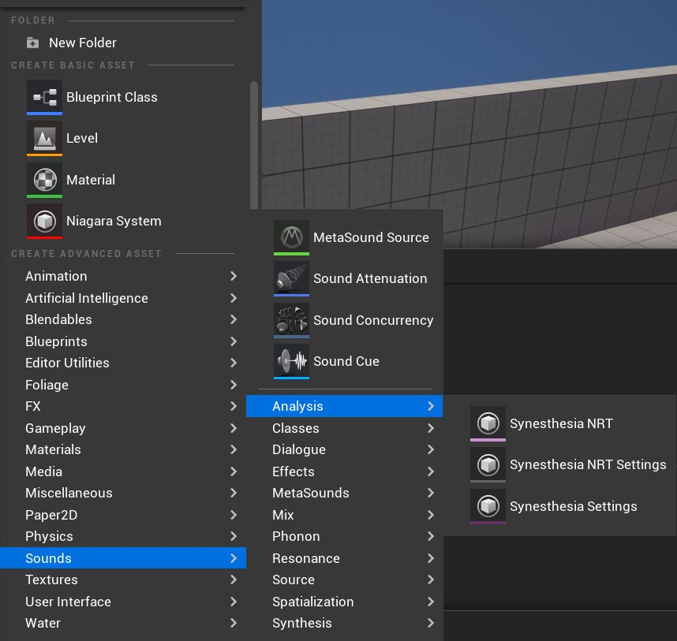
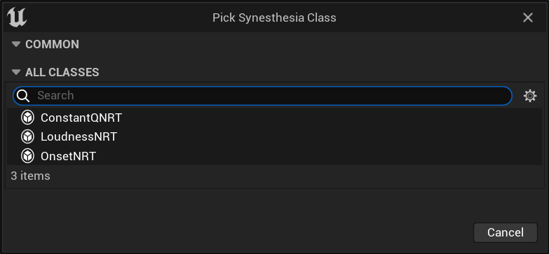
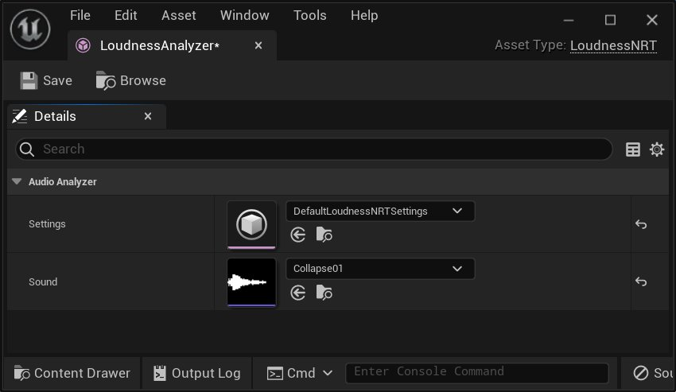
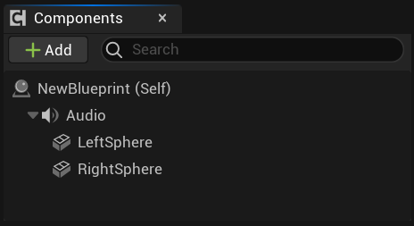
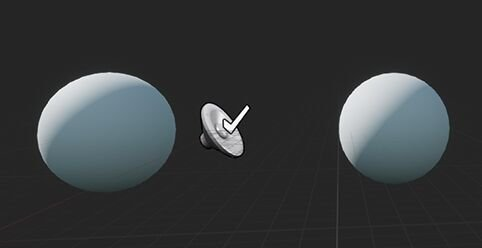
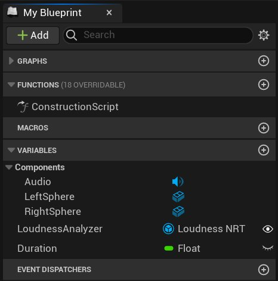
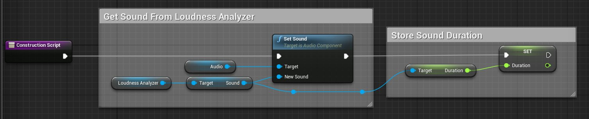
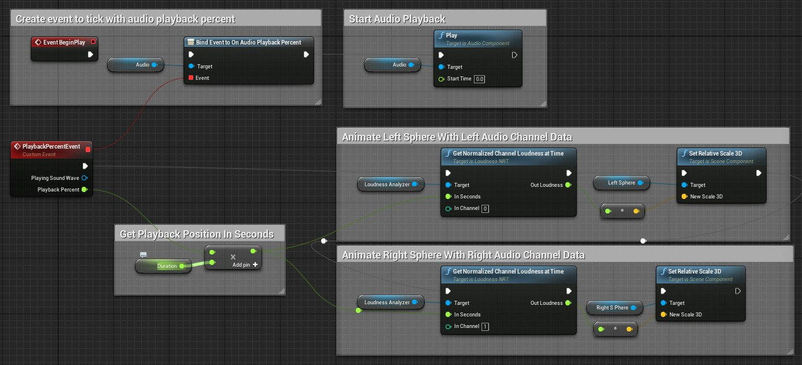

# 音频共感

> 路径：虚幻引擎5.7文档 / 处理音频 / 音频分析和可视化 / 音频共感

> 原始页面：https://dev.epicgames.com/documentation/unreal-engine/audio-synesthesia-in-unreal-engine

**音频共感（Audio Synesthesia）** 插件公开自动解压的音频元数据，可用于gameplay脚本和蓝图。此功能可帮助设计师驱动动画、效果和其他与音效紧密耦合的元素。

## 入门指南

> [!NOTE]
> 必须激活 **音频共感（Audio Synesthesia）** 插件才能使用此功能。前往 **编辑（Edit）> 插件（Plugins）> 音频（Audio）**，然后勾选 **音频共感（Audio Synesthesia）** 以启用。出现提示时重启引擎。

若添加新的音频共感（Audio Synesthesia）资源，虚幻引擎将自动创建其对的 **音频分析器（Audio Analyzer）**。可添加三种资源：

- 音频共感（Audio Synesthesia） NRT

  ：支持

  USoundWave

  非实时（

  NRT

  ）分析的分析器。
- 音频共感 NRT 设置（Audio Synesthesia NRT Settings）

  ：音频共感（Audio Synesthesia） NRT的设置，可用于修改设置的默认值。
- 音频共感设置（Synesthesia Settings）

  ：用于调整音频共感的默认设置。

新建资源时将显示下拉菜单。选择要执行的分析类型。

## 基本概念

`AudioSynesthesiaNRT` 对象的作用：

- 将分析算法设置关联到要分析的声波。
- 将分析结果保留为"uasset"。
- 提供可存取结果的蓝图函数。

使用 `AudioSynesthesiaNRT` 对象的所有音频分析均在编辑器中执行。Gameplay期间，在文件中读取分析结果。此操作将限制 `AudioSynesthesiaNRT` 对象分析游戏中生成的音频，但可避免运行时期间执行高开销的音频分析。

更新设置或在分析器中更新音效属性时将执行分析。

### 分析器使用方式范例

#### 创建并设置LoudnessNRT分析器

1. 添加 `AudioSynesthesiaNRT` 资源。可在 **音频（Audio）> 分析（Analysis） > AudioSynesthesiaNRT** 中找到 `AudioSynesthesiaNRT` 资源。
2. 在AudioSynesthesiaNRT分析器的下拉从菜单中选择 **LoudnessNRT**。
3. **可选（Optional）：**通过在下拉菜单中选择 **LoudnessNRTSettings**，可使用 **音频（Audio）> 分析（Analysis） > AudioSynesthesiaNRT** 添加 **AudioSynesthesiaNRTSettings** 对象。
4. 将 LoudnessNRT Sound 属性更新为你导入的音效文件。

使用之前创建的LoudnessNRTSettings更新LoudnessNRT Settings属性。

#### 在蓝图中利用LoudnessNRT

有多种在蓝图中使用LoudnessNRT的方式。以下范例为两个球体根据音频播放的响度变更大小。

1. 新建Actor蓝图，并将其添加到场景。
2. 打开蓝图，然后添加AudioComponent和两个球体。在所示范例中，将球体命名为 *LeftSphere* 和 *RightSphere*。

   

   
3. 添加两个变量：**LoudnessAnalyzer** 和 **Duration**。Duration应为 **浮点（float）**，LoudnessAnalyzer应为 **LoudnessNRT**。

   
4. 在构造脚本中：

   - 将音频组件的音效设为Loudness Analyzer中使用的音效。
   - 存储音效的总时长。

点击查看全图。

1. 在事件脚本中：

   - 设置

     AudioPlaybackPercent

     事件，以在每次更新音频播放百分比时触发事件。
   - 启动音频播放。
   - 将音效时长乘以播放百分比，得到播放时间（以秒计）。
   - 获取播放器中当前播放时间（以秒计）的标准化响度值。
   - 基于响度值设置球体的缩放。

点击查看全图。

## 非实时（NRT）分析器

### LoudnessNRT

LoudnessNRT分析器测量音频的感知响度。由于其和音频振幅相关，同时提供随时间变化的数字，因此其类似于envelope跟随器或分贝计。鉴于人类对音效感知的程度且对特定频率比较敏感，因此其与直线振幅测量不同。例如，口哨的振幅相当较低，但大家仍会觉得较为响亮。与最低的低音对比，该低音振幅可能极高，但众多听众却认为是音量适中。LoudnessNRT考虑了所有此类情况，将口哨标识为响亮，低音标识为中等响度。

**LoudnessNRTSettings** 用于配置LoudnessNRT分析器。LoudnessNRTSettings中最常调节的参数为：

- AnalysisPeriod

  控制测量频率。
- MinimumFrequency

  和

  MaximumFrequency

  控制目标频率。要完全忽略上端寄存器或下端寄存器中的某些内容，或要对比多个频率范围的响度活动时，此参数将十分有用。
- CurveType

  专门控制应利用的感知曲线。此参数通常为高级设置。
- NoiseFloorDb

  代表被视为静音的振幅。

### ConstantQNRT

**ConstantQNRT分析器（ConstantQNRT analyzer）** 测量音频中单个波段的强度。其代表给定时间处频率波段的响度，因此其与声谱图类似，不同点为其以感知意义的方式整理波段。使用ConstantQNRT分析器时，此类波段的整理方式与钢琴上的音符或多波段均衡器中的波段相同。

**ConstantQNRTSettings** 用于配置ConstantQNRT分析器。ConstantQNRTSettings中最常调节的参数为：

- AnalysisPeriod

  控制测量频率。
- StartingFrequency

  、

  NumBands

  和

  NumBandsPerOctave

  控制波段间距、宽度、位置和数量。
- DownMixToMono

  表示应单独处理音频通道，还是处理前先混合到单个音频通道中。

### OnsetNRT

**OnsetNRT分析器（OnsetNRT analyzer）** 探测来自大量源的音频起始事件，包括音符起始、敲击、扬声器爆破音和爆炸。OnsetNRT分析器向音符起始提供其时间戳和强度。

**OnsetNRTSettings** 用于配置OnsetNRT分析器。OnsetNRTSettings中最常调节的参数为：

- GranulartiyInSeconds

  决定各起始之间的最小间距。
- Sensitivity

  设置探测到起始前，该起始必须达到的响度阈值。
- MinimumFrequency

  和

  MaximumFrequency

  控制查找起始的频率范围。要完全忽略上端寄存器或下端寄存器中的某些内容，或要对比多个频率范围的起始活动时，此参数将十分有用。 *

  DownMixToMono

  表示应单独处理音频通道，还是处理前先混合到单个音频通道中。
