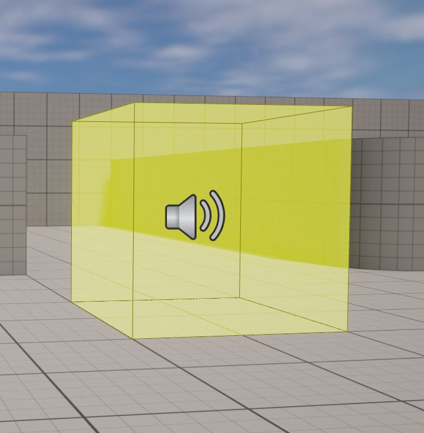
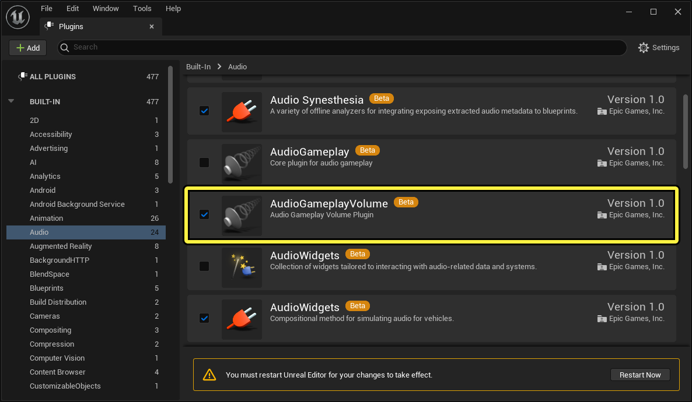
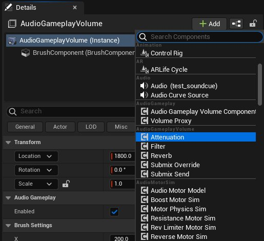
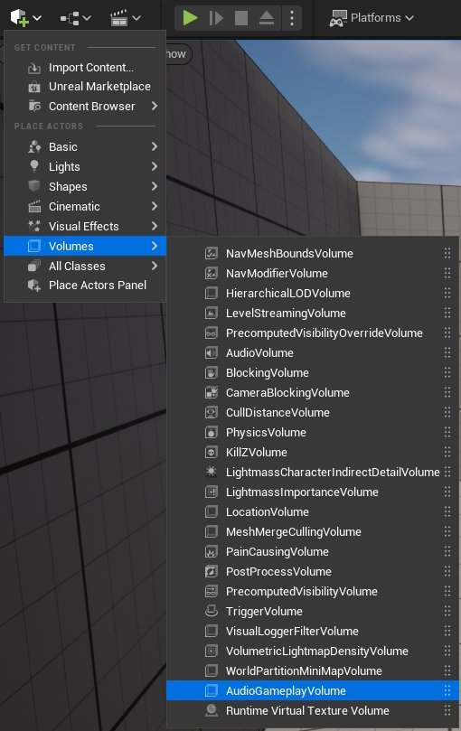
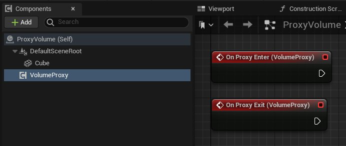

# 音频Gameplay体积概述

> 路径：虚幻引擎5.7文档 / 处理音频 / 音频Gameplay体积 / 音频Gameplay体积概述

> 原始页面：https://dev.epicgames.com/documentation/unreal-engine/audio-gameplay-volumes-overview

## 音频Gameplay体积

**音频Gameplay体积（Audio Gameplay Volumes）** 系统是基于区域的次世代声音处理方法，音效设计师可以定义一片物理区域，相对于听者位置对声音施加效果。

例如，在听者处于特定房间内时，你可以添加混响来模拟空间内的声波反弹，或者对房间外的声音应用低通滤波器，从而模拟墙壁的消声效果。

旧版[音频体积](../../audio-volume-actor/audio-volumes/index.md)系统会给音效设计师带来挑战，因为每个音频体积的功能在运行时固定不变，而且要修改引擎代码才能扩展。此外，每个音频体积上都提供了所有可用的设置，但是通常只需要用到一部分选项，所以会显得很繁琐。该系统还可能带来工作流程上的挑战，因为每个音频体积都需要在 **关卡（Level）** 中有单独的 **Actor** ，这会增加系统的集成难度。

作为旧版系统的替代品，这种新方法利用插件和基于组件的架构，解决了旧版方法的一些问题，同时为开发人员提供了更多的灵活性。

### 可扩展

你可以根据自己项目的需要，启用或禁用音频Gameplay体积插件。此外，你还可以使用所提供的C++ API或 **蓝图交互接口（Blueprint Interaction Interface）** ，通过新的效果、位置玩家交互等进行功能扩展。

### 基于组件的架构

音频Gameplay体积（Audio Gameplay Volume）使用模块化组件方法。每个组件都包含一种可配置的行为，你可以将组件单独或与其他组件组合添加到体积中，这样就可以为听者进入或退出体积的情况创建自定义功能。

这些组件提供了与旧版音频体积系统对等的功能，但由于每个功能集都是自己的组件，因此拥有更大的控制权。

行为组件类型如下：

- 衰减（Attenuation）

  ：将音频的当前体积（响度）内插到目标体积（响度）。
- 滤波器（Filter）

  ：对音频应用低通滤波器。
- 混响（Reverb）

  ：为音频添加混响效果。
- 子混合重载（Submix Override）

  ：重载

  声音子混合（Sound Submix）

  中的子混合音效果链（Submix Effect Chain）。
- 子混合发送（Submix Send）

  ：将音频发送到某个

  声音子混合（Sound Submix）

  。

每个组件都自带一个优先级（Priority）值，它决定了在监听器位于具有同类型有效组件的多个体积内的情况下使用哪个组件。

### 整合方法优化

音频Gameplay体积加强了与蓝图的集成，使音频设计师能够灵活地决定系统实现方式。体积可以作为Actor单独放置在关卡中，也可以作为组件添加给Actor蓝图。

你可以在蓝图Actor内实现自定义碰撞检查，模拟听者进入或退出体积的情况。因此，无需在关卡内手动调整位置或变换。

### 工作流程优化

在许多项目中，音频功能往往在项目末尾时才实现。因此，很难实现一个能与其他游戏逻辑功能完美整合的音频系统。音频Gameplay体积系统考虑到了这点，可以将体积组件绑定到关卡中的任意Actor上。

用户界面也更加简化，对音效设计师来说更加直观。

### 性能优化

体积处理和碰撞检测已从游戏线程转交给音频线程处理。这将有利于提升性能，并且你在扩展系统时无需担心线程安全。

### 代理功能

除了取代和增强旧版功能外，音频Gameplay体积系统还提供了新的 **代理（Proxy）** 功能。通过代理，即使没有传统音频Gameplay体积对象，也可以利用系统功能。

代理分为两种：

- 图元（Primitive）

  ：可将静态网格体用作自带进入和退出事件的体积。
- 条件（Condition）

  ：在满足特定条件时，无需物理体积即可使用功能。
