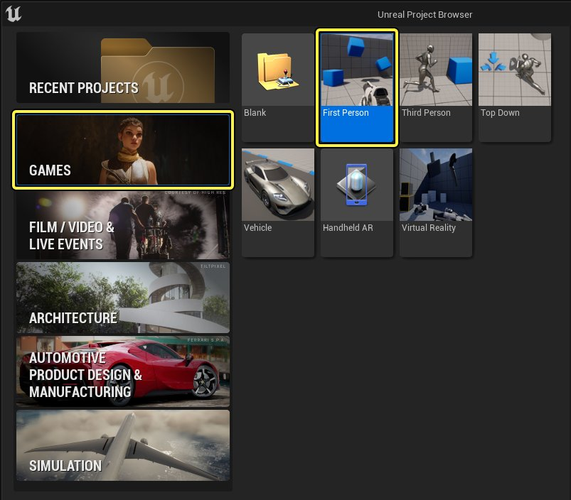
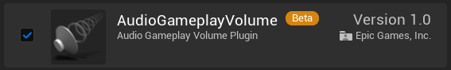
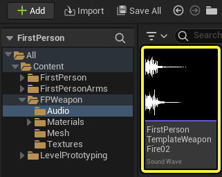
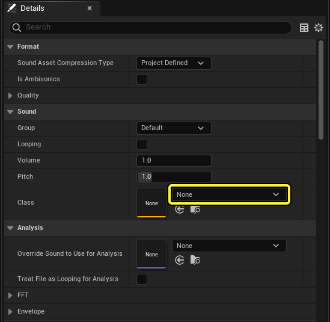
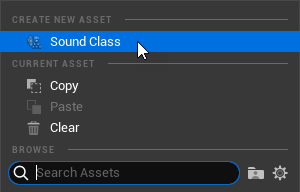
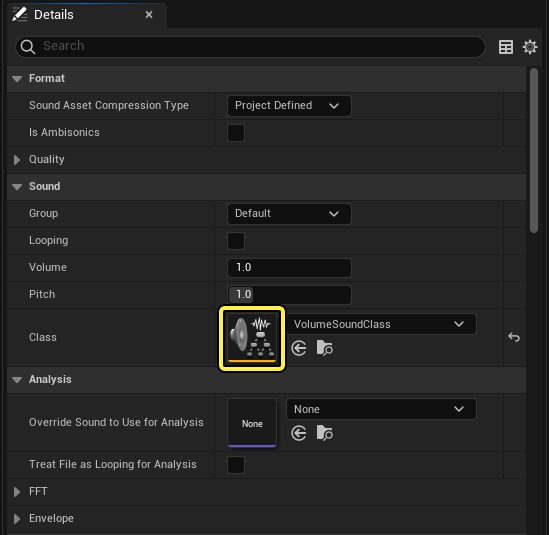
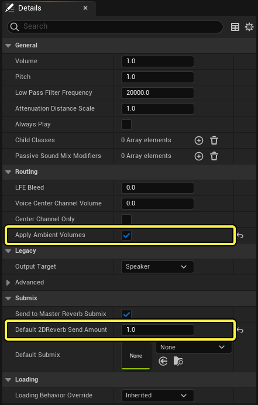
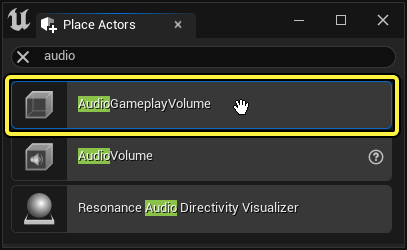

# 音频Gameplay体积快速入门

> 路径：虚幻引擎5.7文档 / 处理音频 / 音频Gameplay体积 / 音频Gameplay体积快速入门

> 原始页面：https://dev.epicgames.com/documentation/unreal-engine/audio-gameplay-volumes-quick-start

使用 **音频Gameplay体积（Audio Gameplay Volumes）** 可定义一些相对于听者位置的物理区域以便应用音效。

在本指南中，你将学习如何使用 **混响（Reverb）** 组件来设置基本的音频Gameplay体积，从而模拟空间内反弹的声波。

## 先决条件

- 使用[第一人称模板（First Person Template）](../../../understanding-the-basics/working-with-projects-and-templates/template-reference/index.md)创建一个全新项目。

  
- 默认情况下，音频Gameplay体积（Audio Gameplay Volumes）插件处于禁用状态。 要启用该插件，请通过选择 **编辑（Edit）> Plugins（插件）** 打开 **插件（Plugin）** 面板，使用搜索栏找到该插件，然后点击相应的复选框。

  

## 1 - 设置音效类

为了使用音频Gameplay体积，需要在正确设置的 **音效类（Sound Class）** 中包含 **声波（Sound Wave）** 资产。

> [!NOTE]
> 有关音效类的更多信息，请参阅[音效类](../../audio-mixing/sound-classes/index.md)。

1. 第一人称模板（First Person Template）有一个声波资产会在武器射击时进行播放。 使用

   内容浏览器（Content Browser）

   前往

   Content/FPWeapon/Audio

   。
2. 双击 **FirstPersonTemplateWeaponFire02** 声波以打开 **声波"细节"（Details）** 面板。

   
3. 点击 **音效（Sound）> 类（Class）** 下拉列表。

   
4. 在上下文菜单中选择 **音效类（Sound Class）** 以创建新的资产。

   
5. 输入新音效类的名称，并将其保存到

   内容（Content）

   文件夹中。
6. 双击这个新的 **音效类** 以打开 **音效类"细节（Details）"** 面板。

   
7. 启用

   路由（Routing）> 应用环境体积（Apply Ambient Volumes）

   以便可以在音频Gameplay体积中使用与此音效类关联的声音。
8. 在 **子混合（Submix）> 默认2D混响发送量（Default 2DReverb Send Amount）** 中输入1.0，以便将音效类中100%比例的声音发送到 **主混响子混合（Master Reverb Submix）**。

   
9. 保存音效类和声波资产。

## 2 - 放置音频Gameplay体积

1. 通过使用 **放置Actor（Place Actors）** 面板，或通过点击 **关卡编辑器工具栏（Level Editor Toolbar）** 中的 **快速添加（Quick Add）** 并选择 **体积（Volumes）> AudioGameplayVolume**，在关卡中放置 **AudioGameplayVolume**。

   
2. 将该体积放置在关卡中，以便角色可以进出该体积，例如直接放置在 `BP_Pickup_Rifle` 上方。

   > 图片已省略：Volume In Level

## 3 - 添加混响组件

音频Gameplay体积功能由组件进行驱动。 每个体积可能具有任意数量的这些组件，这些组件会影响该体积内部或外部相对于听者位置的声音。 对于此示例，请在体积中添加"混响（Reverb）"组件，使武器射击声音在玩家位于该体积内时回荡。

1. 选择 **音频Gameplay体积（Audio Gameplay Volume）** 后，点击 **细节（Details）** 面板中的 **添加组件（Add Component）** 按钮。

   > 图片已省略：New Volume Details
2. 在上下文菜单的 **音频Gameplay体积（Audio Gameplay Volume）** 分段下选择 **混响（Reverb）** 组件。

   > 图片已省略：Add Reverb Component
3. 在

   混响（Reverb）> 音量（Volume）

   中输入1.0以增加效果的响度。
4. 在 **混响（Reverb）> 淡入淡出时间（Fade Time）** 中输入0.0以便在进入该体积时立即应用效果。

   > 图片已省略：Reverb Component Details

## 4 - 设置混响效果

"Reverb（混响）"组件使用 **混响效果（Reverb Effect）** 资产应用其效果，因此你需要创建一个混响效果资产。

1. 选择新的 **混响（Reverb）** 组件后，点击 **混响（Reverb）> 混响效果（Reverb Effect）** 的下拉列表。

   > 图片已省略：Reverb Component Details
2. 在上下文菜单中选择 **混响效果（Reverb Effect）** 以创建新的资产。

   > 图片已省略：Create New Reverb Effect
3. 输入新混响效果的名称，并将其保存到

   内容（Content）

   文件夹中。
4. 双击这个新的 **混响效果** 以打开 **混响效果"细节（Details）"** 面板。

   > 图片已省略：Reverb Component Details
5. 在 **迟反射（Late Reflections）> 增益（Gain）** 中输入1.0以放大信号，使效果更容易被听到。

   > 图片已省略：Reverb Details
6. 保存该混响效果资产。

## 5 - 运行

1. 点击

   关卡编辑器工具栏（Level Editor Toolbar）

   中的

   运行关卡（Play Level）

   按钮。
2. 将角色移入

   BP_Pickup_Rifle

   以拿起武器。
3. 在体积内部或外部进行左键点击操作进行射击，并聆听声音的差异。

## 6 - 独立操作！

现在你已经完成了基本音频Gameplay体积的创建过程，接下来请考虑更进一步的操作。

尝试在新体积或现有体积中添加以下其他一些音频Gameplay体积组件类型：

- 子混合覆盖（Submix Override）

  ：为

  音效子混合（Sound Submix）

  添加

  子混合效果链（Submix Effect Chain）

  。 当听者进入体积时，此效果会应用于所有声音，无论是在体积内部还是外部。
- 子混合发送（Submix Send）

  ：将音频发送到

  音效子混合（Sound Submix）

  。 此效果会应用于体积内的声音，并且可以配置为在听者处于体积外部或内部时应用。
- 衰减（Attenuation）

  ：将音频的当前音量（响度）插值为目标音量（响度）。 此效果可以配置为在听者位于体积外部时应用于体积内的声音，或者相反。
- 滤波器（Filter）

  ：对音频应用低通滤波器。 此效果可以配置为在听者位于体积外部时应用于体积内的声音，或者相反。

> [!NOTE]
> 需要至少一个远离玩家的声音才能听到某些组件类型（例如 **衰减（Attenuation）** 和 **滤波器（Filter）**）的效果。 默认情况下，第一人称模板（First Person Template）不附带任何以这种方式设置的声音，因此需要一些额外的工作。
>
> 有很多方法可以做到这一点，但一个简单的做法是尝试将环境声音文件导入为 **声波（Sound Wave）** 资产，然后将其放置在关卡中的体积内部或外部。 请参阅[导入音频文件](../../sound-source/sound-waves/importing-audio-files/index.md)了解如何导入音频文件。
