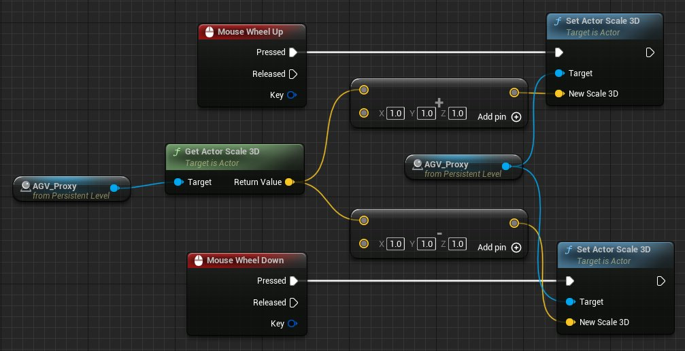
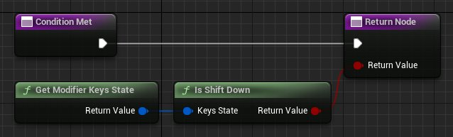
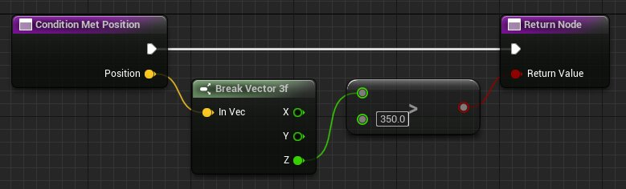

# 音量代理的快速入门指南

> 路径：虚幻引擎5.7文档 / 处理音频 / 音频Gameplay体积 / 音量代理的快速入门指南

> 原始页面：https://dev.epicgames.com/documentation/unreal-engine/volume-proxies-quick-start

你可以使用 **音量代理组件（Volume Proxy Components）** 与 **音频游戏音量（Audio Gameplay Volume）** 系统组合，无需加入传统的音频游戏音量（Audio Gameplay Volume）对象。

本指南将教你如何使用两种代理类型创建动态音量：**初始（Primitive）** 和 **条件（Condition）**。

## 先决条件

- 新建一个[第一人称模板](https://docs.unrealengine-gamedev.ol.epicgames.net/5.2/zh-CN/unreal-engine-templates-reference)对象。
- 通过选择 **编辑>插件**，使用搜索栏找到该插件，然后点击相应的复选框，从 **插件** 面板上启用音频游戏音量[插件](https://docs.unrealengine.com/5.1/zh-CN/working-with-plugins-in-unreal-engine/)。

## 1 - 设置一个环境音量的音效类

为项目新建并配置一个 **音效类（Sound Class）**，用于支持音频游戏音量。

1. 新建一个 **音效类**。

   1. 在 **内容浏览器（Content Browser）** 中,点击 **添加（Add）** 按钮。
   2. 选择 **音频（Audio）>类（Classes）>音效类**。
   3. 命名新创建的资产，例如 `AGV_SoundClass`。
2. 双击该音效类以打开 **音效类编辑器（Sound Class ditor）**。
3. 在 **细节（Details）** 面板中:

   1. 启用 **路由（Routing）>应用环境音量（Apply Ambient Volumes）**。
   2. 设置 **子混合（Submix）>默认2D混响发送量（Default 2DReverb Send Amount）** 为1.0，然后保存。
4. 将音效类设为项目默认值（Project Default）**这将把它分配给所有未指定音效类覆盖的声源。

   1. 通过点击上方菜单栏中的 **编辑（Edit）>项目设置（Project Settings）** ，打开 **项目设置**。
   2. 在搜索栏中输入"默认音效类（Default Sound Class）"。
   3. 点击 **音频>默认音效类** 边上的下拉菜单，选择你新建的音效类。

## 2 - 使用混响组件创建一个蓝图Actor

使用混响组件（Reverb Component）新建一个蓝图（Blueprint）Actor作为你将在以下步骤中添加的代理组件的基础。

> [!NOTE]
> 你可以为 **任意** 蓝图Actor添加代理组件。连接到代理Actor的音频游戏音量组件，会像在传统的音频游戏音量对象上一样正常运行。

1. 为音频游戏音量代理新建一个蓝图Actor。

   1. 在 **内容浏览器中**,点击 **添加** 按钮。
   2. 选择 **蓝图Actor**。
   3. 从 **选取父类（Pick Parent Class）** 窗口选择 **Actor**。
   4. 命名新创建的资产，例如 `AGV_Proxy`。
2. 双击 **内容浏览器** 中的代理蓝图类（Proxy BluePrint Class），打开 **蓝图编辑器（Blueprint Editor）**。
3. 添加一个混响组件。

   1. 在 **组件（Components）** 面板中，点击 **添加（Add）** 按钮。
   2. 在搜索栏中输入"混响（Reverb）"，然后按下回车。
4. 选择新的混响组件（默认命名为 `ReverbVolume` ）
5. 在 **细节** 面板中调整混响组件的属性。

   1. 设置 **混响>音量（Volume）** 为1.0。
   2. 设置 **混响>消退时间（Fade Time）** 为0.0。
   3. 点击 **混响>混响效果（Reverb Effect）** 边上的下拉菜单。在新建资产标题下，选择 **混响效果**。
   4. 命名新的混响效果，例如 `AGV_Reverb`，然后保存。
6. 修改混响效果

   1. 双击 **混响>混响效果** 旁边的图标，打开 **混响效果编辑器（Reverb Effect Editor）**。
   2. 设置 **后期反射（Late Reflections）>增益（Gain）** 为1.0，使效果听起来更加清晰。
   3. 保存混响效果并关闭混响效果编辑器。

## 3 - 构建一个初始代理

**初始代理（Primitive Proxy）** 使用Actor上的原始静态网格体作为碰撞的基础，从而触发进入和退出事件。

### 3A - 添加一个初始代理组件

添加基础音量代理组件，然后将它的类型设置为"初始（Primitive）"。

1. 添加一个音量代理组件。

   1. 在 **组件（Components）** 面板中，点击 **添加** 按钮。
   2. 在搜索栏中输入"音量代理（Volume Proxy）"，然后按下回车。
   3. 将组件命名为 `PrimitiveProxy`。
2. 选择这个初始代理组件。
3. 在 **细节** 面板中，设置 **音频游戏>代理** 为AGV初始代理（AGV Primitive Proxy）。

### 3B - 添加静态网格体组件

添加一个静态网格体，并配置它的碰撞，以便你可以进入和退出它。

> [!WARNING]
> 初始代理（Primitive Proxy）目前不支持多个静态网格体组件的Actor。如果你使用了这样的Actor，输出日志中将会出现警告提示。

1. 添加静态网格体组件。

   1. 在 **组件** 面板中，点击 **添加** 按钮。
   2. 在搜索栏中输入"静态网格体"，然后在列表中选择一个基本形状（Basic Shape），例如球体（Sphere）。
2. 选择 **静态网格体** 组件。
3. 在 **细节** 面板中设置碰撞（Collision）参数。

   1. 禁用 **碰撞>生成重叠事件（Generate Overlap Events）**。
   2. 设置 **碰撞>角色可迈上去（Can Character Step Up On）** 为否（No）。
   3. 设置 **碰撞>预设（Presets）** 为自定义（Custom）。
   4. 在 **碰撞>碰撞预设>碰撞响应（Collision Responses）**下，选择**重叠（Overlap）**。此设置将所有响应类型选择为重叠。
4. 保存蓝图。

### 3C - 在关卡中放置代理Actor

1. 将代理Actor从 **内容浏览器** 中拖到 **关卡**中，放置代理Actor。
2. 使用变换控件，放置Actor，让你的角色可以在其中移动。

### 3D - 构建关卡蓝图

构建蓝图图表，用鼠标滚轮输入来控制代理Actor的规模。

1. 在关卡中选择代理Actor。
2. 在 **关卡编辑器工具栏（Level Editor Toolbar）**，点击 **蓝图（Blueprint）** 按钮，然后选择 **打开关卡蓝图（Open Level Blueprint）**。
3. 在空白处右击，为代理Actor **创建引用**。
4. 在 **Actor引用（Actor Reference）** 节点上，拖移输出引脚并创建一个 **获取Actor 3D缩放（Get Actor Scale 3D）** 节点。
5. 在 **获取Actor缩放3D** 节点上，拖移 **返回值** 引脚， 创建一个 **加（Add）** 和一个**减（Subtract）** 节点。
6. 在 **加** 和 **减** 节点上，在底部输入的X，Y和Z中输入1.0。
7. 在 **Actor引用** 节点上，拖移输出引脚并创建两个 **设置Actor 3D缩放（Set Actor Scale 3D）** 节点。
8. 将 **加** 节点的输出与一个 **设置Actor 3D缩放** 节点连接起来。
9. 在相同的 **获取Actor缩放3D** 节点上，拖移 **执行输出（Exec Input）(>)** 引脚， 创建一个 **鼠标滚轮上滚（Mouse Wheel Up）** 节点。
10. 将 **减** 节点的输出与另一个 **设置Actor 3D缩放** 节点连接起来。
11. 在相同的 **获取Actor缩放3D** 节点上，拖移 **执行输出（>）** 引脚， 创建一个 **鼠标滚轮下滚（Mouse Wheel Down）** 节点。

### 3E - 测试关卡

点击 **关卡编辑器工具栏（Level Editor Toolbar）** 中的 **运行（Play）**，通过移动鼠标捡起步枪，然后左键点击开火。你可以通过鼠标滚轮改变代理的规模。

从音频游戏音量代理中移入和移出，注意它如何影响步枪的射击声。混响效果仍然适用于动态调整大小的代理。

## 4 - 构建一个条件代理

**条件代理** 根据蓝图中指定的条件，通过 **音频游戏条件** 接口，触发进入和退出事件。

### 4A - 添加条件代理组件和接口

添加基础音量代理组件，然后将它的类型设置为条件。

1. 双击 **内容浏览器** 中的代理蓝图类（Proxy BluePrint Class），打开 **蓝图编辑器（Blueprint Editor）**。
2. 添加一个音量代理组件。

   1. 在 **组件（Components）** 面板中，点击 **添加（Add）** 按钮。
   2. 在搜索栏中输入"音量代理（Volume Proxy）"，然后按下回车。
   3. 将组件命名为 `ConditionProxy`。
3. 选择这个条件代理（ConditionProxy）组件。
4. 在 **细节** 面板中，设置 **音频游戏>代理** 为"AGV条件代理（AGV Condition Proxy）"。

### 4B - 添加音频游戏条件接口

添加音频游戏条件接口，使你能够在蓝图中编写条件。这会新加入两个接口，**Condition Met** 和 **Condition Met Position**。

1. 在 **蓝图编辑器工具栏（Blueprint Editor Toolbar）** 中，点击 **类设置（Class Setting）**。
2. 在 **接口(Interfaces)>已实现的接口（Implemented Interfaces）**中点击 **添加（Add）**。
3. 在搜索栏中输入"游戏音频条件（AudioGameplayCondition）"，然后按下回车。

### 4C - 构建Condition Met接口

**Condition Met** 接口用于设置任何会产生布尔值的条件。有了它，你可以对定义在音量内外的内容制定自己的自定义标准。

在蓝图中创建一个shift键状态检测，用于驱动 **Condition Met** 接口。

1. 在 **我的蓝图（My Blueprint）** 面板中，双击 **接口>音频游戏条件** 下的 **Condition Met** 接口。
2. 在 **返回** 节点上，拖移 **返回值** 引脚， 创建一个 **Shift为按下（Is Shift Down** 节点。
3. 在 **Shift为按下（Is Shift Down）** 节点上，拖移 **键状态（Keys State）** 引脚， 创建一个 **获取修改器关键帧状态（Get Modifier Keys State）** 节点。

### 4D - 构建Condition Met Position接口

**Condition Met Position** 接口与Condition Met接口类似，但允许你访问监听器（listener）的位置，以便在你的自定义条件中使用。

在蓝图中创建一个监听器高度状态检测（listener height check），用于驱动 **Condition Met Position** 接口。

1. 在 **我的蓝图（My Blueprint）** 面板中，双击 **接口>音频游戏条件** 下的 **Condition Met Position** 接口。
2. 在 **Condition Met Position** 节点上，拖移 **位置（Position）** 输出引脚并创建一个 **拆分Vector 3f（Break Vector 3f）** 节点。
3. 在 **拆分Vector 3f** 节点上，拖移 **Z** 输出引脚并创建一个 **大于（Greater）** 节点。
4. 在 **大于** 节点上

   1. 输入底部输入值为350.0
   2. 将输出引脚连接到 **返回节点（Return Node）**。
5. 保存蓝图。

### 4E - 测试关卡

点击 **关卡编辑器工具栏** 上的 **播放** 按钮，测试步枪的开火声。当按住Shift键或在平台上方拍摄时，代理的混响效果也会适用。

## 5 - 自行尝试！

现在，你已经完成了两个基本的音量代理的创建，可以考虑进一步推进这个项目。下面是关于自行尝试的一些建议：

- 你已经添加了自定义触发器，但你也可以使用蓝图中的 **代理进入（On Proxy Enter）** 和 **代理退出（On Proxy Exit）** 事件节点添加自定义响应。想要创建一个自定义响应，选择事件的目标音量代理组件，在 **事件图表（Event Graph）** 的空白处点击右键，并添加 **代理（On Proxy）** 事件节点。
- 镜头在一般情况下默认为是监听器，用于检测进入和退出事件。在第三人称镜头下，你可能希望监听器代替玩家角色。尝试使用条件代理来覆盖[第三人称模板](https://docs.unrealengine-gamedev.ol.epicgames.net/5.2/zh-CN/third-person-template-in-unreal-engine/)项目中的默认音量碰撞。
