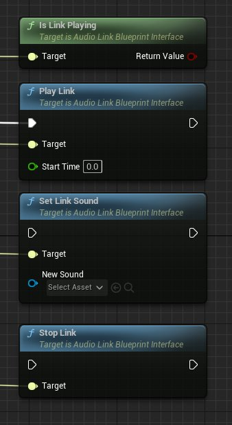

# AudioLink概述

> 路径：虚幻引擎5.7文档 / 处理音频 / Audio Link / AudioLink概述

> 原始页面：https://dev.epicgames.com/documentation/unreal-engine/audiolink-overview

**AudioLink** 是一个API，用于将虚幻音频引擎关联到外部软件，例如其他音频引擎。借助硬件抽象，AudioLink绕过了对硬件的直接访问，能同时发挥虚幻音频引擎和关联外部软件的优势。

## AudioLink可以传输什么？

AudioLink借助三种链接类型来传输数据。

- 源（Sources）

  - 输出预衰减来源的脉冲编码调制（PCM）数据。支持的来源包括MetaSounds、Sound Cues和Sound Waves。
- Submix

  - 输出特定Submix的PCM数据。
- 音频组件（Audio Component）

  - 从音频组件使用的预衰减源输出PCM数据。它与独立源的处理方式不同，使用的是不同的API。

## 如何启用AudioLink

根据实现方式，你可能需要自定义设置。通常情况下，实现方在虚幻引擎(UE)的启动阶段会注册一个 **AudioLink Factory**，用于启用AudioLink。

在虚幻编辑器中，每个链接类型都有一个 **Send to AudioLink** 参数，用来启用传输，以及一个 **AudioLink设置** 参数，用来选择修改默认设置。即使AudioLink被禁用，这些选项也会持续存在，所以不会有任何损失。

### 启用源传输

AudioLink属性可以通过与音源相关的 **音效衰减** 资产进行访问。在源的 **细节（Detail）** 面板中，在 **衰减（Attenuation） > 衰减设置（Attenuation Settings）** 下找到或创建相关资产。

你可以在音效衰减资产的 **细节** 面板，在 **衰减（AudioLink）** 中，设置 **启用发送到AudioLink** 标志和 **AudioLink设置覆盖** 属性。

> [!NOTE]
> 尽管名字如此，但音效衰减资产的功能是源属性的集合，而不是专门用于衰减。

### 启用Submix传输

你可以在Submix的 **细节** 面板中，在 **AudioLink**下，设置 **发送到AudioLink** 标志和 **AudioLink设置** 属性。

> [!WARNING]
> 将相同的Submix和音源组合在一起，会导致混合音频发生堆叠和过响。

### 启用音频组件传输

音频组件支持已经包括在AudioLink中，但通常情况下是不必要的。因为源在设计上是无组件的，为缩放进行了高度优化，并提供引擎级支持。然而，有些情况下必须使用音频组件，例如用于光线投射空间化。

根据具体实现，你可能需要自定义音频组件的传输。不过，蓝图的接口是标准化的。实现 `AudioLinkBlueprintInterface` ，提供对以下API的访问。

> [!NOTE]
> - 在
>
>   SetLinkSound
>
>   函数上，你可以把
>
>   NewSound
>
>   设置为任何
>
>   USoundBase
>
>   对象，包括MetaSound、Sound Wave或Sound Cue。
> - 我们特意其将命名为
>
>   PlayLink
>
>   ，好让你可以将它与其他"播放"调用一起纳入组件。如果有必要，你可以重定向PlayLink功能。

## 如何禁用AudioLink

你可以用 `au.audiolink.enabled` 控制台变量禁用AudioLink。

## 限制

- 同时运行一个以上的音频引擎会产生额外的开销。尽管虚幻音频引擎经过高度优化，但是我们建议你在项目中评估使用情况。
- 由于硬件共享的限制，硬件解码器不支持在UE内部运行的源。然而，UE支持高效的软件解码器，如Bink Audio和Ogg Vorbis。
- AudioLink目前最多只支持八个通道的音源。
- 目前不支持Ambisonic音源或基于对象的格式。

## 故障排除

- 使用控制台命令

  log LogAudioLink All

  来向日志输出更详细的信息。
- 请确保你在UE注册了AudioLink Factory。日志信息将表明它是否正常运作。
- 确保你在源或Submix上启用

  发送到AudioLink

  标志。
- 对包含同一信号链的源和Submix的配对要格外小心，因为这可能导致数据重复，并导致过响和不需要的音频堆叠。
- 每个编辑器和游戏窗口，包括Play In Editor(PIE)，都有自己的虚幻音频引擎实例。这个实例很有用，但在生命周期管理上可能会引起一些麻烦。比如，编辑器的Submix在Startup阶段实例化。由于这类实例化出现在早期，如果AudioLink Factory没有在早期即使实例化，它可能会错过Submix。请仔细调整你的实例化生命周期。
