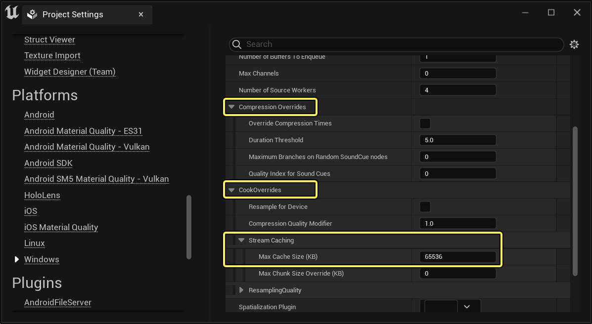
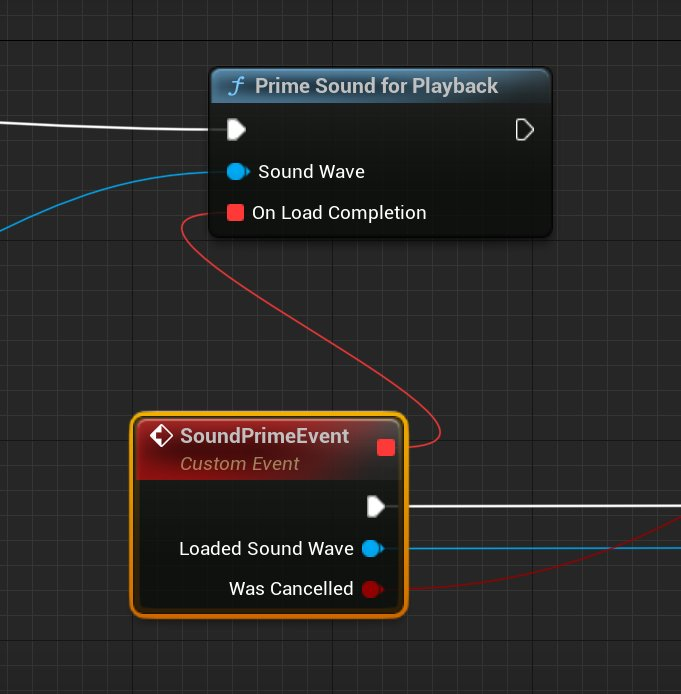
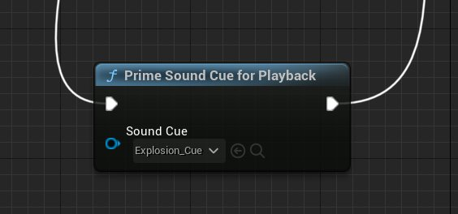
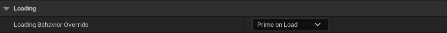
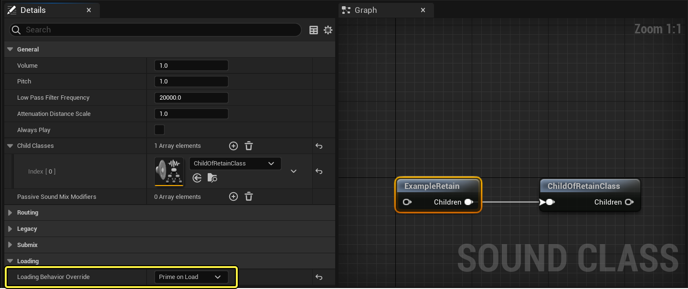
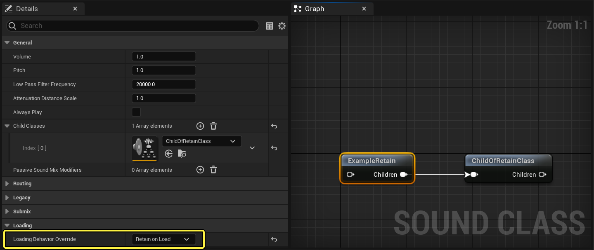
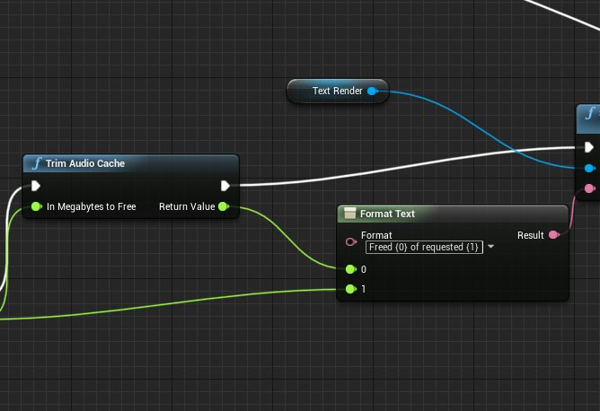
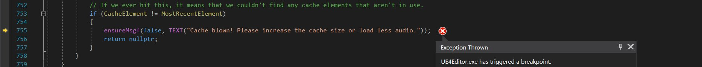

# 音频流缓存概述

> 路径：虚幻引擎5.7文档 / 处理音频 / 音频内存管理 / 音频流缓存概述

> 原始页面：https://dev.epicgames.com/documentation/unreal-engine/an-overview-of-audio-stream-caching-in-unreal-engine

**音频流缓存** 大大改变了音频加载以及从内存释放的方式。

在烘焙时，几乎所有压缩音频数据都会从 `USoundWave` 资源分离出来，置于 `.pak` 文件末尾。这样，音频就能随时加载到内存中，若近期未被使用也可重新释放。

这种内存管理方法在开放世界场景游戏中很流行，在这些游戏中，很难提前确定特定用例的实际音频需求。此法的主要缺点是，由于 `USoundWave` 需要加载，因此不能保证音频即时播放。但优点是一旦采用这种系统，设计人员就能够在不超出内存界限的情况下引用尽可能多的音频资源。工程师还可利用此系统加载和引用压缩音频数据块，无需依赖音频引擎管理的状态。此外，比起减少不使用流缓存时出现的内存问题，还是减少使用流缓存播放音频时的延迟更简单些。

## 确定正确的缓存大小

除明确标记为留在内存中的标头和音效数据之外，**最大缓存大小（Max Cache Size）** 是压缩音频数据使用内存的硬限制。若缓存太小，音效卸载速度过快，会导致加载音效时产生延迟。

### 极端示例

如果缓存限制设为8MB。每个数据块最大为256KB，所以任何时候缓存里最多有32个数据块。这意味着若一次播放32个音效，就不能再加载更多数据块了。

### 不那么极端的示例

假设缓存限制设为16MB。缓存里最多可以有64个256KB数据块。若一次性播放32个音效，则还有缓存可再播放32个音效。但若正在播放的32个音效都很长，每个都包含多个数据块，那么按顺序加载的下一个数据块将仍自动加载到缓存。这意味着在此期间，准备要播放的任何音效都将被为32个正在播放的音效而预先加载的32个数据块所堵住。

### 普通示例

如果将缓存限制设为32MB。它可能包含128个元素，每个元素最大为256KB。如果当前正同时播放32个音效，则还可以在缓存中预存96个额外的音频数据块，避免延迟。若限制为48MB，则可包含192个元素，因此即使正在同时播放32个音效，还可预备160个数据块。

## 配置缓存大小

1. 打开项目后，从主菜单选择 **编辑（Edit）> 项目设置（Project Settings）**。
2. 从 **项目（Project）** 菜单中，转到 **平台（Platforms）> Windows > 音频（Audio）> 压缩覆盖（Compression Overrides）> 烘焙覆盖（CookOverrides）> 流缓存（Stream Caching）**。
3. 设置 **最大缓存大小(KB)（Max Cache Size (KB)）** 以确定缓存中可容纳的元素数量。

此值若设为 **0**，则此值默认为32KB。最大缓存大小为2,147,483,647 MB，但注意不要设置得太大，以免运行的机器内存不足。

## 通过及时缓存音效以避免延迟

理想情况下，音效在轮到播放时始终已在内存中。可通过以下方式实现这一点：

### 准备好要播放的音效

若预测未来将播放某个音效，可在蓝图中调用 *Prime Sound For Playback*（或C++环境下的 *UAudioMixerBlueprintLibrary::PrimeSoundForPlayback*）：

例如，在开放世界场景游戏中，当玩家走进汽车周围几英尺范围内时，车辆音效和无线电台就会加载到缓存中。若玩家未进入汽车，音效将保留在缓存中，直至最终释放。

声音提示也可提前准备，但加载完成时不触发委托。（**委托** 是一个类，包含指向某对象实例的指针或引用，即要在该对象实例上调用的该对象类的成员方法，以及提供触发该调用的方法。）

### 设置音效的默认加载行为

若要音效在加载后短时间内就播放，可将声波的加载行为设为 **加载后准备（Prime on Load）**：

也可将声波的音效类的加载行为设为 **加载后准备（Prime on Load）**：

此外，还可通过将 `au.streamcache.DefaultSoundWaveLoadingBehavior` 设为 **2**，将所有声波设为加载后准备。

## 将音效保留在内存中

若音效在任何情况下都必须无延迟播放，可在USoundWave的整个持续时间内将该音效保留在内存中。

### 强制声波留在内存中

若将声波的加载行为设为 **加载后保留（Retain on Load）**，即是将该音效的第一个音频数据块永久存放在缓存中。

通过将 *au.streamcache.DefaultSoundWaveLoadingBehavior* 设为 *2*，可将所有声波设为默认保留第一个数据块。

## 微调内存

若应用程序需要更多内存，可使用 **Trim Audio Cache** 函数（`UAudioMixerBlueprintLibrary::TrimAudioCache`）释放缓存中不使用的音频数据块。

**Trim Audio Cache** 函数迭代缓存并释放未在使用的数据块，直至达到 **In Megabytes To Free** 参数指定的内存量。此函数返回成功释放的内存。

在C++环境下调用时，此函数是线程安全的。但要记住，它会锁定缓存，开销可能会很大。这意味着此函数运行时，流送音频的缓存可能会欠载。

## 清理缓存

若尝试在缓存的所有元素都在使用时加载或播放音频数据块（原因是数据块正在播放或正在从磁盘加载），则将清理缓存。在这种情况下，这可确保达到 `AudioStreamingCache.cpp`：

若总是在清理缓存，有五个选择：

*增加缓存大小。* 减少保留的声波数量。 *降低声音限制。* 减少清理缓存后尝试加载的音效数量。 * 忽略它并删除数据块请求。

## 增加最坏情况下的缓存利用率

在有很多短音效的情况下，缓存中将填充很多小数据块，这样仅用到缓存空间的一小部分。

例如，缓存大小为128个数据块，每个数据块最大为256KB，若加载了大量64KB的音效，就只会用到8M缓存，而上限是32MB。

为了做出补偿，可将数据块最大数量设为大于 **MaxCacheSize/MaxChunkSize**，保留池中当前分配的字节数的运行计数器，并在内存计数器达到缓存大小或达到数据块最大数量时，驱逐最早的数据块。使用cvar `au.streamcaching.MinimumCacheUsage` 确定数据块最大数量。

### 设置au.streamcaching.MinimumCacheUsage

`au.streamcaching.MinimumCacheUsage` 可设为 **0.0–1.00**。此参数仅可在 `IAudioStreamingManager` 初始化之前设置。在游戏期间设置此参数不产生任何效果。

增大此值会增加缓存中可存在的数据块的最大数量。例如，若 `au.streamcaching.MinimumCacheUsage` 为0.75，缓存大小为32MB，则数据块最大数量将为512。若加载了大量64KB音频资源，仍可使用32MB。这意味着 `au.streamcaching.MinimumCacheUsage` 越接近1，要充分利用缓存所需的数据块平均大小就越小。

| au.streamcaching.MinimumCacheUsage | 缓存大小(MB) | 数据块最大数量 | 达到100%利用率所需的数据块最小平均大小(KB) |
| --- | --- | --- | --- |
| 0.0 | 32 | 128 | 256 |
| 0.0 | 16 | 64 | 256 |
| 0.5 | 32 | 256 | 128 |
| 0.5 | 16 | 128 | 128 |
| 0.75 | 32 | 512 | 64 |
| 0.75 | 16 | 256 | 64 |
| 0.825 | 32 | 1024 | 32 |
| 0.825 | 16 | 512 | 32 |

不论单独音频资源有多大，都无法保证100%利用缓存，除非数据块的最大数量为无穷大。

增大 `au.streamcaching.MinimumCacheUsage` 有如下含义：

- 由于在最坏情况下缓存中保留的音频更多，所以平均磁盘IO读取的次数会减少。
- 由于可处理更多较小的数据块，平均内存利用率增加。
- 查找缓存中数据块所需的平均CPU成本增加。
- 插入/驱逐数据块的成本保持不变。

### 使用 au.streamcaching.TrimCacheWhenOverBudget

`au.streamcaching.TrimCacheWhenOverBudget` 值默认为 **1**。这解决了当 `au.streamcaching.MinimumCacheUsage` 设为任何大于零的值时，流缓存中泄露内存的潜在矢量。为LRU缓存中的大资源而驱逐小资源时，就会发生此泄露。由于这种情况可能会连续多次发生，会导致缓存利用率大大超过目标最大缓存大小。

`au.streamcaching.TrimCacheWhenOverBudget` 使用的解决方案是去除最近最少使用的数据块，直至回到预算之内。这种权衡在于，准备或播放音效的调用会导致最近最少使用的音效被驱逐。

## 确定音频读取的优先级

音频数据块是利用 `IAsyncReadRequest` 的实例从磁盘中读取的，类似于纹理流送和几何体流送系统。因此，可使用cvar `au.streamcaching.ReadRequestPriority` 将音频数据块加载的优先级置于引擎中其他流送系统之上或之下。此值范围为0–4，0是最高优先级，4是最低优先级。缓存音频流送请求的默认值为 **2**。

| au.streamcaching.ReadRequestPriority | AsyncIOPriority | 其他使用此优先级的流送管理器 |
| --- | --- | --- |
| 0 | AIOP_High | 动画、纹理、着色器代码 |
| 1 | AIOP_Normal | 异步pak读取 |
| 2 | AIOP_BelowNormal | 几何体流送 |
| 3 | AIOP_Low |  |
| 4 | AIOP_MIN |  |
