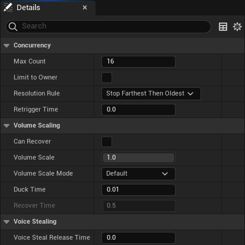
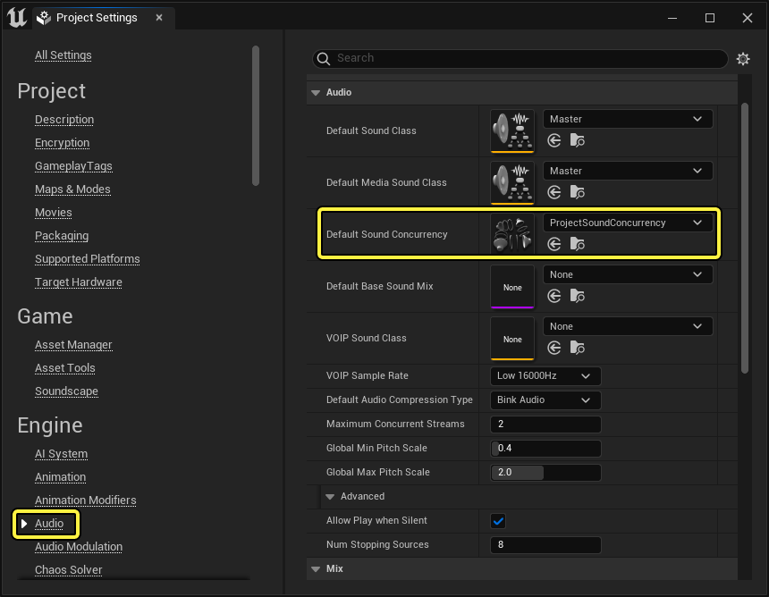
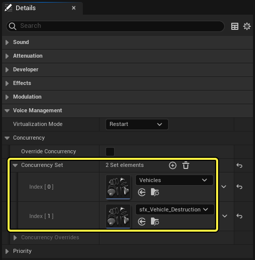
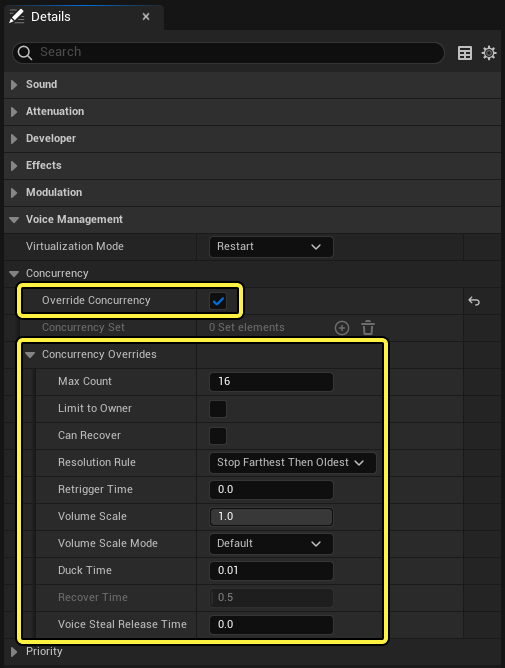

# 音效并发参考指南

> 路径：虚幻引擎5.7文档 / 处理音频 / 音频内存管理 / 音效并发参考指南

> 原始页面：https://dev.epicgames.com/documentation/unreal-engine/sound-concurrency-reference-guide

若同时播放太多音效，可能会造成资源消耗极高和性能低下。**音效并发（Sound Concurrency）** 资产是你可以用于处理该问题的主要工具之一。利用音效并发资产，你可以限制同时播放的音效数量，以及在达到该限制时怎么办。你可以将这些规则分配给单独的音效、成组的音效或项目中的所有音效。

### 创建音效并发资产

要创建音效并发，你可以在 **内容浏览器（Content Browser）** 中点击 **添加（Add）** 按钮并选择 **音效（Audio）> 音效并发（Sound Concurrency）** 。

### 编辑音效并发资产

要编辑音效并发的属性，你可以在 **内容浏览器（Content Browser）** 中双击音效并发，或右键点击它并在上下文菜单中选择 **编辑…（Edit…）** 。界面上将显示资产的 **细节（Details）** 面板。

### 细节

##### 并发

| 属性 | 说明 |
| --- | --- |
| **最大数量（Max Count）** | 在 **分辨率规则（Resolution Rule）** 生效之前，此组中允许的并发活动音效的最大数量。 |
| **限制为所有者（Limit to Owner）** | 启用后，这些并发规则仅适用于播放音效的每个Actor。 |
| **分辨率规则（Resolution Rule）** | 设置在达到 **最大数量（Max Count）** 时要遵循的行为： **防止新音效（Prevent New）** ：防止新的音效开始。 **停止最旧音效（Stop Oldest）** ：停止最旧的播放音效。 **停止最远音效，然后防止新音效（Stop Farthest Then Prevent New）** ：停止最远的音效。如果所有音效都是相同距离，则防止新的音效开始。 **停止最远音效，然后停止最旧音效（Stop Farthest Then Oldest）** ：停止最远的音效。如果所有音效都是相同距离，则改为停止最旧的音效。 **停止最低优先级（Stop Lowest Priority）** ：停止优先级最低的音效。如果所有音效的优先级相同，则改为停止最旧的音效。 **停止最安静音效（Stop Quietest）** ：停止最安静的音效。 **停止优先级最低音效，然后防止新音效（Stop Lowest Priority Then Prevent New）** ：停止优先级最低的音效。如果所有音效的优先级相同，则防止新的音效开始。 |
| **重新触发时间（Retrigger Time）** | 相邻两次播放音效之间的等待时间（以秒为单位）。此设置拒绝的音效会忽略可视化设置。 |

> [!NOTE]
> 所有活动组件都计入 **最大数量（Max Count）** ，而不仅仅是积极播放的音效。这可能会影响在不播放音频的情况下仍能保持活跃的系统，例如合成器。这还可能影响 **源总线（Source Buses）** ，因为它们在你的 **最大数量（Max Count）** 中占用了两个位置：一个用于原始源，一个用于总线。即使源设置为 **仅输出到总线（Output to Bus Only）** ，仍是如此，因为它仍是活动组件。

##### 音量比例

| 属性 | 说明 |
| --- | --- |
| **可以恢复（Can Recover）** | 启用后，允许音量缩放在组中的所有音效停止播放后恢复到其默认值。 |
| **音量比例（Volume Scale）** | 应用于较旧音效的比例因子（压低），它基于 **音量比例模式（Volume Scale Mode）** 复合。 |
| **音量比例模式（Volume Scale Mode）** | 基于组中的活动音效的属性，设置要使用的音量比例行为： **默认值（Default）** ：缩放较旧音效的程度大于较新音效。 **距离（Distance）** ：缩放较远音效的程度大于较近音效。 **优先级（Priority）** ：缩放较低优先级音效的程度大于较高优先级音效。 |
| **压低时间（Duck Time）** | 要使用 **音量比例（Volume Scale）** 压低的时间（以秒为单位）。 |
| **恢复时间（Recover Time）** | 要从音量比例恢复的时间（以秒为单位）。 |

> [!NOTE]
> 为了避免抖动的音效， **音量比例（Volume Scale）** 会在对 **停止最安静音效（Stop Quietest）** 规则求值之后应用。

##### 语音窃取

| 属性 | 说明 |
| --- | --- |
| **语音窃取释放时间（Voice Steal Release Time）** | 一个音效由于组中的另一个音效开始而停止时使用的淡出时间（以秒为单位）。 |

### 设置音效并发资产

#### 在项目设置中

你可以在 **项目设置（Project Settings）** 中将音效并发设置为所有声源的默认值。

要为项目分配默认音效并发：

1. 转至

   编辑（Edit）> 项目设置…（Project Settings…）

   ，打开

   项目设置（Project Settings）

   面板。
2. 在面板左侧，点击引擎标题下的

   音频（Audio）

   。
3. 点击

   默认音效并发（Default Sound Concurrency）

   下拉菜单，并选择要使用的音效并发。

#### 在源资产上

你还可以直接在声源资产上设置音效并发资产，例如 **MetaSound** 、 **Sound Cue** 和 **声波（Sound Waves）** 。

要将音效并发分配给声源：

1. 打开声源的

   细节（Details）

   面板。
2. 在

   细节（Details）

   面板中查找

   语音管理（Voice Management）> 并发（Concurrency）> 并发集（Concurrency Set）
3. 点击

   添加（Add）

   按钮，将索引添加到

   并发集（Concurrency Set）

   。
4. 点击新索引的下拉菜单，并选择要使用的音效并发。

你可以在多个声源资产中使用相同的音效并发。如果你这样做，音效并发的属性和状态会在各个源之间共享。

你可以在一个 **并发集（Concurrency Set）** 中指定多个音效并发资产。源必须满足集内的所有规则才能播放。

> [!NOTE]
> 如果 **并发集（Concurrency Set）** 有多个音效并发资产满足了停止活动音效的规则，每个组将停止一个音效，为新音效腾出空间。

你还可以启用 **覆盖并发（Override Concurrency）** 选项，并使用 **并发覆盖（Concurrency Overrides）** 下的属性为单独的音效资产指定行为，而不创建音效并发资产。
