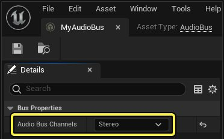
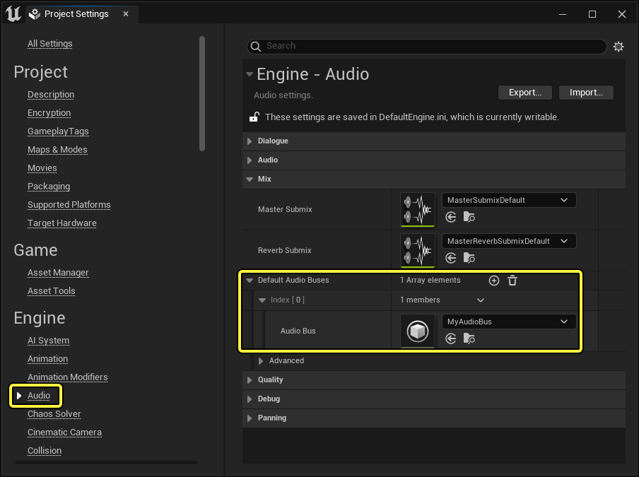
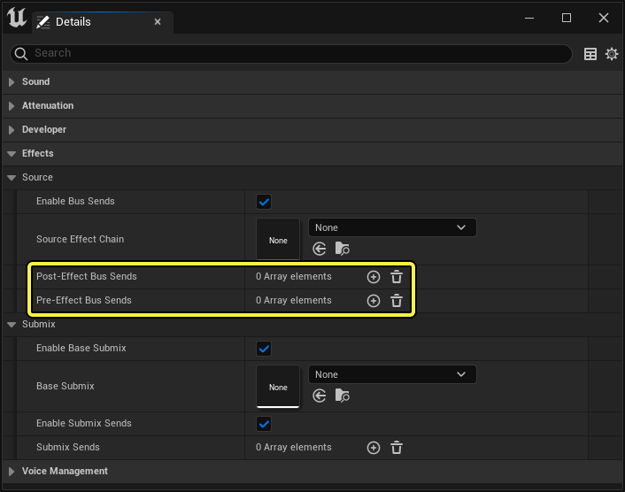
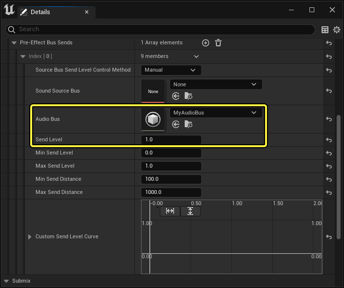
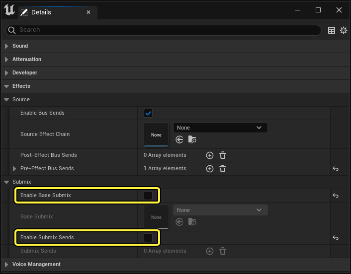
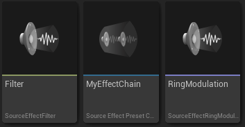
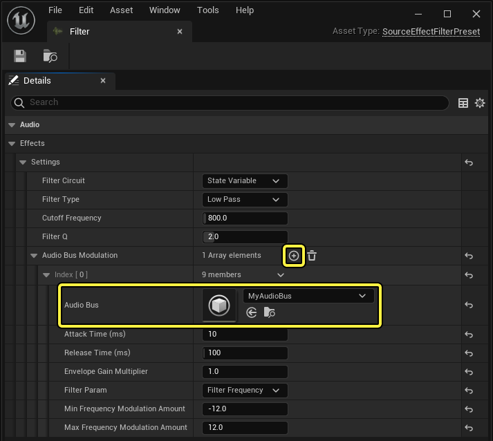
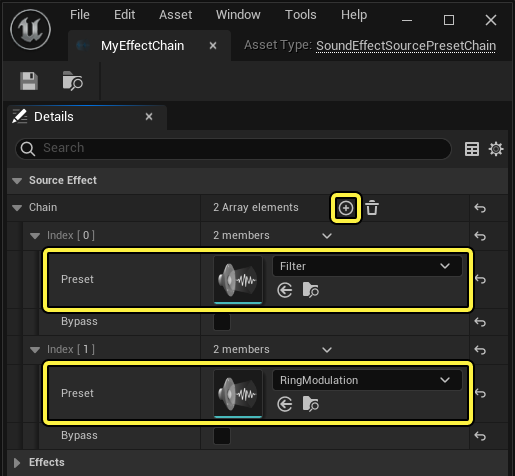

# 音频总线概述

> 路径：虚幻引擎5.7文档 / 处理音频 / 音频混音 / 音频总线概述

> 原始页面：https://dev.epicgames.com/documentation/unreal-engine/audio-bus-overview

在 **虚幻引擎** 中，**音频总线** 将声源组合到同一条信号路径中。

组合的音频信号主要有两种用途：

- 使用该信号对参数或其他信号执行音频速率调制。例如，用于动态控制数字信号处理（DSP）效果参数（称为侧链）。
- 从某个空间点输出混合音频信号。特别是使用渲染的输出在关卡内创建扬声器或其他产生音频的对象。

### 创建音频总线

要创建音频总线，请执行以下操作：

1. 在

   内容浏览器（Content Browser）

   中，单击

   添加（Add）

   按钮。
2. 选择

   音效（Audio）> 混合（Mix）> 音频总线（Audio Bus）

   。

要编辑音频总线，可以在 **内容浏览器（Content Browser）** 中双击该音频总线，或者右键单击该音频总线，然后从上下文菜单中选择 **编辑（Edit）**。然后，在出现的 **细节（Details）** 面板中，设置要使用的 **音频总线声道（Audio Bus Channels）** 数量。

> [!NOTE]
> 如果将音频发送到具有不同声道配置的音频总线，则会相应地进行混合。例如，将单声道声源发送到立体声音频总线就会上混为立体声。

### 将音频发送到音频总线

音频总线必须启动后才能接收音频。通过在 [**项目设置（Project Settings）**](../../../understanding-the-basics/project-settings/engine-settings-in-the-unreal-engine-project-settings/audio-settings-in-the-unreal-engine-project-settings/index.md) 中设置 **默认音频总线（Default Audio Buses）**，可以使指定的音频总线自动启动。

也可以使用 **启动音频总线（Start Audio Bus）** 蓝图节点手动启动音频总线。同样，可以使用 **停止音频总线（Stop Audio Bus）** 蓝图节点停止音频总线。

可在源资产（例如 **声波（Sound Wave）**、**Sound Cue** 或 **MetaSound源（MetaSound Source）**）的 **细节（Details）** 面板中设置要将音频发送到的音频总线。在 **效果（Effects）> 源（Source）** 下，单击 **后效果总线发送（Post-Effect Bus Sends）** 或 **前效果总线发送（Pre-Effect Bus Sends）** 的 **添加（+）（Add (+)）** 按钮，添加会在选择性提供的 **源效果链（Source Effect Chain）** 之前或之后发生的总线发送。

扩展新的总线发送索引以设置 **音频总线（Audio Bus）** 和 **发送等级（Send Level）**。

> [!TIP]
> 可更改 **源总线发送等级控制方法（Source Bus Send Level Control Method）**（与其他相关属性结合使用），基于距离或自定义的曲线进行发送。

如果希望听不到原始源音频（通过仅将这个音频发送到音频总线），则可以在 **细节（Details）** 面板中的 **源（Source）> 子混合（Submix）** 下禁用 **启用基础子混合（Enable Base Submix）** 和 **启用子混合发送（Enable Submix Sends）**。

### 使用音频总线进行音频速率调制

调制是使用信号改变其他音频信号或声音参数的过程。可使用音频总线以音频速率进行调制。

默认情况下，有两个 **源效果预设（Source Effect Preset）** 类允许使用音频总线进行音频速率调制：

- 滤波器（Filter）

  ：音频总线信号将控制滤波器截止频率。
- 环形调制（Ring Modulation）

  ：音频总线信号将乘以输入信号。

要创建源效果预设，请执行以下操作：

1. 在

   内容浏览器（Content Browser）

   中，单击

   添加（Add）

   按钮。
2. 选择

   音效（Audio）> 效果（Effects）> 源效果预设（Source Effect Preset）

   。
3. 从

   选取源效果类（Pick Source Effect Class）

   窗口中可用的类列表中进行选择。

在源效果预设的 **细节（Details）** 面板中可以设置进行调制时使用的音频总线。

创建源效果预设后，必须将其添加到 **源效果预设链（Source Effect Preset Chain）**。

要创建源效果预设链，请执行以下操作：

1. 在

   内容浏览器（Content Browser）

   中，单击

   添加（Add）

   按钮。
2. 选择

   音效（Audio）> 效果（Effects）> 源效果预设链（Source Effect Preset Chain）

   。

在源效果预设链的 **细节（Details）** 面板中可以设置要使用的源效果预设。

> 图片已省略：Source Effect Chain Set

配置源效果预设链后，可以在源的 **细节（Details）** 面板中的 **源（Source）> 源效果链（Source Effects Chain）** 属性中设置这个源效果预设链。指定的源效果预设链将在 **前效果总线发送（Pre-Effect Bus Sends）** 中的任何总线发送之后和 **后效果总线发送（Post-Effect Bus Sends）** 中的任何总线发送之前生效。

### 从音频总线输出音频

默认情况下是听不到音频总线的。要输出音频总线音频，必须使用 **源总线（Source Bus）** 或 **MetaSound源（MetaSound Source）**。

#### 源总线

源总线可以渲染音频总线的输出。源总线可以使用声源功能，例如空间化、衰减和并发解析。源总线甚至可以将音频输出到其他音频总线和源总线。

> [!TIP]
> 源总线仅支持 **单声道（Mono）** 或 **立体声（Stereo）**。使用MetaSound源可以支持其他声道配置。

要创建源总线，请执行以下操作：

1. 在

   内容浏览器（Content Browser）

   中，单击

   添加（Add）

   按钮。
2. 选择

   音效（Audio）> 源（Source）> 源总线（Source Bus）

   。

> 图片已省略：Source Bus Details

在源总线的 **细节（Details）** 面板中设置要渲染的音频总线。此外，还可以选择 **源总线声道（Source Bus Channels）** 数量和 **源总线时长（Source Bus Duration）**。

如果 **源总线时长（Source Bus Duration）** 设置为0，则源总线将无限期播放。使用任意正值可以创建将在该时长后停止的一次性声源。

#### MetaSound源

还可以使用MetaSound源来渲染音频总线音频。在MetaSound图表上，使用 **音频总线读取器（Audio Bus Reader）** 节点读入音频总线数据，然后将该节点连接到相应的输出。

除了单声道和立体声之外，还可以通过相应地设置 **输出格式（Output Format）**，使用MetaSound源创建四声道、5.1和7.1音频。

有关MetaSound的更多信息，请参阅[MetaSound文档](../../sound-source/metasounds/index.md)。

### 音频总线与子混合

音频总线与 **子混合** 类似，但在几个重要方面有所不同：

- 音频总线没有图表。
- 默认情况下听不到音频总线的音频。
- 音频总线提供了一种定义空间化行为的方法。
- 不能直接向音频总线应用DSP效果。
- 音频总线仅在接收源音频时才会使用CPU资源。

请参阅[子混合概述](../../submixes/overview-of-submixes/index.md)，了解有关子混合的更多信息。
