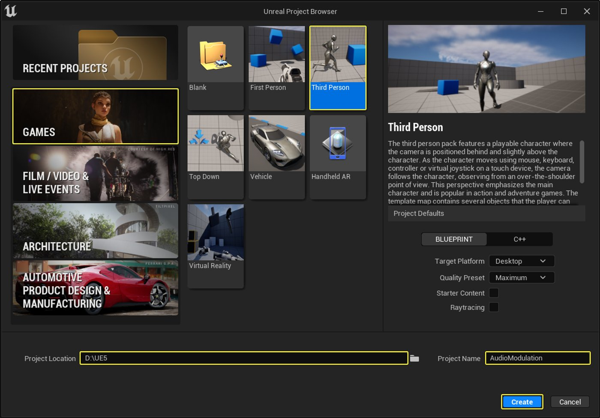
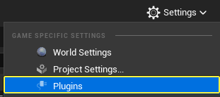
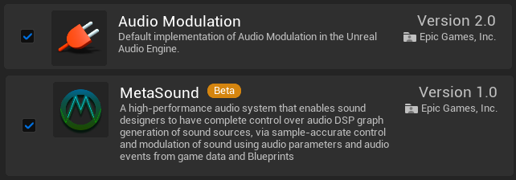
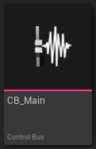
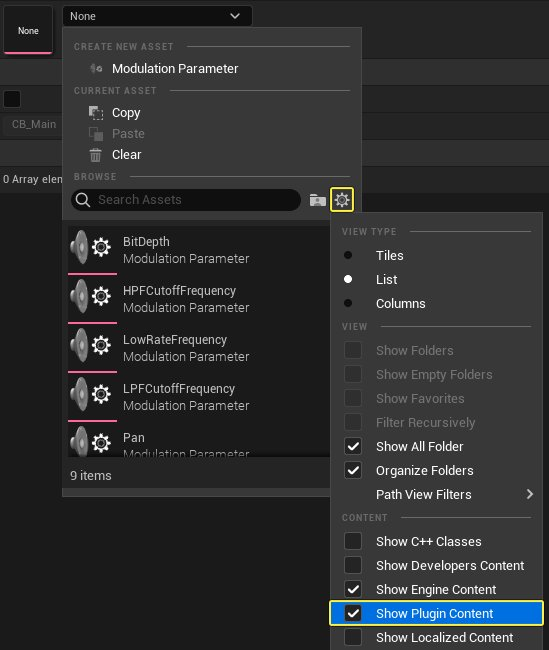
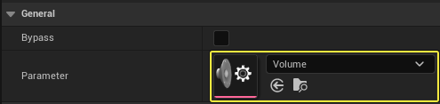
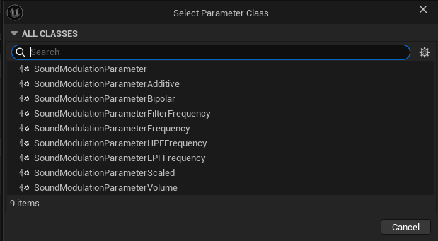
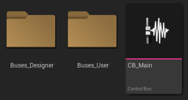

# 音频调制快速入门指南

> 路径：虚幻引擎5.7文档 / 处理音频 / 音频混音 / 音频调制 / 音频调制快速入门指南

> 原始页面：https://dev.epicgames.com/documentation/unreal-engine/audio-modulation-quick-start-guide

## 概述

**音频调制（Audio Modulation）**系统允许对**蓝图（Blueprint）**和**组件（Component）**系统中的一些常见音频参数（浮点类型）进行控制。 与老版本虚幻引擎相比，该系统包含更优秀、更直观且动态的功能集，用于混合音频源以及动态控制和参数化音频属性。

在本指南中，你将学习如何为游戏音频构建基于音量的基本**控制总线（Control Bus）**结构。

## 目标

使用**音频调制插件（Audio Modulation Plugin）**为游戏音频构建基于音量的基本控制总线结构。

## 目的

- 创建控制总线和控制总线**混合对象（Mix objects）**以将音量混合应用于声音资产。
- 将控制总线分配给**MetaSound源（MetaSound Sources）**和**音效类（Sound Classes）**。
- 使用**混合矩阵调试器（Mix Matrix Debugger）**可查看控制总线的当前值。
- 从蓝图调制控制总线。

## 1 - 必要设置

1. 创建新项目并选择**游戏（Games）**类别和**第三人称（Third Person）**模板。 输入项目的位置和名称。 点击**创建（Create）**。

   
2. 点击**设置（Settings） > 插件（Plugins）**打开**插件（Plugins）**窗口。

   
3. 搜索并**启用****音频调制（Audio Modulation）**和**MetaSound**插件。 重启虚幻引擎。

   

### 阶段成果

在本分段中，你创建了新项目并启用了音频调制和MetaSound插件。 现在你可以开始创建控制总线。

## 2 - 创建控制总线

1. 在**内容浏览器（Content Browser）**中，右键点击并选择**音频（Audio） > 调制（Modulation） > 控制总线（Control Bus）**。 将资产命名为`CB_Main`。

   
2. 打开`CB_Main`并点击**参数（Parameter）**下拉菜单。 点击**齿轮**图标并启用**显示插件内容（Show Plugin Content）**复选框 你可能必须选择**显示引擎内容（Show Engine Content）**，因为调制插件是引擎插件。

   
3. 搜索并选择**音量（Volume）**参数（其他参数也可用， 例如频率、声相、音高等）。

   

   > [!NOTE]
   > 你可以右键点击内容浏览器并选择**音频（Audio） > 调制（Modulation） > 调制参数（Modulation Parameter）**来创建自定义参数。 然后，从列表中选择`SoundModulationParameterVolume`类。
   >
   > 
4. 在**内容浏览器（Content Browser）**中创建两个文件夹，分别供设计师和用户存放多个控制总线。 在下面的示例中，这两个文件夹名为`Buses_Designer`和`Buses_User`。

   
5. 右键点击`CB_Main`并选择**复制（Duplicate）**。 将新资产命名为`CB_Ambience`。

   > 图片已省略：右键点击CB_Main并选择“复制”
6. 再重复此过程两次，创建`CB_Foley`和`CB_Footsteps`。 选择所有三个资产并将其移至`Buses_Designer`文件夹。

   > 图片已省略：再重复此过程两次，创建CB_Foley和CB_Footsteps
7. 重复上一步，创建`CB_Dialogue`、`CB_Music`和`CB_SFX`。 将其移至`Buses_User`文件夹。

   > 图片已省略：重复上一步，创建CB_Dialogue、CB_Music和CB_SFX

> [!TIP]
> 最佳做法：不要将控制总线直接放在声音上，而是给这些声音一个适当的音效类（例如 “SFX”音效类、“Music”音效类等），并将控制总线放在类上。

### 阶段成果

在本分段中，你创建了主控制总线，用于调制项目中所有分配的音频的音量。 此外，你创建了供用户和设计师使用的多个控制总线。 你现在可以开始将主控制总线分配给项目中的主音效类。

## 3 - 将控制总线分配给声音资产

1. 点击**设置（Settings） > 项目设置（Project Settings）**，打开**项目设置（Project Settings）** 。

   > 图片已省略：点击“设置 - 项目设置”打开项目设置
2. 向下滚动到**引擎（Engine）**分段并选择**音频（Audio）**类别。 转至**音频（Audio）**分段并双击**主默认音效类（Master Default Sound Class）**将其打开。

   > 图片已省略：向下滚动到引擎分段并选择音频类别

   > 图片已省略：双击主默认音效类将其打开
3. 在**细节（Details）**面板中，转至**调制（Modulation）**分段并启用**音量（Volume）**旁边的**调制（Modulate）**复选框。

   1. 点击**音量调制器（Volume Modulators）**旁边的**+**号并将`CB_Main`添加到**Index[0]**。

   > 图片已省略：转至调制分段并启用音量旁边的调制复选框

   > [!NOTE]
   > 将`CB_Main`控制总线添加到项目中的其他音效类，以便所有声音都使用相同的控制总线进行混合。 调制和混合结构不遵循音效类引用层级。 每个音效类必须列出要应用于引用前述音效类的声音资产的所有控制总线。

### 阶段成果

在本分段中，你将`CB_Main`控制总线分配给了主音效类。 你现在可以创建示例MetaSound，以在Gameplay期间测试混音。

## 4 - 创建示例MetaSound

1. 在**内容浏览器（Content Browser）**中，右键点击并选择**音频（Audio） > MetaSound源（MetaSound Source）**。 将资产命名为`MS_Sample`。

   > 图片已省略：将资产命名为MS_Sample
2. 在**内容浏览器（Content Browser）**中双击打开`MS_Sample`。

   1. 转至左侧的**接口（Interfaces）**面板并点击**UE.Source.OneShot**旁边的**删除**图标将其删除。
   2. 在**事件图表（Event Graph）**中右键点击，然后搜索并选择**Wave Player (Mono)**。
   3. 将**Input**节点连接到**Wave Player**节点的**Play**引脚。
   4. 将**Wave Player**节点的**Out Mono**引脚连接到**Output**节点。

   > 图片已省略：点击UE.Source.OneShot旁边的删除图标

   > 图片已省略：在事件图表中右键点击，然后搜索并选择Wave Player (Mono)

   > 图片已省略：将Wave Player节点的单声道输出引脚连接到Output节点
3. 点击**声波资产（Wave Asset）**下拉菜单并选择声音资产。 该示例选择了**EndPlayInEditor**。

   1. 启用**循环（Loop）**复选框。

   > 图片已省略：点击声波资产下拉菜单并选择声音资产
4. 点击工具栏上的**Source**并向下滚动到**细节（Details）**面板。

   1. 展开**调制（Modulation）**类别。
   2. 点击**音量路由（Volume Routing）**下拉菜单并选择**并集（Union）**。
   3. 启用**音量（Volume）**旁边的**调制（Modulate）**复选框。
   4. 点击**音量调制器（Volume Modulators）**旁边的**+**号并将`CB_SFX`添加到**Index[0]**。

   > 图片已省略：点击工具栏上的源并向下滚动到细节面板

   > 图片已省略：点击音量路由下拉菜单并选择并集
5. 将`MS_Sample`拖入你的关卡中。

   > 图片已省略：将MS_Sample拖入你的关卡中

### 阶段成果

在本分段中，你创建了一个简单的MetaSound，它将持续播放一个声音资产。 你现在可以将控制总线混合应用于控制总线。

## 5 - 应用混音

在本分段中，你将创建**控制总线混合（Control Bus Mix）**并将其应用于`Buses_User`文件夹中的所有**控制总线（Control Buses）**。 你还可以执行这些步骤，为`Buses_Designer`文件夹中的所有控制总线创建控制总线混合。 此外，关于混合中可以包含的内容，并没有严格的规定。

你可以激活多个混音并应用于单个或一组控制总线。 但是，特定混音一次只能有一个实例可以处于活动状态。

1. 在**内容浏览器（Content Browser）**中，右键点击并选择**音频（Audio） > 调制（Modulation） > 控制总线混合（Control Bus Mix）**。 将资产命名为`CM_User`。

   > 图片已省略：将资产命名为CM_User
2. 打开CM_User并转至"混音级（Mix Stages）"分段。

   1. 点击**混音级（Mix Stages）**旁边的**+**号添加新混音。
   2. 点击**总线（Bus）**下拉菜单并选择`CB_Dialogue`。

   > 图片已省略：点击总线下拉菜单并选择CB_Dialogue
3. 重复上一步，将`CB_Music`和`CB_SFX`添加到**混音级（Mix Stages）**。

   > 图片已省略：重复上一步，将CB_Music和CB_SFX添加到混音级
4. 按**播放（Play）**进入运行时。

   1. 按**Shift-F1**重新获得鼠标控制权。
   2. 转至`CM_User`并点击**激活混音（Activate Mix）**。
   3. 更改`CB_SFX`的值，查看实时应用的更改。

   > 图片已省略：转至CM_User并点击“激活混音”

   > 图片已省略：更改CB_SFX的值，查看实时应用的更改

### 阶段成果

在本分段中，你创建了`CM_User`**控制混音（Control Mix）**并将其应用于项目中的控制总线。 你还使用`CB_SFX`控制总线在Gameplay期间激活了混音并更改了声音的音量。

## 6 - 调试混音

1. 在Gameplay期间，按**~**打开**控制台（console）**窗口。

   1. 输入以下命令：`au.Debug.SoundModulators.Enable.Matrix 1`启用声音调制调试。

   > 图片已省略：输入以下命令：au.Debug.Modulation.Enable.Matrix 1
2. 你可以输入以下命令来筛选显示的控制总线和控制混音的列表：`au.Debug.SoundModulators.Filter.Buses \substring`和`au.Debug.SoundModulators.Filter.Mixes \substring`。

   > 图片已省略：你可以输入相应命令来筛选显示的控制总线和控制混音的列表

   > 图片已省略：总线混音矩阵显示CB_SFX

### 阶段成果

在本分段中，你激活了声音调制调试器，并筛选了矩阵以仅显示`CB_SFX`控制总线。

## 7 - 从蓝图调整控制总线

在本分段中，你将在运行时从蓝图激活控制混音。

1. 在**关卡编辑器（Level Editor）**工具栏中点**击蓝图（Blueprint）**按钮并选择**打开关卡蓝图（Open Level Blueprint）**。

   > 图片已省略：选择“打开关卡蓝图”
2. 在**事件图表（Event Graph）**中右键点击，然后搜索并选择**Event Begin Play**。

   > 图片已省略：右键点击，然后搜索并选择Event Begin Play
3. 从**Event Begin Play**节点拖移，然后搜索并选择**Activate Control Bus Mix**。

   1. 点击**混音（Mix）**下拉菜单并选择`CM_User`。

   > 图片已省略：从Event Begin Play节点拖移，然后搜索并选择Activate Control Bus Mix
4. 从**Activate Control Bus Mix**节点拖移，然后搜索并选择**Delay**。

   1. 将**时长（Duration）**设置为**3.0**。

   > 图片已省略：从Activate Control Bus Mix节点拖移，然后搜索并选择Delay
5. 从**Delay**节点拖移，然后搜索并选择**Set Control Bus Mix By Filter**。

   1. 点击**混音（Mix）**下拉菜单并选择`CM_User`。
   2. 将`CB_SFX`添加到**地址过滤器（Address Filter）**。
   3. 输入**值** **0.25**。

   > 图片已省略：从Delay节点拖移，然后搜索并选择Set Control Bus Mix By Filter
6. 按**播放（Play）**并在3秒后验证`CM_User`**控制总线（Control Bus）**是否已激活，以及`MS_Sample`的音量是否降低。

### 阶段成果

在本分段中，你使用`CB_SFX`控制总线激活了`CM_User`控制总线并更改了音频的音量。
