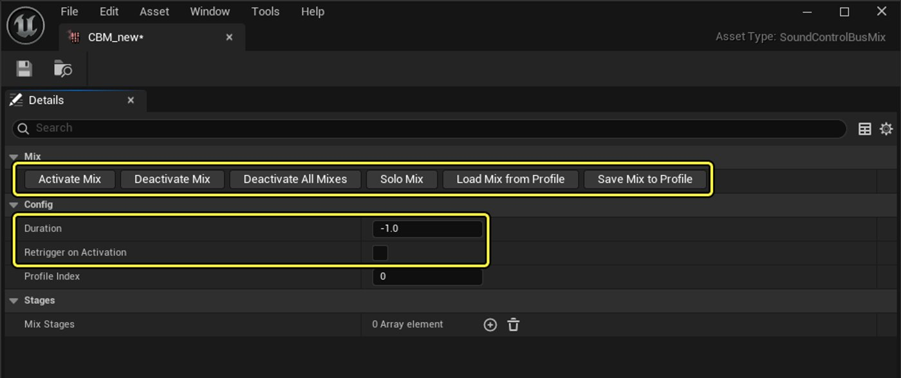
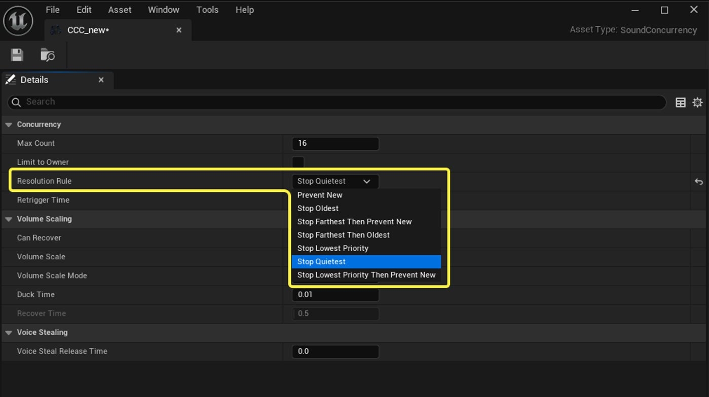

# 音频调制参考指南

> 路径：虚幻引擎5.7文档 / 处理音频 / 音频混音 / 音频调制 / 音频调制参考指南

> 原始页面：https://dev.epicgames.com/documentation/unreal-engine/audio-modulation-reference-guide-in-unreal-engine

**音频调制（Audio Modulation）**插件可以对**组件（Component）**和**蓝图（Blueprint）**系统中的浮点音频参数（例如音量和音高）进行动态控制。

> [!NOTE]
> 音频调制插件默认禁用。 要将其启用，请执行以下步骤：
>
> 1. 选择**编辑（Edit） > 插件（Plugins）**打开**插件（Plugin）**面板。
> 2. 使用搜索栏找到该插件。
> 3. 启用对应复选框。
> 4. 重启虚幻编辑器。

## 资产类型

共有五种资产类型可以提供音频调制（Audio Modulation）的功能。

| 资产类型 | 说明 |
| --- | --- |
| [调制参数](index.md#modulation-parameters) | 这类参数为调制值的规格化、显示和值与值之间的混合提供上下文。 |
| [控制总线](index.md#control-buses) | 引用调制参数的连接器。 |
| [控制总线混合](index.md#control-bus-mixes) | 可同时应用多个控制总线值的调制器。 |
| [参数预设配置](index.md#parameter-patches) | 连接器型调制器，可将多个控制总线值重新映射为一个输出值。 |
| [调制发生器](index.md#modulation-generators) | 连接器型调制器，可随时间推移产生值。 |

你可以使用这些资产为调制通道奠定基础，然后再将调制通道连接到端点[调制目标](index.md#modulation-destinations)。

要创建音频调制资产，请执行以下步骤：

1. 在**内容浏览器（Content Browser）**中点击**添加（Add）**按钮。
2. 找到**音频（Audio ）>调制（Modulation）**，选择所需资产类型。

### 调制参数

**调制参数（Modulation Parameter）**为调制值的规格化、显示和值与值之间的混合提供上下文。

各个调制参数的基础属性如下（根据类的不同，还具有其他属性）：

- **默认参数值（Default Parameter Value）**：默认调制值。 该值起到旁通值的作用，应进行设置，以便引用此参数的调制器与另一个调制器混合时不会改变输入。 从数学上来说，选择的值应该使得在设置为输入时将混音函数有效地简化为[恒等函数](https://en.wikipedia.org/wiki/Identity_function)。
- **单位显示名称（Unit Display Name）**：虚幻编辑器中引用时显示的单位。 此信息仅用于开发目的，因为打包版本中已删除此属性。

内置有多个调制参数类，可支持各种用例，包括音量混合和频率调整。

> [!TIP]
> 音频调制插件包括现成的调制参数资产，可用于音量（Volume）和音高（Pitch）等最常用的参数。
>
> 要在**内容浏览器（Content Browser）**中浏览这些资产，请执行以下步骤：
>
> 1. 点击**设置（Settings）**按钮。
> 2. 启用**显示引擎内容（Show Engine Content）**和**显示插件内容（Show Plugin Content）**。
> 3. 导航到**全部（All）/引擎（Engine）/插件（Plugins）/音频调制内容（Audio Modulation Content）**。

#### 关于调制值

调制值可以在两个值空间之间变换，即：

- **单位（Unit）**：与调制参数关联的单位值。 例如，音量调制参数的单位为分贝（dB）。 单位值会被映射到规格化值。
- **规格化（Normalized）**：规格化值，范围为0.0至1.0，用于统一的传递和混合。

当多个调制器链接到单个调制目标时，调制值会混合。 调制值的组合方式取决于关联的调制参数。 以下示例展示了部分内置调制参数类型对混音的处理方式：

- **音量（Volume）**：音量的降低是可累加的。 例如，如果两个控制总线的值分别为-6 dB和-12 dB，那么调制目标的音量将被设置为-18 dB。
- **高通滤波器频率（High-Pass Filter Frequency）**：选择最高值。 例如，如果两个控制总线的值分别为1000Hz和500Hz，那么调制目标的高通滤波器频率将被设置为1000Hz。
- **低通滤波器频率（Low-Pass Filter Frequency）**：选择最低值。 例如，如果两个控制总线的值分别为1000Hz和500Hz，那么调制目标的低通滤波器频率将被设置为500Hz。

#### 创建自定义调制参数类

要创建自己的调制参数类，你可以继承[USoundModulationParameter](https://dev.epicgames.com/documentation/unreal-engine/API/Plugins/AudioModulation/USoundModulationParameter?application_version=5.5)基类，并实现以下函数：

- [GetMixFunction](https://dev.epicgames.com/documentation/unreal-engine/API/Plugins/AudioModulation/USoundModulationParameter/GetMixFunction?application_version=5.5)：预期会返回一个混合输入值和输出值的函数。
- [GetUnitConversionFunction](https://dev.epicgames.com/documentation/unreal-engine/API/Plugins/AudioModulation/USoundModulationParameter/GetUnitConversionFunction?application_version=5.5)：预期会返回一个将值变换为单位空间的函数。
- [GetNormalizedConversionFunction](https://dev.epicgames.com/documentation/unreal-engine/API/Plugins/AudioModulation/USoundModulationParameter/GetNormalizedCon-?application_version=5.5)：预期会返回一个将值变换为规格化空间的函数。

如需详细信息，请参阅[音频调制C++ API参考](https://dev.epicgames.com/documentation/unreal-engine/API/Plugins/AudioModulation?application_version=5.5)。

### 控制总线

**控制总线（Control Bus）**是引用调制参数的连接器。 控制总线可以：

- 由控制总线混合和调制发生器用于调制。
- 被参数预设配置引用和重新映射。

> [!TIP]
> 一般来说，为每一类要调制的声音单独创建一个控制总线比较好。 声音类别可以是通用的，比如音效（`CB_SFX`），也可以是专用的，比如攻击声音（`CB_Attacks`）。 在此示例中，挥剑声音的调制通道中可以同时拥有两个控制总线。

#### 控制总线属性

| 属性 | 说明 |
| --- | --- |
| **旁通** | 启用后，控制总线会将参数的默认值发送到所附的调制目标。 无论哪种情况，控制总线都保持激活状态。 |
| **参数** | 要使用的调制参数。 给定调制参数的默认值将被用作该控制总线的默认值。 |
| **重载地址** | 启用后，你将可以更改**地址（Address）**属性。 |
| **地址** | 内部引用名称（由某些蓝图函数使用）。 默认为资产的名称，但启用**重载地址（Override Address）**时可以更改此名称。 |
| **发生器** | 以算法方式驱动总线的调制生成器数组。 |

### 控制总线混合

**控制总线混合（Control Bus Mixes）**是调制器，能让你：

- 同时影响多个控制总线值。
- 使用与其他控制总线混合共享的控制总线进行调制。
- 使用混音配置文件实时测试和调整音频。

#### 控制总线混合属性

| 属性 | 说明 |
| --- | --- |
| **激活混合** | [按钮] 按给定的**配置文件索引（Profile Index）**激活所有活动世界中的混音。 |
| **停用所有混音（Deactivate All Mixes）** | [按钮] 停用所有活动世界中的所有混音。 |
| **停用混合** | [按钮] 按给定的**配置文件索引（Profile Index）**停用所有活动世界中的混音。 |
| **从配置文件载入混音（Load Mix from Profile）** | [按钮] 按给定的**配置文件索引（Profile Index）**加载混音。 这将覆盖当前混音中的所有设置。 混音配置文件从`<ProjectDirectory>/Saved/Config/AudioModulation`处的`.ini`文件加载。 |
| **将混合保存到描述文件** | [按钮] 将混音保存到给定的**配置文件索引（Profile Index**）。 这将覆盖索引中的所有设置。 将混音配置文件保存到`<ProjectDirectory>/Saved/Config/AudioModulation`处的`.ini`文件中。 |
| **隔离混音** | [按钮] 按给定的**配置文件索引（Profile Index）**停用所有活动世界中的其他混音，并激活该混音。 仅用于编辑器内测试。 |
| **配置文件索引** | 混音配置文件按钮所针对的混音配置文件的索引（整型）。 每个混音配置文件都有**混音级（Mix Stages）**数组，规定了如何调制所附调制目标。 |
| **混音级** | 一个数组，包含控制总线的引用和相关混音信息。 |
| **混音级（Mix Stages）> 总线（Bus）** | 用于发送**值（Value）**的控制总线。 |
| **混音级（Mix Stages）> 值（Value）** | 要通过控制总线发送的值。 你可以直接将此值设置为单位值或规格化值。 |
| **混音级（Mix Stages）> 起音时间（Attack Time）** | 混音激活时，从调制参数默认值到给定**值（Value）**的持续时间（以秒为单位）。 |
| **混音级（Mix Stages） > 释音时间（Release Time）** | 混音停用时，从给定**值（Value）**到调制参数默认值的持续时间（以秒为单位）。 |
| **时长（Duration）** | 当设置为大于或等于0的值时，混音将在激活时启动计时器。 当计时器达到设置的时长值时，混音将自行停用。 |
| **激活时重新触发** | 控制已被激活的混音再次激活时的行为。 当设置为****False****时，不会发生任何事情（除了时长计时器被重置）。 当设置为****True****时，混音将所有级返回到默认值并激活，让起音再次通过。 这与重新触发波封的行为类似。 |

> [!NOTE]
> 使用控制总线混合**细节（Details）**面板中的混音配置文件按钮，能方便地在**在编辑器中运行（PIE）**模式中实时调整和测试混音。 但是，最终混音控制实现应在蓝图中进行。

控制总线混合的属性已更新，一些涉及控制总线混合的函数具有新**时长**和**激活时重新触发**变量的输入：

### 参数预设配置

**参数预设配置（Parameter Patches）**是连接器型调制器，有两种主要用途：

- 将一个或多个控制总线值变换为单一输出值。
- 你可以将其用于自定义控制总线值的曲线，这有助于值的重新映射和创建不同的淡入淡出效果。

> [!TIP]
> 将连接多个控制总线的参数预设配置分配到一个调制目标，达到的效果类似于为每个控制总线单独设置调制目标。

#### 参数预设配置属性

| 属性 | 说明 |
| --- | --- |
| **旁通** | 启用后，预设配置会将参数的默认值发送到所附的调制目标。 无论哪种情况，参数预设配置都保持激活状态。 |
| **参数** | 用来规定（**输入（Inputs）**中的）控制总线如何混音的调制参数。 |
| **输入** | 一个数组，包含控制总线的引用和相关变换信息。 每一个**输入（Inputs）**的输出都使用调制参数补丁混音函数进行了混合。 如果数组中没有控制总线，预设配置会将参数的默认值发送到所附的调制目标。 |
| **输入（Inputs） > 取样并保持（Sample-And-Hold）** | 启用后，在参数预设配置初始化时存储控制总线值，并在预设配置的生命周期内保留。 |
| **输入（Inputs） > 曲线类型（Curve Type）** | 重映射控制总线规格化数值 [0.0 - 1.0]时要应用的曲线。 选项包括：预设，例如线性（斜入）（Linear (Ramp In)）和正弦（360度）（Sine (360 deg)）。**共享（Shared）**：引用共享**曲线（Curve）**资产。**自定义（Custom）**：设计自定义曲线。 如需更多信息，请参阅[曲线编辑器](../../../../animating-characters-and-objects/cinematics-and-movie-making/unreal-engine-sequencer-movie-tool-overview/animation-curve-editor/index.md)。 |
| **输入（Inputs） > 总线（Bus）** | 输入控制总线。 |

### 调制发生器

**调制发生器（Modulation Generators）**是连接器型调制器，可随时间推移产生值。 若要进行调制，在控制总线或调制目标属性上进行设置即可。

此插件能提供以下类型的实现：

- **低频振荡器（LFO）**：根据给定波形（例如正弦波或方波）的振荡生成数值。
- **包络跟随器**：根据给定音频总线的振幅生成数值。
- **起音衰减波封**：根据给定起音衰减波封生成数值。

#### 创建自定义调制发生器

你可以按照提供给[USoundModulationGenerator](https://dev.epicgames.com/documentation/unreal-engine/API/Plugins/AudioModulation/USoundModulationGenerator?application_version=5.5)类的代码生成模板创建自己的调制发生器。该模板可为发生器的创建和注册生成所需的样板代码。

要创建[USoundModulationGenerator](https://dev.epicgames.com/documentation/unreal-engine/API/Plugins/AudioModulation/USoundModulationGenerator?application_version=5.5)类，请执行以下步骤：

1. 选择**工具（Tools） > 新C++类（New C++ Class）**。
2. 从**选择父类（Choose Parent Class）**窗口中选择**所有类（All Classes）**。
3. 在**SoundModulatorBase**下选择**SoundModulatorGenerator**。

必须实现以下函数：

- `GetValue`：将返回0.0和1.0之间的缓存、规格化、无单位的值。 该值用于监听调制目标。
- `Update`：将实现下一帧缓存值的计算。

你还可以选择实现以下函数：

- `IsBypassed`：将根据发生器值是否应该包含在目标计算中返回一个布尔值。 默认情况下，它会将源自生成的`USoundModulationGenerator Bypass`属性的值转发给虚幻音频引擎。
- `GetDebugValues`：将为每个发生器实例提供字符串数组，以便在运行时使用非发布构建中的`au.Debug.SoundModulators`系列调试命令显示。
- `GetDebugCategories`：将提供与这些实例值提供的值相对应的字段名称的静态数组。

如需详细信息，请参阅[音频调制C++ API参考](https://dev.epicgames.com/documentation/unreal-engine/API/Plugins/AudioModulation?application_version=5.5)。

## 调制目标

**调制目标（Modulation Destination）**是音频对象所附的端点，为该对象（按指定单位）提供基础浮点值，并且该值可以通过音频调制资产进行调制。

以下对象拥有调制目标：

- 声波
- MetaSound源
- 音频组件
- 合成组件
- 音效类
- 子混音
- 源效果（仅限BitCrusher和Chorus）

你可以在**细节（Details）**面板的**调制（Modulation）**模块中找到每个支持音频对象的调制目标。 每个对象都列出了支持的调制目标类型，这些类型决定了调制属性，如音量或音高。

要使用调制目标，必须启用相关的**调制（Modulate）**复选框，然后将所需的连接器（控制总线、调制发生器或参数补丁）添加到数组。

#### 调制目标路由选项

某些调制目标（比如音频组件的调制目标）能提供基于继承的路由选项。 子对象可以从父对象继承调制路由。 具体来说，音频组件可以从所附的声音资产继承，声音可以从所附的音效类继承。

| 路由选项 | 说明 |
| --- | --- |
| **禁用** | 禁用调制路由。 |
| **继承** | 从父对象继承调制路由。 此项为默认选项。因为音效类最常用于设置调制。 |
| **重载** | 使用给定设置重载父对象的调制路由。 |
| **Union** | 同时使用从父对象继承的调制路由和给定的设置。 如果两套设置中的调制器相同，则只计算一次。 |

## MetaSound集成

音频调制插件提供下列MetaSound节点：

- **Get Modulator Value**：返回给定的调制器数值，可能是规格化数值或单位空间数值。
- **Mix Modulators**：返回两个给定调制器之间的混合参数值，可能是规格化数值或单位空间数值。

有关MetaSound的更多信息，请参阅[MetaSound文档](../../../sound-source/metasounds/index.md)。

## 音频调制与并发

有一个CVar可用，它使源上的音量调制影响并发中的**Stop Quietest**选项。 它的名称是： `au.Concurrency.IncludeVolumeModulation`

你可以通过双击**并发资产**，在**并发**选项卡的**解决规则**下找到该菜单。

- 当设置为0时，音量调制不包括在并发评估中。
- 当设置为1时，音量调制将包含在一次性声音中，但不包括循环声音。
- 当设置为2时，音量调制包含在所有声音中

## 蓝图API概览

使用蓝图可以动态地创建和控制调制通道，并驱动其他系统，例如Gameplay或视觉效果等。

大部分和音频调制相关的蓝图函数都位于**音频（Audio） > 调制（Modulation）**下。 函数概览见下表。

| 功能 | 变体 | 说明 |
| --- | --- | --- |
| **激活...** | **控制总线混合** | 激活指定对象。 |
| **清除...** | **所有全局控制总线混合值**、**全局控制总线混合值**、**调制器** | 将指定总线参数重置/取消链接为默认值。 |
| **创建...** | **起音衰减包络发生器**、**控制总线**、**控制总线混合**、**控制总线混合级**、**包络跟随器发生器**、**LFO发生器**、**调制器目标、调制目标** | 根据指定默认值创建对象。对于调制目标，**控制总线**和**发生器**引用计数它们的目标，因此此对象成为其中一个引用。 控制总线和发生器仅在引用计数大于0时才活动。 |
| **停用...** | **所有控制总线混合、****控制总线混合** | 停用指定对象。 |
| **获取调制器** | 不适用 | 获取给定调制目标的调制器。 |
| **获得调制器值** | 不适用 | 获取给定调制器的规格化数值。 |
| **从目的地获取调制器** | 不适用 | 获取当前应用于调制目标的调制器列表。 |
| **获取查看的调制器值** | 不适用 | 获取给定调制目标所监视的调制器的值。 |
| **控制总线混合是否激活** | 不适用 | 检查给定的控制总线混合是否激活。 |
| **从配置文件加载控制总线混合** | 不适用 | 从配置文件加载控制总线混合到UObject混音定义中，并从`.ini`文件中反序列化。 |
| **将控制总线混合保存到描述文件** | 不适用 | 将控制总线混合保存到配置文件，并序列化为`.ini`文件。文件。 如果加载混音，它将使用当前代理的状态。 如果没有加载，它将使用默认的UObject表示。 |
| **设置...** | **控制总线混合**、**按过滤器设置控制总线混合**、**全局控制总线混合值**、**监视的调制器** | 为指定对象设置属性。 通过**Set Control Bus Mix By Filter**函数，你可以使用OSC样式的地址过滤。 |
| **更新...** | **控制总线混合**、**调制器** | 将指定对象的更新提交到音频线程。 |
| **添加调制路由** | 不适用 | 将给定的一组调制器添加到音频组件。 这会执行一次逻辑并集，因此重复的调制器不会被添加。 要完全重载现有设置，请使用**Set Modulation Routing**。 |
| **移除调制路由** | 不适用 | 将给定的一组调制器从音频组件中移除。 这会执行一次逻辑减法运算，因此不在给定组内的调制器将被保留。 |

> [!TIP]
> 除了**音频（Audio） > 调制（Modulation）**组之外，还有其他有用的函数。 特别是**Get Modulators**和**Set Modulation Routing**函数，可为音频组件和合成组件提供重载功能，可用于获取或设置组件的调制目标。

如需详细信息，请参阅[音频调制蓝图API参考](https://docs.unrealengine.com/BlueprintAPI/Audio/Modulation/)。

### 关于UObject和代理

使用音频调制组件和资产时，通常要编辑UObject值。 但出于以下两个原因，音频调制不会直接使用UObject进行处理。

- UObject在游戏线程上运行。
- UObject可能会在音频调制系统无法控制的时间被执行垃圾回收。

因此，UObject中设置的值会被发送到音频渲染线程上音频调制系统中的对象。 必须牢记这一点，因为有些蓝图函数会编辑UObject，而其他函数则会修改音频调制系统中的代理对象。

如果函数只修改UObject值，则需要调用**Update**蓝图函数将这些更改发送到代理对象。 此外，如果先调用一个不修改UObject值的函数，再调用一个更新代理的函数，UObject值将重载代理。

> [!NOTE]
> 虽然音频调制在音频渲染线程上运行，但它以区块速率运行而不以采样速率运行。
