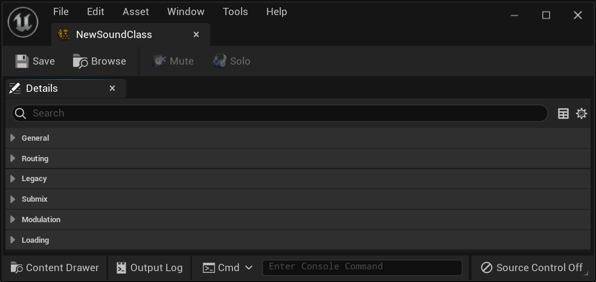
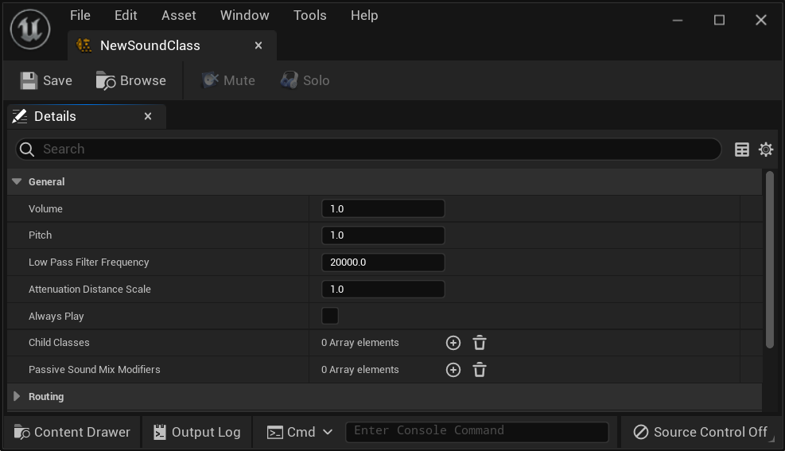
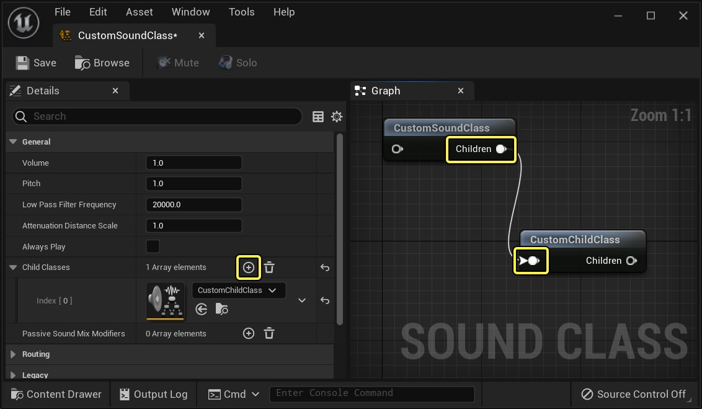
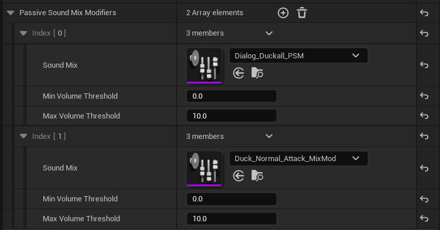
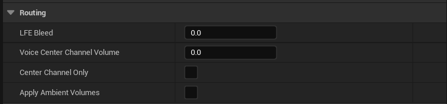
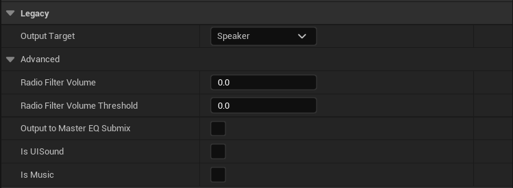
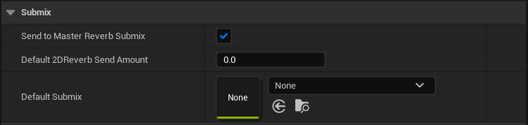
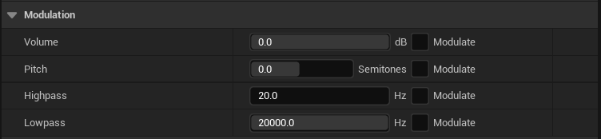

# 音效类

> 路径：虚幻引擎5.7文档 / 处理音频 / 音频混音 / 音效类

> 原始页面：https://dev.epicgames.com/documentation/unreal-engine/sound-classes-in-unreal-engine

**音效类（Sound Class）** 是 **虚幻引擎** 中音频引擎的一种资产类型，用户可以使用音效类将多种声音分组到一起，然后同时修改所有相关声波的参数。

使用 **音效类混音（Sound Class Mixes）**，可以在游戏期间调整很多音效类参数。

要设置新的音效类，请在 **内容浏览器（Content Browser）** 中点击右键，然后选择 **Sounds（音效） > Classes（类） > Sound Class（音效类）**。

要打开某个音效类的 **细节（Details）** 面板，请在内容浏览器中双击该音效类。

## 一般属性

音效类中的第一组参数是一般属性（General Properties）。

**音量（Volume）：**类中每种音效音量的乘数。此属性在声波对象自身的音量设置上起作用。

**音高（Pitch）：**类种每种音效音高的乘数，在声波对象中的音高设置上起作用。

**低通滤波器频率（Low Pass Filter Frequency）:**低通滤波器的截至频率，影响类中的所有音效；值20,000或以上对声波没有影响。

**衰减距离缩放（Attenuation Distance Scale）:**缩放类中每种音效的衰减距离，允许动态调整衰减设置。

**始终播放（Always Play）：**启用后，将阻止音效类中的音效被优先级低于 **始终（Always）** 的音效从声音池弹出。

### 子类

音效类可以将其他类设置为其 **子类（Child Classes）**。

要添加子类，请点击 **子类（Child Classes）** 行中的 **加号（plus） (+)** 图标并从下拉菜单中选择该子类，或者将音效类拖放到图表中并将父类节点中的 **Children** 输出引脚连接到子类节点的输入引脚。

当某个音效类设置为子项后，如果设置为 **继承（Inherited）**（请参见[加载](#loading)），它将从父类继承各种特性，例如音高、音量和加载行为。通过这种方式，用户可以同时改变父类及其任何子类的设置。

### 被动混音修正器

音效类可以具有附加的 **音效类混音（Sound Class Mixes）** 数组，这些混音可以在播放该音效类中的任何音效时自动触发。这些混音被称为 *被动* 混音，因为它们不需要手动激活。

例如，在播放音效类的某个音效时，将会自动触发这些混音，而不需要明确发出 **Push Sound Mix Modifier** 命令。如果需要，你仍然可以通过 **Push** 命令调用混音修正器，并且多个音效类或蓝图可以引用同一混音修正器。

可以为每个被动混音器提供 **最小（minimum）** 和 **最大音量阈值（maximum volume threshold）**，以利用参数化的音量来控制应该何时将其激活。例如，此功能可以防止远处已衰减至不可闻的声音触发混音修正器。

利用此功能，音效设计师可以在EQ中创建复杂的行为和音效类的相对音量，而无需添加大量蓝图触发器。

## 路由

这些设置控制音效类音频如何通过定向信道进行路由，并将环绕音设置考虑在内。

**LFE流入（LFE Bleed）：**应发送到低频效果(LFE)信道的信号的比例。默认为0.5或50%。

**声音中心信道音量（Voice Center Channel Volume）：**应发送到中心信道的信号的比例。这不是乘数，并且此值不会被子项继承。

**仅中心信道（Center Channel Only）：**启用后，仅将音效发送至中心信道。

**应用环境音量（Apply Ambient Volume）：**启用后，音效类中的音效将受到音频音量中环境区域（ Ambient Zone）设置的影响，例如内部/外部音量（Interior/Exterior Volume）和低通滤波器（Low Pass Filter）设置。

## 旧版内容

此选项卡（Legacy）包含在将[音频混合器](../../audio/audio-mixer-overview/index.md)功能添加至虚幻音频引擎之前创建的设置。其中部分内容仅在禁用音频混合器时可用（从4.24版开始，默认启用音频混合器，旧版后端不久后会删除）。

**输出目标（Output Target）：**更改是将音效类中的音效发送至主要扬声器、外部控制器还是控制器（如果没有控制器，则播放至扬声器）。

**无线电滤波器音量（Radio Filter Volume）：**要应用至音效类中音效的无线电滤波器效果的印象。在具有XAudio2后端的Windows和Xbox上可用。

**无线电滤波器音量阈值（Radio Filter Volume Threshold）：**无线电滤波器开始生效的音量。在具有XAudio2后端的Windows和Xbox上可用。

**输出至主EQ子混音（Output to Master EQ Submix）：**如果启用，将会把此音效类的输出中的音效发送至被音频混合器混响系统取代的混响系统。此设置在音频混合器中仍然有效。

Is UISound（是UI音效）：如果启用，音效类中的音效在UI菜单中和正常游戏期间可以听到。此设置在音频混合器中仍然有效。

**是音乐：（Is Music:）**如果启用，此音效将被标记为音乐。

## Submix

音效类中的音效可以发送至 **子混音（Submix）**，这样可以使用子混音效果同时处理多种音效类型。

**发送至主混响发送量（Send to Master Reverb Send Amount）：**启用后，将会把主要混响设置应用至音效类中的音效。

**默认2D混响（Default 2D Reverb）：**要放在非空间化音效上的混响效果的默认数量。

**默认子混音（Default Submix）：**音效类中的音效输出默认发送至的子混音。设置为 **无（None）** 时，输出将发送至项目设置（Project Settings）中指定的音效类默认子混音。

## 调制

如果安装了[调制插件](../audio-modulation/index.md)，则可以将一组调制设置添加到音效类中的所有音效。

## 加载

当为项目启用流缓存后，此设置将控制如何加载压缩的音频数据。

> 图片已省略：Loading Tab Settings

**继承（Inherited）：**设置为此选项时，音效类将从其父音效类中继承加载行为。

**加载时保留（Retain on Load）：**音效类中音效的音频的第一个数据块将保留在缓存中，直至被明确删除。

**加载时填装（Prime on Load）：**加载后，音效类中的音效将保留在缓存中，但如果长期不使用，仍可能被移除，给其他音频腾出空间。

**按需加载（Load on Demand）：**在播放或填装资产之前，不存储音频数据块。

**强制内联（Force Inline）：**强制音效类中的音效仅使用非流送解码路径，不会在缓存中存储音频的任何部分。要求将每项声波资产的加载行为重载（Loading Behavior Override）同样设置为强制内联（Force Inline）。
