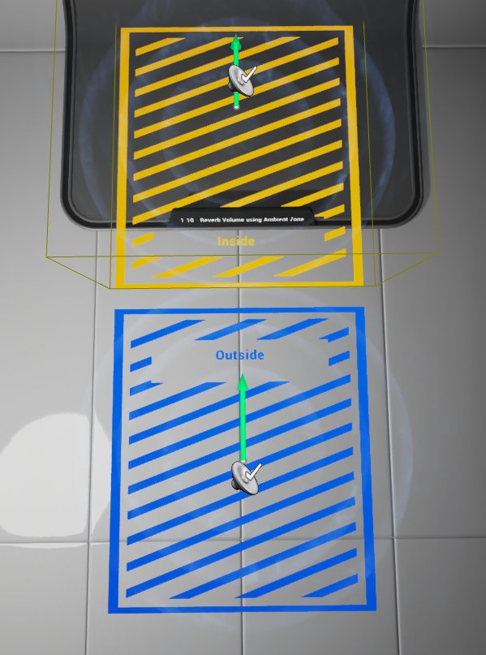
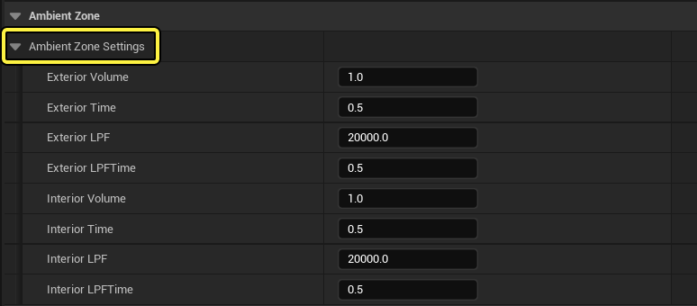
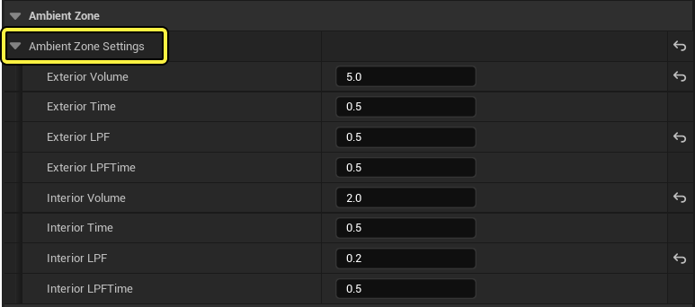
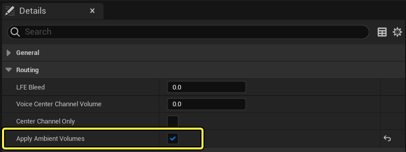
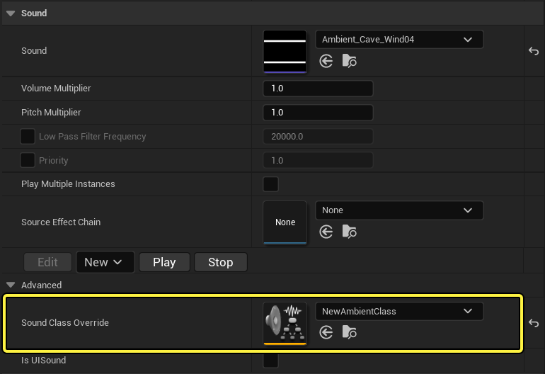

# 环境区域

> 路径：虚幻引擎5.7文档 / 处理音频 / 音频体积Actor / 环境区域

> 原始页面：https://dev.epicgames.com/documentation/unreal-engine/ambient-zones-in-unreal-engine

**Ambient Zones（环境区域）** 是一种廉价的内部/外部环境音效解决方案。环境区域的优点包括：

- 使得当从区域内部到外部变换的过程中声音听上去很好。
- 降低音效设计师的工作量，因为只需要较少的Actor来在内部/外部空间内迭代。
- 降低了游戏系统的性能消耗，因为用于定义内部和外部所需的音效Actor的数量减少了。

## 环境区域设置

环境区域的设置定义了玩家的位置如何改变位于其相关 **音频体积** 内部及外部的音效Actor。

以下是展示了它如何工作的简单示例：

在上面的图片中，标记为 "Inside(内部)" 的部分周围的金色边框是一个环境区域体积；这两个扬声器图标是音效Actor。正如你所看到的，一个音效Actor位于环境区域的内部，而另一个Actor位于环境区域的外部。

以下是当运行关卡时，环境区域的行为：

- 当玩家位于环境区域外部时， 位于该环境区域内的音效Actor将会应用一个音量乘数和LPF效果。
- 当玩家进入环境区域时， 位于该环境区域内的音效Actor，将会在指定淡入淡出时间将音量和LPF乘数乘数恢复为1.0。同时，位于环境区域外部的音效Actor将会在指定的淡入淡出时间内应用一个音量和LPF乘数。
- 当玩家退出环境区域时，在环境区域外部的音效Actor将会经历同样的淡入淡出时间返回到它们先前的默认值默认音量和LPF值，位于环境区域内部的音效Actor将通过环境区域的环境区域设置来改变其音量乘数和LPF的值。

你可以通过展开 **音频体积** 的 **详细信息** 面板来访问 **环境区域设置** 。

| **属性** | **描述** |
| --- | --- |
| **Exterior Volume（外部音量）** | 当玩家在环境区域内部时，外部声音的最终音量。 |
| **Exterior Time（外部淡入淡出时间）** | 淡入淡出到一个新的外部音量所需的时间，以秒为单位。 |
| **Exterior LPF（外部LPF）** | 当玩家在环境区域内部时，应用到外部声效的低通滤波器乘数（使用0.1来应用最大的 LPF） 。 |
| **Exterior LPFTime（外部 LPFTime）** | 淡入淡出到新的低通滤波器级别所需的时间，以秒为单位 。 |
| **Interior Volume(内部音量)** | 当位于该环境区域外时，内部音效的最终音量。 |
| **Interior Time（内部淡入淡出时间）** | 淡入淡出到一个新的内部音量所需的时间，以秒为单位。 |
| **Interior LPF（内部LPF）** | 当玩家在环境区域外部时，应用到外部声效的低通滤波器乘数（使用0.1来应用最大的 LPF） 。 |
| **Interior LPFTime（内部 LPFTime）** | 淡入淡出到新的低通滤波器级别所需的时间，以秒为单位。 |

## 创建环境区域

1. 创建一个

   音频体积

   并把两个

   环境音效Actor

   放置到该关卡中: 一个在该体积内部，另一个在该体积的外面。
2. 给这两个

   环境音效Actor

   都分配一个具有较大半径的循环音效。
3. 在

   音频体积

   的

   详细信息

   面板中，展开

   音频体积

   属性。
4. 展开 **Ambient Zone Settings** 来显示它的属性：

   
5. 在环境区域属性中，设置

   Exterior Volume

   为 .5。

   - 这是当玩家位于环境区域中时，环境区域外部的环境音效的最终音量。
6. 设置

   Exterior LPF

   为 .5

   - 这是当玩家位于环境区域中时，环境区域外部的环境音效的最终低通滤波器。
7. 设置

   Interior Volume

   为 .2

   - 这是当玩家位于环境区域外时，环境区域内部的环境音效的最终音量。
8. 设置

   Interior LPF

   为 .2

   - 这是当玩家位于环境区域外时，环境区域内部的环境音效的最终低通滤波器。
9. 创建一个新的 **Sound Class（音效类）** 并在其属性中选中 **Apply Ambient Volumes**：

   
10. 在内部音效和外部音效的 **详细信息** 面板中将此 **Sound Class** 赋值给这两个音效：

    
11. 重新构建几何体，并进入到具有你刚设置的环境区域的

    音频体积

    。

    - 位于环境区域外面的环境音效的音量和低通滤波器将会乘以.5。
12. 退出

    音频体积

    。

    - 现在，在

      音频体积

      外部的环境音效恢复为它先前的音量和

      LPF

      设置。
    - 现在，位于

      音频体积

      内部的环境音效的音量和 LPF乘数都应用.2，使它变得非常安静。

> [!NOTE]
> 注意： 当在环境区域体积中放置一个 **音效Actor** 时，你必须重新构建关卡的几何体，因为这时会对音效Actor执行检测来决定它的位置。 当重新构建几何体后，可以自由地在编辑器中修改所有的环境区域 参数。
